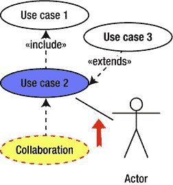
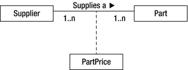
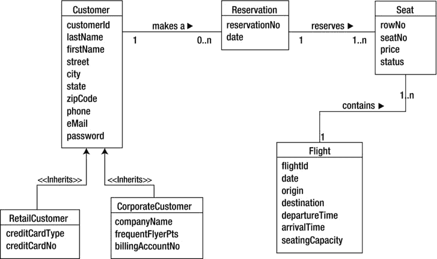

# 二、设计 OOP 解决方案：识别类结构

作为商业软件开发人员，你将参与的大多数软件项目都是团队工作。作为团队中的程序员，您将被要求将设计文档转换成实际的应用代码。此外，因为面向对象程序的设计是一个迭代过程，设计者依赖软件开发者的反馈来提炼和修改程序设计。随着您在开发面向对象软件系统方面获得经验，您甚至可能会被邀请参加设计会议，并对设计过程做出贡献。因此，作为软件开发人员，您应该熟悉各种设计文档的目的和结构，并对这些文档的开发方式有所了解。

本章向您介绍一些用于设计系统静态方面的常用文档。(你将在下一章了解系统的动态方面是如何建模的。)为了帮助您理解这些文档，本章包括一些基于有限案例研究的实践活动。你会在本书的大部分章节中找到与讨论主题相对应的类似活动。

阅读本章后，您将熟悉以下内容:

*   软件设计的目标
*   统一建模语言的基础
*   软件需求规格的目的
*   用例图如何建模系统将提供的服务
*   类图如何对需要开发的对象类建模

软件设计的目标

在开发现代企业级面向对象程序时，组织良好的系统设计方法是必不可少的。设计阶段是软件开发周期中最重要的阶段之一。您可以将许多与失败的软件项目相关的问题追溯到糟糕的前期设计以及系统开发人员和系统消费者之间不充分的沟通。不幸的是，许多程序员和项目经理不喜欢参与系统的设计。他们认为任何不花在生产代码上的时间都是无效的。

更糟糕的是，随着“互联网时代”的到来，消费者期望开发周期越来越短。因此，为了满足不切实际的时间表和项目范围，开发人员倾向于放弃或缩短开发的系统设计阶段。这对系统的成功起反作用。在设计过程中投入时间将实现以下目标:

*   提供一个机会来审查当前的业务流程，并修复任何发现的低效或缺陷
*   教育客户软件开发过程是如何发生的，并让他们作为合作伙伴参与到这个过程中
*   创建现实的项目范围和完成时间表
*   为确定软件测试需求提供基础
*   降低实施软件解决方案所需的成本和时间

软件设计的一个很好的类比是建造一个家的过程。没有建筑师提供的详细计划(蓝图),你不会想到建筑商会开始建造房子。你会期望建筑师在设计蓝图之前和你讨论房子的设计。建筑师的工作就是倾听你的要求，并把它们转化成建筑者可以用来建造房屋的平面图。一个好的架构师还会告诉你哪些特性对你的预算和预计的时间表是合理的。

理解统一建模语言

为了成功地设计面向对象的软件，您需要遵循一个经过验证的设计方法。如今，OOP 中使用的一种经过验证的设计方法是统一建模语言(UML)。UML 开发于 20 世纪 80 年代早期，作为对面向对象软件设计建模的标准、系统方法的需求的回应。该行业标准由对象管理小组(OMG)创建和管理。UML 已经随着软件行业的发展而成熟，当前版本 2.4.1 于 2011 年正式发布。

在设计过程中使用 UML 有很多好处。当正确实现时，UML 允许您在不同的细节层次上可视化软件系统。您可以与用户一起验证项目的需求和范围。它也可以作为测试系统的基础。UML 非常适合增量开发过程。UML 建模对于大型系统的并行开发也非常有益。使用该模型，每个团队都知道他们的部分如何适应系统，并可以传达可能影响其他团队的变化。

UML 由所提议的解决方案的一系列文本和图形模型组成。这些模型定义了系统范围、系统组件、用户与系统的交互，以及系统组件如何相互交互以实现系统功能。

UML 中使用的一些常见模型如下:

*   *软件需求说明书 (SRS)* : 对系统整体职责和范围的文字描述。
*   *用例* : 从用户的角度对系统行为的文本/图形描述。用户可以是人类或其他系统。
*   类图 : 将用于构建系统的对象的可视化蓝图。
*   *序列图* : 程序执行时对象交互序列的模型。重点放在交互的顺序以及它们如何随时间进行。
*   协作图 : 程序执行时，对象如何组织在一起工作的视图。重点放在对象之间的通信上。
*   *活动图* : 流程或操作执行流程的可视化表示。

在这一章中，你将会看到 SRS 的开发，用例，以及类图。[第 3 章](03.html)涵盖了顺序图、协作图和活动图。

制定安全气囊系统

SRS 的目的是完成以下工作:

*   定义系统的功能需求。
*   确定系统的边界。
*   识别系统的用户。
*   描述系统和外部用户之间的交互。
*   在客户和程序团队之间建立一种描述系统的通用语言。
*   为用例建模提供基础。

要制作 SRS，您需要采访业务所有者和系统的最终用户。这些访谈的目标是清楚地记录所涉及的业务流程，并确定系统的范围。该过程的结果是一份详细说明系统功能要求的正式文件(SRS)。正式文档有助于确保客户和软件开发人员之间达成一致。随着开发的进行，SRS 还为解决任何关于感知系统范围的分歧提供了基础。

例如，假设一家小型通勤航空公司的所有者希望客户能够使用 Web 注册系统查看航班信息并预订机票。与业务经理和票务代理面谈后，软件设计师起草一份 SRS 文档，列出系统的功能需求。以下是其中的一些要求:

*   未注册的网络用户可以浏览网站查看航班信息，但他们不能预订航班。
*   想要预订航班的新客户必须填写登记表，提供他们的姓名、地址、公司名称、电话号码、传真号码和电子邮件地址。
*   客户分为公司客户和零售客户。
*   客户可以根据目的地和出发时间搜索航班。
*   客户可以在预订航班时注明航班号和所需座位数。
*   预订航班后，系统会通过电子邮件向客户发送确认信息。
*   当公司客户的员工预订航班时，他们会获得常旅客里程。
*   常旅客里程用来对未来的购买打折。
*   机票预订可提前一周取消，并可获得 80%的退款。
*   票务代理可以查看和更新航班信息。

在这个部分 SRS 文档中，您可以看到几个简洁的语句定义了系统范围。它们从系统用户的角度描述系统的功能，并确定将使用它的外部实体。需要注意的是，SRS 不包含对系统技术要求的参考。

一旦 SRS 被开发出来，它所包含的功能需求就被转化为一系列的用例图。

引入用例

用例描述了外部实体将如何使用系统。这些外部实体可以是人或者其他系统(在 UML 术语中称为*参与者*)。描述强调用户对系统的看法以及用户和系统之间的交互。用例有助于进一步定义系统范围和边界。它们通常以图表的形式，伴随着对正在发生的交互的文本描述。[图 2-1](#Fig1) 显示了一个通用图，它由两个参与者组成，用简笔画表示，用矩形表示系统，用椭圆表示系统边界内的用例。

[图 2-1](#_Fig1) 。有两个参与者和三个用例的通用用例图

用例是根据 SRS 文档开发的。参与者是与系统交互的任何外部实体。参与者可以是一个人类用户(例如，一个租赁代理)，另一个软件系统(例如，一个软件计费系统)，或者一个接口设备(例如，一个温度探测器)。参与者和系统之间发生的每个交互都被建模为一个用例。

图 2-2 中显示的示例用例是为上一节中介绍的机票预订应用开发的。它显示了需求“客户可以根据目的地和出发时间搜索航班”的用例图。

[图 2-2](#_Fig2) 。查看航班信息用例

除了用例的图形化描述，许多设计人员和软件开发人员发现提供用例的文本描述很有帮助。文字描述应该简洁明了，集中在正在发生的事情上，而不是它是如何发生的。有时，与用例相关的任何先决条件或后置条件也被识别。下文进一步描述了图 2-2 中[所示的用例图。](#Fig2)

*   *描述*:顾客查看航班信息页面。客户输入航班搜索信息。提交搜索请求后，客户查看符合搜索条件的航班列表。
*   *前提条件*:无。
*   *后置条件*:客户有机会登录并进入机票预订页面。

再举一个例子，看看[图 2-3](#Fig3) 中显示的预留座位用例。

[图 2-3](#_Fig3) 。预订座位用例图

下文进一步描述了图 2-3 中[所示的用例图。](#Fig3)

*   *描述*:顾客输入航班号，并指出所要求的座位。客户提交请求后，会显示一些确认信息。
*   *前提条件*:客户已经查询了航班信息。客户已经登录并正在查看航班预订屏幕。
*   *后置条件*:向客户发送一封确认电子邮件，概述航班详情和取消政策。

正如你从[图 2-3](#Fig3) 中看到的，在用例之间可以存在某些关系。预订座位用例包括查看航班信息用例。这种关系非常有用，因为您可以独立于预订航班用例使用查看航班信息用例。这叫包容。然而，您不能将预订座位用例与查看航班信息用例分开使用。这是将影响您如何对解决方案建模的重要信息。

用例相互关联的另一种方式是通过扩展。你可能有一个通用用例，它是其他用例的基础。其他用例扩展了基本用例。例如，您可能有一个注册客户用例，它描述了注册客户的核心过程。然后，您可以开发注册公司客户和注册零售客户用例，扩展基本用例。扩展和包含之间的区别在于，在扩展中，被扩展的基本用例不会单独使用。图 2-4 展示了你如何在用例图中建模。

[图 2-4](#_Fig4) 。扩展用例

开发用例时的一个常见错误是包含由系统本身发起的动作。用例的重点是外部实体和系统之间的交互。另一个常见的错误是包含系统技术需求的描述。请记住，用例并不关注系统将如何执行功能，而是关注从用户的角度来看，什么功能需要被整合到系统中。

在您开发了系统的用例之后，您可以开始识别将执行系统功能需求的内部系统对象。您可以使用类图来实现这一点。

**活动 2-1。创建用例图**

完成本活动后，您应该熟悉以下内容:

*   如何生成用例图来定义系统的范围
*   如何使用 UML 建模工具创建并记录用例图

**检查安全气囊**

你所属的软件用户组决定集中资源，创建一个借阅图书馆。借出的物品包括书籍、电影和电子游戏。您的任务是开发一个应用，该应用将跟踪借出物品的库存以及向小组成员借出物品的情况。在与小组成员和官员面谈后，您制定了一份 SRS 文件，其中包括以下功能要求:

*   只有用户组的成员才能借阅物品。
*   书可以借四周。
*   电影和游戏可以借一个星期。
*   如果没有人在等着借阅，可以续借。
*   会员一次最多只能借四件物品。
*   当项目过期时，会通过电子邮件向成员发送提醒。
*   过期的项目要罚款。
*   有未偿还的过期项目或罚款的成员不能借新项目。
*   秘书负责维护项目库存和采购项目以添加到库存中。
*   已经任命了一名图书管理员来跟踪借阅情况并发送过期通知。
*   图书管理员还负责收集罚款和更新罚款信息。

接下来的步骤是分析 SRS 以识别参与者和用例。

1.  通过检查 SRS 文档，确定以下哪些是与系统交互的主要参与者:
    *   A.成员
    *   B.图书管理员
    *   C.书
    *   D.出纳员
    *   E.库存
    *   F.电子邮件
    *   G.秘书
2.  一旦您确定了主要参与者，您就需要确定参与者的用例。确定与以下用例相关的参与者:
    *   A.请求项目
    *   B.目录项目
    *   C.借出项目
    *   D.加工精细

活动 2-1 答案见本章末尾。

**创建用例图**

尽管手工或在白板上创建 UML 图是可能的，但大多数程序员最终会求助于图表工具或计算机辅助软件工程(CASE)工具。 CASE 工具帮助您构建专业质量的图表，并使团队成员能够轻松地共享和扩充图表。市场上有许多 CASE 工具，包括 Microsoft Visio。在选择 CASE 工具之前，您应该彻底评估它是否满足您的需求，是否足够灵活。许多与高端 CASE 工具相关的高级特性很难使用，所以你花更多的时间去弄清楚 CASE 工具是如何工作的，而不是记录你的设计。

一个很好的学习绘图工具是 UMLet。UML let 使您能够创建 UML 图，而无需添加许多与高端 CASE 工具相关的高级特性。最棒的是，UMLet 是一个免费的开源工具，可以从`www.umlet.com`下载。

 **注意**这些活动使用的是 UMLet 11.5.1 单机版。这也需要在`www.java.com`可用的 Java 1.6。

在下载并安装了 UMLet 之后，您可以完成以下步骤(如果您不想使用工具，您可以手工创建用例图):

1.  双击 UMLet.jar 文件启动 UMLet。您将看到三个窗口。主窗口是设计图面，右上角的窗口包含 UML 对象模板，右下角的窗口是您更改或添加对象属性的地方。
2.  Locate the actor template in the upper right window (see [Figure 2-5](#Fig5)). Double click the actor template. An actor will appear in the upper left corner of the design surface.

    

    [图 2-5](#_Fig5) 。定位演员模板

3.  如果尚未选择，请在设计图面上选择参与者形状。在右下窗口中，将执行元形状的名称更改为 Member。
4.  重复添加秘书和图书管理员执行元的过程。
5.  从“模板”窗口中，双击“用例 1”形状，将其添加到设计图面。将用例的名称更改为 Request Item。
6.  对另外两个用例重复步骤 5。包括当秘书向图书馆目录数据库添加新项目时将发生的目录项目用例。添加将在图书管理员处理项目请求时发生的借出项目用例。
7.  From the Template window, double click the Empty Package shape and change the name to Library Loan System. Right click on the shape in the design surface and change the background color to white. Move the use case shapes inside the Library Loan System shape (see [Figure 2-6](#Fig6)).

    

    [图 2-6](#_Fig6) 。将用例放入系统边界

8.  From the Template window, double click on the Communications Link shape. It is the line with no arrow heads (see [Figure 2-7](#Fig7)). On the design surface, attach one end to the Member shape and the other end to the Request Item shape.

    

    [图 2-7](#_Fig7) 。定位通信链路形状

9.  重复步骤 8 两次，在“图书管理员”和“出借”项目形状之间创建一个“通信链接”形状，并在“秘书”和“目录项目”形状之间创建一个“通信链接”形状。
10.  在模板窗口中，双击扩展关系箭头。将扩展箭头的尾端连接到借出项目用例，并将箭头的头部连接到请求项目用例。
11.  Your completed diagram should be similar to the one shown in [Figure 2-8](#Fig8). Save the file as UMLAct2_1 and exit UMLet.

    

    [图 2-8](#_Fig8) 。完整的用例图

理解类图

类和对象的概念是面向对象的基础。对象是用于合并数据和处理数据的过程的结构。这些对象实现了面向对象程序的功能。把一个类想象成一个对象的蓝图，把一个对象想象成一个类的实例。类定义了基于类类型的对象将包含的结构和方法。

设计者从 SRS 和用例图中识别出他们需要开发的类的潜在列表。识别类的一种方法是查看 SRS 文档中的名词短语和用例描述。如果您查看到目前为止为机票预订应用开发的文档，您可以开始确定组成系统的类。例如，您可以开发一个处理客户数据的`Customer`类和一个处理航班数据的`Flight`类。

一个类负责管理数据。在定义类结构时，你必须确定类负责维护什么数据。类属性定义了这些信息。例如，`Flight`类将具有标识航班号、出发时间和日期、飞行持续时间、目的地、容量和可用座位的属性。类结构还必须定义将对数据执行的任何操作。`Flight`类负责的操作的一个例子是当座位被预订时更新可用的座位。

类图可以帮助您可视化类的属性和操作。 [图 2-9](#Fig9) 是航班预订系统示例中使用的`Flight`类的类图示例。分成三部分的矩形代表该类。矩形的上半部分显示了类的名称，中间部分列出了类的属性，下半部分列出了类执行的操作。

[图 2-9](#_Fig9) 。飞行等级图

建模对象关系

在面向对象程序设计中，当程序执行时，各种对象协同工作来完成编程任务。例如，在机票预订应用中，为了预订航班座位，一个`Reservation`对象必须与`Flight`对象进行交互。两个对象之间存在关系，这种关系必须在程序的类结构中建模。组成程序的类之间的关系在类图中建模。分析 SRS 中的动词短语通常会揭示这些关系(这将在第 3 章的[中详细讨论)。接下来的部分研究了类之间可能出现的一些常见关系，以及类图如何表示它们。](03.html)

联合

当一个类引用或使用另一个类时，这些类就形成了一个关联。在两个类之间画一条线来表示关联，并添加一个标签来表示关联的名称。例如，在机票预订应用中，一个座位与一个航班相关联，如图[图 2-10](#Fig10) 所示。

[图 2-10](#_Fig10) 。类别关联

有时一个类的单个实例与另一个类的多个实例相关联。这在连接两个类的线上有所表示。例如，当客户进行预订时，`Customer`类和`Reservation`类之间存在关联。一个`Customer`类的实例可能与多个`Reservation`类的实例相关联。放置在`Reservation`类附近的 *n* 表示这种多重性，如图[图 2-11](#Fig11) 所示。

[图 2-11](#_Fig11) 。在类图中指示多重性

还可能存在一种情况，其中一个类的实例可能与同一类的多个实例相关联。例如，`Pilot`类的一个实例代表机长，而`Pilot`类的另一个实例代表副驾驶。飞行员管理副驾驶。这种场景被称为自关联，通过绘制从类到自身的关联线来建模，如图[图 2-12](#Fig12) 所示。

[图 2-12](#_Fig12) 。一个自我联想的班级

遗产

当多个类共享一些相同的操作和属性时，基类可以封装共性。然后子类从基类继承。这在类图中用一条实线表示，该实线带有一个指向基类的开放箭头。例如，`CorporateCustomer`类和`RetailCustomer`类可以从基础`Customer`类中继承公共属性和操作，如图[图 2-13](#Fig13) 所示。

[图 2-13](#_Fig13) 。记录继承

聚合

当一个类由其他类组合而成时，它们被归类为一个集合。这用连接分层结构中的类的实线来表示。在图中的类旁边的线上放置一个菱形表示层次结构的顶层。例如，一个为飞机维修部门设计的跟踪飞机零件的库存应用可以包含一个由各种零件类组成的`Plane`类，如图[图 2-14](#Fig14) 所示。

[图 2-14](#_Fig14) 。描绘聚合

关联类

随着程序的类和关联的发展，可能会出现这样的情况，一个属性不能被分配给任何一个类，而是类之间关联的结果。例如，前面提到的零件库存应用可能有一个`Part`类和一个`Supplier`类。因为一个零件可以有多个供应商，并且供应商供应多个零件，那么价格属性应该位于哪里呢？它不适合作为任何一个类的属性，也不应该在两个类中重复。解决方案是开发一个关联类，它管理作为关联产品的数据。在这种情况下，你可以开发一个`PartPrice`类。关联和关联类之间用虚线建模，如图[图 2-15](#Fig15) 所示。

[图 2-15](#_Fig15) 。联想类

[图 2-16](#Fig16) 显示了机票预订应用的演化类图。它包括已经为系统确定的类、属性和关系。与这些类相关的操作将在[第 3 章](03.html)中展开。

[图 2-16](#_Fig16) 。机票预订类图

**活动 2-2。创建类图**

完成本活动后，您应该熟悉以下内容:

*   如何通过检查用例以及系统范围文档来确定需要构建的类
*   如何使用 UML 建模工具创建类图

**识别类别和属性**

检查为用户组库应用的用例开发的以下场景:

查看可用借出项目列表后，成员请求借出一个项目。图书管理员输入会员号，并检索有关未偿还贷款和任何未付罚款的信息。如果成员的未偿还贷款少于四笔，并且没有任何未偿还的罚款，则处理贷款。图书管理员检索关于借出项目的信息，以确定它当前是否被借出。如果项目可用，它将被签出给成员。

1.  通过识别用例场景中的名词和名词短语，您可以了解为了执行任务，您必须在系统中包含什么类。以下哪一项将成为系统的良好候选类别？
    *   A.`Member`
    *   B.`Item`
    *   C.`Librarian`
    *   D.`Number`
    *   E.`Fine`
    *   F.`Checkout`
    *   G.`Loan`
2.  此时，您可以开始识别与正在开发的类相关联的属性。将开发一个`Loan`类来封装与借出项目相关的数据。下面哪个可能是`Loan`类的属性？
    *   A.`MemberNumber`
    *   B.`MemberPhone`
    *   C.`ItemNumber`
    *   D.`ReturnDate`
    *   E.`ItemCost`
    *   F.`ItemType`

活动 2-2 答案见本章末尾。

**创建类图**

要使用 UML Modeler 创建一个类图，请遵循以下步骤(您也可以手工创建):

1.  启动 UMLet。您将看到三个窗口。主窗口是设计图面，右上角的窗口包含 UML 对象模板，右下角的窗口是您更改或添加对象属性的地方。
2.  Locate the SimpleClass template in the upper right window (see [Figure 2-17](#Fig17)). Double click the SimpleClass template. A SimpleClass will appear in the upper left corner of the design surface.

    

    [图 2-17](#_Fig17) 。添加类形状

3.  在右下方的属性窗口中，将类名更改为`Member`。
4.  对`Loan`、`Item`、`Book`和`Movie`级重复该程序。
5.  Locate the association template in the upper right window (see [Figure 2-18](#Fig18)). Double click the association template. An association will appear in the upper left corner of the design surface.

    

    [图 2-18](#_Fig18) 。添加关联形状

6.  Attach the left end of the association shape to the `Member` class and the right end to the `Loan` class shape. Select the association shape and update the properties in the properties window so that they match [Figure 2-19](#Fig19).

    

    [图 2-19](#_Fig19) 。更新关联属性

7.  重复步骤 5 和 6，在`Loan`类和`Item`类之间创建一个“包含一个”关联形状。这应该是一对一的关联。
8.  Locate the generalization arrow template in the upper right window (see [Figure 2-20](#Fig20)). Double click the generalization shape. A generalization shape will appear in the upper left corner of the design surface.

    

    [图 2-20](#_Fig20) 。添加一个概括箭头

9.  Attach the tail end of the generalization arrow to the `Book` class and the head end to the `Item` class shape. Select the generalization arrow and update the properties in the properties widow so that they match [Figure 2-21](#Fig21).

    

    [图 2-21](#_Fig21) 。更新综合属性

10.  重复第 8 步和第 9 步，显示`Movie`类继承自`Item`类。
11.  Click on the `Member` class in the design window. In the properties window, add the `memberNumber`, `firstName`, `lastName`, and `eMail` attributes as shown in [Figure 2-22](#Fig22).

    

    [图 2-22](#_Fig22) 。添加类属性

12.  Your completed diagram should be similar to [Figure 2-23](#Fig23). Save the file as UMLAct2_2.

    

    [图 2-23](#_Fig23) 。完成的类图

摘要

在这一章中，你已经了解了面向对象设计过程和 UML 的目标。您学习了一些使用 UML 生成的设计文档和图表。这些包括 SRS，它定义了系统的范围；用例图，它定义了系统边界，并确定了将使用该系统的外部实体；和类图，它们对将要开发来实现系统的类的结构进行建模。

您看到了如何对应用的类结构进行建模，包括识别必要的类，识别这些类的属性，以及建立这些类之间所需的结构关系。在[第三章](03.html)中，你将继续学习面向对象设计。特别是，您将看到应用中的对象如何协作来实现应用的功能。

**活动答案**

**活动 2–1 答案**

1.  演员是会员、图书管理员和秘书。
2.  A.会员，b 秘书，c 图书管理员，d 图书管理员。请求项用例与成员一起使用，目录项用例与秘书一起使用，借出项用例与图书管理员一起使用，流程精细用例与图书管理员一起使用。

**活动 2–2 答案**

1.  a、B、C、E、g，候选班有`Member`、`Item`、`Librarian`、`Fine`、`Loan`。
2.  与`Loan`类相关的属性有`MemberNumber`、`ItemNumber`和`ReturnDate`。