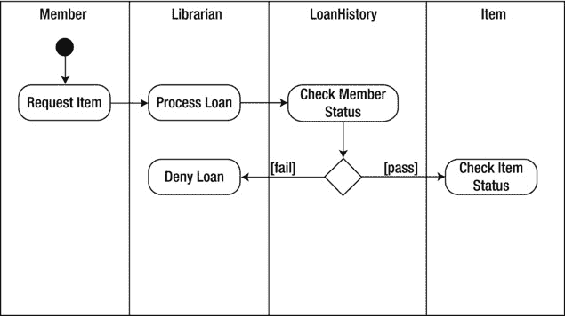

# 三、设计 OOP 解决方案：建模对象交互

前一章关注于 OOP 解决方案的静态(组织)方面的建模。它介绍并讨论了 UML 的方法论。它还研究了用例图和类图的目的和结构。这一章继续讨论 UML 建模技术，并重点关注 OOP 解决方案的动态(行为)方面的建模。本章的重点是系统中的对象必须如何相互作用，以及必须发生什么活动来实现解决方案。这是建模过程的一个重要方面。这些模型将作为对构成软件应用的类的各种方法(在第 2 章中确定)进行编码的基础。

阅读本章后，您应该熟悉以下内容:

*   场景的目的以及它们如何扩展用例模型
*   序列图如何对系统中对象的时间相关交互进行建模
*   活动图如何映射应用处理期间的活动流
*   图形用户界面设计的重要性以及它如何适应面向对象的设计过程

了解场景

场景帮助确定系统的对象(类实例)之间将要发生的动态交互。场景是对实现用例所记录的功能所需的内部处理的文本描述。记住用例从系统外部用户的角度描述系统的功能。一个场景详述了用例的执行。换句话说，它的目的是描述组成系统的对象必须在内部执行的步骤。

[图 3-1](#Fig1) 显示了一个视频租赁应用的流程电影租赁用例 。以下文本描述了使用案例:

*   前提条件:客户向租赁人员请求租赁一部电影。该客户是视频俱乐部的会员，并向租赁店员提供了她的会员卡和个人身份号码(p in)。验证客户的会员资格。显示客户信息，并验证客户的帐户信誉良好。
*   描述:电影确认有货。记录租赁信息，并通知客户到期日期。
*   岗位条件:无。

[图 3-1](#_Fig1) 。处理电影租赁用例

以下场景描述了流程电影租赁用例的内部处理:

*   电影经核实有现货。
*   库存中的可用份数减少。
*   到期日已确定。
*   租赁信息被记录。这些信息包括电影标题、拷贝数、当前日期和到期日期。
*   客户被告知租赁信息。

这个场景描述了用例的最佳可能执行。因为异常可能发生，一个用例可以产生多个场景。例如，为流程电影租赁用例创建的另一个场景可以描述当电影没有库存时会发生什么。

在您为一个用例规划出各种场景之后，您可以创建交互图来确定哪些类的对象将参与执行场景的功能。交互图还揭示了这些对象类需要什么操作。交互图有两种风格:序列图和协作图。

序列图介绍

一个序列图模拟了当系统运行时，对象类如何随着时间的推移而相互作用。序列图是正在发生的交互的可视化二维模型，并且基于一个场景。[图 3-2](#Fig2) 显示了一个通用顺序图。

[图 3-2](#_Fig2) 。通用序列图

如图 3-2 所示，从一个对象到另一个对象的消息流是水平的。交互发生的时间流程是垂直描述的，从顶部开始向下进行。根据调用顺序，对象从左到右并排放置。虚线从它们中的每一个向下延伸。这条虚线代表对象的生命线。生命线上的矩形代表对象的激活。矩形的高度表示对象激活的持续时间。

在 OOP 中，对象通过相互传递消息来进行交互。从发起对象开始到接收对象结束的箭头描述了交互。拉回到发起对象的虚线箭头表示返回消息。序列图中描述的消息将形成系统的类的方法的基础。[图 3-3](#Fig3) 显示了上一节中介绍的流程电影租赁场景的示例序列图。在这一点上，该图只模拟了电影有库存的情况。

[图 3-3](#_Fig3) 。流程电影租赁顺序图

当你分析序列图时，你会对执行程序处理所涉及的对象类别有所了解；您还将了解需要创建哪些方法并附加到这些类。您还应该在类图中对序列图中描述的类和方法进行建模。这些设计文件必须不断交叉引用，并在必要时进行修订。

[图 3-3](#Fig3) 中的序列图揭示了执行流程电影租赁场景将涉及四个对象。

*   `Customer`对象是`Customer`类的一个实例，负责封装和维护关于客户的信息。
*   `RentalClerk`对象是`RentalClerk`类的一个实例，负责管理租借电影所涉及的处理。
*   `RentalItem`对象是`RentalItem`类的一个实例，负责封装和维护与出租视频相关的信息。
*   `Rental`对象是`Rental`类的一个实例，负责封装和维护与当前租用的视频相关的信息。

消息类型

通过分析序列图，您可以确定哪些消息必须在处理中涉及的对象之间传递。在 OOP 中，消息是同步或异步传递的。

当消息以同步方式传递时，发送对象会暂停处理并等待响应，然后再继续。序列图中用闭合箭头画的线代表同步消息传递。

当对象发送异步消息时，该对象继续处理，并且不期望接收对象立即响应。序列图中用空心箭头画的线代表异步消息传递。虚线箭头通常表示响应消息。这些线如[图 3-4](#Fig4) 所示。

[图 3-4](#_Fig4) 。不同类型的消息

通过研究[图 3-3](#Fig3) 中所示的流程电影租赁场景的序列图，您可以看到必须传递的消息类型。例如，`RentalClerk`对象发起与`RentalItem`对象的同步消息，请求关于电影拷贝是否有货的信息。然后，`RentalItem`对象向`RentalClerk`对象发回一个响应，表明有一份拷贝。这需要同步，因为`RentalClerk`正在等待响应来处理请求。异步消息的一个例子是，当电影返回时，有人注册了电子邮件提醒。在这种情况下，将发送一条消息来启动电子邮件，但不需要响应。

递归消息

在 OOP 中，一个对象拥有一个调用它自己的另一个对象实例的操作并不罕见。这被称为递归。在序列图中，返回调用对象的消息箭头代表递归。箭头的末端指向一个更小的激活矩形，代表在原始激活矩形上绘制的第二个对象激活(见[图 3-5](#Fig5) )。例如，`Account`对象计算逾期付款的复利。为了计算几个复利周期的利息，它需要调用自己几次。

[图 3-5](#_Fig5) 。绘制递归消息的图表

消息迭代

有时，会重复消息调用，直到满足某个条件。例如，在合计租金时，会重复调用和`Add`方法，直到向客户收取的所有租金都被加到总数中。在编程术语中，这就是迭代。在迭代消息周围画出的矩形代表序列图中的一次迭代。迭代的绑定条件显示在矩形的左上角。[图 3-6](#Fig6) 显示了序列图中描述的一个迭代的例子。

[图 3-6](#_Fig6) 。描绘了一个迭代的信息

消息约束

对象之间的消息调用可能有附加的条件约束。例如，顾客必须有良好的信誉才能被允许租借电影。将约束条件放在序列中的方括号([])内。仅当条件评估为真时，才会发送消息(参见[图 3-7](#Fig7) )。

[图 3-7](#_Fig7) 。识别条件约束

消息分支

当条件约束被绑定到消息调用时，您经常会遇到分支情况，在这种情况下，根据条件的不同，可能会调用不同的消息。[图 3-8](#Fig8) 表示请求电影租赁时的条件约束。如果租赁项目的状态是“库存中”，则向`Rental`对象发送一条消息来创建租赁。如果租赁物品的状态是“缺货”，那么会向`Reservation`对象发送一条消息来创建预订。围绕信息画出的矩形(图 3-8 中标为 alt)显示了根据条件可能出现的替代路径。

[图 3-8](#_Fig8) 。序列图中的分支消息

**活动 3-1。创建序列图**

完成本活动后，您应该熟悉以下内容:

*   生成序列图来模拟对象交互
*   使用 UML 建模工具创建序列图
*   向类图中添加方法

**检查场景**

以下场景是为活动 2-1 中介绍的用户组库应用中的一个用例创建的。它描述了当成员从图书馆借书时所涉及的处理过程。

当一名会员提出借阅请求时，图书管理员会检查该会员的记录，以确保不存在未支付的罚款。一旦成员通过了这些检查，就会检查该物品是否可用。一旦确认了物品的可用性，就会创建一个记录物品号、会员号、结帐日期和归还日期的借出。

1.  通过检查场景中的名词短语，您可以确定哪些对象将参与执行处理。被识别的对象也应该有一个在类图中描述的相应的类，这个类图已经被创建了。从描述的场景中，找出五个将执行处理的对象。
2.  在对象被识别并与类图交叉引用之后，下一步是识别这些对象之间必须发生的消息传递以执行任务。你可以看看场景中的动词短语来帮助识别这些信息。例如，“请求借阅项目”短语表示成员对象和图书管理员对象之间的消息交互。场景中描述的其他交互是什么？

活动 3-1 答案见本章末尾。

**创建顺序图**

按照以下步骤，使用 UMLet 创建一个序列图:

1.  Start UMLet. Locate the drop-down list at the top of the template window. Change the template type to Sequence (see [Figure 3-9](#Fig9)).

    

    [图 3-9](#_Fig9) 。更改模板形状类型

2.  双击模板窗口中的实例形状。一个实例形状将出现在设计图面的左上角。在“属性”窗口中，将形状的名称更改为`Member`。
3.  From the shapes window, locate the lifeline and activation shapes (see [Figure 3-10](#Fig10)) and add them to the `Member` instance, as shown in [Figure 3-11](#Fig11).

    

    [图 3-10](#_Fig10) 。定位生命线和激活形状

    

    [图 3-11](#_Fig11) 。向序列图添加形状

4.  Repeat steps 2 and 3 to add a `Librarian`, `LoanHistory`, `Item`, and `Loan` object to the diagram. Lay them out from left to right as shown in [Figure 3-12](#Fig12).

    

    [图 3-12](#_Fig12) 。序列图中的对象布局

5.  在形状模板窗口中，双击序列消息箭头形状。将箭头的尾端连接到`Member`对象的生命线，并将箭头的头部连接到`Librarian`对象的生命线。在“属性”窗口中，将消息的名称更改为“请求项”
6.  To create a return arrow, double-click on the solid arrow with the open arrow head in the shapes template window. In the properties window, change the first line to `lt=.<` This should change the arrow from solid to dash. Attach the tail end to the `Librarian` object and the head end to the `Member` object. Change the name to “Return Loan Info.” Your diagram should look similar to [Figure 3-13](#Fig13).

    

    [图 3-13](#_Fig13) 。序列图中的消息布局

7.  重复步骤 5 和 6，创建一条从`Librarian`对象到`LoanHistory`对象的消息。将调用消息(实线)命名为“检查历史”将返回消息(虚线)命名为“返回历史”
8.  创建一条从`Librarian`对象到`Item`对象的消息。将呼叫消息命名为“检查可用性”将返回消息命名为“返回可用性信息”
9.  创建一条从`Librarian`对象到`Item`对象的消息。将调用消息命名为“更新状态”将返回消息命名为“返回更新确认”
10.  创建一条从`Librarian`对象到`Loan`对象的消息。将调用消息命名为“创建贷款”将返回消息命名为“归还贷款确认”
11.  Rearrange the shapes so that your diagram looks similar to [Figure 3-14](#Fig14). Save the diagram as UML_Act3_1.

    

    [图 3-14](#_Fig14) 。完整的序列图

**向类图添加方法**

在您开发了序列图之后，您开始了解必须包含在应用的各个类中的方法。通过从发起对象(客户机)到接收对象(服务器)的方法调用，可以实现序列图中描述的消息交互。被调用的方法是在服务器对象被实例化为的类中定义的。例如，序列图中的“检查可用性”消息表明 Item 类需要一个方法来处理这个消息调用。

按照以下步骤添加方法:

1.  在 UMLet 中，选择 File  New 来创建一个新的图表。找到模板窗口顶部的下拉列表。将模板类型更改为 Class。
2.  双击简单的类形状模板。在设计窗口中选择形状。
3.  在“属性”窗口中，将类名更改为`Item`。在“属性”窗口中的名称下，输入两个破折号。这将在类形状中创建新的部分。这一部分是您输入类属性的地方。
4.  在“属性”窗口中，将`ItemNumber`属性添加到该类中，后跟两个破折号。这将在类形状中创建第三个部分，用于添加该类的方法。
5.  Add a `CheckAvailability` and an `UpdateStatus` method to the class as shown in [Figure 3-15](#Fig15).

    

    [图 3-15](#_Fig15) 。向类中添加方法

6.  将图表另存为 UML_Act3_1b。

理解活动图

活动图说明了在操作或流程中需要发生的活动的流程。您可以构建活动图来查看不同关注级别的工作流。

*   高度的、系统级的关注将每个用例表示为一个活动，并在不同的用例之间绘制工作流程图。
*   中级焦点图示了特定用例中发生的工作流。
*   低层次的焦点图示了在系统的一个类的特定操作中发生的工作流。

活动图由实心圆表示的流程起点和表示从一个活动到下一个活动的流程或转换的转换箭头组成。圆角矩形代表活动，牛眼圆形代表流程的终点。例如，[图 3-16](#Fig16) 显示了一个通用的活动图，它代表了一个从活动 A 开始，进行到活动 B，然后结束的过程。

[图 3-16](#_Fig16) 。通用活动图

决策点和警戒条件

通常，一个活动会有条件地跟随另一个活动。例如，为了租借视频，PIN 验证成员资格。活动图通过流程线旁边的括号(见[图 3-17](#Fig17) )用警戒条件(必须满足的条件)表示决策点的制约性。

[图 3-17](#_Fig17) 。指示决策点和保护条件

并行处理

在某些情况下，两个或多个活动可以并行运行，而不是顺序运行。垂直于过渡箭头绘制的粗实线表示路径的分割。拆分后，第二条粗实线代表合并。[图 3-18](#Fig18) 显示了电影退货处理的活动图。增量库存和移除租赁活动的发生顺序无关紧要。图中的并行路径代表了这种并行处理。

[图 3-18](#_Fig18) 。活动图中描述的并行处理

活动所有权

活动图的目的是在程序进行的过程中，对活动之间的控制流进行建模。迄今为止显示的图表并没有指出哪些对象负责这些活动。为了表示活动的对象所有权，您将活动图分割成一系列垂直分区(也称为泳道)。分区顶部的对象角色负责该分区中的活动。[图 3-19](#Fig19) 显示了处理电影租赁的活动图，包括泳道。

[图 3-19](#_Fig19) 。活动图中的泳道

**活动 3-2。创建活动图**

完成本活动后，您应该熟悉以下内容:

*   使用活动图来模拟程序完成活动时的控制流
*   使用 UML 建模工具创建活动类图

**识别对象和活动**

检查为用户组库应用的用例开发的以下场景:

查看可用借出项目列表后，成员请求借出一个项目。图书管理员输入会员号，并检索有关未偿还贷款和任何未付罚款的信息。如果成员的未偿还贷款少于四笔，并且没有任何未偿还的罚款，则处理贷款。图书管理员检索关于借出项目的信息，以确定它当前是否被借出。如果项目可用，它将被签出给成员。

通过识别用例场景中的名词和名词短语，您可以了解在执行活动时什么对象将执行任务。请记住，这些对象是类图中标识的类的实例。活动的开展将涉及到以下对象:`Member`、`Librarian`、`LoanHistory`、`Item`、`Loan`。

动词短语有助于识别对象执行的活动。这些活动应该对应于系统中类的方法。将下列活动与适当的物体配对:

*   A.请求电影
*   B.过程租赁
*   C.检查可用性
*   D.检查会员的贷款状况
*   E.更新项目状态
*   F.计算到期日
*   G.记录租赁信息
*   H.确认租赁

活动 3-2 答案见本章末尾。

**创建活动图**

按照以下步骤，使用 UMLet: 创建一个活动图

1.  启动 UMLet。找到模板窗口顶部的下拉列表。将模板类型更改为活动。
2.  双击模板窗口中的系统框形状。系统框形状将出现在设计图面的左上角。在“属性”窗口中，将该形状的名称更改为 Member，以表示成员分区。
3.  Repeat step 2 to add a partition for the `Librarian`, `LoanHistory`, `Item`, and `Loan` objects. Align the partitions from left to right as in [Figure 3-20](#Fig20).

    

    [图 3-20](#_Fig20) 。创建活动图分区

4.  从“形状”窗口中，双击“初始状态”形状，并将其添加到成员分区中。在成员分区的初始状态下，添加一个状态形状。将状态重命名为“请求项目”添加从初始状态到请求项目操作状态的转换形状(箭头)。
5.  在 Librarian 分区下，添加一个“处理借出”状态和一个从请求项目状态到处理借出状态的转换形状。
6.  在 LoanHistory 分区下，添加“检查成员状态”操作状态和从“处理贷款”操作到“检查成员状态”操作状态的转换形状。
7.  From the Shapes window, double-click the Conditional Branch shape (diamond) and add it to the LoanHistory partition below the Check Member Status action state. Add a Transition shape from the Check Member Status state to the Conditional Branch. From the Conditional Branch, add a Transition shape to a Deny Loan state under the Librarian partition. Add a label to the Transition shape with a condition of “fail.” Also add a Transition shape to a Check Item Status action state under the Item partition with a label condition of “pass.” Your diagram should be similar to [Figure 3-21](#Fig21).

    

    [图 3-21](#_Fig21) 。添加分支条件

8.  重复步骤 7，从检查项目状态创建条件分支。如果物品有库存，请在物品分区下将转换形状添加到“更新物品状态”状态。如果该项目缺货，请在 Librarian 分区下添加一个“拒绝借出”状态的转换形状。
9.  从“更新项目状态”状态，向“贷款”分区下的“记录贷款信息”状态添加一个转换形状。
10.  从“记录借出信息”状态，向“图书管理员”分区下的“确认借出”状态添加一个转换形状。
11.  在“形状”窗口中，单击“最终状态”形状，并将其添加到成员分区的底部。添加从拒绝贷款状态到最终操作状态的转换形状。添加另一个从“确认贷款”状态到“最终操作”状态的转换形状。

您完成的图表应该类似于图 3-22 中所示的图表。将图表保存为 UMLAct3_2 并退出 UMLet。

[图 3-22](#_Fig22) 。完成的活动图

探索 GUI 设计

到目前为止，关于面向对象的分析和设计的讨论集中在应用的功能设计和内部处理的建模上。成功的现代软件应用依赖于一组丰富的图形用户界面(GUI)来向应用的用户展示该功能。

在现代软件系统中，应用最重要的一个方面是它与用户的交互有多好。用户通过在 DOS 提示符下键入神秘命令来与应用进行交互的日子已经一去不复返了。现代操作系统使用的图形用户界面在很大程度上是直观的。用户也已经习惯了商业办公应用的精致界面。用户已经开始期望 IT 部门内部开发的定制应用具有同样的易用性和直观性。

用户界面的设计不应该随意进行；相反，它应该与业务逻辑设计一起计划。大多数应用的成功是由用户对应用的反应来判断的。如果用户在与应用交互时不舒服，并且应用没有提高用户的生产力，那么它注定是失败的。对于用户来说，界面*就是*应用。业务逻辑代码有多原始和聪明并不重要；如果用户界面设计和实现得不好，应用将不会被用户接受。开发人员最好记住是用户驱动软件开发。

虽然 UML 不是专门为 GUI 设计而设计的，但是许多软件架构师和程序员使用 UML 图来帮助对应用的用户界面建模。

GUI 活动图

开发用户界面设计的第一步是进行任务分析，以发现用户将如何与系统交互。任务分析基于之前已经建模的用例及场景。然后，您可以开发活动图来模拟用户和系统之间的交互是如何发生的。使用前面的电影租赁应用示例，[图 3-23](#Fig23) 显示了一个活动图，该图模拟了租赁人员记录租赁信息所经历的活动。

[图 3-23](#_Fig23) 。用活动图进行 GUI 建模

界面原型

在您确定了必要的任务并对其进行了优先级排序之后，您就可以开发出构成用户界面的各种屏幕的原型草图了。[图 3-24](#Fig24) 显示了客户信息屏幕的原型草图。虽然你可以用纸和笔来开发你的图表，但是有一些很好的 GUI 原型工具可以提供通用的 GUI 设计模板和链接屏幕的能力，以及其他有用的特性。一些流行的商业原型工具包括微软的 SketchFlow、Balsamiq Mockups 和 AppMockupTools。一些流行的免费工具是铅笔项目，知更鸟和原型作曲家。图 3-24 所示的原型是使用铅笔投影工具创建的。

[图 3-24](#_Fig24) 。GUI 原型草图

界面流程图

一旦你原型化了不同的屏幕，你就可以使用界面流程图来建模组成用户界面的屏幕之间的关系和流程模式。[图 3-25](#Fig25) 显示了视频租赁应用的部分界面流程图。

[图 3-25](#_Fig25) 。界面流程图

应用原型

一旦你完成了屏幕布局和用户界面的设计，你就可以开发一个简单的原型。原型应该包含模拟系统功能的框架代码。在这一点上，您不应该花大力气将用户界面前端与应用的业务功能集成在一起。这个想法是让用户与一个工作原型交互，在用户界面上产生反馈。重要的是用户对界面设计感到舒适，并且使用起来直观。如果界面对用户来说很麻烦，不能提高他们的生产力，那么应用注定会失败。

改进和测试用户界面的过程将是反复的，很可能会持续几个周期。一旦应用的用户界面设计和内部功能设计已经完成并原型化，应用开发周期的下一步就是开始编码应用。

摘要

本章介绍了场景、序列图、协作图和活动图。您看到了如何使用这些图来建模对象交互。此外，您还了解了如何使用一些 UML 图来帮助对应用的用户界面进行建模。

这一章和前几章的目标是向你介绍一些软件设计和 UML 中涉及到的通用建模图和概念。在第 4 章的[中，您将获得目前为止开发的概念，并使用它们来实现一个示例案例研究的解决方案设计。](04.html)

**活动答案**

**活动 3-1 答案**

`Member`、`Librarian`、`Item`、`Loan`、`LoanHistory`。这五个对象包含在场景中描述的处理中。

该场景中描述的其他消息传递交互如下:

1.  `Librarian`对象用`LoanHistory`对象检查`Member`对象的借出历史。
2.  `Librarian`对象通过`Item`对象检查物品的可用性。
3.  `Librarian`对象通过`Item`对象更新物品的可用性。
4.  `Librarian`创建一个包含贷款信息的`Loan`对象。
5.  `Librarian`将贷款信息返回给`Member`对象。

**活动 3-2 答案**

A.`Member`、B. `Librarian`、C. `Item`、D. `LoanHistory`、E. `Item`、F. `Loan`、G. `Loan`、H. `Librarian`。

`Member`对象负责请求电影活动。`Librarian`对象负责处理租赁和确认租赁活动。`LoanHistory`对象负责检查成员的贷款状态活动。`Item`对象负责检查可用性和更新物品状态活动。`Loan`对象负责计算到期日和记录租赁信息活动。