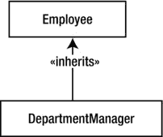

# 四、设计面向对象的解决方案：案例研究

为应用设计解决方案不是一件容易的事情。成为一名有成就的设计师需要时间和有意识的努力，这解释了为什么许多开发人员像躲避瘟疫一样躲避它。你可以研究理论，知道术语，但是真正发展你的建模技能的唯一方法是卷起袖子，弄脏你的手，开始建模。在本章中，您将了解办公用品订购系统的建模过程。虽然这不是一个复杂的应用，但是它包含了几个很好的用例，并且将由多个具有丰富的类交互的类组成。通过分析案例研究，您将更好地理解模型是如何开发的，以及各个部分是如何组合在一起的。

阅读本章后，您应该熟悉以下内容:

*   如何使用 UML 为 OOP 解决方案建模
*   要避免的一些常见 OOP 设计陷阱

**开发面向对象的解决方案**

在案例研究场景中，您的公司目前没有标准的部门订购办公用品的方式。每个部门分别实施自己的订购流程。因此，几乎不可能跟踪公司范围内的供应支出，这会影响预测预算和识别滥用的能力。当前系统的另一个问题是，它不允许单个联系人可以与各种供应商协商更好的交易。

因此，您被要求帮助开发一个公司范围的办公用品订购(OSO)应用。要对此系统进行建模，您需要完成以下步骤:

*   创建软件需求规范(SRS)
*   开发用例
*   绘制用例图表
*   给班级建模
*   为用户界面设计建模

创建系统需求规格

在与提议系统的各种客户面谈之后，您开发 SRS。请记住第 2 章中的内容，SRS 确定了系统需求的范围，定义了系统边界，并确定了系统的用户。

您已经确定了以下系统用户:

*   *购买者*:发起供货请求
*   *部门经理*:跟踪并批准部门采购员的供货请求
*   *供应商处理申请*:接收系统生成的订单文件
*   *采购经理*:更新供应目录，跟踪供应请求，并登记交付的物品

您已经确定了以下系统要求:

*   用户必须通过提供用户名和密码来登录系统。
*   购买者将查看可供订购的供应品列表。
*   购买者将能够按类别过滤供应品清单。
*   采购员可以在一个采购请求中请求多个供应。
*   部门经理可以为部门申请一般用品。
*   部门经理必须在每周末批准或拒绝其部门的供应请求。
*   如果部门经理拒绝请求，他们必须提供一个简短的解释，概述拒绝的原因。
*   部门经理必须跟踪其部门内的支出，并确保有足够的资金用于批准的供应请求。
*   采购经理维护供应目录，并确保其准确和最新。
*   采购经理在收到供应品时进行登记，并组织供应品进行配送。
*   已被请求但未被批准的供应请求标有*待定*状态。
*   已批准的供应请求标有状态*已批准*，并生成订单。
*   订单生成后，包含订单详细信息的文件将被放入订单队列。一旦订单被放入队列，它将被标记为状态*已放置*。
*   一个单独的供应商处理应用将从队列中检索订单文件，解析文档，并将行项目分发到适当的供应商队列。供应商处理应用会定期从供应商队列中检索订单，并将它们发送给供应商。(这是由一个单独的团队开发的。)
*   当订单的所有项目都被登记时，订单被标记为*已履行*状态，买方被告知订单已准备好提货。

开发用例

在生成 SRS 并让适当的系统用户签字后，下一个任务是开发用例，它将从用户的角度定义系统将如何运行。开发用例的第一步是定义参与者。请记住第二章中的角色代表将与系统交互的外部实体(人类或其他系统)。从 SRS 中，您可以确定以下将与系统交互的参与者:

*   买方
*   部门经理
*   采购经理
*   供应商处理申请

既然您已经确定了参与者，下一步就是确定参与者将涉及的各种用例。通过检查 SRS 中的需求陈述，您可以识别各种用例。例如,“用户必须通过提供用户名和密码来登录系统”这句话表明需要一个登录用例。表 4-1 确定了 OSO 应用的用例。

[表 4-1](#_Tab1) 。OSO 应用的用例

| 名字 | 演员 | 描述 |
| --- | --- | --- |
| 注册 | 采购员、部门经理、采购经理 | 用户会看到登录屏幕。然后，他们输入用户名和密码。他们要么点击登录，要么点击取消。登录后，他们会看到一个包含产品信息的屏幕。 |
| 查看供应目录 | 采购员、部门经理、采购经理 | 用户会看到一个包含供应品列表的目录表。该表包含供应名称、类别、描述和成本等信息。用户可以按类别过滤供应品。 |
| 购买申请 | 采购员、部门经理 | 购买者在表格中选择商品，然后点击按钮将它们添加到购物车中。一个单独的表显示了他们购物车中的商品、所请求的每个商品的数量和成本，以及请求的总成本。 |
| 部门采购请求 | 部门经理 | 部门经理在表格中选择商品，然后单击按钮将它们添加到购物车中。一个单独的表显示了他们购物车中的商品、所请求的每个商品的数量和成本，以及请求的总成本。 |
| 请求审查 | 部门经理 | 部门经理会看到一个屏幕，其中列出了他们部门成员的所有待定供应请求。他们审查请求，并将其标记为批准或拒绝。如果他们拒绝请求，他们输入一个简短的解释。 |
| 跟踪支出 | 部门经理 | 部门经理会看到一个屏幕，上面列出了部门成员每月的支出以及部门的总支出。 |
| 维护目录 | 采购经理 | 采购经理能够更新产品信息、添加产品或将产品标记为停产。管理员还可以更新类别信息、添加类别，以及将类别标记为停止使用。 |
| 项目签入 | 采购经理 | 采购经理看到一个输入订单号的屏幕。然后，采购经理会看到为订单列出的行项目。已接收的物料被标记。当收到订单的所有项目时，它会被标记为已履行。 |
| 下单 | 供应商处理应用 | 供应商处理应用检查队列中的外发订单文件。文件被检索、解析并发送到适当的供应商队列。 |

绘制用例图表

既然您已经确定了各种用例以及参与者，那么您就准备好构建用例的图表了。图 4-1 显示了一个用 UMLet 开发的初步用例模型，它在[第二章](02.html)中有介绍。

[图 4-1](#_Fig1) 。初步的 OSO 用例图

在您绘制了用例之后，您现在要寻找用例之间可能存在的任何关系。可能存在的两种关系是*包含*关系和*扩展*关系。从第 2 章的讨论中记住，当一个用例包含另一个用例时，被包含的用例需要作为先决条件运行。例如，OSO 应用的登录用例需要包含在查看供应目录用例中。将登录作为一个单独的用例的原因是，登录用例可以被一个或多个其他用例重用。在 OSO 应用中，登录用例也将包含在跟踪支出用例中。[图 4-2](#Fig2) 描绘了这种包含关系。

[图 4-2](#_Fig2) 。包括登录用例

 **注意**在一些建模工具中，包含关系可以在用例图中通过 uses 关键字来表示。

当一个用例将扩展初始用例的行为时，扩展关系存在于两个用例之间。在 OSO 应用中，当经理提出采购请求时，她可以表明她将为部门提出采购请求。在这种情况下，部门购买请求用例成为购买请求用例的扩展。 [图 4-3](#Fig3) 图示此扩展。

[图 4-3](#_Fig3) 。扩展购买请求用例

在分析了系统需求和用例之后，你可以通过分解应用并分阶段开发来使系统开发更易于管理。例如，您可以首先开发应用的购买请求部分。接下来，您可以开发请求检查部分，然后是项目签入部分。本章的其余部分集中在应用的购买请求部分。员工和部门经理将使用应用的这一部分来提出购买请求。[图 4-4](#Fig4) 显示了这个阶段的用例图。

[图 4-4](#_Fig4) 。采购申请用例图

开发班级模型

开发类模型包括几项任务。首先确定类，然后添加属性、关联和行为。

识别类别

在您确定了各种用例之后，您可以开始确定系统需要包含的类，以执行用例中描述的功能。为了识别这些类，您需要深入到每个用例中，并定义一系列执行用例所需的步骤。识别用例描述中的名词短语也很有帮助。名词短语通常是将需要的类的良好指示器。

例如，以下步骤描述了查看供应目录用例:

*   用户已登录并被分配了用户状态级别。(这是前提条件。)
*   向用户呈现包含供应品列表的目录表。该表包含供应名称、类别、描述和成本等信息。
*   用户可以按类别过滤供应品。
*   用户可以选择注销或提出购买请求。(这是岗位条件。)

从这个描述中，您可以确定一个负责从数据库中检索产品信息并过滤所显示产品的类。这个类的名称将是`ProductCatalog`类。

检查处理购买请求的用例描述中的名词短语揭示了 OSO 应用的候选类，如[表 4-2](#Tab2) 中所列。

[表 4-2](#_Tab2) 。用于提出购买请求的候选类别

| **用例** | **候选类别** |
| --- | --- |
| 注册 | 用户、用户名、密码、成功、失败 |
| 查看供应目录 | 用户、目录表、供应品列表、信息、供应品名称、类别、描述、成本 |
| 购买申请 | 购买者、物品、购物车、编号、请求的物品、成本、总成本 |
| 部门采购请求 | 部门经理、物品、购物车、编号、请求的物品、成本、总成本、部门采购请求 |

既然您已经确定了候选类，那么您需要排除那些表示冗余的类。例如，对项目和行项目的引用将代表相同的抽象。您还可以消除表示属性而不是对象的类。用户名、密码和费用是表示属性的名词短语的例子。有些类是模糊的，或者是其他类的概括。*用户*其实是*采购员*和*经理*的概括。类也可能实际上引用相同的对象抽象，但是指示对象的不同状态。例如，供应请求和订单在批准前和批准后代表相同的抽象。您还应该过滤掉表示实现结构的类，如 list 和 table。例如，购物车实际上是组成订单的订单项目的集合。

使用这些排除标准，您可以将类别列表缩减到以下候选类别:

*   `Employee`
*   `DepartmentManager`
*   `Order`
*   `OrderItem`
*   `ProductCatalog`
*   `Product`

现在，您可以开始为 OSO 应用的购买请求部分设计类图了。图 4-5 显示了 OSO 应用的初步类图。

[图 4-5](#_Fig5) 。初步 OSO 类图

向类添加属性

开发类模型的下一个阶段是确定类必须实现的抽象层次。您可以确定哪些州信息与 OSO 应用相关。这个必需的状态信息将通过类的属性来实现。分析`Employee`类的系统需求揭示了对登录名、密码和部门的需求。您还需要一个标识符，比如员工 ID，来唯一地标识不同的员工。对经理的采访显示，需要包括雇员的名和姓，以便他们可以通过名字跟踪支出。[表 4-3](#Tab3) 总结了将包含在 OSO 类中的属性。

[表 4-3。](#_Tab3) OSO 类属性

| **类** | **属性** | **类型** |
| --- | --- | --- |
| `Employee` | `EmployeeID`
`LoginName`
`Password`
`Department`
`FirstName`
 | 整数
串
串
串
串
串 |
| `DepartmentManager` | `EmployeeID`
`LoginName`
`Password`
`Department`
`FirstName`
 | 整数
串
串
串
串
串 |
| `Order` | `OrderNumber`
`OrderDate`
T2】 | 长
日期
字符串 |
| `OrderItem` | `ProductNumber`
`Quantity`
T2】 | 字符串
整数
小数 |
| `Product` | `ProductNumber`
`ProductName`
`Description`
`UnitPrice`
`Category`
 | 字符串
字符串
字符串
小数
字符串
字符串 |
| `ProductCatalog` | 没有人 |  |

[图 4-6](#Fig6) 显示了到目前为止已经确定了类属性的 OSO 类图。

[图 4-6](#_Fig6) 。添加了属性的购买请求组件类图

识别类别关联

开发过程的下一步是对 OSO 应用中存在的类关联进行建模。如果你研究了用例以及 SRS，你就能理解你需要在类结构设计中加入什么类型的关联。

 **注意**你可能会发现你需要进一步细化 SRS 来暴露类关联。

例如，一个雇员将与一个订单相关联。通过检查关联的多样性，您会发现一个雇员可以有多个订单，但是一个订单只能与一个雇员相关联。[图 4-7](#Fig7) 模拟了这种关联。

[图 4-7](#_Fig7) 。描述雇员类和订单类之间的关联

当您开始识别类属性时，您会注意到`Employee`类和`DepartmentManager`类有许多相同的属性。这是有道理的，因为经理也是员工。在本应用中，经理代表具有特殊行为的员工。这种专门化由继承关系来表示，如图[图 4-8](#Fig8) 所示。

[图 4-8](#_Fig8) 。DepartmentManager 类继承自 Employee 类

以下陈述总结了 OSO 类结构中的关联:

*   一个`Order`是一个`OrderItem`对象的集合。
*   一个`Employee`可以有多个`Order`对象。
*   一个`Order`与一个`Employee`相关联。
*   `ProductCatalog`与多个`Product`对象相关联。
*   一个`Product`与`ProductCatalog`相关联。
*   一个`OrderItem`与一个`Product`相关联。
*   一个`Product`可能与多个`OrderItem`对象相关联。
*   一个`DepartmentManager`是一个具有专门行为的`Employee`。

[图 4-9](#Fig9) 显示了这些不同的关联(为了清楚起见，不包括类属性)。

[图 4-9](#_Fig9) 。添加了关联的采购请求组件类图

类行为建模

既然您已经勾勒出了类的初步结构，那么您就可以对这些类如何交互和协作进行建模了。这个过程的第一步是深入到用例描述中，并创建一个用例将如何执行的更详细的场景。下面的场景描述了执行登录用例的一个可能的顺序。

1.  用户会看到一个登录对话框。
2.  用户输入登录名和密码。
3.  用户提交信息。
4.  检查并验证名称和密码。
5.  向用户呈现供应请求屏幕。

尽管这个场景描述了登录用例中最常见的处理，但是您可能需要其他场景来描述预期的替代结果。以下场景描述了登录用例的另一种处理方式:

1.  用户会看到一个登录对话框。
2.  用户输入登录名和密码。
3.  用户提交信息。
4.  已检查名称和密码，但无法验证。
5.  用户被告知不正确的登录信息。
6.  再次向用户显示登录对话框。
7.  用户要么重试，要么取消登录请求。

在这一点上，它可能有助于创建用例场景的可视化表示。记住第 3 章中的活动图经常被用来可视化用例处理。[图 4-10](#Fig10) 显示了为登录用例场景构建的活动图。

[图 4-10](#_Fig10) 。描述登录用例场景的活动图

在分析了用例场景中所涉及的过程之后，您现在可以将注意力转向为系统的类分配必要的行为。为了帮助识别需要发生的类行为和交互，你构建一个序列图，如第 3 章中所讨论的。

[图 4-11](#Fig11) 显示了登录用例场景的序列图。`Purchaser` (UI )类调用已经分配给`Employee`类的`Login`方法。该消息返回指示登录是否已被验证的信息。

[图 4-11](#_Fig11) 。描述登录用例场景的序列图

接下来，让我们分析一下视图供应目录用例。以下场景描述了用例:

1.  用户已登录并通过验证。
2.  用户查看包含产品信息的目录表，包括供应名称、类别、描述和价格。
3.  用户选择按类别过滤表格，选择一个类别，然后刷新表格。

从这个场景中，您可以看到您需要一个`ProductCatalog`类的方法来返回产品类别列表。`Purchaser`类将调用这个方法。`ProductCatalog`类需要的另一个方法是返回按类别过滤的产品列表。图 4-12 中的序列图显示了`Purchaser` (UI)类和`ProductCatalog`类之间的交互。

[图 4-12](#_Fig12) 。描述查看供应目录方案的序列图

以下场景是为购买请求用例开发的:

1.  一名采购人员已经登录并被确认为员工。
2.  购买者从产品目录中选择商品，并将它们添加到订单请求(购物车)中，指明所请求的每个商品的数量。
3.  在完成订单的项目选择之后，购买者提交订单。
4.  订单请求信息被更新，订单 ID 被生成并返回给购买者。

从这个场景中，您可以确定需要创建的`Order`类的`AddItem`方法。该方法将接受产品 ID 和数量，然后返回订购产品的小计。`Order`类需要调用`OrderItem`类的方法，这将创建一个订单项的实例。您还需要一个`Order`类的`SubmitOrder`方法，该方法将提交请求和生成订单的退货订单 ID。[图 4-13](#Fig13) 显示了该场景的相关序列图。

[图 4-13](#_Fig13) 。描述购买请求场景的序列图

需要包括的一些其他场景是从购物车中删除商品、更改购物车中商品的数量以及取消订单流程。您还需要为部门采购请求用例包含类似的场景并创建类似的方法。在分析了需要发生的场景和交互之后，你可以为应用的购买请求部分开发一个类图，如图 4-14 所示。

[图 4-14](#_Fig14) 。采购申请类图

开发用户界面模型设计

在应用设计过程的这一点上，您不希望提交特定的 GUI 实现(换句话说，特定于技术的实现)。然而，对应用的 GUI 所需的一些公共元素和功能进行建模是有帮助的。这将帮助您创建一个原型用户界面，您可以用它来验证已经开发的业务逻辑设计。用户将能够与原型互动，并提供反馈和逻辑设计的验证。

您需要实现的第一个原型屏幕是用于登录的屏幕。您可以构建一个活动图来帮助定义用户登录系统时需要执行的活动，如图[图 4-15](#Fig15) 所示。

[图 4-15](#_Fig15) 。描述用户登录活动的活动图

分析活动图可以发现，您可以将登录屏幕实现为一个相当通用的界面。该屏幕应该允许用户输入用户名和密码。它应该包括一种方式来表明用户是作为雇员还是经理登录的。经理必须以员工身份登录才能提出购买请求，以经理身份登录才能批准请求。最后的要求是包括一个让用户中止登录过程的方法。[图 4-16](#Fig16) 显示了登录屏幕的原型。

[图 4-16](#_Fig16) 。登录屏幕原型

您需要考虑的下一个屏幕是产品目录屏幕。[图 4-17](#Fig17) 描述了查看和过滤产品的活动图。

[图 4-17](#_Fig17) 。描述产品浏览活动的活动图

活动图显示屏幕需要显示产品和产品信息的表格或列表。用户必须能够按类别过滤产品，这可以通过从类别列表中选择一个类别来启动。用户还需要能够发起订单请求或退出应用。[图 4-18](#Fig18) 显示了可用于查看产品的原型屏幕。单击添加到订单按钮将产品添加到订单，并启动订单详细信息屏幕，用户可以在其中调整订单数量。

[图 4-18](#_Fig18) 。查看产品屏幕原型

应用的这一部分需要原型化的最后一个屏幕是购物车界面。这将有助于从订单请求中添加和删除项目。它还需要允许用户提交订单或中止订单请求。[图 4-19](#Fig19) 显示了订单请求屏幕的原型。单击添加按钮将启动之前的产品目录屏幕，允许用户添加其他行项目。移除按钮将移除选中的行项目。用户可以通过单击向上和向下箭头来更改行项目的数量。

[图 4-19](#_Fig19) 。订单详细信息屏幕原型

这就完成了 OSO 应用这一阶段的初步设计。你应用了你在第二章和第三章[中学到的知识来设计模型。接下来，让我们回顾一下在这个过程中要避免的一些常见错误。](03.html)

避免一些常见的 OOP 设计陷阱

当你开始为自己的 OOP 设计建模时，你希望确保遵循最佳实践。以下是一些你应该避免的常见陷阱

*   *不要让用户参与过程*:值得强调的是，用户是你产品的消费者。他们是定义系统的业务流程和功能需求的人。
*   *尝试一次性建模整个解决方案*:当开发复杂系统时，将系统设计和开发分解成可管理的组件。计划分阶段生产软件。这将提供更快的建模、开发、测试和发布周期。
*   *努力打造完美模型*:没有一个模型从一开始就是完美的。成功的建模者明白建模过程是迭代的，模型在整个应用开发周期中不断更新和修改。
*   认为只有一种真正的建模方法:正如有许多不同的同样可行的 OOP 语言一样，也有许多同样有效的软件开发建模方法。选择一个最适合你和手头项目的。
*   *重新发明轮子*:寻找模式和可重用性。如果您分析应用试图解决的许多业务流程，就会出现一组一致的建模模式。创建一个存储库，您可以在其中从一个项目到另一个项目，从一个程序员到另一个程序员利用这些现有的模式。
*   *让数据模型驱动业务逻辑模型*:首先开发数据模型(数据库结构)，然后在其上构建业务逻辑设计，这通常不是一个好主意。解决方案设计者应该首先询问需要解决什么业务问题，然后建立数据模型来解决问题。
*   *混淆问题域模型和实现模型*:在设计应用时，你应该开发两个不同但互补的模型。领域模型设计描述了项目的范围和实现业务解决方案所涉及的处理。这包括将涉及哪些对象，它们的属性和行为，以及它们如何相互作用和关联。领域模型应该是与实现无关的。您应该能够使用同一个域模型作为几种不同的特定于架构的实现的基础。换句话说，您应该能够采用相同的域模型，并使用 Visual Basic 富客户端、两层架构或 C#(或 Java)n 层分布式 web 应用来实现它。

摘要

现在，您已经分析了 OOP 应用的领域模型，您已经准备好将设计转化为实际的实现了。本书的下一部分将向你介绍 C# 语言。你会看到 .NET 框架，并了解如何在框架之上构建 C# 应用。将向您介绍如何使用 Visual Studio IDE，并熟悉 C# 语言的语法。下一节还将演示在 C# 中实现 OOP 结构的过程，比如类结构、对象实例化、继承和多态。利用你新获得的技能，你将重温本章介绍的案例研究，并应用这些技能将应用设计转化为一个功能性的应用。