# 五、.NET 框架和 Visual Studio 简介

业务应用编程已经从两层、紧耦合的模型发展成多层、松耦合的模型，通常涉及通过互联网或公司内部网的数据传输。为了让程序员更有效率并处理这种模型的复杂性，微软开发了 .NET 框架。为了有效地用 C# 编程，你需要理解构建它的底层框架。

阅读本章后，您应该熟悉以下内容:

*   那个 .NET 框架
*   公共语言运行库(CLR)的功能
*   实时(JIT)编译器的工作原理
*   那个 .NET Framework 基类库
*   命名空间和程序集
*   Visual Studio 集成开发环境的功能

介绍 .NET 框架

那个 .NET Framework 是基础类的集合，旨在提供运行应用所需的公共服务。让我们看看的目标 .NET 框架，然后查看它的组件。

的目标 .NET 框架

微软设计了 .NET 框架，并考虑到某些目标。下面几节研究这些目标以及 .NET 框架实现了它们。

行业标准的支持

微软想要的是 .NET 框架基于行业标准和实践。因此，该框架严重依赖于行业标准，如可扩展标记语言(XML)、HTML 5 和 OData。微软还向欧洲计算机制造商协会(ECMA)提交了一份公共语言基础设施(CLI)工作文件，该协会负责监督计算机行业的许多公共标准。

CLI 是创建符合 .NET 框架。第三方供应商可以使用这些规范来创建。符合. NET 的语言编译器；例如，交互式软件工程(ISE)已经为 Eiffel 创建了一个. NET 编译器。第三方供应商也可以创建一个 CLR 来允许 .NET 兼容的语言在不同的平台上运行。例如，Mono 是 CLR 的开源、跨平台实现，它赋予 C# 应用在 Linux 平台上运行的能力。

展开性

为了创建一个高效的编程环境，微软实现了 .NET 框架必须是可扩展的。于是，微软向开发者公开了框架类层次结构。通过继承和接口，您可以轻松地访问和扩展这些类的功能。例如，您可以创建一个按钮控件类，它不仅从 .NET Framework，而且以应用所需的独特方式扩展了基本功能。

微软还使底层操作系统的使用变得更加容易。通过在基于类的层次结构中重新打包和实现 Windows 操作系统应用编程接口(API)函数，微软使面向对象编程人员能够更直观、更容易地使用底层操作系统提供的功能。

统一编程模型

微软的另一个重要目标是 .NET 框架是跨语言独立和集成的。为了实现这个目标，所有支持公共语言规范(CLS)的语言都编译成相同的中间语言，支持相同的基本数据类型集，并公开相同的代码可访问性方法集。结果，不仅用不同的 CLS 兼容语言开发的类可以无缝地相互通信，而且你还可以跨语言实现 OOP 结构。例如，您可以开发一个用 C# 编写的类，该类继承自用 Visual Basic (VB)编写的类。微软已经开发了几种支持 .NET 框架。除了 C#，这些语言还有 VB.NET、托管 C++、JScript 和 F#。除了这些语言之外，许多第三方供应商还开发了其他流行语言的版本，用于在 .NET 框架，比如 Pascal 和 Python。

更容易部署

微软需要一种方法来简化应用部署。以前的发展 .NET Framework 中，当部署组件时，组件信息必须记录在系统注册表中。许多这些组件，尤其是系统组件，被几个不同的客户端应用使用。当客户端应用调用该组件时，会搜索注册表以确定使用该组件所需的元数据。如果部署了较新版本的组件，它将替换旧组件的注册表信息。通常，新组件与旧版本不兼容，导致现有客户端出现故障。您可能在安装了一个服务包后遇到过这个问题，该服务包导致的问题比它修复的问题还多！

那个 .NET Framework 通过将用于处理组件的元数据存储在一个名为清单的文件中来解决这个问题，该文件打包在包含组件代码的程序集中。程序集是包含运行应用所需的代码、资源和元数据的包。默认情况下，程序集被标记为私有，并与客户端程序集放在同一目录中。这确保了组件组合不会被无意中替换或修改，并且还允许更简单的部署，因为不需要使用注册表。如果需要共享一个组件，它的程序集被部署到一个称为全局程序集缓存(GAC)的特殊目录中。程序集的清单包含版本信息，因此组件的较新版本可以与 GAC 中的较旧版本并行部署。默认情况下，客户端程序集继续请求和使用它们打算使用的组件版本。当安装组件的新版本时，旧的客户端程序集将不再失败。

改进的内存管理

为 Windows 平台开发的程序的一个常见问题是内存管理。通常，这些程序会导致内存泄漏。当程序从操作系统分配内存，但在完成内存工作后未能释放内存时，就会发生内存泄漏。该内存不再可用于其他应用或操作系统，导致计算机运行缓慢，甚至停止响应。当程序打算长时间运行时，例如在后台运行的服务，这个问题就更复杂了。为了解决这个问题 .NET Framework 使用不确定的终结。框架使用垃圾收集对象，而不是依赖应用来释放未使用的内存。垃圾收集器定期扫描未使用的内存块，并将它们返回给操作系统。

改进的安全模型

在当今高度分布式、基于互联网的应用中实现安全性是一个极其重要的问题。过去，安全性主要集中在应用的用户身上。当用户登录到应用时，会检查安全身份，当应用调用远程服务器和数据库时，会传递用户的身份。对于当今企业级的松散耦合系统来说，这种类型的安全模型被证明是低效且难以实现的。为了使安全性更容易实现和更健壮 .NET Framework 使用代码标识和代码访问的概念。

创建程序集时，它会被赋予一个唯一的标识。创建服务器程序集时，您可以授予访问权限和权利。当客户端程序集调用服务器程序集时，运行库将检查客户端的权限和权利，然后相应地授予或拒绝对服务器代码的访问。因为每个程序集都有一个标识，所以还可以通过操作系统限制对程序集的访问。例如，如果用户从 Web 下载一个组件，您可以限制该组件在用户系统上读写文件的能力。

的组件 .NET 框架

现在您已经看到了的一些主要目标 .NET 框架，我们来看看它包含的组件。

公共语言运行时

的基本组件 .NET 框架是 CLR。CLR 管理正在执行的代码，并在代码和操作系统之间提供一个抽象层。CLR 内置了以下机制:

*   将代码加载到内存中并准备执行
*   将代码从中间语言转换为本机代码
*   管理代码执行
*   管理代码和用户级安全性
*   自动释放和释放内存
*   调试和跟踪代码执行
*   提供结构化异常处理

框架基础类库

构建在 CLR 之上的是 .NET 框架基础类库。这个类库中包括引用类型和值类型，它们封装了对系统功能的访问。*类型*是数据结构。引用类型是一种复杂类型，例如类和接口。值类型是简单类型，例如整数或布尔。程序员使用这些基类和接口作为构建应用、组件和控件的基础。基本类库包括封装数据结构、执行基本输入/输出操作、调用安全管理、管理网络通信以及执行许多其他功能的类型。

数据类别

构建在基类之上的是支持数据管理的类。这组类通常被称为 ADO.NET。使用 ADO.NET 对象模型，程序员可以通过托管提供程序访问和管理存储在各种数据存储结构中的数据。微软已经编写并调整了 ADO.NET 类和对象模型，以便在松散耦合、互不连接的多层环境中高效工作。ADO.NET 不仅公开数据库中的数据，还公开与数据相关联的元数据。数据被公开为一种小型关系数据库。这意味着您可以在与数据源断开连接的情况下获取和使用数据，并在以后将数据与数据源同步。

微软已经为几个数据提供者提供了支持。存储在 Microsoft SQL Server 中的数据可以通过本机 SQL 数据提供程序进行访问。OLEDB 和开放式数据库连接管理(ODBC)提供程序是目前通过 OLEDB 或 ODBC 标准 API 公开的系统的两个通用提供程序。因为这些托管数据提供程序不直接与数据库引擎交互，而是与非托管提供程序进行通信，然后由非托管提供程序与数据库引擎进行通信，所以使用非本机数据提供程序比使用本机提供程序效率更低、功能更弱。由于 .NET 框架和微软对基于开放标准的承诺，许多数据存储供应商现在为他们的系统提供本地数据提供者。

建立在 ADO.NET 提供者模型之上的是 ADO.NET 实体框架。实体框架在数据库的关系数据结构和编程语言的面向对象结构之间架起了一座桥梁。它提供了一个对象/关系映射(ORM)框架，使得程序员无需为数据访问编写大部分管道代码。该框架提供诸如变更跟踪、身份解析和查询翻译等服务。程序员使用语言集成查询(LINQ)来检索数据，并将数据作为强类型对象来操作。[第 10 章](10.html)详细介绍 ADO.NET 和数据访问。

Windows 应用

在此之前。根据您是使用 C++还是 Visual Basic 进行开发，开发 Windows 图形用户界面(GUI)会有很大的不同。尽管用 VB 开发 GUI 很容易，而且可以很快完成，但 VB 开发人员与 Windows API 的底层功能隔离开来，没有完全接触到它。另一方面，尽管接触到了 Windows API 的全部功能，但用 C++开发 GUI 是非常乏味和耗时的。与 .NET Framework 中，微软引入了一组基类，在。与. NET 兼容的语言。这使得 Windows GUI 开发在各种 .NET 支持的编程语言，结合了开发的简易性和 API 的全部特性。

除了传统的 Windows 窗体和控件(自 Windows 操作系统出现以来就一直存在)之外 .NET Framework 包括一组类，统称为 Windows 演示基础(WPF)。WPF 集成了一个渲染引擎，旨在利用现代图形硬件和丰富的操作系统，如 Windows 7。它还包括应用开发功能，如控件、数据绑定、布局、图形和动画。有了 WPF 的类集，程序员可以创建提供非常引人注目的用户体验的应用。在第 11 章中，你将更深入地了解如何构建基于 WPF 的应用。

网络应用

那个 .NET Framework 公开了一组基本类，可用于在 web 服务器上创建向启用 web 的客户端公开的用户界面和服务。这些类统称为 ASP.NET。使用 ASP.NET，您可以开发一个用户界面，它可以动态地响应发出请求的客户端设备的类型。在运行时 .NET Framework 负责发现发出请求的客户端的类型(浏览器类型和版本)并公开适当的接口。运行在 Windows 客户机上的 web 应用的 GUI 变得更加健壮，因为 .NET Framework 公开了许多 API 功能，这些功能以前只向传统的基于 Windows 窗体的 C++和 VB 应用公开。使用 .NET Framework 的一个优点是服务器端代码可以用任何。符合. NET 的语言。之前 .NET 中，服务器端代码必须用脚本语言编写，如 VBScript 或 JScript。

Visual Studio 2012 和 .NET framework 4.5 支持几种不同的创建 web 应用的模型。您可以基于 ASP.NET web 窗体项目、ASP.NET MVC 项目或 Silverlight 应用项目创建 Web 应用。第 12 章涵盖了开发网络应用。

Windows 应用商店应用

一种新类型的 Windows 应用可用于 Windows 8 操作系统:Windows 商店应用。Windows 应用商店应用面向平板电脑和手机等利用触摸屏进行用户输入和持续互联网连接的设备。构建 Windows 应用商店应用有两种选择。您可以使用 .NET 语言(C#/VB/C++)与 XAML 结合使用，或者您可以将 JavaScript 与 HTML5 结合使用。Windows 应用商店应用是使用 WinRT API 构建的，这类似于针对。网络工作。微软甚至增加了一个. NET 框架 API 作为 WinRT API 的包装。这意味着您可以使用 .NET Framework 来使用您已经熟悉的编程语言和设计经验创建出色的 Windows 应用商店应用。事实上，正如你将在第 13 章中看到的，使用 C# 和 XAML 创建 Windows Store 应用与构建 WPF 应用非常相似。

应用服务程序

包括在 .NET Framework 是基类和接口支持，用于公开可由其他应用使用的服务。在…之前 .NET 框架，用 C++和 VB 开发的应用使用了分布式组件对象模型(DCOM)技术。DCOM 是一种在分布于联网计算机上的软件组件之间进行通信的技术。因为 DCOM 是基于二进制标准的，所以通过防火墙和互联网的应用到应用的通信不容易实现。DCOM 的专有性质也限制了能够有效使用通过 COM 公开服务的应用并与之交互的客户端类型。

微软通过互联网标准公开服务来解决这些限制。包括在 .NET 框架是一组类，统称为 Windows 通信基础(WCF) 。使用 WCF，您可以将数据作为消息从一个应用发送到另一个应用。消息传输和内容可以根据消费者和环境轻松更改。例如，如果服务是通过 Web 公开的，那么可以使用基于 HTTP 的文本消息。另一方面，如果客户端在同一个公司网络上，则可以使用 TCP 上的二进制消息。

和。除了. NET 4.5 之外，微软还引入了一种新的创建 HTTP 服务的框架，称为 ASP.NET Web API。使用这个 API，您可以构建能够到达各种客户端的服务，比如 web 浏览器和移动设备。虽然您可以使用 WCF 创建这些服务，但新的 Web API 使其更容易实现，并包括内容协商、查询合成和灵活托管等功能。在第 14 章中，你将使用 ASP.NET Web API 和 WCF 创建和消费应用服务。

使用 .NET 框架

使用 .NET Framework，您应该了解它是如何构造的，以及托管代码是如何编译和执行的。 .NET 应用被组织并打包成程序集。由执行的所有代码 .NET 运行库必须包含在程序集中。

了解程序集和清单

程序集包含运行应用所需的代码、资源和清单(关于程序集的元数据)。组件可以被组织成一个文件，其中所有的信息都被合并到一个动态链接库(DLL)文件或可执行(EXE)文件中，或者被组织成多个文件，其中信息被合并到单独的 DLL 文件、图形文件和清单文件中。程序集的主要功能之一是形成类型、引用和安全性的边界。大会的另一个重要功能是组成一个部署单位。

程序集最重要的部分之一是清单；事实上，每个程序集都必须包含一个清单。清单的目的是描述程序集。它包含程序集的标识、程序集向客户端公开的类和其他数据类型的说明、此程序集需要引用的任何其他程序集以及运行程序集所需的安全详细信息。

默认情况下，当创建程序集时，它被标记为私有。程序集的副本必须放在使用它的任何客户端程序集的同一目录或 bin 子目录中。如果程序集必须在多个客户端程序集之间共享，则它被放在全局程序集缓存(GAC) 中，这是一个特殊的 Windows 文件夹。若要将私有程序集转换为共享程序集，必须运行实用程序来创建加密密钥，并且必须用密钥对程序集进行签名。对程序集签名后，必须使用另一个实用工具将共享程序集添加到 GAC 中。通过制定创建和公开共享程序集的严格要求，Microsoft 试图确保不会发生恶意篡改共享程序集的情况。这也确保了同一程序集的新版本可以存在，而不会破坏使用旧程序集的当前应用。

引用程序集和命名空间

来制造 .NET 框架更易于管理，微软给了它一个层次结构。这种分层结构被组织成所谓的名称空间。通过将框架组织到名称空间中，命名冲突的机会大大减少了。将框架的相关功能组织到名称空间中也极大地增强了其对开发人员的可用性。例如，如果您想构建一个窗口的 GUI，那么您需要的功能很可能存在于`System.Windows`名称空间中。

所有的 .NET Framework 类驻留在系统命名空间中。系统命名空间按功能进一步细分。使用数据库所需的功能包含在`System.Data`名称空间中。一些名称空间有几层深度；例如，用于连接到 SQL Server 数据库的功能包含在`System.Data.SqlClient`名称空间中。

程序集可以组织成单个命名空间或多个命名空间。几个程序集也可以组织到同一个命名空间中。

中的类进行访问 .NET Framework，您需要在代码中引用包含命名空间的程序集。然后，您可以通过提供类的完全限定名来访问程序集中的类。例如，如果您想在表单中添加一个文本框，您可以创建一个`System.Windows.Controls.TextBox`类的实例，如下所示:

```cs
private System.Windows.Controls.TextBox newTextBox;
```

幸运的是，在 C# 中，您可以在代码文件的顶部使用 using 语句，这样就不需要在代码中不断引用完全限定名:

```cs
using System.Windows.Controls;
private TextBox newTextBox;
```

编译和执行托管代码

什么时候 .NET 代码被编译，它被转换成. NET 可移植可执行(PE)文件。编译器将源代码翻译成微软中间语言(MSIL)格式。MSIL 是独立于 CPU 的代码，这意味着它需要在执行前进一步转换为特定于 CPU 的本机代码。

除了 MSIL 代码，PE 文件还包括清单中包含的元数据信息。PE 文件中元数据的合并使得代码可以自我描述。不需要附加的类型库或接口定义语言(IDL)文件。

因为各种 .NET 兼容的语言编译成相同的 MSIL 和元数据格式 .NET 平台支持语言集成。这超越了微软的 COM 组件，例如，用 VB 编写的客户端代码可以实例化和使用用 C++编写的组件的方法。和 .NET 语言集成，您可以用 VB 编写一个. NET 类，它继承了用 C# 编写的类，然后重写它的一些方法。

在执行 PE 文件中的 MSIL 代码之前，. NET Framework 实时(JIT)编译器会将其转换为特定于 CPU 的本机代码。为了提高效率，JIT 编译器不会同时将所有 MSIL 代码转换为本机代码。MSIL 代码根据需要进行转换。当执行一个方法时，编译器检查代码是否已经被转换并放入缓存。如果有，则使用编译版本；否则，MSIL 码将被转换并存储在缓存中以备将来调用。

因为 JIT 编译器是针对不同的 CPU 和操作系统编写的，所以开发人员不需要重写他们的应用来针对各种平台。可以想象，你为 Windows 服务器平台编写的程序也可以在 UNIX 服务器上运行。所需要的只是一个用于 UNIX 架构的 JIT 编译器。

使用 Visual Studio 集成开发环境

您可以使用简单的文本编辑器编写 C# 代码，并使用命令行编译器编译它。然而，您会发现，使用文本编辑器编写企业级应用可能会令人沮丧且效率低下。大多数以编程为生的程序员发现集成开发环境(IDE)在易用性和提高生产率方面非常有价值。微软在 Visual Studio (VS) 中开发了一个出色的 IDE。集成到 VS 中的许多特性使得 .NET Framework 更直观、更简单、更高效。Visual Studio 的一些有用功能包括:

*   编辑器功能，如自动语法检查、自动完成和颜色突出显示
*   一个 IDE 供所有人使用。网络语言
*   广泛的调试支持，包括设置断点、单步调试代码以及查看和修改变量的能力
*   集成帮助文档
*   拖放式 GUI 开发
*   XML 和 HTML 编辑
*   与 Windows Installer 集成的自动化部署工具
*   从 IDE 中查看和管理服务器的能力
*   完全可定制和扩展的界面

下面的活动将向您介绍 VS IDE 中的一些特性。当您完成这些步骤时，不要担心编码细节。只需专注于习惯在 VS IDE 中工作。您将在接下来的章节中了解更多关于代码的内容。

 **注意**如果没有安装 Visual Studio 2012，请参考附录 C 中的安装说明。

活动 5-1。游览 VISUAL STUDIO

在本活动中，您将熟悉以下内容:

*   自定义 IDE
*   创建. NET 项目并设置项目属性
*   使用 VS IDE 中的各种编辑器窗口
*   使用 VS IDE 的自动语法检查和自动完成功能
*   用 VS IDE 编译程序集

**定制 IDE**

要定制 IDE，请按照下列步骤操作:

1.  Start Visual Studio 2012.

     **注意**如果这是你第一次启动 VS，你会被要求选择一个默认的开发设置。选择 Visual C# 开发设置。

2.  您将看到起始页。起始页包含几个窗格，其中一个窗格链接到 MSDN (Microsoft Developer Network)网站上发布的有用文档。点击其中的一个链接将会启动一个托管在 VS 中的浏览器窗口，打开 MSDN 网站上的文档。花些时间研究一下信息和起始页上显示给你的各种链接。
3.  Microsoft has taken considerable effort to make VS a customizable design environment. You can customize just about every aspect of the layout, from the various windows and menus down to the color coding used in the code editor. Select Tools  Options to open the Options dialog box, shown in [Figure 5-1](#Fig1), which allows you to customize many aspects of the IDE.

    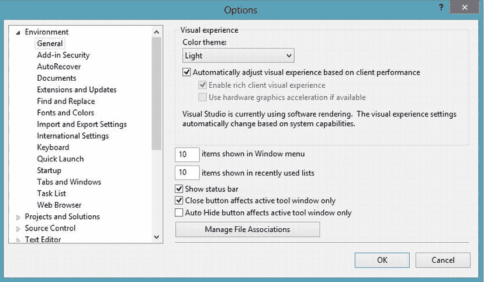

    [图 5-1](#_Fig1) 。VS 选项对话框

4.  在对话框左侧的“类别”列表中，单击“项目和解决方案”。您可以选择更改项目的默认位置，以及在构建和运行项目时会发生什么。选择“生成开始时显示输出窗口”选项。
5.  调查其他一些可用的可定制选项。完成后，单击确定按钮关闭选项对话框。

**创建新项目**

要创建一个新项目，请遵循以下步骤:

1.  在起始页上，单击“创建项目”链接，这将启动“新建项目”对话框。(您也可以选择文件新建项目来打开此对话框。)
2.  “新建项目”对话框允许您使用内置模板创建各种项目。有创建 Windows 项目、Web 项目、WCF 项目以及许多其他项目的模板，这取决于您在安装 VS 时选择的选项
3.  In the Templates pane, expand the Visual C# node and select the Windows node, as shown in [Figure 5-2](#Fig2). Observe the various C# project templates. There are templates for creating various types of Windows applications, including Windows Forms-based applications, class libraries, and console applications.

    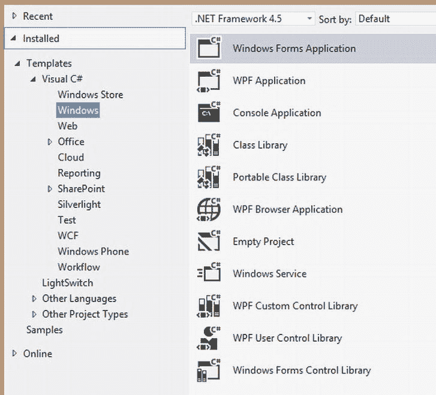

    [图 5-2](#_Fig2) 。VS 新建项目对话框

4.  单击 Windows 窗体应用模板。将应用的名称更改为 DemoChapter5，然后单击 OK 按钮。

当项目打开时，您将看到一个添加到项目中的默认表单(名为 Form1)的表单设计器。在此窗口的右侧，您应该会看到解决方案资源管理器。

**调查解决方案资源管理器和类视图**

解决方案资源管理器显示作为当前解决方案一部分的项目和文件，如图 5-3 所示。默认情况下，创建项目时，会创建一个与项目同名的解决方案。该解决方案包含一些全局信息、项目链接信息和定制设置，如任务列表和调试信息。一个解决方案可以包含多个相关项目。

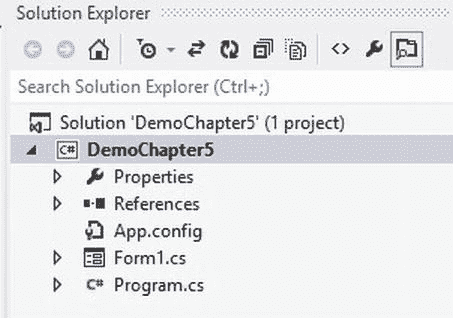

[图 5-3](#_Fig3) 。解决方案浏览器

解决方案节点下是项目节点。项目节点组织与项目相关的各种文件和设置。项目文件将这些信息组织在一个 XML 文档中，该文档包含对作为项目一部分的类文件的引用、项目所需的任何外部引用以及已设置的编译选项。项目节点下是属性节点、引用节点、App.config 文件、`Form1`类的类文件和`Program`类文件。

要练习使用解决方案资源管理器和一些 VS 特性和视图，请按照下列步骤操作:

1.  在“解决方案资源管理器”窗口中，右击“属性”节点并选择“打开”。这将启动项目属性窗口。窗口左侧是几个选项卡，您可以使用它们来浏览和设置各种应用设置。
2.  Select the Application tab, as shown in [Figure 5-4](#Fig4). Notice that, by default, the assembly name and default namespace are set to the name of the project.

    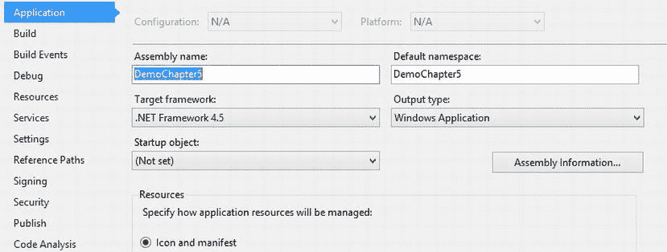

    [图 5-4](#_Fig4) 。项目属性窗口

3.  在“项目属性”窗口中浏览其他一些选项卡。完成后，单击窗口选项卡中的 x 关闭窗口。
4.  在"解决方案资源管理器"窗口中，展开"引用"节点。节点下是应用引用的外部程序集。请注意，默认情况下包含了几个引用。默认引用取决于项目的类型。例如，因为这是一个 Windows 应用项目，所以默认情况下包含对`System.Windows.Forms`名称空间的引用。
5.  解决方案资源管理器的项目节点下的`Form1`类文件有一个. cs 扩展名，表示它是用 C# 代码编写的。默认情况下，文件名已设置为与表单相同的名称。在解决方案资源管理器窗口中双击该文件。该窗体显示在设计视图中。单击 Solution Explorer 顶部工具栏中的 View Code 按钮，将会打开`Form1`类的代码编辑器。
6.  选择视图类视图以启动类视图窗口。“类视图”窗口的顶部按照命名空间层次结构组织项目文件。展开 DemoChapter5 根节点会显示三个子节点:引用节点、DemoChapter5 命名空间节点和 DemoChapter5 属性节点。名称空间节点由节点名称左侧的`{}`符号指定。
7.  Listed under the DemoChapter5 namespace node are the classes that belong to the namespace. Expanding the Form1 node reveals a Base Types folder. Expanding Base Types shows the classes and interfaces inherited and implemented by the `Form1` class, as shown in [Figure 5-5](#Fig5). You can further expand the nodes to show the classes and interfaces inherited and implemented by the `Form` base class.

    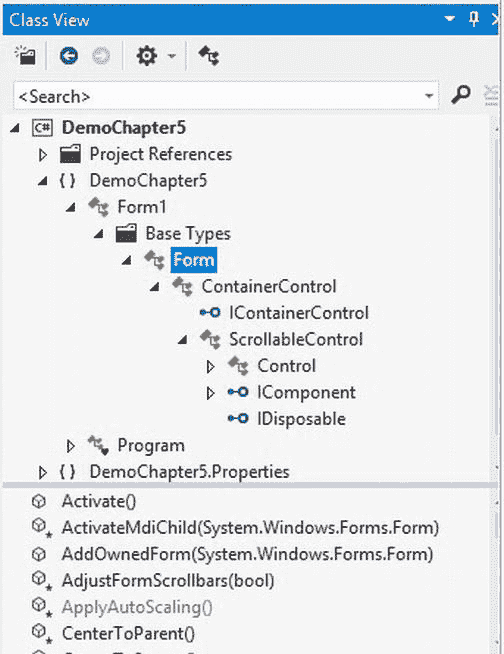

    [图 5-5](#_Fig5) 。类视图中展开的节点

8.  “类视图”窗口的底部是该类的方法、属性和事件的列表。选择“类视图”窗口顶部的“窗体”节点。请注意窗口底部列出了大量的方法、属性和事件。
9.  Right-click the DemoChapter5 project node and select Add  Class. Name the class `DemoClass1` and click the Add button. If the class code is not visible in the code editor, double-click the DemoClass1 node in the Class View window to display it. Wrap the class definition code in a namespace declaration as follows:

    `namespace DemoChapter5`

    `{`

    `namespace MyDemoNamespace`

    `{`

    `class DemoClass1`

    `{`

    `}`

    `}`

    `}`

10.  请注意类视图中更新的层次结构。`DemoClass1`现在属于`MyDemoNamespace`，后者属于`DemoChapter5`名称空间。`DemoClass1`的全称现在是`DemoChapter5.MyDemoNamespace.DemoClass1`。
11.  Add the following code to the `DemoClass1` definition. As you add the code, notice the auto-selection drop-down list provided (see [Figure 5-6](#Fig6)). Pressing the Tab key will select the current item on the list.

    `class DemoClass1: System.Collections.CaseInsensitiveComparer`

    `{`

    `}`

    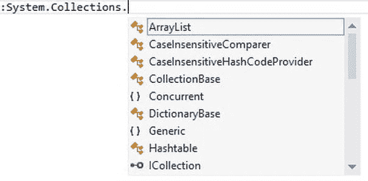

    [图 5-6](#_Fig6) 。代码选择下拉列表

12.  请注意类视图中更新的层次结构。展开 DemoClass1 节点下的 Base Types 节点，您将看到 base `CaseInsensitiveComparer`类节点。选择该节点，您将在“类视图”窗口的下半部分看到`CaseInsensitiveComparer`类的方法和属性。
13.  Right-click the `Compare` method of the `CaseInsensitiveComparer` class node and choose Browse Definition. The Object Browser window is opened as a tab in the main window and information about the Compare method is displayed. Notice it takes two object arguments, compares them, and returns an integer value based on the result (see [Figure 5-7](#Fig7)).

    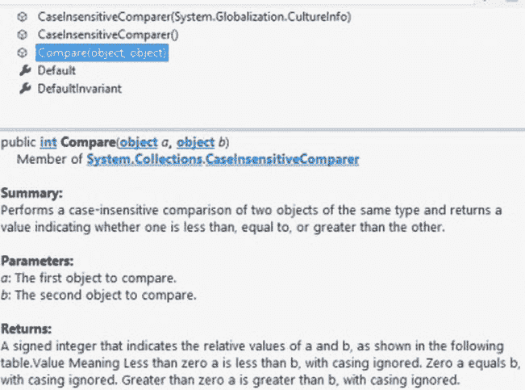

    [图 5-7](#_Fig7) 。对象浏览器

14.  对象浏览器使您能够浏览对象层次结构，并查看有关层次结构中的项和方法的信息。花些时间探索对象浏览器。完成后，关闭对象浏览器并关闭"类视图"窗口。

**探索工具箱和属性窗口**

要浏览 VS 工具箱和属性窗口，请遵循以下步骤:

1.  In the Solution Explorer window, double-click the Form1.cs node. This brings up the Form1 design tab in the main editing window. Locate the Toolbox tab to the left of the main editing window. Click the tab and the Toolbox window should expand, as shown in [Figure 5-8](#Fig8). In the upper-right corner of the Toolbox, you should see the auto-hide icon, which looks like a thumbtack. Click the icon to turn off the auto-hide feature.

    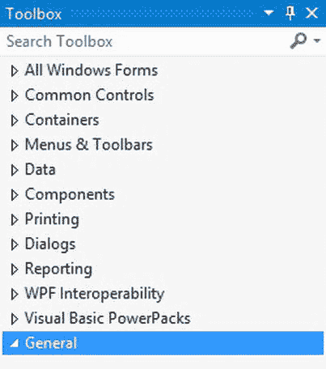

    [图 5-8](#_Fig8) 。VS 工具箱

2.  在“工具箱”的“所有 Windows 窗体”节点下是一些控件，您可以将它们拖放到窗体上以构建 GUI。还有其他包含非图形组件的节点，这些组件有助于简化一些常见编程任务的创建和管理。例如，数据节点包含用于访问和管理数据存储的控件。向下滚动工具箱窗口，观察设计器公开的各种控件。
3.  Under the All Windows Forms node, select the Label control. Move the cursor over the form; it should change to a crosshairs pointer. Draw a label on the form by clicking, dragging, and then releasing the mouse. In a similar fashion, draw a TextBox control and a Button control on the form. [Figure 5-9](#Fig9) shows how the form should look.

    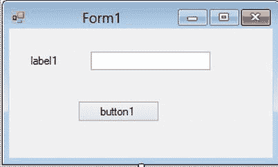

    [图 5-9](#_Fig9) 。示例表单布局

4.  通过单击工具箱窗口右上角的自动隐藏(图钉)图标，重新打开工具箱的自动隐藏功能。
5.  在“解决方案资源管理器”窗口下，找到主编辑窗口右侧的“属性”窗口。(您也可以在菜单步骤中选择查看属性窗口，打开属性窗口。)属性窗口显示设计视图中当前选定对象的属性。您还可以通过此窗口编辑对象的许多属性。
6.  In the Form1 design window, click Label1\. The Label1 control should be selected in the drop-down list at the top of the Properties window (see [Figure 5-10](#Fig10)). Locate the `Text` property and change it to “Enter your password:” (minus the quotes).

    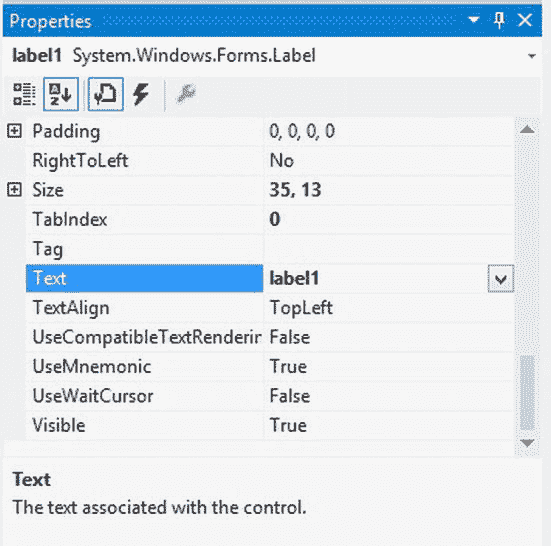

    [图 5-10](#_Fig10) 。VS 属性窗口

     **注意**你可能需要重新排列表单上的控件才能看到所有的文本。

7.  将 TextBox1 的`Password Char`属性设置为*。将 Button1 的`Text`属性改为 OK。(单击窗体上的控件或使用“属性”窗口顶部的下拉列表来查看控件的属性。)
8.  通过选择文件全部保存来保存项目。

**构建和执行汇编**

要构建和执行程序集，请遵循以下步骤:

1.  在解决方案资源管理器中，双击 Form1 以打开设计窗口。
2.  在窗体设计器中，双击 Button1 控件。Form1 的代码编辑器将显示在主编辑窗口中。代码编辑器中添加了一个处理按钮单击事件的方法。
3.  Add the following code to the method. This code will display the password entered in TextBox1 on the title bar of the form.

    `private void button1_Click(object sender, EventArgs e)`

    `{`

    `this.Text = "Your password is " + textBox1.Text;`

    `}`

4.  Select Build  Build Solution. The Output window shows the progress of compiling the assembly (see [Figure 5-11](#Fig11)). Once the assembly has been compiled, it is ready for execution. (If you can’t locate the Output window, select View menu  Output.)

    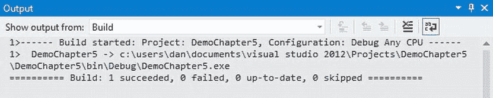

    [图 5-11](#_Fig11) 。输出窗口中显示的生成进度

5.  选择调试开始调试。这将在调试模式下运行程序集。表单加载后，输入密码并单击 OK 按钮。您应该会在表单的标题栏中看到包含密码的消息。单击右上角的 x 关闭表单。
6.  选择文件保存全部，然后通过选择文件退出退出 VS。

活动 5-2。使用 VS 的调试特性

在本活动中，您将熟悉以下内容:

*   设置断点并单步执行代码
*   使用 VS IDE 中的各种调试窗口
*   使用错误列表窗口定位并修复构建错误

**步进代码**

若要逐句通过您的代码，请按照下列步骤操作:

1.  开始 VS .选择文件新建项目。
2.  在 C# Windows 模板下，选择控制台应用。将项目活动重命名为 5_2。
3.  You will see a Program class file open in the code editor. The class file has a `Main` method that gets executed first when the application runs. Add the following code to the program class. This code contains a method that loads a list of numbers and displays the contents of the list in the console window.

    `class Program`

    `{`

    `static List<int> numList = new List<int>();`

    `static void Main(string[] args)`

    `{`

    `LoadList(10);`

    `foreach (int i in numList)`

    `{`

    `Console.WriteLine(i);`

    `}`

    `Console.ReadLine();`

    `}`

    `static void LoadList(int iMax)`

    `{`

    `for (int i = 1; i <= iMax; i++)`

    `{`

    `numList.Add(i);`

    `}`

    `}`

    `}`

4.  To set a breakpoint (which pauses program execution), place the cursor on the declaration line of the `Main` method, right-click, and choose Breakpoint  Insert Breakpoint. A red dot will appear in the left margin to indicate that a breakpoint has been set (see [Figure 5-12](#Fig12)).

    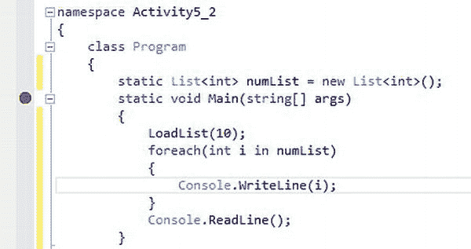

    [图 5-12](#_Fig12) 。在代码编辑器中设置断点

5.  选择调试开始调试。程序执行将在断点处暂停。黄色箭头表示将要执行的下一行代码。
6.  Select View  Toolbars and click the Debug toolbar. (A check next to the toolbar name indicates it is visible.) To step through the code one line at a time, select the Step Into button on the Debug toolbar (see [Figure 5-13](#Fig13)). (You can also press the F11 key.) Continue stepping through the code until you get to the LoadList.

    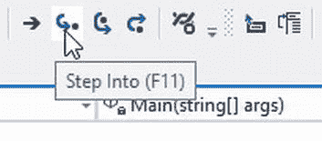

    [图 5-13](#_Fig13) 。使用调试工具栏

7.  逐句通过代码，直到`for`循环循环几次。此时，您可能对这段代码的运行感到满意，并且想要跳出这个方法。在“调试”工具栏上，单击“跳出”按钮。您应该返回到 Main 方法。
8.  继续遍历代码，直到`for-each`循环循环了几次。此时，您可能希望返回到运行时模式。为此，请单击“调试”工具栏上的“继续”按钮。当控制台窗口出现时，按 enter 键关闭窗口。
9.  再次以调试模式启动应用。单步执行代码，直到到达方法调用`LoadList(10);`。
10.  在“调试”工具栏上，选择“单步执行”按钮。这将执行该方法，并在执行返回到调用代码后重新进入中断模式。单步执行该方法后，继续单步执行几行代码，然后选择"调试"工具栏上的"停止"按钮。单击左边距中的红点以删除断点。

**设置条件断点**

要设置条件断点，请遵循以下步骤:

1.  In the Program.cs file locate the `LoadList` method. Set a breakpoint on the following line of code:

    `numList.Add(i);`

2.  Open the Breakpoints window by selecting Debug  Windows  Breakpoints. You should see the breakpoint you just set listed in the Breakpoints window (see [Figure 5-14](#Fig14)).

    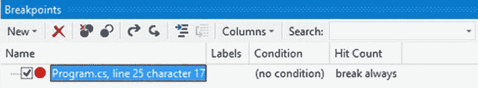

    [图 5-14](#_Fig14) 。断点窗口

3.  Right-click the breakpoint in the Breakpoints window and select Condition. You will see the Breakpoint Condition dialog box. Enter i == 3 as the condition expression and click the OK button (see [Figure 5-15](#Fig15)).

    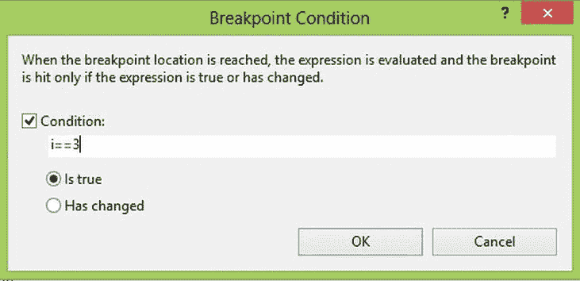

    [图 5-15](#_Fig15) 。断点条件对话框

4.  选择调试开始。程序执行将暂停，您将看到一个黄色箭头，指示将执行的下一行。
5.  Select Debug  Windows  Locals. The Locals window is displayed at the bottom of the screen (see [Figure 5-16](#Fig16)). The value of i is displayed in the Locals window. Verify that it is 3\. Step through the code using the Debug toolbar and watch the value of i change in the Locals window. Click the Stop Debugging button in the Debug toolbar.

    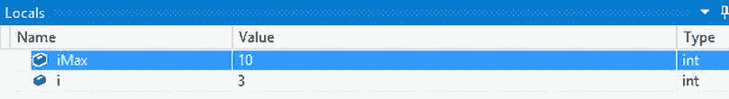

    [图 5-16](#_Fig16) 。局部窗口

6.  在屏幕底部找到断点窗口。在“断点”窗口中右击断点，然后选择“条件”。通过清除“条件”复选框来清除当前条件，然后单击“确定”按钮。
7.  在“断点”窗口中右击断点，然后选择“命中次数”。将断点设置为命中次数等于 4 时中断，然后单击“确定”。
8.  选择调试开始。程序执行将暂停，黄色箭头指示将执行的下一行代码。
9.  Right-click the `numList` statement and select Add Watch. A Watch window will be displayed with `numList` in it. Notice that `numList` is a `System.Collections.Generics.List` type. Click the plus sign next to `numList`. Verify that the list contains three items (see [Figure 5-17](#Fig17)). Step through the code and watch the array fill with items. Click the Stop button in the Debug toolbar.

    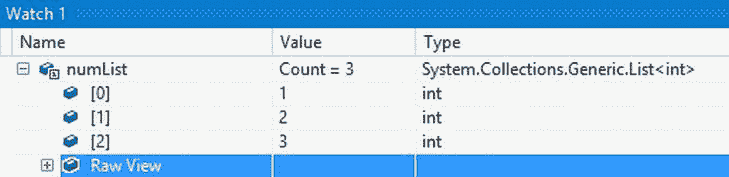

    [图 5-17](#_Fig17) 。观察窗

**定位并修复构建错误**

要定位并修复构建错误，请遵循以下步骤:

1.  In the `Program` class, locate the following line of code and comment it out by placing a two slashes in front of it, as shown here:

    `//static List<int> numList = new List<int>();`

2.  注意代码中`numList`下面的红色曲线。这表明在应用运行之前必须修复一个生成错误。将鼠标悬停在该行上会显示关于错误的更多信息。
3.  Select Build  Build Solution. The Error List window will appear at the bottom of the screen, indicating a build error (see [Figure 5-18](#Fig18)).

    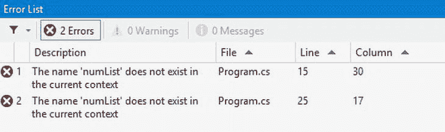

    [图 5-18](#_Fig18) 。使用“错误列表”窗口定位生成错误

4.  在"错误列表"窗口中双击包含生成错误的行。相应的代码将在代码编辑器中可见。
5.  通过删除斜线取消对步骤 1 中注释的行的注释。选择构建构建解决方案。这一次，输出窗口显示在屏幕的底部，表明没有构建错误。
6.  保存项目并退出 VS。

摘要

本章向您介绍了的基础知识 .NET 框架。您回顾了的一些基本目标 .NET 框架。你也看到了 .NET Framework 的结构以及 CLR 编译和执行代码的方式。这些概念都是相关且一致的 .NET 兼容的编程语言。此外，您还探索了 Visual Studio 集成开发环境的一些特性。虽然您不需要 IDE 来开发 .NET 应用，当涉及到生产力、调试和代码管理时，使用它是非常宝贵的。

使用 C# 可以开发许多类型的应用。这些应用包括使用 ASP.NET 的 Windows 桌面应用、使用 WPF 的 web 应用、使用 WinRT 的 Windows 应用商店应用以及使用 ASP.NET 或 WCF Web API 的应用服务应用。在以后的章节中，你将会看到这些技术，但是首先你需要学习如何使用 C# 编程。下一章是系列文章的第一章，着眼于 OOP 概念——比如类结构、继承和多态——是如何在 C# 代码中实现的。