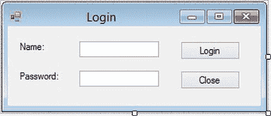
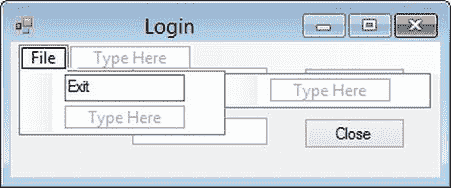
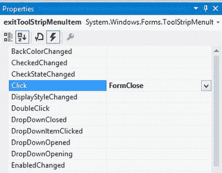
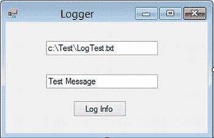
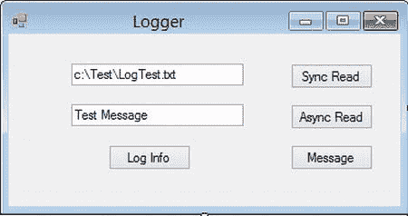

# 八、实现对象协作

在第 7 章中，你学习了如何在 C# 中创建和使用类层次结构。那一章还介绍了继承、多态和接口的概念。在这一章中，你将学习如何让应用的对象一起工作来执行任务。您将看到对象如何通过消息传递进行通信，以及事件如何启动应用处理。您还将了解对象如何响应和交流在执行分配给它们的任务时可能出现的异常。

阅读本章后，您应该熟悉以下内容:

*   通过消息传递进行对象通信的过程
*   可能出现的不同类型的消息传递
*   如何在 C# 应用中使用委托
*   对象如何响应事件并发布自己的事件
*   发布和响应异常的过程
*   如何在同一个类的几个实例之间创建共享数据和过程
*   如何异步发出消息调用

通过消息传递进行交流

OOP 的优势之一是它的许多方面都模仿了现实世界。之前，您看到了如何使用公司中的雇员来表示一个`Employee`类的实例。我们可以将这种类比扩展到类(对象)的实例在应用中如何交互。例如，在大公司中，员工执行专门的功能。一个人负责应付账款的处理，另一个人负责应收账款的操作。当一名员工需要请求服务时——例如带薪休假(PTO)——该员工向她的经理发送一条消息。我们可以将这种交互视为请求者(员工)和服务提供者(经理)之间的服务请求。这个请求可以只涉及一个对象(自助请求)，两个对象，或者它可以是一个复杂的请求者/服务提供者请求链。例如，员工向她的经理申请 PTO，经理反过来与人力资源(HR)部门核实该员工是否有足够的累积时间。在这种情况下，经理既是员工的服务提供者，也是人力资源部门的服务请求者。

定义方法签名

当消息在请求者和服务提供者之间传递时，请求者可能会也可能不会期待响应。例如，当一个员工请求 PTO 时，她希望得到一个表示批准或拒绝的响应。然而，当会计部门发放工资时，员工们并不期望公司里的每个人都会发一封回复邮件来感谢他们！

发布消息时的一个常见要求是包含执行请求所必需的信息。当员工请求 PTO 时，她的经理希望她向他提供她请求的休假日期。在 OOP 术语中，您将方法的名称(请求的服务)和输入参数(请求者提供的信息)称为方法签名。

下面的代码演示了如何在 C# 中定义方法。访问修饰符后面首先是返回类型(如果没有返回值，则使用`void`),然后是方法名。参数类型和名称列在括号中，用逗号分隔。方法的主体包含在左花括号和右花括号中。

```cs
public int AddEmployee(string firstName,string lastName)
{
    //Code to save data to database
}
public void LogMessage(string message)
{
    //Code to write to log file.
}
```

传递参数

当在类中定义方法时，还必须指示参数是如何传递的。参数可以通过值或引用传递。

如果选择按值传递参数，参数数据的副本将从调用例程传递给请求的方法。被请求的方法使用副本，如果对数据进行了更改，被请求的方法必须将副本传递回调用例程，以便调用者可以选择放弃更改或复制它们。回到公司的类比，想想更新你的员工档案的过程。人力资源部门不会让你直接接触文件；相反，它会向您发送文件中值的副本。您对副本进行更改，然后将其发送回人力资源部门。然后，人力资源部门决定是否将这些更改复制到实际的员工档案中。在 C# 中，默认情况下通过值传递参数，因此不使用关键字。在下面的方法中，参数通过值传递:

```cs
public int AddEmployee(string firstName)
{
    //Code to save data to database
}
```

传递参数的另一种方式是通过引用。在这种情况下，请求代码不会传入数据的副本，而是传递数据所在位置的引用。以前面的例子为例，当您想要进行更新时，人力资源部门不会向您发送员工文件中数据的副本，而是通知您文件的位置，并告诉您去该部门进行更改。在这种情况下，显然，通过引用传递参数会更好。在 C# 代码中，当通过引用传递参数时，使用了`ref`关键字。下面的代码演示如何定义通过引用传递值的方法:

```cs
public int AddEmployee(ref string firstName)
{
    //Code to save data to database
}
```

当应用被设计为跨处理边界通信的组件时，甚至在不同的计算机上托管时，通过值而不是通过引用传递参数是有利的。通过引用传递参数会导致开销增加，因为当服务提供对象必须使用参数信息时，它需要跨处理边界和网络进行调用。单个处理请求可能会导致请求者和服务器提供者之间的多次来回调用。在维护数据完整性时，通过引用传递值也会导致问题。请求者在服务器不知情或无法控制的情况下，为要操作的数据打开了通道。

另一方面，当调用代码和被请求的方法在同一个处理空间中(可以说，它们占用同一个“隔间”)并且具有明确建立的信任关系时，通过引用传递值可能是更好的选择。在这种情况下，允许直接访问内存存储位置并通过引用传递参数可以提供优于通过值传递参数的性能优势。

通过引用传递参数可能有好处的另一种情况是，如果对象是复杂数据类型，例如另一个对象。在这种情况下，复制数据结构并跨进程和网络边界传递它的开销超过了跨网络重复调用的开销。

 **注**这个 .NET Framework 通过在 XML 结构中序列化和反序列化复杂数据类型，允许您有效地复制和传递这些类型，从而解决了复杂数据类型的问题。

理解事件驱动编程

到目前为止，您已经看到了对象之间的消息传递，其中直接请求启动了消息交互。如果你想一想你在现实生活中是如何与物体互动的，你会经常收到信息来回应已经发生的事件。以办公室为例，当卖三明治的小贩走进大楼时，对讲机会发出信息通知员工午餐车已经到了。这种类型的消息传递被称为广播消息传递。发出一条消息，接收者决定是忽略还是响应这条消息。

发布此事件消息的另一种方式是，接待员向一组员工发送一封电子邮件，这些员工有兴趣知道三明治供应商何时出现。在这种情况下，感兴趣的员工将向接待员订阅以接收事件消息。这种类型的消息传递通常被称为基于订阅的消息传递。

用 .NET 框架是面向对象的、事件驱动的程序。如果您跟踪应用中出现的请求/服务提供者处理链，您就可以确定启动处理的事件。在 Windows 应用的情况下，与 GUI 交互的用户通常会启动事件。例如，用户可以通过单击按钮启动将数据保存到数据库的过程。应用中的类也可以启动事件。当检测到无效登录时，安全类可以广播事件消息。您还可以订阅外部事件。您可以创建一个 Web 服务，当您在股市中跟踪的股票发生变化时，该服务将发出事件通知。您可以编写一个订阅服务并响应事件通知的应用。

理解委托

为了在 C# 中实现基于事件的编程，您必须首先了解委托。委托是指通过调用服务提供者的方法来请求服务。然后，服务提供者将这个服务请求重新路由到另一个服务该请求的方法。委托类可以检查服务请求，并在运行时动态确定将请求路由到哪里。回到公司的类比，当一个经理收到一个服务请求时，她经常将它委托给她部门的一个成员。(事实上，许多人会认为，成功经理的一个共同特点是知道何时以及如何授权。)

创建委托方法时，首先定义委托方法的签名。因为委托方法实际上并不服务于请求，所以它不包含任何实现代码。下面的代码显示了一个用于比较整数值的委托方法:

```cs
public delegate Boolean CompareInt(int I1, int I2);
```

一旦定义了委托方法的签名，就可以创建要委托的方法。这些方法必须与委托方法具有相同的参数和返回类型。下面的代码显示了委托方法将委托给的两个方法:

```cs
private Boolean AscendOrder(int I1, int I2)
{
    if (I1 < I2)
        { return true;}
    else
        { return false; }
}
private Boolean DescendOrder(int I1, int I2)
{
    if (I1 > I2)
        { return true; }
    else
        { return false; }
}
```

一旦定义了委托及其委托方法，就可以使用委托了。下面的代码显示了排序例程的一部分，它根据作为参数传入的`SortType`来确定调用哪个委托方法:

```cs
public void SortIntegers(SortType sortDirection, int[] intArray)
{
    CompareInt CheckOrder;
    if (sortDirection == SortType.Ascending)
        { CheckOrder = new CompareInt(AscendOrder); }
    else
        { CheckOrder = new CompareInt(DescendOrder); }
    // Code continues ...
}
```

实施事件

在 C# 中，当你想发布事件消息时，首先你要为事件声明一个委托类型。委托类型定义将传递给处理事件的方法的一组参数。

```cs
public delegate void DataUpdateEventHandler(string msg);
```

一旦声明了委托，就声明了委托类型的事件。

```cs
public event DataUpdateEventHandler DataUpdate;
```

当您想要引发事件时，可以通过传入适当的参数来调用事件。

```cs
public void SaveInfo()
{
    try
    {
        DataUpdate("Data has been updated");
    }
    catch
    {
        DataUpdate("Data could not be updated");
    }
}
```

响应事件

为了在客户端代码中使用事件，声明了一个事件处理方法，该方法执行程序逻辑以响应事件。此事件处理程序必须与发出事件的类中声明的事件委托具有相同的方法签名。

```cs
void odata_DataUpdate(string msg)
{
    MessageBox.Show(msg);
}
```

此事件处理程序使用+=运算符向事件源注册。这个过程被称为事件连接。以下代码连接了先前声明的`DataUpdate`事件的事件处理程序:

```cs
Data odata = new Data();
odata.DataUpdate += new DataUpdateEventHandler(odata_DataUpdate);
odata.SaveInfo();
```

Windows 控件事件处理

Windows 窗体还通过使用+=运算符将事件处理程序绑定到事件来实现事件处理程序。下面的代码将一个按钮绑定到一个点击事件，将一个文本框绑定到一个鼠标按下事件:

```cs
this.button1.Click += new System.EventHandler(this.button1_Click);
this.textBox1.MouseDown += new System.Windows.Forms.MouseEventHandler(this.textBox1_MouseDown);
```

控件事件的事件处理程序方法有两个参数:第一个参数`sender`，提供对引发事件的对象的引用。第二个参数传递包含特定于正在处理的事件的信息的对象。下面的代码显示了按钮单击事件的事件处理程序方法和文本框鼠标按下事件的事件处理程序。注意如何使用`e`来确定左键是否被点击。

```cs
private void button1_Click(object sender, EventArgs e)
{

}
private void textBox1_MouseDown(object sender, MouseEventArgs e)
{
    if (e.Button == System.Windows.Forms.MouseButtons.Left)
    {
        //code goes here.
    }
}
```

活动 8-1。发布和响应事件消息

在本活动中，您将学习做以下事情:

*   从服务器类创建和引发事件
*   处理来自客户端类的事件
*   处理 GUI 事件

**在类定义中添加和引发事件消息**

要在类定义文件中添加和引发事件消息，请遵循以下步骤:

1.  启动 Visual Studio。选择文件新建项目。
2.  选择一个 Windows 窗体应用项目。将项目命名为`Activity8_1`。
3.  A default form is included in the project. Add controls to the form and change the property values, as listed in [Table 8-1](#Tab1). Your completed form should look similar to [Figure 8-1](#Fig1).

    [表 8-1。](#_Tab1)登录表单和控件属性

    | **物体** | **属性** | **值** |
    | --- | --- | --- |
    | `Form1` | `Name` | `frmLogin` |
    |  | `Text` | `Login` |
    | `Label1` | `Name` | `lblName` |
    |  | `Text` | `Name:` |
    | `Label2` | `Name` | `lblPassword` |
    |  | `Text` | `Password:` |
    | `Textbox1` | `Name` | `txtName` |
    |  | `Text` | `(empty)` |
    | `Textbox2` | `Name` | `txtPassword` |
    |  | `Text` | `(empty)` |
    |  | `PasswordChar` | `*` |
    | `Button1` | `Name` | `btnLogin` |
    |  | `Text` | `Login` |
    | `Button2` | `Name` | `btnClose` |
    |  | `Text` | `Close` |

    

    [图 8-1](#_Fig1) 。完整的登录表单

4.  选择项目添加类别。给类命名`Employee`。在代码编辑器中打开`Employee`类代码。
5.  Above the class declaration, add the following line of code to define the login event handler delegate. You will use this event to track employee logins to your application.

    `public delegate void LoginEventHandler(string loginName, Boolean status);`

6.  Inside the class declaration, add the following line of code to define the `LoginEvent` as the delegate type:

    `public event LoginEventHandler LoginEvent;`

7.  Add the following `Login` method to the class, which will raise the `LoginEvent`:

    `public void Login(string loginName, string password)`

    `{`

    `//Data normally retrieved from database.`

    `if (loginName == "Smith" && password == "js")`

    `{`

    `LoginEvent(loginName, true);`

    `}`

    `else`

    `{`

    `LoginEvent(loginName, false);`

    `}`

    `}`

8.  选择构建构建解决方案。确保"错误列表"窗口中没有生成错误。如果有，修复它们，然后重新构建。

**接收客户端类中的事件**

要在客户端类中接收事件，请遵循以下步骤:

1.  在设计窗口中打开 frmLogin。
2.  双击登录按钮以查看登录按钮 click 事件处理程序。
3.  Add the following code to wire up the `Employee` class’s `LoginEvent` with an event handler in the form class:

    `private void btnLogin_Click(object sender, EventArgs e)`

    `{`

    `Employee oEmployee = new Employee();`

    `oEmployee.LoginEvent += new LoginEventHandler(oEmployee_LoginEvent);`

    `oEmployee.Login(txtName.Text, txtPassword.Text);`

    `}`

4.  Add the following event handler method to the form that gets called when the `Employee` class issues a `LoginEvent`:

    `void oEmployee_LoginEvent(string loginName, bool status)`

    `{`

    `MessageBox.Show("Login status :" + status);`

    `}`

5.  选择构建构建解决方案。确保"错误列表"窗口中没有生成错误。如果有，修复它们，然后重新构建。
6.  选择调试开始运行项目。
7.  要测试以确保引发了`Login`事件，请输入登录名 Smith 和密码 js。这应该会触发 true 登录状态。
8.  测试登录事件后，关闭窗体，这将停止调试器。

**用一种方法处理多个事件**

要用一种方法处理多个事件，请遵循以下步骤:

1.  通过在解决方案资源管理器中右键单击 frmLogin 节点并选择“视图设计器”,在窗体设计器中打开 frmLogin。
2.  From the Toolbox, add a MenuStrip control to the form. Click where it says “Type Here” and enter File for the top-level menu and Exit for its submenu, as shown in [Figure 8-2](#Fig2).

    

    [图 8-2](#_Fig2) 。添加 MenuStrip 控件

3.  Add the following method to handle the click event of the menu and the Close button:

    `private void FormClose(object sender, EventArgs e)`

    `{`

    `this.Close();`

    `}`

4.  Open frmLogin in the designer window. In the properties window, select the exitToolStripMenuItem. Select the event button (lightning bolt) at the top of the properties window to show the events of the control. In the click event drop-down, select the `FormClose` method (see [Figure 8-3](#Fig3)).

    

    [图 8-3](#_Fig3) 。连接事件处理程序

5.  重复步骤 4 将`btnClose`按钮点击事件绑定到`FormClose`方法。
6.  在解决方案窗口中展开 Form1.cs 节点。右键单击表格 1。Designer.cs 节点并选择“查看代码”。
7.  In the code editor, expand the Windows Form Designer generated code region. Search for the code listed below. This code was generated by the form designer to wire up the events to the `FormClose` method.

    `this.btnClose.Click += new System.EventHandler(this.FormClose);`

    `this.exitToolStripMenuItem.Click += new System.EventHandler(this.FormClose);`

8.  选择构建构建解决方案。确保"错误列表"窗口中没有生成错误。如果有，修复它们，然后重新构建。
9.  选择调试开始运行项目。测试退出菜单和关闭按钮。
10.  测试后，保存项目，然后退出 Visual Studio。

中处理异常 .NET 框架

当对象协作时，事情可能会出错。异常是在正常处理过程中不希望发生的事情。例如，当连接失败时，您可能试图通过网络将数据保存到数据库中，或者您可能试图将数据保存到驱动器中没有磁盘的驱动器中。您的应用应该能够优雅地处理应用处理过程中发生的任何异常。

的 .NET 框架使用结构化的异常处理机制。以下是这种结构化异常处理的一些优势:

*   所有人的共同支持和结构 .NET 语言
*   支持创建受保护的代码块
*   过滤异常以创建高效可靠的错误处理的能力
*   支持终止处理程序，以保证完成清理任务，而不管可能遇到的任何异常

的 .NET Framework 还提供了大量的异常类，用于处理可能发生的常见异常。例如，`FileNotFoundException`类封装了诸如文件名、错误消息以及当试图访问一个不存在的文件时抛出的异常的来源等信息。此外 .NET Framework 允许创建应用特定的异常类，您可以编写这些异常类来处理应用特有的常见异常。

使用 Try-Catch 块

当创建可能导致异常的代码时，您应该将它放在`try`块中。放置在`try`块中的代码被认为是受保护的。如果在受保护代码执行过程中出现异常，代码处理将被转移到`catch`块，在那里进行处理。下面的代码演示了一个类的方法，该方法尝试从不存在的文件中读取数据。当抛出异常时，它被捕获在`catch`块中。

```cs
public string ReadText(string filePath)
{
    StreamReader sr;
    try
    {
        sr = File.OpenText(filePath);
        string fileText = sr.ReadToEnd();
        sr.Close();
        return fileText;
    }
    catch(Exception ex)
    {
        return ex.Message;
    }
}
```

所有的`try`块都需要至少一个嵌套的`catch`块。您可以使用`catch`块来捕获`try`块中可能出现的所有异常，或者您可以使用它根据异常的类型来过滤异常。这使您能够根据异常类型动态响应不同的异常。下面的代码演示了如何根据从磁盘读取文本文件时可能发生的不同异常来筛选异常:

```cs
public string ReadText(string filePath)
{
    StreamReader sr;
    try
    {
        sr = File.OpenText(filePath);
        string fileText = sr.ReadToEnd();
        sr.Close();
        return fileText;
    }
    catch (DirectoryNotFoundException ex)
    {
        return ex.Message;
    }
    catch (FileNotFoundException ex)
    {
        return ex.Message;
    }
    catch(Exception ex)
    {
        return ex.Message;
    }
}
```

添加 Finally 块

此外，您可以在`try`块的末尾嵌套一个`finally`块。与`catch`块不同，`finally`块的使用是可选的。`finally`块用于任何需要发生的清理代码，即使遇到异常。例如，您可能需要关闭数据库连接或释放文件。当`try`块的代码被执行并且异常发生时，处理将评估每个`catch`块，直到找到合适的捕捉条件。在`catch`块执行后，将执行`finally`块。如果`try`块执行并且没有遇到异常，那么`catch`块不会执行，但是`finally`块仍然会被处理。下面的代码显示了一个用于关闭和释放`StreamReader`的`finally`块:

```cs
public string ReadText(string filePath)
{
    StreamReader sr = null;
    try
    {
        sr = File.OpenText(filePath);
        string fileText = sr.ReadToEnd();
        return fileText;
    }
    catch (DirectoryNotFoundException ex)
    {
        return ex.Message;
    }
    catch (FileNotFoundException ex)
    {
        return ex.Message;
    }
    catch (Exception ex)
    {
        return ex.Message;
    }
        finally
    {
        if (sr != null)
        {
            sr.Close();
            sr.Dispose();
        }
    }
}
```

抛出异常

在代码执行期间，当进行不适当的调用时，例如，方法的参数具有无效值或者传递给方法的参数导致异常，您可以抛出异常来通知调用代码违规。在下面的代码中，如果`orderDate`参数大于当前日期，就会向调用代码抛出一个`ArgumentOutOfRangeException`,通知它们发生了冲突。

```cs
if (orderDate > DateTime.Now)
{
    throw new ArgumentOutOfRangeException ("Order date can not be in the future.");
}
//Processing code...
```

 **注意**如果在 .NET Framework，您可以创建一个从`System.Exception`类派生的自定义异常类。

嵌套异常处理

在某些情况下，您可能能够纠正发生的异常，并继续处理`try`块中剩余的代码。例如，可能会出现被零除的错误，将结果赋值为零并继续处理是可以接受的。在这种情况下，try-catch 块可以嵌套在导致异常的代码行周围。处理完异常后，处理将返回到嵌套的`try`块之后的外层`try-catch`块中的代码行。下面的代码演示了如何将一个`try`块嵌套在另一个块中:

```cs
try
{
    try
    {
        Y = X1 / X2;
    }
    catch (DivideByZeroException ex)
    {
        Y = 0;
    }
    //Rest of processing code.
}
catch (Exception ex)
{
    //Outer exception processing
}
```

 **注**了解更多关于处理异常和 .NET 框架异常类，请参考附录 b。

静态属性和方法

当您声明一个类的对象实例时，该对象实例化它所实现的类的属性和方法的自己的实例。例如，如果你要写一个增加计数器的计数例程，然后实例化该类的两个对象实例，每个对象的计数器将彼此独立；当您增加一个计数器时，另一个不会受到影响。正常情况下，这种对象独立性就是你想要的行为。但是，有时您可能希望一个类的不同对象实例访问相同的共享变量。例如，您可能希望构建一个计数器，记录已经实例化了多少个对象实例。在这种情况下，您将在类定义中创建一个静态属性值。以下代码演示了如何在类定义中创建静态`TaxRate`属性:

```cs
public class AccountingUtilities
{
    private static double _taxRate = 0.06;

    public static double TaxRate
    {
        get { return _taxRate; }
    }
}
```

要访问静态属性，不需要创建该类的对象实例；相反，您可以直接引用该类。下面的代码显示了一个访问先前定义的静态属性`TaxRate`的客户端:

```cs
public class Purchase
{
    public double CalculateTax(double purchasePrice)
    {
        return purchasePrice * AccountingUtilities.TaxRate;
    }
}
```

如果您有客户端需要访问的实用函数，但是您不希望通过创建类的对象实例来获得对方法的访问，那么静态方法是非常有用的。请注意，静态方法只能访问静态属性。下面的代码显示了一个静态方法，用于计算当前登录到应用的用户数量:

```cs
public class UserLog
{
    private static int _userCount;
    public static void IncrementUserCount()
    {
        _userCount += 1;
    }
    public static void DecrementUserCount()
    {
        _userCount -= 1;
    }
}
```

当客户端代码访问静态方法时，它通过直接引用该类来实现。下面的代码演示了如何访问前面定义的静态方法:

```cs
public class User
{
    //other code ...
    public void Login(string userName, string password)
    {
        //code to check credentials
        //if successful
        UserLog.IncrementUserCount();
    }
}
```

虽然在应用中创建类时可能不经常使用静态属性和方法，但它们在创建基类库时很有用，并且在整个 .NET Framework 系统类。下面的代码演示了`System.String`类的`Compare`方法的使用。这是一个静态方法，按字母顺序比较两个字符串。如果第一个字符串大于，则返回正值；如果第二个字符串大于，则返回负值；如果两个字符串相等，则返回零。

```cs
public Boolean CheckStringOrder(string string1, string string2)
{
    if (string.Compare(string1, string2) >= 0)
    {
        return true;
    }
    else
    {
        return false;
    }
}
```

活动 8-2。实现异常处理和静态方法

在本活动中，您将学习如何执行以下操作:

*   创建并调用类的静态方法
*   使用结构化异常处理

**创建静态方法**

要创建静态方法，遵循以下步骤:

1.  启动 Visual Studio。选择文件新建项目。
2.  选择一个 Windows 应用项目。将项目命名为 Activity8_2。
3.  Visual Studio creates a default form for the project which you’ll use to create a login form named Logger. Add controls to the form and change the property values, as listed in [Table 8-2](#Tab2). Your completed form should look similar to [Figure 8-4](#Fig4).

    

    [图 8-4](#_Fig4) 。已完成的记录器表单

    [表 8-2。](#_Tab2)记录器表单和控件属性

    | **物体** | **属性** | **值** |
    | --- | --- | --- |
    | `Form1` | `Name` | `frmLogger` |
    |  | `Text` | `Logger` |
    | `Textbox1` | `Name` | `txtLogPath` |
    |  | `Text` | `c:\Test\LogTest.txt` |
    | `Textbox2` | `Name` | `txtLogInfo` |
    |  | `Text` | `Test Message` |
    | `Button1` | `Name` | `btnL ogInfo` |
    |  | `Text` | `Log Info` |

4.  选择项目添加类。给类命名`Logger`。
5.  Because you will be using the `System.IO` class within the `Logger` class, add a `using` statement to the top of the class file:

    `using System.IO;`

6.  Add a static `LogWrite` method to the class. This method will write information to a log file. To open the file, create a `FileStream` object. Then create a `StreamWriter` object to write the information to the file. Notice the use of the `using` blocks to properly dispose the `FileStream` and `StreamWriter` objects and release the resources.

    `public static string LogWrite(string logPath, string logInfo)`

    `{`

    `using (FileStream oFileStream = new FileStream(logPath, FileMode.Open, FileAccess.Write))`

    `{`

    `using (StreamWriter oStreamWriter = new StreamWriter(oFileStream))`

    `{`

    `oFileStream.Seek(0, SeekOrigin.End);`

    `oStreamWriter.WriteLine(DateTime.Now);`

    `oStreamWriter.WriteLine(logInfo);`

    `oStreamWriter.WriteLine();`

    `}`

    `}`

    `return "Info Logged";`

    `}`

7.  Open frmLogger in the visual design editor. Double click the btnLogInfo button to bring up the `btnLogInfo_Click` event method in the code editor. Add the following code, which runs the `LogWrite` method of the `Logger` class and displays the results in the form’s text property. Note that because you designated the `LogWrite` method as static (in step 6), the client does not need to create an object instance of the `Logger` class. Static methods are accessed directly through a class reference.

    `private void btnLogInfo_Click(object sender, EventArgs e)`

    `{`

    `this.Text = Logger.LogWrite(txtLogPath.Text, txtLogInfo.Text);`

    `}`

8.  选择构建构建解决方案。确保"错误列表"窗口中没有生成错误。如果有，修复它们，然后重新构建。
9.  选择调试运行。当表单启动时，单击 Log Info 按钮。您应该得到一个类型为`System.IO.DirectoryNotFoundException`的未处理异常消息。停止调试器。

**创建结构化异常处理程序**

要创建结构化异常处理程序，请遵循以下步骤:

1.  在代码编辑器中打开`Logger`类代码。
2.  Locate the `LogWrite` method and add a try-catch block around the current code. In the catch block, return a string stating the logging failed.

    `try`

    `{`

    `using (FileStream oFileStream = new FileStream(logPath, FileMode.Open, FileAccess.Write))`

    `{`

    `using (StreamWriter oStreamWriter = new StreamWriter(oFileStream))`

    `{`

    `oFileStream.Seek(0, SeekOrigin.End);`

    `oStreamWriter.WriteLine(DateTime.Now);`

    `oStreamWriter.WriteLine(logInfo);`

    `oStreamWriter.WriteLine();`

    `}`

    `}`

    `return "Info Logged";}`

    `catch`

    `{`

    `return "Logging Failed";`

    `}`

3.  选择构建构建解决方案。确保"错误列表"窗口中没有生成错误。如果有，修复它们，然后重新构建。
4.  选择调试运行。当表单启动时，单击 Log Info 按钮。这一次，您应该不会得到异常消息，因为它是由`LogWrite`方法处理的。您应该会在表单的标题中看到消息“日志记录失败”。关闭表单。

**过滤异常**

要过滤例外情况，请遵循以下步骤:

1.  Alter the `catch` block to return different messages, depending on which exception is thrown.

    `catch (FileNotFoundException ex)`

    `{`

    `return ex.Message;`

    `}`

    `catch (IOException ex)`

    `{`

    `return ex.Message;`

    `}`

    `catch`

    `{`

    `return "Logging Failed";`

    `}`

2.  在 Logger 类的`LogWrite`方法上设置断点。
3.  选择调试开始运行项目。通过单击日志信息按钮测试 catch 块。执行将在断点处停止。单步执行代码，注意它被`IOException`块捕获。
4.  测试后，关闭表单。
5.  使用记事本，在 c 盘上的测试文件夹中创建 LogTest.txt 文件，并关闭该文件。确保文件和文件夹未被标记为只读。
6.  选择调试开始运行项目。点击日志信息按钮，测试`WriteLog`方法。这一次，表单的标题应该表明日志写入成功。
7.  停止调试器。
8.  使用记事本打开 LogTest.txt 文件，并验证是否记录了信息。
9.  保存项目，然后退出 Visual Studio。

使用异步消息传递

当对象通过来回传递消息进行交互时，它们可以同步或异步传递消息。

当客户机对象对服务器对象进行同步消息调用时，客户机暂停处理，并在继续之前等待来自服务器的响应。同步消息传递是最容易实现的，也是 .NET 框架。然而，有时这是一种低效的消息传递方式。例如，同步消息传递模型不太适合长时间运行的文件读写、跨慢速网络进行服务调用，或者在客户端断开连接的情况下进行消息排队。为了更有效地处理这些类型的情况 .NET Framework 提供了在对象之间异步传递消息所需的管道。

当客户端对象异步传递消息时，客户端可以继续处理。服务器完成消息请求后，响应信息将被发送回客户端。

如果你想一想，你与现实世界中的对象进行同步和异步的交互。同步消息传递的一个很好的例子是当你在杂货店排队结账时。当店员不能确定其中一个商品的价格时，他会打电话给经理进行价格检查，并暂停结账过程，直到返回结果。异步消息调用的一个例子是当职员注意到他的零钱不够时。他提醒经理，他很快就需要更改，但他可以继续处理客户的商品，直到更改到来。

为了使异步编程更容易实现 .NET Framework 4.5 引入了基于任务的异步模式(TAP) 。当符合 TAP 时，异步方法返回一个任务对象。此任务对象表示正在进行的操作，并允许与调用者进行通信。当调用异步方法时，客户端只需使用 await 修饰符，编译器负责所有必要的管道代码。

在 .NET Framework 中，当您想要创建一个可以异步调用的方法时，您可以使用`async`修饰符。异步方法提供了一种在不阻塞调用者的情况下执行潜在的长时间运行流程的方法。如果包含用户界面(UI)的主线程需要调用长时间运行的进程，这将非常有用。如果进程被同步调用，那么 UI 将冻结，直到进程完成。

一个异步方法应该包含至少一个`await`语句。当遇到`await`语句时，处理被挂起，控制权返回给调用者(本例中是 UI)。因此用户可以继续与 UI 进行交互。一旦异步任务完成，处理返回 await 语句，调用者可以得到处理完成的提示。为了提醒调用者流程已经完成，您创建了一个`Task`返回类型。如果 async 方法需要将信息传递回调用者，则使用`Task<TResult>`。下面的代码显示了一个异步读取文本文件的方法。注意用于调用`StreamReader`类的`ReadToEndAsync`方法的`async`修饰符和`await`关键字。该方法通过一个字符串结果将一个`Task`对象传递回调用者。

```cs
public static async Task<string> LogReadAsync(string filePath)
{
    StreamReader oStreamReader;
    string fileText;
        try
        {
            oStreamReader = File.OpenText(filePath);
            fileText = await oStreamReader.ReadToEndAsync();
            oStreamReader.Close();
            return fileText;
        }
        catch (FileNotFoundException ex)
        {
            return ex.Message;
        }
        catch (IOException ex)
        {
            return ex.Message;
        }
        catch
        {
            return "Logging Failed";
        }
}
```

活动 8-3。异步调用方法

在本活动中，您将学习如何执行以下操作:

*   同步调用方法
*   异步调用方法

**创建一个方法并同步调用它**

要创建方法并同步调用它，请遵循以下步骤:

1.  启动 Visual Studio。选择文件打开项目。
2.  打开您在练习 8_2 中完成的解决方案文件。
3.  Add the buttons shown in [Table 8-3](#Tab3) to the frmLogger form. [Figure 8-5](#Fig5) shows the completed form.

    

    [图 8-5](#_Fig5) 。用于同步和异步读取的完整记录器表单

    表 8-3。记录器表单的附加按钮

    | **物体** | **属性** | **值** |
    | --- | --- | --- |
    | `Button1` | `Name` | `btnSyncRead` |
    |  | `Text` | `Sync Read` |
    | `Button2` | `Name` | `btnAsyncRead` |
    |  | `Text` | `Async Read` |
    | `Button3` | `Name` | `btnMessage` |
    |  | `Text` | `Message` |

4.  在代码编辑器中打开`Logger`类。
5.  Recall that because you are using the `System.IO` namespace within the `Logger` class, you added a using statement to the top of the file. You are also going to use `System.Threading` namespace, so add a using statement to include this namespace.

    `using System.Threading;`

6.  Add a static `LogRead` function to the class. This function will read information from a log file. To open the file, create a `FileStream` object. Then create `StreamReader` object to read the information from the file. You are also using the `Thread` class to suspend processing for five seconds to simulate a long call across a slow network.

    `public static string LogRead(string filePath)`

    `{`

    `StreamReader oStreamReader;`

    `string fileText;`

    `try`

    `{`

    `oStreamReader = File.OpenText(filePath);`

    `fileText = oStreamReader.ReadToEnd();`

    `oStreamReader.Close();`

    `Thread.Sleep(5000);`

    `return fileText;`

    `}`

    `catch (FileNotFoundException ex)`

    `{`

    `return ex.Message;`

    `}`

    `catch (IOException ex)`

    `{`

    `return ex.Message;`

    `}`

    `catch`

    `{`

    `return "Logging Failed";`

    `}`

    `}`

7.  Open frmLogger in the visual design editor. Double click the btnMessage button to bring up the `btnMessage_Click` event method in the code editor. Add code to display a message box.

    `private void btnMessage_Click(object sender, EventArgs e)`

    `{`

    `MessageBox.Show("Hello");`

    `}`

8.  Open frmLogger in the visual design editor. Double-click the btnSyncRead button to bring up the `btnSyncRead_Click` event method in the code editor. Add code that calls the `LogRead` method of the `Logger` class and displays the results in a message box.

    `private void btnSyncRead_Click(object sender, EventArgs e)`

    `{`

    `MessageBox.Show(Logger.LogRead(txtLogPath.Text));`

    `}`

9.  选择构建构建解决方案。确保"错误列表"窗口中没有生成错误。如果有，修复它们，然后重新构建。
10.  选择调试运行。当表单启动时，单击同步读取按钮。点按“同步阅读”按钮后，尝试点按“邮件”按钮。当点击消息按钮时，您应该不会得到响应，因为您同步调用了`ReadLog`方法。ReadLog 方法返回结果后，单击消息按钮将会响应。
11.  完成测试后，关闭表单。

**创建和调用异步方法**

要创建异步方法，请遵循以下步骤:

1.  在代码编辑器中打开`Logger`类代码。
2.  Check for the following using statement at the top of the file. This namespace exposes the `Task` class and other types that are used to implement asynchronous programming.

    `using System.Threading.Tasks;`

3.  Create an asynchronous method that reads the text file. The use of the Task’s `Delay` method is to simulate a long running process.

    `public static async Task<string> LogReadAsync(string filePath)`

    `{`

    `string fileText;`

    `try`

    `{`

    `using (StreamReader oStreamReader = File.OpenText(filePath))`

    `{`

    `fileText = await oStreamReader.ReadToEndAsync();`

    `}`

    `await Task.Delay(10000);`

    `return fileText;`

    `}`

    `catch (FileNotFoundException ex)`

    `{`

    `return ex.Message;`

    `}`

    `catch (IOException ex)`

    `{`

    `return ex.Message;`

    `}`

    `catch`

    `{`

    `return "Logging Failed";`

    `}`

    `}`

4.  Open frmLogger in the visual design editor. Double-click the btnAsyncRead button to bring up the `btnAsyncRead_Click` event method in the code editor. Alter the method so that it is asynchronous.

    `private async void btnAsyncRead_Click(object sender, EventArgs e)`

5.  Add code to call the `LogReadAsync` method of the `Logger` class and display the results in a message box.

    `btnAsyncRead.Enabled = false;`

    `string s = await Logger.LogReadAsync(txtLogPath.Text);`

    `MessageBox.Show(s);`

    `btnAsyncRead.Enabled = true;`

6.  选择构建构建解决方案。确保"错误列表"窗口中没有生成错误。如果有，修复它们，然后重新构建。
7.  选择调试运行。当表单启动时，单击异步读取按钮。单击异步读取按钮后，单击消息按钮。这一次，您应该得到一个响应，因为您异步调用了`ReadLog`方法。五秒钟后，您应该会看到一个消息框，其中包含了`Logger.LogReadAsync`方法的结果。
8.  完成测试后，关闭表单。
9.  保存项目，然后退出 Visual Studio。

摘要

本章描述了应用中的对象如何协作。您看到了对象如何相互传递消息，事件如何驱动程序，类的实例如何共享数据，以及如何处理异常。

在第 9 章中，我们看集合和数组。集合和数组将相似的对象组织成一个组。使用集合是您需要在应用中应用的最常见的编程结构之一。您将研究. NET Framework 中可用的一些基本集合类型，并学习如何在代码中使用集合。