# 九、使用集合

在前一章中，你已经看到了在面向对象的程序中对象是如何协作和通信的。那一章介绍了消息传递、事件、委托、异常处理和异步编程的概念。在这一章中，你将会看到对象集合是如何被组织和处理的。那个 .NET Framework 包含一组用于创建和管理对象集合的广泛的类和接口。您将看到各种类型的集合结构 .NET 提供并了解它们的设计目的以及何时使用它们。您还将看到如何使用泛型来创建高度可重用、高效的集合。

在本章中，您将学习以下内容:

*   公开的各种类型的集合 .NET 框架
*   如何使用数组和数组列表
*   如何创建通用集合
*   如何实现队列和堆栈

介绍 .NET Framework 集合类型

程序员经常需要处理类型的集合。例如，如果你在一个工资系统中处理雇员时间记录，你需要按雇员对记录进行分组，循环遍历记录，并把每个记录的时间加起来。

所有的集合都需要一组基本的函数，比如添加对象、移除对象和遍历它们的对象。除了基本集合之外，一些集合还需要额外的专门功能。例如，在向帮助台电子邮件请求集合中添加和删除项目时，该集合可能需要实现先进先出功能。另一方面，如果请求按严重性划分优先级，那么集合需要能够按优先级对其项目进行排序。

那个 .NET Framework 提供了各种基本的和专门的集合类供您使用。`System.Collections`名称空间包含定义各种类型集合的接口和类，例如列表、队列、哈希表和字典。[表 9-1](#Tab1) 列出并描述了一些常用的收集类。如果没有找到具有所需功能的集合类，可以扩展. NET Framework 类来创建自己的集合类。

[表 9-1。](#_Tab1)常用集合类

| **类** | **描述** |
| --- | --- |
| `Array` | 为支持强类型数组的语言实现提供基类。 |
| `ArrayList` | 使用大小根据需要动态增加的数组表示弱类型对象列表。 |
| `SortedList` | 表示按键排序并可按键和索引访问的键/值对的集合。 |
| `Queue` | 表示对象的先进先出(FIFO)集合。 |
| `Stack` | 表示简单的后进先出(LIFO)的非泛型对象集合。 |
| `Hashtable` | 表示基于键的哈希代码组织的键/值对的集合。 |
| `CollectionBase` | 为强类型集合提供抽象基类。 |
| `DictionaryBase` | 为键/值对的强类型集合提供抽象基类。 |

表 9-2 描述了这些集合类实现的一些接口。

[表 9-2](#_Tab2) 。集合类接口

| **界面** | **描述** |
| --- | --- |
| `ICollection` | 为所有非泛型集合定义大小、枚举数和同步方法。 |
| `IComparer` | 公开比较两个对象的方法。 |
| `IDictionary` | 表示键/值对的非泛型集合。 |
| `IDictionaryEnumerator` | 枚举非泛型字典的元素。 |
| `IEnumerable` | 公开枚举数，该枚举数支持对非泛型集合的简单迭代。 |
| `IEnumerator` | 支持对非泛型集合的简单迭代。 |
| `IList` | 表示可以通过索引单独访问的对象的非一般集合。 |

在本章中，您将使用一些常用的集合类，从`Array`和`ArrayList`类开始。

使用数组和数组列表

数组是计算机编程中最常见的数据结构之一。数组保存相同数据类型的数据元素。例如，你可以创建一个整数、字符串或日期的数组。数组通常用于将值作为参数传递给方法。例如，当您使用控制台应用时，通常会提供命令行开关。下面的 DOS 命令用来在你的电脑上复制一个文件:

```cs
copy win.ini c:\windows /y
```

源文件、目标路径和覆盖指示符作为字符串数组传递到复制程序中。

通过数组的索引来访问数组的元素。索引是一个整数，表示元素在数组中的位置。例如，表示一周中各天的字符串数组具有以下索引值:

| **索引** | **值** |
| Zero | 在星期日 |
| one | 星期一 |
| Two | 星期二 |
| three | 星期三 |
| four | 星期四 |
| five | 星期五 |
| six | 星期六 |

这个星期几的例子是一个一维数组，这意味着索引由单个整数表示。数组也可以是多维的。多维数组元素的索引是一组等于维数的整数。[图 9-1](#Fig1) 显示了一个座位表，表示一个二维数组，其中一个学生的名字(值)被一对有序的行号、座位号(索引)引用。

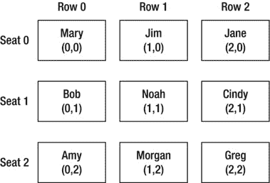

[图 9-1](#_Fig1) 。二维数组

当您声明数组的类型时，就实现了数组功能。作为数组实现的常见类型是数字类型，如整数或双精度类型，以及字符和字符串类型。将类型声明为数组时，在类型后使用方括号(`[]`)，后跟数组的名称。数组的元素由一个用花括号(`{}`)括起来的逗号分隔的列表指定。例如，下面的代码声明了一个类型为`int`的数组，并用五个值填充它:

```cs
int[] intArray = { 1, 2, 3, 4, 5 };
```

一旦一个类型被声明为数组，就暴露了`Array`类的属性和方法。一些功能包括查询数组的上限和下限、更新数组的元素以及复制数组的元素。`Array`类包含许多用于处理数组的静态方法，比如清除、反转和排序数组元素的方法。

下面的代码演示如何声明和使用整数数组。它还使用了几个由`Array`类公开的静态方法。注意用于列出数组值的`foreach`循环。`foreach`循环提供了一种遍历数组元素的方法。

```cs
int[] intArray = { 1, 2, 3, 4, 5 };
Console.WriteLine("Upper Bound");
Console.WriteLine(intArray.GetUpperBound(0));
Console.WriteLine("Array elements");
foreach (int item in intArray)
{
Console.WriteLine(item);
}
Array.Reverse(intArray);
Console.WriteLine("Array reversed");
foreach (int item in intArray)
{
    Console.WriteLine(item);
}
Array.Clear(intArray, 2, 2);
Console.WriteLine("Elements 2 and 3 cleared");
foreach (int item in intArray)
{
    Console.WriteLine(item);
}
intArray[4] = 9;
Console.WriteLine("Element 4 reset");
foreach (int item in intArray)
{
    Console.WriteLine(item);
}
Console.ReadLine();
```

[图 9-2](#Fig2) 显示了控制台窗口中这段代码的输出。

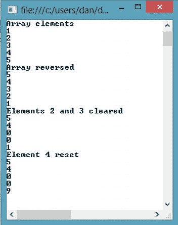

[图 9-2](#_Fig2) 。一维数组输出

虽然一维数组是您将遇到的最常见的类型，但是您应该理解如何处理偶尔出现的多维数组。二维数组用于存储(在活动内存中)和处理适合表的行和列的数据。例如，您可能需要处理几天内每小时进行的一系列测量(温度或辐射水平)。要创建多维数组，可以在方括号内放置一个或多个逗号来表示维数。一个逗号表示两个维度；两个逗号表示三维，依此类推。填充多维数组时，花括号中的花括号定义了元素。下面的代码声明并填充一个二维数组:

```cs
int[,] twoDArray = { { 1, 2 }, { 3, 4 }, { 5, 6 } };
//Print the index and value of the elements
for (int i = 0; i <= twoDArray.GetUpperBound(0); i++)
{
     for (int x = 0; x <= twoDArray.GetUpperBound(1); x++)
     {
          Console.WriteLine("Index = [{0},{1}]  Value = {2}", i, x, twoDArray[i, x]);
     }
}
```

[图 9-3](#Fig3) 显示了控制台窗口中该代码的输出。

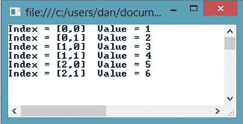

[图 9-3](#_Fig3) 。二维数组输出

当您使用集合时，通常直到运行时才知道它们需要包含的项数。这就是`ArrayList`类适合的地方。数组列表的容量会根据需要自动扩展，内存重新分配和元素复制会自动执行。`ArrayList`类还提供了`Array`类没有提供的处理数组元素的方法和属性。下面的代码演示了其中的一些属性和方法。请注意，随着更多姓名的添加，列表的容量会动态扩展。

```cs
ArrayList nameList = new ArrayList();
nameList.Add("Bob");
nameList.Add("Dan");
nameList.Add("Wendy");
Console.WriteLine("Original Capacity");
Console.WriteLine(nameList.Capacity);
Console.WriteLine("Original Values");
foreach (object name in nameList)
{
    Console.WriteLine(name);
}

nameList.Insert(nameList.IndexOf("Dan"), "Cindy");
nameList.Insert(nameList.IndexOf("Wendy"), "Jim");
Console.WriteLine("New Capacity");
Console.WriteLine(nameList.Capacity);
Console.WriteLine("New Values");
foreach (object name in nameList)
{
    Console.WriteLine(name);
}
```

[图 9-4](#Fig4) 显示了控制台窗口中的输出。

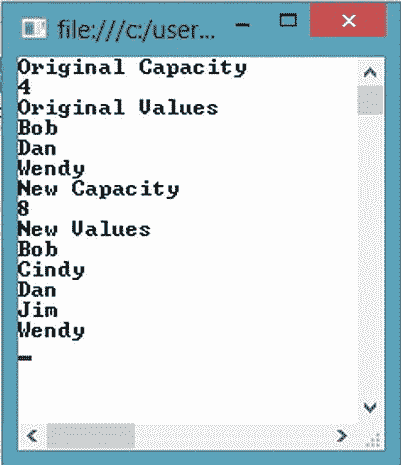

[图 9-4](#_Fig4) 。数组列表输出

虽然使用数组列表通常比使用数组更容易，但是数组列表只能有一维。此外，特定类型的数组比数组列表提供更好的性能，因为`ArrayList`的元素属于类型`Object`。当类型被添加到数组列表中时，它们被转换为通用的`Object`类型。当从列表中检索项目时，必须再次将它们转换为特定类型。

**活动 9-1。使用数组和数组列表**

在本活动中，您将熟悉以下内容:

*   创建和使用数组
*   使用多维数组
*   使用数组列表

**创建和使用数组**

要创建并填充一个数组，遵循以下步骤:

1.  启动 Visual Studio。选择文件新建项目。
2.  选择控制台应用项目。将项目命名为 Activity9_1。控制台应用包含一个名为 Program 的类，它有一个 Main 方法。Main 方法是应用启动时访问的第一个方法。
3.  Notice that the Main method accepts an input parameter of a string array called args. The args array contains any command line arguments passed in when the console application is launched. The members of the args array are separated by a space when passed in.

    `static void Main(string[] args)`

    `{`

    `}`

4.  Add the following code to the Main method to display the command line arguments passed in:

    `Console.WriteLine("parameter count = {0}", args.Length);`

    `for (int i = 0; i < args.Length; i++)`

    `{`

    `Console.WriteLine("Arg[{0}] = [{1}]", i, args[i]);`

    `}`

    `Console.ReadLine();`

5.  In Solution Explorer, right-click the project node and choose Properties. In the project properties window, select the Debug tab. In the command line arguments field, enter “C# coding is fun” (see [Figure 9-5](#Fig5)).

    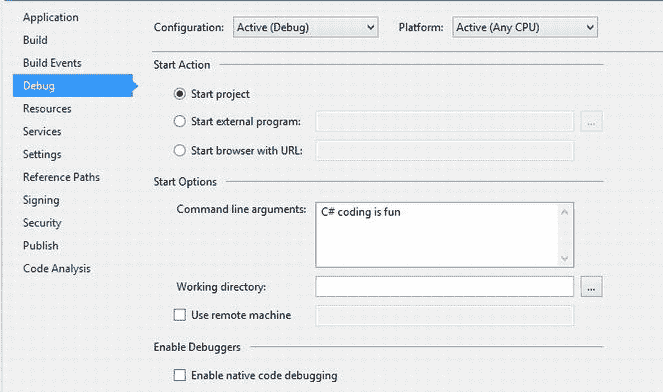

    [图 9-5](#_Fig5) 。添加命令行参数

6.  Select Debug  Start to run the project. The console window should launch with the output shown in [Figure 9-6](#Fig6). After viewing the output, stop the debugger.

    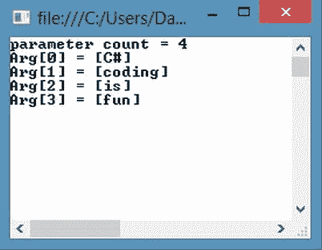

    [图 9-6](#_Fig6) 。控制台输出为阵列

7.  Add the following code before the Console.ReadLine method in the Main method. This code clears the value of the array at index 1 and sets the value at index 3 to “great”.

    `Array.Clear(args, 1, 1);`

    `args[3] = "great";`

    `for (int i = 0; i < args.Length; i++)`

    `{`

    `Console.WriteLine("Arg[{0}] = [{1}]", i, args[i]);`

    `}`

8.  Select Debug  Start to run the project. The console window should launch with the additional output shown in [Figure 9-7](#Fig7). After viewing the output, stop the debugger.

    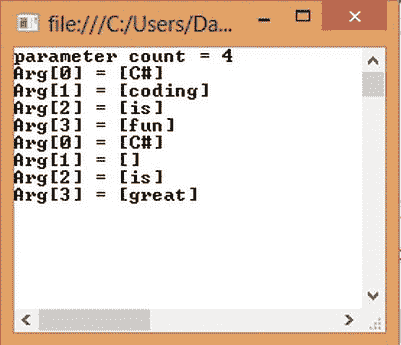

    [图 9-7](#_Fig7) 。更新阵列的控制台输出

**使用多维数组**

要创建和填充多维数组，请遵循以下步骤:

1.  注释掉`Main`方法中的代码。
2.  Add the following code to the `Main` method to create and populate a two-dimensional array:

    `string[,] seatingChart = new string[2,2];`

    `seatingChart[0, 0] = "Mary";`

    `seatingChart[0, 1] = "Jim";`

    `seatingChart[1, 0] = "Bob";`

    `seatingChart[1, 1] = "Jane";`

3.  Add the following code to loop through the array and print the names to the console window:

    `for (int row = 0; row < 2; row++)`

    `{`

    `for (int seat = 0; seat < 2; seat++)`

    `{`

    `Console.WriteLine("Row: {0} Seat: {1} Student: {2}",`

    `(row + 1),(seat + 1),seatingChart[row, seat]);`

    `}`

    `}`

    `Console.ReadLine();`

4.  Select Debug  Start to run the project. The console window should launch with the output that shows the seating chart of the students (see [Figure 9-8](#Fig8)).

    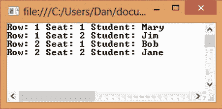

    [图 9-8](#_Fig8) 。二维数组的控制台输出

5.  查看输出后，停止调试器。

**使用数组列表**

虽然您刚刚创建的二维数组可以工作，但是将每个学生的座位分配信息存储在座位分配类中，然后将这些对象组织到一个数组列表结构中可能更直观。要创建和填充座位分配的数组列表，请按照下列步骤操作:

1.  向名为 SeatingAssignment.cs 的项目添加一个类文件。
2.  Add the following code to create the `SeatingAssignment` class. This class contains a `Row`, *Seat*, and `Student` property. It also contains an overloaded constructor to set these properties.

    `public class SeatingAssignment`

    `{`

    `int _row;`

    `int _seat;`

    `string _student;`

    `public int Row`

    `{`

    `get { return _row; }`

    `set { _row = value; }`

    `}`

    `public int Seat`

    `{`

    `get { return _seat; }`

    `set { _seat = value; }`

    `}`

    `public string Student`

    `{`

    `get { return _student; }`

    `set { _student = value; }`

    `}`

    `public SeatingAssignment(int row, int seat, string student)`

    `{`

    `this.Row = row;`

    `this.Seat = seat;`

    `this.Student = student;`

    `}`

    `}`

3.  In the `Main` method of the `Program` class, comment out the previous code and add the following using statement to the top of the file:

    `using System.Collections;`

4.  Add the following code to create an `ArrayList` of seating assignments:

    `ArrayList seatingChart = new ArrayList();`

    `seatingChart.Add(new SeatingAssignment(0, 0, "Mary"));`

    `seatingChart.Add(new SeatingAssignment(0, 1, "Jim"));`

    `seatingChart.Add(new SeatingAssignment(1, 0, "Bob"));`

    `seatingChart.Add(new SeatingAssignment(1, 1, "Jane"));`

5.  After the `ArrayList` is populated, add the following code to write the `SeatingAssignment` information to the console window.

    `foreach (SeatingAssignment sa in seatingChart)`

    `{`

    `Console.WriteLine("Row: {0} Seat: {1} Student: {2}",`

    `(sa.Row + 1), (sa.Seat + 1), sa.Student);`

    `}`

    `Console.ReadLine();`

6.  选择调试开始运行项目。控制台窗口应启动，输出与图 9-8 (学生座位表)所示的相同。
7.  One of the advantages of the ArrayList class is the ability to add and remove items dynamically. Add the following code after the code in step 4 to add two more students to the seating chart:

    `seatingChart.Add(new SeatingAssignment(2, 0, "Bill"));`

    `seatingChart.Add(new SeatingAssignment(2, 1, "Judy"));`

8.  选择调试开始运行项目。控制台窗口应该启动，输出显示新学生。
9.  完成后，停止调试器，并关闭 Visual Studio。

使用泛型集合

使用集合是应用编程的常见要求。我们处理的大多数数据都需要组织成一个集合。例如，您可能需要从数据库中检索客户，并将他们加载到 UI(用户界面)的下拉列表中。客户信息由一个客户类表示，客户被组织到一个客户集合中。然后可以对集合进行排序、过滤和循环处理。

除了少数强类型的用于保存字符串的专用集合之外，由 .NET 框架是弱类型的。集合持有的项目属于类型`Object`，因此它们可以是任何类型，因为所有类型都是从类型`Object`派生的。

弱类型集合会导致应用的性能和维护问题。一个问题是没有内在的安全措施来限制存储在集合中的对象类型。同一个集合可以包含任何类型的项，包括日期、整数或自定义类型，如 employee 对象。如果您构建并公开了一个整数集合，而该集合无意中被传递了一个日期，那么代码很可能会在某个时候失败。

幸运的是，C# 支持泛型 .NET Framework 在`System.Collections.Generic`命名空间中提供了基于泛型的集合。泛型允许您定义一个类，而无需指定它的类型。类型是在类被实例化时指定的。使用泛型集合提供了类型安全的优势和强类型集合的性能，同时还提供了与弱类型集合相关联的代码重用。

下面的代码展示了如何使用`Generic.List`类创建客户的强类型集合。列表类型(在本例中为`Customer`)放在尖括号(`<>`)之间。Customer 对象被添加到集合中，然后检索集合中的客户，并将客户信息写出到控制台。(你会在第 11 章看到将集合绑定到 UI 控件。)

```cs
List<Customer> customerList = new List<Customer>();
customerList.Add(new Customer
    ("WHITC", "White Clover Markets", "Karl Jablonski"));
customerList.Add(new Customer("RANCH", "Rancho grande", "Sergio Gutiérrez"));
customerList.Add(new Customer("ALFKI","Alfreds Futterkiste","Maria Anders"));
customerList.Add
    (new Customer("FRANR", "France restauration", "Carine Schmitt"));
foreach (Customer c in customerList)
{
    Console.WriteLine("Id: {0} Company: {1} Contact: {2}",
                    c.CompanyId, c.CompanyName, c.ContactName);
}
```

有时，您可能需要扩展由 .NET 框架。例如，您可能需要能够按照`CompanyId`或`CompanyName`对客户集合进行排序。要实现排序，您需要定义一个实现`IComparer`接口的排序类。`IComparer`接口确保排序类用适当的签名实现了一个`Compare`方法。(接口在第 7 章中讨论过。)下面的`CustomerSorter`类按照`CompanyName`对一个`Customer`的列表进行排序。注意，因为`CompanyName`属性是一个字符串，所以可以使用字符串比较器对它们进行排序。

```cs
public class CustomerSorter : IComparer<Customer>
{
    public int Compare(Customer customer1, Customer customer2)
    {
        return customer1.CompanyName.CompareTo(customer2.CompanyName);
    }
}
```

现在您可以按`CompanyName`对客户进行排序，然后显示它们。

```cs
customerList.Sort(new CustomerSorter());
```

输出如[图 9-9](#Fig9) 所示。

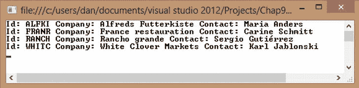

[图 9-9](#_Fig9) 。客户排序列表的控制台输出

**活动 9-2。实现和扩展通用集合**

在本活动中，您将熟悉以下内容:

*   实现泛型集合
*   扩展泛型集合以实现排序

要创建和填充通用列表，请遵循以下步骤:

1.  启动 Visual Studio。选择文件新建项目。
2.  选择控制台应用项目。将项目命名为 Activity9_2。
3.  选择项目添加类别。将该类文件命名为 Request.cs。
4.  Add the following properties to the `Request` class:

    `public class Request`

    `{`

    `string _requestor;`

    `int _priority;`

    `DateTime _date;`

    `public string Requestor`

    `{`

    `get { return _requestor; }`

    `set { _requestor = value; }`

    `}`

    `public int Priority`

    `{`

    `get { return _priority; }`

    `set { _priority = value; }`

    `}`

    `public DateTime Date`

    `{`

    `get { return _date; }`

    `set { _date = value; }`

    `}`

5.  Overload the constructor of the `Request` class to set the properties in the constructor.

    `public Request(string requestor, int priority, DateTime date)`

    `{`

    `this.Requestor = requestor;`

    `this.Priority = priority;`

    `this.Date = date;`

    `}`

6.  Add a method to override the `ToString` method of the base `Object` class. This will return the request information as a string when the method is called.

    `public override string ToString()`

    `{`

    `return String.Format("{0}, {1}, {2}",this.Requestor,`

    `this.Priority.ToString(), this.Date);`

    `}`

7.  Open the `Program` class in the code editor and add the following code to the `Main` method. This code populates a generic list of type `Request` and displays the values in the console window.

    `static void Main(string[] args)`

    `{`

    `List<Request> reqList = new List<Request>();`

    `reqList.Add(new Request("Dan",2 ,new DateTime(2011,4,2)));`

    `reqList.Add(new Request("Alice", 5, new DateTime(2011, 2, 5)));`

    `reqList.Add(new Request("Bill", 3, new DateTime(2011, 6, 19)));`

    `foreach (Request req in reqList)`

    `{`

    `Console.WriteLine(req.ToString());`

    `}`

    `Console.ReadLine();`

    `}`

8.  选择调试开始运行项目。控制台窗口应该启动，请求项按照添加到`reqList`的顺序列出。
9.  选择项目添加类。给类命名`DateSorter`。
10.  Add the following code to the `DateSorter` class. This class implements the `IComparer` interface and is used to enable sorting requests by date.

    `public class DateSorter:IComparer<Request>`

    `{`

    `public int Compare(Request R1, Request R2)`

    `{`

    `return R1.Date.CompareTo(R2.Date);`

    `}`

    `}`

11.  Add the following code in the `Main` method of the `Program` class prior to the `Console.ReadLine` method. This code sorts the `reqList` by date and displays the values in the console window.

    `Console.WriteLine("Sorted by date.");`

    `reqList.Sort(new DateSorter());`

    `foreach (Request req in reqList)`

    `{`

    `Console.WriteLine(req.ToString());`

    `}`

12.  Select Debug  Start to run the project. The console window should launch with the output shown in [Figure 9-10](#Fig10). After viewing the output, stop the debugger and exit Visual Studio.

    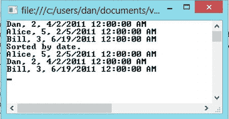

    [图 9-10](#_Fig10) 。未排序和按日期排序的通用集合

使用堆栈和队列编程

编程中经常使用的两种特殊类型的集合是堆栈和队列。堆栈是后进先出的对象集合。队列代表先进先出的对象集合。

栈是一个很好的方法来维护一个国际象棋游戏中的移动列表。当用户想要撤销他的移动时，他从他最近的移动开始，这是最后一个添加到列表中的移动，也是第一个检索到的移动。使用堆栈的另一个例子发生在程序执行一系列方法调用时。堆栈维护方法的地址，执行以调用方法的相反顺序返回方法。将项目放入堆栈时，使用`push`方法。 `pop`方法从堆栈中移除项目。`peek`方法返回堆栈顶部的对象，但不移除它。下面的代码演示如何在堆栈中添加和移除项。在这种情况下，您使用泛型来实现一堆`ChessMove`对象。`RecordMove`方法将最近的移动添加到堆栈中。`GetLastMove`方法返回堆栈上最近的移动。

```cs
Stack<ChessMove> moveStack = new Stack<ChessMove>();
void RecordMove(ChessMove move)
{
   moveStack.Push(move);
}
   ChessMove GetLastMove()
{
   return moveStack.Pop();
}
```

为帮助台请求提供服务的应用是何时使用队列的一个很好的例子。集合维护发送到应用的帮助台请求列表。当从集合中检索请求进行处理时，中的第一个请求应该是最先检索到的请求。`Queue`类使用`enqueue`和`dequeue`方法来添加和移除项目。它还实现了`peek`方法来返回队列开头的项，而不删除该项。下面的代码演示了在`PaymentRequest`队列中添加和删除项目。`AddRequest`方法将请求添加到队列中，而`GetNextRequest`方法将请求从队列中移除。

```cs
Queue<PaymentRequest> payRequest = new Queue<PaymentRequest>();
void AddRequest(PaymentRequest request)
{
   payRequest.Enqueue(request);
}
PaymentRequest GetNextRequest()
{
   return payRequest.Dequeue();
}

```

**活动 9-3。实现堆栈和队列**

在本活动中，您将熟悉以下内容:

*   实现堆栈集合
*   实现队列集合

要创建和填充通用列表，请遵循以下步骤:

1.  启动 Visual Studio。选择文件新建项目。
2.  选择控制台应用项目。将项目命名为活动 9_3。
3.  Add the following code to the `Main` method of the `Program` class.This code creates a stack of strings and loads it with strings representing moves in a game. It then uses the `Peek` method to write out the move stored at the top of the stack to the console window.

    `Stack<string> moveStack = new Stack<string>();`

    `Console.WriteLine("Loading Stack");`

    `for (int i = 1; i <= 5; i++)`

    `{`

    `moveStack.Push("Move " + i.ToString());`

    `Console.WriteLine(moveStack.Peek().ToString());`

    `}`

4.  Add the following code to the `Main` method of the `Program` class after the code in step 3\. This code removes the moves from the stack using the `Pop` method and writes them to the console window.

    `Console.WriteLine("Press the enter key to unload the stack.");`

    `Console.ReadLine();`

    `for (int i = 1; i <= 5; i++)`

    `{`

    `Console.WriteLine(moveStack.Pop().ToString());`

    `}`

    `Console.ReadLine();`

5.  Select Debug  Start to run the project. The console window should launch with the output shown in [Figure 9-11](#Fig11). Notice the last-in, first-out pattern of the stack. After viewing the output, stop the debugger.

    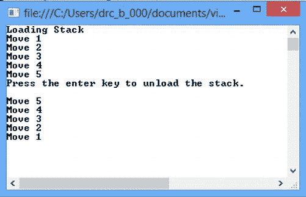

    [图 9-11](#_Fig11) 。堆栈的后进先出模式

6.  Comment out the code entered in steps 3 and 4\. Add the following code to the `Main` method of the `Program` class. This code creates a queue of strings and loads it with strings representing requests to a consumer help line. It then uses the `Peek` method to write out the request stored at the beginning of the queue of to the console window.

    `Queue<string> requestQueue = new Queue<string>();`

    `Console.WriteLine("Loading Queue");`

    `for (int i = 1; i <= 5; i++)`

    `{`

    `requestQueue.Enqueue("Request " + i.ToString());`

    `Console.WriteLine(requestQueue.Peek().ToString());`

    `}`

7.  Add the following code to the `Main` method of the `Program` class after the code in step 6\. This code removes the requests from the queue using the `Dequeue` method and writes them to the console window.

    `Console.WriteLine("Press the enter key to unload the queue.");`

    `Console.ReadLine();`

    `for (int i = 1; i <= 5; i++)`

    `{`

    `Console.WriteLine(requestQueue.Dequeue().ToString());`

    `}`

    `Console.ReadLine();`

8.  Select Debug  Start to run the project. The console window should launch with the output shown in [Figure 9-12](#Fig12). Notice that as the queue is loaded the first request stays at the top of the queue. Also notice the first-in, first-out pattern of the queue. After viewing the output, stop the debugger and exit Visual Studio.

    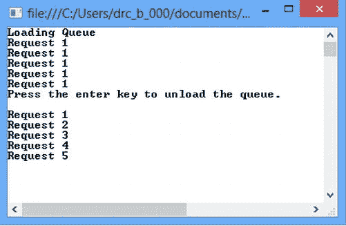

    [图 9-12](#_Fig12) 。队列的先进先出模式

摘要

在本章中，您研究了由 .NET 框架。您学习了如何使用数组、数组列表、队列、堆栈和泛型集合。

本章是向您介绍各种 OOP 结构(如类、继承和多态)的系列文章的最后一章。您应该对 C# 中的类结构、对象协作和集合是如何实现的有一个很好的理解。已经向您介绍了 Visual Studio IDE，并且您已经练习了使用它。现在，您已经准备好将这些部分放在一起，开发一个可工作的应用。

第 10 章是你将发展的系列中的第一章 .NET 应用。在此过程中，您将使用 ADO.NET 和实体框架调查数据访问；使用 Windows 演示基础(WPF)和新的 Windows 8 应用商店创建基于 Windows 的 GUI 使用 web 窗体和 ASP 创建基于 Web 的 GUI。网；，并使用 ASP.NET 通信基金会(WCF)和 web API 创建 Web 服务。