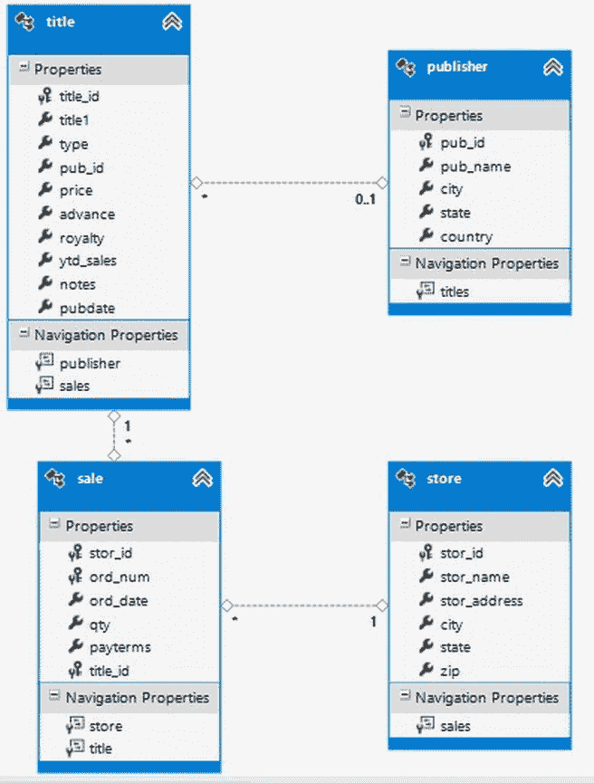
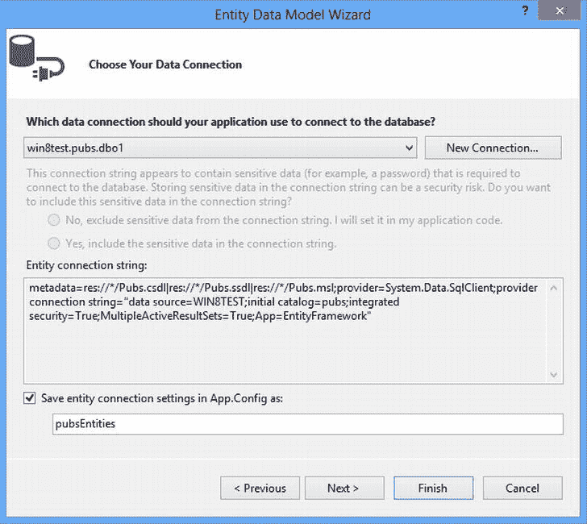
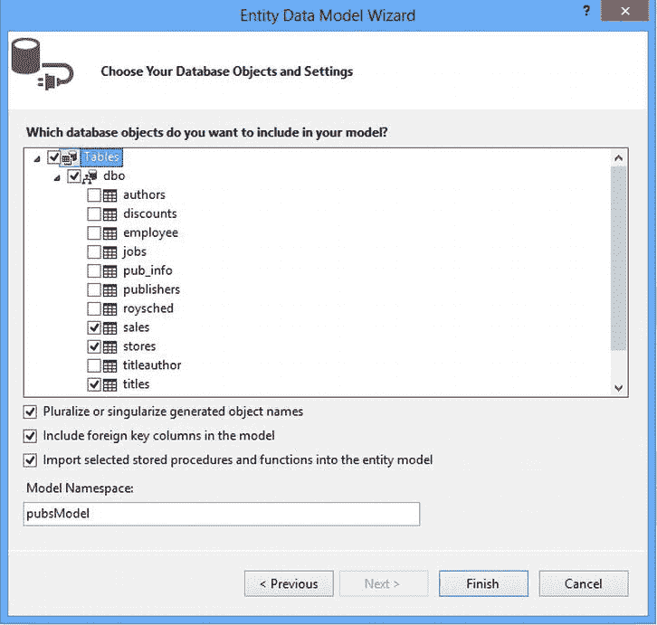
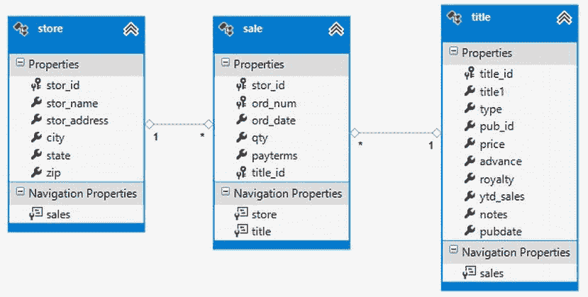

# 十、实现数据访问层

在过去的几章中，您已经了解了各种面向对象的编程结构，如类、继承和多态，因为它们是在 C# 代码中实现的。已经向您介绍并练习了如何使用 Visual Studio 集成开发环境。您还应该对类结构和对象协作是如何实现的有一个牢固的理解。

现在，您已经准备好将这些部分放在一起，开发一个可工作的应用。因为大多数业务应用都涉及处理和更新后端关系数据库中的数据，所以您将看到 .NET Framework 提供了处理关系数据的功能。

读完本章后，你将理解以下内容:

*   如何使用`Connection`对象建立到数据库的连接
*   如何使用一个`Command`对象来执行 SQL 查询
*   如何使用一个`Command`对象来执行存储过程
*   如何用`DataReader`对象检索记录
*   如何填充数据表和数据集
*   如何在数据集中的表之间建立关系
*   如何编辑和更新数据集中的数据
*   如何创建实体数据模型
*   如何使用语言集成查询(LINQ)到实体框架(EF)来查询数据
*   如何使用实体框架更新数据

介绍 ADO.NET

为企业开发的大多数应用都需要与数据存储设备进行交互。数据存储可以以多种不同的形式出现:例如，在平面文件系统中，许多传统的大型机系统就是这种情况；或者在关系数据库管理系统中，如 SQL Server、Oracle 或 MySQL。您还可以在分层的文本文件结构中维护数据，如 XML。为了在这些不同的数据存储区中以一致的方式访问和使用数据 .NET Framework 提供了一组组织到`System.Data`名称空间中的类。这个类的集合被称为 ADO.NET。

回顾微软数据访问技术的历史，可以发现从连接模式到非连接模式的演变。在开发 20 世纪 80 年代和 90 年代早期流行的传统两层客户机-服务器应用时，打开与数据库的连接，使用实现服务器端游标的数据，并在处理完数据后关闭连接通常会更有效。这种方法的问题在 20 世纪 90 年代后期变得很明显，因为公司试图将其数据驱动的应用从传统的两层客户端-服务器应用发展到多层基于 web 的模型:打开并保持连接直到处理完成是不可伸缩的。可伸缩性是指应用在不明显降低性能的情况下处理数量不断增加的并发客户端的能力。微软将 ADO.NET 设计成高度可伸缩的。为了实现可伸缩性，微软围绕一个断开的模型设计了 ADO.NET。与数据库建立连接，在本地检索和缓存数据和元数据，然后关闭连接。

在此期间开发的传统数据访问技术的另一个问题是缺乏互操作性。具有高度互操作性的系统可以很容易地来回交换数据，而不管各种系统的实现技术如何。传统的数据访问技术依赖于专有的数据交换方法。使用这些技术，对于使用 Microsoft 技术(如 ADO(pre-1)构建的系统来说是很困难的 .NET)和 DCOM 与使用 Java 技术(如 JDBC 和 CORBA)构建的系统交换数据。整个行业都意识到，为不同系统之间的数据交换开发开放标准符合各方的最佳利益。微软已经接受了这些标准，并将对这些标准的支持纳入了 .NET 框架。

使用数据提供者

要建立到一个数据源的连接，比如一个 SQL Server 数据库，并处理它的数据，必须使用适当的 .NET 提供程序类。SQL Server 提供程序类位于`System.Data.SqlClient`名称空间中。还存在其他数据提供者，比如位于`System.Data.OleDb`名称空间中的 OleDb data provider for Oracle classes。这些提供程序中的每一个都实现了一个相似的类结构，您可以用它来与预期的数据源进行交互。[表 10-1](#Tab1) 总结了`System.Data.SqlClient`提供者名称空间的主要类。

[表 10-1。](#_Tab1)系统中的类。Data.SqlClient 命名空间

| 班级 | 责任 |
| --- | --- |
| `SqlConnection` | 与数据库建立连接和唯一会话。 |
| `SqlCommand` | 表示要在数据库中执行的 Transact-SQL 语句或存储过程。 |
| `SqlDataReader` | 提供从数据库中读取只进行流的方法。 |
| `SqlDataAdapter` | 填充数据集并将更改更新回数据库。 |
| `SqlParameter` | 表示用于在存储过程之间传递信息的参数。 |
| `SqlTransaction` | 表示要在数据库中进行的 Transact-SQL 事务。 |
| `SqlError` | 收集与数据库服务器返回的警告或错误相关的信息。 |
| `SqlException` | 定义当数据库服务器返回警告或错误时引发的异常。 |

类似的一组类存在于`System.Data.OleDb`提供者名称空间中。例如，您有一个`OleDbConnection`类，而不是`SqlConnection`类。

建立连接

从数据库中检索数据的第一步是建立一个连接，，这是使用一个基于所使用的提供者类型的`Connection`对象来完成的。为了建立到 SQL Server 的连接，您实例化了一个类型为`SqlConnection`的`Connection`对象。您还需要为`Connection`对象提供一个`ConnectionString`。`ConnectionString`由一系列分号分隔的名称-值对组成，提供连接数据库服务器所需的信息。`ConnectionString`通常传递的一些信息是目标服务器的名称、数据库的名称和安全信息。以下代码演示了一个用于连接到 SQL Server 数据库的`ConnectionString`:

```cs
"Data Source=TestServer;Initial Catalog=Pubs;User ID=Dan;Password=training"
```

您需要通过 ConnectionString 提供的属性取决于您使用的数据提供程序。下面的代码演示了一个 ConnectionString，该 ConnectionString 使用用于 Access 的 OleDb 访问接口连接到 Access 数据库:

```cs
"Provider=Microsoft.Jet.OleDb.4.0;Data Source=D:\Data\Northwind.mdb"
```

下一步是调用`Connection`对象的`Open`方法。这将导致`Connection`对象加载适当的驱动程序并打开到数据源的连接。一旦连接打开，您就可以处理数据了。完成与数据库的交互后，调用`Connection`对象的`Dispose`方法很重要，因为当`Connection`对象超出范围或被垃圾收集时，连接不会被隐式释放。以下代码演示了在 SQL Server 中打开与 Pubs 数据库的连接、处理数据以及释放连接的过程:

```cs
SqlConnection pubConnection = new SqlConnection();
string connString;
try
{
    connString = "Data Source=drcsrv01;Initial Catalog=pubs;Integrated Security=True";
    pubConnection.ConnectionString = connString;
    pubConnection.Open();
    //work with data
}
catch (SqlException ex)
{
    throw ex;
}
finally
{
    pubConnection.Dispose();
}
```

C# 提供了一个`using`语句来帮助确保连接被关闭，资源被正确处理。当执行离开`using`语句的范围时，连接会自动关闭，连接对象会被高效地处理掉。前面的代码可以重写以利用`using`语句，如下所示:

```cs
string connString = "Data Source=drcsrv01;Initial Catalog=pubs;Integrated Security=True";
using(SqlConnection pubConnection = new SqlConnection())
{
    try
    {
        pubConnection.ConnectionString = connString;
        pubConnection.Open();
        //work with data
    }
    catch (SqlException ex)
    {
        throw ex;
    }
}
```

执行命令

一旦应用建立并打开了与数据库的连接，就可以对其执行 SQL 语句。一个`Command`对象存储并执行针对数据库的命令语句。您可以使用`Command`对象来执行数据存储理解的任何有效的 SQL 语句。对于 SQL Server，这些语句可以是数据操作语言语句(Select、Insert、Update 和 Delete)、数据定义语言语句(Create、Alter 和 Drop)或数据控制语言语句(Grant、Deny 和 Revoke)。`Command`对象的`CommandText`属性保存将要提交的 SQL 语句。根据返回的内容，`Command`对象包含三种向数据库提交 `CommandText`的方法。如果记录被返回，就像执行`Select`语句的情况一样，那么您可以使用`ExecuteReader`。如果返回单个值——例如，`Select Count`聚合函数的结果——您应该使用`ExecuteScalar`方法。当查询没有返回记录时——例如，从`Insert`语句中——您应该使用`ExecuteNonQuery`方法。下面的代码演示了如何使用一个`Command`对象对 Pubs 数据库执行一条 SQL 语句，返回雇员的数量。注意嵌套的`using`子句的使用，一个用于连接，一个用于命令。

```cs
public int GetEmployeeCount()
{
    string connString = "Data Source=drcsrv01;Initial Catalog=pubs;Integrated Security=True";

    using (SqlConnection pubConnection = new SqlConnection())
    {
        using (SqlCommand pubCommand = new SqlCommand())
        {
             try
             {
                    pubConnection.ConnectionString = connString;
                    pubConnection.Open();
                    pubCommand.Connection = pubConnection;
                    pubCommand.CommandText = "Select Count(emp_id) from employee";
                    return (int)pubCommand.ExecuteScalar();
             }
             catch (SqlException ex)
            {
                    throw ex;
            }
        }
    }
}
```

使用存储过程

在许多应用设计中，客户端必须执行存储过程，而不是直接执行 SQL 语句。存储过程是封装数据库逻辑、提高可伸缩性和增强多层应用安全性的一种极好的方式。要执行一个存储过程，可以使用一个`Command`对象，将其`CommandType`属性设置为`StoredProcedure`，将其`CommandText`属性设置为存储过程的名称。下面的代码执行一个存储过程，返回 Pubs 数据库中的雇员人数:

```cs
public int GetEmployeeCount()
{
    string connString = "Data Source=drcsrv01;Initial Catalog=pubs;Integrated Security=True";

    using (SqlConnection pubConnection = new SqlConnection())
    {
        using (SqlCommand pubCommand = new SqlCommand())
        {
            try
            {
                pubConnection.ConnectionString = connString;
                pubConnection.Open();
                pubCommand.Connection = pubConnection;
                pubCommand.CommandType = CommandType.StoredProcedure;
                pubCommand.CommandText = "GetEmployeeCount";
                return (int)pubCommand.ExecuteScalar();
            }
            catch (SqlException ex)
            {
                throw ex;
            }
        }
    }
}
```

执行存储过程时，通常必须提供输入参数。您可能还需要通过输出参数来检索存储过程的结果。要使用参数，您需要实例化一个类型为`SqlParameter`的参数对象，然后将其添加到`Command`对象的`Parameters`集合中。构造参数时，需要提供参数名称和 SQL Server 数据类型。对于某些数据类型，还需要提供大小。如果参数是输出、输入输出或返回参数，则必须指示参数方向。以下示例调用接受字母输入参数的存储过程。该过程返回姓氏以给定字母开头的雇员数。计数以输出参数的形式返回。

```cs
public int GetEmployeeCount(string lastInitial)
{
    string connString = "Data Source=drcsrv01;Initial Catalog=pubs;Integrated Security=True";
    using (SqlConnection pubConnection = new SqlConnection(connString))
    {
        using (SqlCommand pubCommand = new SqlCommand())
        {
            try
            {
                pubConnection.Open();
                pubCommand.Connection = pubConnection;
                pubCommand.CommandText = "GetEmployeeCountByLastInitial";
                SqlParameter inputParameter = pubCommand.Parameters.Add
                      ("@LastInitial", SqlDbType.NChar, 1);
                inputParameter.Value = lastInitial.ToCharArray()[0];
                SqlParameter outputParameter = pubCommand.Parameters.Add
                     ("@EmployeeCount", SqlDbType.Int);
                outputParameter.Direction = ParameterDirection.Output;
                pubCommand.CommandType = CommandType.StoredProcedure;
                pubCommand.ExecuteNonQuery();
                return (int)outputParameter.Value;
            }
            catch (SqlException ex)
            {
                 throw ex;
            }
        }
    }
}
```

使用 DataReader 对象检索数据

一个`DataReader`对象通过一个只进、只读的流访问数据。通常，您会希望遍历一组记录并按顺序处理结果，而不需要在缓存中维护数据。这方面的一个很好的例子是用数据库返回的值加载一个列表或数组。在声明了一个类型为`SqlDataReader`的对象后，通过调用一个`Command`对象的`ExecuteReader`方法来实例化它。`DataReader`对象的`Read`方法访问返回的记录。在处理完记录后，调用`DataReader`对象的`Close`方法。以下代码演示了如何使用`DataReader`对象从 SQL Server 数据库中检索姓名列表并将其返回给客户端:

```cs
public ArrayList ListNames()
{
    string connString = "Data Source=LocalHost;Initial Catalog=pubs;Integrated Security=True";
    using (SqlConnection pubConnection = new SqlConnection(connString))
    {
        using (SqlCommand pubCommand = new SqlCommand())
        {
            try
            {
                pubConnection.ConnectionString = connString;
                pubConnection.Open();
                pubCommand.Connection = pubConnection;
                pubCommand.CommandText =
                    "Select lname from employee";
                using (SqlDataReader employeeDataReader = pubCommand.ExecuteReader())
                {
                    ArrayList nameArray = new ArrayList();
                    while (employeeDataReader.Read())
                    {
                        nameArray.Add(employeeDataReader["lname"]);
                    }
                    return nameArray;
                }
            }
            catch (SqlException ex)
            {
                throw ex;
            }
        }
    }
}
```

使用 DataAdapter 检索数据

在许多情况下，您需要从数据库中检索一组数据，处理这些数据，并将对数据的任何更新返回给数据库。在这种情况下，您使用一个`DataAdapter`作为数据源和数据的内存缓存之间的桥梁。这种数据的内存缓存包含在独立的 DataTable 或 DataSet 中，DataSet 是 DataTable 的集合。

 **注意**`DataTable`和`DataSet`对象将在“使用数据表和数据集”一节中详细讨论。

要从数据库中检索一组数据，首先要实例化一个`DataAdapter`对象。然后将`DataAdapter`的`SelectCommand`属性设置为现有的`Command`对象。最后，执行`Fill`方法，传递要填充的`DataSet`对象的名称。如果调用 fill 方法时 connection 对象没有打开，则它会打开以检索数据，然后关闭。如果调用 fill 方法时它是打开的，则在检索数据后它将保持打开状态。在这里，您将看到如何使用一个`DataAdapter`来填充一个`DataTable`并将`DataTable`传递回客户端:

```cs
public DataTable GetEmployees()
{
    string connString = "Data Source=LocalHost;Initial Catalog=pubs;Integrated Security=True";
    using (SqlConnection pubConnection = new SqlConnection(connString))
    {
        using (SqlCommand pubCommand = new SqlCommand())
        {
            pubCommand.Connection = pubConnection;
            pubCommand.CommandText = "Select emp_id, lname, Hire_Date from employee";
            using (SqlDataAdapter employeeAdapter = new SqlDataAdapter())
            {
                employeeAdapter.SelectCommand = pubCommand;
                DataTable employeeDataTable = new DataTable();
                employeeAdapter.Fill(employeeDataTable);
                return employeeDataTable;
            }
        }
    }
}
```

您可能会发现，与传入 SQL 语句相比，您需要通过执行存储过程来检索一组数据。下面的代码演示如何执行接受输入参数并返回一组记录的存储过程。记录被加载到一个`DataSet`对象中并返回给客户端。

```cs
public DataSet GetEmployees(string lastInitial)
{
    string connString = "Data Source=LocalHost;Initial Catalog=pubs;Integrated Security=True";
     using (SqlConnection pubConnection = new SqlConnection(connString))
    {
        using (SqlCommand pubCommand = new SqlCommand())
        {
             pubCommand.Connection = pubConnection;
             pubCommand.CommandText = "Select emp_id, lname, Hire_Date from employee";
             pubCommand.CommandText = "GetEmployeesByLastInitial";
             SqlParameter inputParameter = pubCommand.Parameters.Add
                 ("@LastInitial", SqlDbType.NChar, 1);
             inputParameter.Value = lastInitial.ToCharArray()[0];
             pubCommand.CommandType = CommandType.StoredProcedure;
             using (SqlDataAdapter employeeAdapter = new SqlDataAdapter())
             {
                 employeeAdapter.SelectCommand = pubCommand;
                 DataSet employeeDataSet = new DataSet();
                 employeeAdapter.Fill(employeeDataSet);
                return employeeDataSet;
            }
        }
    }
}
```

活动 10-1。从 SQL SERVER 数据库中检索数据

在本活动中，您将熟悉以下内容:

*   建立与 SQL Server 数据库的连接
*   通过一个`Command`对象执行查询
*   使用`DataReader`对象检索数据
*   使用`Command`对象执行存储过程

 **注意**要完成本章中的活动，您必须能够访问安装了 Microsoft Pubs 和 Northwind 示例数据库的 SQL Server 2005 或更高版本的数据库服务器。您必须使用被授予访问这些数据库的适当权限的 Windows 帐户登录。根据您的设置，您可能需要更改`ConnectionString`。有关更多信息，请参考简介和附录 c 中的“软件要求”一节。

**创建连接并执行 SQL 查询**

要创建连接并执行 SQL 查询，请按照下列步骤操作:

1.  启动 Visual Studio。选择文件新建项目。
2.  选择控制台应用项目。将项目命名为`Activity10_1`。
3.  项目打开后，向名为`Author`的项目添加一个新类。
4.  Open the `Author` class code in the code editor. Add the following using statements at the top of the file:

    `using System.Data;`

    `using System.Data.SqlClient;`

5.  Add code to declare a private class-level variable containing the connection string:

    `class Author`

    `{`

    `string _connString = "Data Source=localhost;Initial Catalog=pubs;Integrated Security=True";`

6.  Add a method to the class that will use a `Command` object to execute a query to count the number of authors in the `Authors` table. Because you are only returning a single value, you will use the `ExecuteScalar` method of the `Command` object.

    `public int CountAuthors()`

    `{`

    `using (SqlConnection pubConnection = new SqlConnection(_connString))`

    `{`

    `using (SqlCommand pubCommand = new SqlCommand())`

    `{`

    `pubCommand.Connection = pubConnection;`

    `pubCommand.CommandText = "Select Count(au_id) from authors";`

    `pubConnection.Open();`

    `return (int)pubCommand.ExecuteScalar();`

    `}`

    `}`

    `}`

7.  Add the following code to the `Main` method of the `Program` class, which will execute the `GetAuthorCount` method defined in the `Author` class:

    `static void Main(string[] args)`

    `{`

    `try`

    `{`

    `Author author = new Author();`

    `Console.WriteLine(author.CountAuthors());`

    `Console.ReadLine();`

    `}`

    `catch (Exception ex)`

    `{`

    `Console.WriteLine(ex.Message);`

    `Console.ReadLine();`

    `}`

    `}`

8.  选择调试开始运行项目。控制台窗口应该会启动，并显示作者的数量。查看输出后，停止调试器。

**使用 DataReader 对象检索记录**

要使用`DataReader`对象来检索记录，请遵循以下步骤:

1.  在代码编辑器中打开`Author`类代码。
2.  Add a public method to the class definition called `GetAuthorList` that returns a generic `List` of strings.

    `public List<string> GetAuthorList()`

    `{`

    `}`

3.  Add the following code, which executes a SQL Select statement to retrieve the authors’ last names. A `DataReader` object then loops through the records and creates a list of names that gets returned to the client.

    `List<string> nameList = new List<string>();`

    `using (SqlConnection pubConnection = new SqlConnection(_connString))`

    `{`

    `using (SqlCommand authorsCommand = new SqlCommand())`

    `{`

    `authorsCommand.Connection = pubConnection;`

    `authorsCommand.CommandText = "Select au_lname from authors";`

    `pubConnection.Open();`

    `using (SqlDataReader authorDataReader = authorsCommand.ExecuteReader())`

    `{`

    `while (authorDataReader.Read() == true)`

    `{`

    `nameList.Add(authorDataReader.GetString(0));`

    `}`

    `return nameList;`

    `}`

    `}`

    `}`

4.  Change the code in the `Main` method of the `Program` class to show the list of names in the console window.

    `static void Main(string[] args)`

    `{`

    `try`

    `{`

    `Author author = new Author();`

    `foreach (string name in author.GetAuthorList())`

    `{`

    `Console.WriteLine(name);`

    `}`

    `Console.ReadLine();`

    `}`

    `catch (Exception ex)`

    `{`

    `Console.WriteLine(ex.Message);`

    `Console.ReadLine();`

    `}`

    `}`

5.  选择调试开始运行项目。控制台窗口应该会启动，并显示作者的姓名。查看输出后，停止调试器。

**使用命令对象执行存储过程**

要使用`Command`对象执行存储过程，请遵循以下步骤:

1.  在代码编辑器中打开`Author`类代码。
2.  Add a public method that overloads the `GetAuthorList` method by accepting an integer parameter named `Royalty`. This function will call the stored procedure by royalty in the Pubs database. The procedure takes an integer input of the royalty percentage and returns a list of author IDs with the percentage.

    `public List<string> GetAuthorList(int royalty)`

    `{`

    `List<string> nameList = new List<string>();`

    `using (SqlConnection pubConnection = new SqlConnection(_connString))`

    `{`

    `using (SqlCommand authorsCommand = new SqlCommand())`

    `{`

    `authorsCommand.Connection = pubConnection;`

    `authorsCommand.CommandType = CommandType.StoredProcedure;`

    `authorsCommand.CommandText = "byroyalty";`

    `SqlParameter inputParameter = new SqlParameter();`

    `inputParameter.ParameterName = "@percentage";`

    `inputParameter.Direction = ParameterDirection.Input;`

    `inputParameter.SqlDbType = SqlDbType.Int;`

    `inputParameter.Value = royalty;`

    `authorsCommand.Parameters.Add(inputParameter);`

    `pubConnection.Open();`

    `using (SqlDataReader authorDataReader = authorsCommand.ExecuteReader())`

    `{`

    `while (authorDataReader.Read() == true)`

    `{`

    `nameList.Add(authorDataReader.GetString(0));`

    `}`

    `}`

    `return nameList;`

    `}`

    `}`

    `}`

3.  In the `Main` method of the `Program` class, supply an input parameter of 25 to the `GetAuthorList` method.

    `foreach (string name in author.GetAuthorList(25))`

4.  选择调试开始运行项目。控制台窗口应该启动，并显示作者的 id。查看输出后，停止调试器。
5.  完成测试后，退出 Visual Studio。

使用数据表和数据集

数据表和数据集是数据的内存缓存，提供一致的关系编程模型来处理数据，而不管数据源是什么。数据表代表一个关系数据表，由列、行和约束组成。您可以将数据集视为一个小型关系数据库，它包括数据表和它们之间的关系完整性约束。如果从单个表中检索数据，可以直接填充和使用 DataTable，而无需先创建数据集。创建数据表或数据集有几种方法。最明显的方法是从现有的关系数据库管理系统(RDBMS )(如 SQL Server 数据库)中填充 DataTable 或 DataSet。如前所述，`DataAdapter`对象提供了 RDBMS 和数据表或数据集之间的桥梁。通过使用一个`DataAdapter`对象，数据表或数据集完全独立于数据源。尽管您需要使用一组特定的提供者类来加载任一类型的对象，但是您使用相同的一组 .NET Framework 类来处理数据表或数据集，而不管它是如何创建和填充的。`System.Data`名称空间包含处理数据表或数据集对象的框架类。表 10-2 列出了一些包含在`System.Data`名称空间中的主要类。

[表 10-2。](#_Tab2)系统的主要成员。数据命名空间

| 班级 | 描述 |
| --- | --- |
| `DataSet` | 表示一组`DataTable`和`DataRelation`对象。组织关系数据的内存缓存。 |
| `DataTable` | 代表一个由`DataColumn`、`DataRow`和`Constraint`对象组成的集合。组织与数据实体相关的记录和字段。 |
| `DataColumn` | 表示`DataTable`中某一列的模式。 |
| `DataRow` | 代表`DataTable`中的一行数据。 |
| `Constraint` | 表示可以在`DataColumn`对象上实施的约束。 |
| `ForeignKeyConstraint` | 在两个`DataTable`对象之间实施父/子关系的参照完整性。 |
| `UniqueConstraint` | 强制一个`DataColumn`或一组`DataColumns`的唯一性。这是在父/子关系中实施参照完整性所必需的。 |
| `DataRelation` | 表示两个`DataTable`对象之间的父/子关系。 |

从 SQL Server 数据库填充数据表

要从数据库中检索数据，需要使用一个`Connection`对象建立与数据库的连接。建立连接后，创建一个`Command`对象从数据库中检索数据。如前所述，如果您从单个表或结果集中检索数据，您可以直接填充并使用`DataTable`,而无需创建`DataSet`对象。`DataTable`的 Load 方法用一个`DataReader`对象的内容填充表格。下面的代码用 Pubs 数据库的 publishers 表中的数据填充了一个`DataTable`:

```cs
public DataTable GetPublishers()
{
    string connString = "Data Source=drcsrv01;" +
         "Initial Catalog=pubs;Integrated Security=True";
    DataTable pubTable;
    using (SqlConnection pubConnection = new SqlConnection(connString))
    {
        using (SqlCommand pubCommand = new SqlCommand())
        {
             pubCommand.Connection = pubConnection;
             pubCommand.CommandText =
                 "Select pub_id, pub_name, city from publishers";
             pubConnection.Open();
             using (SqlDataReader pubDataReader = pubCommand.ExecuteReader())
            {
                pubTable = new DataTable();
                pubTable.Load(pubDataReader);
                return pubTable;
            }
        }
    }
}
```

从 SQL Server 数据库填充数据集

当您需要将数据加载到多个表中并维护表之间的引用完整性时，您需要使用`DataSet`对象作为`DataTables`的容器。为了从数据库中检索数据并填充`DataSet`，使用`Connection`对象建立与数据库的连接。建立连接后，创建一个`Command`对象从数据库中检索数据，然后创建一个`DataAdapter`来填充`DataSet`，将之前创建的`Command`对象设置为`DataAdapter`的`SelectCommand`属性。为每个`DataTable`创建一个单独的`DataAdapter`。最后一步是通过执行`DataAdapter`的`Fill`方法用数据填充`DataSet`。下面的代码演示了用 Pubs 数据库的 publishers 表和 titles 表中的数据填充一个`DataSet`:

```cs
public DataSet GetPubsDS()
{
    string connString = "Data Source=Localhost;" +
         "Initial Catalog=pubs;Integrated Security=True";
    DataSet bookInfoDataSet= new DataSet();
    using (SqlConnection pubConnection = new SqlConnection(connString))
    {
        //Fill pub table
        using (SqlCommand pubCommand = new SqlCommand())
        {
            pubCommand.Connection = pubConnection;
            pubCommand.CommandText =
                "Select pub_id, pub_name, city from publishers";
            using (SqlDataAdapter pubDataAdapter = new SqlDataAdapter())
            {
                pubDataAdapter.SelectCommand = pubCommand;
                pubDataAdapter.Fill(bookInfoDataSet, "Publishers");
            }
        }
        //Fill title table
        using (SqlCommand titleCommand = new SqlCommand())
        {
            titleCommand.Connection = pubConnection;
            titleCommand.CommandText =
                "Select pub_id, title, ytd_sales from titles";
            using (SqlDataAdapter titleDataAdapter = new SqlDataAdapter())
            {
                titleDataAdapter.SelectCommand = titleCommand;
                titleDataAdapter.Fill(bookInfoDataSet, "Titles");
            }
        }
        return bookInfoDataSet;
    }
}
```

在数据集中的表之间建立关系

在 RDBMS 系统中，表之间的引用完整性是通过主键和外键关系来实现的。使用一个`DataRelation`对象，您可以在`DataSet`中的表之间实施数据引用完整性。该对象包含一个`DataColumn`对象数组，这些对象定义了父表和子表之间用于建立关系的公共字段。本质上，父表中标识的字段是主键，子表中标识的字段是外键。建立关系时，为每个表中的公共列创建两个`DataColumn`对象。接下来，创建一个`DataRelation`对象，为`DataRelation`、传递一个名称，并将`DataColumn`对象传递给`DataRelation`对象的构造函数。最后一步是将`DataRelation`添加到`DataSet`对象的`Relations`集合中。下面的代码在出版商和上一节中创建的`bookInfoDataSet`的标题表之间建立了一个关系:

```cs
//Create relationahip between tables
DataRelation Pub_TitleRelation;
DataColumn Pub_PubIdColumn;
DataColumn Title_PubIdColumn;
Pub_PubIdColumn = bookInfoDataSet.Tables["Publishers"].Columns["pub_id"];
Title_PubIdColumn = bookInfoDataSet.Tables["Titles"].Columns["pub_id"];
Pub_TitleRelation = new DataRelation("PubsToTitles", Pub_PubIdColumn, Title_PubIdColumn);
bookInfoDataSet.Relations.Add(Pub_TitleRelation);
```

编辑数据集中的数据

客户端通常需要能够更新数据集。他们可能需要添加记录、删除记录或更新现有记录。因为数据集对象在设计上是断开连接的，所以对数据集所做的更改不会自动传播回数据库。它们保存在本地，直到客户机准备好将更改复制回数据库。要复制更改，您需要调用`DataAdapter`的`Update`方法，该方法确定对记录做了什么更改，并实现适当的 SQL 命令(Update、Insert 或 Delete ),该命令已被定义为将更改复制回数据库。

当您创建一个`Update`命令时，命令文本引用命令的`Parameters`集合中与数据表中的字段相对应的参数。

```cs
SqlCommand updateCommand  = new SqlCommand();
string updateSQL = "Update publishers set pub_name = @pub_name," +
    " city = @city where pub_id = @pub_id";
updateCommand = new SqlCommand(updateSQL, pubConnection);
updateCommand.CommandType = CommandType.Text;
```

对于`Update`语句中的每个参数，`Parameter`对象被添加到`Command`对象的`Parameter`集合中。向`Parameters`集合的`Add`方法传递关于参数名、SQL 数据类型、大小和数据集的源列的信息。

```cs
updateCommand.Parameters.Add("@pub_id", SqlDbType.Char, 4, "pub_id");
updateCommand.Parameters.Add("@city", SqlDbType.VarChar, 20, "city");
updateCommand.Parameters.Add("@pub_name", SqlDbType.VarChar, 40, "pub_name");

Once the parameters are created, the updateCommand object is set to the UpdateCommand property of the DataAdapter object.

pubDataAdapter.UpdateCommand = updateCommand;
```

现在已经设置了 SqlDataAdapter，您调用 SQLDataAdapter 的`Update`方法，传入`DataSet`和要更新的表的名称。SQLDataAdapter 检查表中行的`RowState`属性，并对要更新的每一行迭代执行 update 语句。

```cs
pubDataAdapter.Update(bookInfoDataSet, "Publishers");
```

以类似的方式，您可以实现`DataAdapter`的`InsertCommand`和`DeleteCommand`属性，以允许客户端在数据库中插入新记录或删除记录。

 **注意**对于数据源中单个表的简单更新 .NET 框架提供了一个`CommandBuilder`类来自动创建`DataAdapter`的`InsertCommand`、`UpdateCommand`和`DeleteCommand`属性。

活动 10-2。使用数据集对象

在本活动中，您将熟悉以下内容:

*   从 SQL Server 数据库填充一个`DataSet`
*   编辑`DataSet`中的数据
*   将更改从`DataSet`更新到数据库
*   在`DataSet`中建立表之间的关系

**从 SQL Server 数据库填充数据集**

要从 SQL Server 数据库填充一个`DataSet`，请执行以下步骤:

1.  启动 Visual Studio。选择文件新建项目。
2.  选择 Windows 窗体应用。将项目重命名为 Activity10_2，然后单击“确定”按钮。
3.  项目打开后，向名为`Author`的项目添加一个新类。
4.  Open the `Author` class code in the code editor. Add the following `using` statements at the top of the file:

    `using System.Data;`

    `using System.Data.SqlClient;`

5.  Add the following code to declare a private class level variable for the connection string.

    `class Author`

    `{`

    `string _connString = "Data Source=localhost;" + "Initial Catalog=pubs;Integrated Security=True";`

6.  Create a method of the `Author` class called `GetData` that will use a `DataAdapter` object to fill the `DataSet` and return it to the client.

    `public DataSet GetData()`

    `{`

    `DataSet authorDataSet;`

    `using (SqlConnection pubConnection = new SqlConnection())`

    `{`

    `pubConnection.ConnectionString = _connString;`

    `using(SqlCommand selectCommand = new SqlCommand())`

    `{`

    `selectCommand.CommandText = "Select au_id, au_lname,au_fname from authors";`

    `selectCommand.Connection = pubConnection;`

    `using (SqlDataAdapter pubDataAdapter = new SqlDataAdapter())`

    `{`

    `pubDataAdapter.SelectCommand = selectCommand;`

    `authorDataSet = new DataSet();`

    `pubDataAdapter.Fill(authorDataSet, "Author");`

    `}`

    `}`

    `return authorDataSet;`

    `}`

7.  构建项目并修复任何错误。
8.  Add the controls listed in [Table 10-3](#Tab3) to Form1 and set the properties as shown.

    [表 10-3。](#_Tab3)表格 1 控件

    | 控制 | 财产 | 价值 |
    | --- | --- | --- |
    | `DataGridView` | `Name` | `dgvAuthors` |
    |  | `AllowUserToAddRows` | `False` |
    |  | `AllowUserToDeleteRows` | `False` |
    |  | `ReadOnly` | `False` |
    | `Button` | `Name` | `btnGetData` |
    |  | `Text` | `Get Data` |
    | `Button` | `Name` | `btnUpdate` |
    |  | `Text` | `Update` |

9.  Open the `Form1` class code file in the code editor. Declare a class-level `DataSet` object after the class declaration.

    `public partial class Form1 : Form`

    `{`

    `private DataSet _pubDataSet;`

10.  在窗体设计器中打开 Form1。双击“获取数据”按钮，在代码编辑器中打开按钮单击事件方法。
11.  Add the following code to the `btnGetData` click event procedure, which will execute the `GetData` method defined in the `Author` class. This dataset is then loaded into the grid using the `DataSource` property.

    `private void btnGetData_Click(object sender, EventArgs e)`

    `{`

    `Author author = new Author();`

    `_pubDataSet = author.GetData();`

    `dgvAuthors.DataSource = _pubDataSet.Tables["Author"];`

    `}`

12.  构建项目并修复任何错误。一旦项目构建完成，在调试模式下运行项目并测试`GetData`方法。您应该会看到网格中充满了作者信息。测试后，停止调试器。

**编辑和更新数据集中的数据**

要编辑和更新`DataSet`中的数据，请遵循以下步骤:

1.  在代码编辑器中打开`Author`类代码。
2.  Create a method of the `Author` class called `UpdateData` that will use the `Update` method of the `DataAdapter` object to pass updates made to the `DataSet` to the Pubs database.

    `public void UpdateData(DataSet changedData)`

    `{`

    `using (SqlConnection pubConnection = new SqlConnection())`

    `{`

    `pubConnection.ConnectionString = _connString;`

    `using (SqlCommand updateCommand = new SqlCommand())`

    `{`

    `updateCommand.CommandText = "Update authors set au_lname = @au_lname," +`

    `"au_fname = @au_fname where au_id = @au_id";`

    `updateCommand.Parameters.Add ("@au_id", SqlDbType.VarChar, 11, "au_id");`

    `updateCommand.Parameters.Add ("@au_lname", SqlDbType.VarChar, 40, "au_lname");`

    `updateCommand.Parameters.Add ("@au_lname", SqlDbType.VarChar, 40, "au_lname");`

    `updateCommand.Connection = pubConnection;`

    `using (SqlDataAdapter pubDataAdapter = new SqlDataAdapter())`

    `{`

    `pubDataAdapter.UpdateCommand = updateCommand;`

    `pubDataAdapter.Update(changedData, "Author");`

    `}`

    `}`

    `}`

    `}`

3.  构建项目并修复任何错误。
4.  在表单设计器中打开`Form1`。双击“更新数据”按钮，在代码编辑器中打开按钮 click 事件方法。
5.  Add the following code to the `btnUpdate` click event procedure, which will execute the `UpdateData` method defined in the `Author` class. By using the `GetChanges` method of the `DataSet` object, only data that has changed is passed for updating.

    `private void btnUpdate_Click(object sender, EventArgs e)`

    `{`

    `Author author = new Author();`

    `author.UpdateData(_pubDataSet.GetChanges());`

    `}`

6.  构建项目并修复任何错误。一旦项目构建完成，在调试模式下运行项目并测试`Update`方法。首先，单击“获取数据”按钮。更改几个作者的姓氏，然后单击更新按钮。再次单击“获取数据”按钮，从数据库中检索已更改的值。测试后，停止调试器。

**建立数据集中表格之间的关系**

要在一个`DataSet`中建立表之间的关系，请遵循以下步骤:

1.  将名为`StoreSales`的新类添加到项目中。
2.  Open the `StoreSales` class code in the code editor. Add the following `using` statements at the top of the file:

    `using System.Data;`

    `using System.Data.SqlClient;`

3.  Add the following code to declare private class level variables for the connection string and DataSet.

    `class StoreSales`

    `{`

    `string _connString = "Data Source=localhost;" + "Initial Catalog=pubs;Integrated Security=True";`

4.  Create a method of the `StoreSales` class called `GetData` that will select store information and sales information and establish a relationship between them. This information is used to fill a `DataSet` and return it to the client.

    `public DataSet GetData()`

    `{`

    `DataSet storeSalesDataSet;`

    `storeSalesDataSet = new DataSet();`

    `using (SqlConnection pubConnection = new SqlConnection(_connString))`

    `{`

    `//Fill store table`

    `using (SqlCommand storeCommand = new SqlCommand())`

    `{`

    `storeCommand.Connection = pubConnection;`

    `storeCommand.CommandText =`

    `"SELECT [stor_id],[stor_name],[city],[state] FROM [stores]";`

    `using (SqlDataAdapter storeDataAdapter = new SqlDataAdapter())`

    `{`

    `storeDataAdapter.SelectCommand = storeCommand;`

    `storeDataAdapter.Fill(storeSalesDataSet, "Stores");`

    `}`

    `}`

    `//Fill sales table command`

    `using (SqlCommand salesCommand = new SqlCommand())`

    `{`

    `salesCommand.Connection = pubConnection;`

    `salesCommand.CommandText =`

    `"SELECT [stor_id],[ord_num],[ord_date],[qty] FROM [sales]";`

    `using (SqlDataAdapter salesDataAdapter = new SqlDataAdapter())`

    `{`

    `salesDataAdapter.SelectCommand = salesCommand;`

    `salesDataAdapter.Fill(storeSalesDataSet, "Sales");`

    `}`

    `}`

    `//Create relationahip between tables`

    `DataColumn Store_StoreIdColumn =`

    `storeSalesDataSet.Tables["Stores"].Columns["stor_id"];`

    `DataColumn Sales_StoreIdColumn =`

    `storeSalesDataSet.Tables["Sales"].Columns["stor_id"];`

    `DataRelation StoreSalesRelation = new DataRelation ("StoresToSales", Store_StoreIdColumn, Sales_StoreIdColumn);`

     ``storeSalesDataSet.Relations.Add(StoreSalesRelation);`

    `return storeSalesDataSet;`

    `}`

    `}`` 
`*   构建项目并修复任何错误。*   Add a second form to the project. Add the controls listed in [Table 10-4](#Tab4) to Form2 and set the properties as shown.

    表 10-4。Form2 控件

    | 控制 | 财产 | 价值 |
    | --- | --- | --- |
    | `DataGridView` | `Name` | `dgvStores` |
    | `DataGridView` | `Name` | `dgvSales` |
    | `Button` | `Name` | `btnGetData` |
    |  | `Text` | `Get Data` |

    *   Open the `Form2` class code file in the code editor. Declare a class-level `DataSet` object after the class declaration.

    `public partial class Form2 : Form`

    `{`

    `DataSet StoreSalesDataSet;`

    *   在窗体设计器中打开 Form2。双击“获取数据”按钮，在代码编辑器中打开按钮单击事件方法。*   Add the following code to the `btnGetData` click event procedure, which will execute the `GetData` method defined in the `StoreSales` class. This Stores table is then loaded into the Stores grid using the `DataSource` property. Setting the `DataMember` property of the Sales grid loads it with the sales data of the store selected in the Stores grid.

    `private void btnGetData_Click(object sender, EventArgs e)`

    `{`

    `StoreSales storeSales = new StoreSales();`

    `StoreSalesDataSet = storeSales.GetData();`

    `dgvStores.DataSource = StoreSalesDataSet.Tables["Stores"];`

    `dgvSales.DataSource =StoreSalesDataSet.Tables["Stores"];`

    `dgvSales.DataMember = "StoresToSales";`

    `}`

    *   Open the `Program` class in the code editor. Change the code to launch Form2 when the form loads.

    `Application.Run(new Form2());`

    *   表单加载后，单击“获取数据”按钮加载网格。在商店网格中选择一个新行应该会更新销售网格，以显示商店的销售额。完成测试后，停止调试器并退出 Visual Studio。`

 `使用实体框架

实体框架(EF) 是内置于 ADO.NET 的对象关系映射(ORM)技术。EF 消除了 .NET 语言和数据库系统的关系数据结构。例如，要加载和使用客户对象，开发人员必须向数据库引擎发送一个 SQL 字符串。这要求开发人员熟悉数据的关系模式。此外，SQL 被硬编码到应用中，应用不会受到底层模式变化的影响。另一个缺点是，由于应用将 SQL 语句作为字符串发送到数据库引擎进行处理，Visual Studio 无法实现语法检查并发出警告和构建错误来提高程序员的工作效率。

实体框架提供了映射模式,允许程序员在更高的抽象层次上工作。他们可以使用面向对象的结构编写代码来查询和加载实体(由类定义的对象)。映射模式将针对实体的查询转换为针对数据执行 CRUD(创建、读取、更新和删除)操作所需的特定于数据库的语言。

为了在您的应用中使用实体框架，您必须首先将 ADO.NET 实体数据模型添加到您的应用中。这一步启动实体数据模型向导，，它允许您从头开始开发您的模型，或者从现有的数据库中生成它。选择从现有数据库生成它，可以创建到数据库的连接，并选择要包含在模型中的表、视图和存储过程。向导的输出是一个`.edmx`文件。这个文件是一个基于 XML 的文件，有三个部分。第一种由商店模式定义语言(SSDL) 组成；这描述了存储数据的表格和关系。以下代码显示了从 Pubs 数据库生成的数据模型的 SSDL 的一部分:

```cs
<EntityContainer Name="pubsModelStoreContainer">
          <EntitySet Name="sales" EntityType="pubsModel.Store.sales"
                     store:Type="Tables" Schema="dbo" />
          <EntitySet Name="stores" EntityType="pubsModel.Store.stores"
                     store:Type="Tables" Schema="dbo" />
          <AssociationSet Name="FK__sales__stor_id__1273C1CD"
                          Association="pubsModel.Store.FK__sales__stor_id__1273C1CD">
            <End Role="stores" EntitySet="stores" />
            <End Role="sales" EntitySet="sales" />
          </AssociationSet>
        </EntityContainer>
        <EntityType Name="sales">
          <Key>
            <PropertyRef Name="stor_id" />
            <PropertyRef Name="ord_num" />
            <PropertyRef Name="title_id" />
          </Key>
          <Property Name="stor_id" Type="char" Nullable="false" MaxLength="4" />
          <Property Name="ord_num" Type="varchar" Nullable="false" MaxLength="20" />
          <Property Name="ord_date" Type="datetime" Nullable="false" />
          <Property Name="qty" Type="smallint" Nullable="false" />
          <Property Name="payterms" Type="varchar" Nullable="false" MaxLength="12" />
          <Property Name="title_id" Type="varchar" Nullable="false" MaxLength="6" />
        </EntityType>
```

第二部分由概念图式定义语言(CSDL)；它指定了实体以及它们之间的关系。这些实体用于处理应用中的数据。以下代码来自 Pubs 数据库生成的数据模型的 CSDL 部分:

```cs
<EntityContainer Name="pubsEntities" annotation:LazyLoadingEnabled="true">
 <EntitySet Name="sales" EntityType="pubsModel.sale" />
 <EntitySet Name="stores" EntityType="pubsModel.store" />
 <AssociationSet Name="FK__sales__stor_id__1273C1CD"
                 Association="pubsModel.FK__sales__stor_id__1273C1CD">
   <End Role="stores" EntitySet="stores" />
   <End Role="sales" EntitySet="sales" />
 </AssociationSet>
</EntityContainer>
<EntityType Name="sale">
  <Key>
    <PropertyRef Name="stor_id" />
    <PropertyRef Name="ord_num" />
    <PropertyRef Name="title_id" />
  </Key>
          <Property Name="stor_id" Type="String" Nullable="false"
                    MaxLength="4" Unicode="false" FixedLength="true" />
          <Property Name="ord_num" Type="String" Nullable="false"
                    MaxLength="20" Unicode="false" FixedLength="false" />
          <Property Name="ord_date" Type="DateTime" Nullable="false" />
          <Property Name="qty" Type="Int16" Nullable="false" />
          <Property Name="payterms" Type="String" Nullable="false"
                    MaxLength="12" Unicode="false" FixedLength="false" />
          <Property Name="title_id" Type="String" Nullable="false"
                    MaxLength="6" Unicode="false" FixedLength="false" />
          <NavigationProperty Name="store"
                    Relationship="pubsModel.FK__sales__stor_id__1273C1CD"
                FromRole="sales" ToRole="stores" />
        </EntityType>
```

`.edmx`文件的最后一部分由用映射规范语言(MSL) 编写的代码组成。MSL 将概念模型映射到存储模型。以下代码显示了从 Pubs 数据库生成的数据模型的 MSL 部分的一部分:

```cs
<EntityContainerMapping StorageEntityContainer="pubsModelStoreContainer"
                                CdmEntityContainer="pubsEntities">
          <EntitySetMapping Name="sales"><EntityTypeMapping TypeName="pubsModel.sale">
            <MappingFragment StoreEntitySet="sales">
            <ScalarProperty Name="stor_id" ColumnName="stor_id" />
            <ScalarProperty Name="ord_num" ColumnName="ord_num" />
            <ScalarProperty Name="ord_date" ColumnName="ord_date" />
            <ScalarProperty Name="qty" ColumnName="qty" />
            <ScalarProperty Name="payterms" ColumnName="payterms" />
            <ScalarProperty Name="title_id" ColumnName="title_id" />
            </MappingFragment></EntityTypeMapping></EntitySetMapping>
```

Visual Studio 提供了一个可视化设计器来处理实体模型。使用这个设计器，你可以更新实体，添加关联，实现继承。在可视化模型中所做的更改被转换回。相应更新的 edmx 文件。图 10-1 显示了可视化设计器中从 pubs 数据库生成的实体。



[图 10-1](#_Fig1) 。实体模型设计器中的实体

从 LINQ 到英孚查询实体

当使用实体数据模型向导创建 ADO.NET 实体数据模型时，会创建一个代表模型中定义的实体容器的`ObjectContext`类。`ObjectContext`类支持针对实体模型的基于 CRUD 的查询。针对`ObjectContext`类编写的查询是使用 LINQ 到 EF 编写的。如前所述，LINQ 代表语言集成查询。LINQ 允许开发人员用 C# 语法编写查询，当执行时，查询被转换成数据提供者的查询语法。一旦执行了查询并返回了数据，实体框架就将结果转换回实体对象模型。

下面的代码使用`Select`方法返回 Stores 表中的所有行，并将结果作为一列`Store`实体返回。商店名称随后被写入控制台窗口。

```cs
var context = new pubsEntities();
var query = from s in context.stores
            select s;
var stores = query.ToList();
foreach (store s in stores)
{
    Console.WriteLine(s.stor_name);
}
Console.ReadLine();
```

LINQ 到 EF 提供了一组丰富的查询操作，包括过滤、排序和分组操作。下面的代码演示了按状态过滤商店:

```cs
var context = new pubsEntities();
var query = from s in context.stores
            where  s.state == "WA"
            select s;
var stores = query.ToList();
```

以下代码选择订购了 25 个以上对象的销售实体，然后按降序对它们进行排序:

```cs
var context = new pubsEntities();
var query = from s in context.sales
            where s.qty > 25
            orderby s.ord_date descending
            select s;
var sales = query.ToList();
```

由于实体框架包括实体之间的导航属性，您可以轻松地基于相关实体构建复杂的查询。以下查询选择有五个以上销售订单的商店:

```cs
var context = new pubsEntities();
var query = from s in context.stores
            where s.sales.Count > 5
            select s;
var stores = query.ToList();
```

 **注**关于 LINQ 查询语言的更多信息，请参考位于`http://msdn.microsoft.com`的 MSDN 图书馆。

使用实体框架更新实体

实体框架跟踪对在`Context`对象中表示的实体类型所做的改变。您可以添加、更新或删除实体对象。当您准备好将更改保存回数据库时，您可以调用`context`对象的`SaveChanges`方法。EF 创建并执行针对数据库的插入、更新或删除语句。您还可以显式映射存储过程来实现数据库命令。以下代码使用商店 ID 选择一个商店，更新商店名称，并将其发送回数据库:

```cs
var context = new pubsEntities();
var store = (from s in context.stores
             where s.stor_id == storeId
             select s).First();
store.stor_name = "DRC Books";
context.SaveChanges();
```

活动 10-3。使用实体框架检索数据

在本活动中，您将熟悉以下内容:

*   创建实体数据模型
*   使用 LINQ 到 EF 执行查询

**创建实体数据模型**

要创建实体数据模型，请遵循以下步骤:

1.  启动 Visual Studio。选择文件新建项目。
2.  选择控制台应用。将项目重命名为 Activity10_3，然后单击“确定”按钮。
3.  在解决方案资源管理器中右键单击项目节点，并选择 Add  New Item。
4.  在“添加新项”窗口的“数据”节点下，选择一个 ADO.NET 实体数据模型。将模型命名为 Pubs.edmx，然后单击 Add。
5.  在选择模型内容屏幕中，选择从数据库生成，然后单击下一步。
6.  In the Choose Your Data Connection screen, create a connection to the Pubs database and choose Next. (See [Figure 10-2](#Fig2))

    

    [图 10-2](#_Fig2) 。使用实体数据模型向导创建数据库连接

7.  In the Choose Your Database Objects screen, expand the Tables node and select the Sales, Stores, and Titles tables, as shown in [Figure 10-3](#Fig3). Click Finish.

    

    [图 10-3](#_Fig3) 。为实体数据模型选择数据库对象

8.  You are presented with the Entity Model Designer containing the sales, store, and title entities, as shown in [Figure 10-4](#Fig4).

    

    [图 10-4](#_Fig4) 。实体模型设计器

9.  在实体模型设计器中，右击`title`实体并选择重命名。改名为`book`。在图书实体中，将`title1`属性重命名为`title`。

**查询实体数据模型**

要使用 LINQ 查询该实体数据模型，请按照下列步骤操作:

1.  在代码编辑器窗口中打开 Program.cs 文件。
2.  Add the following method to select the book entities and write their titles to the Console window:

    `private static void GetTitles()`

    `{`

    `var context = new pubsEntities();`

    `var query = from b in context.books select b;`

    `var books = query.ToList();`

    `foreach (book b in books)`

    `{`

    `Console.WriteLine(b.title);`

    `}`

    `Console.ReadLine();`

    `}`

3.  Call the `GetTitles` method from the `Main` method.

    `static void Main(string[] args)`

    `{`

    `GetTitles();`

    `}`

4.  在调试模式下运行程序。您应该会看到控制台窗口中列出的标题。完成测试后，停止调试器。
5.  Add the following method that gets books in the 10 to 20 dollar range and orders them by price:

    `private static void GetTitlesByPrice()`

    `{`

    `var context = new pubsEntities();`

    `var query = from b in context.books`

    `where b.price >= (decimal)10.00`

    `&& b.price <= (decimal)20.00`

    `orderby b.price`

    `select b;`

    `var books = query.ToList();`

    `foreach (book b in books)`

    `{`

    `Console.WriteLine(b.price + " -- " + b.title);`

    `}`

    `Console.ReadLine();`

    `}`

6.  Call the GetTitlesByPrice method from the Main method.

    `static void Main(string[] args)`

    `{`

    `//GetTitles();`

    `GetTitlesByPrice();`

    `}`

7.  在调试模式下运行程序。您应该会在控制台窗口中看到标题和价格。完成测试后，停止调试器。
8.  Add the following method to list the book titles and the sum of their sales amount. Notice that this query gets the sales amount by adding up the book’s related sales entities.

    `private static void GetBooksSold()`

    `{`

    `var context = new pubsEntities();`

    `var query = from b in context.books`

    `select new`

    `{`

    `BookID = b.title_id,`

    `TotalSold = b.sales.Sum(s =>(int?) s.qty)`

    `};`

    `foreach (var item in query)`

    `{`

    `Console.WriteLine(item.BookID + " -- " + item.TotalSold);`

    `}`

    `Console.ReadLine();`

    `}`

9.  Call the `GetBooksSold` method from the `Main` method.

    `static void Main(string[] args)`

    `{`

    `//GetTitles();`

    `//GetTitlesByPrice();`

    `GetBooksSold();`

    `}`

10.  在调试模式下运行程序。您应该会在控制台窗口中看到图书 id 和销售量。完成测试后，停止调试器并退出 Visual Studio。

摘要

本章是向您展示如何构建 OOP 应用各层的系列文章的第一章。为了实现应用的数据访问层，您学习了 about 和用于处理关系数据源的类。您看到了组成`System.Data.SqlClient`名称空间的各种类；这些类检索和更新存储在 SQL Server 数据库中的数据。您还研究了处理断开连接的数据的`System.Data`名称空间类。此外，您还接触了实体框架和 LINQ，看到了它们如何允许您使用 OOP 结构查询数据。您根据实体编写查询，框架将查询翻译成数据源的查询语法，检索数据，并加载实体。

在第 11 章中，你将看到如何实现 Windows 应用的用户界面层。在这个过程中，您将进一步了解 .NET Framework 用于创建丰富的基于 Windows 的用户界面。`