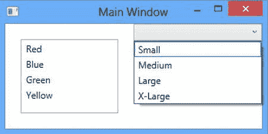
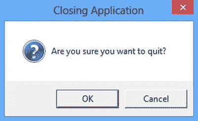
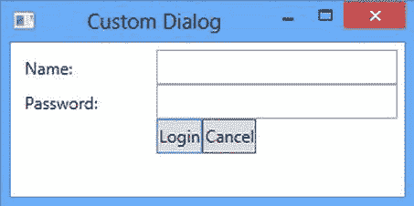

# 十一、开发 WPF 应用

在第 10 章中，你学习了如何构建应用的数据访问层。为了实现它的逻辑，您使用了`System.Data`名称空间的类。这些类检索和处理关系数据，这是许多业务应用的常见需求。现在，您已经准备好了解用户将如何与您的应用进行交互。用户通过用户界面层与应用进行交互。这一层又与业务逻辑层交互，业务逻辑层又与数据访问层交互。在本章中，您将学习如何使用？NET Windows 演示基础(WPF)。WPF 通常用于开发在 Windows 7 及更高版本上运行的桌面业务生产力应用。商业生产力应用面向需要查询和更新存储在后端数据库中的数据的商业用户。它由一套全面的应用开发功能组成，包括可扩展应用标记语言(XAML) 、控件、数据绑定和布局。本章讨论的概念也将为第 13 章奠定基础，在第 13 章中，我们将着眼于为 Windows 8 创建新的 Windows Store 应用用户界面。这些应用使用类似的模型来创建具有 XAML 和数据绑定控件的界面。

阅读本章后，您将能够轻松执行以下任务:

*   使用 XAML 标记设计用户界面
*   使用布局控件
*   使用显示控件
*   响应控制事件
*   使用数据绑定控件
*   创建和使用控件模板

Windows 基础

窗口是具有可视界面的对象，绘制在屏幕上，为用户提供与程序交互的方式。像面向对象语言中的大多数对象一样 .NET 窗口公开属性、方法和事件。窗口的属性定义了它的外观。例如，它的`Background`属性决定了它的颜色。窗口的方法定义了它的行为。例如，调用它的`Hide`方法对用户隐藏它。窗口的事件定义了与用户(或其他对象)的交互。例如，当用户在窗口上单击鼠标右键时，您可以使用`MouseDown`事件来启动一个动作。

控件是具有可视化界面的组件，为用户提供了与程序交互的方式。窗口是一种特殊类型的控件，称为容器控件，它承载其他控件。您可以在窗口上放置许多不同类型的控件。在 windows 上使用的一些常见控件有文本框、标签、选项按钮、列表框和复选框。除了提供的控件之外 .NET Framework，您也可以创建自己的自定义控件或从第三方供应商处购买控件。

介绍 XAML

WPF 用户界面是使用一种称为 XAML 的声明性标记语言构建的。 XAML 声明组成界面的控件。左尖括号(`<`)后跟控件类型名称和右尖括号定义控件。例如，下面的标记在网格`中定义了一个按钮控件。`

 ```cs`
<Grid>
      <Button/>
</Grid>
```

请注意，该网格需要一个正式的结束标记，因为它包含按钮控件。因为按钮控件不包含任何其他元素，所以可以在结束括号前使用正斜杠(`/`)来关闭它。

下一步是定义控件的属性。例如，你可能想将按钮的背景颜色设置为红色，并在上面写一些文字。使用属性语法设置控件的属性，属性语法由属性名、等号和引号中的属性值组成。以下标记显示了添加了一些属性的按钮控件:

```cs
<Grid>
      <Button Content="Click Me" Background="Red"/>
</Grid>
```

对于对象元素的某些属性，使用一种称为属性元素语法的语法。属性元素开始标签的语法是`<typeName.propertyName>`。例如，您可以在布局网格中创建行和列，以控制网格中控件的放置，如下所示:

```cs
<Grid.ColumnDefinitions>
        <ColumnDefinition Width="100" />
        <ColumnDefinition Width="*" />
</Grid.ColumnDefinitions>
<Grid.RowDefinitions>
        <RowDefinition Height="25" />
        <RowDefinition Height="25" />
        <RowDefinition Height="25" />
</Grid.RowDefinitions>
```

控件通过包含`Grid.Row`和`Grid.Column`属性、在网格中定位，如下所示:

```cs
<Label Grid.Column="0" Grid.Row="0" Content="Name:" />
        <Label Grid.Column="0" Grid.Row="1" Content="Password:" />
        <TextBox Name="txtName" Grid.Column="1"  Grid.Row="0"/>
        <TextBox Name="txtPassword" Grid.Column="1"  Grid.Row="1"/>
        <Button Grid.Column="1" Grid.Row="3"
        Content="Click Me" HorizontalAlignment="Right"
        MinWidth="80" Background="Red"/>
```

[图 11-1](#Fig1) 显示了由先前的 XAML 代码创建的带有两个文本框的窗口。


[图 11-1](#_Fig1) 。用 XAML 创造的窗户

使用布局控件

虽然您可以使用固定位置在 WPF 窗口上放置控件，但不建议这样做。使用固定定位通常适用于固定的分辨率大小，但不适用于不同的分辨率和设备。为了克服固定定位的局限性，WPF 提供了几个布局控件。布局控件允许您使用相对定位格式在其中定位其他控件。用于定位其他控件的主要布局控件之一是网格。如前所述，一个网格控件包含列和行来控制其子控件的位置。列和行的高度和宽度可以设置为固定值、自动或`*`。自动设置占用所包含控件所需的空间。`*`设置占用尽可能多的可用空间。网格控件通常用于布局数据输入表单。下面的代码展示了一个用于收集用户信息的简单数据输入表单。结果表单(在 Visual Studio 设计器中)如图 11-2 中的[所示。](#Fig2)


[图 11-2](#_Fig2) 。输入表单窗口

```cs
<Grid>
    <Grid.RowDefinitions>
        <RowDefinition Height="Auto" />
        <RowDefinition Height="Auto" />
        <RowDefinition Height="Auto" />
        <RowDefinition Height="Auto" />
        <RowDefinition Height="28" />
        <RowDefinition Height="*" />
    </Grid.RowDefinitions>
    <Grid.ColumnDefinitions>
        <ColumnDefinition Width="Auto" />
        <ColumnDefinition Width="200" />
        <ColumnDefinition Width="*" />
    </Grid.ColumnDefinitions>
    <Label Grid.Row="0" Grid.Column="0" Content="Name:"/>
    <Label Grid.Row="1" Grid.Column="0" Content="Old Password:"/>
    <Label Grid.Row="2" Grid.Column="0" Content="New Password:"/>
    <Label Grid.Row="3" Grid.Column="0" Content="Confirm Password:"/>
    <TextBox Grid.Column="1" Grid.Row="0" Margin="3" />
    <TextBox Grid.Column="1" Grid.Row="1" Margin="3" />
    <TextBox Grid.Column="1" Grid.Row="2" Margin="3" />
    <TextBox Grid.Column="1" Grid.Row="3" Margin="3" />
    <Button Grid.Column="1" Grid.Row="4" HorizontalAlignment="Right"
        MinWidth="80" Margin="0,0,0,8" Content="Submit"  />
</Grid>
```

另一个有用的布局控件是 StackPanel。它根据方向设置垂直或水平布局子控件。下面的代码显示了 StackPanel 控件中的两个按钮:

```cs
<StackPanel Grid.Column="1" Grid.Row="4" Orientation="Horizontal" >
    <Button  MinWidth="80" Margin="0,0,0,8" Content="Submit" />
    <Button  MinWidth="80" Margin="0,0,0,8" Content="Cancel"  />
</StackPanel>
```

其他一些可用的布局控件有 DockPanel、WrapPanel 和 Canvas。dock panel 用于将元素停靠在面板的左侧、右侧、顶部、底部或中心。 WrapPanel 的行为类似于 StackPanel，但是如果没有剩余空间，它会将子控件换行。画布控件用于以相对于其一侧的绝对定位来布局其子元素。它通常用于图形元素，而不是布局用户界面控件。

添加显示控件

大多数业务应用的目标是向用户呈现数据，并允许他们更新数据并将其保存回数据库。用于简化这一过程的一些常见控件有文本框、列表框、组合框、复选框、日期选择器和数据网格。您已经看到了在窗口上使用的 TextBox 下面的代码演示了如何向窗口中添加 ListBox 和 ComboBox。图 11-3 显示了窗口是如何呈现的。



[图 11-3](#_Fig3) 。包含列表框和组合框的窗口

```cs
<Grid>
    <Grid.ColumnDefinitions>
        <ColumnDefinition Width="*" />
        <ColumnDefinition Width="*" />
    </Grid.ColumnDefinitions>
    <ListBox Margin="20" Grid.Column="0">
        <ListBoxItem>Red</ListBoxItem>
        <ListBoxItem>Blue</ListBoxItem>
        <ListBoxItem>Green</ListBoxItem>
        <ListBoxItem>Yellow</ListBoxItem>
    </ListBox>
    <ComboBox Grid.Column="1" VerticalAlignment="Top">
        <ComboBoxItem>Small</ComboBoxItem>
        <ComboBoxItem>Medium</ComboBoxItem>
        <ComboBoxItem>Large</ComboBoxItem>
        <ComboBoxItem>X-Large</ComboBoxItem>
    </ComboBox>
</Grid>
```

虽然可以直接在 XAML 标记中对这些控件中显示的项进行编码，但更有可能的是使用数据绑定来显示它们的值。您将很快看到数据绑定。

使用 Visual Studio 设计器

尽管使用文本编辑器完全通过代码创建窗口是很有可能的，但是您可能会发现这个过程非常乏味，并且不是非常有效地利用您的时间。幸运的是，Visual Studio IDE 包含了一个优秀的设计器来创建你的 WPF 窗口。使用设计器，您可以将控件从工具箱拖放到 Visual Studio 设计器，使用 Visual Studio 属性窗口设置其属性，并在使用 XAML 编辑器输入代码时获得自动完成和语法检查的好处。图 11-4 显示了 Visual Studio 设计器中的一个窗口。


[图 11-4](#_Fig4) 。在 Visual Studio 中设计窗口

处理控制事件

Windows 图形用户界面(GUI)程序是事件驱动的。事件是由用户或系统发起的动作，例如，每当用户点击一个按钮，或者一个`SqlConnection`对象发出一个`StateChange`事件。事件驱动的应用通过执行您指定的代码来响应发生的各种事件。为了响应事件，您定义了在特定事件发生时要执行的事件处理程序。正如你在第八章中看到的 .NET Framework 使用委托来绑定事件，并编写事件处理程序来响应事件。一个委托对象维护一个方法调用列表，这些方法已经订阅了在事件发生时接收通知。当事件发生时(例如，单击按钮)，控件将通过调用事件的委托来引发事件，该事件的委托又将调用已订阅接收事件通知的事件处理程序方法。虽然这听起来很复杂，但是框架类为您完成了大部分工作。

在 Visual Studio 中，可以通过编写 XAML 代码或在控件的“属性”窗口中选择事件来将事件添加到 WPF 控件中。图 11-5 显示了在 XAML 编辑器窗口中连接一个事件处理器；[图 11-6](#Fig6) 显示了使用属性窗口的事件选项卡连接事件处理程序。注意，当在代码中使用控件时，您需要使用`Name`属性给它们一个唯一的名称。


[图 11-5](#_Fig5) 。在 XAML 编辑器中连接事件处理程序


[图 11-6](#_Fig6) 。在“属性”窗口中连接事件处理程序

下面的代码显示了按钮单击事件的代码隐藏文件中插入的事件处理程序方法:

```cs
private void btnSubmit_Click(object sender, RoutedEventArgs e)
{
}
```

按照惯例，事件处理程序方法的名称以发出事件的对象的名称开头，后面跟着一个下划线(`_`)和事件的名称。然而，事件处理程序的实际名称并不重要。XAML 代码中的`Click`属性将这个方法添加到事件委托对象的调用列表中。

所有事件处理程序都必须提供两个参数，这两个参数在触发事件时传递给方法。第一个参数是 sender，它表示启动事件的对象。类型为`System.Windows.RoutedEventArgs`的第二个参数是一个对象，用于传递特定事件的任何特定信息。

因为 .NET Framework 使用委托进行事件通知，如果事件具有相同的签名，您可以使用相同的方法处理多个事件。例如，您可以用同一事件处理程序处理按钮单击事件和菜单单击事件，但不能处理文本框按键事件，因为它具有不同的签名。下面的代码演示如何处理使用相同处理程序方法的两个按钮的按钮单击事件。`sender`参数被转换为`Button`类型，并被询问以确定哪个按钮触发了事件。

```cs
private void Button_Click(object sender, RoutedEventArgs e)
{
    Button btn = (Button)sender;
    if (btn.Name == "btnCancel")
    {
        //Cancel code goes here
    }
    else if (btn.Name == "btnSubmit")
    {
        //Submit code goes here
    }
}
```

在下面的活动中，您将使用表单和控件构建一个简单的备忘录查看器应用，该应用允许用户加载和查看备忘录文档。

**活动 11-1。使用窗口和控件**

在本活动中，您将熟悉以下内容:

*   创建基于 Windows 窗体的 GUI 应用
*   使用菜单、状态条和对话框控件
*   使用控制事件

**创建备忘录查看器界面**

要创建备忘录查看器界面，请遵循以下步骤:

1.  启动 Visual Studio。选择文件新建项目。
2.  选择 C# 项目文件夹下的 WPF 应用。将项目重命名为 Activity11_1，然后单击“OK”按钮。
3.  该项目包含一个 MainWindow.xaml 文件。这个文件是你设计用户界面的地方。该项目还包含一个 MainWindow.xaml.cs 文件。这是代码隐藏文件，您将在其中添加代码来响应事件。如果尚未打开，请在 xaml 编辑器窗口中打开 MainWindow.xaml 文件。
4.  In the Window tag of the XAMLmarkup, add a Name attribute with a value of “MemoViewer”. Change the Title attribute to “Memo Viewer”.

    `<Window x:Name="Memoviewer" x:Class="Act11_1.MainWindow"`

    `xmlns="``http://schemas.microsoft.com/winfx/2006/xaml/presentation`T2】

    `xmlns:x="``http://schemas.microsoft.com/winfx/2006/xaml`T2】

    `Title="Memo Viewer" Height="350" Width="525">`

5.  Add a DockPanel control in the Grid control.

    `<Grid>`

    `<DockPanel LastChildFill="True">`

    `</DockPanel>`

    `</Grid>`

6.  Add a Menu control inside the DockPanel and dock it to the top using the following XAML:

    `<DockPanel LastChildFill="True">`

    `<Menu DockPanel.Dock="Top">`

    `<MenuItem Header="_File">`

    `<MenuItem Name="mnuNew" Header="_New. . ." />`

    `<Separator />`

    `<MenuItem Name="mnuOpen"  Header="_Open. . ." />`

    `<Separator />`

    `<MenuItem Name="mnuSave" Header="_Save" />`

    `<MenuItem Name="mnuSaveAs" Header="_Save As. . ." />`

    `<Separator />`

    `<MenuItem  Name="mnuExit" Header="_Exit" />`

    `</MenuItem>`

    `<MenuItem Header="_Edit">`

    `<MenuItem Header="_Cut. . ." />`

    `<MenuItem Header="_Copy. . ." />`

    `<MenuItem Header="_Paste" />`

    `</MenuItem>`

    `</Menu>`

    `</DockPanel>`

7.  Add a StatusBar control by inserting the following code between the ending `Menu` tag and the ending `DockPanel` tag. Note that you are using a Grid control inside the StatusBar control to lay out the items in the StatusBar.

    `<StatusBar DockPanel.Dock="Bottom">`

    `<Grid>`

    `<Grid.RowDefinitions>`

    `<RowDefinition Height="*"/>`

    `</Grid.RowDefinitions>`

    `<Grid.ColumnDefinitions>`

    `<ColumnDefinition Width="4*"/>`

    `<ColumnDefinition Width="*"/>`

    `</Grid.ColumnDefinitions>`

    `</Grid>`

    `<StatusBarItem Grid.Column="0" HorizontalAlignment="Left">`

    `<TextBlock Name="sbTextbox1">File Name</TextBlock>`

    `</StatusBarItem>`

    `<StatusBarItem Grid.Column="1" HorizontalAlignment="Right">`

    `<TextBlock Name="sbTextbox2">Date</TextBlock>`

    `</StatusBarItem>`

    `</StatusBar>`

8.  Add a RichTextBox control after the `StatusBar` end tag and before the `DockPanel` end tag.

    `</StatusBar>`

    `<RichTextBox Name="rtbMemo" />`

    `</DockPanel>`

9.  Note that as you add the XAML, the Visual Designer updates the appearance of the window. The Memo Viewer window should look similar to the one shown [Figure 11-7](#Fig7).

    

    [图 11-7](#_Fig7) 。完整的 MemoEditor 窗口

10.  构建解决方案。如果有任何错误，请修复并重新构建。

**编码控制事件**

要对控制事件进行编码，请遵循以下步骤:

1.  In the XAML Editor window, add the `Loaded` event attribute to the Window, as shown:

    `<Window x:Class="Act11_1.MainWindow"`

    `xmlns="``http://schemas.microsoft.com/winfx/2006/xaml/presentation`T2】

    `xmlns:x="``http://schemas.microsoft.com/winfx/2006/xaml`T2】

    `Name="MemoViewer" Title="Memo Viewer" Height="350" Width="525"`

    `Loaded="MemoViewer_Loaded">`

2.  Open the codebehind file by right-clicking the XAML code editor and selecting View Code. Add the following code to the `MemoViewer_Loaded` event handler. When the window loads, it should show the message on the left side of the StatusPanel and the date on the right.

    `private void MemoViewer_Loaded(object sender, RoutedEventArgs e)`

    `{`

    `sbTextbox1.Text = "Ready to load file";`

    `sbTextbox2.Text = DateTime.Today.ToShortDateString();`

    `}`

3.  In the XAML editor, add the `Click` event to the mnuOpen control.

    `<MenuItem Name="mnuOpen"  Header="_Open. . ."`

    `Click="mnuOpen_Click"/>`

4.  In the Code Editor window of the codebehind file, add the following code to the menu click event. This code configures and launches an Open File Dialog box, which returns the file path. The file path is then passed to a `FileStream` object, which loads the file into the RichTextBox. The file path is also loaded into the StatusBar TextBox.

    `private void mnuOpen_Click(object sender, RoutedEventArgs e)`

    `{`

    `// Configure open file dialog box`

    `Microsoft.Win32.OpenFileDialog dlg = new Microsoft.Win32.OpenFileDialog();`

    `dlg.FileName = "Document"; // Default file name`

    `dlg.DefaultExt = ".txt"; // Default file extension`

    `dlg.Filter = "Text documents (.txt)|*.txt"; // Filter files by extension`

    `// Show open file dialog box`

    `Nullable<bool> result = dlg.ShowDialog();`

    `// Process open file dialog box results`

    `if (result == true)`

    `{`

    `// Open document and load RichTextBox`

    `string fileName = dlg.FileName;`

    `TextRange range;`

    `System.IO.FileStream fStream;`

    `if (System.IO.File.Exists(fileName))`

    `{`

    `range = new TextRange(rtbMemo.Document.ContentStart,`

    `rtbMemo.Document.ContentEnd);`

    `fStream = new System.IO.FileStream`

    `(fileName,System.IO.FileMode.OpenOrCreate);`

    `range.Load(fStream, System.Windows.DataFormats.Text );`

    `fStream.Close();`

    `}`

    `sbTextbox1.Text = fileName;`

    `}`

    `}`

5.  Add a click event for the mnuExit control with the following code to close the window:

    `private void mnuExit_Click(object sender, RoutedEventArgs e)`

    `{`

    `this.Close();`

    `}`

6.  生成解决方案并修复任何错误。
7.  在 c 盘上创建一个备忘录文件夹。使用记事本，创建一个包含测试消息的文本文件。将文件另存为 Test.txt。
8.  选择调试开始。通过加载 Test.txt 文件来测试应用。查看文件后，单击退出菜单关闭窗口。
9.  测试完应用后，退出 Visual Studio。

创建和使用对话框

对话框 是基于 windows 的 GUI 应用中常用的特殊窗口，用于显示或检索用户的信息。普通窗口和对话框的区别在于对话框是有模式显示的。在对话框关闭之前，模式窗口阻止用户在应用中执行其他任务。在 Visual Studio 中启动一个新项目时，会出现一个新项目对话框，如图[图 11-8](#Fig8) 所示。您还可以使用对话框向用户提供关键信息，并询问他们是否做出响应。例如，如果你试图在调试模式下运行一个应用，并且遇到一个编译错误，Visual Studio IDE 会显示一个对话框询问你是否要继续(参见[图 11-9](#Fig9) )。


[图 11-8](#_Fig8) 。“新建项目”对话框


[图 11-9](#_Fig9) 。使用对话框显示关键信息

向用户显示一个消息框

[图 11-9](#Fig9) 所示的对话框是一种特殊的预定义类型，称为消息框。`MessageBox`类是`System.Windows`名称空间的一部分。这个`MessageBox`类可以显示一个标准的 Windows 消息对话框。为了向用户显示一个 MessageBox，您调用 MessageBox 的静态`Show`方法，就像这样:

```cs
MessageBox.Show("File Saved");
```

`Show`方法被重载，以便您可以选择显示 MessageBox 图标、显示标题、更改显示的按钮以及设置默认按钮。唯一需要的设置是要在表单上显示的文本消息。[图 11-10](#Fig10) 显示了前面代码显示的消息框。


[图 11-10](#_Fig10) 。一个基本的消息框

下面的代码使用一些其他参数调用`Show`方法。[图 11-11](#Fig11) 显示了显示的结果消息框。有关各种可用参数和设置的更多信息，请在 Visual Studio 帮助文件中查找`MessageBox`类。

```cs
MessageBox.Show("Are you sure you want to quit?",
           "Closing Application",MessageBoxButton.OKCancel,
           MessageBoxImage.Question);
```



[图 11-11](#_Fig11) 。更复杂的消息框

您将经常使用 MessageBox 来查询用户对某个问题的响应。用户通过点击按钮来响应。结果以`MessageBoxResult`枚举的形式作为`MessageBox.Show`方法的返回值传递回来。以下代码捕获用户输入的对话框结果，并根据结果关闭(或不关闭)窗口:

```cs
MessageBoxResult result =  MessageBox.Show("Are you sure you want to quit?",
                    "Closing Application",MessageBoxButton.OKCancel,
                    MessageBoxImage.Question);
if (result == MessageBoxResult.OK)
{
    this.Close();
}
```

创建自定义对话框

最激动人心的特性之一 .NET Framework 就是它的扩展性。尽管有许多类型的对话框，你可以使用“开箱即用”的来完成打印、保存文件和加载文件等任务。您还可以构建自己的自定义对话框。创建自定义对话框的第一步是在应用中添加一个新窗口。接下来，添加与用户交互所需的任何控件。[图 11-12](#Fig12) 显示了一个对话框，你可以用它来验证用户的身份。



[图 11-12](#_Fig12) 。自定义对话框

将 Cancel 按钮的`IsCancel`属性设置为 true 会将其与 ESC 键的快捷键相关联。将登录按钮的`IsDefault`属性设置为 true 会将其与键盘回车键相关联。这显示在下面的 XAML 代码中:

```cs
<StackPanel Grid.Column="1"  Grid.Row="3" Orientation="Horizontal">
    <Button Name="loginButton" IsDefault="True">Login</Button>
    <Button Name="cancelButton" IsCancel="True">Cancel</Button>
</StackPanel>
```

当单击登录按钮时，按钮的 click 事件负责验证用户输入并将`DialogResult`属性设置为 true 或 false。这个值被返回给调用 DialogWindow 的`Show`方法的窗口，以便进一步处理。下面的代码显示了被调用的 LoginDialog 窗口和被询问的`DialogResult`属性。请注意，调用窗口可以访问 DialogWindow 上定义的对象。在本例中，它正在询问`txtName`文本框的`Text`属性。

```cs
LoginDialog dlg = new LoginDialog();
dlg.Owner = this;
dlg.ShowDialog();
if (dlg.DialogResult == false)
{
    string user = dlg.txtName.Text;
    MessageBox.Show("Invalid login for " + user, "Warning",
               MessageBoxButton.OK, MessageBoxImage.Exclamation);
               this.Close();
}
```

基于 Windows 的图形用户界面中的数据绑定

一旦从业务逻辑层检索到数据，就必须将其呈现给用户。用户可能需要通读数据、编辑数据、添加记录或删除记录。您想要添加到窗口中的许多控件都可以显示数据。选择使用哪种控件通常取决于要显示的数据类型、操作数据的方式以及界面的设计。在控件中 .NET 开发人员通常用来显示数据的是文本框、数据网格、标签、列表框、复选框和日历。当数据源的不同字段在单独的控件中呈现给用户时(例如，名文本框和姓文本框)，控件保持同步以显示相同的记录是很重要的。

那个 .NET Framework 通过称为数据绑定的过程封装了将控件同步到数据源的大部分复杂性。当您在控件和某些数据之间创建绑定时，您正在将绑定目标绑定到绑定源。绑定对象处理绑定源和绑定目标之间的交互。单向绑定导致对源属性的更改自动更新目标属性，但对目标属性的更改不会传播回源属性。这对于只读情况很有用。双向绑定导致源属性或目标属性的改变自动更新另一个。这对于完整的数据更新场景非常有用。

使用 DataContext 绑定控件

若要将控件绑定到数据，您需要一个数据源对象。容器控件的 DataContext 允许子控件从其父控件继承有关用于绑定的数据源的信息。下面的代码设置顶层窗口控件的`DataContext`属性。它使用 DataSet 和 TableAdapter 填充一个`Table`对象，并将其设置为窗口的 DataContext。

```cs
private void Window_Loaded(object sender, RoutedEventArgs e)
{
    pubsDataSet dsPubs = new pubsDataSet();
    pubsDataSetTableAdapters.storesTableAdapter taStores =
        new pubsDataSetTableAdapters.storesTableAdapter();
    taStores.Fill(dsPubs.stores);
    this.DataContext = dsPubs.stores.DefaultView;
}
```

下面的 XAML 代码使用`Path`属性将数据网格列绑定到商店表列。使用`Binding`作为源意味着“查找容器层次结构，直到找到 DataContext。”在这种情况下，它是窗口容器的 DataContext。

```cs
<DataGrid  AutoGenerateColumns="False"  ItemsSource="{Binding}">
    <DataGrid.Columns>
        <DataGridTextColumn x:Name="stor_idColumn"
             Binding="{Binding Path=stor_id}" Header="Id"  />
        <DataGridTextColumn x:Name="stor_nameColumn"
             Binding="{Binding Path=stor_name}" Header="Name" />
        <DataGridTextColumn x:Name="stateColumn"
            Binding="{Binding Path=state}" Header="State" />
        <DataGridTextColumn x:Name="zipColumn"
               Binding="{Binding Path=zip}" Header="Zip" />
    </DataGrid.Columns>
</DataGrid>
```

加载了商店数据的结果数据网格如图 11-13 所示。


[图 11-13](#_Fig13) 。用数据网格显示商店数据

在以下活动中，您将把 DataGrid 控件绑定到包含 Pubs 数据库中的数据的 DataTable。您还将使用 DataAdapter 将 DataGrid 控件中所做的数据更改更新回 Pubs 数据库。

**活动 11-2。使用数据绑定控件**

在本活动中，您将熟悉以下内容:

*   将数据网格绑定到数据表
*   使用 DataAdapter 更新数据

**将数据网格绑定到数据表**

要将 DataGrid 绑定到 DataTable 对象，请执行以下步骤:

**创建数据集**

1.  启动 Visual Studio。选择文件新建项目。
2.  选择 WPF 应用。将项目重命名为 Activity11_2，然后单击“确定”按钮。
3.  项目加载后，找到位于屏幕左侧的“数据源”窗口。单击添加新数据源链接。
4.  在数据源配置向导中，选择数据库的数据源类型，然后单击下一步继续。
5.  在“选择数据库模型”窗口中，选择数据集，然后单击“下一步”。
6.  在“选择您的数据连接”窗口中，选择或创建到 Pubs 数据库的连接，然后单击“下一步”。
7.  在下一个屏幕上，保存到应用配置文件的连接。
8.  在“选择您的数据库对象”窗口中，展开表的节点并选择 authors 表。单击完成按钮。
9.  注意在“解决方案资源管理器”窗口中，pubsDataSet.xsd 文件已添加到该文件中。该文件表示基于 pubs 数据库的强类型 dataset 对象。在解决方案资源管理器中双击文件节点以启动数据集可视化编辑器。
10.  The visual editor contains an authors table. Select the authorsTableAdapter, as shown in [Figure 11-14](#Fig14). In the Properties window, notice that the select, insert, update, and delete commands have been generated for you (see [Figure 11-15](#Fig15)).

    

    [图 11-14](#_Fig14) 。选择 authorsTableAdapter

    

    [图 11-15](#_Fig15) 。查看生成的命令文本

**创建窗口布局**

1.  在 XAML 编辑器窗口中打开主窗口。将窗口标题更改为“电话列表”。
2.  Inside the `Grid` tags, add a DockPanel control. Inside the DockPanel, add a StackPanel.

    `<Grid>`

    `<DockPanel>`

    `<StackPanel DockPanel.Dock="Top" Orientation="Horizontal">`

    `</StackPanel>`

    `</DockPanel>`

    `</Grid>`

3.  Inside the StackPanel, add two buttons—one for getting data and one for updating data. Add a `Click` event handler for each button.

    `<StackPanel DockPanel.Dock="Top" Orientation="Horizontal">`

    `<Button Name="btnGetData" Content="Get Data"`

    `Click="btnGetData_Click" />`

    `<Button Name="btnSaveData" Content="Save Data" />`

    `</StackPanel>`

4.  Outside the StackPanel but inside the DockPanel, add a DataGrid.

    `<DataGrid Name="dgAuthors" AutoGenerateColumns="True"`

    `DockPanel.Dock="Bottom" />`

    `</DockPanel>`

    `</Grid>`

**加载数据网格**

1.  在代码编辑器窗口中打开 MainWindow.xaml.cs 文件。
2.  Add three class level variables of type `pubsDataset`, `authorsTableAdapter`, and `authorsDataTable`.

    `public partial class MainWindow : Window`

    `{`

    `pubsDataSet _dsPubs;`

    `pubsDataSetTableAdapters.authorsTableAdapter _taAuthors;`

    `pubsDataSet.authorsDataTable _dtAuthors;`

3.  In the `btnGetData_Click` event, add code to fill the _taAuthors table and set it equal to the DataContext of the dgAuthors grid.

    `private void btnGetData_Click(object sender, RoutedEventArgs e)`

    `{`

    `_dsPubs = new pubsDataSet();`

    `_taAuthors = new pubsDataSetTableAdapters.authorsTableAdapter();`

    `_dtAuthors = new pubsDataSet.authorsDataTable();`

    `_taAuthors.Fill(_dtAuthors);`

    `this.dgAuthors.DataContext = _dtAuthors;`

    `}`

4.  Switch back to the XAML Editor Window and add the ItemsSource binding to the DataGrid’s XAML code. This will bind it to the DataContext.

    `<DataGrid Name="dgAuthors" AutoGenerateColumns="True"`

    `DockPanel.Dock="Bottom" ItemsSource="{Binding}" />`

5.  选择调试开始。单击“获取数据”按钮测试应用。数据网格将加载作者的数据(见[图 11-16](#Fig16) )。请注意，由于 DataGrid 的`AutoGenerateColumns`属性被设置为 true，因此网格将加载表中的所有列。网格列的标题也与作者的表格列同名。
6.  After viewing the window, stop the debugger.

    

    [图 11-16](#_Fig16) 。作者数据网格

**更新数据**

1.  Open the MainWindow.xaml.cs file in the Code Editor window. Add the following code to update the data in the `btnSaveData_Click` event handler. This code uses the table adapter’s update command to send the changes back to the database. You must also alter the btnSaveData’s XAML to call this event when it is clicked.

    `private void btnSaveData_Click(object sender, RoutedEventArgs e)`

    `{`

    `try`

    `{`

    `_taAuthors.Update(_dtAuthors);`

    `MessageBox.Show("Data Saved.",`

    `"Information", MessageBoxButton.OK,`

    `MessageBoxImage.Information);`

    `}`

    `catch (Exception ex)`

    `{`

    `MessageBox.Show("Could not save data!",`

    `"Warning",MessageBoxButton.OK,`

    `MessageBoxImage.Warning);`

    `}`

    `}`

2.  Update the Grid’s XAML code to only show the first name, last name, and phone columns.

    `<DataGrid Name="dgAuthors" AutoGenerateColumns="False"`

    `DockPanel.Dock="Bottom" ItemsSource="{Binding}">`

    `<DataGrid.Columns>`

    `<DataGridTextColumn Header="Last Name"`

    `Binding="{Binding Path='au_lname'}" />`

    `<DataGridTextColumn Header="First Name"`

    `Binding="{Binding Path='au_fname'}" />`

    `<DataGridTextColumn Header="Phone"`

    `Binding="{Binding Path='phone'}" />`

    `</DataGrid.Columns>`

    `</DataGrid>`

3.  选择调试开始。单击“获取数据”按钮测试应用。更新一些名字。单击“保存数据”按钮，然后单击“获取数据”按钮，验证名称是否已保存到数据库中。
4.  测试后，停止调试器并退出 Visual Studio。

创建和使用控件和数据模板

在 WPF 中，每个控件都有一个管理其视觉外观的模板。如果你没有显式地设置它的`Style`属性，那么它使用一个默认的模板。创建一个定制模板并将其分配给`Style`属性是改变应用外观的一个很好的方法。[图 11-17](#Fig17) 显示了一个使用控件模板创建的圆形按钮。


[图 11-17](#_Fig17) 。使用自定义模板创建圆形按钮

以下 XAML 是定义自定义模板的标记，该模板用于创建图 11-17 中的圆形按钮。

```cs
<Window.Resources>
      <Style x:Key="RoundedButtonStyle" TargetType="Button">
          <Setter Property="Template">
              <Setter.Value>
                  <ControlTemplate TargetType="{x:Type Button}">
                      <Grid>
                          <Ellipse Fill="{TemplateBinding Background}"
                           Stroke="{TemplateBinding BorderBrush}"/>
                          <ContentPresenter HorizontalAlignment="Center"
                                        VerticalAlignment="Center"/>
                      </Grid>
                  </ControlTemplate>
              </Setter.Value>
          </Setter>
      </Style>
</Window.Resources>
```

以下 XAML 代码用于使用按钮的`Style`属性将自定义样式绑定到按钮:

```cs
<Button Content="Rounded Button" Style="{StaticResource RoundedButtonStyle}"
```

除了控件样式模板，您还可以创建数据模板。当您在 UI 中绑定业务对象时，数据模板允许您自定义业务对象的外观。需要使用自定义数据模板的一个很好的例子是列表框。默认情况下，它将数据呈现为单行文本。当您试图将它绑定到 employee 对象列表时，它会调用`ToString()`方法并将其写出到显示器上。正如你在[图 11-18](#Fig18) 中看到的，这显然不是你想要的。


[图 11-18](#_Fig18) 。使用默认数据模板的列表框

通过向 ListBox 控件添加 DataTemplate，不仅可以显示雇员数据，还可以控制数据的显示方式。下面的 XAML 向列表框添加了一个数据模板，图 11-19 显示了结果:

```cs
<ListBox ItemsSource="{Binding}" >
    <ListBox.ItemTemplate>
        <DataTemplate>
            <StackPanel Orientation="Horizontal">
                <TextBlock FontWeight="Bold" Text="{Binding Path='lname'}" />
                <TextBlock Text=", " />
                <TextBlock Text="{Binding Path='fname'}" />
                <TextBlock Text=" " />
                <TextBlock Text="{Binding Path = 'minit'}" />
             </StackPanel>
         </DataTemplate>
    </ListBox.ItemTemplate>
</ListBox>
```


[图 11-19](#_Fig19) 。使用自定义数据模板的列表框

在以下活动中，您将使用实体数据模型将 ListBox 控件绑定到从 Pubs 数据库创建的实体。您还将通过同步 ListBox 控件和 DataGrid 控件来创建主从视图。

**活动 11-3。使用数据模板**

在本活动中，您将熟悉以下内容:

*   将列表框绑定到实体
*   创建数据模板
*   创建主详细视图

**将列表框绑定到实体**

要将一个列表框绑定到一个实体对象，请遵循以下步骤:

1.  启动 Visual Studio。选择文件新建项目。
2.  选择 Windows 模板下的 WPF 应用。将项目重命名为 Activity11_3，然后单击“确定”按钮。
3.  项目加载后，定位“数据源”窗口(它应该在设计器窗口的左侧)。单击添加新数据源链接。
4.  在数据源配置向导中，选择数据库的数据源类型。
5.  在“选择数据库模型”窗口中，选择实体数据模型。
6.  在“选择模型内容”窗口中，选择“从数据库生成”选项。
7.  在“选择您的数据连接”窗口中，选择或创建到 Pubs 数据库的连接。将连接保存到应用配置文件。
8.  在“选择数据库对象”窗口中，展开“表”节点，然后选择“商店”和“销售”表。单击完成按钮。
9.  请注意，在“解决方案资源管理器”窗口中，Model1.edmx 文件已添加到项目中。这个文件包含 pubs 数据库中实体和表之间的关系映射。

**创建数据模板**

1.  Add a DockPanel and a ListBox control in the XAML Editor window between the default Grid tags.

    `<Grid>`

    `<DockPanel>`

    `<ListBox Name="StoresList" DockPanel.Dock="Left" ItemsSource="{Binding}">`

    `</ListBox>`

    `</DockPanel>`

    `</Grid>`

2.  Add a window Loaded event attribute to the Window’s opening tag.

    `<Window x:Class="Activity11_3.MainWindow"`

    `xmlns="``http://schemas.microsoft.com/winfx/2006/xaml/presentation`T2】

    `xmlns:x="``http://schemas.microsoft.com/winfx/2006/xaml`T2】

    `Title="MainWindow" Height="350" Width="525"`

    `Loaded="Window_Loaded_1">`

3.  Add a `Window_Loaded` event handler in the code file that sets the DataContext of the ListBox to the stores entities.

    `private void Window_Loaded_1(object sender, RoutedEventArgs e)`

    `{`

    `pubsEntities pEntities = new pubsEntities();`

    `this.StoresGrid.DataContext = pEntities.stores.ToList<store>();`

    `}`

4.  Add a DataTemplate to display the store name in a TextBlock control inside the ListBox control.

    `<ListBox Name="StoresList" DockPanel.Dock="Left"`

    `ItemsSource="{Binding}">`

    `<ListBox.ItemTemplate>`

    `<DataTemplate>`

    `<TextBlock FontWeight="Bold" Text="{Binding Path='stor_name'}" />`

    `</DataTemplate>`

    `</ListBox.ItemTemplate>`

    `</ListBox>`

5.  选择调试开始。确保列表框显示商店名称。查看完列表框后，停止调试器。
6.  To implement a master/detail data view, add a DataGrid control to the DockPanel control after the ListBox control. The Binding of the grid is set to the same as the list box, which is the store entity, but the binding path is set to the sales entity. This will cause the data grid to show the sales items of the store selected in the list box.

    `<DataGrid Name="SalesGrid" DockPanel.Dock="Right"`

    `ItemsSource="{Binding Path='sales'}" AutoGenerateColumns="False">`

    `<DataGrid.Columns>`

    `<DataGridTextColumn Header="Order Number"`

    `Binding ="{Binding Path ='ord_num'}"/>`

    `<DataGridTextColumn Header="Order Date"`

    `Binding="{Binding Path='ord_date'}"/>`

    `</DataGrid.Columns>`

    `</DataGrid>`

7.  Add the following property to the ListBox control in the XAML code. This will ensure that the ListBox control and DataGrid control will remain in sync.

    `IsSynchronizedWithCurrentItem="True"`

8.  Launch the application in the debugger. Your window should look similar to [Figure 11-20](#Fig20). Click on different stores in the list box. You should see the data grid update with the store’s sales data. After testing, stop the debugger and close Visual Studio.

    

    [图 11-20](#_Fig20) 。查看主/详细数据

摘要

在这一章中，你看到了应用接口层的实现。您通过基于 WPF 的应用前端实现了用户界面。在这个过程中，您仔细研究了 .NET Framework 用于实现丰富的基于 Windows 的用户界面。您看到了如何使用 XAML 语法来定义界面的控件和布局。您还看到了将控件绑定到数据并呈现给用户是多么容易。在[第 13 章](13.html)中，您将重新审视这些概念，并将它们应用于开发新的 Windows 8 和 Windows Store 应用。

在下一章中，你将再次访问一个. NET 应用的 UI 层，但是不是使用 WPF 实现 GUI，而是将 GUI 实现为一个基于 web 的应用。在这个过程中，您将进一步了解可用于创建基于 web 的 GUI 应用的名称空间，以及实现这些名称空间中包含的类所涉及的技术。`