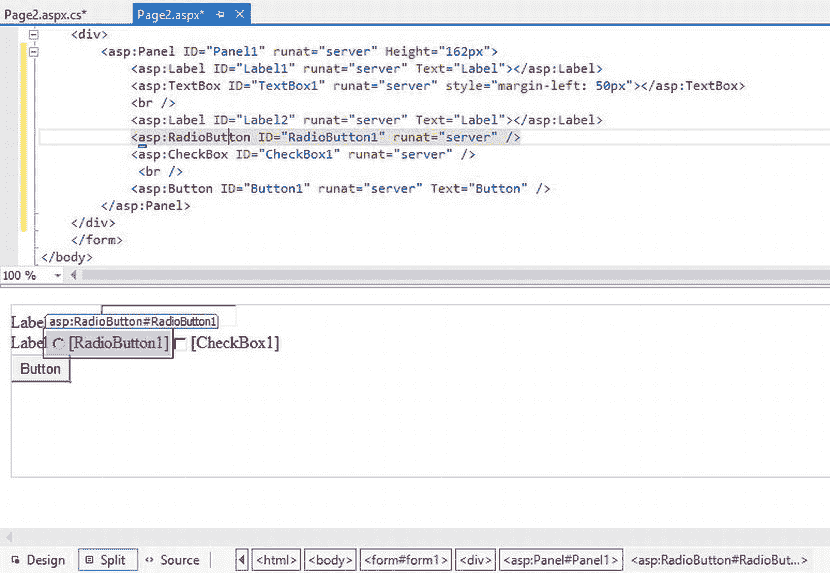

# 十二、开发网络应用

在第 11 章中，你学习了如何使用 C# 和 WPF 构建一个简单的基于 Windows 的图形用户界面(GUI)。尽管 WPF 让程序员能够轻松地构建极其丰富的用户界面，但假设用户会通过传统的基于 Windows 的 PC 访问你的程序并不总是现实的。随着内部网、web 应用和移动设备的激增，应用现在需要允许用户能够通过各种浏览器和设备访问界面。本章向你展示了如何使用 ASP.NET 构建一个基于网络的用户界面。ASP.NET 是一个 web 框架，支持两种构建 web 应用的方法:Web 表单和 ASP.NET MVC 应用(基于模型-视图-控制器模式)。出于刚开始学习 web 编程的目的，我建议使用 Web 表单。Web 表单提供了你在第 11 章中使用过的熟悉的控件和基于事件的编程模型。(关于 Web 表单开发和 MVC 之间区别的讨论，请访问 ASP.NET 官方网站`http://www.asp.net/`)

在本章中，您将执行以下任务:

*   创建网页
*   使用控件
*   响应页面和控件事件
*   保持状态
*   实现数据绑定控件

网页和网络表单

ASP.NET 网页 为你的网络应用提供用户界面。虽然你可以用传统的 HTML 网页建立一个网站，ASP.NET 网页提供了许多优势。它们支持客户端和服务器端应用逻辑的实现。编程模型基于一个熟悉的面向对象的事件驱动范例。ASP.NET 建在山顶上 .NET Framework 并获得它提供的所有好处，如类型安全、托管代码和健壮的类库。ASP.NET 的网页被设计成可以在许多流行的桌面浏览器上运行，比如 Internet Explorer 和 Chrome。当呈现 ASP.NET 网页时，检测请求该页面的浏览器的类型。然后使用正确的 HTML 动态呈现页面，以利用特定于浏览器的功能，如布局、格式和样式。

一个网页由两部分组成:可视化界面和编程逻辑。可视化界面由一个文本文件组成，该文本文件包含 HTML 标记标签、对包含文件的引用、处理指令和客户端脚本块。该文本文件的默认扩展名为。aspx 并被称为页面。页面中包含一个 Web 表单。Web 窗体充当将在浏览器中显示的文本和控件的容器。[图 12-1](#Fig1) 显示了。包含 Web 窗体的 ASP.NET 页的 aspx 文件，该 Web 窗体包含一个 TextBox 控件、一个 Button 控件和一个 Label 控件。当网页被编译时，代码被合并到一个新的类文件中。然后这个文件被编译成一个继承自`System.Web.UI.Page`类的新类。时执行的就是这个类代码。已请求 aspx 页面。图 12-2 显示了在浏览器(Internet Explorer)中呈现的页面。


[图 12-1](#_Fig1) 。中包含的代码。aspx 文件


[图 12-2](#_Fig2) 。在 IE 中呈现的网页

查看页面顶部的 page 指令可以发现编程模型的第二部分，它被称为代码隐藏文件，由. aspx.cs 扩展名表示。代码隐藏文件包含一个分部类文件。代码放在分部类文件中，以处理由页面或页面中包含的控件公开的任何必要事件。下面的类代码包含在链接到。图 12-1 : 中[的 aspx 文件](#Fig1)

```cs
public partial class Page1 : System.Web.UI.Page
{
    protected void Page_Load(object sender, EventArgs e)
    {

    }
}
```

当浏览器请求网页时，页面文件和代码隐藏文件结合在一起，并为。aspx 文件，并编译成一个可执行的页面类文件。正是这个页面类拦截和处理传入的请求。处理完传入的请求后，Page 类动态地创建一个 HTML 响应流并将其发送回浏览器。因为 Page 类是编译代码，所以执行速度比依赖解释脚本的技术快得多。Internet 信息服务(IIS) Web 服务器还能够在内存中缓存执行代码，以进一步提高性能。

Web 服务器控件基础

那个 .NET Framework 提供了一组专门用于在 Web 窗体中承载的 Web 服务器控件。可用的 Web 服务器控件类型包括常见的窗体控件，如 TextBox、Label 和 Button，以及更复杂的控件，如 GridView 和 Calendar。Web 服务器控件从开发人员那里抽象出 HTML 编码。当 Page 类向浏览器发送响应流时，Web 服务器控件使用适当的 HTML 呈现在页面上。发送到浏览器的 HTML 取决于浏览器类型和已进行的控制设置等因素。

下面的代码用于在 Web 窗体中放置一个 TextBox Web 服务器控件:

```cs
<asp:TextBox ID="txtName" runat="server" BorderStyle="Dashed"
    ForeColor="#0000C0"></asp:TextBox>
```

然后，该控件在 Internet Explorer (IE) 10.0 中呈现为以下 HTML 代码:

```cs
<input name="txtName" type="text" id="txtName"
style="color:#0000C0;border-style:Dashed;" />
```

如果 TextBox 控件的`TextMode`属性被设置为`MultiLine`，网页中的代码将被修改以反映该属性设置:

```cs
<asp:TextBox ID="txtName" runat="server" BorderStyle="Dashed" ForeColor="#0000C0"
 TextMode="MultiLine"></asp:TextBox>
```

尽管 Web 服务器控件的代码变化很小，但呈现给浏览器的 HTML 代码却变成了一个完全不同的 HTML 控件:

```cs
<textarea name="txtName" rows="2" cols="20" id="txtName"
style="color:#0000C0;border-style:Dashed;"></textarea>
```

Web 服务器控件提供 .NET 程序员的许多优势，包括熟悉的事件驱动对象模型、带有动态呈现的自动浏览器检测、数据绑定功能和自动控件状态维护，等等。

了解网页和 Web 服务器控件继承的层次结构

包含在网页界面代码的顶部。aspx 文件是下面的页面指令:

```cs
<%@ Page Language="C#" AutoEventWireup="true" CodeBehind="Page2.aspx.cs" Inherits="Chapter12Demo1.Page2" %>
```

这段代码揭示了网页接口代码继承自 Page2.aspx.cs 文件中的`Page2`代码隐藏类。代码隐藏类又继承了系统中的`Page`类。Web.UI 命名空间:

```cs
public partial class Page2 : System.Web.UI.Page
```

`Page`类公开了编写 Web 应用和与 Web 服务器交互所需的重要功能。例如，它支持对应用、会话、响应、请求和服务器对象的访问。Application 对象允许 Web 应用的所有用户共享值。Request 对象允许在 Web 请求期间读取网页发送的值。`Page`类还公开了一些功能，如处理由嵌入在网页中的脚本发起的回发事件、发起页面级验证以及注册服务器控件所需的隐藏字段。

如果您进一步追踪 Web 页面的继承链，您会发现`Page`类继承了`TemplateControl`类的功能。此类添加了对加载用户控件的支持，用户控件是通常为在多个网页中划分和重用用户界面(UI)功能而创建的自定义控件。用户控件是在中创建的。ascx 文件并由网页托管。除了管理插入到网页中的用户控件，`TemplateControl`类还向`Page`类添加了事务支持和错误处理功能。

`TemplateControl`类继承自`Control`类。`Control`类公开了所有服务器控件所需的大部分功能。这个类包括重要的属性，比如`ID`和`Page`属性。属性获取并设置控件的编程标识符，属性获取包含控件的页面对象的引用。`Control`类公开了呈现控件和任何子控件的 HTML 代码的方法。有处理和引发事件的方法，如`Load`、`Unload`和`PreRender`事件。`Control`类还公开了向 Web 服务器控件添加数据绑定支持所需的功能。[图 12-3](#Fig3) 显示了`Page`类在类视图窗口中的层次链。


[图 12-3](#_Fig3) 。页面类的层次链

追踪 Web 服务器控件的层次链——例如，TextBox 控件——发现它们也从`Control`类获得了很多功能。当您将 TextBox 服务器控件放在 Web 表单上时，它会在运行时实例化一个属于`System.Web.UI.WebControls`命名空间的`TextBox`类的对象实例。该类公开文本框所需的属性、方法和事件。例如，它将这些属性定义为`Text`、`ReadOnly`和`Wrap`属性。`TextBox`类还增加了引发和处理`TextChanged`事件的功能。

所有 Web 服务器控件类都继承了`WebControl`类的通用功能。`WebControl`类提供了控制控件在浏览器中呈现时的外观的属性。例如，`ForeColor`、`Backcolor`、`Height`和`Width`属性是在`WebControl`类中定义的。它还定义了控制控件行为的属性，如`Enabled`和`TabIndex`属性。`WebControl`类继承了前面讨论过的`Control`类。[图 12-4](#Fig4) 在类图中显示了一个文本框 Web 服务器控件的层次链。


[图 12-4](#_Fig4) 。文本框控件的层次结构链

使用 Visual Studio 网页设计器

Visual Studio 集成开发环境(IDE)包括一个优秀的网页设计器。使用设计器，您可以将控件从工具箱拖放到网页上，并使用“属性”窗口设置控件属性。图 12-5 显示了 Visual Studio 设计器工具箱中的一些可用控件。


[图 12-5](#_Fig5) 。Visual Studio 网页设计器工具箱

网页设计器在窗口底部包含三个选项卡——设计、拆分和源代码。这些选项卡将窗口中的视图从网页的可视表示(设计)切换到 ASP.NET 和 HTML 标记(源)。拆分视图将设计器和源代码显示为一个拆分窗口。“源”视图显示用于呈现页面的标记代码，并允许您将客户端脚本插入到页面中。图 12-6 显示了在设计器的分割视图中显示的网页。



[图 12-6](#_Fig6) 。拆分视图中的 Visual Studio 网页设计器

网页生命周期

当一个网页被请求时，它会经历一系列的阶段，每个阶段都有明确的目的。例如，在初始化阶段，任何主题都被应用到页面上，并且页面上的任何控件都设置了它们的`UniqueID`属性。在加载阶段，如果页面正在回发(已经呈现过一次，并且正在回发信息)，则控件属性将从存储在隐藏控件(称为视图状态和控件状态)中的信息中加载(视图状态将在本章的后面进行更详细的描述)。回发事件处理阶段是调用控件事件处理程序的地方。为了正确调试网页，了解页面生命周期的各个阶段以及它们发生的时间是很重要的。表 12-1 总结了请求页面时发生的各个阶段。

表 12-1。页面请求的阶段

| **阶段** | **描述** |
| --- | --- |
| 页面请求 | ASP.NET 确定页面是否需要被解析和编译，或者是否可以发送页面的缓存版本。 |
| 开始 | 设置请求和响应等页面属性。页面设置了`IsPostBack`属性。 |
| 初始化 | 页面上的控件可用，并且设置了每个控件的`UniqueID`属性。如果适用，母版页和主题也将应用于页面。 |
| 负荷 | 如果请求是回发，则控件属性将加载从视图状态和控件状态恢复的信息。 |
| 回发事件处理 | 如果请求是回发，则调用控件事件处理程序。之后，调用所有验证器控件的 Validate 方法，该方法设置单个验证器控件和页面的`IsValid`属性。 |
| 翻译 | 在呈现之前，保存页面和所有控件的视图状态。在呈现阶段，页面为每个控件调用`Render`方法。 |
| 倾销 | 响应和请求等页面对象被卸载，并执行清理。 |

当页面在其生命周期中运行时，它会引发各种事件，您可以通过创建运行代码的事件处理程序来响应这些事件。web 页面支持自动事件连接，因此当事件发生时，它会寻找具有标准命名的方法来运行。这些方法是以`Page_event`的形式出现的，所以要为页面加载事件连接一个事件处理程序，您应该将方法命名为`Page_Load`。在页面中的控件被初始化后，在页面请求开始时发生`Page_Load`事件。此事件通常用于从服务器控件读取数据和将数据加载到服务器控件中。查询`IsPostBack`页面属性以确定页面是第一次被查看还是对回发事件的响应。如果是回发，下面的代码使用 page load 事件在页面上写一条消息。

```cs
protected void Page_Load(object sender, EventArgs e)
{
    if (IsPostBack)
    {
        Response.Write("This is a post back.");
    }
}
```

您可以为其他一些常见的页面事件创建事件处理程序，如`Page_Init`、`Page_PreRender`和`Page_Unload`事件。

控制事件

就像 Windows 的图形用户界面(GUI)一样，Web 控件基于事件驱动的模型与用户交互。当客户端发生事件(例如，单击按钮)时，事件信息会在客户端捕获，并通过超文本传输协议(HTTP) post 传输到服务器。在服务器上，事件信息被事件委托对象截获，事件委托对象又通知订阅了调用列表的任何事件处理程序方法。虽然这听起来很复杂 .NET Framework 类抽象并封装了您的大部分流程。

因为通过回发处理事件的开销需要从浏览器到服务器的往返，所以 Web 窗体和服务器控件只公开有限的一组事件。服务器端事件处理程序不支持经常发生的事件，如鼠标移动和按键事件。这些事件通过用脚本编写的客户端事件处理程序来支持。使用服务器端事件处理程序可以响应的一个常见事件是按钮单击事件。

```cs
protected void Button1_Click(object sender, EventArgs e)
{
    Response.Write ("Hello " + this.TextBox1.Text);
}
```

为了将事件绑定到按钮控件，`onClick`属性被添加到按钮的标记代码中。连接起来响应事件的控件也必须有一个对表单容器集唯一的 ID。

```cs
<asp:Button ID="Button1" runat="server" Text="OK" OnClick="Button1_Click"/>
```

按照约定，控件的事件处理程序方法的名称是发出事件的对象的名称，后跟一个下划线字符和事件的名称(类似于页级事件处理)。然而，事件处理程序的实际名称并不重要。

所有事件处理程序都必须提供两个参数，这两个参数将在事件触发时传递给方法。第一个参数是发送方，它表示启动事件的对象。类型为`System.EventArgs`的第二个参数`e`是一个对象，用于传递特定事件的任何特定信息。例如，当单击 DataList 控件中某项的编辑按钮时，就会引发`EditCommand`事件。事件参数 e 用于传递有关 DataList 控件中正在编辑的项的信息。以下代码检查在`DataList`中选择的项目是否被启用:

```cs
protected void DataList1_EditCommand(object source, DataListCommandEventArgs e)
{
    if (e.Item.Enabled)
    {
        //Add code here.
    }
}
```

了解应用和会话事件

伴随着页面和控件事件 .NET Framework 提供了拦截和响应在 Web 会话开始或结束时引发的事件的能力。当用户从应用请求页面时，Web 会话开始，当会话被放弃或超时时，Web 会话结束。除了会话事件之外 .NET Framework 公开了几个应用级事件。第一次有人请求 Web 应用中的页面时，就会发生`Application_Start`事件。`Application_BeginRequest`在请求任何页面或服务时发生。当结束请求、验证用户、引发错误和停止应用时，会触发相应的事件。会话级和应用级事件处理程序位于 Global.asax.cs 代码隐藏文件中。[图 12-7](#Fig7) 显示了代码编辑器中的 Global.asax.cs 文件。


[图 12-7](#_Fig7) 。在代码编辑器中打开 Global.asax.cs 文件

当应用开始时，Global.asax 编译成一个动态生成的类，该类从`HttpApplication`基类派生而来。此类公开并定义 ASP.NET 应用中所有应用对象通用的方法、属性和事件。对`HttpApplication`类的详细解释超出了本书的范围。有关更多信息，请参见帮助文件中的`HttpApplication`对象。

 **注意**global . asax 文件是可选的，必须添加到 web 应用中。

**活动 12-1。使用网页和服务器控件**

在本活动中，您将熟悉以下内容:

*   创建基于 Web 表单的 GUI 应用
*   使用页面和服务器控件事件

**创建网络应用**

要创建 Web 应用，请按照下列步骤操作:

1.  启动 Visual Studio。在“文件”菜单上，选择“新建网站”。
2.  Choose an ASP.NET Empty Web Site. Change the name of the web site at the end of location path Activity12_1\. By default, web sites are stored in a folder under the path `Documents\Visual Studio 2012\WebSites`. [Figure 12-8](#Fig8) shows the New Web Site dialog box for creating a Web Site or Service.

    

    [图 12-8](#_Fig8) 。新建网站对话框

3.  在“新建网站”对话框中单击“确定”按钮。
4.  创建网站后，您需要添加一个 Web 表单。在“网站”菜单下，选择“添加新项目”并添加名为 Page1.aspx 的 Web 表单
5.  您将看到源代码视图中的网页设计器。通过单击窗口左下角的选项卡切换到设计视图。
6.  Select the `<div>` tag at the bottom of the Design window (see [Figure 12-9](#Fig9)).

    

    [图 12-9](#_Fig9) 。选择 div 标签

7.  In the Properties window, select the style property and click on the ellipses to launch the Modify Style dialog window. Under the Position category, set the height to 200 pixels (see [Figure 12-10](#Fig10)) and click the OK button

    

    [图 12-10](#_Fig10) 。设置 div 高度

8.  将页面设计窗口切换到拆分模式。从工具箱中拖动一个 Label 控件，并将其放在源代码窗格中的 div 标记之间。将文本更改为“Hello Stranger…”并将 ID 更改为 lblMessage。
9.  You may get a message asking you to synchronize the design view and the source view. After synchronizing the views, your designer should look similar to [Figure 12-11](#Fig11).

    

    [图 12-11](#_Fig11) 。添加标签控件

10.  In a similar process to step 9, add the controls in [Table 12-2](#Tab2) between the div tags. Don’t worry about the positioning on the form yet.

    表 12-2。Web 控件属性

    | **控制** | **属性** | **值** |
    | --- | --- | --- |
    | 标签 | `ID` | `lblName` |
    |  | `Text` | `Enter your name:` |
    | 文本框 | `ID` | `txtName` |
    |  | `Text` | `[Blank]` |
    | 纽扣 | `ID` | `btnSubmit` |
    |  | `Text` | `Submit` |

11.  To position a control, select the control in the designer and in the format menu, select Set Position and check Absolute (see [Figure 12-12](#Fig12)).

    

    [图 12-12](#_Fig12) 。打开绝对定位

12.  Turn on absolute positioning for the rest of the controls. You should now be able to drag them around in the visual designer to position them. Arrange the controls on the form so they look similar to [Figure 12-13](#Fig13).

    

    [图 12-13](#_Fig13) 。定位控件

创建服务器端控件事件处理程序

要创建服务器端控件事件处理程序，请遵循以下步骤:

1.  在设计窗格中，双击提交按钮。此操作将打开 Page1.aspx.cs 代码隐藏页，并为按钮的 click 事件创建一个事件处理程序方法。
2.  In the button’s click event handler, check to see if the page request is the result of a postback. If it is, change the lblMessage text to say hello using the text contained in the txtName control:

    ```cs
    protected void btnSubmit_Click(object sender, EventArgs e)
    {
        if (IsPostBack)
        {
            lblMessage.Text = "Hello " + txtName.Text;
        }
    }
    ```

3.  Using the Debug menu, launch the page in debug mode. The first time you launch the debugger for a web project, you will see a dialog box asking if you want to enable debugging in the Web.config file. Click the OK button to enable debugging. When the page displays in the browser, enter your name and click the Submit button. Verify that the page redisplays with your name included in the Hello… message. After testing, close the browser.

    **创建非回发服务器控件事件**

    要创建非回发服务器控件事件，请执行以下步骤:

4.  使用页面设计器，将 RadioButtonList 控件添加到 Page1。将其位置更改为 absolute，并将其放在 textbox 下方。
5.  Change the `ID` property to `rblFontColor`. Click the Items collection in the Properties window to display the ListItem Collection Editor dialog box. Add a Black item and a Red item to the list (see [Figure 12-14](#Fig14)).

    

    [图 12-14](#_Fig14) 。添加列表项

6.  In the Properties window for the `rblFontColor`, click the events button to display the event list (see [Figure 12-15](#Fig15)).

    

    [图 12-15](#_Fig15) 。选择控制事件

7.  双击`SelectedIndexChanged`事件。这将带您进入代码隐藏页，并设置处理事件的方法。添加以下代码以更改事件处理程序中 lblMessage 控件的字体颜色:

    ```cs
    protected void rblFontColor_SelectedIndexChanged(object sender, EventArgs e)
    {
        if (rblFontColor.SelectedItem.Value == "Red")
        {
            lblMessage.ForeColor = System.Drawing.Color.Red;
        }
        else
        {
            lblMessage.ForeColor = System.Drawing.Color.Black;
        }
    }
    ```

8.  使用“调试”菜单，在调试模式下启动页面。当页面显示在浏览器中时，单击红色单选按钮。请注意，事件不会导致回发发生。此事件将一直排队，直到 AutoPostBack 事件触发回发。
9.  在 txtName 控件中输入您的姓名，然后单击 Submit 按钮。处理回发时，会处理`rblFontColor`的 SelectedIndexChanged 事件和提交按钮的 Click 事件。
10.  测试后，关闭浏览器并退出 Visual Studio。

 **注意**本节只探讨了服务器端事件处理。如果浏览器支持客户端脚本和动态 HTML，您可以将 JavaScript 代码添加到。aspx 页来利用客户端处理功能。

在 Web 应用中存储和共享状态

Web 应用使用无状态协议(HTTP)在浏览器和服务器之间进行通信。然而，在许多 Web 应用中，在用户会话期间需要存在某种状态维护。传统上，有效地维护状态对 Web 程序员来说是一个挑战。为了帮助减轻状态管理的挑战 .NET Framework 提供了几个选项来管理客户端和服务器端的状态。

维护视图状态

Web 应用中需要进行的一种状态管理是在表单回发到客户端时保留控件属性值。因为网页在每次被请求时都会被重新创建和销毁，所以当页面被回发时，客户端对控件所做的任何更改都会丢失。例如，在文本框控件中输入的任何信息在回发时都会丢失。为了克服这种状态丢失，服务器控件有一个`ViewState`属性，它提供了一个字典对象，用于在回发之间保留控件的值。处理页面时，页面和控件的当前状态被散列到一个字符串中，并保存为页面上的隐藏字段。在回发期间，当初始化控件以将页面呈现回浏览器时，将检索并还原这些值。下面的代码显示了呈现给浏览器的视图状态隐藏控件:

```cs
<input type="hidden " name="__VIEWSTATE"
value="dDw1Njg2NjE2ODY7O2w8XN0MTowOz4+upC3lZ6nNLX/ShtpGHJAmi8mpH4=" />
```

使用查询字符串

虽然视图状态用于存储向同一页面回发之间的信息，但您通常需要将信息从一个页面传递到另一个页面。实现这一点的一种流行方法是使用查询字符串。查询字符串被附加到页面请求 URL 例如，下面的 URL 将一个 ID 字段传递给页面，该页面可用于在数据库中查找值。

```cs
http://LocalHost/LookUpAuthorInfo.aspx?AuthorId=30
```

通过用&符号分隔键值对，可以传递多个查询字符串值。

```cs
http://LocalHost/LookUpAuthorInfo.aspx?AuthorId=30&BookTitleId=355
```

要从查询字符串中检索值，可以使用`Request`对象的`QueryString`属性。

```cs
int ID = int.Parse(Request.QueryString["AuthorId"]);
```

 **注意**使用查询字符串的一个缺点是，它们在浏览器中很容易看到，用户可以很容易地更改值。不要使用查询字符串传递敏感数据。

使用 Cookies

您可以使用 cookies 在位于客户端设备上的文本文件中存储少量数据。`HttpResponse`类的`Cookie`属性提供了对`Cookies`集合的访问。`Cookies`集合包含客户端在`Cookies`头中传输给服务器的 cookies。该集合包含最初在服务器上生成的 Cookie，并在 Set-Cookie 标头中传输到客户端。因为浏览器只能将 cookie 数据发送到最初创建 cookie 的服务器，并且 cookie 信息在发送到浏览器之前可以被加密，所以这是一种相当安全的维护用户数据的方式。cookies 的一个常见用途是向客户端发送用户身份令牌，下次用户访问网站时可以检索到该令牌。然后使用这个令牌从数据库中检索特定于客户端的信息。使用 cookies 是在访问站点之间维护客户端状态的好方法。在下面的代码中，创建了一个`Cookie`对象来保存用户访问的日期和时间。这个`Cookie`对象随后被添加到`Cookies`集合中，并发送给浏览器:

```cs
HttpCookie visitDate = new HttpCookie("visitDate");
DateTime now = DateTime.Now;
visitDate.Value = now.ToString();
visitDate.Expires = now.AddHours(1);
Response.Cookies.Add(visitDate);
```

要读取 cookie，可以使用`Request`对象。下面的代码读取 cookies 值并将其加载到 Textbox 控件中。

```cs
if (Request.Cookies["visitDate"] != null)
{
    txtLastVisit.Text = Request.Cookies["visitDate"].Value;
}
```

维护会话和应用状态

Web 应用中经常需要的另一种状态管理是会话状态。会话状态是在用户请求 Web 应用中的各种页面时维护与用户相关的信息的能力。会话状态在服务器上维护，并由`HttpSessionState`类的对象实例提供。此类提供对 Web 应用的会话状态值和会话级设置的访问。会话状态值存储在只能由当前浏览器会话访问的键值字典结构中。下面的代码检查`Session`对象，查看当前用户的电话号码是否存储在会话键值对中。`Session`对象公开了`HttpSessionState`类的一个对象实例:

```cs
if (Session["phone"]==null)
{
    txtphone.Visible = true;
}
```

默认情况下，会话状态存储在 web 服务器的内存中。有时，您希望会话状态更持久，并在服务器重新启动时保持值不变。在这些情况下，可以将会话值存储在 SQL Server 数据库或 ASP.NET 会话状态服务器中。

尽管会话状态的范围是基于每个会话的，但有时 Web 应用需要在应用中的所有会话之间共享一个状态。您可以使用`HttpApplicationState`类的对象实例来实现这种全局范围的状态。应用状态存储在类似于会话状态的键-值字典结构中，只是它可用于应用中的所有会话和所有表单。客户机第一次从 Web 应用请求任何 URL 资源时，会创建一个`HttpApplicationState`类的实例。这个实例通过固有的`Application`对象公开。以下代码使用`Application`对象来存储`SqlConnection`对象的连接字符串属性:

```cs
string pubsConnectionString;
pubsConnectionString = "Integrated Security=SSPI;Initial Catalog=pubs;" +
    "Data Source=localhost";
Application["PubsConnectionString"] = pubsConnectionString;
```

 **注意**应用状态也可以使用`System.Web.Caching`名称空间中的 cache 类存储在缓存中。

**活动 12-2。维护 WEB 应用中的状态**

在本活动中，您将熟悉以下内容:

*   如何在 web 窗体中维护视图状态
*   如何使用 cookies 存储和检索数据
*   会话和应用状态之间的区别

**维护视图状态**

要调查视图状态，请按照下列步骤操作:

1.  启动 Visual Studio。在“文件”菜单上，选择“新建网站”。
2.  选择一个 ASP.NET 空网站。在位置路径练习 12_2 的末尾，更改网站的名称。
3.  After the Web Site is created, add a Web Form named Page1.aspx. On the Web form add a Textbox control and a Button control using the following mark up.

    `<form id="form1" runat="server">`

    `<div>`

    `<asp:TextBox ID="TextBox1" runat="server"></asp:TextBox>`

    `<asp:Button ID="Button1" runat="server" Text="Button" />`

    `</div>`

    `</form>`

4.  Launch the page using the debugger. After the page loads, right-click on it and chose View source. You should see the mark up for a hidden control used to store the view state.

    `<div class="aspNetHidden">`

    `<input type="hidden" name="__VIEWSTATE" id="__VIEWSTATE" value="s8jATaLWaO0KhQ+roBl8XjQi6d2d0KSSbBx8tZAvxtIM8ih2HwPQotse+N13fzpd3g+w7fbor7Hi2uGUuJ5+H+IomzQJHTf50lldSWwLD3s=" />`

    `</div>`

5.  Stop the debugger and add a click event handler to the button.

    `<asp:Button ID="Button1" runat="server" Text="Button" OnClick="Button1_Click"/>`

6.  In the code behind class (Page1.aspx.cs) add the method to handle the button click event. In this event you will save and retrieve a value from the view state that records how many times the button is clicked.

    `protected void Button1_Click(object sender, EventArgs e)`

    `{`

    `int count;`

    `if (IsPostBack)`

    `{`

    `if (ViewState["count"] != null)`

    `{`

    `count = (int)ViewState["count"];`

    `count += 1;`

    `ViewState["count"] = count;`

    `}`

    `else`

    `{`

    `count = 1;`

    `ViewState.Add("count", count);`

    `}`

    `}`

    `Response.Write(ViewState["count"]);`

    `}`

7.  使用调试器启动页面。点击按钮；您应该会在页面顶部看到一个计数器，每次点击都会增加。测试完成后，停止调试器。

**读写 cookie**

要使用 cookies 进行调查，请遵循以下步骤:

1.  将第二个 Web 表单添加到名为 Page2 的项目中。
2.  On Page1 add a second button and add the following code to the button’s click event handler. This code saves the textbox text to a cookie. It then transfers execution to Page2.

    `protected void Button2_Click(object sender, EventArgs e)`

    `{`

    `HttpCookie visitor = new HttpCookie("visitor");`

    `visitor.Expires = DateTime.Now.AddDays(1);`

    `visitor.Value =TextBox1.Text;`

    `Response.Cookies.Add(visitor);`

    `Server.Transfer("Page2.aspx");`

    `}`

3.  In Page2’s `Page_Load` method, retrieve the value of the cookie using the `Request` object and write it out to the page using the `Response` object.

    `protected void Page_Load(object sender, EventArgs e)`

    `{`

    `if (Request.Cookies["visitor"] != null)`

    `{`

    `Response.Write("Hello " + Request.Cookies["visitor"].Value);`

    `}`

    `}`

4.  使用调试器启动第 1 页。在文本框中键入您的姓名，然后单击第二个按钮；您应该看到第 2 页显示了 hello 消息。测试完成后，停止调试器。

**会话和应用状态**

要调查会话和应用状态，请完成以下步骤:

1.  使用“添加新项”对话框，添加名为 Global.asax 的全局应用类。
2.  In the Global.asax code page add the following code to the `Session_Start` event handler.

    `void Session_Start(object sender, EventArgs e)`

    `{`

    `Session["SessionStartTime"] = DateTime.Now;`

    `}`

3.  将第三个 Web 表单添加到名为 Page3 的项目中。
4.  In the `Form_Load` event handler for Page3 add the following code to display the session start time.

    `protected void Page_Load(object sender, EventArgs e)`

    `{`

    `Response.Write(Session["SessionStartTime"]);`

    `}`

5.  在“解决方案资源管理器”窗口中，右击 Page3.aspx 并选择“在浏览器中查看”。您应该会看到显示的会话开始时间。
6.  大约 30 秒后刷新页面。时间不应该改变，因为您在同一个会话中。
7.  启动浏览器的一个新实例，并将第 3 页的网址从第一个浏览器窗口复制到第二个浏览器。您应该看到第 3 页显示了新的时间，因为这是一个新的会话。测试完成后，关闭浏览器。
8.  In the Global.asax code page add the following code to the `Application_Start` event handler.

    `void Application_Start(object sender, EventArgs e)`

    `{`

    `Application["ApplicationStartTime"] = DateTime.Now;`

    `}`

9.  In the `Form_Load` event handler for Page3 add the following code to display the application start time.

    `protected void Page_Load(object sender, EventArgs e)`

    `{`

    `Response.Write(Session["SessionStartTime"]);`

    `Response.Write("<br/>");`

    `Response.Write(Application["ApplicationStartTime"]);`

    `}`

10.  在“解决方案资源管理器”窗口中，右击 Page3.aspx 并选择“在浏览器中查看”。您应该会看到显示的会话和应用启动时间。
11.  启动浏览器的一个新实例，并将第 3 页的网址从第一个浏览器窗口复制到第二个浏览器。您应该看到第 3 页显示了不同的会话开始时间，但应用开始时间相同，因为这是一个新会话，但应用开始时间相同。测试完成后，关闭浏览器并退出 Visual Studio。

数据绑定 Web 控件

正如传统的基于 Windows 的 GUI 一样，使用基于 Web 的 GUI 开发的程序经常需要与数据进行交互。业务应用的用户需要查看、查询和更新后端数据存储中的数据。幸运的是 .NET Framework 通过公开在 Web 窗体中实现数据绑定控件所需的功能，使这一点变得很容易。

数据绑定控件使在 web 表单中显示数据的过程自动化。ASP.NET 提供了各种控件来显示数据，具体取决于数据的类型、显示方式以及是否可以更新。其中一些控件用于显示只读数据，例如，Repeater 控件显示只读数据的列表。如果需要更新列表中的数据，可以使用 ListView 控件。如果需要以表格格式显示许多列和行的数据，可以使用 GridView 控件。如果需要一次显示一条记录，可以使用 DetailsView 或 FormView 控件。

数据绑定自动化了从数据存储区和数据绑定控件传输数据的过程。为了绑定控件，需要向网页添加一个 DataSource 控件。DataSource 控件不呈现 UI 标记。相反，它们负责提供数据源和数据绑定控件之间的链接。根据数据源的不同，有几种类型的数据源控件可用。[表 12-3](#Tab3) 列出了提供的数据源类型 .NET 框架。

在下面的标记中，SqlDataSource 控件用于向 Repeater 控件提供数据，Repeater 控件为每个名称重复一个 label 控件。注意数据绑定表达式`Eval`和`Bind`的使用。`Eval`用于单向绑定(只读)`Bind`用于双向绑定(读取和更新)

[表 12-3](#_Tab3) 。提供的数据源 .NET 框架

| **数据源** | **使用** |
| --- | --- |
| 设计器 | 使您能够绑定到基于实体数据模型的数据。 |
| 控件 | 使您能够使用 Microsoft SQL Server、OleDb、ODBC 或 Oracle 数据库 |
| 对象数据源 | 使您能够使用业务对象或其他类 |
| 数据源控件 | 使您能够使用语言集成查询 |
| 数据源控件 | 使您能够使用 XML 文件。 |
| 站点地图 | 用于 ASP.NET 网站导航。 |

```cs
<asp:SqlDataSource ID="SqlDataSource1" runat="server"
            ConnectionString="<%$ ConnectionStrings:pubsConnectionString %>"
            SelectCommand="SELECT [au_id], [au_lname] FROM [authors]">
</asp:SqlDataSource>

<asp:Repeater ID="Repeater1" runat="server" DataSourceID="SqlDataSource1">
    <ItemTemplate>
        <asp:Label ID="lblName" runat="server" Text='<%# Eval("au_lname") %>'></asp:Label>
        <br />
    </ItemTemplate>
</asp:Repeater>
```

数据源控件便于快速应用开发。它们允许您在编写最少代码的同时创建支持 CRUD(创建读取更新删除)操作的网页。

模型绑定

虽然 DataSource 控件对于简单的 CRUD 操作和简单的应用来说工作得很好，但是随着应用逻辑和数据访问逻辑变得越来越复杂，使用起来就变得不灵活和麻烦了。它们将数据检索逻辑与表示逻辑混合在一起，这违反了将数据访问逻辑、业务逻辑和表示逻辑分成不同层的 n 层开发原则。为了克服这些限制，ASP.NET 包含了 Web 表单模型绑定。

模型绑定是一种更注重代码的数据访问逻辑，用于数据绑定控件。使用模型绑定，您可以使用`ItemType`属性声明绑定控件的数据类型。当设置控件的`ItemType`属性时，`Item`和`BindItem`表达式用于将控件绑定到数据源项。`Item`表达式实现单向绑定(只读)，而`BindItem`表达式用于双向绑定(读取和更新)。下面的代码显示了如何使用一个 repeater 控件来承载一个 label 控件，并将其`Text`属性绑定到`Employee.Name`属性。注意，Repeater 控件的`ItemType`属性被设置为`Employee`类。

```cs
<asp:Repeater ID="Repeater1" runat="server"
            ItemType="Chapter12Demo1.Employee" SelectMethod="GetEmployee">
    <ItemTemplate>
        <asp:Label ID="Label1" runat="server" Text='<%# Item.Name %>'></asp:Label>
        <br />
    </ItemTemplate>
</asp:Repeater>
```

要将数据控件配置为使用模型绑定来选择数据，可以将控件的`SelectMethod`属性设置为页面代码中方法的名称。在上面的例子中，`SelectMethod`被设置为返回一列`Employee`对象的`GetEmployee`方法。数据控件在页面生命周期的适当时间调用该方法，并自动绑定返回的数据。

要实现双向绑定，需要包含一个方法来更新数据，并将其设置为等于控件的`UpdateMethod`属性。模型绑定会将更新后的值发送到 update 方法，在该方法中，值被更新回数据源。下面的代码定义了一个使用模型绑定来更新雇员的 GridView。注意使用了`BindItem`和`UpdateMethod`来实现双向绑定。

```cs
<asp:GridView ID="employeesGrid" runat="server" DataKeyNames="ID"
      ItemType="Chapter12Demo1.Employee" AutoGenerateColumns="false" AutoGenerateEditButton="true"
      SelectMethod="GetEmployees" UpdateMethod="UpdateEmployee">
    <Columns>
        <asp:TemplateField>
            <ItemTemplate>
                <asp:Label ID="lblID" runat="server" Text='<%# Item.ID %>'></asp:Label>
            </ItemTemplate>
        </asp:TemplateField>
        <asp:TemplateField>
            <ItemTemplate>
                <asp:Label ID="lblName" runat="server" Text='<%# BindItem.Name %>'></asp:Label>
            </ItemTemplate>
            <EditItemTemplate>
                <asp:TextBox ID="txtName" runat="server" Text='<%# BindItem.Name %>'></asp:TextBox>
            </EditItemTemplate>
        </asp:TemplateField>
    </Columns>
</asp:GridView>
```

 **注意**针对 ASP.NET 4.5 的新开发，微软推荐使用模型绑定。对于面向以前版本的应用，建议使用数据源控件。

**活动 12-3。绑定 GRIDVIEW 控件**

在本活动中，您将熟悉以下内容:

*   如何使用 DataSource 控件实现到 Repeater 控件的单向绑定
*   如何使用模型绑定实现 GridView 控件的双向绑定

**在 ASP.NET 中继器控件中显示数据**

要在 ASP.NET 中继器控件中显示数据，遵循以下步骤:

1.  启动 Visual Studio。在文件菜单上，选择新建网站。
2.  选择一个 ASP.NET 空网站。在位置路径练习 12_3 的末尾，更改网站的名称。
3.  向站点添加一个新的 Web 表单，并将其命名为 AuthorListPage。
4.  Open the AuthorListPage in Split view. Drag a SqlDataSource control located under the Data node to the form. You should see a SqlDataSource Tasks pane as in [figure 12-16](#Fig16).

    

    [图 12-16](#_Fig16) 。“SqlDataSource”任务窗格

5.  单击配置数据源链接。这将启动一个向导来帮助配置 DataSource 控件。
6.  Create a new connection to your SQL Server using the .NET Framework Data Provider for SQL Server (see [Figure 12-17](#Fig17)).

    

    [图 12-17](#_Fig17) 。选择 SQL Server 数据源

7.  在添加连接对话框中，输入您的服务器名并选择 Pubs 数据库。测试连接，然后单击 OK 按钮。
8.  在下一个屏幕中，选中 yes 将连接字符串保存在配置文件中。
9.  In the Configure the Select Statement screen select the au_id and au_lname columns from the authors table as in [Figure 12-18](#Fig18).

    

    [图 12-18](#_Fig18) 。配置 Select 语句

10.  在下一个屏幕中，您可以测试查询。测试完查询后，单击 Finish 按钮。
11.  In the page source you should see the mark up added to the page to set up the SqlDataSource control.

    < ASP:sqldata source ID = " sqldata source 1 " runat = " server "

    ConnectionString=" "

    SelectCommand="SELECT [au_id]，[au_lname] FROM [authors]" >

12.  在 AuthorListPage 的设计视图中，将 Repeater 控件从工具箱中的数据节点拖到窗体上。将其放在 SqlDataSource 控件之后。
13.  在 Repeater Tasks 弹出窗口中，选择 SQLDataSource1 控件。
14.  Switch to the Source window and add the `ItemTemplate` mark up and the `asp:Label` mark up inside the Repeater control mark up. Notice the `Text` property of the label is bound to the au_lname column using the `Eval` method.

    `<asp:Repeater ID="Repeater1" runat="server" DataSourceID="SqlDataSource1">`

    `<ItemTemplate>`

    `<asp:Label ID="lblName" runat="server" Text='<%# Eval("au_lname") %>'>        </asp:Label>`

    `<br />`

    `</ItemTemplate>`

    `</asp:Repeater>`

15.  在解决方案资源管理器窗口中右击 AutherListPage.aspx 节点，并选择“设为起始页”。启动调试器。您应该会看到显示有作者姓氏列表的页面。
16.  完成测试后，停止调试器。

**使用 ASP.NET GridView 控件显示数据**

要使用 ASP.NET GridView 控件显示和更新数据，请遵循以下步骤:

1.  在 Solution Explore 窗口中，右键单击项目节点并选择 Add  Add New Item。添加一个 ADO.NET 实体数据模型，并将其命名为 Pubs.edmx。您将收到一条关于将其添加到 App_Code 文件夹的消息。选择是。
2.  在实体数据模型向导中，选择从数据库生成。
3.  在 Chose Your Data Connection 中，您可以重用之前创建的连接，也可以创建一个到 Pubs 数据库的新连接。确保在 Web 中保存实体连接设置。Config，并将其命名为 pubsEntities。
4.  In the Choose Your Database Objects and Settings window, select the employee table. Leave the default check boxes checked and name the model pubsModel (see [Figure 12-19](#Fig19)).

    

    [图 12-19](#_Fig19) 。选择数据对象

5.  完成向导后，您应该在实体设计器中看到 employee 实体。关闭实体设计器，并向设计器添加一个新的 Web 窗体。将页面命名为 EmployeeGridViewPage.aspx。
6.  Add a GridView control to the form and add the mark up below. Notice you are setting the `ItemType t`o the `employee` entity and the `SelectMethod` to `GetEmployees`.

    `<asp:GridView ID="grdEmployee" runat="server"`

    `ItemType="employee" SelectMethod="GetEmployees"`

    `AutoGenerateColumns="false">`

    `<Columns>`

    `<asp:BoundField DataField="emp_id" HeaderText="ID" ReadOnly="true" />`

    `<asp:BoundField DataField="fname" HeaderText="First Name" />`

    `<asp:BoundField DataField="lname" HeaderText="Last Name" />`

    `</Columns>`

    `</asp:GridView>`

7.  In the code behind file for the page (EmployeeGridViewPage.aspx.cs) add the following code to retrieve the employee data using the `employee` entity.

    `public partial class EmployeeGridViewPage : System.Web.UI.Page`

    `{`

    `pubsEntities dbContext = new pubsEntities();`

    `protected void Page_Load(object sender, EventArgs e)`

    `{`

    `}`

    `public IQueryable<employee> GetEmployees()`

    `{`

    `var Employees = dbContext.employees;`

    `return Employees;`

    `}`

    `}`

8.  在解决方案资源管理器窗口中右击 EmployeesGridViewPage.aspx 节点，并选择“设为起始页”。启动调试器。您应该会看到显示有员工信息表的页面。
9.  完成测试后，停止调试器。

**使用 ASP.NET GridView 控件更新数据**

1.  Update the GridView control’s mark up to allow updating and set the `UpdateMethod` attribute to the `UpdateEmployee` method. The `DataKeyNames` attribute is set to the unique identifier of the employee entity.

    `<asp:GridView ID="grdEmployee" runat="server"`

    `ModelType="employee" SelectMethod="GetEmployees" DataKeyNames="emp_id"`

    `AutoGenerateEditButton="true" UpdateMethod="UpdateEmployee"`

    `AutoGenerateColumns="false">`

    `<Columns>`

    `<asp:BoundField DataField="emp_id" HeaderText="ID" ReadOnly="true" />`

    `<asp:BoundField DataField="fname" HeaderText="First Name" />`

    `<asp:BoundField DataField="lname" HeaderText="Last Name" />`

    `</Columns>`

    `</asp:GridView>`

2.  In the code behind file for the page (EmployeeGridViewPage.aspx.cs) add the following code to update the employee data using the employee entity. This code looks up the old values held in the entity and tries to update the model. If it is successful it saves the changes back to the database.

    `public void UpdateEmployee(employee Employee)`

    `{`

    `var Employee2 = dbContext.employees.Find(Employee.emp_id);`

    `TryUpdateModel(Employee2);`

    `if (ModelState.IsValid)`

    `{`

    `dbContext.SaveChanges();`

    `}`

    `}`

3.  By default Web Forms have `UnobtrusiveValidationMode` turned on. To implement this you need to add a ScriptManager and some jScript `include` files. For now you can just turn it off by adding the following to the `Page_Load` event handler method.

    `this.UnobtrusiveValidationMode = System.Web.UI.UnobtrusiveValidationMode.None;`

4.  启动调试器。您应该看到显示了一个雇员信息表和一个编辑按钮的页面。单击某行的编辑按钮。这会将网格设置为编辑模式。
5.  更新名字，然后单击“更新”按钮。网格将刷新并显示新值。

摘要

在这一章中，你学习了如何使用基于 Web 表单的前端来实现应用的界面层。在这个过程中，您仔细研究了 .NET 框架，用于实现基于 Web 窗体的用户界面。您还接触了数据绑定 Web 服务器控件，尤其是 GridView 控件。我在这一章的目的是向你展示一些用于开发以数据为中心的 web 应用的技术。要成为一名熟练的 web 开发人员，您需要深入研究这些主题和其他主题，如使用母版页、客户端脚本、使用样式表和 web 安全性。

在第 13 章中，你将看到 Windows 8 引入的一种新型应用 Windows Store 应用。Windows 应用商店应用是传统客户端应用和网络应用的混合体。界面使用 HTML 或 XAML 开发，应用逻辑可以用 C#、Visual Basic 或 JavaScript 开发。它们支持越来越流行的触摸屏设备，代表着用户与应用交互方式的转变。