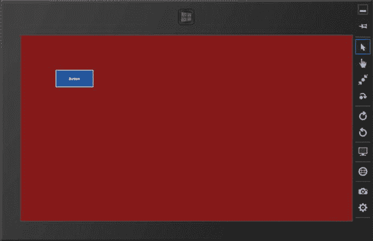
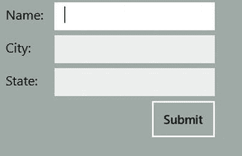
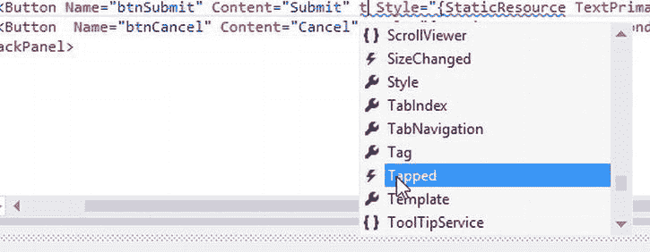
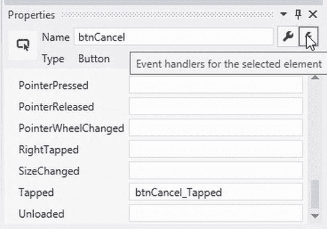
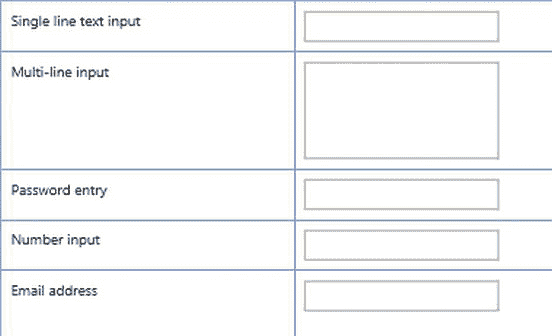
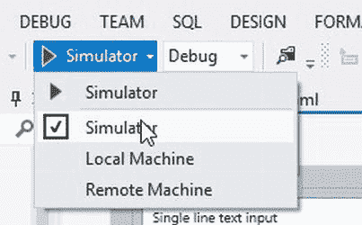
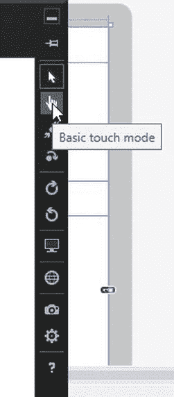
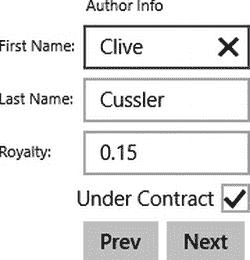
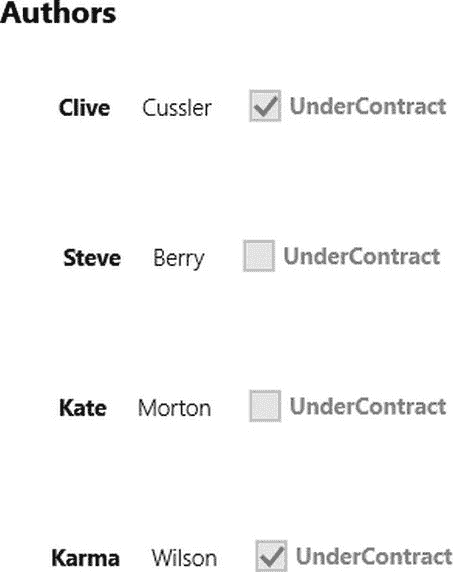
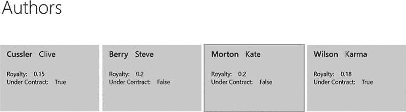

# 十三、开发 Windows 应用商店应用

在前面的章节中，您学习了如何基于传统的 Windows 客户端(ASP.NET)用户界面和基于 web 的用户界面构建一个以数据为中心的应用。在本章中，您将了解如何使用新的 Windows 应用商店应用构建用户界面。Windows 应用商店应用旨在 Windows 8 设备上运行。Windows 应用商店应用拥有全新的外观，旨在动态支持不同的显示尺寸和设备。随着平板电脑和手机日益成为最受欢迎的信息交互设备，企业用户要求能够使用这些设备与他们的信息存储进行交互。幸运的是，微软提供了各种应用编程接口(API)，可以用来创建在这些设备上运行的应用。他们暴露了一个被管理的 .NET 框架，它允许你使用 C# 来编写代码，使用 XAML 框架来开发用户界面。开发这些应用是开发 WPF 应用和 web 应用的结合。

阅读完本章后，您将能够轻松执行以下任务:

*   使用 XAML 标记设计用户界面
*   使用布局控件
*   使用显示控件
*   响应控制事件
*   使用数据绑定控件

构建用户界面

构建 Windows 应用商店应用的用户界面与开发 WPF 应用非常相似。如果你还记得《T4》第 11 章，应用的视觉界面包含了对象。与面向对象语言中的大多数对象一样，这些对象公开属性、方法和事件。在 Windows 应用商店应用中，主要对象是页面。一个页面有属性(例如`Background`属性)、方法(例如`focus`方法)和事件(例如`DoubleTapped`事件)。

控件是具有可视化界面的组件，为用户提供了与程序交互的方式。页面是一个容器控件，它承载其他控件。您可以在页面上放置许多不同类型的控件。页面上使用的一些常见控件有文本框、文本块、按钮、列表视图和 GridViews。

就像 WPF 一样，Windows 应用商店用户界面是使用声明性标记语言 XAML 构建的。例如，下面的标记定义了一个`Grid`中的按钮控件。

```cs
<Grid Background="#E5951D1D">
     <Button Content="Button" HorizontalAlignment="Left" Margin="56,124,0,0"
             VerticalAlignment="Top" Background="#FF2457A0"/>

</Grid>
```

注意`Grid`需要一个正式的结束标记，因为它包含了`Button`控件。由于`Button`控件不包含任何其他控件，您可以在结束括号前使用正斜杠(`/`)来关闭它。请注意，控件的属性是使用属性语法设置的。

使用网格行和列来绝对或相对定位控件。注意上面的代码使用了按钮在网格中的绝对位置，这是通过使用`Margin`属性实现的。下面的代码显示了使用网格行和列相对定位的按钮。

```cs
<Grid Background="#E5951D1D">
        <Grid.RowDefinitions>
            <RowDefinition Height="140"/>
            <RowDefinition Height="*"/>
        </Grid.RowDefinitions>

        <Grid.ColumnDefinitions>
            <ColumnDefinition Width ="140"/>
            <ColumnDefinition Width="*"/>
        </Grid.ColumnDefinitions>

        <Button Content="Button" HorizontalAlignment="Left"
                Grid.Column="1" Grid.Row="1"
                VerticalAlignment="Top" Background="#FF2457A0"
                Height="78" Width="162"/>
    </Grid>
```

[图 13-1](#Fig1) 显示了带有由之前的 XAML 代码创建的按钮的页面。



[图 13-1](#_Fig1) 。用 XAML 创造的窗户

如前所述，Grid 控件包含列和行来控制其子控件的位置。列和行的高度和宽度可以设置为固定值、auto 或*。自动设置占用所包含控件所需的空间。*设置占用尽可能多的可用空间。下面的代码展示了一个用于收集用户信息的简单数据输入表单。生成的表格如图 13-2 中的[所示。](#Fig2)

```cs
<Grid Background="#E5B1BDB9">

            <Grid.RowDefinitions>
                <RowDefinition Height="Auto" />
                <RowDefinition Height="Auto" />
                <RowDefinition Height="Auto" />
                <RowDefinition Height="Auto" />
         <RowDefinition Height="Auto" />
                <RowDefinition Height="*" />
            </Grid.RowDefinitions>
            <Grid.ColumnDefinitions>
                <ColumnDefinition Width="Auto" />
                <ColumnDefinition Width="200" />
                <ColumnDefinition Width="*" />
            </Grid.ColumnDefinitions>
            <TextBlock Grid.Row="0" Grid.Column="0" Text="Name:"
                   Foreground="Black" VerticalAlignment="Center"
                   Margin="10" FontSize="16"/>
            <TextBlock Grid.Row="1" Grid.Column="0" Text="City:"
                   Foreground="Black" VerticalAlignment="Center"
                   Margin="10" FontSize="16"/>
            <TextBlock Grid.Row="2" Grid.Column="0" Text="State:"
                   Foreground="Black" VerticalAlignment="Center"
                   Margin="10" FontSize="16" />

            <TextBox Grid.Column="1" Grid.Row="0" Margin="3" />
            <TextBox Grid.Column="1" Grid.Row="1" Margin="3" />
            <TextBox Grid.Column="1" Grid.Row="2" Margin="3" />
            <Button Grid.Column="1" Grid.Row="4" HorizontalAlignment="Right"
                    MinWidth="80" MinHeight="50" Margin="0,0,0,8" Content="Submit"
                    Foreground="Black"/>
    </Grid>
```



[图 13-2](#_Fig2) 。输入表单页面

其他可用的布局控件有`StackPanel`、`WrapGrid`和`Canvas`。下面的代码显示了`StackPanel`控件中的两个按钮:

```cs
<StackPanel Grid.Column="1" Grid.Row="4" Orientation="Horizontal" HorizontalAlignment="right">
        <Button MinWidth="80" MinHeight="50" Margin="0,0,0,8" Content="Submit"
                Foreground="Black"/>
        <Button MinWidth="80" MinHeight="50" Margin="0,0,0,8" Content="Cancel"
                Foreground="Black"/>
</StackPanel>
```

使用样式表

开发 Windows 应用商店应用的一个重要方面是在页面和应用之间保持一致的外观。界面需要在大显示器和小显示器之间缩放，并平滑地处理方向的变化。这些应用的创建和设计可能是一个耗时、乏味的过程。幸运的是，您可以在应用的所有页面和控件中使用预先构建的样式。这些样式包含在 XAML 文件中，并由使用静态资源标记扩展的控件引用。下面的代码使用静态资源来设置两个按钮控件的样式。

```cs
<Button Content="Submit" Style="{StaticResource TextPrimaryButtonStyle}"  />
<Button  Content="Cancel" Style="{StaticResource TextSecondaryButtonStyle}"/>
```

下列定义样式的标记位于 Common 文件夹中的 StandardStyles.xaml 文件中。请注意，您可以在样式定义中引用样式。

```cs
<Style x:Key="TextPrimaryButtonStyle" TargetType="ButtonBase"
        BasedOn="{StaticResource TextButtonStyle}">
        <Setter Property="Foreground"
                   Value="{StaticResource ApplicationHeaderForegroundThemeBrush}"/>
</Style>
```

处理控制事件

就像 ASP.NET 和 WPF 应用一样，Windows 应用商店应用通过事件与用户互动。不同之处在于事件是如何启动的。虽然 ASP.NET 和 WPF 的应用主要由鼠标和键盘事件驱动，但 Windows Store 应用主要由触摸交互驱动(仍然支持键盘和鼠标事件)。一些常见的交互动作包括点击、按住、滑动和滑动。

在 Visual Studio 中，可以通过编写 XAML 代码或在控件的“属性”窗口中选择事件来将事件添加到控件中。图 13-3 显示了在 XAML 编辑器窗口中连接一个事件处理器；[图 13-4](#Fig4) 显示了使用属性窗口的事件选项卡连接事件处理程序。请记住，在代码中使用控件时，您需要使用 name 属性为它们指定一个唯一的名称。



[图 13-3](#_Fig3) 。在 XAML 编辑器中连接事件处理程序



[图 13-4](#_Fig4) 。在“属性”窗口中连接事件处理程序

无论如何连接事件处理程序，Visual Studio 代码编辑器都会在代码隐藏文件中插入一个空的事件处理程序方法。以下代码显示了为按钮点击事件插入的事件处理程序方法:

```cs
private void btnSubmit_Tapped(object sender, TappedRoutedEventArgs e)
{
}
```

就像在 WPF 中一样，当事件被触发时，两个参数被传递给方法。第一个参数是发送方，它表示启动事件的对象。第二个参数，在本例中是类型`Windows.UI.Xaml.Input.RoutedEventArgs`，是一个用于传递特定事件特定信息的对象。下面的代码显示检查他们是否用笔点击。

```cs
private void btnSubmit_Tapped(object sender, TappedRoutedEventArgs e)
{
    if (e.PointerDeviceType == PointerDeviceType.Pen)
    {
         //additional code. . .
    }
}
```

在以下活动中，您将研究如何在简单的 Windows 应用商店应用中使用控件。

**活动 13-1。使用控件**

在本活动中，您将熟悉以下内容:

*   创建 Windows 应用商店应用
*   设计页面
*   使用控制事件

**创建 Windows 应用商店应用界面**

要创建应用界面，请遵循以下步骤:

1.  启动 Visual Studio。选择文件新建项目。
2.  单击 Visual C# 模板节点下的 Windows 应用商店节点。选择空白应用模板。将名称更改为 Activity13_1，然后单击“确定”按钮。
3.  Open the MainPage.xaml in the design window. Notice it is using the default dark theme. To change this to the light theme, open the App.xaml page. Add the `RequestedTheme` attribute to the `Application` mark up.

    `<Application`

    `x:Class="Activity13_1.App"`

    `xmlns="``http://schemas.microsoft.com/winfx/2006/xaml/presentation`T2】

    `xmlns:x="``http://schemas.microsoft.com/winfx/2006/xaml`T2】

    `xmlns:local="using:Activity13_1"`

    `RequestedTheme="Light">`

4.  关闭并重新打开 MainPage.xaml 文件。你现在应该看到一个白色的背景。
5.  Update the `Grid` XAML to define two columns and 5 rows.      

    `<Grid Background="{StaticResource ApplicationPageBackgroundThemeBrush}">`

    `<Grid.ColumnDefinitions>`

    `<ColumnDefinition Width="300"/>`

    `<ColumnDefinition Width="Auto"/>`

    `</Grid.ColumnDefinitions>`

    `<Grid.RowDefinitions>`

    `<RowDefinition Height="Auto"/>`

    `<RowDefinition Height="Auto"/>`

    `<RowDefinition Height="Auto"/>`

    `<RowDefinition Height="Auto"/>`

    `<RowDefinition Height="Auto"/>`

    `</Grid.RowDefinitions>`

    `</Grid>`

    `</Grid>`

6.  Add the following XAML after the closing `Grid.RowDefinitions tag` to put two text boxes on the page. One accepts a single line of text and one accepts multiple lines of text.

    `<TextBlock Grid.Row="0" Grid.Column="0" Margin="10"`

    `Style="{StaticResource BasicTextStyle}">`

    `Single line text input`

    `</TextBlock>`

    `<TextBox Grid.Row="0" Grid.Column="1" Margin="10"`

    `Width="200" HorizontalAlignment="Left"/>`

    `<TextBlock Grid.Row="1" Grid.Column="0" Margin="10"`

    `Style="{StaticResource BasicTextStyle}">`

    `Multi-line input`

    `</TextBlock>`

    `<TextBox Grid.Row="1" Grid.Column="1" Margin="10"`

    `Width="200" Height ="100" TextWrapping="Wrap"`

    `AcceptsReturn="True" HorizontalAlignment="Left"/>`

7.  Add a password entry box by inserting the following code.

    `<TextBlock Grid.Row="2" Grid.Column="0" Margin="10"`

    `Style="{StaticResource BasicTextStyle}">`

    `Password entry`

    `</TextBlock>`

    `<PasswordBox Grid.Row="2" Grid.Column="1" Margin="10"`

    `Width="200" HorizontalAlignment="Left"/>`

8.  Add two more `TextBox` controls, one for numeric input and one for email address entry.

    `<TextBlock Grid.Row="3" Grid.Column="0" Margin="10"`

    `Style="{StaticResource BasicTextStyle}">`

    `Number input`

    `</TextBlock>`

    `<TextBox Grid.Row="3" Grid.Column="1" Margin="10"`

    `Width="200" InputScope="Number"  HorizontalAlignment="Left"/>`

    `<TextBlock Grid.Row="4" Grid.Column="0" Margin="10"`

    `Style="{StaticResource BasicTextStyle}" TextWrapping="Wrap">`

    `Email address`

    `</TextBlock>`

    `<TextBox Grid.Row="4" Grid.Column="1" Margin="10"`

    `Width="200" InputScope="EmailSmtpAddress"  />`

9.  Note that as you add the XAML, the Visual Designer updates the appearance of the window. The page should look similar to the one shown in [Figure 13-5](#Fig5).

    

    [图 13-5](#_Fig5) 。数据输入页面

10.  构建解决方案。如果有任何错误，请修复并重新构建。
11.  To test the page, change the debugger target to the Simulator in the toolbar (See [Figure 13-6](#Fig6)) and start the debugger.

    

    [图 13-6](#_Fig6) 。启动模拟器

12.  When the Simulator launches, change the mode to basic touch (See [Figure 13-7](#Fig7)). In this mode, the mouse is used to simulate a finger press.

    

    [图 13-7](#_Fig7) 。改变互动模式

13.  当您在单行输入文本框中按下时，会显示软键盘。输入一些文本并尝试按回车键。您应该不能添加额外的行。测试多行输入和密码输入。
14.  在数字输入框中按。请注意，键盘显示数字键盘。它知道要这样做，因为您向控件添加了`InputScope`属性。
15.  在电子邮件地址输入框中按会添加“@”和“.”。com "键到键盘上。
16.  完成测试后，您可以通过按 Ctrl + Alt + F4 键来关闭模拟器。

**编码控制事件**

要对控制事件进行编码，请遵循以下步骤:

1.  In the XAML Editor window for the MainPage.xaml file in the `Grid.RowDefinitions` section add a new row to the grid. In the new row, place two button controls in a stack panel using the code below.

    `<StackPanel Grid.Row="5" Grid.Column="1" Orientation="Horizontal">`

    `<Button Name ="btnSave" Content ="Save"  Margin="10"`

    `Tapped="btnSave_Tapped"/>`

    `<Button Name="btnCancel" Content ="Cancel"  Margin="10"`

    `Tapped="btnCancel_Tapped"/>`

    `</StackPanel>`

2.  After the closing `StackPanel` tag, add the following markup to display a progress ring on the page.

    `<ProgressRing x:Name="SaveProgress" Grid.Row="5" Grid.Column="0"`

    `IsActive="False" Width="113" Height="80"/>`

3.  定义上述按钮的 XAML 包括一个用于点击事件的事件处理方法。右键单击 btnSave 的`Tapped`事件，并在弹出菜单中选择“导航到事件处理程序”。
4.  In the Code Editor window of the codebehind file, add the following code to the `btnSave_Tapped` event handler method. This code makes the progress ring show on the page.

    `this.SaveProgress.IsActive = true;`

5.  In the `btnCancel_Tapped` method, deactivate the progress ring.

    `this.SaveProgress.IsActive = false;`

6.  生成解决方案并修复任何错误。
7.  使用模拟器测试按钮的点击事件。
8.  测试完应用后，按 Ctrl + Alt + F4 键关闭模拟器并停止调试。

数据绑定控件

将 Windows Store 应用控件绑定到数据的方式非常类似于在 WPF 的处理方式(在[第 10 章](10.html)中介绍)。当使用 XAML 进行绑定时，使用每个控件可用的`Binding`属性。当在代码中绑定控件时，用`DataContext`属性设置其源。当为父元素(如 Grid 控件)设置 DataContext 时，子元素将使用相同的 DataContext，除非显式设置了它们的 DataContext。

那个 .NET Framework 封装了通过数据绑定过程将控件与数据源同步的大部分复杂性。`Mode`属性决定了数据绑定如何流动以及如何对数据变化做出反应。一次性绑定在创建绑定时用来自源的数据更新目标。单向绑定会导致对源属性的更改自动更新目标属性，但对目标属性的更改不会传播回源属性。这对于只读情况很有用，并且是默认绑定。双向绑定会导致源属性或目标属性的更改自动更新另一个属性。这对于完全数据更新的情况很有用。

下面的代码显示了设置为包含作者列表的`CollectionViewSource`的`Grid`控件的`DataContext`。`CollectionViewSource`允许您在作者列表中移动。

```cs
cvs = new CollectionViewSource();
cvs.Source = authorList;
this.AuthorList.DataContext = cvs;
cvs.View.MoveCurrentToFirst();
```

下面的 XAML 代码使用`Path`属性将包含在`Grid`控件中的`TextBox`控件和`CheckBox`控件绑定到`Authors`类的属性。使用`Binding`来指定源数据意味着“查找容器层次结构，直到找到`DataContext`”在这种情况下，`DataContext`将是为`Grid`容器指定的。

```cs
<TextBox Grid.Column="1" Grid.Row="2" Height="23" HorizontalAlignment="Left"
                Margin="3" Name="txtLastName" Text="{Binding Path=LastName}"
                VerticalAlignment="Center"  Width="120" />
<CheckBox Name="chkContract" Content="Under Contract"
                IsChecked="{Binding Path=UnderContract}"
                Grid.Row="4" Grid.ColumnSpan="2" FlowDirection="RightToLeft" />
```

图 13-8 显示了一个包含绑定到作者数据的控件的页面。



[图 13-8](#_Fig8) 。显示作者数据的页面

要浏览记录，只需使用`CollectionViewSource View`方法。下面的代码显示了如何移动到下一条记录。

```cs
cvs.View.MoveCurrentToNext();
```

虽然有些控件一次只能绑定到一个记录，但其他控件(如`GridView`控件)可以绑定并显示整个集合。下面的代码将`GridView`的`ItemSource`设置为作者列表。在这种情况下，没有必要使用`CollectionViewSource`。

```cs
this.AuthorDataGrid.ItemsSource = authorList;
```

下面的 XAML 创建了`GridView`并绑定了视图中包含的控件。结果页面如图 13-9 中的[所示。](#Fig9)

```cs
<GridView Grid.Row="0" Grid.Column="2" x:Name="AuthorGridView"
                  Header="Authors" FontSize="14" FontWeight="Bold" HorizontalAlignment="Center" >
    <GridView.ItemTemplate>
        <DataTemplate>
            <StackPanel Orientation="Horizontal">
                 <TextBlock Text="{Binding FirstName}"
                           Style="{StaticResource ItemTextStyle}" Margin="10"/>
                 <TextBlock Text="{Binding LastName}" TextWrapping="NoWrap"
                           Style="{StaticResource BodyTextStyle}" Margin="10"/>
                 <CheckBox Content="UnderContract" IsChecked="{Binding UnderContract}"
                          IsEnabled="False" Margin="10" FontSize="10"/>
                        </StackPanel>
        </DataTemplate>
    </GridView.ItemTemplate>
</GridView>
```



[图 13-9](#_Fig9) 。在 GridView 中显示作者数据的页面

在以下活动中，您将构建一个页面，其中包含绑定到一组`Author`对象的控件。

**活动 13-2。使用数据绑定控件**

在本活动中，您将熟悉以下内容:

*   将控件绑定到集合
*   研究绑定模式

**将控件绑定到集合**

要将控件绑定到集合，请遵循以下步骤:

1.  启动 Visual Studio。选择文件新建项目。
2.  选择一个 Windows 应用商店应用，然后选择空白应用模板。将项目重命名为 Activity13_2，然后单击“确定”按钮。
3.  在解决方案资源管理器中右键单击项目节点，然后选择 Add  Class。给类命名`Author`。
4.  At the top of the class file, add the following `using` statement:

    `using System.ComponentModel;`

5.  In the `Author` class, implement the `INotifyPropertyChanged` interface. This is needed to facilitate binding.

    `class Author : INotifyPropertyChanged`

    `{`

    `public event PropertyChangedEventHandler PropertyChanged;`

    `void RaisePropertyChanged(string propertyName)`

    `{`

    `var handler = PropertyChanged;`

    `if (handler != null)`

    `{`

    `handler(this, new PropertyChangedEventArgs(propertyName));`

    `}`

    `}`

    `}`

6.  Add the following properties. Note that when the values are changed, the `PropertyChanged` event is raised.

    `string _firstName;`

    `public string FirstName`

    `{`

    `get { return _firstName; }`

    `set`

    `{`

    `if (_firstName != value)`

    `{`

    `_firstName = value;`

    `RaisePropertyChanged("FirstName");`

    `}`

    `}`

    `}`

    `string _lastName;`

    `public string LastName`

    `{`

    `get { return _lastName; }`

    `set`

    `{`

    `if (_lastName != value)`

    `{`

    `_lastName = value;`

    `RaisePropertyChanged("LastName");`

    `}`

    `}`

    `}`

    `Boolean _underContract;`

    `public Boolean UnderContract`

    `{`

    `get { return _underContract; }`

    `set`

    `{`

    `if (_underContract != value)`

    `{`

    `_underContract = value;`

    `RaisePropertyChanged("UnderContract");`

    `}`

    `}`

    `}`

    `double _royalty;`

    `public double Royalty`

    `{`

    `get { return _royalty; }`

    `set`

    `{`

    `if (_royalty != value)`

    `{`

    `_royalty = value;`

    `RaisePropertyChanged("Royalty");`

    `}`

    `}`

    `}`

7.  Add the following constructor to the `Author` class:

    `public Author(string firstName, string lastName,`

    `Boolean underContract, double royalty)`

    `{`

    `this.FirstName = firstName;`

    `this.LastName = lastName;`

    `this.UnderContract = underContract;`

    `this.Royalty = royalty;`

    `}`

8.  构建项目并确保没有错误。如果有，修复它们并重新构建。
9.  Open the App.xaml page and add the `RequestedTheme` attribute to the `Application` mark up.

    `<Application`

    `x:Class="Activity13_2.App"`

    `xmlns="``http://schemas.microsoft.com/winfx/2006/xaml/presentation`T2】

    `xmlns:x="``http://schemas.microsoft.com/winfx/2006/xaml`T2】

    `xmlns:local="using:Activity13_2"`

    `RequestedTheme="Light">`

10.  Add the following XAML markup to the MainPage.xaml file to create the page header:

    `<Grid Background="{StaticResource ApplicationPageBackgroundThemeBrush}">`

    `<Grid.RowDefinitions>`

    `<RowDefinition Height="140"/>`

    `<RowDefinition Height="*"/>`

    `</Grid.RowDefinitions>`

    `<Grid>`

    `<Grid.ColumnDefinitions>`

    `<ColumnDefinition Width="Auto"/>`

    `<ColumnDefinition Width="*"/>`

    `</Grid.ColumnDefinitions>`

    `<TextBlock x:Name="PageTitle"`

    `Text="Authors" Grid.Column="1"  VerticalAlignment="Center"`

    `Margin="120,20,0,0" IsHitTestVisible="false"`

    `Style="{StaticResource PageHeaderTextStyle}"/>`

    `</Grid>`

    `<!-- Add the GridView here -->`

    `</Grid>`

11.  You can define the `DataTemplate` under the `ResourceDictionary` of the `Page.Resources` section of the page. Add the following XAML markup to define the `DataTemplate` for the author information contained in the `GridView` (Add this above the first `Grid` tag).

    `<Page.Resources>`

    `<ResourceDictionary>`

    `<DataTemplate x:Key="AuthorTemplate">`

    `<Grid Background="LightGray"`

    `Width="300"`

    `Height="200">`

    `<Grid.RowDefinitions>`

    `<RowDefinition Height="75"/>`

    `<RowDefinition Height="Auto"/>`

    `<RowDefinition Height="Auto"/>`

    `</Grid.RowDefinitions>`

    `<StackPanel Orientation="Horizontal" Grid.Row="0">`

    `<TextBlock Text="{Binding LastName}"`

    `Margin="20,10,0,0"`

    `FontSize="24"`

    `FontWeight="SemiBold"/>`

    `<TextBlock Text="{Binding FirstName}"`

    `Margin="20,10,0,0"`

    `FontSize="24"/>`

    `</StackPanel>`

    `<StackPanel Orientation="Horizontal" Grid.Row="1">`

    `<TextBlock Text="Royalty: "`

    `Margin="20,0,0,0"`

    `FontSize="18"/>`

    `<TextBlock Text="{Binding Royalty}"`

    `Margin="20,0,0,0"`

    `FontSize="18"/>`

    `</StackPanel>`

    `<StackPanel Orientation="Horizontal" Grid.Row="2">`

    `<TextBlock Text="Under Contract:"`

    `Margin="20,0,0,0"`

    `FontSize="18"/>`

    `<TextBlock Text="{Binding UnderContract}"`

    `Margin="20,0,0,0"`

    `FontSize="18"/>`

    `</StackPanel>`

    `</Grid>`

    `</DataTemplate>`

    `</ResourceDictionary>`

    `</Page.Resources>`

12.  Add the `GridView` to the page to display the author info. Notice the `ItemTemplate` is set to the `AuthorTemplate` you defined in step 11.

    `<GridView x:Name="AuthorsGridView"`

    `Grid.Row="1"`

    `Margin="110,50,0,0"`

    `SelectionMode="Single"`

    `IsSwipeEnabled="True"`

    `IsItemClickEnabled="True"`

    `ItemsSource="{Binding}"`

    `ItemTemplate="{StaticResource AuthorTemplate}">`

    `<GridView.ItemsPanel>`

    `<ItemsPanelTemplate>`

    `<WrapGrid Orientation="Horizontal" />`

    `</ItemsPanelTemplate>`

    `</GridView.ItemsPanel>`

    `</GridView>`

13.  In the MainPage.xaml.cs code file, add a class level variable of Type List of Author.

    `public sealed partial class MainPage : Page`

    `{`

    `List<Author> authors;`

14.  Add the following method to load the list.

    `private void PopulateAuthors()`

    `{`

    `authors = new List272103_1_En();`

    `authors.Add(new Author("Clive", "Cussler", true, .15));`

    `authors.Add(new Author("Steve", "Berry", false, .20));`

    `authors.Add(new Author("Kate", "Morton", false, .20));`

    `authors.Add(new Author("Karma", "Wilson", true, .18));`

    `}`

15.  In the `onNavigatedTo` event handler method, call the `PopulateAuthors` method and set the authors list to the `GridView`’s `ItemSource`.

    `protected override void OnNavigatedTo(NavigationEventArgs e)`

    `{`

    `PopulateAuthors();`

    `this.AuthorsGridView.ItemsSource = authors;`

    `}`

16.  To test the page, start the debugger with the Simulator as the target. You should see a page similar to [Figure 13-10](#Fig10).

    

    [图 13-10](#_Fig10) 。GridView 中的作者信息

17.  测试完页面后，按 Ctrl +Alt + F4 键关闭模拟器并停止调试。

**研究绑定模式**

1.  Add another row to the main `Grid` on the MainPage.

    `<Grid Background="{StaticResource ApplicationPageBackgroundThemeBrush}">`

    `<Grid.RowDefinitions>`

    `<RowDefinition Height="140"/>`

    `<RowDefinition Height="Auto"/>`

    `<RowDefinition Height="Auto"/>`

    `</Grid.RowDefinitions>`

2.  Below the `GridView` closing tag, add XAML to create a `StackPanel` with two buttons in it.

    `<StackPanel Orientation="Horizontal" Grid.Row="2" VerticalAlignment="Top">`

    `<Button  Name="btnUpdate" Click="btnUpdate_Click" Content="Update" />`

    `<Button  Name="btnRefresh" Click="btnRefresh_Click" Content="Refresh" />`

    `</StackPanel>`

3.  上面定义`btnUpdate`按钮的 XAML 包括一个用于`Click`事件的事件处理程序方法。右键单击`Click`事件，并在弹出菜单中选择“导航到事件处理程序”。
4.  Add the following code to the `Click` event handler to update the first author’s last name.

    `private void btnUpdate_Click(object sender, RoutedEventArgs e)`

    `{`

    `authors[0].LastName = "Webb";`

    `}`

5.  Add the following code to the `btnRefresh_Click` method. This code clears and rebinds the `GridView`.

    `private void btnRefresh_Click(object sender, RoutedEventArgs e)`

    `{`

    `this.AuthorsGridView.ItemsSource = null;`

    `this.AuthorsGridView.ItemsSource = authors;`

    `}`

6.  在模拟器中测试页面。当您单击更新按钮时，第一个作者的名字应该会在页面上更新。这是因为绑定模式默认设置为`OneWay`。
7.  Change the binding mode of the txtFirstName TextBlock to OneTime.

    `<TextBlock Text="{Binding FirstName, Mode=OneTime}"`

    `Margin="20,10,0,0"  FontSize="24"/>`

8.  在模拟器中测试页面。当您单击“更新”按钮时，第一作者的姓名不应在页面上更新。这是因为绑定模式被设置为`OneTime,`，这意味着它只在绑定时才会改变。点击刷新按钮重新绑定`DataGrid`。您现在应该在`GridView`中看到新的值。
9.  完成测试后，关闭模拟器并退出 Visual Studio。

页面导航

Windows 应用商店应用中的页面导航在概念上类似于 web 应用中的页面导航。XAML UI 框架提供了一个内置的`Frame`控件来跟踪导航历史。您可以使用`Frame`对象的方法，例如`GoBack`、`GoForward`和`Navigate`，轻松地浏览导航历史或跳转到特定页面。`Navigation`方法还提供了一个参数，允许您在页面之间传递数据。

App.xaml.cs 文件中的以下代码用于在应用启动时导航到应用的主页。如果`Frame`对象不能导航到`MainPage`，它抛出一个异常。

```cs
if (!rootFrame.Navigate(typeof(MainPage), args.Arguments))
{
    throw new Exception("Failed to create initial page");
}
```

下面的代码调用`Navigate`方法导航到一个细节页面，传递一个表示作者的对象，该作者显示在一个`GridView`项目(`e.ClickedItem`)中。

```cs
private void AuthorsGridView_ItemClick(object sender, ItemClickEventArgs e)
{
    Frame.Navigate(typeof(AuthorDetailPage), e.ClickedItem);
}
```

AuthorDetailPage 使用事件处理程序`OnNavigateTo`来检索传递的 author 对象，并将其绑定到`AuthorDetails`网格的`DataContext`。

```cs
protected override void OnNavigatedTo(NavigationEventArgs e)
{
    author = (Author) e.Parameter;
    this.AuthorDetails.DataContext = author;
}
```

**活动 13-3。使用数据模板**

在本活动中，您将熟悉以下内容:

*   实现页面导航
*   在页面之间传递数据

**传递数据和页面导航**

要实现页面导航，请按照下列步骤操作:

1.  启动 Visual Studio。选择文件打开项目。
2.  选择你在上一次活动中完成的活动 13_2 项目。
3.  项目加载后，添加一个名为 AuthorDetail.xaml 的新空白页。
4.  Add the following markup code between the `Grid` tags in the AuthorDetailPage’s XAML file. This creates the page’s title and adds a back button to the page.

    `<Grid.RowDefinitions>`

    `<RowDefinition Height="140"/>`

    `<RowDefinition Height="Auto"/>`

    `</Grid.RowDefinitions>`

    `<Grid>`

    `<Grid.ColumnDefinitions>`

    `<ColumnDefinition Width="Auto"/>`

    `<ColumnDefinition Width="*"/>`

    `</Grid.ColumnDefinitions>`

    `<Button Name="btnBack" Style="{StaticResource BackButtonStyle}"`

    `Click="btnBack_Click"></Button>`

    `<TextBlock x:Name="PageTitle"`

    `Text="Author Info" Grid.Column="1"  VerticalAlignment="Center"`

    `Margin="120,20,0,0" IsHitTestVisible="false"`

    `Style="{StaticResource PageHeaderTextStyle}"/>`

    `</Grid>`

5.  Add this mark up after the TextBlock tag and before the ending Grid tag shown in step 4\. This creates the display controls to display the author’s details.

    `<Grid Grid.Row="1" Name="AuthorDetails" DataContext="{Binding Mode=TwoWay}"`

    `HorizontalAlignment="Left"  Margin="20,0,0,0">`

    `<Grid.ColumnDefinitions>`

    `<ColumnDefinition Width="Auto" />`

    `<ColumnDefinition Width="Auto" />`

    `</Grid.ColumnDefinitions>`

    `<Grid.RowDefinitions>`

    `<RowDefinition Height="Auto" />`

    `<RowDefinition Height="Auto" />`

    `<RowDefinition Height="Auto" />`

    `<RowDefinition Height="Auto" />`

    `<RowDefinition Height="Auto" />`

    `</Grid.RowDefinitions>`

    `<TextBlock Text="First Name:" Grid.Column="0"`

    `Grid.Row="0" HorizontalAlignment="Left"`

    `Margin="3" VerticalAlignment="Center" FontSize="18" />`

    `<TextBox Grid.Column="1" Grid.Row="0" Height="23" HorizontalAlignment="Left"`

    `Margin="3" Name="txtFirstName" Text="{Binding Path=FirstName}"`

    `VerticalAlignment="Center" Width="120" FontSize="18" />`

    `<TextBlock Text="Last Name:" Grid.Column="0" Grid.Row="1"`

    `HorizontalAlignment="Left" Margin="3" VerticalAlignment="Center" FontSize="18" />`

    `<TextBox Grid.Column="1" Grid.Row="1" Height="23" HorizontalAlignment="Left"`

    `Margin="3" Name="txtLastName" Text="{Binding Path=LastName}" IsEnabled="False"`

    `VerticalAlignment="Center"  Width="120" FontSize="18" />`

    `<TextBlock Text="Royalty:" Grid.Column="0" Grid.Row="2"`

    `HorizontalAlignment="Left" Margin="3" VerticalAlignment="Center"            FontSize="18" />`

    `<TextBox Grid.Column="1" Grid.Row="2" Height="23" HorizontalAlignment="Left"`

    `Margin="3" Name="txtRoyalty" Text="{Binding Path=Royalty}"`

    `VerticalAlignment="Center" Width="120" FontSize="18" />`

    `<CheckBox Name="chkContract" Content="Under Contract"`

    `IsChecked="{Binding Path=UnderContract}"`

    `Grid.Row="3" Grid.Column="0" FlowDirection="RightToLeft" FontSize="18" />`

    `</Grid>`

6.  In the AuthorDetailPage.xaml.cs file, add the `btnBack_Click` event handler. This sends the navigation back to the calling page.

    `private void btnBack_Click(object sender, RoutedEventArgs e)`

    `{`

    `Frame.GoBack();`

    `}`

7.  In the MainPage.xaml file, find the `AuthorsGridView` opening tag and add an `ItemClick` attribute.

    `<GridView x:Name="AuthorsGridView"`

    `Grid.Row="1"`

    `Margin="110,50,0,0"`

    `SelectionMode="Single"`

    `IsSwipeEnabled="True"`

    `IsItemClickEnabled="True"`

    `ItemsSource="{Binding Mode=OneTime}"`

    `ItemTemplate="{StaticResource AuthorTemplate}"`

    `ItemClick="AuthorsGridView_ItemClick">`

8.  In the MainPage.xaml.cs file, add the `AuthorsGridView_ItemClick` event handler. This causes the application to navigate to the `AuthorDetailPage`.

    `private void AuthorsGridView_ItemClick(object sender, ItemClickEventArgs e)`

    `{`

    `Frame.Navigate(typeof(AuthorDetailPage));`

    `}`

9.  在模拟器中测试导航。当`MainPage`显示时，点击其中一个显示作者信息的灰色方框。应该显示`AuthorDetailPage`。点击返回按钮，这将带您回到`MainPage`。测试后，关闭模拟器。

**在页面间传递数据**

1.  In the MainPage.xaml.cs file, update the `AuthorsGridView_ItemClick` event handler to pass the `e.ClickedItem` which represents an `Author` object to the `AuthorDetailPage`.

    `private void AuthorsGridView_ItemClick(object sender, ItemClickEventArgs e)`

    {

    框架。navigate(type of(author detail page)，e . ClickedItem)；

    }

2.  In the AuthorDetailPage.cs file, add the following code to the `OnNavigatedTo` event handler. This code takes the parameter passed to the page and assigns it to the `DataContext` of the `AuthorDetails` grid.

    `protected override void OnNavigatedTo(NavigationEventArgs e)`

    {

    作者 author = (Author) e .参数；

    这个。author details . data context = author；

    }

3.  在模拟器中测试应用。当`MainPage`显示时，点击其中一个显示作者信息的灰色方框。`AuthorDetailsPage`应该显示加载到页面控件中的作者信息。测试后，关闭模拟器。

摘要

在本章中，您了解了如何使用新的 Windows 应用商店应用实现应用的界面层。您了解了如何使用 XAML 创建页面和布局控件。您还看到了将控件绑定到数据并呈现给用户是多么容易。这个故事还缺少关于如何从服务器上的关系数据库中检索数据的信息。为了向 Windows 应用商店应用提供服务器端数据，您需要利用 web 服务。在第 14 章中，你将会看到使用 ASP.NET 通信框架(WCF)和新的 web API 来创建 Web 服务。您还将看到在客户机应用中使用 web 服务。