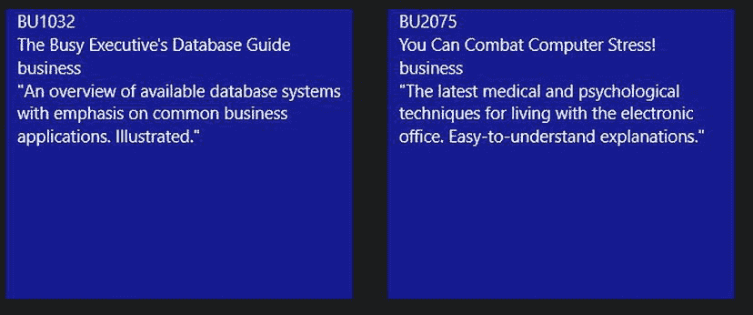

# 十四、开发和使用 Web 服务

在前三章中，您研究了创建应用的图形用户界面所需的步骤。使用 ASP.NET WPF 和 Windows 应用商店应用创建的图形用户界面为用户提供了一种与您的应用交互和使用应用提供的服务的方式。本章向您展示了如何构建另一种类型的接口，这种接口是使用 web 服务协议实现的，旨在供应用使用。这种服务为应用提供了一个可编程的接口来访问其功能，而不需要人工交互。您将首先看到创建和消费 Windows 通信基础(WCF) web 服务。WCF 服务是健壮的服务，支持多种协议上的安全消息传递。当您既要负责服务提供者又要负责服务消费者时，WCF 服务是一个很好的选择，例如，在公司的内部网上提供消费服务。您还将了解如何创建和使用 ASP.NET Web API 服务。ASP.NET Web API 提供了一个轻量级协议，用于通过 HTTP 在客户机和服务器之间传递数据。对于通过互联网在使用不同技术和/或不同组创建的客户端和服务器之间传递数据，这是一个更好的选择。

阅读完本章后，您将对以下内容有更清晰的理解:

*   什么是 web 服务以及它们是如何产生的
*   WCF 如何处理服务请求
*   如何创建和消费 WCF 服务
*   ASP.NET Web API 服务如何处理服务请求
*   如何创建和使用 ASP.NET Web API 服务

什么是服务？

微软首次引入服务的概念是在 .NET 框架 1.0。web 服务为应用提供了一种请求服务和接收回复的方式。这本质上与客户机对象向应用边界内的服务器对象请求服务(方法)是一样的。区别在于客户端对象和服务器对象的位置。如果它们驻留在同一个应用中，那么它们可以发送和接收二进制消息，并且可以相互理解，因为它们说的是同一种“语言”随着您构建的应用变得越来越复杂，通常会将应用分成不同的组件。当您将一个应用分割成多个组件，每个组件都被设计来执行一个独特的专门服务时，您可以极大地增强代码的可维护性、可重用性和可靠性。此外，单独的服务器可以托管各种组件，以提高性能、更好地维护和安全性。

在引入 web 服务之前，应用的客户机和服务器依靠分布式技术进行通信，如微软的分布式组件对象模型(DCOM)和对象管理小组(OMG)的通用对象请求代理体系结构(CORBA)。如果客户机和服务器应用使用相同的技术，这些早期的面向服务的体系结构的尝试工作得相当好，但是当客户机和服务器使用不同的技术时，它就变得非常成问题。web 服务的强大之处在于它们使用一组开放的消息传递和传输协议。这意味着使用不同技术的客户端和服务器组件可以以标准的方式进行通信。例如，运行在 Apache web 服务器上的基于 Java 的应用可以向运行在 IIS 服务器上的基于. NET 的应用请求服务。此外，他们几乎可以位于世界上任何有互联网连接的地方。

WCF 网络服务

随着。在. NET Framework 3.0 中，微软引入了一种以 Windows Communication Foundation services(WCF)的形式创建 web 服务的新方法。在 WCF 之前，微软有一套强大但混乱的消息传递技术，包括 ASP.NET 网络服务、MSMQ、企业服务和 .NET 远程处理。微软决定将所有这些技术整合到一个开发面向服务的应用的框架中。这使得开发面向服务的应用更加一致，减少了开发人员的困惑。

WCF 服务由三部分组成:服务、端点和托管环境。服务是一个类，包含您希望向服务的客户端公开的方法。端点是客户端如何与服务通信的定义。值得注意的是，一个服务可以定义多个端点。一个端点由服务的基址*地址*，它的*绑定*信息，以及它的*契约*信息组成(这三者通常被称为 WCF 的 ABC)。托管环境指的是托管服务的应用。出于您的目的，这将是一个 web 服务器，但是根据您实现的 WCF 服务的类型，还存在其他选项。

创建 WCF Web 服务

使用 Visual Studio 2012 创建和消费基本的 WCF 服务是一个相当简单的过程。如果您使用 Visual Studio 提供的模板，大部分的管道工作已经为您完成了。[图 14-1](#Fig1) 显示了可用的模板。要创建 WCF web 服务，您可以使用 WCF 服务应用模板。


[图 14-1](#_Fig1) 。Visual Studio 提供的 WCF 模板

选择一个模板会向项目添加两个重要文件:一个使用接口定义服务契约，另一个是包含服务实现代码的类文件。在[图 14-2](#Fig2) 中，IService1.cs 文件定义了接口，Service1.svc.cs 包含了服务的类实现。


[图 14-2](#_Fig2) 。WCF 接口和类文件

当您创建服务时，您需要定义服务契约。契约由接口定义来定义。该接口定义服务公开的方法、方法预期的任何输入参数以及方法传回的任何输出参数。以下代码显示了税务服务的接口代码。接口用`[ServiceContract]`属性标记，任何公开的方法用`[OperationContract]`标记。

```cs
[ServiceContract]
public interface ITax
{
    [OperationContract]
    double GetSalesTax(string statecode);
}
```

一旦定义了接口，下一步就是定义实现接口的类。下面的代码实现了`ITax`接口，并提供了实现其公开方法的代码。

```cs
public class Tax : ITax
{
    public double GetSalesTax(string stateCode)
    {
        if (stateCode == "PA")
        {
            return .06;
        }
        else
        {
            return .05;
        }
    }
}
```

一旦定义了接口和类，编译并运行应用就产生了如图[图 14-3](#Fig3) 所示的测试客户端。您可以通过输入状态代码并单击 Invoke 按钮来测试 web 服务。点击 XML 选项卡显示客户端和服务器之间发送的请求和响应消息，如图[图 14-4](#Fig4) 所示。


[图 14-3](#_Fig3) 。测试网络服务


[图 14-4](#_Fig4) 。请求和响应消息

消费 WCF 网络服务

要在. NET 客户端中使用 WCF 服务，必须向项目中添加服务引用。当您在 Visual Studio 2012 中添加服务引用时，您会看到一个添加引用窗口(参见[图 14-5](#Fig5) )。此窗口允许您发现可用的服务及其公开的操作。您还可以更改用于针对服务进行编程的命名空间。


[图 14-5](#_Fig5) 。添加服务引用

一旦服务引用被添加到项目中，Visual Studio 就会用调用服务所需的信息更新应用配置文件。这包括带有地址、绑定和契约信息的端点配置。

```cs
<endpoint address="
http://localhost:49185/TaxService.svc
" binding="basicHttpBinding"
                bindingConfiguration="BasicHttpBinding_ITaxService" contract="TaxService.                ITaxService"
                name="BasicHttpBinding_ITaxService" />
```

客户端代理也被添加到客户端应用中。客户端应用使用这个代理与服务进行交互。以下代码显示了一个客户端控制台应用使用 TaxServiceClient 代理调用服务，并将结果写入控制台窗口。[图 14-6](#Fig6) 显示了控制台窗口的输出。

```cs
TaxService.TaxServiceClient webService = new TaxService.TaxServiceClient();
string state1 = "PA";
double salesTax1 = webService.GetSalesTax(state1);
Console.WriteLine("The sales tax for {0} is {1}", state1, salesTax1);
string state2 = "NJ";
double salesTax2 = webService.GetSalesTax(state2);
Console.WriteLine("The sales tax for {0} is {1}", state2, salesTax2);
webService.Close();
Console.ReadLine();
```


[图 14-6](#_Fig6) 。调用 TaxService 的输出

使用数据协定

在前面的示例中，WCF web 服务仅使用简单类型在服务和客户端之间来回传递数据。整数、双精度和字符串等简单类型不需要任何特殊的编码就可以在客户端和服务器之间传递。有时候，您希望在客户机和服务器之间传递复杂的类型。复杂类型由简单类型组成。例如，您可能有一个服务，它采用由街道、城市、州和邮政编码组成的地址类型，并返回由经度和纬度组成的位置类型。为了促进复杂类型的交换，WCF 服务使用数据契约。像往常一样创建数据类，然后用`[DataContract]`属性标记它。您想要公开的类的属性被标记为`[DataMember]`属性。下面的代码向服务的客户端公开了`Location`类:

```cs
[DataContract]
public class Location
{
    double _longitude;
    double _latitude;
    [DataMember]
    public double Latitude
    {
        get { return _latitude; }
        set { _latitude = value; }
    }
    [DataMember]
    public double Longitude
    {
        get { return _longitude; }
        set { _longitude = value; }
    }
}
```

通过用`[DataContract]`和`[DataMember]`属性标记类，创建了一个描述复杂类型的 XML 模式定义(XSD)文件。客户端使用这个文件来确定提供什么服务以及期望什么作为返回类型。以下标记显示了为服务返回的`Location`类型创建的 XSD 文件部分。

```cs
<xs:complexType name="Location">
    <xs:sequence>
      <xs:element minOccurs="0" name="Latitude" type="xs:double" />
      <xs:element minOccurs="0" name="Longitude" type="xs:double" />
    </xs:sequence>
  </xs:complexType>
<xs:element name="Location" nillable="true" type="tns:Location" />
```

在以下活动中，您将创建一个 WCF 服务，并在. NET 客户端应用中使用该服务。

**活动 14-1。创建和消费 WCF 服务**

在本活动中，您将熟悉以下内容:

*   创建 WCF 服务
*   在客户端应用中使用 WCF 服务

**创建 WCF 服务**

要创建 WCF 服务，请执行以下步骤:

1.  启动 Visual Studio。选择文件新建项目。
2.  Choose WCF under the Visual C# Templates folder and select the WCF Service Application project type. Rename the project to Activity14_1 and click the OK button. (See [Figure 14-7](#Fig7))

    

    [图 14-7](#_Fig7) 。创建 WCF 服务应用

3.  删除 IService1.cs 和 Service1.svc 文件。在解决方案资源管理器中右键单击项目节点，并选择 Add  New Item。在“添加新项目”对话框中，选择 WCF 服务。将服务命名为 DiscountService。
4.  Open the IDiscountService.cs file in the code editor. Replace the `DoWork` operation contract with a `GetDiscount` operation contact.

    `[ServiceContract]`

    `public interface IDiscountService`

    `{`

    `[OperationContract]`

    `double GetDiscount(string discountCode);`

    `}`

5.  Open the DiscountService.svc.cs file in the code editor. Replace the `DoWork` method with the following `GetDiscount` method.

    `public class DiscountService : IDiscountService`

    `{`

    `public double GetDiscount(string discountCode)`

    `{`

    `if (discountCode == "XXXX")`

    `{`

    `return 20;`

    `}`

    `else`

    `{`

    `return 10;`

    `}`

    `}`

    `}`

6.  构建项目。如果有任何错误，请修复它们，然后重新构建。
7.  确保在解决方案资源管理器中选择 DiscountService.svc 节点，并启动调试器。您应该会看到 WCF 测试客户端。测试`GetDiscount`操作。完成测试后，关闭 WCF 测试客户端。

**创造。网络客户端**

1.  在解决方案资源管理器中，右键单击 Activity14_1 解决方案节点，并选择 Add  New Project。在 Windows 模板下添加一个名为 OfficeSupply 的 WPF 应用。
2.  Add the following XAML to the MainWindow between the Grid tags.

    `<TextBlock Text="Discount Code:" FontSize="20" Margin="10,25,350,250"/>`

    `<TextBox Name="txtDiscountCode" FontSize="20" Margin="160,25,100,250"/>`

    `<Button Name="btnGetDiscount" Content="Get Discount" Width="150"`

    `FontSize="20" Margin="150,75,213,200" />`

3.  In the Solution Explorer, right-click the OfficeSupply project node and select Add Service Reference. In the Add Service Reference dialog, click the Discover button. You should see the DiscountService.svc as shown in [Figure 14-8](#Fig8). Click the OK button to add the reference.

    

    [图 14-8](#_Fig8) 。添加服务引用

     **注意**您的服务地址在本地开发时端口号可能会发生变化。

4.  将 Click 事件处理程序方法添加到 btnGetDiscount 中。
5.  Add the following code to the click event handler. It is usually good practice to call web services asynchronously so the client application remains responsive while waiting for the response. Remember from [Chapter 8](08.html) you need to use the `await` key word when calling an async method and also add the `async` key word to the method you are calling it from.

    `private async void btnGetDiscount_Click(object sender, RoutedEventArgs e)`

    `{`

    `ServiceReference1.DiscountServiceClient service =`

    `new ServiceReference1.DiscountServiceClient();`

    `double discount = await service.GetDiscountAsync(txtDiscountCode.Text);`

    `MessageBox.Show(discount.ToString());`

    `}`

6.  In the Solution Explorer, right-click the Activity14_1 solution node and select Properties. Click on the Startup Project node and select Multiple startup projects. Make sure the Action of each project is set to Start and click OK to continue. (See [Figure 14-9](#Fig9))

    

    [图 14-9](#_Fig9) 。设置启动项目

7.  Start the debugger. When the form shows enter a discount code of “XXXX” and click the Get Discount button. You should see a message box showing 20 (see [Figure 14-10](#Fig10)). Try a different code; you should see a discount of 10\. When finished testing, stop the debugger and exit Visual Studio.

    

    [图 14-10](#_Fig10) 。测试折扣 web 服务

RESTful 数据服务

尽管 WCF 是构建 web 服务的一项伟大技术，但是在客户端和服务器之间传递消息时，它包含了大量的开销。当客户端和服务器来回传递数据时，这一点尤其明显。不仅传递数据，还传递描述数据的所有元数据。通常，正在传输的实际数据只占正在发送的消息的很小一部分。通常并不需要所有这些元数据，事实上，当客户端和服务器使用不同的编程框架和不同类型的系统构建时，强类型化数据可能会导致问题。这就是基于表述性状态转移(REST)的服务派上用场的地方。

RESTful web 服务使用 HTTP 上的简单通信，并使用普通的旧 XML (POX )或 JavaScript 对象符号(JSON)交付数据。使用标准的 HTTP 动词 GET、PUT、POST 和 DELETE 来访问和更改数据。微软开发了 ASP.NET WEB API 作为 WCF 的 RESTful 替代品。它不会取代 WCF，但当您不需要支持 TCP 和 UDP 之类的传输协议或支持二进制编码时，它是 WCF 的一个不错的轻量级替代方案。这对于以松散耦合的方式将数据从客户机传递到服务器非常有用。因此，虽然 ASP.NET Web API 服务在将应用逻辑(方法)公开为服务方面非常有用，但在公开数据方面却非常出色。

创建 ASP.NET Web API 服务

当创建 ASP.NET Web API 服务时，您需要创建一个 Web 应用来托管该服务。一旦创建了 web 应用，就可以添加一个 Web API 控制器类。Web API 控制器类提供了处理请求消息、与数据模型交互以及生成响应消息所必需的功能。例如，当您想要请求一个雇员列表时，您可以请求下面的 URI。

```cs
http://localhost/DemoChapter14/employees
```

其中`localhost`是 web 服务器的名称，DemoChapter14 是 web 应用的名称，employees 是控制器的名称。这个 URI 被映射到控制器的 get 方法，该方法返回包含雇员数据的字符串数组。根据请求，输出可以是 POX 或 JSON 的形式。

如果你想得到一个雇员的数据，你可以使用同一个 URI，并在末尾加上雇员键。

```cs
http://localhost/DemoChapter14/employees/10

```

 `这被映射到控制器上的一个`Get`方法，该方法有一个整数类型的输入参数。

```cs
public string Get(int id)
{
            //Retrieve employee data
 }
```

要将 URI 请求映射到 Web API 控制器类的适当方法，您需要将以下代码添加到 Global.asax.cs 文件中的 Application_Start 事件处理程序。这段代码将映射信息添加到`RouteTable`中。

```cs
RouteTable.Routes.MapHttpRoute(
                name: "DefaultApi",
                routeTemplate: "DemoChapter14/{controller}/{id}",
                defaults: new
                {
                    id = RouteParameter.Optional
                }
            );
```

在下面的活动中，您将创建一个 Web API 服务，该服务从 Pubs 数据库中提供图书数据。

**活动 14-2。创建 WEB API 服务**

在本活动中，您将熟悉以下内容:

*   创建 Web API 服务

要创建 Web API 服务，请按照下列步骤操作:

1.  启动 Visual Studio。选择文件新建项目。
2.  Choose Web under the Visual C# Templates folder and select the ASP.NET Empty Web Application project type. Rename the project to Activity14_2 and click the OK button. (See [Figure 14-11](#Fig11))

    

    [图 14-11](#_Fig11) 。添加空的 Web 应用项目

3.  右键单击活动 14_2。Web 项目节点，并选择 Add  New Folder。命名文件夹模型。
4.  右键单击解决方案资源管理器窗口中的模型文件夹，并选择 Add  New Item。在“添加新项”窗口的“数据”节点下，选择一个 ADO.NET 实体数据模型。将模型命名为 Pubs.edmx，然后单击 Add。
5.  在选择模型内容屏幕中，选择从数据库生成选项，然后单击下一步。
6.  在“选择您的数据连接”屏幕中，选择一个现有连接或创建一个到 Pubs 数据库的新连接，然后选择“下一步”。
7.  在“选择数据库对象”屏幕中，展开“表”节点；选择标题表；然后单击完成。
8.  在解决方案资源管理器窗口中右键单击 Activity14_2 web 项目节点，并选择 Add  New Folder。命名文件夹控制器。
9.  在 Solution Explorer 窗口中右键单击 Controllers 文件夹，并选择 Add  New Item。在“添加新项”窗口中，单击已安装模板中的 web 节点。选择 Web API 控制器类模板，将其重命名为`BooksController`，并单击 Add 按钮。
10.  Open the BooksController.cs file in the Code Editor. Add the following using statement to the top of the file.

    `using Activity14_2.Model;`

11.  Update the code so that the Get method uses LINQ to EF ([Chapter 10](10.html)) to retrieve an array of books and sends it back to the caller.

    `// GET api/<controller>`

    `public IEnumerable<title> Get()`

    `{`

    `var context = new pubsEntities();`

    `var query = from t in context.titles select t;`

    `var titles = query.ToArray<title>();`

    `return titles;`

    `}`

12.  在解决方案资源管理器窗口中右键单击 Activity14_2 web 项目节点，并选择 Add  New Item。在“添加新项”窗口中，单击已安装模板中的 web 节点。选择全局应用类模板。将其命名为 Global.asax。
13.  In the Global.asax.cs file add the following using statements.

    `using System.Web.Routing;`

    `using System.Web.Http;`

14.  In the Application_Start event handler add the following code to map the URI verbs (Get, Put, etc.) to the BooksController methods.

    `RouteTable.Routes.MapHttpRoute(`

    `name: "DefaultApi",`

    `routeTemplate: "Activity14_2/{controller}/{id}",`

    `defaults: new`

    `{`

    `id= RouteParameter.Optional`

    `}`

    `);`

15.  Build the solution. If there are any errors, fix them and rebuild. [Figure 14-12](#Fig12) shows the project files in Solution Explorer.

    

    [图 14-12](#_Fig12) 。查看项目文件

16.  Launch the debugger. In the browser window, type the following URI (`http://LocalHost:port/Activity14_2/books`). Replace the port with the port number of your project. You can find the port number by right clicking the project node in Solution Explorer and selecting properties. The project URL should be listed on the Web tab (See [Figure 14-13](#Fig13)).

    

    [图 14-13](#_Fig13) 。查找端口号

17.  You should get a message asking if you want to open or save books.json. Open the file in Notepad. You should see the book information listed in JSON format (see [Figure 14-14](#Fig14)).

    

    [图 14-14](#_Fig14) 。在记事本中查看 books.json 文件

18.  完成测试后，停止调试器并退出 Visual Studio。

使用 ASP.NET Web API 服务

当客户端应用调用 ASP.NET Web API 服务时，它需要发出 HTTP 请求，并等待 POX 或 JSON 文本流形式的响应数据。收到响应后，客户端解析文本文件，并将数据加载到本地对象中进行处理。由于元数据不随数据一起传递，Visual Studio 无法自动生成代理对象供客户端使用。

名称空间中的 HttpClient 类用于发送请求和接收来自 Web API 服务的响应。下面的代码演示了如何使用`HttpClient`类从 web 服务请求图书列表。首先实例化一个`HttpClient`对象并设置基址。

```cs
private HttpClient httpClient;
httpClient = new HttpClient();
httpClient.BaseAddress = new Uri("
http://localhost:49213/
");
```

一旦设置了基址，就可以设置想要返回的响应的格式。在这种情况下，需要一个 JSON 响应。

```cs
httpClient.DefaultRequestHeaders.Accept.Add
                (new MediaTypeWithQualityHeaderValue("application/json"));
```

然后，您可以发出请求并等待响应。因为这可能需要一段时间，所以您应该异步调用 web 服务。

```cs
var response = await httpClient.GetAsync("Activity14_2/books");
```

当响应返回时，您可以使用`Windows.Data.Json`名称空间中的`JsonArray`类解析文本(当前随 Windows 8 一起提供),并将其加载到本地对象/集合中进行处理。

```cs
var bookJSON = await response.Content.ReadAsStringAsync();
var bookArray = JsonArray.Parse(bookJSON);
ObservableCollection<Book> bc = new ObservableCollection<Book>();
foreach (var b in bookArray)
{
    Book bk = new Book();
    bk. title_id=b.GetObject()["title_id"].GetString();
    bk.title = b.GetObject()["title"].GetString();
    bk.type = b.GetObject()["type"].GetString();
    bc.Add(bk);
}
```

使用各种 Web API 服务 .NET 客户端(ASP.NET WPF 和一个 Windows 应用商店)是一个非常相似的过程。在以下活动中，您将从 Windows 应用商店应用调用您在活动 14-2 中创建的 web 服务。

**活动 14-3。调用 WEB API 服务**

在本活动中，您将熟悉以下内容:

*   调用 Web API 服务

要调用 Web API 服务，请按照下列步骤操作:

1.  启动 Visual Studio 并打开活动 14-2 中的项目。将名为 BookServiceClient 的新 Windows 应用商店空白应用添加到解决方案中。
2.  Add a new class to the BookServiceClient named `Book` and add the following properties to the class.

    `class Book`

    `{`

    `public string Title_id { get; set; }`

    `public string Title { get; set; }`

    `public string Type { get; set; }`

    `public string Notes { get; set; }`

    `}`

3.  Open the MainPage.xaml file in the designer. Add the following XAML markup between the `Grid` tags to define a `GridView` to display a collection of book data.

    `<GridView Name="BooksView" ItemsSource="{Binding}" Margin="50,50,0,0">`

    `<GridView.ItemTemplate>`

    `<DataTemplate>`

    `<StackPanel Width="300" Height="300" Margin="10"                 Background="#FF161C8F">`

    `<TextBlock Margin="10,0" Text="{Binding Title_id}" />`

    `<TextBlock Margin="10,0" Text="{Binding Title}" />`

    `<TextBlock Margin="10,0" Text="{Binding Type}" />`

    `<TextBlock Margin="10,0" Text="{Binding Notes}"                     TextWrapping="Wrap"/>`

    `</StackPanel>`

    `</DataTemplate>`

    `</GridView.ItemTemplate>`

    `</GridView>`

4.  Open the MainPage.xaml.cs file in the code editor window. Add the following using statements to the top of the file.

    `using System.Net.Http;`

    `using System.Net.Http.Headers;`

    `using Windows.Data.Json;`

    `using System.Collections.ObjectModel;`

5.  Add a class level `HttpClient` variable to the class and update the class constructor with the following code. Replace the port number with the port number being used by your web service.

    `private HttpClient httpClient;`

    `public MainPage()`

    `{`

    `this.InitializeComponent();`

    `httpClient = new HttpClient();`

    `httpClient.BaseAddress = new Uri("``http://localhost:49213/`T2】

    `httpClient.DefaultRequestHeaders.Accept.Add`

    `(new MediaTypeWithQualityHeaderValue("application/json"));`

    `}`

6.  Add an asynchronous method that calls the web service, parses the result, and binds it to the `GridView`.

    `private async void GetBooks()`

    `{`

    `var response = await httpClient.GetAsync("Activity14_2/books");`

    `if (response.IsSuccessStatusCode)`

    `{`

    `var bookJSON = await response.Content.ReadAsStringAsync();`

    `var bookArray = JsonArray.Parse(bookJSON);`

    `ObservableCollection<Book> bc = new ObservableCollection<Book>();`

    `foreach (var b in bookArray)`

    `{`

    `Book bk = new Book();`

    `bk.Title_id=b.GetObject()["title_id"].GetString();`

    `bk.Title = b.GetObject()["title1"].GetString();`

    `bk.Type = b.GetObject()["type"].GetString();`

    `bk.Notes = b.GetObject()["notes"].Stringify();`

    `bc.Add(bk);`

    `}`

    `this.BooksView.DataContext = bc;`

    `}`

    `}`

7.  In the `OnNavigatedTo` event handler call the `GetBooks` method.

    `protected override void OnNavigatedTo(NavigationEventArgs e)`

    `{`

    `GetBooks();`

    `}`

8.  构建解决方案。如果有任何错误，请修复并重新构建。
9.  In the Solution Explorer, right-click the Activity14_2 solution node and select Properties. Click on the Startup Project node and select Multiple startup projects. Make sure the Action of each project is set to Start. (See [Figure 14-15](#Fig15)).

    

    [图 14-15](#_Fig15) 。设置启动项目

10.  Launch the debugger. You should see the book information listed in the GridView. (See [Figure 14-16](#Fig16)).

    

    [图 14-16](#_Fig16) 。显示图书信息

11.  完成测试后，按 Alt + F4 键关闭应用。在 Visual Studio 中，停止调试器并退出 Visual Studio。

摘要

在本章中，您已经了解了实现 web 服务的基础知识。特别是，您看到了如何使用 ASP.NET web API 和 Windows 通信框架(WCF)创建 Web 服务。您还构建了调用这些 web 服务的客户端应用。

这是旨在向您展示各种技术和 .NET 框架类来构建 .NET 应用。这些章节仅仅触及了这些技术的表面。随着开发经验的积累 .NET 应用，您将需要更深入地研究这些技术。

到目前为止，您已经学习了 UML 设计、面向对象编程、C# 语言、 .NET 框架、创建图形用户界面和开发 Web 服务。现在，您已经准备好将这些部分放在一起，开发一个可工作的应用。在第 15 章的[中，你将重温你为](15.html)[第 4 章](04.html)中介绍的案例研究开发的 UML 模型。您将把这些模型转换成一个功能应用。`