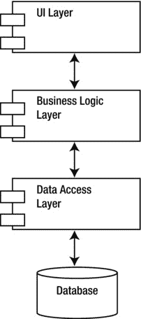
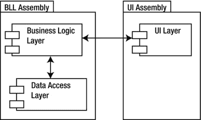
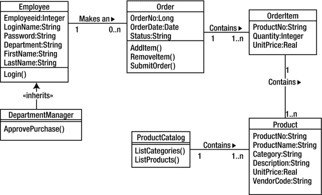
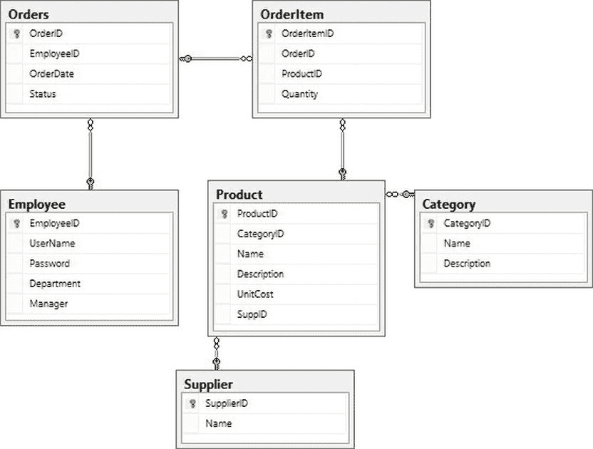
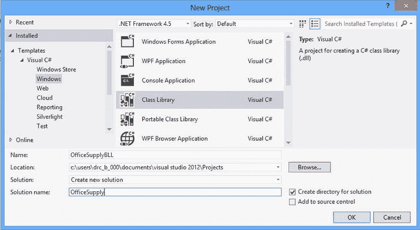
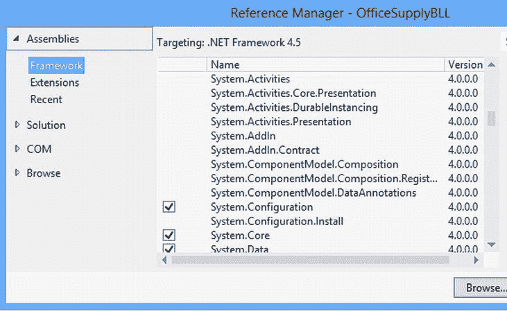
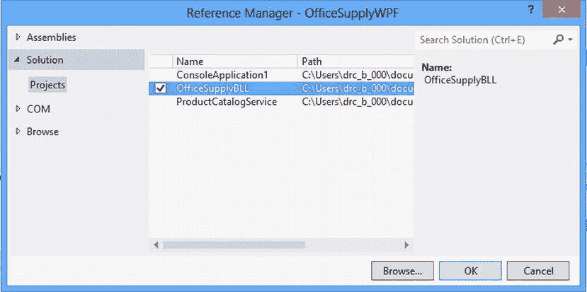
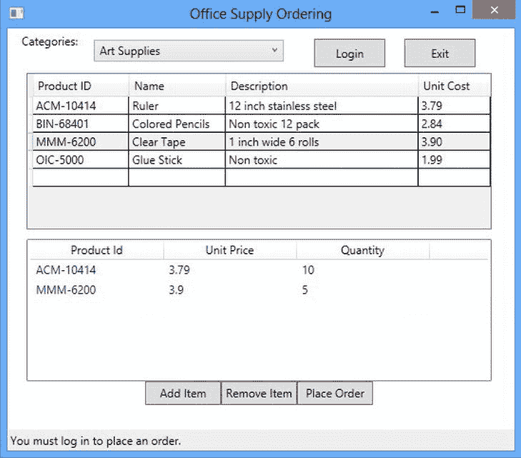
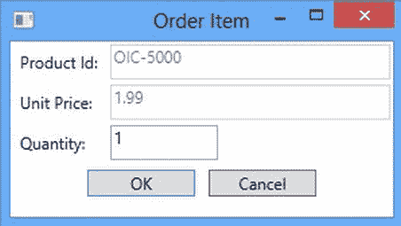
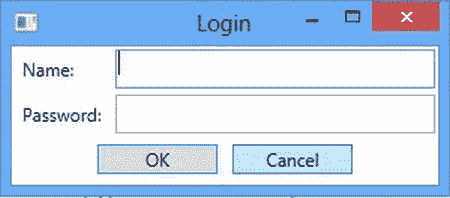

# 十五、开发办公用品订购应用

在前面的章节中，你看到了三种开发应用图形用户界面的方法。图形用户界面为人类用户提供了一种与您的应用进行交互并使用它们所提供的服务的方式。您还看到了服务如何创建编程接口，其他程序可以调用这些接口来使用应用的服务，而无需任何用户交互。

在这一章中，你兜了一圈，回到了你在第四章中设计的办公用品订购应用(简称 OSO)。这一章是一个大活动，也是一次期末考试。您将创建一个功能性的应用，其中包含了您在前面章节中学到的概念。在创建应用的过程中，您应该能够识别这些概念，并将它们与前面介绍的概念联系起来。该应用将包含数据访问层、业务逻辑层和用户界面层。

读完这一章，你会明白为什么应用被分成不同的层，以及如何构造它们。

重温应用设计

设计应用时，通常可以分三个不同的阶段进行。首先，你完成概念设计，然后是逻辑设计，最后是物理设计。

如第 4 章所述，概念设计 构成了该过程的发现阶段。概念设计阶段涉及系统用户和系统设计者之间大量的合作和交流。系统设计者必须完全理解被提议的系统将包含的业务过程。使用场景和用例，设计者定义系统的功能需求。此阶段的必要成果是系统的开发人员和用户对系统功能和范围达成共识。

设计过程的第二阶段是*逻辑设计*。在逻辑设计阶段，你要设计出系统结构和组织的细节。这个阶段包括组成系统的业务对象和类的开发和识别。UML 类图标识了系统对象，您可以为这些对象标识和记录属性和行为。您还可以使用类图开发和记录这些对象的结构依赖性。使用序列图和协作图，您可以发现和识别各种系统对象之间的交互和行为依赖。这个阶段的结果，即应用对象模型，独立于任何特定于实现的技术和部署架构。

设计过程的第三阶段是*物理设计*。在物理设计阶段，您将应用对象模型转换成实际的系统。您评估并决定特定的技术和基础结构，进行成本分析，并确定任何限制。诸如程序员经验和知识基础、当前的实现技术和遗留系统集成等问题都会影响您在物理设计阶段的决策。您还必须分析安全问题、网络基础设施和可伸缩性要求。

设计分布式应用时，通常将其逻辑架构结构与物理架构结构分开。通过以这种方式分离架构结构，您会发现维护和更新应用要容易得多。您可以在影响最小的情况下进行任何物理架构更改(例如，提高可伸缩性)。逻辑架构设计通常将应用的各个部分分成不同的层。用户与*表示层*交互，表示层向用户呈现数据，并为用户提供发起业务服务请求的方法。*业务逻辑层*封装并实现了应用的业务逻辑。它负责执行计算、处理数据、控制应用逻辑和序列。*数据层*负责管理对信息的访问和存储，这些信息必须在不同的用户和业务流程之间持久化和共享。图 15-1 显示了一个典型的三层应用的不同逻辑层。



[图 15-1](#_Fig1) 。三层应用的逻辑层

当您创建应用的物理层时，理想情况下，每个逻辑层都对应于其专用服务器上的一个不同的物理层。实际上，应用的物理层受到可用硬件和网络基础设施等因素的影响。您可能将所有逻辑层都放在一台物理服务器上，或者分布在 web 和数据库服务器上。重要的是，您创建的应用在类之间实现了明确的职责分离。

图 15-2 显示了 OSO 应用的建议布局。为了简单起见，您将在同一个程序集中创建业务逻辑类和数据访问类。该组件被称为业务逻辑层(BLL)，而用户界面层包含在它自己的组件用户界面层(UI)中。两个程序集都包含在同一台服务器(您的计算机)上。需要记住的重要一点是，由于业务逻辑类和数据访问类之间有明确的职责分离，随着应用功能和用户的增加，它可以很容易地重构为托管在不同服务器上的不同程序集。



[图 15-2](#_Fig2) 。OSO 应用的物理层

构建 OSO 应用的数据访问层

为了开发应用的业务逻辑和数据访问层，你需要回顾你在第 4 章中创建的 OSO 类图(如图 15-3 所示)。



[图 15-3](#_Fig3) 。OSO 应用类图

正如第 4 章所讨论的，你需要创建一个`Employee`类来实现一个登录方法(`Login()`)。登录方法将与数据库交互，以验证登录信息。为此，您将创建两个雇员类:一个用于业务逻辑层(`Employee`)，一个用于数据访问层(`DALEmployee`)。`Employee`类将把来自用户界面(UI)的登录请求传递给`DALEmployee`类，后者将与数据库交互以检索所请求的信息。图 15-4 是办公用品数据库的数据库模式。此数据库驻留在 SQL Server 数据库中。



[图 15-4](#_Fig4) 。办公用品数据库图表

 **注**如果您没有安装办公用品数据库，请参见[附录 C](19.html) 获取说明。

首先，您将从数据访问层开始，然后实现业务逻辑层。

在 Visual Studio 中，创建一个类库应用，命名为 OfficeSupplyBLL，将解决方案命名为 OfficeSupply，如图[图 15-5](#Fig5)；该应用将包含 OSO 应用的业务逻辑层和数据访问层的类。



[图 15-5](#_Fig5) 。创建 OfficeSupplyBLL 类库

 **注意**如果你不想从头开始编写办公用品订购应用，你可以从 Apress 网站下载。详见[附录 C](19.html) 。

接下来，您将创建一个静态类(`DALUtility`)，它实现从 App.config 文件中检索数据库连接字符串。其他类将调用它的`GetSQLConnection`来检索连接字符串。

将 App.config 文件添加到项目中。在 App.config 文件中，添加下面的 xml 代码来设置连接信息。请记住，根据您的服务器设置，您可能需要更改数据源。

```cs
<configuration>
  <connectionStrings>
    <add name="OSConnection"
      providerName="System.Data.SqlClient"
      connectionString="data source=localhost;initial catalog=OfficeSupply;
                       integrated security=True;"/>
  </connectionStrings>
 </configuration>
```

在“解决方案资源管理器”窗口中，右击“引用”文件夹并选择“添加引用”。在框架组件中，选择`System.Configuration`组件，如图[图 15-6](#Fig6) 所示。



[图 15-6](#_Fig6) 。添加对应用的引用

向项目中添加一个类，并将其命名为`DALUtility`。将以下代码添加到类文件中:

```cs
using System;
using System.Configuration;

namespace OfficeSupplyBLL
{
    public static class DALUtility
    {
        public static string GetSQLConnection(string name)
        {
            // Assume failure.
            string returnValue = null;

            // Look for the name in the connectionStrings section.
            ConnectionStringSettings settings
                = ConfigurationManager.ConnectionStrings[name];

            // If found, return the connection string.
            if (settings != null)
            {
                returnValue = settings.ConnectionString;
            }
            return returnValue;
        }
    }
}
```

下一个要添加的类是`DALEmployee`类。这个类包含一个`Login`方法，用于检查提供给数据库中的值的用户名和密码。它使用一个`SQLCommand`对象对数据库执行一条 SQL 语句。如果找到匹配，它返回雇员的`userId.`，如果没有找到匹配，它返回`-1`。因为 SQL 语句返回一个值，所以可以使用`SQLCommand`对象的`ExecuteScalar`方法。

将名为`DALEmployee`的类添加到应用中，并将以下代码插入到类文件中:

```cs
using System;
using System.Data.SqlClient;

namespace OfficeSupplyBLL
{
    class DALEmployee
    {
        public int LogIn(string userName, string password)
        {
            string connString = DALUtility.GetSQLConnection("OSConnection");
           using( SqlConnection conn = new SqlConnection(connString))

            {
                using (SqlCommand cmd = new SqlCommand())
                {
                    cmd.Connection = conn;
                    cmd.CommandText = "Select EmployeeID from Employee where "
                         + " UserName = @UserName and Password = @Password ";
                    cmd.Parameters.AddWithValue("@UserName", userName);
                    cmd.Parameters.AddWithValue("@Password", password);
                    int userId;
                    conn.Open();
                    userId = (int)cmd.ExecuteScalar();
                    if (userId > 0)
                    {
                        return userId;
                    }
                    else
                    {
                        return -1;
                    }
                }
            }

        }
    }
}
```

下一个要构建的类是`DALProductCatalog`类，其目的是封装应用检索和列出数据库中可用产品所需的功能。您还希望能够根据产品所属的类别来查看产品。您需要的信息在两个数据库表中:目录表和产品表。这两个表通过`CatID`字段相关联。

当客户端请求产品目录信息时，会创建一个数据集并将其返回给客户端。该服务在`DALProductCatalog`类的`GetProductInfo`方法中提供。将名为`DALProductCatalog`的类添加到项目中，并插入如下所示的代码:

```cs
using System;
using System.Collections.Generic;
using System.Data;
using System.Data.SqlClient;
using System.Linq;
using System.Text;
using System.Threading.Tasks;

namespace OfficeSupplyBLL
{
    public class DALProductCatalog
    {
        public DataSet GetProductInfo()
        {
            DataSet _dsProducts;
            string connString = DALUtility.GetSQLConnection("OSConnection");
            using (SqlConnection _conn = new SqlConnection(connString))
           {
                _dsProducts = new DataSet("Products");
                //Get category info
                String strSQL = "Select CategoryId, Name, Description from Category";
                using(SqlCommand cmdSelCategory = new SqlCommand(strSQL, _conn))
                {
                    using(SqlDataAdapter daCatagory = new SqlDataAdapter(cmdSelCategory))
                    {
                        daCatagory.Fill(_dsProducts, "Category");
                    }
                }

                //Get product info
                String strSQL2 = "Select ProductID, CategoryID, Name," +
                    "Description, UnitCost from Product";
                using(SqlCommand cmdSelProduct = new SqlCommand(strSQL2, _conn))
                {
                    using (SqlDataAdapter daProduct = new SqlDataAdapter(cmdSelProduct))
                    {
                        daProduct.Fill(_dsProducts, "Product");
                    }
                }
           }
                //Set up the table relation
                DataRelation drCat_Prod = new DataRelation("drCat_Prod",
                    _dsProducts.Tables["Category"].Columns["CategoryID"],
                    _dsProducts.Tables["Product"].Columns["CategoryID"], false);
                _dsProducts.Relations.Add(drCat_Prod);
            return _dsProducts;
        }
    }
}
```

当客户端准备提交订单时，它将调用`Order`类的`PlaceOrder`方法，稍后您将在业务逻辑类中定义这个类。客户机将雇员 ID 传递给方法，并接收一个订单编号作为返回值。`Order`类的`PlaceOrder`方法将以 XML 字符串的形式将订单信息传递给`DALOrder`类进行处理。`DALOrder`类包含`PlaceOrder`方法，该方法从`Order`类接收 XML 订单字符串，并将其传递给 SQL Server 数据库中的存储过程。存储过程更新数据库并传回订单号。然后，这个订单号被返回给`Order`类，该类又将订单号传递回客户端。

将名为`DALOrder`的类添加到项目中，并将以下代码插入到类文件中:

```cs
using System;
using System.Data;
using System.Data.SqlClient;

namespace OfficeSupplyBLL
{
    class DALOrder
    {
        public int PlaceOrder(string xmlOrder)
        {
            string connString = DALUtility.GetSQLConnection("OSConnection");
            using (SqlConnection cn = new SqlConnection(connString))
            {
                using (SqlCommand cmd = cn.CreateCommand())
                {
                    cmd.CommandType = CommandType.StoredProcedure;
                    cmd.CommandText = "up_PlaceOrder";
                    SqlParameter inParameter = new SqlParameter();
                    inParameter.ParameterName = "@xmlOrder";
                    inParameter.Value = xmlOrder;
                    inParameter.DbType = DbType.String;
                    inParameter.Direction = ParameterDirection.Input;
                    cmd.Parameters.Add(inParameter);
                    SqlParameter ReturnParameter = new SqlParameter();
                    ReturnParameter.ParameterName = "@OrderID";
                    ReturnParameter.Direction = ParameterDirection.ReturnValue;
                    cmd.Parameters.Add(ReturnParameter);
                    int intOrderNo;
                    cn.Open();
                    cmd.ExecuteNonQuery();
                    cn.Close();
                    intOrderNo = (int)cmd.Parameters["@OrderID"].Value;
                    return intOrderNo;
                }
            }
        }
    }
}
```

现在您已经构建了数据访问层类，您已经准备好构建业务逻辑层类集了。

构建 OSO 应用的业务逻辑层

将名为`Employee`的类添加到项目中。这个类将封装 UI 使用的雇员信息，并将登录请求传递给数据访问层。将以下代码添加到 Employee.cs 文件中:

```cs
using System;

namespace OfficeSupplyBLL
{
    public   class Employee
    {
        int _employeeID;

        public int EmployeeID
        {
            get { return _employeeID; }
            set { _employeeID = value; }
        }

        string _loginName;

        public string LoginName
        {
            get { return _loginName; }
            set { _loginName = value; }
        }
        string _password;

        public string Password
        {
            get { return _password; }
            set { _password = value; }
        }

        Boolean _loggedIn = false;

        public Boolean LoggedIn
        {
            get { return _loggedIn; }
        }

        public Boolean LogIn()
        {
            DALEmployee dbEmp = new DALEmployee();
            int empId;
            empId = dbEmp.LogIn(this.LoginName, this.Password);
            if (empId > 0)
            {
                this.EmployeeID = empId;
                this._loggedIn = true;
                return true;
            }
            else
            {
                this._loggedIn = false;
                return false;
            }

        }
    }
}
```

`ProductCatalog`类向 UI 提供产品数据集。它从`DALProductCatalog`类中检索数据集。在将数据集传递给 UI 之前，您可以在数据集上执行任何业务逻辑。向项目中添加一个新的`ProductCatalog`类文件，并添加以下代码来实现`ProductCatalog`类。

```cs
using System;
using System.Collections.Generic;
using System.Data;
using System.Linq;
using System.Text;
using System.Threading.Tasks;

namespace OfficeSupplyBLL
{
    public class ProductCatalog
    {
        public DataSet GetProductInfo()
        {
            //perform any business logic befor passing to client.
            // None needed at this time.
            DALProductCatalog prodCatalog = new DALProductCatalog();
            return prodCatalog.GetProductInfo();
        }
    }
}
```

当用户向订单添加项目时，订单项目信息被封装在一个`OrderItem` 类中。这个类实现了`INotifyPropertyChanged`接口。此接口是通知 UI 某个属性已更改所必需的，以便它可以更新绑定到该类的任何控件。它还覆盖了`ToString`方法，以提供包含商品信息的 XML 字符串。当下订单时，这个字符串将被传递给 DAL。

将`OrderItem`类添加到项目中，并插入以下代码来实现它。

```cs
using System;
using System.ComponentModel;

namespace OfficeSupplyBLL
{
    public class OrderItem : INotifyPropertyChanged
    {

        #region INotifyPropertyChanged Members
        public event PropertyChangedEventHandler PropertyChanged;
        protected void Notify(string propName)
        {
            if (this.PropertyChanged != null)
            {
                PropertyChanged(this, new PropertyChangedEventArgs(propName));
            }
        }
        #endregion

        string _ProdID;
        int _Quantity;
        double _UnitPrice;
        double _SubTotal;
        public string ProdID
        {
            get { return _ProdID; }
            set { _ProdID = value; }
        }
        public int Quantity
        {
            get { return _Quantity; }
            set
            {
                _Quantity = value;
                Notify("Quantity");
            }
        }
        public double UnitPrice
        {
            get { return _UnitPrice; }
            set { _UnitPrice = value; }
        }
        public double SubTotal
        {
            get { return _SubTotal; }
        }
        public OrderItem(String productID, double unitPrice, int quantity)
        {
            _ProdID = productID;
            _UnitPrice = unitPrice;
            _Quantity = quantity;
            _SubTotal = _UnitPrice * _Quantity;
        }
        public override string ToString()
        {
            string xml = "<OrderItem";
            xml += " ProductID='" + _ProdID + "'";
            xml += " Quantity='" + _Quantity + "'";
            xml += " />";
            return xml;
        }
    }
}
```

业务逻辑层的最后一个类是`Order`类。该类负责维护订单项的集合。它有添加和删除项目的方法，以及在下订单时将项目传递给`DALOrder`类的方法。

在项目中添加了一个`Order`类之后，使用下面的代码来实现这个类:

```cs
using System;
using System.Collections.ObjectModel;

namespace OfficeSupplyBLL
{
    public class Order
    {

        ObservableCollection<OrderItem> _orderItemList = new
            ObservableCollection<OrderItem>();

        public ObservableCollection<OrderItem> OrderItemList
        {
            get { return _orderItemList; }
        }
        public void AddItem(OrderItem orderItem)
        {
            foreach (var item in _orderItemList)
            {
                if (item.ProdID == orderItem.ProdID)
                {
                    item.Quantity += orderItem.Quantity;

                    return;
                }
            }
            _orderItemList.Add(orderItem);
        }
        public void RemoveItem(string productID)
        {
            foreach (var item in _orderItemList)
            {
                if (item.ProdID == productID)
                {
                    _orderItemList.Remove(item);
                    return;
                }
            }
        }
        public double GetOrderTotal()
        {
            if (_orderItemList.Count == 0)
            {
                return 0.00;
            }
            else
            {
                double total = 0;
                foreach (var item in _orderItemList)
                {
                    total += item.SubTotal;
                }
                return total;
            }
        }
        public int PlaceOrder(int employeeID)
        {
            string xmlOrder;
            xmlOrder = "<Order EmployeeID='" + employeeID.ToString() + "'>";
            foreach (var item in _orderItemList)
            {
                xmlOrder += item.ToString();
            }
            xmlOrder += "</Order>";
            DALOrder dbOrder = new DALOrder();
            return dbOrder.PlaceOrder(xmlOrder);
        }
    }
}
```

现在，您已经构建了 OSO 应用的数据访问和业务逻辑层，您已经准备好构建用户界面(UI)了。因为您在不同的层中创建了应用，所以您可以选择使用基于 Windows 的 WPF 用户界面、基于 ASP.NET 网络的用户界面或 Windows 应用商店应用。您还可以根据用户用来与应用交互的设备来创建多个 UI。在下一节中，您将构建一个 WPF 应用，用户将使用它从他们的桌面计算机上订购办公用品。

创建 OSO 应用用户界面

为了创建订购系统的 WPF 接口，您需要向包含 OfficeSupplyBLL 项目的解决方案中添加一个 WPF 项目。

在 Visual Studio 中，向解决方案中添加一个 WPF 项目，并将其命名为 OfficeSupplyWPF。项目加载后，添加对 OfficeSupplyBLL 项目的引用，如图[图 15-7](#Fig7) 所示。



[图 15-7](#_Fig7) 。添加对 OfficeSupplyBLL 项目的引用

在 App.config 文件中，将下面的 xml 代码添加到配置结束标记之前。请记住，根据您的服务器设置，您可能需要更改数据源。

```cs
  <connectionStrings>
    <add name="OSConnection"
      providerName="System.Data.SqlClient"
      connectionString="data source=localhost;initial catalog=OfficeSupply;
                       integrated security=True;"/>
  </connectionStrings>
```

用户界面的第一个目标是展示可以订购的产品信息。产品信息呈现在数据网格控件中。用户将通过选择 ComboBox 控件中的类别来查看特定类别中的产品。产品列出后，用户可以将产品添加到订单中。当一个产品被添加到订单中时，它会显示在数据网格下面的列表视图中。[图 15-8](#Fig8) 显示了在订单中添加了项目的 OSO 订单。



[图 15-8](#_Fig8) 。向订单添加项目的表单

将以下 XAML 代码添加到 MainWindow.xaml 文件中，以创建 OSO 订单。请注意数据绑定在各种控件中的使用。例如，数据网格的项目来源被设置为类别表和产品表之间的数据关系(`ItemsSource="{Binding drCat_Prod}"`)。这允许数据网格显示下拉列表中所选类别的产品。

```cs
<Window x:Class="OfficeSupplyWPF.MainWindow"
        FontName1">http://schemas.microsoft.com/winfx/2006/xaml/presentation "
        xmlns:x=" http://schemas.microsoft.com/winfx/2006/xaml "
        Title="Office Supply Ordering" Height="484" Width="550" Loaded="Window_Loaded">
    <Grid>
        <StackPanel Name="LayoutRoot" DataContext="{Binding}"
                Orientation="Vertical" HorizontalAlignment="Left" Height="auto" Width="auto">
            <StackPanel Orientation="Horizontal" HorizontalAlignment="Left">
                <Label Content="Categories:" Margin="10,0,0,0"/>
                <ComboBox ItemsSource="{Binding}" Name="categoriesComboBox"
                          IsSynchronizedWithCurrentItem="True"
                      DisplayMemberPath="Name" Height="23" Margin="12" Width="200" >
                <ComboBox.ItemsPanel>
                        <ItemsPanelTemplate>
                            <VirtualizingStackPanel />
                        </ItemsPanelTemplate>
                    </ComboBox.ItemsPanel>
                </ComboBox>
                <Button Content="Login" Height="30" Name="loginButton"
                        Width="75" Margin="20,5,0,0" Click="loginButton_Click" />
                <Button Content="Exit" Height="30" Name="exitButton"
                        Width="75" Margin="20,5,0,0" Click="exitButton_Click" />
            </StackPanel>
            <DataGrid AutoGenerateColumns="False" Height="165"
                      ItemsSource="{Binding drCat_Prod}"
                      Name="ProductsDataGrid" RowDetailsVisibilityMode="VisibleWhenSelected"
                      Width="490" HorizontalAlignment="Left" Margin="20,0,20,10"
                      SelectionMode="Single">
                <DataGrid.Columns>
                    <DataGridTextColumn
                    x:Name="productIDColumn" Binding="{Binding Path=ProductID}"
                    Header="Product ID" Width="40*" />
                    <DataGridTextColumn
                    x:Name="nameColumn" Binding="{Binding Path=Name}"
                    Header="Name" Width="40*" />
                    <DataGridTextColumn
                    x:Name="descriptColumn" Binding="{Binding Path=Description}"
                    Header="Description" Width="80*" />
                    <DataGridTextColumn
                    x:Name="unitCostColumn" Binding="{Binding Path=UnitCost}"
                    Header="Unit Cost" Width="30*" />
                </DataGrid.Columns>
            </DataGrid>

            <StackPanel Orientation="Vertical">
                <ListView Name="orderListView" MinHeight="150" Width="490"
                          ItemsSource="{Binding}" SelectionMode="Single">
                    <ListView.View>
                        <GridView>
                            <GridViewColumn Width="140" Header="Product Id"
                                            DisplayMemberBinding="{Binding ProdID}" />
                            <GridViewColumn Width="140" Header="Unit Price"
                                            DisplayMemberBinding="{Binding UnitPrice}" />
                            <GridViewColumn Width="140" Header="Quantity"
                                            DisplayMemberBinding="{Binding Quantity}" />
                        </GridView>
                    </ListView.View>
                </ListView>

            </StackPanel>
            <StackPanel Orientation="Horizontal" HorizontalAlignment="Center">
                <Button Name="addButton" MinHeight="25" MinWidth="80"
                        Content="Add Item" Click="addButton_Click" />
                <Button Name="removeButton" MinHeight="25" MinWidth="80"
                        Content="Remove Item" Click="removeButton_Click"/>
                <Button Name="placeOrderButton" MinHeight="25" MinWidth="80"
                        Content="Place Order" Click="placeOrderButton_Click"/>
            </StackPanel>
        </StackPanel>
        <StatusBar VerticalAlignment="Bottom" HorizontalAlignment="Stretch">
            <TextBlock Name="statusTextBlock">You must log in to place an order.</TextBlock>
        </StatusBar>
    </Grid>
</Window>
```

要添加订单项，用户首先在数据网格中选择一行，然后选择“添加项”按钮。“添加项目”按钮显示一个对话框，用户可以使用该对话框输入数量并添加项目。[图 15-9](#Fig9) 显示了订单项目对话框。



[图 15-9](#_Fig9) 。订单项目对话框

向名为 OrderItemDialog.xaml 的项目添加一个新窗口。添加以下 xaml 代码以创建`OrderItemDialog`表单:

```cs
<Window x:Class="OfficeSupplyWPF.OrderItemDialog"
        FontName1">http://schemas.microsoft.com/winfx/2006/xaml/presentation"
        xmlns:x="http://schemas.microsoft.com/winfx/2006/xaml"
                WindowStartupLocation="CenterOwner"
        Title="Order Item" Height="169" Width="300">
    <Grid>
        <Grid.ColumnDefinitions>
            <ColumnDefinition Width="Auto" />
            <ColumnDefinition Width="Auto" />
            <ColumnDefinition />
        </Grid.ColumnDefinitions>

        <Grid.RowDefinitions>
            <RowDefinition Height="Auto" />
            <RowDefinition Height="Auto" />
            <RowDefinition Height="Auto" />
            <RowDefinition Height="Auto" />
            <RowDefinition />
        </Grid.RowDefinitions>
        <Label Grid.Column="0" Grid.Row="0" Margin="2">Product Id:</Label>
        <TextBox Name="productIdTextBox" Grid.Column="1"
                 Grid.Row="0" Margin="2" Grid.ColumnSpan="2" IsEnabled="False"/>
        <Label Grid.Column="0" Grid.Row="1" Margin="2">Unit Price:</Label>
        <TextBox Name="unitPriceTextBox" Grid.Column="1"
                 Grid.Row="1" Margin="2" Grid.ColumnSpan="2" IsEnabled="False"/>
        <Label Grid.Column="0" Grid.Row="2" Margin="2" >Quantity:</Label>
        <TextBox Name="quantityTextBox" Grid.Column="1"
                 Grid.Row="2" Margin="2" MinWidth="80" Text="1"/>
        <StackPanel Grid.Column="0" Grid.ColumnSpan="3"
                    Grid.Row="3" Orientation="Horizontal"
                    HorizontalAlignment="Center">
            <Button Name="okButton" Click="okButton_Click" IsDefault="True"
                    MinWidth="80" Margin="5">OK</Button>
            <Button Name="cancelButton" Click="cancelButton_Click" IsCancel="True"
                    MinWidth="80" Margin="5">Cancel</Button>
        </StackPanel>
    </Grid>
</Window>
```

用户必须先登录，然后才能提交订单。当他们点击登录按钮时，会出现一个登录对话窗口，如图[图 15-10](#Fig10) 所示。



[图 15-10](#_Fig10) 。登录对话框

向名为 LoginDialog.xaml 的项目添加一个新窗口。

```cs
<Window x:Class="OfficeSupplyWPF.LoginDialog"
        FontName1">http://schemas.microsoft.com/winfx/2006/xaml/presentation"
        xmlns:x="http://schemas.microsoft.com/winfx/2006/xaml"
        Title="Login" Height="131" Width="300"
        WindowStartupLocation="CenterOwner"
        FocusManager.FocusedElement="{Binding ElementName=nameTextBox}">
    <Grid>
        <Grid.ColumnDefinitions>
            <ColumnDefinition Width="Auto" />
            <ColumnDefinition />
        </Grid.ColumnDefinitions>

        <Grid.RowDefinitions>
            <RowDefinition Height="Auto" />
            <RowDefinition Height="Auto" />
            <RowDefinition Height="Auto" />
            <RowDefinition />
        </Grid.RowDefinitions>
        <Label Grid.Column="0" Grid.Row="0" Margin="2">Name:</Label>
        <TextBox Name="nameTextBox" Grid.Column="1" Grid.Row="0" Margin="2"/>
        <Label Grid.Column="0" Grid.Row="1" Margin="2">Password:</Label>
        <PasswordBox Name="passwordTextBox" Grid.Column="1" Grid.Row="1" Margin="2"/>

        <StackPanel Grid.Column="0" Grid.ColumnSpan="2" Grid.Row="2"
                    Orientation="Horizontal" HorizontalAlignment="Center">
            <Button Name="okButton" Click="okButton_Click" IsDefault="True"
                    MinWidth="80" Margin="5">OK</Button>
            <Button Name="cancelButton" Click="cancelButton_Click" IsCancel="True"
                    MinWidth="80" Margin="5">Cancel</Button>
        </StackPanel>
    </Grid>
</Window>
```

现在，您已经创建了构成 UI 的窗口，您可以将实现添加到窗口的代码隐藏文件中了。

将以下代码添加到 MainWindow.xaml.cs 代码隐藏文件中。下面是对代码的讨论。

```cs
using System;
using System.Collections.Generic;
using System.Linq;
using System.Text;
using System.Windows;
using System.Windows.Controls;
using System.Windows.Data;
using System.Windows.Documents;
using System.Windows.Input;
using System.Windows.Media;
using System.Windows.Media.Imaging;
using System.Windows.Navigation;
using System.Windows.Shapes;
using System.Data;
using OSOBLL;
using System.Collections.ObjectModel;

namespace OfficeSupplyWPF
{
    /// <summary>
    /// Interaction logic for MainWindow.xaml
    /// </summary>
    public partial class MainWindow : Window
    {

        DataSet _dsProdCat;
        Employee _employee;
        Order _order;

        public MainWindow()
        {
            InitializeComponent();

        }

        private void Window_Loaded(object sender, RoutedEventArgs e)
        {
            ProductCatalog prodCat = new ProductCatalog();
            _dsProdCat = prodCat.GetProductInfo();
            this.DataContext = _dsProdCat.Tables["Category"];
            _order = new  Order();
            _employee = new Employee();
            this.orderListView.ItemsSource = _order.OrderItemList;
        }

        private void loginButton_Click(object sender, RoutedEventArgs e)
        {

            LoginDialog dlg = new LoginDialog();
            dlg.Owner = this;
            dlg.ShowDialog();
            // Process data entered by user if dialog box is accepted
            if (dlg.DialogResult == true)
            {
                _employee.LoginName = dlg.nameTextBox.Text;
                _employee.Password = dlg.passwordTextBox.Password;
                if (_employee.LogIn() == true)
                {
              this.statusTextBlock.Text = "You are logged in as employee number " +
                _employee.EmployeeID.ToString();
                }
                else
                {
                    MessageBox.Show("You could not be verified. Please try again.");
                }
            }
        }

        private void exitButton_Click(object sender, RoutedEventArgs e)
        {
            this.Close();
        }

        private void addButton_Click(object sender, RoutedEventArgs e)
        {

            OrderItemDialog orderItemDialog = new OrderItemDialog();

            DataRowView selectedRow;
            selectedRow = (DataRowView)this.ProductsDataGrid.SelectedItems[0];
            orderItemDialog.productIdTextBox.Text = selectedRow.Row.ItemArray[0].ToString();
            orderItemDialog.unitPriceTextBox.Text = selectedRow.Row.ItemArray[4].ToString();
            orderItemDialog.Owner = this;
            orderItemDialog.ShowDialog();
            if (orderItemDialog.DialogResult == true )
            {
                string productId = orderItemDialog.productIdTextBox.Text;
                double unitPrice = double.Parse(orderItemDialog.unitPriceTextBox.Text);
                int quantity = int.Parse(orderItemDialog.quantityTextBox.Text);
                _order.AddItem(new OrderItem(productId,unitPrice,quantity));
            }
        }

        private void removeButton_Click(object sender, RoutedEventArgs e)
        {
            if (this.orderListView.SelectedItem != null)
            {
                var selectedOrderItem = this.orderListView.SelectedItem as OrderItem;
                _order.RemoveItem(selectedOrderItem.ProdID);
            }
        }

        private void placeOrderButton_Click(object sender, RoutedEventArgs e)
        {
            if (_employee.LoggedIn == true)
            {
                //place order
                int orderId;
               orderId = _order.PlaceOrder(_employee.EmployeeID);
               MessageBox.Show("Your order has been placed. Your order id is " +
                    orderId.ToString());
            }
            else
            {
                MessageBox.Show("You must be logged in to place an order.");
            }
        }
    }
}
```

看一下前面的代码就会发现，当窗口加载时，`Window_Loaded`事件检索`ProdCat`数据集，并将其设置为等于窗口的`DataContext`，以便 ComboBox 和 GridView 控件可以绑定到它。一个`Order`对象被创建，ListView 控件被绑定到它的`OrderItem`集合。

```cs
private void Window_Loaded(object sender, RoutedEventArgs e)
{
    ProductCatalog prodCat = new ProductCatalog();
    _dsProdCat = prodCat.GetProductInfo();
    this.DataContext = _dsProdCat.Tables["Category"];
    _order = new  Order();
    _employee = new Employee();
    this.orderListView.ItemsSource = _order.OrderItemList;
 }
```

`loginButton_Click` 事件启动 LoginDialog 窗口的一个实例，并检查对话结果。如果返回 true，`_employee`对象的值被设置为对话框中输入的值，并且调用`Employee`类的`Login`方法。如果`Login`方法返回 true，用户被通知他们已经登录。

```cs
  private void loginButton_Click(object sender, RoutedEventArgs e)
  {

      LoginDialog dlg = new LoginDialog();
      dlg.Owner = this;
      dlg.ShowDialog();
      // Process data entered by user if dialog box is accepted
      if (dlg.DialogResult == true)
      {
          _employee.LoginName = dlg.nameTextBox.Text;
          _employee.Password = dlg.passwordTextBox.Password;
          if (_employee.LogIn() == true)
          {
this.statusTextBlock.Text = "You are logged in as employee number " +
          _employee.EmployeeID.ToString();
          }
          else
          {
              MessageBox.Show("You could not be verified. Please try again.");
          }
      }
  }
```

`addButton_Click`事件启动 OrderItemDialog 窗口的一个实例，并用 ProductsDataGrid 的选定行中的信息填充文本框。如果`DialogResult`返回 true，则在对话框中输入的信息用于创建一个`OrderItem`对象，并将其添加到订单的`OrderItem`集合中。

```cs
private void addButton_Click(object sender, RoutedEventArgs e)
{

    OrderItemDialog orderItemDialog = new OrderItemDialog();

    DataRowView selectedRow;
    selectedRow = (DataRowView)this.ProductsDataGrid.SelectedItems[0];
    orderItemDialog.productIdTextBox.Text = selectedRow.Row.ItemArray[0].ToString();
    orderItemDialog.unitPriceTextBox.Text = selectedRow.Row.ItemArray[4].ToString();
    orderItemDialog.Owner = this;
    orderItemDialog.ShowDialog();
    if (orderItemDialog.DialogResult == true )
    {
        string productId = orderItemDialog.productIdTextBox.Text;
        double unitPrice = double.Parse(orderItemDialog.unitPriceTextBox.Text);
        int quantity = int.Parse(orderItemDialog.quantityTextBox.Text);
        _order.AddItem(new OrderItem(productId,unitPrice,quantity));
    }
}
```

`removeButton_Click`事件检查是否在`orderListView`中选择了一个项目，并将其从订单中删除。

```cs
private void removeButton_Click(object sender, RoutedEventArgs e)
{
    if (this.orderListView.SelectedItem != null)
    {
        var selectedOrderItem = this.orderListView.SelectedItem as OrderItem;
        _order.RemoveItem(selectedOrderItem.ProdID);
    }
}
```

`placeOrderButton_Click`事件检查用户是否登录，如果登录就下订单。

```cs
private void placeOrderButton_Click(object sender, RoutedEventArgs e)
{
    if (_employee.LoggedIn == true)
    {
        //place order
        int orderId;
       orderId = _order.PlaceOrder(_employee.EmployeeID);
       MessageBox.Show("Your order has been placed. Your order id is " + orderId.ToString());
    }
    else
    {
        MessageBox.Show("You must be logged in to place an order.");
    }
}
```

现在主窗口的代码隐藏已经实现，您可以为对话框窗口添加代码隐藏了。

将以下代码添加到 OrderItemDialog.xaml.cs 代码隐藏文件中。如果用户点击 OK 按钮，则`DialogResult`被设置为`true`。如果用户点击取消，则`DialogResult`被设置为`false`。

```cs
using System;
using System.Collections.Generic;
using System.Linq;
using System.Text;
using System.Windows;
using System.Windows.Controls;
using System.Windows.Data;
using System.Windows.Documents;
using System.Windows.Input;
using System.Windows.Media;
using System.Windows.Media.Imaging;
using System.Windows.Shapes;

namespace OfficeSupplyWPF
{
    /// <summary>
    /// Interaction logic for OrderItemDialog.xaml
    /// </summary>
    public partial class OrderItemDialog : Window
    {
        public OrderItemDialog()
        {
            InitializeComponent();
        }

        private void okButton_Click(object sender, RoutedEventArgs e)
        {
            this.DialogResult = true;
        }

        private void cancelButton_Click(object sender, RoutedEventArgs e)
        {
            this.DialogResult = false;
        }
    }
}
```

将以下代码添加到 LoginDialog.xaml.cs 代码隐藏文件中。它类似于 OrderItemDialog 代码。

```cs
using System;
using System.Collections.Generic;
using System.Linq;
using System.Text;
using System.Windows;
using System.Windows.Controls;
using System.Windows.Data;
using System.Windows.Documents;
using System.Windows.Input;
using System.Windows.Media;
using System.Windows.Media.Imaging;
using System.Windows.Shapes;

namespace OfficeSupplyWPF
{
    /// <summary>
    /// Interaction logic for LoginDialog.xaml
    /// </summary>
    public partial class LoginDialog : Window
    {
        public LoginDialog()
        {
            InitializeComponent();
        }

        private void okButton_Click(object sender, RoutedEventArgs e)
        {
            this.DialogResult = true;
        }

        private void cancelButton_Click(object sender, RoutedEventArgs e)
        {
            this.DialogResult = false;
        }
    }
}
```

现在，您已经将实现代码添加到 UI 中，您已经准备好测试应用了。花点时间玩玩这个应用。向订单中添加一些项目，并测试从订单中删除一些项目。尝试下订单(用户的有效登录是`JSmith`，密码是`js`)。当您使用这个应用时，想想您可以做些什么来改进它。需要改进的一个方面是对可能发生的错误进行捕获。例如，如果您单击“添加项目”按钮而没有在网格中选择项目，程序将会崩溃。处理这种情况的一种方法是禁用按钮，除非选择了网格行。

您可能还想扩展应用。例如，您可以实现 Windows 应用商店应用接口。另一个有趣的项目是开发一个接受应用下订单的 web 服务。

 **注意**虽然这是一个功能应用，但它仅用于演示目的，还没有准备好投入生产。

摘要

在这一章中，你回顾了在第 4 章中设计的办公用品订购(OSO)应用。您创建了一个功能性应用，其中包含了您在前面章节中学到的概念。该应用包含数据访问层、业务逻辑层和用户界面层。您了解了为什么应用被分成不同的层，以及如何构建由不同层组成的工作应用。虽然您没有创建基于 web 的用户界面应用层，但因为您在不同的层中创建了应用，所以您可以轻松地将基于 Windows 的 WPF UI 替换为基于 web 的 UI 或 Windows 应用商店应用。您还使用 ADO.NET 创建了数据访问层。另一种选择是使用实体框架(EF)。您还可以创建一个 web 服务来将订单发送给供应商。