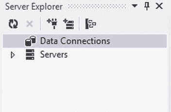
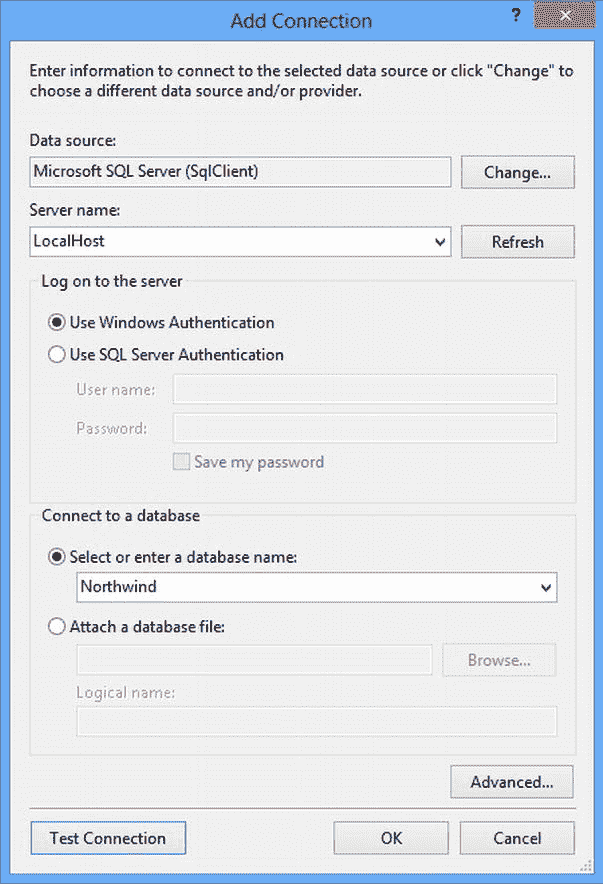
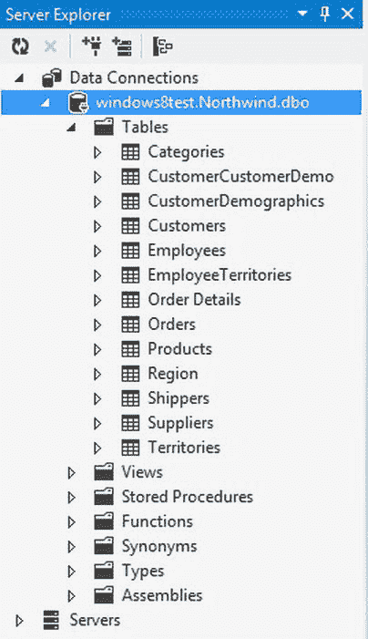
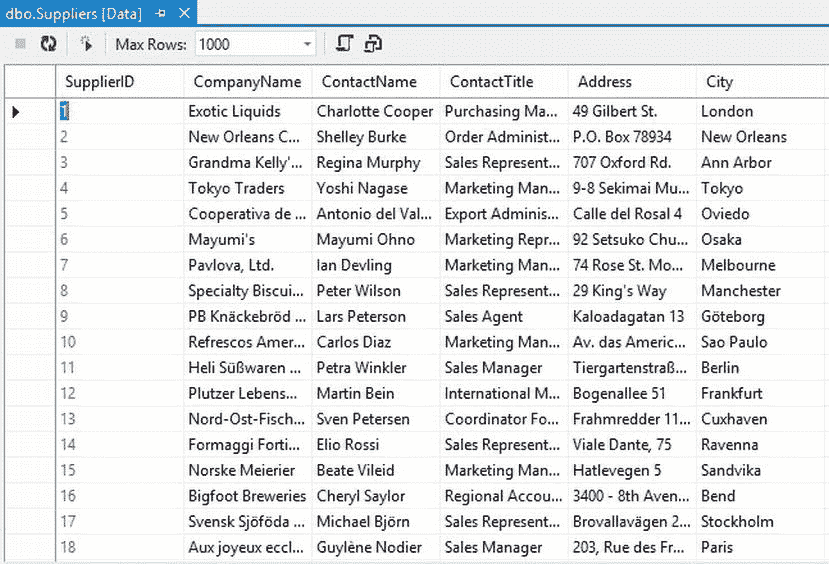

# 十九、附录三：安装所需的软件

我在这本书里包含了许多学习活动。为了从我讨论的主题中获得最大的收获，你应该完成这些活动。这是理论具体化的地方。我希望你能认真对待这些活动，并彻底完成它们，甚至反复完成。

第 1 部分中的 UML 建模活动是为使用 UMLet 的人准备的。我选择这个程序是因为它是一个很好的学习图表的工具。它使您能够创建 UML 图，而无需添加许多高级功能。 UMLet 是一个免费的开源工具，可以从`http://www.umlet.com`下载。但是你不需要一个工具来完成这些活动；纸和铅笔就可以了。

第 2 部分中的活动需要安装了 C# 的 Visual Studio 2012。您可以使用免费版的 Visual Studio 2012 Express，也可以使用试用版的 Visual Studio 2012 Professional。这些版本在`http://msdn.microsoft.com/en-us/vstudio/`有售。我鼓励你安装帮助文件，并在完成活动时充分利用它们。

第 3 部分中的活动需要 Microsoft SQL Server 2008 R2 或 SQL Server 2012。您可以使用免费版本的 SQL Server Express 或在`http://msdn.microsoft.com/en-us/sqlserver/`提供的 SQL Server 试用版。安装 SQL Server 时，请确保将自己添加为管理员。

安装示例数据库

安装本书中使用的示例数据库的脚本可以从`http://www.apress.com/9781430249351`下载(向下滚动并点击源代码选项卡)。为了安装脚本，请按照下列步骤操作:

1.  打开命令提示符窗口。
2.  在命令提示符下，使用 cd 命令导航到包含示例数据库脚本的文件夹。

    ```cs
    cd c:\SampleDatabases
    ```

3.  运行 `SQLCmd.exe`，指定`instOSODB.sql`为输入文件。
4.  要在默认实例上安装数据库，请使用

    ```cs
    SQLCmd.exe -E -i instOSODB.sql
    ```

5.  要在命名实例上安装数据库，请使用

    ```cs
    SQLCmd.exe -E -S ComputerName\InstanceName -i instOSODB.sql
    ```

6.  对`instpubs.sql`和`instnwnd.sql`文件重复上述步骤。

 **注意**您也可以使用 SQL Server Management Studio 来创建数据库。

验证数据库安装

要验证数据库安装:

1.  Start Visual Studio. If you don’t see the Server Explorer window shown in [Figure C-1](#Fig1), open it by choosing Server Explore on the View menu.

    

    [图 C-1](#_Fig1) 。服务器资源管理器窗口

2.  In the Server Explorer window, right-click the Data Connections node and select Add Connection. In the Add Connections dialog box shown in [Figure C-2](#Fig2), fill in the name of your server, select the Northwind database, and click OK.

    

    [图 C-2](#_Fig2) 。“添加连接”对话框

3.  Expand the Northwind database node and the Tables node in the Database Explorer window, as shown in [Figure C-3](#Fig3).

    

    [图 C-3](#_Fig3) 。展开“表”节点

     **注意**如果你正在使用 SQLExpress 你需要使用服务器名和实例名(LocalHost\SQLExpress)来连接。

4.  Right-click the Suppliers table node and select Show Table Data. The Suppliers table data should display as shown in [Figure C-4](#Fig4).

    

    [图 C-4](#_Fig4) 。查看表格数据

5.  重复这些步骤来测试`pubs`和`OfficeSupply`数据库。测试后，退出 Visual Studio。