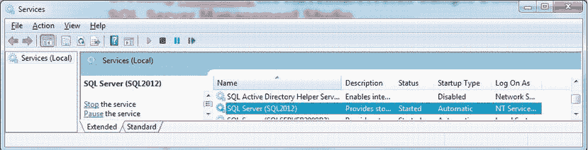
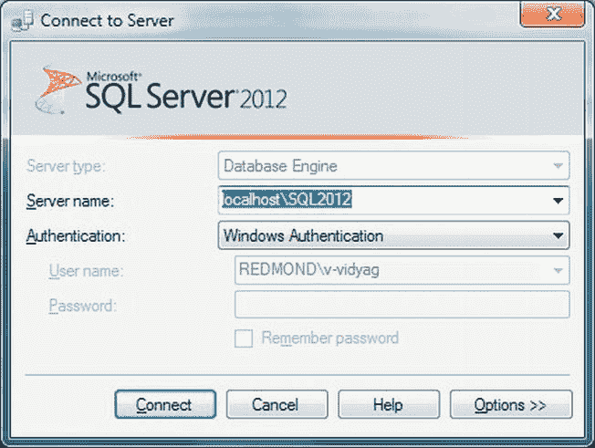
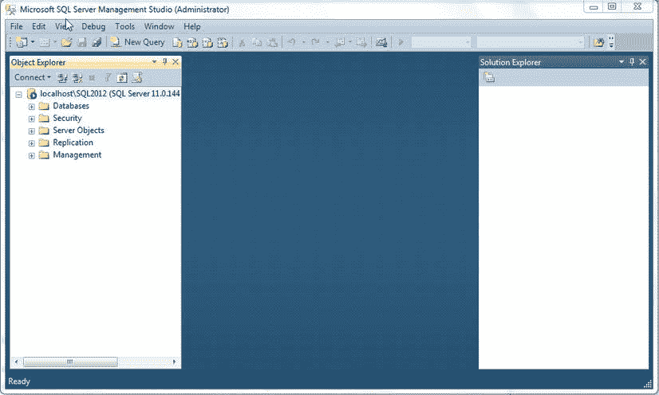
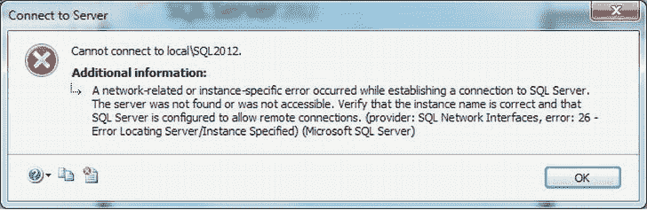
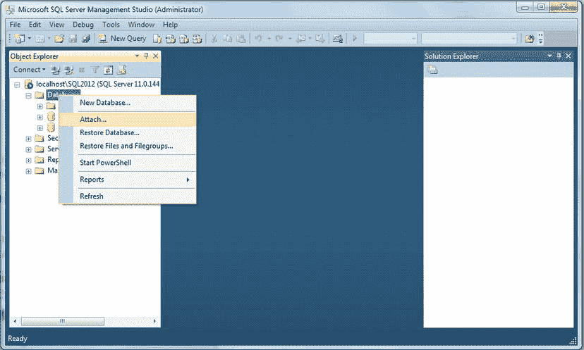
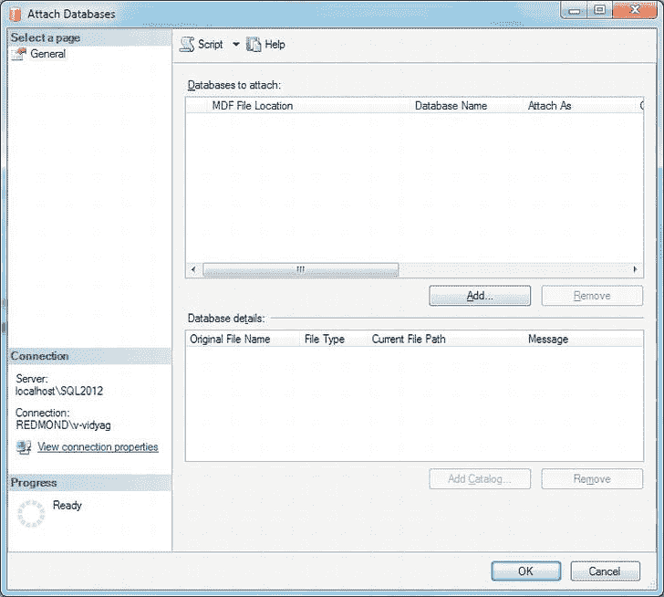
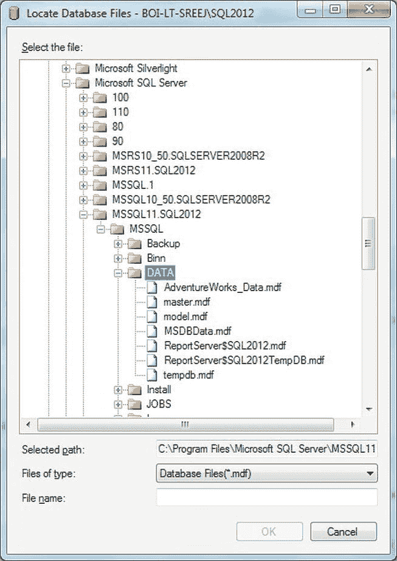
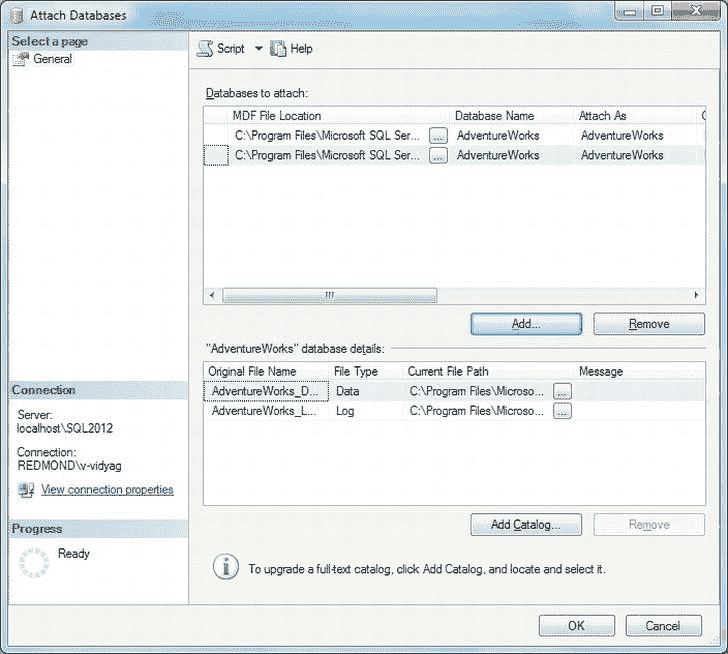
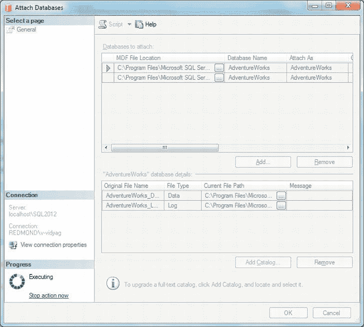
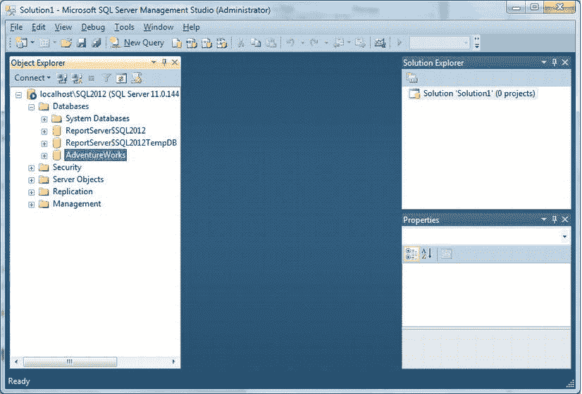

# 一、获取和了解您的工具

本书旨在帮助您学习如何使用 C# 2012 编程语言和 SQL Server 2012 数据库服务器应用构建面向数据库的应用。本书使用的开发工具是 Microsoft Visual Studio 2012 和 Microsoft SQL Server 2012(代号 Denali) Express edition，两者都与微软合作。NET 框架 4.5。

 **注意**对于本书来说，我使用的是可以从`[http://msdn.microsoft.com](http://msdn.microsoft.com)`下载的 Visual Studio 和 SQL Server 的免费版本。如果您正在使用这些工具的更全功能版本，您仍然可以遵循本书中的示例。

Visual Studio 2012 面向多个。NET Framework 版本，允许您为早期版本的。NET 框架，即。NET 2.0，。NET 3.0，。NET 3.5，还有。除了对. NET 4.0 的本地和默认支持之外。净 4.5。Visual Studio 集成开发环境(IDE)有助于开发人员提高工作效率，它提供了各种类型的应用模板和工具来执行大多数应用开发活动。

SQL Server 是目前最先进的关系数据库管理系统(RDBMSs)之一。SQL Server 继续提供并支持。NET 公共语言运行时(CLR)集成到 SQL Server 数据库引擎中，使得使用以. NET 语言(如 Visual C#)编写的托管代码实现数据库对象成为可能。除此之外，与以前的版本一样，SQL Server 附带了多种服务，如分析服务、数据转换服务、报告服务、通知服务、Service Broker、数据库邮件、PowerShell 支持等等。SQL Server 为数据库开发人员和数据库管理员(DBA)提供了一个通用的环境，即 SQL Server Management Studio (SSMS)。

SQL Server 2012 Express edition 是 SQL Server 2012 的关系数据库子集，提供 SQL Server 2012 Express 的几乎所有在线事务处理(OLTP)功能，支持最大 10GB 的数据库(每个 SQL Server 2012 Express 实例最多 32，767 个数据库)，并且可以处理数百个并发用户。

现在您已经对这些开发工具有了一些了解，您将学习如何获得和安装它们，并且您将学习使用本书中的示例所需的示例数据库。本章将涵盖以下内容:

> *   获取 Visual Studio 2012
> *   安装 SQL Server 2012 Express
> *   Troubleshooting SQL Server services
> *   Install AdventureWorks sample database

### 获取 Visual Studio 2012

本书要求在您的计算机上安装 Visual Studio 2012。在撰写本文时，Visual Studio 的可用版本是 Visual Studio 2012 Developer Preview。要查找有关 Visual Studio 2012 的下载信息，请访问`[http://msdn.microsoft.com/vstudio](http://msdn.microsoft.com/vstudio)`。

您也可以从 MSDN 订阅网站`[http://msdn.microsoft.com](http://msdn.microsoft.com)`直接下载安装程序 ISO 镜像文件。通过单击开发人员中心中的 Visual Studio 链接来访问可下载的安装文件；然后解压下载的文件，运行`Setup.exe`。

如果您有 Visual Studio 2012 的安装 DVD 或 CD，只需将 DVD 或 CD1 放入计算机的磁盘驱动器，并按照说明完成安装，确保 c 盘上有足够的磁盘空间。

Visual Studio 2012 有各种软件组件，所以您需要在安装 Visual Studio 时决定是否要安装它们。本书中的示例只需要 C# 语言组件，但您可能希望安装其他语言，如 VB。NET、VC++和 F# 等等，供你以后编程需要。

### 安装 SQL Server 2012 Express

为了完成本书中的示例，要安装 SQL Server 2012 Express，请按照下列步骤操作:

1.  Go to `[www.microsoft.com/betaexperience/pd/SQLEXPCTAV2/enus/default.aspx](http://www.microsoft.com/betaexperience/pd/SQLEXPCTAV2/enus/default.aspx)`. According to your CPU architecture, decide which version you need, 32-bit or 64-bit, and select Express with Tools from the drop-down list of products. Then click Download.
2.  The download manager will start running. If the download manager is not already installed on your computer, it will prompt you to install it. Click install.
3.  Depending on whether you choose the 32-bit or 64-bit version, you will be prompted to save the file `SQLEXPRWT_x86_ENU.exe` or `SQLEXPRWT_x64_ENU.exe`, which is the installation utility of SQL Server 2012 Express.
4.  Save this file to a location on the host computer (such as the desktop). When the file download is complete, click Close.
5.  Run the file to start the installation, and follow the steps to install.
6.  When the Completing SQL Server Management Setup window appears, click the Finish button.
7.  安装成功后，您会在开始所有程序 Microsoft SQL Server 2012 菜单中看到所有 SQL Server 组件已安装。确保您的 SQL Server 服务正在运行是很重要的，因此要验证这一点，您需要调用服务列表。转到开始。运行。 Services.msc 或控制面板管理工具服务。将加载一个服务窗口；向下滚动直到看到列出的 SQL Server 服务，如图[图 1-1](#fig_1_1) 所示。

    ***图 1-1。**服务窗口显示数据库服务正在运行*

8.  Pay attention to the name in brackets (your SQL instance name). This may vary from machine to machine; Therefore, it is very important to know the name of the SQL instance before connecting to it to continue using SQL Server. If you have multiple versions of SQL Server, multiple SQL Server services will be listed, and you need to know the SQL Server 2012 instance name to use.
9.  If the SQL Server service is not running, you can start it manually by right-clicking and selecting Start. Then, your service should be listed as "Started" under "Status". This service must be running before any database-related operations can be performed.

同样，您需要记住在安装过程中使用的 SQL Server 实例名，以便能够顺利地连接和构建数据库应用。

因为 SQL Server 2012 没有附带示例数据库，所以您需要单独安装和配置示例数据库。下一节将介绍如何在 SQL Server Management Studio 中安装和配置 AdventureWorks 数据库。

### 安装并附加 AdventureWorks 示例数据库

出于数据库查询的目的，并且为了用 C# 构建数据库应用，您需要一个数据库。出于这些目的，本书将使用 AdventureWorks for SQL Server 2012 版本。

#### 安装 AdventureWorks 数据库

要安装数据库，请按照下列步骤操作:

1.  转到`[http://msftdbprodsamples.codeplex.com/releases/view/4004](http://msftdbprodsamples.codeplex.com/releases/view/4004)`，点击链接 adventureworksdb。中规模集成电路（medium-scale integration 的缩写）
2.  Click I agree to the license agreement; You will be prompted to run or save the `AdventureWorksDB.msi` file to your system.
3.  Change the location where files are saved; You can save it anywhere in the computer system, but it is recommended that you save it with other database files under the instance of SQL Server, which will be located at `C:\Program Files\Microsoft SQL Server\MSSQL11.<your SQL Server 2012 instance name>\MSSQL\DATA`. You can verify the folder name of your SQL instance by looking at the name on your machine; As shown in Figure [, Figure 1-1](#fig_1_1) , the name you see in system brackets will be the name of the folder where you might want to save the database files.
4.  If you can't find the folder location mapped to the SQL Server instance, you can choose to save the file anywhere on the system.
5.  After selecting the file location, the setup wizard will take the `AdventureWorks_Data.mdf` and `AdventureWorks_Log.ldf` files to the location you specified. After successfully installing the files, click Finish to close the wizard.

#### 附加 AdventureWorks 示例数据库

*Attach* 是用于将`.mdf`文件关联到数据库服务器的过程，这样您就可以开始处理与表相关联的数据库对象和数据。

您需要访问 SQL Server Management Studio 来附加 AdventureWorks2008 数据库。为此，请按照下列步骤操作:

1.  Make sure you know the name of the instance of SQL Server running SQL Server; In my example, it is SQL2012, as you saw in [Figure 1-1](#fig_1_1) earlier. You can check your instance name as described earlier.
2.  从您安装的 SQL Server 2012 应用中打开 SQL Server Management Studio，在“连接到服务器”对话框中，输入 **localhost\ <您的服务器名称>** 作为服务器名称(参见[图 1-2](#fig_1_2) )。在某些情况下，您可能会看到 *localhost* 被一个点(.)或者真机名。(您可以从计算机属性中查看机器名称。)

    ***图 1-2。**连接到服务器对话框*

3.  As shown in Figure [Figure 1-2](#fig_1_2) , set the following options:
    1.  Set the server type as the database engine.
    2.  Set the server name to localhost \ . For me, as shown in [Figure 1-1](#fig_1_1) , the name is SQL2012, then the server name is localhost\SQL2012\. Also note that the server name is case insensitive; You can type any case (lowercase or uppercase).
    3.  Set the authentication to Windows authentication. This is the default authentication type used when SQL Server is installed. This indicates that the login user name of the computer will be reserved to connect to SQL Server.
    4.  Set the user name to the user credentials required to connect to SQL Server. Many SQL Server databases have Windows authentication installed, so you will see that the login user name of the same computer is added here by default. In many cases, it may be an administrator or a unique name, as you can see in [Figure 1-2](#fig_1_2) , namely Redmond\v-vidyag.
4.  点击连接按钮，你将被带到 SQL Server Management Studio，它看起来会像[图 1-3](#fig_1_3) 。

    ***图 1-3。** SQL Server Management Studio 成功连接到数据库数据库引擎后*

5.  If an error occurs after clicking the "Connect" button in the "Connect to Server" dialog box, instead of the window shown in Figure [, Figure 1-3](#fig_1_3) , it will look like [, Figure 1-4](#fig_1_4) .

***图 1-4。**连接到服务器*时出错

您收到此错误可能有以下几个原因:

> *   The SQL Server service instance name you provided (in this case, SQL2012) is not running.
> *   The machine name you used to specify the SQL instance is incorrect. The error in figure 1-3 shows that I used "local \ SQ2012" as "machine name \ instance name", which is incorrect unless the machine name is local (in this case, the SQL Server instance name is incorrect).
> 
> 1.  To fix the error, specify the correct parameters, check whether the SQL Server service is started, or pass the correct computer name.
> 2.  成功加载 SSMS 后，下一步是附加您已经下载的示例数据库 AdventureWorks2008R2。为此，右击数据库节点并选择附加，如图[图 1-5](#fig_1_5) 所示。
>     
>     ***图 1-5。**准备连接数据库*
>     
>     
> 3.  Click Additional Options, and the Additional Database dialog box will appear, as shown in figure [and figure 1-6](#fig_1_6) .  T33 T35】T36 】 Figure 1-6\. Attach database dialog box
> 4.  Click [Add], and a window will open to provide `.mdf` files for the database, as shown in figure [and figure 1-7](#fig_1_7) .  T45 T47】T48 】 Figure 1-7\. Locate database file dialog box
> 5.  As you can see, I was taken to the `DATA` folder of the SQL2012 instance of SQL Server 2012, because this is my connection. You can also see the `AdventureWorks2008_Data.mdf` file listed under `DATA`, because I saved it in this location.
> 6.  选择`AdventureWorks2008_Data.mdf`，点击确定；你会看到一个类似于图 1-8 所示的屏幕。
>     
>     ***图 1-8。**选择`.mdf`数据库文件附加数据库*
>     
>     
> 7.  可以看到，文件数据和日志都被选中；单击确定。如果要求您确认是否添加了全文目录，请单击“确定”。这将让你继续数据库连接过程，一个显示“正在执行”的窗口将会打开，如[图 1-9](#fig_1_9) 左下方所示。
>     
>     ***图 1-9。**正在附加数据库*
>     
>     
> 8.  Once this execution process is completed, you will be able to see AdventureWorks under the Databases node in SQL Server Management Studio, as shown in Figure 1-10\.  T83 T85】T86 】 Figure 1-10 Listed in the database.
> 
> ### 总结
> 
> 在本章中，您通过安装 Visual Studio 2012、SQL Server 2012 和示例 AdventureWorks 数据库来准备开发环境。您还使用 SQL Server Management Studio 在 SQL Server 2012 中附加 AdventureWorks 数据库。
> 
> 现在您已经有了工具，是时候熟悉它们了。