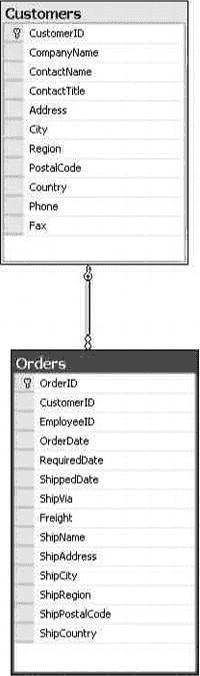
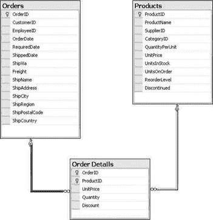

# 二、理解关系数据库

既然您已经了解了您将在本书中使用的工具，我将后退一步，简要介绍数据库领域的重要基础概念。

在本章中，我将介绍以下内容:

> *   What is a database?
> *   Choose between a spreadsheet and a database
> *   Why use the database?
> *   Benefits of using relational database management system
> *   Compare desktop and server RDBMS systems
> *   life cycle of database
> *   Mapping cardinality
> *   Understanding keywords
> *   Understanding data integrity
> *   Standardized concept
> *   Disadvantages of standardization

### 什么是数据库？

简单来说，*数据库*是结构化信息的集合。数据库是专门为管理大量信息而设计的，它们以一种有组织、有结构的方式存储数据，使用户在需要时可以方便地管理和检索数据。

数据库管理系统(DBMS)是一个软件程序，使用户能够创建和维护数据库。DBMS 还允许用户为单个数据库编写查询，以执行所需的操作，如检索数据、修改数据、删除数据等。

DBMSs 支持*表*(又名*关系*或*实体)*在*行*(又名*记录*或*元组)*和*列*(又名*字段*或*属性*)中存储数据，类似于数据在电子表格应用中的显示方式。

关系数据库管理系统(RDBMS)是一种以相关表的形式存储信息的 DBMS。RDBMS 基于*关系模型。*

### 在电子表格和数据库之间选择

如果数据库很像电子表格，为什么人们还在使用数据库应用？数据库设计用于以比电子表格应用更容易和更高效的方式执行以下操作:

> *   Retrieve all records that meet certain criteria.
> *   Update or modify a complete set of records at a time.
> *   Extract values from records distributed in multiple tables.

### 为什么要使用数据库？

以下是您使用数据库的一些原因:

> *   *Compactness* : The database helps you maintain a large amount of data, thus completely replacing the voluminous paper documents.
> *   *Speed* : Searching for a specific piece of data or information in a database is much faster than classifying it in a sheet piling.
> *   *Less drudgery* : Maintaining files manually is a boring job; Using the database completely eliminates this maintenance.
> *   *Currency* : The database system can be easily updated, so it can provide accurate information at any time as required.

### 使用关系数据库管理系统的好处

RDBMSs 通过控制以下各项提供了各种好处:

> *   *Redundancy [T1】 :RDBMS prevents you from having duplicate copies of the same data and occupying disk space unnecessarily.*
> *   *Inconsistent* : The redundant data of each group may no longer be consistent with the same data of other groups. When RDBMS removes redundancy, inconsistency will not occur.
> *   *Data integrity* : The data values stored in the database must meet some kind of consistency constraint. (I will discuss this benefit in more detail in the section "Understanding Data Integrity" later in this chapter. )
> *   *Data atomicity* : When a fault occurs, the data is restored to the consistent state before the fault. For example, capital transfer activities must be atomic. (I will introduce the activity and atomicity of capital transfer in more detail in Chapter 6\. )
> *   *Access Exception [T1】 :RDBMS prevents multiple users from updating the same data at the same time; This concurrent update may lead to data inconsistency.*
> *   *Data security* : Not every user of the database system should be able to access all data. Security refers to protecting data from any unauthorized access.
> *   *Transaction [T2】: 【T3] Transaction is a series of database operations, representing a logical work unit. In RDBMSs, the transaction either commits all the changes or rolls back all the executed operations until the failure occurs.*
> *   *Recovery* : The recovery feature ensures that after the transaction fails, the data is reorganized into a consistent state.
> *   *Storage management [T1】 :RDBMS provides a mechanism for data storage management. The internal schema defines how data should be stored.*

### 比较桌面和服务器 RDBMS 系统

在当今的行业中，您将主要使用两种类型的数据库:桌面数据库和服务器数据库。在这里，我会给你一个简单的介绍。

#### 桌面数据库

桌面数据库被设计为服务于有限数量的用户，并且运行在桌面 PC 上，它们在任何需要数据库的地方提供了一个不太昂贵的解决方案。你有可能使用过桌面数据库程序；Microsoft SQL Server Express、Microsoft Access、Microsoft FoxPro、FileMaker Pro、Paradox 和 Lotus 都是桌面数据库解决方案。

桌面数据库在以下方面不同于服务器数据库:

> *   *Not too expensive* : Most desktop solutions cost only a few hundred dollars. In fact, if you have a licensed version of Microsoft Office Professional, you are already the licensed owner of Microsoft Access, which is one of the most commonly used and widely used desktop database programs.
> *   *User-friendly* : Desktop databases are quite user-friendly and easy to operate, because they do not need complex SQL queries to perform database operations (although some desktop databases also support SQL syntax if you want to write code). The desktop usually provides an easy-to-use graphical user interface.

#### 服务器数据库

服务器数据库是专为同时为多个用户服务而设计的，它提供的功能允许您通过同时为多个用户请求服务来非常高效地管理大量数据。众所周知的服务器数据库示例包括 Microsoft SQL Server、Oracle、Sybase 和 DB2。为了在本书中构建数据库应用，我们将使用 SQL Server 2012 作为数据库应用。一旦你学会了如何用某个数据库构建一个应用，用其他数据库来构建你的应用也就不难了。

以下是服务器数据库区别于桌面数据库的一些其他特征:

> *   *Flexibility* : The server database is designed very flexibly, supports multiple platforms, responds to requests from multiple database users, and performs any database management tasks at the best speed.
> *   *Availability* : The server database is enterprise-oriented, so it needs to be available around the clock. In order to be always available, the server database comes with some high-availability functions, such as mirroring and log shipping.
> *   *Performance* : Server databases usually have huge hardware support, so the servers running these databases have a lot of RAM and multiple CPUs. This is why the server database supports rich infrastructure and provides the best performance.
> *   *Scalability* : This attribute allows the server database to expand its ability to process and store records, even though it has grown very fast.

### 数据库生命周期

数据库生命周期定义了从概念到实现的完整过程。这个周期的开发和实施过程可以分为几个小阶段；只有完成每个阶段后，你才能进入下一个阶段。

在开始开发任何系统之前，您需要有一个强大的生命周期模型来遵循。模型必须以正确的顺序定义所有的阶段，这将帮助开发团队构建问题更少、功能更全的系统。

数据库生命周期由以下阶段组成，从设计数据库全局模式的基本步骤到数据库的实现和维护:

> *   *Requirement analysis* : Before starting the design and implementation, it is necessary to determine the requirements. Demand can be collected by interviewing producers and users of data; This process helps to create formal requirements specifications.
> *   *Logic design* : After requirements are collected, conceptual data modeling techniques (such as entity-relationship (er) diagram) are needed to define data and relationships. This figure shows how one object will be connected to another object, and through what relationship (one-to-one or one-to-many). Relations will be explained later in this chapter.
> *   *物理设计*:一旦逻辑设计就绪，下一步就是为数据库生成物理结构。物理设计阶段包括创建表和选择索引。对索引的介绍超出了本书的范围，但是索引基本上就像一本书的索引，它允许您根据您选择的主题跳转到特定的页面，并帮助您避免为了到达感兴趣的页面而翻动书的所有页面。数据库索引做类似的事情；它们管理和维护插入表中的行的顺序，这有助于 SQL 查询根据为索引列提供的值快速提取数据。
>     
>     T19】数据库实现:一旦设计完成,就可以通过使用关系型数据库管理系统的数据定义语言(DDL)实现正式模式来创建数据库 DDL。由在创建、修改和删除数据库或数据库对象中起关键作用的语句组成. . .`CREATE`、`ALTER`和`DROP`是数据定义语言的主要例子
>     
>     
> *   *Data modification* : A data modification language (DML) can be used to query and update databases, as well as to establish indexes, reference integrity and other constraints. DML consists of statements that play a key role in inserting, updating and deleting data in database tables. `INSERT`, `UPDATE` and `DELETE` are typical examples of DDL.
> *   *Database monitoring* : When the database starts running, whether the monitoring indication meets the performance requirements; If not, it should be modified to improve the database performance. Therefore, the database life cycle continues to be monitored, redesigned and modified.

### 映射基数

表是关系数据库的基本组成部分。事实上，数据和关系都只是作为数据存储在表中。表格由行和列组成。每一列代表一条信息。

*映射基数，*或*基数比，*表示另一个实体可以通过关系集关联的实体的数量。*基数*是指包含在数据库表的特定列中的数据值的唯一性。术语*关系数据库*指的是不同的表经常包含相关的数据。例如，一个公司的销售代表可能接受许多客户下的订单。订购的产品可能来自不同的供应商，并且每个供应商有可能供应一种以上的产品。所有这些关系几乎存在于每个数据库中，可以分类如下:

> *一对一(1:1)* :对于表 A 中的每一行，在表 B 中最多只有一个相关行，反之亦然。这种关系通常用于按使用频率分隔数据，以优化数据的物理组织。例如，一个部门只能有一个部门负责人。
> 
> *一对多(1:M)* :对于表 A 中的每一行，表 B 中可以有零个或多个相关行；但是对于表 B 中的每一行，表 a 中最多有一行，这是最常见的关系。[图 2-1](#fig_2_1) 显示了 Northwind 中表的一对多关系的例子。注意 Customers 表有一个 CustomerID 字段作为*主键*(由左边的钥匙符号表示)，它与 Orders 表的 CustomerID 字段有关系；CustomerID 被视为 Orders 表中的外键。Customers 表和 Orders 表之间显示的链接表示一对多关系，因为许多订单可以属于一个客户。在这里，Customers 被称为*父*表，Orders 是关系中的*子*表。

***图 2-1。**一对多关系*

> *多对多(M:M)* :对于表 A 中的每一行，表 B 中有零个或多个相关行，反之亦然。多对多关系不是那么容易实现的，它们需要一种特殊的技术来实现。这种关系实际上是以一对多的格式实现的，所以它需要引入第三个表(通常称为*连接表)*，作为相关表之间的路径。

这是一种很常见的关系。[图 2-2](#fig_2_2) 展示了一个来自 Northwind 的例子:一个订单可以有很多产品，一个产品可以属于很多订单。Order Details 表不仅表示 M:M 关系，还包含关于每个特定订单-产品组合的数据。

***图 2-2。**多对多关系*

 **注**虽然表之间的关系极其重要，但术语*关系数据库*与它们毫无关系。关系数据库(在不同程度上)基于 IBM 的 Edgar F. Codd 博士在 20 世纪 70 年代发明的*数据关系模型*。Codd 的模型基于一个*关系的数学(集合论)概念。*关系是元组的集合，可以用一组定义明确、行为良好的数学运算来操作——实际上是两组:*关系代数*和*关系演算。*使用关系数据库不需要知道或理解数学，但是如果你听到有人说数据库是关系型的，因为它“将数据联系起来”，你就会知道说这话的人并不了解关系型数据库。

### 了解钥匙

> 钥匙，整把钥匙，除了钥匙什么也没有，所以请帮我编码。

关系由表中的数据表示。要在两个表之间建立关系，需要在一个表中有数据，以便能够在另一个表中找到相关的行。这就是*键*的用武之地，RDBMS 主要处理两种类型的键，如前所述:主键和外键。

关键字是用于标识行的关系的一列或多列。

#### 主键

主键是一个属性(列)或属性(列)的组合，其值唯一地标识实体中的记录。

在为实体选择主键之前，属性必须具有以下属性:

> *   Each record of the entity must have a non-null value.
> *   The value of each record entered in the entity must be unique.
> *   During the life cycle of each entity instance, these values cannot be changed or empty.
> *   An entity can only define one primary key.

除了有助于唯一标识记录之外，主键还有助于搜索记录，因为当您将主键分配给属性时，索引会自动生成。

一个实体将有多个属性可以作为主键。任何可能成为主键的键或最小键集被称为*候选键。*确定候选关键字后，为每个实体选择一个且仅一个主键。

有时需要不止一个属性来唯一标识一个实体。由多个属性组成的*主键*被称为*组合键。*一个实体中只能有一个*主键*，但是一个*组合键*可以有多个属性(换句话说，一个*主键*只会被定义一次，但是最多可以有 16 个属性)。主键代表父实体。主键通常用`IDENTITY`属性定义，当您向表中插入一行时，该属性允许向表中插入一个自动递增的整数值。

当一个额外的属性是一个 identity 属性并被添加到一个列中时，它被称为*代理键*。这种列的值是在运行时插入记录之前生成的，然后存储到表中。

#### 外键

*外键*是通过标识父实体来完成关系的属性。外键提供了一种方法来维护数据的完整性(称为*参照完整性)*，并在一个实体的不同实例之间导航。模型中的每个关系都必须由外键支持。例如，在前面的[图 2-1](#fig_2_1) 中,“客户”和“订单”表有一个主键和外键关系，其中“订单”表的“客户 ID”字段是外键，它引用了“客户”表的“客户 ID”字段。

### 了解数据完整性

*数据完整性*是指数据库中的数据值是正确且一致的。数据完整性有两个方面:*实体完整性*和*参照完整性*。

#### 实体完整性

我们之前在“主键”中提到过，主键的任何部分都不能为空。这是为了保证所有行都有主键值。主键值存在并且唯一的要求被称为*实体完整性* (EI)。DBMS 通过不允许操作(`INSERT`、`UPDATE`)产生无效的主键来加强*实体完整性*。任何创建重复的主键或包含空值的操作都会被拒绝。也就是说，要建立实体完整性，您需要定义主键，这样 DBMS 就可以强制实现它们的唯一性。

#### 参照完整性

一旦在具有外键的表之间定义了关系，就必须对键数据进行管理以维护正确的关系，也就是说，实施*参照完整性* (RI)。RI 要求子表中的所有外键值要么匹配父表中的主键值，要么(如果允许的话)为 null。这也被称为满足*外键约束。*

### 标准化概念

*规范化*是一种避免潜在更新异常的技术，基本上是通过最小化逻辑数据库设计中的冗余数据。规范化设计在某种意义上是“更好”的设计，因为它们(理想地)将每个数据项保存在一个地方。规范化的数据库设计通常会降低更新处理成本，但会使查询处理变得更加复杂。必须根据数据库所需的性能来仔细评估这些权衡。通常，数据库设计需要*非规范化*以充分满足操作需求。

规范化逻辑数据库设计涉及一组正式的过程，将数据分成多个相关的表。每个过程的结果被称为*范式。*理论上已经确定了五种范式，但是大多数时候第三范式(3NF)是你在实践中需要走的最远的。要在 3NF 中，一个*关系*(SQL 称之为表的正式术语和规范化的数学理论所依赖的精确概念)必须已经处于第二范式(2NF)，而 2NF 要求一个关系处于第一范式(1NF)。让我们简单看一下这些范式的含义:

> *第一范式(1NF)* :在第一范式中，所有列值都是*标量*；换句话说，它们只有一个值，不能根据数据模型进一步分解。例如，虽然字符串的单个字符可以通过分解字符串的过程来访问，但是在 SQL 中只有完整的字符串可以通过名称来访问*，所以就数据模型而言，它们不是模型的一部分。同样，对于一个包含一个经理列和一个包含雇员表中为给定经理工作的雇员列表的经理表，可以通过名称访问经理和列表，但不能访问列表中的单个雇员。根据定义，所有关系和 SQL 表都在 1NF 中，因为最低级别的可访问性(称为表的*粒度)*是列级别，列值是 SQL 中的标量。*
> 
> *第二范式(2NF)* :第二范式要求不属于键*的*属性*(SQL 列的正式术语)在功能上依赖于唯一标识它们的键*。函数依赖基本上意味着对于给定的键值，一个表中的一列或一组列只存在一个值。例如，如果一个表包含雇员和他们的职位，并且不止一个雇员可能有相同的职位(很可能)，唯一标识雇员的键不会唯一标识职位，因此职位在功能上不会依赖于表的键。要将表放入 2NF，您需要为标题创建一个单独的表——使用它自己的惟一键——并用新表的外键替换原始表中的标题。请注意这是如何减少数据冗余的。标题本身现在只在数据库中出现一次。只有它们的键出现在其他表中，键数据不被认为是冗余的(当然，它需要其他表中的列和数据存储)。
> 
> *第三范式(3NF)* :第三范式将函数依赖的概念扩展到了*全函数依赖。*本质上，这意味着表中的所有非键列都由整个主键唯一标识，而不仅仅是主键的一部分。例如，如果您将假设的 1NF manager-Employees 表修改为包含三列(ManagerName、EmployeeId 和 EmployeeName)而不是两列，并且将复合主键定义为 ManagerName + EmployeeId，则该表将位于 2NF 中(因为 EmployeeName 这一非键列依赖于主键)，但不会位于 3NF 中(因为 EmployeeName 由定义为 EmployeeId 列的主键的一部分唯一标识)。为 employees 创建一个单独的表并从 Managers-Employees 中删除 EmployeeName 会将该表放入 3NF 中。注意，即使这个表现在被规范化为 3NF，数据库设计仍然没有达到应有的规范化程度。使用比经理姓名更短的 ID 为经理创建另一个表，虽然这不是这里的规范化所必需的，但绝对是一种更好的方法，对于现实世界的数据库来说可能是可取的。

### 规范化的弊端

数据库设计与其说是技术，不如说是艺术，明智地应用规范化总是很重要的。另一方面，规范化本质上增加了表的数量，因此也增加了检索数据所需的操作(称为*连接)*的数量。因为数据不在一个表中，所以具有复杂连接的查询会降低速度。这可能以 CPU 使用率的形式来消耗:查询越复杂，需要的 CPU 时间就越多。

*通过有意提供冗余数据来减少连接的数量或复杂性以获得更快的查询响应时间，对一个或多个表进行反规范化*可能是必要的。无论是规范化还是反规范化，目标都是控制冗余，以便数据库设计能够充分地(理想情况下是最佳地)支持数据库的实际使用。

### 总结

本章解释了基本的数据库概念。您还了解了桌面和服务器数据库、数据库生命周期的各个阶段、键的类型以及它们如何定义关系。您还了解了用于设计更好的数据库的规范化表单。

在下一章中，您将开始创建数据库并操作数据和对象。