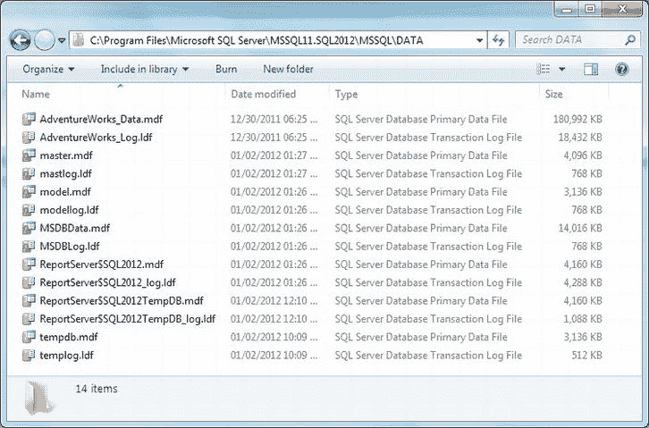
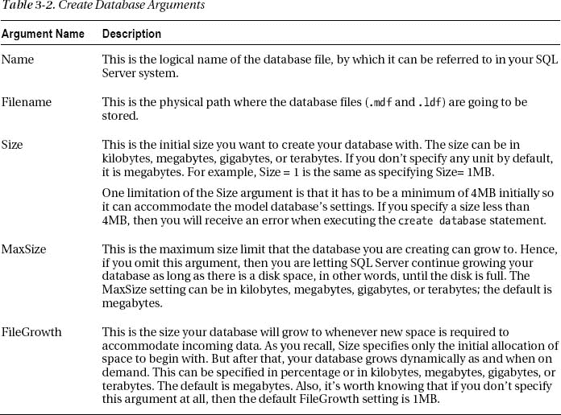

# 三、创建数据库和表

开发应用时，通常需要创建一个数据库并向其中添加表，而不仅仅是使用现有的数据库和表对象。本章是关于创建一个新的数据库，然后创建它包含的表。

在本章中，我将介绍以下内容:

> *   启动 SQL Server Management Studio
> *   Type of SQL Server database
> *   Schema of SQL Server database
> *   Create a database in a simple way.
> *   Create a database with your own settings
> *   Create table

### 启动 SQL Server Management Studio

自 2005 年以来，SQL Server Management Studio (SSMS)一直是 SQL Server 的主要开发工具。您可以使用 SSMS 来实现、开发和管理数据库。当然，因为这本书是给应用开发者看的，所以我们的重点将放在开发上。

正如在第 1 章的[中所提到的，在成功连接 SSMS 的数据库引擎并开始创建自己的数据库和表之前，启动 SQL Server 服务是非常重要的。](01.html)

要启动 SSMS，请选择所有程序 Microsoft SQL Server 2012 SQL Server Management Studio。确保“连接到服务器”对话框具有正确的值，然后单击“连接”。这将启动 SQL Server Management Studio。

### SQL Server 数据库的类型

SQL Server 有两种类型的数据库:系统数据库和用户数据库。

> *   System databases are those pre-installed in all versions of SQL Server. When you perform tasks such as creating, maintaining and managing databases, they support SQL Server database systems. They are located in the system database folder and named as master, model, msdb and tempdb, as shown in Figure [and Figure 3-1](#fig_3_1) .

***图 3-1。** SQL Server 系统数据库*

[表 3-1](#tab_3_1) 描述了 SQL Server 的各个系统数据库，如图[图-3-1](#fig_3_1) 所示。

> *   The user database can be either an example database such as AdventureWorks (which you downloaded and attached in Chapter 1 of [) or any SQL Server database created anywhere in any SQL Server system, including the database where you or your organization are building applications. Some sample databases provided by Microsoft are pubs, northwind and AdventureWorks. Since you have attached AdventureWorks to your SQL Server 2012, it will be listed in Object Explorer, as shown in Figure T2 and Figure 3-2 and T3.](01.html)

***图 3-2。** SQL Server 用户数据库*

接下来，您创建的数据库将成为用户数据库，列在系统数据库文件夹之后。这里值得一提的是，您无法创建自己的系统数据库或创建一个数据库并将其放在 System Databases 文件夹中。

### SQL Server 数据库的架构

SQL Server 2012 数据库由数据和日志信息组成。这些数据和日志信息存储在单独的文件中。

> *   *Master data file* : This is the master file for constructing SQL Server database, because it points to other files in the database. The file extension required for this file is `.mdf`, and a SQL Server database can only have one master data file.
> *   *Log data file* : This is a recovery file that stores all log information and is used to recover the database when it fails. The file extension required for this file is `.ldf`. Any database must contain at least one log file, but a database can have multiple log files.

 **注意**还有第三种类型的文件，称为*二级数据文件*，那也是用来存储数据信息的，由一级数据文件指向。一个数据库可以有多个数据文件，一个数据文件需要的扩展名是`.ndf`。因为大多数工业数据库都是由主文件和日志文件组成的，所以我不包括关于辅助文件的更多细节，而是将重点放在主文件和日志文件上。你可能想在`[http://msdn.microsoft.com](http://msdn.microsoft.com)`了解更多。

每个数据库由`.mdf`和`.ldf`文件组成的事实适用于系统数据库和用户数据库。要看到这一点，去你的程序文件下的 SQL Server 文件夹(见[第 1 章](01.html)关于如何找到你的 SQL Server 文件夹路径的信息)；到达 SQL Server 位置后，您将看到数据库文件。在我的例子中，我的 SQL 文件夹路径显示了[图 3-3](#fig_3_3) 中的文件。

***图 3-3。** SQL Server 数据库文件*

该文件夹列出了构成 SQL Server 数据库的所有`.mdf`和`.ldf`文件名，包括系统和用户数据库。例如，参考`master.mdf`和`master.ldf`并在右边的类型栏中查看这些文件的描述。此外，您可以看到您在第 1 章的[中附加的 AdventureWorks 数据库也在此列出，并附有相关的`.mdf`和`.ldf`文件。现在，如果您继续使用 SQL Server 的这个特定实例，您的所有数据库都将位于同一位置。](01.html)

 **注**将[图 3-3](#fig_3_3) 所示的文件夹结构与你的文件夹进行比较。它可能会显示一组不同的数据库文件，尤其是用户数据库和一些 SQL Server 功能，如 Reporting Services。因此，您的 SQL Server 系统视图可能与图中不同。

### 以简单的方式创建数据库

要开始创建数据库，如果 SSMS 尚未打开，您需要将其打开。

然后点击新建查询，你应该会看到一个类似于图 3-4 的窗口。

***图 3-4。** SQL Server Management Studio:新查询窗格*

在 SQL Server 2012 的发布中，SSMS 有了新的外观和感觉；实际上，微软已经为 SQL Server 2012 使用了 Visual Studio IDE，所以如果你以前使用过 Visual Studio 2010，你会发现它很相似。如果你还没有使用过 Visual Studio 2010，那么当我们在本书后面开始使用 Visual Studio 2012 编写 C# 代码时，你会看到用户界面是相似的。

要以简单的方式创建数据库，请按照下列步骤操作:

1.  Make sure that your new query pane shows the main database just below the save icon on the toolbar.
2.  Go to the query pane and make sure that you are in the main database, type the following: `use master`
3.  Select the statement, and then click Execute or press F5; You should see the message "Command completed successfully"
4.  Now press Enter to add a new line and type the following: `create database MySQLDb`
5.  In this example, we are creating a new database named MySQLDb. Remember, SQL Server is case insensitive, so no matter how you type SQL statements, they will work normally.
6.  After entering the `create` statement, select this newly added `create` statement and press Execute or F5\. When you look at the list of databases in the databases folder in Object Explorer, you should see the MySQLDb database just created, as shown in Figure T2 and Figure 3-5 T3.

***图 3-5。**以简单的方式创建 SQL Server 数据库*

这个新创建的数据库与任何其他数据库没有什么不同，因为它将由`.mdf`和`.ldf`文件组成。通过使用这个一行 SQL 语句…

`Create Database database-name`

您已经将控制权交给 SQL Server，让它代表您使用自己的预定义设置来创建文件。但是这种方法有局限性:

> *   It stores data and log files in the same disk under Program Files \ Microsoft SQL Server; What should I do if you want to separate the log file from the data file and put it on another disk or folder?
> *   By default, data and log files are given the freedom to continue to grow until the disk is full; In other words, they have unlimited access to disk space. In real-world organizations, managing storage is very important, so there is a size limit for the database.

### 探索数据库属性

创建数据库后，有时您会想知道它的属性，如文件名、路径、大小等等。按照以下步骤浏览数据库属性:

1.  Right-click the newly created database MySqlDb in Object Explorer and select Properties.
2.  转到左侧的文件选项卡。在执行前面显示的一行数据库创建语句时，您将看到 SQL Server 为您选择的设置。数据库属性对话框将看起来像[图 3-6](#fig_3_6) 。

    ***图 3-6。**探索数据库属性*T12

### 用自己的设置创建数据库

有时，您希望能够控制数据库的创建，以便能够控制诸如数据库可以增长到的最大大小、初始数量被消耗后的增长量，甚至是数据和日志文件的位置/文件夹。表 3-4 显示了您可以使用的参数。

现在，让我们尝试在 SQL 查询语法中使用[表 3-2](#tab_3_2) 中讨论的参数，用您的参数值创建一个数据库。请遵循以下步骤:

1.  Make sure that the new query pane displays the main database under the Save icon on the toolbar.
2.  Go to the query pane and make sure that you are in the main database, type the following: `use master`
3.  Select the statement, and then click Execute or press F5; You should see the message "Command completed successfully"
4.  现在回车添加一个新行，并键入`create database`语句，如下图所示。

     **注意**请注意下面代码中`FileName`参数中的粗体文本；这表示您的 SQL Server 2012 实例名称。建议你通过资源管理器浏览到你的数据库文件夹位置,如图[图 3-3](#fig_3_3) 所示,然后复制粘贴`FileName`参数中的路径

5.  `CREATE DATABASE SQL2012Db
    ON PRIMARY
    ( NAME = Sql2012Data,
     FILENAME = ‘C:\Program Files\Microsoft SQL
    Server\**MSSQL11.SQL2012**\MSSQL\DATA\Sql2012Data.mdf',
     SIZE = 4MB,
     MAXSIZE = 15MB,
     FILEGROWTH = 20%
    )
    LOG ON
     (
     NAME = Sql2012Log,
     FILENAME =' C:\Program Files\Microsoft SQL
    Server\**MSSQL11.SQL2012**\MSSQL\DATA\Sql2012Log.ldf',
     SIZE = 1MB,
     MAXSIZE = 5MB,
     FILEGROWTH = 1MB
     )`
6.  Select the whole statement, click Execute or press F5.
7.  After the successful execution of the statement, select the database node in Object Explorer, right-click, and select Refresh to list the recently created databases. You should see a list similar to [Figure 3-7](#fig_3_7) .  T30 T32】T33 】 Figure 3-7\. Create a database statement T36 with parameters

现在您已经知道了如何使用代码创建数据库，包括使用简单的技术和使用参数，所以是时候学习如何在这些数据库中创建表了。

#### 了解表格基础知识

如果您之前创建的数据库中没有表，那么它将毫无用处，因为表提供了数据存储的基础结构。

在开始创建表之前，您应该了解它的基本知识。一个表格由列组成，然后数据作为行添加( *inserted* )到表格中。(在关系数据库理论中，一行也被称为*记录*或*元组*，一列被称为*字段*。)可以作为行输入的数据类型由表中各列的数据类型定义。大多数时候，你需要输入什么类型的数据是显而易见的；例如，姓名需要字符串或字符数据类型，而年龄需要整数数据类型。

此外，知道哪一列需要数据输入也很重要。Null 或 Not Null 关键字指定数据接受标准，换句话说，是必须输入还是可以跳过列值。

例如，假设您正在填写一份保险表格，并被要求输入您的名字，然后是您的地址和 SSN。在这种情况下，并不是每个人都有 SSN，但是名字对任何人来说都是必须的。

基于这两列，您有了一个业务场景，这个数据库方面的业务需求可以通过在创建表时将名字列指定为 Not Null 并将 SSN 列指定为 Null 来实现。

*Null* 表示未定义或未知的值，表示没有指定任何东西。例如，假设在名字字段中有人填写了空格；从技术上讲，这被认为是信息，因为空白是一个空格，是一个字符，因此是信息。

同样，如果一个没有 SSN 的人输入 000-00-0000 作为 SSN 会怎么样？这也不是一个未定义的值，因为他们输入了零，这是字符，因此是信息。

默认情况下，创建的列允许 Null，除非在创建列时显式指定了 Not Null。

#### 表列的 SQL Server 数据类型

为了支持业务需求，SQL Server 提供了各种数据类型(参见[表 3-3](#tab_3_3) )。

#### 在 SQL Server 中创建表格

若要在 SQL Server 中创建表，需要建立数据库的上下文。换句话说，您需要进入一个想要创建表的数据库。在本章中，您创建了两个数据库:MySqlDb 和 Sql2012Db。您将使用 Sql2012Db 数据库来创建表。

在对象资源管理器中，展开“数据库”节点，选择 Sql2012Db 数据库，然后单击“新建查询”(在工具栏中或从上下文菜单中)。您将看到 Sql2012Db 数据库已被选择用于您打开的这个新查询窗格。

在此查询窗格中，键入以下代码:

`CREATE TABLE MySqlTable
(
   Name varchar(10) Not Null, --Name value is a must and can’t be Null
   Age int,
   SSN varchar(11),
   Date datetime,
   Gender char(6)
)`

选择整个`create`语句，点击执行或按 F5。在对象资源管理器中，展开创建此表的 Sql2012Db 数据库，然后展开“表”节点。您将看到新创建的表被列出。这是每个数据库存储表的方式。

此外，为了研究您创建的表，您可以展开它。在示例中，您将其命名为 MySqlTable，因此展开它，您将看到 Columns 节点。同样展开 Columns 节点，您将看到您在前面的`create table`语句中创建的所有列。为了帮助您回忆，在创建表的过程中，任何没有在声明中明确包含 Not Null 的字段或列在默认情况下都是 Null；因此，除了姓名列，所有其他字段或列都被 SQL Server 设置为空，这一点你应该可以在图 3-8 中看到。

***图 3-8。**create table 语句和列属性*

#### 在表中添加标识列

有时，开发人员和数据库程序员需要在现有的表中创建新列。SQL Server 提供了一个`ALTER`语句来修改/改变已经创建的对象。

在这种情况下，您创建的表缺少一个可以帮助唯一标识每个人的列，因为两个人可能共用一个姓名；例如，两者可能是相同的年龄和性别，并且没有 SSN。在这种情况下，拥有一个可以唯一标识每一行的列是一个很有价值的附加功能，这也是所有真实数据库的设计方式。

用不同的值或 ID 标识每个人的最佳方法是使用 SQL Server 的 IDENTITY 属性。IDENTITY 是一个自动递增的值，由 SQL Server 针对表中的每一个插入行自动插入。也就是说，您不负责指定标识列的值。

此身份属性需要一个整数类型的列与之相关联。IDENTITY 属性用于那些需要自动生成唯一系统值的列。该属性可用于生成序列号。这个的语法是`IDENTITY (Seed,Increment)`。`Seed`是标识列的起始值或初始值。`Increment`是用于为列生成下一个值的步长值。

例如，`int ColumnName IDENTITY(1,1)`表示第一行的值为 1，第二行的值为 2，依此类推。同样的身份属性定义可以写成`int ColumnName IDENTITY`。因此，`IDENTITY`和`IDENTITY(1,1)`是相同的。

有两种方法可以将这个 ID 列添加到表中:使用`alter table`语句，删除并重新创建表。

##### 更改表格

向预先创建的列添加标识键基于一个`alter table`语句。要进行尝试，请在查询窗格中键入以下语句，选择它，然后按 Execute。

`ALTER TABLE MySqlTable
ADD Id int IDENTITY(1,1)`

该语句将向表中添加一个 Id 列。要查看这个新添加的列，您需要刷新表，方法是在对象资源管理器中选择它，右键单击并选择 refresh。然后展开表节点和列节点，您会看到 Id 列被添加到表中，如图[图 3-9](#fig_3_9) 所示。

***图 3-9。**查看现有表中新添加的列*

现在，您已经学习了如何向已经创建的列中添加列。这种方法的唯一问题是，使用`ALTER`添加的任何列总是被添加到列列表的最末尾，并且您无法以任何方式移动或切换它的位置。

考虑到常见的业务情况，Id 和类似的列通常被添加为大多数表中的第一列，如果您有类似的愿望，那么您需要遵循不同的方法，如下所述。

##### 删除并重新创建该表

如前所述，如果您希望将 Id 列作为表中的第一列，那么您必须从头开始定义表。为此，您必须首先删除该表，然后重新创建它。

在查询窗格中，输入以下语句，选择它，然后按执行。

`DROP TABLE MySqlTable`

这将永久删除该表；如果您在对象资源管理器中选择“表”节点，右键单击并选择“刷新选项”，您将看到没有列出任何表，因为您刚刚删除了它。

现在，您将重新创建 MySqlTable，并在创建时将标识列添加到表定义中，如以下语句所示:

`CREATE TABLE MySqlTable
(
   Id int IDENTITY (1,1), --Identity makes the column Not Null internally
   Name varchar(10) Not Null, --Name value is a must and can’t be Null
   Age int,
   SSN varchar(11),
   Date datetime,
   Gender char(6)
)`

选择此`create table`语句并按执行；然后在对象资源管理器中选择 MySqlDb 数据库，右键单击并选择刷新。您将看到创建了一个新的 MySqlTable，它位于第一列，不像使用`alter table`语句时添加的那样。

您也可以通过展开表节点，然后展开列节点来查看列列表，您将能够看到列列表，如图[图 3-10](#fig_3_10) 所示。

***图 3-10。**查看重新创建的表格和列列表*

您可能想要比较[图 3-9](#fig_3_9) 和[图 3-10](#fig_3_10) 来了解差异，这分别通过使用`ALTER`和`CREATE`来实现。

### 总结

本章描述了如何创建数据库和表。您还了解了通过`ALTER`语句向已经创建的表中添加列的技术，该语句主要修改预先创建的表。您还学习了使用`DROP`语句，该语句从数据库中删除一个表对象。

在下一章，你将开始学习数据操作的概念。