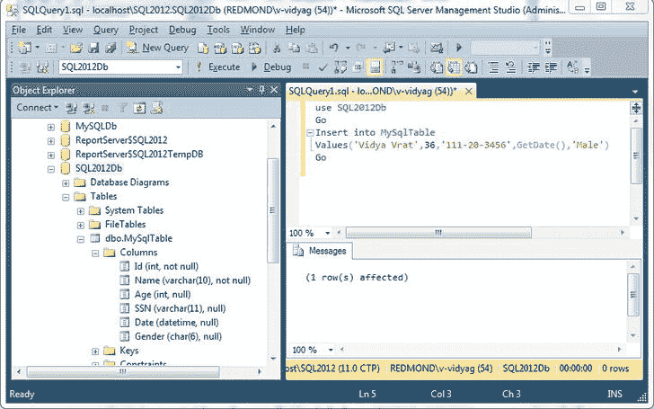
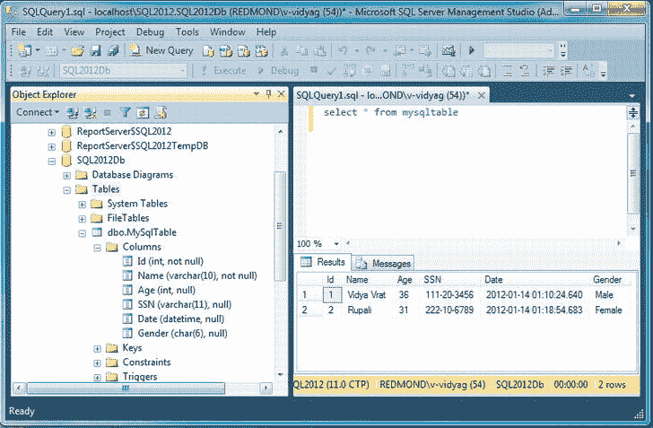
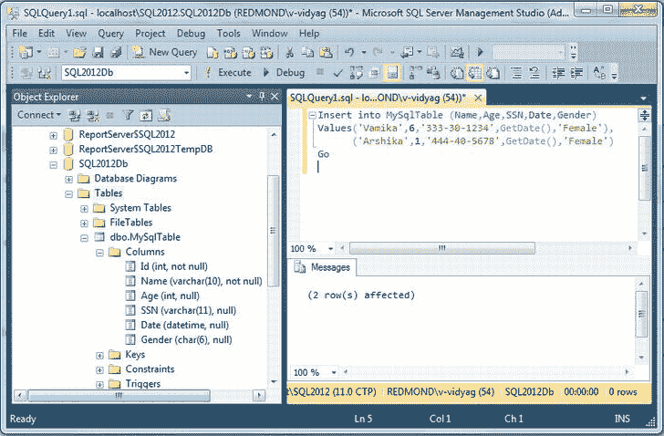
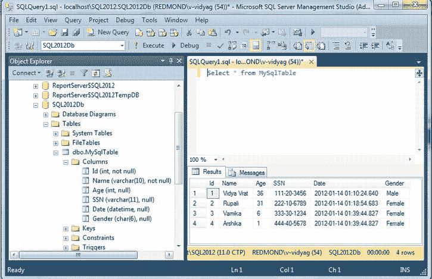
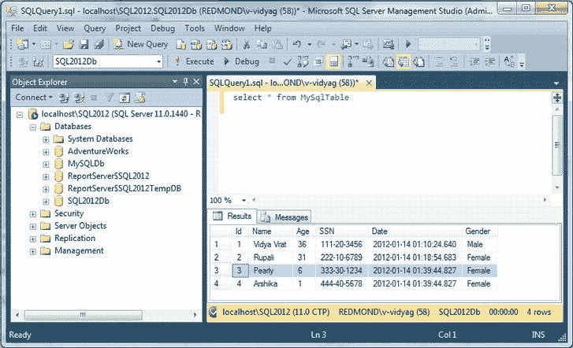
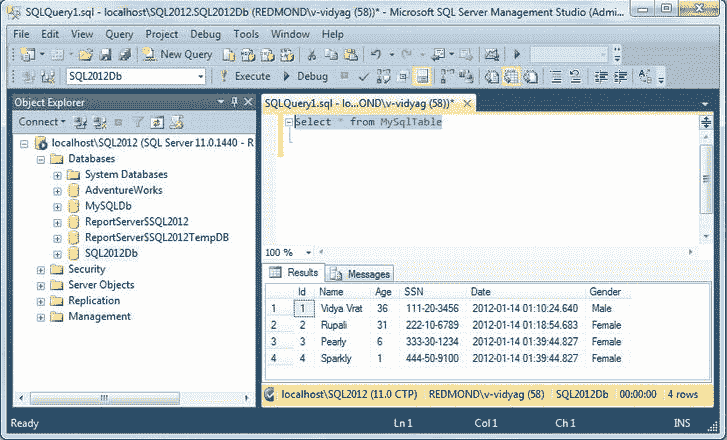
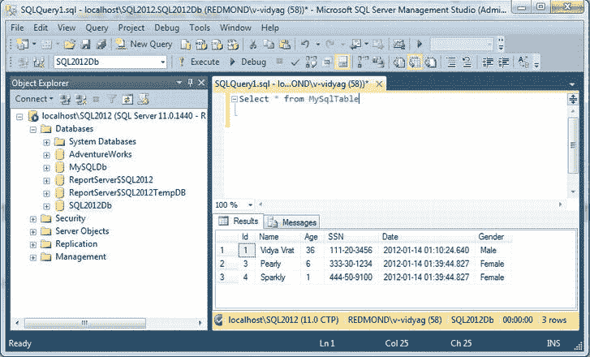

# 四、操作数据库数据

现在您已经知道了如何创建数据库和表，是时候将注意力转向修改数据了，比如插入、更新和删除数据。

在本章中，我们将介绍以下内容:

> *   Insert data

### 插入数据

创建表后，您需要能够向表中添加数据，例如行。通过使用`INSERT`语句可以做到这一点。

一个基本的`INSERT`语句包含以下几个部分:

`INSERT INTO <table>
(<column1>, <column2>, ..., <columnN>)
VALUES (<value1>, <value2>, ..., <valueN>)`

使用这个语法，让我们向新创建的 SQL2012Db 数据库的 MySqlTable 表中添加一个新行。

#### 试试看:插入新的一行

若要向表中插入新行，请在 SQL Server Management Studio 中打开一个新的查询窗口。输入以下查询，然后单击执行:

`Use SQL2012Db
Go
insert into MySqlTable ( Name, Age, SSN, Date, Gender )
   Values('Vidya Vrat',36,'111-20-3456',GetDate(),'Male')
Go`

在查询窗格中执行该语句应该会产生一个消息窗口，报告“(1 行受影响)”，如[图 4-1](#fig_4_1) 所示。

 **注意** `GetDate()`是 SQL Server 内置的返回当前日期和时间的 datetime 函数，所以如果使用该函数，它会将当前日期和时间输入到列中。

***图 4-1。**在 MySqlTable 表中插入新的一行*

#### 它是如何工作的

第一列 ID 是一个标识列，您不能显式地向其中插入值，SQL Server 数据库引擎将确保为 ID 字段插入一个由 SQL Server 生成的唯一值。因此，`INSERT`语句需要以这样的方式编写，即您指定想要为其显式插入值的列列表；虽然 MySqlTable 包含六个字段，但 ID 是一个标识列，它不期望从用户处插入任何值。SQL Server 可以在执行`INSERT`语句时检测标识列。但是，最佳做法是指定列列表，然后将各自的值传递给这些字段，如以下查询所示:

`Insert into MySqlTable (Name,Age,SSN,Date,Gender)
Values('Rupali',31,'222-10-6789',GetDate(),'Female')`

插入行后，在查询窗格中键入以下查询:

`Select * from MySqlTable`

选择该语句，然后单击执行或按 F5；你会看到新的行已经被添加，如图[图 4-2](#fig_4_2) 所示。

***图 4-2。**添加行后的 MySqlTable】*

请注意插入正确数据类型的数据。在本例中，您已经看到了字符、整数和日期时间类型的列。

### 通过一条 INSERT 语句插入多行

通常单个`INSERT`语句向表中添加一行，但是从 SQL Server 2008 开始，`INSERT`语句能够通过单个`INSERT`语句添加多行。您只需要用逗号分隔每一行数据，如下面的语句所示，然后单击 Execute 或按 F5。

`Insert into MySqlTable (Name,Age,SSN,Date,Gender)
Values('Vamika',6,'333-30-1234',GetDate(),'Female'),
           ('Arshika',1,'444-40-5678',GetDate(),'Female')`

这应该显示成功执行，如图 4-3 中的[所示。](#fig_4_3)

***图 4-3。**用一条 INSERT 语句添加多行*

现在，如果您想执行下面的`SELECT`语句，您应该会看到带有自动递增的 ID 值的四行，从 1 到 4。换句话说，第一条记录将为 1，此后插入的每条记录都将增加 1。参见[图 4-4](#fig_4_4) 。

***图 4-4。** SELECT 语句显示所有带有自动生成的 ID 值的插入行*

### 更新数据

您可以使用`UPDATE`语句修改数据。在编写`UPDATE`语句时，必须小心包含一个`WHERE`子句，否则会更新*表中的所有*行。因此，总是编写一个合适的`WHERE`子句；如果您遗漏了一个`WHERE`子句，如下面的`UPDATE`语句所示，那么您将更改表中的所有记录，我确信没有业务案例需要这样做！

`UPDATE <table>
SET <columnl> = <valuel>, <column2> = <value2>, ..., <columnN> = <valueN>`

现在你已经意识到了`UPDATE`语句的含义，让我们好好看看它。本质上，这是一个简单的语句，允许您更新一个或多个行和列中的值。

`UPDATE <table>
SET <columnl> = <valuel>, <column2> = <value2>, ..., <columnN> = <valueN>
WHERE <predicate>`

#### 试试看:更新一行

若要更改行的值，请在 SQL Server Management Studio Express 中打开一个新的查询窗口。输入以下查询，然后单击执行:

`update MySqlTable
set Name = 'Pearly'
where Id = 3`

#### 它是如何工作的

ID 是 SQL 为 MySqlTable 表的行生成的惟一标识符，因此您可以使用它来定位我们想要更新的行。运行该查询应该会产生一个消息窗格，报告“(1 行受影响)”现在如果你执行`Select * from MySqlTable`语句，你会看到修改后的记录，如图[图 4-5](#fig_4_5) 所示。

***图 4-5。** SELECT 语句显示 UPDATE 语句后修改的行*

当您更新多个列时，您仍然只使用一次`SET`关键字，并且您用逗号分隔列名和它们各自的值。例如，以下语句将更改我们添加到表中的一个人的姓名和社会保险号:

`update MySqlTable
set Name = 'Sparkly',
SSN = '444-50-9100'
where Id = 4`

如果您执行`Select * from MySqlTable`，您会看到 person 的名字和 SSN 值已经改变，如图 4-6 中的[所示。](#fig_4_6)

***图 4-6。** SELECT 语句显示多列更新语句后修改的行*

### 删除数据

要删除数据，可以使用`DELETE`语句。`DELETE`声明与`UPDATE`声明具有相同的含义。由于忘记了`WHERE`子句，删除表中的每一行(不仅仅是错误的行)太容易了，所以要小心。`DELETE`语句删除整行，所以没有必要(或不可能)指定列。它的基本语法如下(记住，`WHERE`子句是可选的，但是没有它，所有行都将被删除):

`DELETE FROM <table>
WHERE <predicate>`

如果您需要从 MySqlTable 表中删除一个或一组记录，那么您需要用某个惟一值(如标识键或主键)来确定您想要删除的记录，然后您用`DELETE`语句的`WHERE`条件来指定您想要删除的行的这个惟一值。

`delete from MySqlTable
where Id = 2`

这将生成一个消息窗格，报告“(1 行受影响)”执行`Select * from MySqlTable`语句，你会看到 ID 为 2 的行已经被删除，如图[图 4-7](#fig_4_7) 所示。

***图 4-7。** SELECT 语句显示 DELETE 语句后的行*

再次强调，在`DELETE`语句中使用`WHERE`子句很重要；如果您指定了一个没有它的`DELETE`语句，那么您将删除指定表中的所有行。

### 总结

在本章中，您学习了如何使用以下 T-SQL 关键字对数据库执行数据操作任务:`INSERT`、`UPDATE`和`DELETE`。

在下一章，你将学习如何查询数据库。