# 五、查询数据库

在本章中，您将学习在 SQL Server 2012 中编码查询。SQL Server 使用 T-SQL 作为它的语言，并且它有各种各样的用于查询的函数和构造。您将看到如何使用 SQL Server Management Studio 和 AdventureWorks 数据库提交针对各种数据查询场景的查询。本章包括以下内容:

> *   retrieve data
> *   Use the `GROUP BY` clause
> *   pattern matching
> *   Use aggregate function
> *   Use the `DATETIME` function
> *   Use list operators
> *   Use range operators
> *   Find null value
> *   Use join

### 检索数据

SQL 查询从数据库中检索数据。数据以*行*的形式存储在*表中。*行由*列组成。*最简单的形式是，查询由两部分组成:

> *   A `SELECT` list that specifies the columns to retrieve.
> *   A `FROM` clause that specifies one or more tables to access.

 **提示**我用大写字母写了`SELECT`和`FROM`只是为了表明它们是 SQL 关键字。SQL 不区分大小写，关键字在代码中通常用小写字母书写。在 T-SQL 中，查询被称为`SELECT`语句，但是 ISO/ANSI 标准明确区分了“查询”和“语句”这种区别在概念上很重要。*查询*是对一个表的操作，产生一个表作为结果；*语句*可以(也可以不)对表进行操作，不产生表作为结果。此外，*子查询*可以在查询和语句中使用。因此，我们通常会调用查询*查询*而不是`SELECT`语句。您可以随意调用查询，但是请记住查询是 SQL 的一个特殊特性。

使用两个关键字`SELECT`和`FROM`，下面是最简单的查询，它将从指定的表中获取所有数据:

`Select * from <table name>`

星号(*)表示您要选择表中的所有列。

在本章中，您将使用 SQL Server 2012 的一个实例。打开 SQL Server Management Studio，在连接服务器对话框中键入***localhost*\<SQL Server 2012 实例名>** 作为服务器名；然后单击连接。SQL Server Management Studio 将打开。展开“数据库”节点，并选择 AdventureWorks 数据库。你的屏幕应该类似于[图 5-1](#fig_5_1) 。

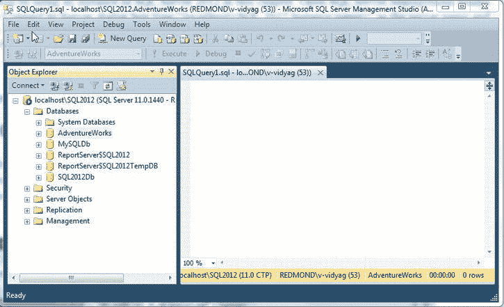

***图 5-1。**选择要查询的数据库*

#### 试试看:运行一个简单的查询

若要提交查询以检索所有员工数据，请在 SQL Server Management Studio 中打开一个新的查询窗口。在对象资源管理器中选择 AdventureWorks，然后单击工具栏上的“新建查询”按钮。这将打开一个新的查询窗口。输入以下查询，然后单击“执行”。您应该会看到如图 5-2 所示的结果。

`Select * from Person.Address` 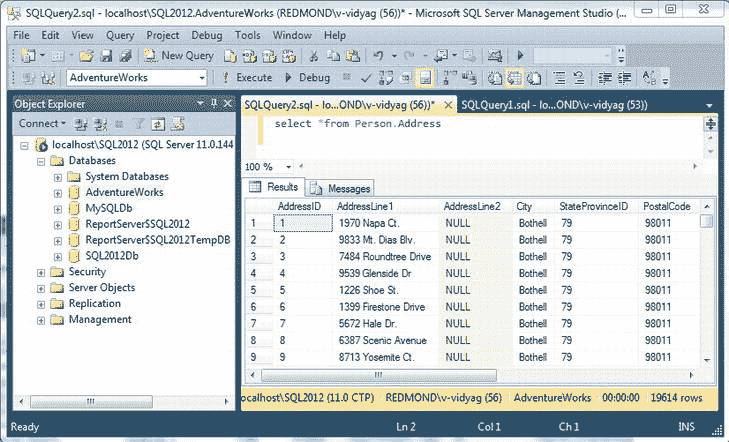

***图 5-2。**查询结果窗格*

#### 它是如何工作的

您要求数据库返回所有列的数据，您得到的正是这些数据。如果您向右滚动，您会找到地址表中的所有列。

大多数情况下，您应该将查询限制在仅相关的列。当选择不需要的列时，会浪费资源。要显式选择列，请在关键字`SELECT`后输入列名，如下面的查询所示，然后单击 Execute。[图 5-3](#fig_5_3) 显示了结果。

`Select AddressID, AddressLine1, City from Person.Address`

该查询选择地址表中的所有行，但只选择 AddressID、AddressLine1 和 City 列。

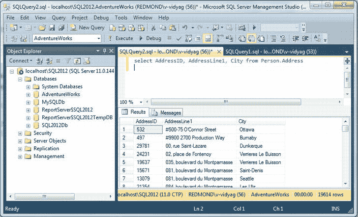

***图 5-3。**选择具体栏目*

#### 使用 WHERE 子句

查询可以有`WHERE`子句。`WHERE`子句允许您指定选择行的标准。这个子句可能很复杂，但是我们现在将坚持使用一个简单的例子。语法如下:

`WHERE <columnl> <operator> <column2 / Value>`

这里，`<operator>`是比较运算符(例如=、`<>`、>或<)。([本章后面的表 5-1](#tab_5_1) ，列出了 T-SQL 比较运算符。)

###### 试试看:改进您的查询

在本练习中，您将看到如何优化您的查询。

1.  Add the following `WHERE` clause to the query in [Figure 5-3](#fig_5_3) : `Where City = 'Redmond'`
2.  Press F5 to run the query, and you should see the results shown in [Figure 5-4](#fig_5_4) .

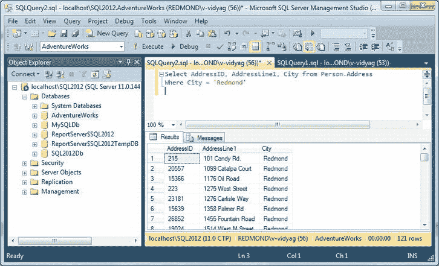

***图 5-4。**使用`WHERE`从句*

 **注意** SQL Server 关键字不区分大小写。SQL Server 区分大小写取决于数据库的排序规则设置。但是，SQL Server 安装的默认排序规则 SQL_Latin1_General_CP1_CI_AS 不区分大小写。所以，大多数时候，开发人员不需要担心大小写的敏感性。但是 AdventureWorks 数据库是区分大小写的。因此，如果您尝试使用 *redmond* 运行图 5-4 中所示的查询，由于区分大小写，您将不会显示任何结果行，这将不会找到具有所提供名称的城市。

#### 使用比较运算符

你可以在一个`WHERE`子句中使用许多不同的比较运算符(见[表 5-1](#tab_5_1) )。

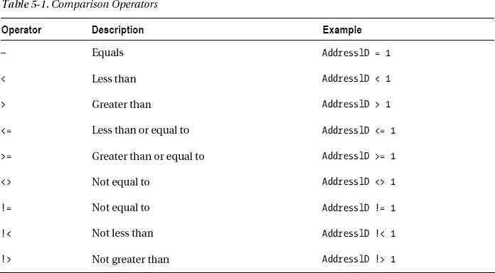

 **提示**如前所述，每个数据库供应商都有自己的 SQL 实现。这个讨论是专门针对 T-SQL 的；例如，标准 SQL 没有`!=`操作符，而是调用`<>`的*不等于操作符。*事实上，标准 SQL 调用`WHERE`子句中的表达式*谓词*；我们将使用这个术语，因为谓词要么为真，要么为假，但其他表达式不必如此。如果您使用的是另一个版本的 SQL，请参考它的文档以了解具体信息。

你可能想测试一下例子中的比较运算符，如图 5-5 所示。

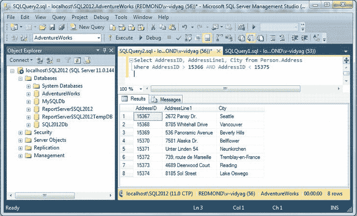

***图 5-5。**使用比较运算符*

### 整理数据

筛选完所需的数据后，可以按一列或多列并按特定方向对数据进行排序。因为根据定义表是未排序的，所以查询检索行的顺序是不可预测的。要进行排序，可以使用`ORDER BY`子句。

`ORDER BY <column> [ASC | DESC] {, n}`

`<column>`是应该用于对结果进行排序的列。`{, n}`语法意味着您可以指定任意数量的由逗号分隔的列。结果将按照您指定列的顺序进行排序。

以下是两种排序方向:

> *   `ASC`: Ascending order (1, 2, 3, 4, etc.)
> *   `DESC`: descending order (10, 9, 8, 7, etc.)

如果省略`ASC`或`DESC`关键字，排序顺序默认为`ASC`。以下是查询的基本语法:

`SELECT <column>
FROM <table>
WHERE <predicate>
ORDER BY <column> ASC | DESC`

现在您已经看到了，您将在一个示例中使用这个语法。

#### 试试看:编写一个增强的查询

在本例中，您将使用刚才显示的基本语法编写一个查询。您需要执行以下操作:

> *   Select all addresses in Redmond.
> *   只显示地址 ID，地址行 1，城市.
> *   Sort addresses by AddressID.

在 SQL Server Management Studio 中打开一个新的查询窗口。输入以下查询，然后单击“执行”。您应该会看到如图 5-6 所示的结果。

`Select AddressID, AddressLine1, City from Person.Address
Where City= 'Redmond'
Order By AddressID Asc` 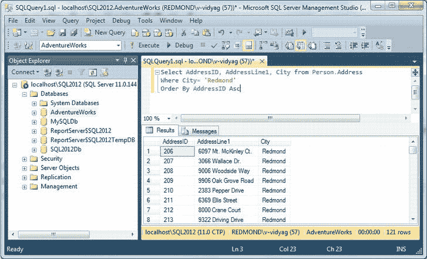

***图 5-6。**过滤和整理数据*

#### 工作原理

让我们单独看一下这些条款。`SELECT`列表指定了您想要使用的列。

`select AddressID, AddressLine1, City`

`FROM`子句指定您想要使用`Address`表。

`from Person.Address`

`WHERE`子句指定您想要 Redmond 的所有记录。

`where City = ‘Redmond’`

`ORDER BY`子句指定行的排序顺序。这些行将按 AddressID 以升序排序。

`order by AddressID asc`

### GROUP BY 子句

`GROUP BY`子句用于将输出行组织成组。`SELECT`列表可以包含聚合函数，并为每个组生成汇总值。通常，您会希望从数据库中生成报告，其中包含特定列或一组列的汇总数字。例如，您可能想从`Person.Address`表中找出属于某个特定城市的地址总数。

#### 试试看:使用 GROUP BY 子句

这个人。地址表包含地址详细信息。您想知道属于某个特定城市的地址总数。例如，如果您查看[图 5-6](#fig_5_6) 中的查询和记录数，您会注意到 Redmond 总共有 121 个地址条目。

在 SQL Server Management Studio Express 中打开一个新的查询窗口。输入以下查询，然后单击“执行”。您应该会看到如图 5-7 所示的结果。

`Select City, Count(City) As 'Total Count'
from Person.Address
Group By City
Order By City Asc` 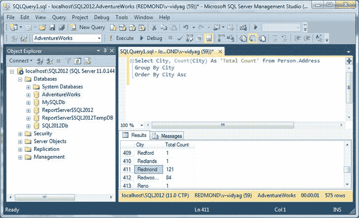

***图 5-7。**使用`GROUP BY`来聚合值*

如果你将结果集向下滚动到 Redmond，你会看到它显示了 121 行，如图 5-6 中的[所示。](#fig_5_6)

#### 它是如何工作的

您指定 City 列，并使用`COUNT`函数来计算地址表中每个地址所列出的城市总数。

`Select City, count(City) AS 'Total Count'
from Person.Address`

`GROUP BY`子句强制对指定的列进行分组，结果应该以城市列的分组形式显示。

`group by City`

`ORDER BY`子句确保显示的结果将根据城市以适当的顺序组织。

`order by City Asc`

### 模式匹配

*模式匹配*是一种确定特定字符串是否匹配特定模式的技术。可以使用常规字符和通配符的组合来创建模式。在模式匹配过程中，常规字符必须与字符串中指定的完全匹配。`LIKE`和`NOT LIKE`(否定)是用于模式匹配的运算符。记住模式匹配是区分大小写的。SQL Server 支持以下通配符进行模式匹配:

> *   *% (percent sign)* : This wildcard represents zero to more than one character. For example, `WHERE title LIKE '%C# 5.0%'` finds all titles containing the text *C # 5.0* , regardless of where the text appears in the title-beginning, middle or end. In this case, titles of C# 5.0 databases such as *C # 5.0: Introduction* , *Acceleration C # 5.0* and *Start will be listed.*
> *   *_ (underline)* : A single underline represents any single character. Using this wildcard, you can search the character length of the data you are looking for very specifically. For example, `WHERE au_fname LIKE '_ean'` Find all names (Dean, Sean, etc.) that consist of four letters and end with *ean* . `WHERE aufname LIKE 'a____n'` Find all names that start with *a* , end with *n* and have any other three characters in the middle, for example, allan, amman, aryan, etc.
> *   *[] (square brackets)* : These specify any single character within the specified range, such as `[a-f]`, or a set, such as `[abcdef]` or even `[adf]`. For example, `WHERE aulname LIKE '[C-K]arsen'` Find the author's surname ending in *arsen* and beginning with any single character between *c* and *k* , such as Carsen, Darsen, Larsen, Karsen, etc.
> *   *[] (brackets and caret)* : These specify any single character that is not within the specified range, such as `[^a-f]`, or a set, such as `[^abcdef]`. For example, `WHERE au_lname LIKE 'de[^]%'` retrieves all author surnames that begin with *de* , but the letters that follow cannot be *L* .

#### 试试看:使用百分比(%)字符

要查看通配符`%`的工作原理，请在 SQL Server Management Studio Express 中打开一个新的查询窗口。输入以下查询，然后单击“执行”。您应该会看到如图 5-8 所示的结果。

`Select AddressID, AddressLine1, City
from Person.Address
where City like 'R%'` 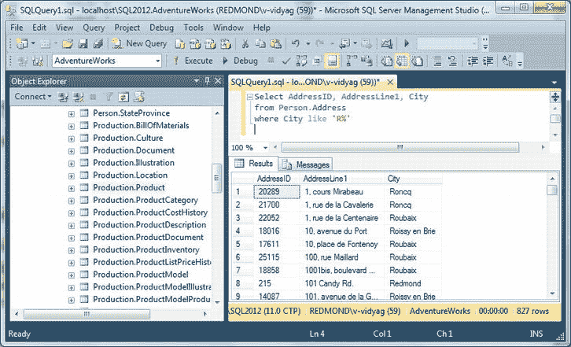

***图 5-8。**将`LIKE`运算符与`%`* 一起使用

#### 它是如何工作的

您指定地址表的三列。

`select AddressID, AddressLine1, City
from Person.Address`

使用`LIKE`操作符指定带有模式的`WHERE`子句，列出所有以字母 *R* 开头并在其后包含任意数量字母的城市。

`where City like 'R%'`

#### 试试看:使用下划线(_)字符

若要查看下划线(`_)`通配符的工作原理，请在 SQL Server Management Studio 中打开一个新的查询窗口。输入以下查询，然后单击“执行”。您应该会看到如图 5-9 所示的结果。

`Select AddressID, AddressLine1, City
from Person.Address
where City like 'S______' –- S followed by 6 underscores` 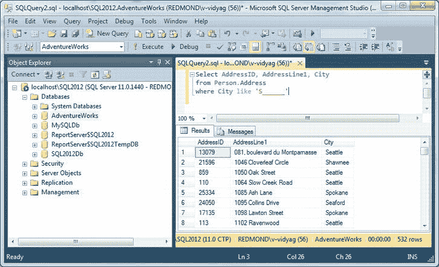

***图 5-9。**将`LIKE`运算符与`_`* 一起使用

#### 它是如何工作的

您指定地址表的三列。

`select AddressID, AddressLine1, City
from Person.Address`

使用`LIKE`操作符指定带有模式的`WHERE`子句，以列出所有以字母 *S* 开头并且其后最多包含六个字母的城市，例如西雅图、斯波坎、肖尼等等。

`where City like 'S______'`

#### 试试看:使用方括号([])字符

要查看`[]`字符如何在模式匹配中工作，请在 SQL Server Management Studio 中打开一个新的查询窗口。输入以下查询，然后单击“执行”。您应该会看到如图 5-10 所示的结果。

`Select AddressID, AddressLine1, City
from Person.Address
where City like '[B,R,S]%'
Order by City Asc` 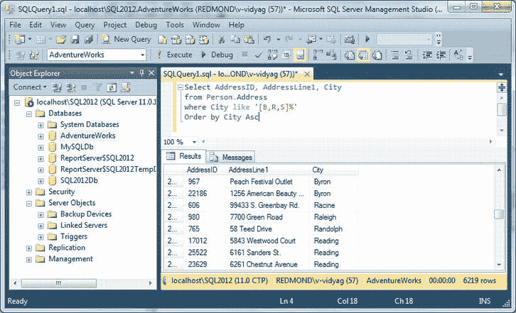

***图 5-10。**将`LIKE`运算符与`[ ]`* 一起使用

#### 它是如何工作的

您指定地址表的三列。

`select AddressID, AddressLine1, City
from Person.Address`

使用`LIKE`操作符指定带有模式的`WHERE`子句，以列出所有以字母 *B* 或 *R* 或 *S* 开头并在其后包含任意数量字母的城市，例如 Bellevue、Redmond、Seattle 等。

`where City like '[B,R,S]%'
Order by City Asc`

#### 试试看:使用方括号和脱字符([^ ])

要查看`[^B,R,S]`字符如何在模式匹配中工作，请在 SQL Server Management Studio Express 中打开一个新的查询窗口。输入以下查询，然后单击“执行”。您应该会看到如图 5-11 所示的结果。

`Select AddressID, AddressLine1, City
from Person.Address
where City like '[^B,R,S]%'
Order by City Asc` 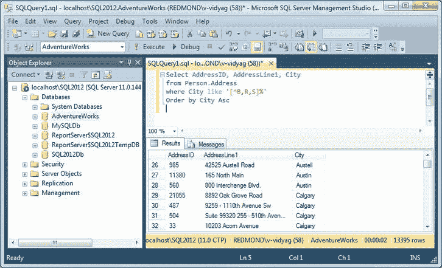

***图 5-11。**将`LIKE`运算符与`[^]`* 一起使用

#### 它是如何工作的

您指定地址表的三列。

`select AddressID, AddressLine1, City
from Person.Address`

使用`LIKE`操作符指定带有模式的`WHERE`子句，以列出所有不以字母 *B* 或 *R* 或 *S* 开头并且其后包含任意数量字母的城市；例如，Bellevue、Redmond、Seattle 等都不会包含在结果集中。

`where City like '[^B,R,S]%'
Order by City Asc`

### 聚合函数

SQL 有几个内置函数可以聚合一列的值。聚合函数应用于多组行，并返回单个值。例如，您可以使用聚合函数来计算所下订单的平均单价。你可以找到价格最低或最贵的订单。`MIN`、`MAX`、`SUM`、`AVG`、`COUNT`在聚合函数中经常使用。

#### 尝试一下:使用最小值、最大值、总和以及 AVG 函数

让我们从 SalesOrderDetail 表中找出每个销售订单(SalesOrderID)的单价(unit price)的最小值、最大值、总和以及平均值。

在 SQL Server Management Studio 中打开一个新的查询窗口。输入以下查询，然后单击“执行”。您应该会看到如图 5-12 所示的结果。

`select SalesOrderID,min(UnitPrice)as "Min",
max(UnitPrice) as "Max",Sum(UnitPrice) as "Sum",
Avg(UnitPrice)as "Avg"
from Sales.SalesOrderDetail
where SalesOrderID between 43659 and 43663
group by SalesOrderID` 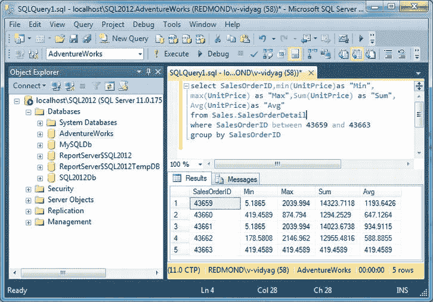

***图 5-12。**使用聚合函数*

#### 它是如何工作的

使用`MIN`和`MAX`函数查找最小值和最大值，使用`SUM`函数计算总值，使用`AVG`函数计算平均值。

`min(UnitPrice) as "Min",
max(UnitPrice) as "Max",
Sum(UnitPrice) as "Sum",
Avg(UnitPrice)as "Avg"`

因为您希望通过`SalesOrderID`列出结果，所以使用了`GROUP BY`子句。从结果集中，您看到订单 1 的最小单价为 5.1865，最大单价为 2039.994，总单价为 14323.7118，平均单价为 1193.6426。

#### 试试看:使用计数功能

让我们找出这个人的记录数。联系表。

在 SQL Server Management Studio 中打开一个新的查询窗口。输入以下查询，然后单击“执行”。您应该会看到如图 5-13 所示的结果。

`Select count(*) as "Total Records"
from Person.Contact

Select count(Title)as "Not Null Titles"
from Person.Contact` 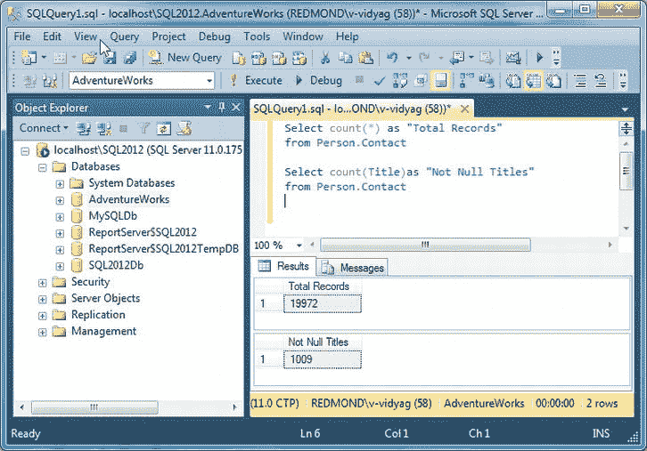

***图 5-13。**使用`COUNT`聚合函数*

#### 工作原理

根据传递给函数的参数,`COUNT`函数有不同的行为。如果尝试`COUNT(*)`，查询将返回表中可用的记录总数，如最上面的结果所示:table Person。联系人总共包含 19972 条记录，而`Count(*)`计数为空。

如果您将一个列名传递给`COUNT`函数，它将再次返回记录总数，但是它将忽略该列中所有包含 null 值的行。在第二个查询中，您正在查询同一个表，该表列出了 19，972 条记录，但是因为您的第二个查询应用于`Title`列，所以它只返回 1，009 条记录，因为这一次它忽略了所有的空值。换句话说，`Count(ColumnName)`忽略了 null。

### 日期时间函数

尽管 SQL 标准定义了一个`DATETIME`数据类型及其组成部分`YEAR`、`MONTH`、`DAY`、`HOUR`、`MINUTE`和`SECOND`，但它并没有规定 DBMS 如何使这些数据可用。每个 DBMS 都提供提取部分`DATETIME`的函数。让我们看一些 T-SQL `DATETIME`函数的例子。

#### 试试看:使用 T-SQL 日期和时间函数

让我们用 T-SQL 日期和时间函数来练习一下。

在 SQL Server Management Studio Express 中打开一个新的查询窗口(数据库上下文不影响此查询)。输入以下查询，然后单击“执行”。您应该会看到如图 5-14 所示的结果。

`select
current_timestamp'standard datetime',
getdate()'Transact-SQL datetime',
datepart(year, getdate())'datepart year',
year(getdate())'year function',
datepart(hour, getdate())'hour'` 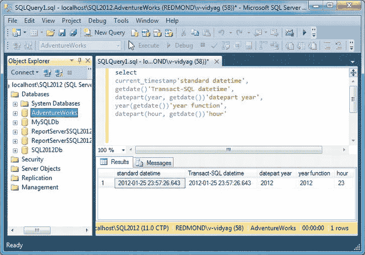

***图 5-14。**使用日期和时间功能*

#### 它是如何工作的

您使用一个非标准版本的查询，省略了`FROM`子句，以显示当前日期和时间以及它们的各个部分。`SELECT`列表中的前两列给出了完整的日期和时间。

`current_timestamp 'standard datetime', getdate() 'Transact-SOL datetime',`

第一行使用标准 SQL 的`CURRENTTIMESTAMP` value 函数；第二种使用 T-SQL 的`GETDATE`函数。它们实际上是等效的，都返回完整的当前日期和时间。

接下来的两行各提供当前年份。第一种使用 T-SQL `DATEPART`函数；第二个使用 T-SQL `YEAR`函数。两者都采用`DATETIME`参数并返回整数年。`DATEPART`函数的第一个参数指定提取`DATETIME`的哪一部分。注意，T-SQL 没有提供用于提取完整日期的`date`说明符，也没有单独的`DATE`函数。

`datepart(year, getdate()) 'datepart year', year(getdate()) 'year function',`

最后一行获取当前小时。这里必须使用 T-SQL `DATEPART`函数，因为没有类似于`YEAR`函数的`HOUR`函数。注意，T-SQL 没有提供提取完整时间的时间说明符，也没有单独的`TIME`函数。

`datepart(hour, getdate()) 'hour'`

您可以设置日期和时间的格式，以及用各种方式提取和转换它们的替代函数。日期和时间也可以增加和减少，增加和减少。虽然所有的 DBMS 都在一定程度上遵守 SQL 标准，但如何做到这一点是 DBMS 特有的。无论您使用什么 DBMS，您都会发现日期和时间是最复杂的数据类型。但是，在所有情况下，您都会发现函数(有时比 T-SQL 中的函数更丰富)是处理日期和时间的基本工具。

 **提示**当提供日期和时间输入时，通常需要字符串值；例如，`1/26/2012`是为示例中保存当前日期的列指定值的合适方式。但是，DBMSs 以特定于系统的编码存储日期和时间。当您使用日期和时间数据时，请仔细阅读数据库的 SQL 手册，了解如何最好地处理它。

### 列表运算符

`IN`是 SQL Server 的列表操作符；它允许您指定条件所基于的选项列表。例如，您想要提取所需列表中的所有城市。SQL Server 也提供了它的否定，`NOT IN`，所以你可以选择你*不想*包含在结果集中的值。

#### 试试看:使用 IN 操作符

在 SQL Server Management Studio 中打开一个新的查询窗口。输入以下查询，然后单击“执行”。您应该会看到如图 5-15 所示的结果。

`select AddressID, AddressLine1, City
from Person.Address
where City in ('Bellevue', 'Redmond', 'Seattle')` 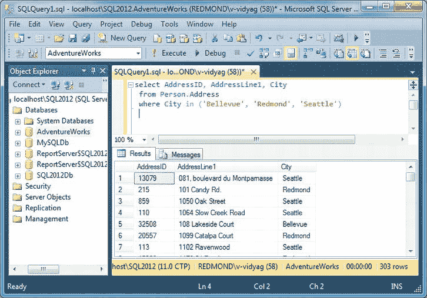

***图 5-15。**使用 IN 运算符*

#### 它是如何工作的

您指定地址表的三列。

`select AddressID, AddressLine1, City
from Person.Address`

您可以使用您想要提取记录的城市名称来指定列表操作符`IN`。因此，它只为所提供的城市过滤 303 条记录。如果你向下滚动，你会看到所有的记录将只属于提到的城市。

`where City in ('Bellevue', 'Redmond', 'Seattle')`

#### 试试看:使用 NOT IN 运算符

在 SQL Server Management Studio 中打开一个新的查询窗口。输入以下查询，然后单击“执行”。您应该会看到如图 5-16 所示的结果。

`select AddressID, AddressLine1, City
from Person.Address
where City not in ('Bellevue', 'Redmond', 'Seattle')` 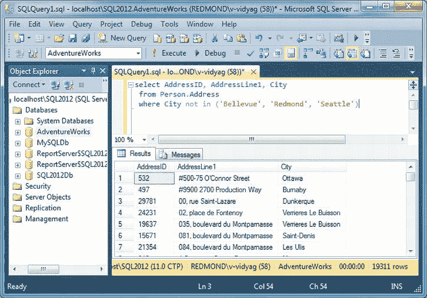

***图 5-16。**使用 NOT IN 运算符*

#### 它是如何工作的

您指定地址表的三列。

`select AddressID, AddressLine1, City
from Person.Address`

您指定列表操作符`NOT IN`,其中包含您不希望包含记录的城市名称。因此，它过滤了除了我们在`NOT IN`列表中列出的城市之外的 19，311 条记录。如果向下滚动，您将看不到任何属于上述城市的记录。

`where City not in ('Bellevue', 'Redmond', 'Seattle')`

### 范围运算符

`BETWEEN`是 SQL Server 的范围运算符；它允许您指定条件所基于的数据范围。例如，您想要提供您想要查看的数据范围。SQL Server 也提供了它的否定，`NOT Between`，所以您可以选择不希望包含在结果集中的值。

#### 试试看:使用 BETWEEN 运算符

在 SQL Server Management Studio 中打开一个新的查询窗口。输入以下查询，然后单击“执行”。您应该会看到如图 5-17 所示的结果。

`select AddressID, AddressLine1, City
from Person.Address
where AddressID between 201 and 300` 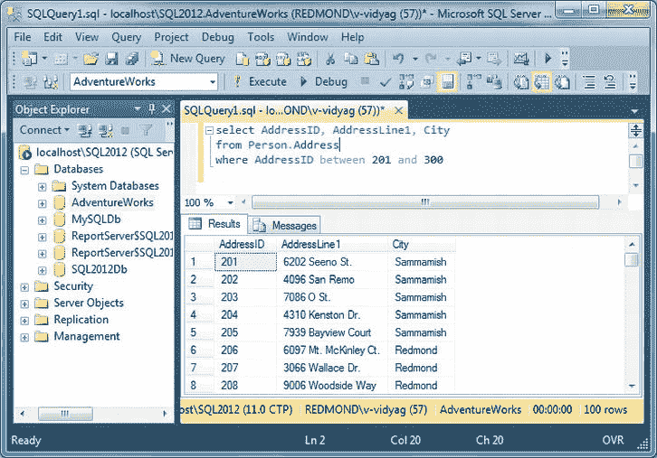

***图 5-17。**使用 Between 运算符*

#### 工作原理

您指定地址表的三列。

`select AddressID, AddressLine1, City
from Person.Address`

您指定范围操作符`BETWEEN`和您想要包含记录的范围`AddressID`。因此，它为该地址过滤 100 条记录，范围在 201 和 300 之间，换句话说，总共 100 条记录。

`where AddressID between 201 and 300`

#### 试试看:使用 NOT BETWEEN 运算符

在 SQL Server Management Studio 中打开一个新的查询窗口。输入以下查询，然后单击“执行”。您应该会看到如图 5-18 所示的结果。

`select AddressID, AddressLine1, City
from Person.Address
where AddressID between 201 and 32521` 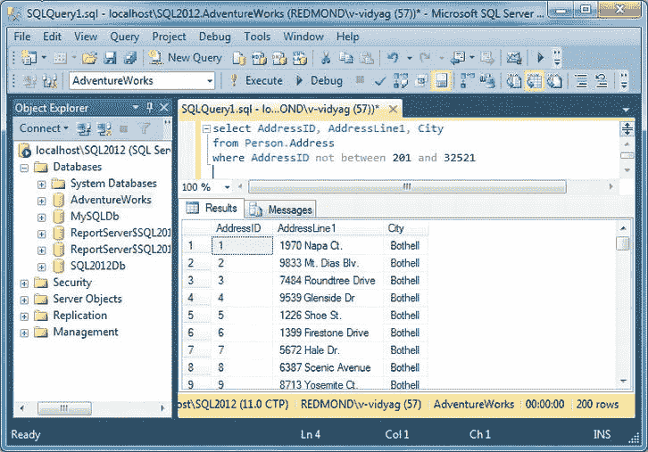

***图 5-18。**使用 Not Between 运算符*

#### 工作原理

您指定地址表的三列。

`select AddressID, AddressLine1, City
from Person.Address`

您指定范围操作符`BETWEEN`和您想要包含记录的范围`AddressID`。因此，它为该地址过滤了 200 条记录，范围从 201 到 32521 之间的*而不是*，换句话说，总共 200 条记录。

`where AddressID between 201 and 32521`

### 查找空值

空值是未定义和未知的值，由关键字`NULL`表示。当执行查询时，有时分别提取`NULL`和`NOT NULL`行变得很重要。为了支持这一目的，SQL Server 提供了包含在`WHERE`条件子句中的`IS NULL`及其否定`IS NOT NULL`。

#### 试试看:使用 IS NULL 运算符

在 SQL Server Management Studio 中打开一个新的查询窗口。输入以下查询，然后单击“执行”。您应该会看到如图 5-19 所示的结果。

`select Title, FirstName, MiddleName, LastName
from Person.Contact
where MiddleName is null`

#### 它是如何工作的

您指定联系人表的四列。

`select Title, FirstName, MiddleName, LastName
from Person.Contact`

您根据`MiddleName`是否为空来指定`WHERE`条件。因此，它过滤了 8，499 条个人联系信息记录；所有列出的记录的`MiddleName`都是`NULL`。

`where MiddleName is null` 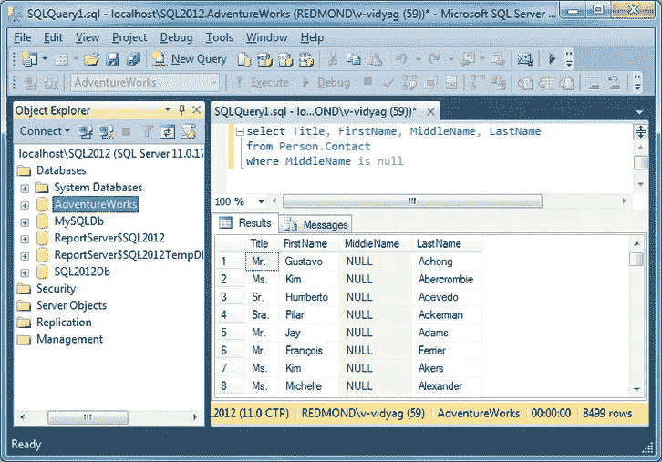

***图 5-19。**使用 IS NULL 运算符*

#### 试试看:使用 IS NOT NULL 操作符

在 SQL Server Management Studio 中打开一个新的查询窗口。输入以下查询，然后单击“执行”。您应该会看到如图 5-20 所示的结果。

`select Title, FirstName, MiddleName, LastName
from Person.Contact
where MiddleName is not null`

#### 它是如何工作的

您指定联系人表的四列。

`select Title, FirstName, MiddleName, LastName
from Person.Contact`

您根据`MiddleName`是否不为空来指定`WHERE`条件。因此，它过滤了 11，473 条关于此人联系方式的记录；所有列出的记录都有一个定义的`MiddleName`。

`where MiddleName is not null` 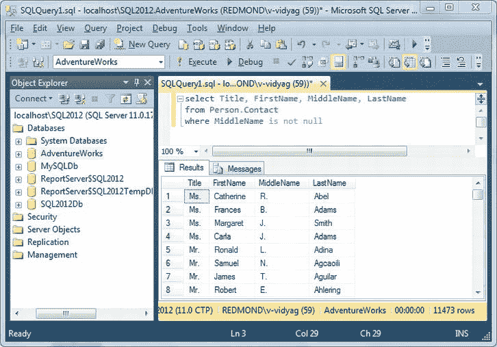

***图 5-20。**使用 IS NOT NULL 运算符*

### 加入

大多数查询需要来自多个表的信息。*连接*是一种关系操作，通过从两个(不一定是不同的)表中检索数据并根据*连接规范匹配它们的行来生成一个表。*

存在不同类型的连接，您将单独查看，但是请记住，每个连接都是一个*二元*操作；也就是说，一个表连接到另一个表，由于表之间可以相互连接，所以这两个表可能是同一个表。连接操作是一个丰富且有些复杂的主题。接下来的部分将涵盖基础知识。

#### 内部联接

内部联接是最常用的联接。它只返回那些满足连接规范的行。尽管理论上任何关系操作符(如`>`或`<`)都可以在连接规范中使用，但等式操作符(=)几乎总是被使用。使用等式运算符的连接被称为*自然连接。*

内部连接的基本语法如下:

`select
      <select list>
from
      left-table INNER JOIN right-table
      ON
      <join specification>`

注意，`INNER JOIN`是一个二元操作，所以它有两个操作数，`left-table`和`right-table`，它们可能是基表或任何可以被查询的东西(例如，由子查询或另一个连接产生的表)。`ON`关键字是连接规范的开始，它可以包含任何可以在`WHERE`子句中使用的内容。

#### 表格别名

表别名是一种技术，用于为任何 SQL 查询中需要的一个表或每个单独的表指定一个简短的昵称。尽管可以使用完整的表名，但在查询中反复重复表名是一个麻烦的过程。

因此，当您必须指定可能存在于多个表中的列名，或者您希望使用特定表中的不同列时，表别名使它变得非常容易；因此，指定`<Table Name>.<Column Name>`变得非常重要。

参考下面的查询，其中我们将`Production.Product`别名为 PP，将`Production.ProductReview`别名为 PPR。接下来，当涉及到使用这些表中的列时，我们使用定义的别名。

此外，请记住这些别名是临时的，它们的生命周期是到查询被执行为止。执行查询后，不能对任何其他查询重复使用相同的别名。因此，别名的范围在已定义的查询内，生命周期在查询执行之前。

##### 试试看:编写一个内部连接

让我们检索产品列表、产品 id 以及它们的`ReviewerName`、`Comments`和`Rating`条目。

在 SQL Server Management Studio 中打开一个新的查询窗口(请记住将 AdventureWorks 作为您的查询上下文)。输入以下查询，然后单击“执行”。您应该会看到如图 5-21 所示的结果。

`select PP.ProductID, PP.Name, PPR.ReviewerName, PPR.Comments, PPR.Rating
from Production.Product PP inner join Production.ProductReview PPR
on PP.ProductID = PPR.ProductID` 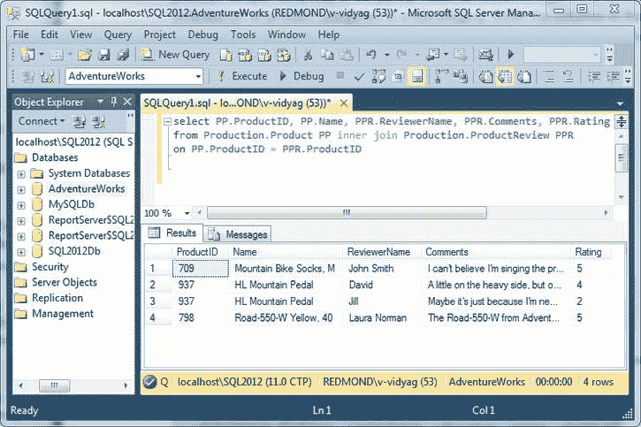

***图 5-21。**使用内部连接*

##### 它是如何工作的

先说`SELECT`清单。

`select PP.ProductID, PP.Name, PPR.ReviewerName, PPR.Comments, PPR.Rating`

因为要从两个表中选择列，所以需要识别列来自哪个表，这可以通过在表名前面加上一个点(.)添加到列名。这被称为*歧义消除、*或消除歧义，以便数据库管理器知道使用哪一列。尽管只需要对两个表中都出现的列执行此操作，但最佳实践是用它们的表名限定所有列。

下面的`FROM`子句指定了您正在连接的表及其别名，以及您正在使用的连接类型:

`from Production.Product PP inner join Production.ProductReview PPR`

它指定了产品的内部联接。产品和生产。产品评论表。

它还指定了连接 Product 表的主键 ProductID 和 ProductReview 表的外键 ProductId 的条件。

`on PP.ProductID = PPR.ProductID`

<ins>`ProductID`</ins>上的内部连接产生一个由五列组成的表:ProductID、Name、ReviewerName、Comments 和 Rating。数据是从生产中的行中检索的。产品和生产。ProductReview，其 ProductID 列具有相同的值。订单中任何与雇员中的行不匹配的行将被忽略，反之亦然。(这里不是这样的，但是你很快就会看到一个例子。)内部联接总是只生成满足联接规范的行。

 **提示**用于加入的列不必出现在`SELECT`列表中。如果您愿意，可以省略该列。

#### 外部联接

外部连接返回(至少)一个连接表中的所有*行，即使一个表中的行与另一个表中的行不匹配。存在三种类型的外部联接:左外部联接、右外部联接和完全外部联接。术语*左*和*右*指的是`JOIN`运算符左边和右边的操作数。(参考内部连接的基本语法，你会明白为什么我们称操作数为`left-table`和`right-table`。)在左外连接中，将检索左表中的所有行，无论它们在右表中是否有匹配的行。相反，在右外连接中，将检索右表中的所有行，无论它们在左表中是否有匹配的行。在完全外部联接中，将返回两个表中的所有行。*

 **提示**左右外连接在逻辑上是等价的。通过改变操作符，将操作数或右连接转换为左连接，总是可以将左连接转换为右连接。因此，实际上只需要这些操作符中的一个。选择哪一个基本上是个人偏好的问题，但一个有用的经验法则是在同一个查询中使用 left 或 right，但不要同时使用两者。查询优化器不会在意，但是人们会发现如果连接总是朝着同一个方向，跟踪复杂的查询会容易得多。

这个什么时候有用？相当频繁。事实上，只要表之间存在父子关系，尽管保持了参照完整性，但某些父行在子表中可能没有相关的行，因为子行可能允许有空的外键值，因此不匹配父表中的任何行。

###### 试试看:使用左外连接

若要列出所有 ProductID 和 ProductName 条目，甚至包括那些尚未审阅且没有关联的 ReviewerName、注释和评级的条目，请在 SQL Server Management Studio 中打开一个新的查询窗口(请记住将 AdventureWorks 作为您的查询上下文)。输入以下查询，然后单击“执行”。您应该会看到如图 5-22 所示的结果。

`select PP.ProductID, PP.Name, PPR.ReviewerName, PPR.Comments, PPR.Rating
from Production.Product PP left outer join Production.ProductReview PPR
on PP.ProductID = PPR.ProductID` 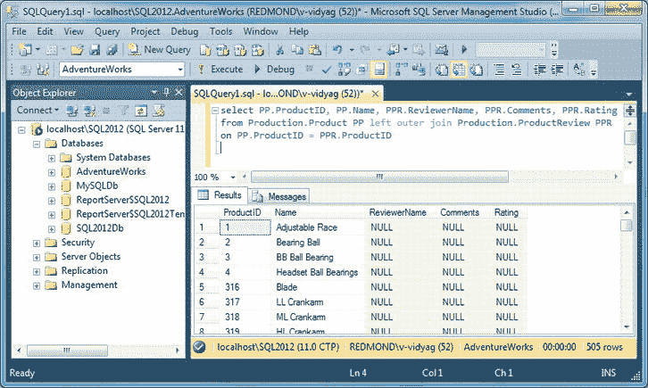

***图 5-22。**使用左外部连接*

###### 它是如何工作的

先说`SELECT`清单。

`select PP.ProductID, PP.Name, PPR.ReviewerName, PPR.Comments, PPR.Rating`

因为要从两个表中选择列，所以需要识别列来自哪个表，这可以通过在表名前面加上一个点(.)添加到列名。这被称为*歧义消除、*或消除歧义，以便数据库管理器知道使用哪一列。尽管只需要对两个表中都出现的列执行此操作，但最佳实践是用它们的表名限定所有列。

下面的`FROM`子句指定了要连接的表和使用的连接类型:

`from Production.Product PP left outer join Production.ProductReview PPR`

它指定了产品的左外连接。产品和生产。产品评论表。

它还指定了将`Product`表的主键`ProductID`与`ProductReview`表的外键`ProductId`连接起来的标准。

`on PP.ProductID = PPR.ProductID`

ProductID 的左外部连接生成一个由五列组成的表:ProductID、Name、ReviewerName、Comments 和 Rating。所有数据都是从生产中的行中检索的。Product，即左边的表，以及生产中匹配和不匹配的数据。ProductReview，其中它们的 ProductID 列具有匹配甚至不匹配的值。

###### 试试看:使用右外连接

若要列出所有 ProductID 和 ProductName 列以及基于已检查列的详细信息，请在 SQL Server Management Studio 中打开一个新的查询窗口(请记住将 AdventureWorks 作为查询上下文)。输入以下查询，然后单击“执行”。您应该会看到如图 5-23 所示的结果。

`select PP.ProductID, PP.Name, PPR.ReviewerName, PPR.Comments, PPR.Rating
from Production.Product PP right outer join Production.ProductReview PPR
on PP.ProductID = PPR.ProductID` 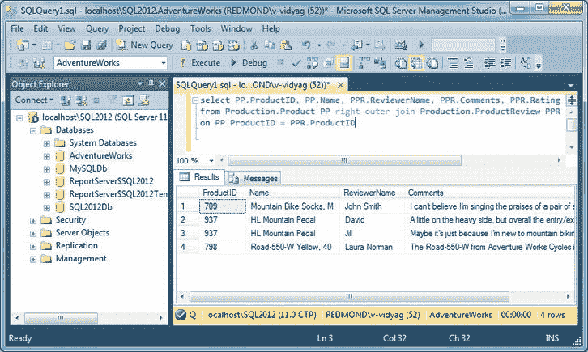

***图 5-23。**使用左外部连接*

###### 它是如何工作的

先说`SELECT`清单。

`select PP.ProductID, PP.Name, PPR.ReviewerName, PPR.Comments, PPR.Rating`

因为要从两个表中选择列，所以需要识别列来自哪个表，这可以通过在表名前面加上一个点(.)添加到列名。这被称为*歧义消除、*或消除歧义，以便数据库管理器知道使用哪一列。尽管只需要对两个表中都出现的列执行此操作，但最佳实践是用它们的表名限定所有列。

下面的`FROM`子句指定了要连接的表和使用的连接类型:

`from Production.Product PP right outer join Production.ProductReview PPR`

它指定了产品的一个右外连接。产品和生产。产品评论表。

它还指定了连接 Product 表的主键 ProductID 和 ProductReview 表的外键 ProductId 的条件。

`on PP.ProductID = PPR.ProductID`

ProductID 的右外部连接生成一个由五列组成的表:ProductID、Name、ReviewerName、Comments 和 Rating。所有数据都是从生产中的行中检索的。ProductReview，这是正确的表，以及匹配和取消匹配生产中的数据。ProductReview，其中它们的 ProductID 列具有匹配甚至不匹配的值。

#### 其他连接

SQL 标准还提供了`FULL OUTER JOIN`、`UNION JOIN`和`CROSS JOIN`(甚至还有`NATURAL JOIN`，基本上是一个使用等式谓词的内部连接)，但是这些很少使用，超出了本书的范围。我们不会提供示例，但本节包含了对它们的简要总结。

一个`FULL OUTER JOIN`就像是一个`LEFT`和`RIGHT OUTER`连接的组合。将检索两个表中的所有行，即使它们在另一个表中没有相关的行。

`UNION JOIN`与外部连接不同，它不匹配行。相反，它创建一个包含两个表中所有行的表。对于两个表，它等效于以下查询:

`select
      *
from
      table1
union all
select
      *
from
      table2`

这些表必须具有相同的列数，并且相应列的数据类型必须兼容(能够保存相同类型的数据)。

一个`CROSS JOIN`组合两个表中的所有行。它没有提供连接规范，因为这是不相关的。它生成一个表，其中包含两个表中的所有列，行数与每个表中行数的乘积。结果也被称为*笛卡尔积，*，因为这是一个数学术语，用于将一个集合(表格)中的每个元素(行)与另一个集合中的所有元素相关联。例如，如果表 A 中有 5 行 5 列，表 B 中有 10 行 3 列，那么 A 和 B 的交叉连接将产生一个 50 行 8 列的表。这种连接操作不仅实际上不适用于任何真实世界的查询，而且对于甚至很小的真实世界的数据库来说，这也是一个潜在的非常昂贵的过程。(想象一下将它用于具有数千甚至数百万行的生产表。)

### 总结

在本章中，我们介绍了如何使用 SQL 特性构建数据库查询，例如范围、列表、I `S NULL`操作符、聚合函数、`DATETIME`函数、`GROUP BY`子句、连接和模式匹配。

在下一章，你将学习如何创建存储过程。