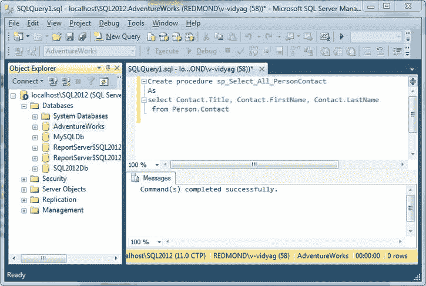
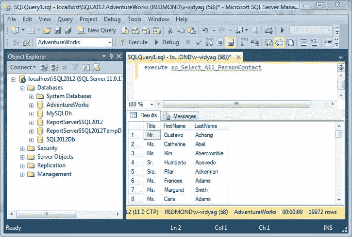
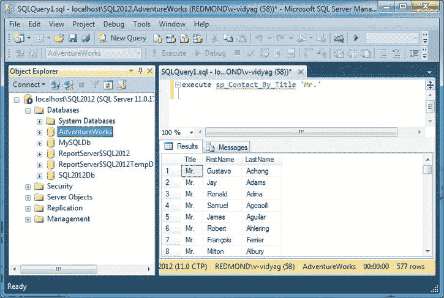
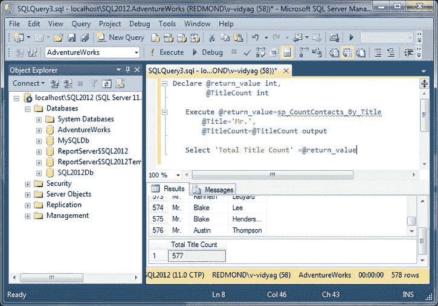
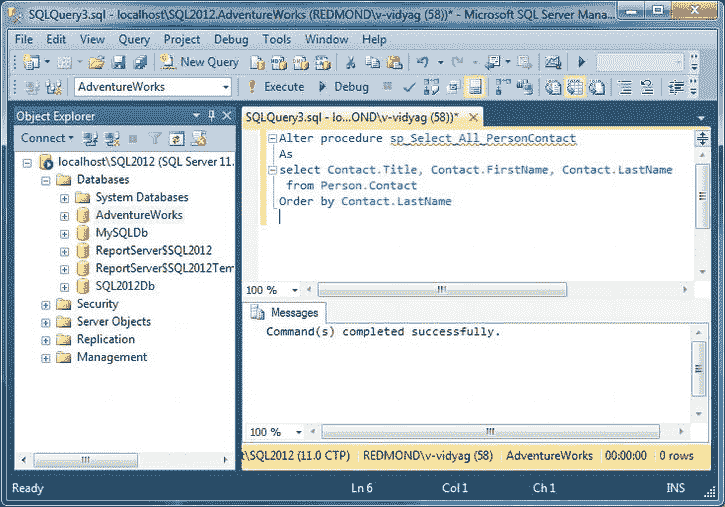
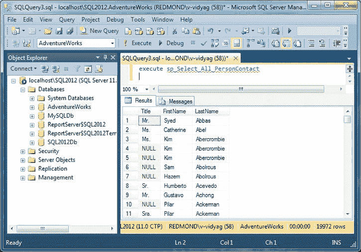
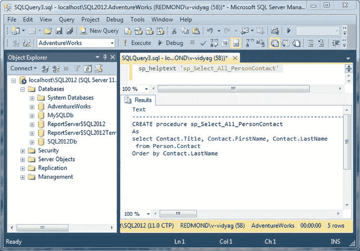
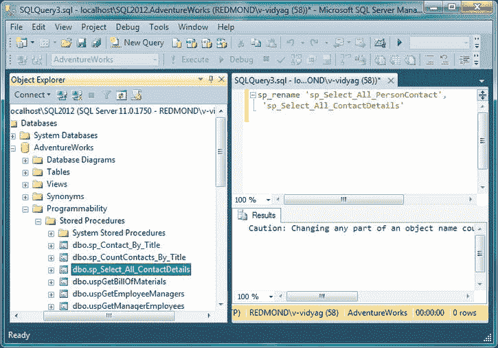
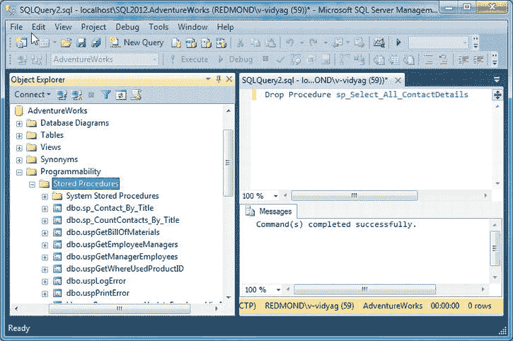

# 六、使用存储过程

*存储过程*是 SQL 语句的集合，允许您重复执行任务。您可以创建一次该过程，并在程序中多次重用它。这可以提高应用的可维护性，并允许应用以统一和优化的方式访问数据库。本章的目标是通过在 SQL Server 2012 中创建和修改存储过程来让您熟悉存储过程，并解释 C# 程序如何与它们交互。本章包括以下内容:

> *   Create stored procedure
> *   Modify stored procedure
> *   Displays the definition of the stored procedure.
> *   Rename stored procedure
> *   Using stored procedures in C#
> *   Delete stored procedure

### 创建存储过程

存储过程可以有用于输入或输出的*参数*。存储过程可以有一个整数*返回值*(默认为零)，并且可以返回零个或多个结果集。可以从客户端程序或其他存储过程中调用它们。它们确实很强大，并且正在成为许多数据库编程的首选模式，特别是对于多层应用和 web 服务，因为(在它们的众多优点中)它们可以大大减少客户机和数据库服务器之间的网络流量。

 **注意**如果您使用的是 AdventureWorks2008R2 数据库，那么将应用一些表名更改。例如，在我的代码示例中，我使用了 Person。联系人表，实际上是人名。AdventureWorks2008R2 中的人物。如果你遇到任何这样的例子，替换掉那个人。与人联系。

#### 尝试一下:在 SQL Server 中使用存储过程

让我们使用 SQL Server Management Studio 创建一个存储过程，该存储过程在 AdventureWorks 数据库中生成一个人的详细联系信息列表。它不需要任何输入，也不需要设置返回值。

1.  Open SQL Server Management Studio and select localhost\SQL2012 as the server name in the Connect Server dialog box. Then click Connect.
2.  在对象资源管理器中，展开“数据库”节点，选择 AdventureWorks 数据库，然后单击“新建查询”窗格。输入以下查询，然后单击“执行”。你应该在[图 6-1](#fig_6_1) 中看到结果。创建过程 sp_Select_All_PersonContact 作为选择联系人。头衔，联系人。名字，联系人。人的姓氏。联系

    ***图 6-1。**使用 SQL Server Management Studio 创建存储过程*

3.  要执行存储过程，输入如图[图 6-2](#fig_6_2) 所示的命令，点击执行。您应该会看到图 6-2 中所示的结果。

    ***图 6-2。**执行存储过程*

#### 它是如何工作的

您使用`CREATE PROCEDURE`来创建存储过程。`AS`关键字将存储过程的签名(过程的名称和参数列表，但是这里没有定义参数)与其主体(组成过程的 SQL)分开。

`Create procedure sp_Select_All_PersonContact
As
select Contact.Title, Contact.FirstName, Contact.LastName
 from Person.Contact`

SQL Server Management Studio 提交了`CREATE PROCEDURE`语句，一旦创建了存储过程，您就可以通过编写以下语句从查询窗格运行它:

`execute sp_Select_All_PersonContact`

就这样！创建存储过程并不复杂。

 **注意**前缀`sp_`是 T-SQL 约定，通常表示存储过程是用 SQL 编写的。前缀`xp_`(表示“扩展过程”)用于表示存储过程不是用 SQL 编写的。(但是，并不是所有 SQL Server 提供的`sp_`存储过程都是用 SQL 编写的。)顺便说一下，SQL Server 2012 提供了数百个`sp_`(和其他)存储过程来执行各种各样的常见任务。

#### 尝试一下:创建一个带有输入参数的存储过程

让我们创建一个存储过程，为任何人的给定职务生成一个联系人列表。我们将把标题传递给存储过程，以便在查询中使用。

1.  Enter the following query and click Execute. You should see the message "Command completed successfully" in the result pane. `Create procedure sp_Contact_By_Title
     @Title nvarchar(8)
     As
    select Contact.Title, Contact.FirstName, Contact.LastName
     from Person.Contact
     where Contact.Title = @Title`
2.  To execute the stored procedure, enter the command and parameter values, select the following statement, and then click Execute. You should see the results shown in Figure 6-3\. `execute sp_Contact_By_Title 'Mr.'`

***图 6-3。**使用输入参数*

#### 它是如何工作的

`CREATE PROCEDURE`语句创建了一个有一个输入参数的存储过程。参数在过程名和`AS`关键字之间指定。这里您只指定了参数名和数据类型，所以默认情况下它是一个输入参数。参数名以`@`开头。

`Create procedure sp_Contact_By_Title
 @Title nvarchar(8)
 As`

该参数用在查询的`WHERE`子句中。

 `where Contact.Title = @Title`

#### 尝试一下:创建一个带有输出参数的存储过程

输出参数通常用于在存储过程之间传递值。换句话说，它们像编程语言中的函数一样用于返回值，所以让我们编写一个带有输出参数的存储过程，这样我们以后就可以在 C# 程序中使用它了。我还将展示如何返回非零值。

> 3。输入以下查询，然后单击“执行”。您应该会在结果窗格中看到消息“命令已成功完成”。

`Create procedure sp_CountContacts_By_Title
 @Title nvarchar(8),
 @TitleCount int= 0 output
 As
select Contact.Title, Contact.FirstName, Contact.LastName
 from Person.Contact
 where Contact.Title = @Title

 Select @TitleCount = count(*)
 from Person.Contact
 where Title=@Title

 return @TitleCount

You have made the stored procedure, and now you need to test it; in order to do so, enter the
following statements in the query pane, making sure you either replace the earlier statements
or select only these statements while executing.

Declare @return_value int,
                 @TitleCount int

        Execute @return_value=sp_CountContacts_By_Title
                @Title='Mr.',
                @TitleCount=@TitleCount output

        Select 'Total Title Count' =@return_value`

如果你看一下右下角的[图 6-3](#fig_6_3) 中的状态栏，你会注意到返回的总行数是 577；这在[图 6-4](#fig_6_4) 中反映为总标题数。

***图 6-4。**使用输出参数*

#### 它是如何工作的

您添加了一个输出参数`@TitleCount`，如下所示:

 `Create procedure sp_CountContacts_By_Title
 @Title nvarchar(8),
 @TitleCount int= 0 output
 As`

您给它分配了一个默认值零。关键字`output`将其标记为输出参数。您还添加了一个额外的查询:

 `select Contact.Title, Contact.FirstName, Contact.LastName
 from Person.Contact
 where Contact.Title = @Title`

您将新查询返回的标量分配给了`SELECT`列表中的输出参数:

`      @TitleCount = count(*)then you returned the same value

return @TitleCount`

`COUNT`函数返回一个整数，所以这是演示如何使用`RETURN`语句的一种便捷方式。

 **提示**输入的参数也可以被赋予默认值。

### 修改存储过程

您可以使用`Alter Procedure procedure_name`语句来修改现有的存储过程。

#### 试试看:修改你的普通存储过程

1.  这里你通过添加一个`Order by`子句来修改[图 6-1](#fig_6_1) 中显示的`sp_Select_All_PersonContact`存储过程。(参见[图 6-5](#fig_6_5) 。)`Alter procedure sp_Select_All_PersonContact
    As
    select Contact.Title, Contact.FirstName, Contact.LastName
     from Person.Contact
    Order by Contact.LastName` 

    ***图 6-5。**修改存储过程*

2.  Execute the stored procedure by writing a statement as shown in figure [, figure 6-6](#fig_6_6) . Please note that the employee names are sorted now (and if you look at figure 6-2 , the records are not sorted).

***图 6-6。**执行修改后的存储过程*

#### 它是如何工作的

在执行完`ALTER PROCEDURE`语句后，数据库中的存储过程被更新。

`        Alter procedure sp_Select_All_PersonContact`

您还在修改过程时添加了`Order by`子句。

`        order by Contact.LastName`

### 显示存储过程的定义

SQL Server 提供了一种查看在数据库中创建的对象的定义的方法。这被称为*元数据检索*。关于对象的信息存储在一些预定义的系统存储过程中，需要时可以检索这些信息。

#### 试试看:查看我们存储过程的定义

1.  Enter the following statement in the Query pane: `Execute sp_helptext 'sp_Select_All_Employees'
    sp_helptext 'sp_Select_All_PersonContact'`
2.  Go to the Query menu, point to Results To, click Results to Text, and then click Go. You will see the same definition as the one you specified for the stored procedure. You can see the output of [in Figure 6-7\.](#fig_6_7)

***图 6-7。**显示存储过程的定义*

#### 它是如何工作的

语句`sp_helptext`是一个预定义的 SQL Server 存储过程，它接受对象名作为参数，并显示作为参数传递给`sp_helptext`的对象的定义。

`        sp_helptext 'sp_Select_All_PersonContact'`

 **注意** `sp_helptext`对表格对象不起作用。换句话说，您看不到创建表对象时使用的`CREATE TABLE`语句的定义。

### 重命名存储过程

SQL Server 允许您重命名对象。以下语句将允许您更改存储过程名称。`sp_rename`是一个预定义的存储过程，允许重命名对象。

#### 试试看:重命名存储过程

1.  Enter the following statement in the query pane: `sp_rename 'sp_Select_All_PersonContact,
          'sp_Select_All_ContactDetails'`
2.  点击执行，在结果窗格中会看到以下消息:

     **警告**改变对象名的任何部分都可能破坏脚本和存储过程.

    即使存储过程`sp_rename`已经成功执行,它仍然显示警告消息现在转到对象浏览器，展开 AdventureWorks 数据库节点，展开可编程性，右键单击存储过程节点，选择刷新。

3.  Expand the stored procedures node and notice that sp_Select_All_PersonContact has been renamed sp_Select_All_ContactDetails. You should see the screen shown in Figure 6-8.

***图 6-8。**重命名存储过程*

#### 它是如何工作的

语句`sp_rename`是一个预定义的 SQL Server 存储过程，它接受对象的旧名称和新名称作为参数。

`sp_rename 'sp_Select_All_PersonContact,
                            'sp_Select_All_ContactDetails'` 

 **注意** `sp_rename`在您想要重命名大多数对象时非常好用，比如表格、列和其他对象。

### 删除存储过程

一旦创建了存储过程，如果不需要它的功能，可以将其删除。`Drop Procedure procedure_name`是基本语法。

 **注意**因为我们将需要这些创建的存储过程，如果您在下面的练习中选择删除一个，请重新创建它，这样任何依赖关系都不会丢失。

#### 试试看:删除存储过程

让我们删除第一个存储过程(`sp_Select_All_PersonContact`)，我们刚刚将其重命名为`sp_Select_All_ContactDetails`。

1.  Enter the following statement in the query pane (replace the query with this statement), and click Execute: `                Drop procedure sp_Select_All_ContactDetails`
2.  You will see the following message: `                Command(s) completed successfully.`
3.  After deleting the stored procedure, navigate to Object Explorer and expand the AdventureWorks database node; Then expand Programmability, right-click the Stored Procedures node, and select Refresh. Please note that the program `sp_Select_All_ContactDetails` has been deleted (see [Figure 6-9](#fig_6_9) ) and is no longer listed in the object browser, as you can see in [Figure 6-8](#fig_6_8) .

***图 6-9。**删除存储过程*

### 总结

在本章中，您创建了存储过程，并且了解了从 SSMS 创建、执行和修改存储过程所涉及的内容。您看到了调用存储过程与执行查询和语句并没有本质上的不同。您只需为需要使用的存储过程参数创建适当的命令参数。在下一章，你将学习如何使用 SQL 查询产生 XML 输出。