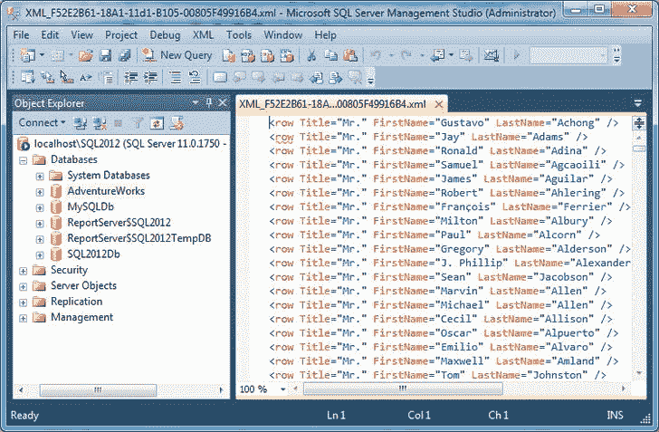
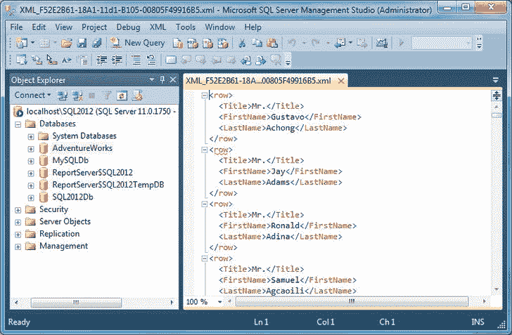
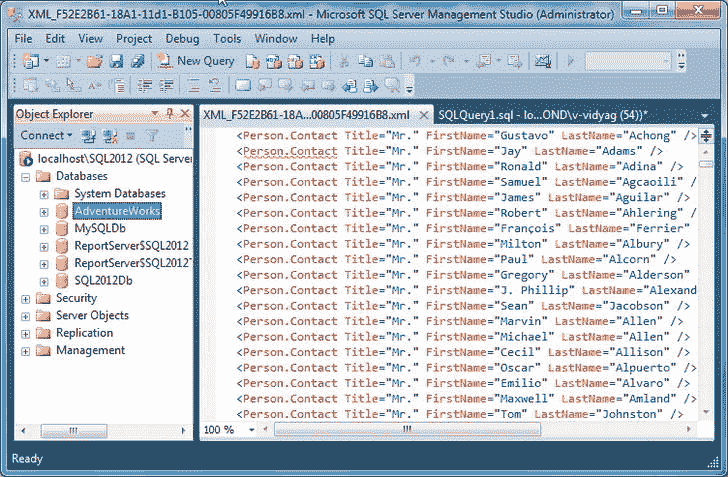
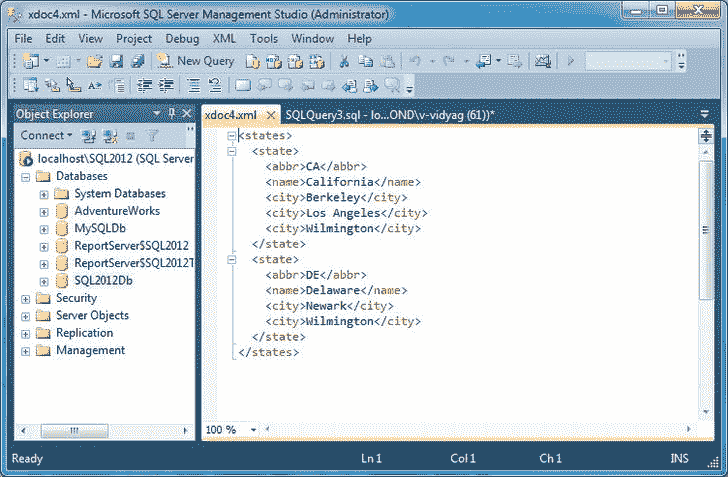

# 七、使用 XML

XML 已经存在很多年了；随着微软的发布。NET 技术，XML 变得更加流行。微软的开发工具和技术包含支持 XML 的内置特性。使用 XML 及其相关技术的优势在于它是 Internet 和. net 的主要基础。

我在本章的目标是向您介绍最基本的 XML 概念和术语，以及在 SQL Server 2012 中使用 XML 的基本技术。这将使您能够在编写软件应用时处理一些常见的编程任务。

本章将涵盖以下内容:

> *   Define XML
> *   Understand why XML is used
> *   Benefits of storing data as XML
> *   Understanding XML documents
> *   Understanding XML declarations
> *   Transforming relational data into XML
> *   Use `xml` data type.
> 
> 存储和检索 XML 文档

### 定义 XML

XML 代表可扩展标记语言。XML 源自标准通用标记语言(SGML)。XML 是一种元语言。元语言不是用于编程，而是用于定义其他语言，XML 定义的语言被称为*标记语言*。标记正是它所暗示的:一种“标记”某物的方式。XML 文档是文本文档的形式，人和计算机都可以阅读。

 **注**本质上，每个 XML 文档都是由文档中使用的 XML 元素定义的语言的一个实例。特定的语言可能已被明确定义，也可能未被明确定义，但是 XML 的专业使用需要仔细规划自己的 XML *词汇表*，并在一个*模式*中指定其定义，该模式可用于验证文档是否符合词汇表的语法和语义。XML 模式定义(XSD)是定义 XML 词汇表的语言。

万维网联盟(W3C)于 1996 年开发了 XML。为了支持各种各样的应用，W3C 使用 XML 来创建可扩展 HTML (XHTML)，这是一种 XML 词汇表。自 1996 年以来，W3C 开发了各种其他面向 XML 的技术，包括可扩展样式表语言(XSL)和 XSL 转换(XSLT)，XSL 为 XHTML 提供的功能与层叠样式表(CSS)为 HTML 提供的功能相同，XSL 转换是一种将 XML 文档转换为其他 XML 文档的语言。

### 为什么选择 XML

XML 是一种多用途、可扩展的数据表示技术。XML 增加了应用消费和操作数据的可能性。XML 不同于关系数据；XML 数据可以是结构化的、半结构化的或非结构化的。SQL Server 2012 中的 XML 支持与关系引擎和查询优化器完全集成，允许您检索和修改 XML 数据，甚至在 XML 和关系数据表示之间进行转换。

### 将数据存储为 XML 的好处

XML 是一种独立于平台的数据表示格式，它为特定的数据表示需求提供了优于关系格式的某些好处。

将数据存储为 XML 有很多好处:

> *   Because XML is self-describing, applications can use XML data without knowing the schema or structure. XML data is always hierarchically arranged in a tree structure. The XML tree structure must always have a root or parent node, which is the so-called XML *document* .
> *   Maintain XML document sorting. Because XML is arranged in a tree structure, it is easy to maintain the order of nodes.
> *   XML Schema is used to define a valid XML document structure.
> *   Because of the hierarchical structure of XML, you can search within the tree structure. XQuery and XPath are query languages for searching XML data.
> *   Data stored as XML is extensible. It is easy to manipulate XML data by inserting, modifying and deleting nodes.

 **注**结构良好的 XML 是一种符合 W3C XML 1.0 推荐标准所规定的一组约束的 XML 文档。例如，格式良好的 XML 必须包含一个根级元素，并且任何其他嵌套元素必须正确打开和关闭，不能混淆。SQL Server 2005 验证一些格式良好的约束。一些规则，比如对根级元素的要求，没有被强制执行。关于格式良好性要求的完整列表，请参考位于`[www.w3.org/TR/REC-xml](http://www.w3.org/TR/REC-xml)`的 W3C XML 1.0 推荐标准。

### 理解 XML 文档

XML 文档可以是计算机上的物理文件，也可以是网络上的数据流(理论上，它被格式化以便人们可以阅读，但实际上，它通常是压缩的二进制形式)，或者只是内存中的一个字符串。然而，它本身必须是完整的，即使没有模式，它也必须遵守某些规则。

最基本的规则是，XML 文档必须是*格式良好的*。最简单地说，这意味着不允许元素重叠，所以必须在父元素的结束标签之前关闭所有的*子元素*。例如，这个 XML 文档是格式良好的:

`<states>
   <state>
      <name>Delaware</name>
      <city>Dover</city>
      <city>Wilmington</city>
   </state>
</states>`

它有一个由开始标签`<states>`和结束标签`</states>`分隔的*根*(或*文档*)元素`states`。根元素是`state`元素的父元素，而后者又是一个`name`元素和两个`city`元素的父元素。一个 XML 文档只能有一个根元素。

元素可能有*属性*。例如，前面的文档可以重写如下，其中`name`用作`state`元素的属性:

`<states>
   <state name="Delaware">
      <city>Dover</city>
      <city>Wilmington</city>
   </state>
</states>`

它保留相同的信息，用一个`name`属性替换只出现一次的`name`元素，并将原始元素(`Delaware`)的*内容*更改为属性(`"Delaware"`)的*值*。一个元素可以有任意数量的属性，但是它不能有重复的属性，所以`city`元素不是替换的候选。

元素可能有内容(文本数据或其他元素)，也可能是*空*。例如，如果您希望(只是为了便于讨论)跟踪文档中有多少个状态，您可以使用一个空元素来实现:

`<states>
   <controlinfo count="1"/>
   <state name="Delaware">
      <city>Dover</city>
      <city>Wilmington</city>
   </state>
</states>`

空元素`controlinfo`有一个属性`count`，但是没有内容。注意，它不是由开始和结束标记分隔的，而是存在于一个*空元素标记*中(以`<`开始，以`/>`结束)。

使用开始和结束标记的空元素的替代语法也是有效的:

`   <controlinfo count="1"></controlinfo>`

许多生成 XML 的程序都使用这种形式。

 **注意**虽然设计 XML 文档很容易，但是设计好它们就像设计数据库一样具有挑战性。许多有经验的 XML 设计者不同意属性的最佳用法，甚至不同意是否应该使用属性(如果没有属性，空元素实际上没有任何用处)。虽然元素可能在某些方面更理想地映射到关系数据，但这并不意味着属性在 XML 设计中没有位置。毕竟，XML 并不打算(原则上也不能)符合数据的关系模型。事实上，您将会看到，在 T-SQL 中,“纯”元素设计可能更难处理。

### 理解 XML 声明

除了元素和属性之外，XML 文档还可以有其他部分，但是只有当您真正需要深入研究 XML 时，大多数部分才是重要的。虽然是可选的，但是为了精确地符合 W3C 推荐标准， *XML 声明*是应该包含在 XML 文档中的一部分。如果使用，它必须出现在 XML 文档中的根元素之前。

XML 声明在格式上类似于元素，但是在尖括号旁边有问号。它总是有一个名为`version`的属性；目前，这有两个可能的值:`"1.0"`和`"1.1"`。(定义了几个其他属性，但不是必需的。)因此，XML 声明的最简单形式如下:

`<?xml version="1.0" ?>`

XML 还有其他方面，但这是您开始学习的全部内容。事实上，这可能是你变得高效所需要的全部。正如您将看到的，我们在 XML 文档中不使用任何 XML 声明(或者更重要的东西，比如 XML 模式和名称空间)，但是我们的小例子工作得很好，代表了基本的 XML 处理，并且可以扩展到更大的 XML 文档。

### 将关系数据转换为 XML

一个`SELECT`查询将结果作为一个行集返回。通过在查询中指定`FOR` XML 子句，您可以选择将 SQL 查询的结果检索为 XML。SQL Server 2005 使您能够通过在`SELECT`语句中使用`FOR` XML 子句将关系数据提取为 XML 形式。SQL Server 2005 扩展了`FOR` XML 功能，使得表示复杂的层次结构和添加新的关键字来修改生成的 XML 结构变得更加容易。

 **注**在[第 13 章](13.html)中，我展示了如何从一个数据集中提取数据，将其转换成 XML，并用数据集的`WriteXml`方法将其写入一个文件。

`FOR` XML 子句将查询的结果集转换成 XML 结构，它提供了四种格式模式:

> *   `FOR XML RAW`
> *   `FOR XML AUTO`
> *   `FOR XML PATH`
> *   `FOR XML EXPLICIT`

我们将在示例中使用前两个来展示如何用查询生成 XML。

#### 使用 FOR XML RAW

`RAW`模式将查询结果集中的每一行都转换成一个 XML 元素，对于结果集中显示的每一行都标识为`row`。在显示结果集时，`SELECT`语句中的每个列名都作为属性添加到`row`元素中。

默认情况下，行集合中不是`NULL`的每个列值都被映射到`row`元素的一个属性。

#### 试试看:使用 FOR XML RAW(以属性为中心)

1.  Let's generate SQL query results in the original XML format. `FOR XML RAW` is the statement that we will use to generate output, which you will see in the following steps. In Object Explorer, expand the Databases node, select the AdventureWorks database, and then click the New Query window. Enter the following query and click execute: `select  Person.Contact.Title, Person.Contact.FirstName, Person.Contact.LastNamefrom
    Person.Contact
    where  Person.Contact.Title ='Mr.'
    for xml raw`
2.  You will see a link in the result pane of the query pane. Click on the link, and you should see the result as shown in Figure 7-1.

***图 7-1。**使用 FOR XML RAW*

#### 它是如何工作的

模式产生非常“原始”的 XML。它将结果集中的每一行转换成一个空的 XML `row`元素，并为每个列值使用一个属性，使用我们在查询中指定的别名作为属性名。它产生一个由所有元素组成的字符串。

`RAW`模式不会生成 XML 文档，因为它的根元素(`raw`)与结果集中的行数一样多，而一个 XML 文档只能有一个根元素。

#### 试试看:使用 FOR XML RAW(以元素为中心)

将格式从以属性为中心(如前面的示例所示)更改为以元素为中心意味着将为每一列创建一个新元素。为此，您需要在`FOR XML RAW`子句后添加`ELEMENTS`关键字，如下面的查询所示。

1.  Replace the existing query in the query pane with the following query, and click Go: `select  Person.Contact.Title, Person.Contact.FirstName, Person.Contact.LastNamefrom
    Person.Contact
    where  Person.Contact.Title ='Mr.'
    for xml raw, elements`
2.  You will see a link in the result pane of the query pane. Click on the link, and you should see the result in [Figure 7-2](#fig_7_2) .

***图 7-2。**使用 FOR XML 原始元素*

#### 它是如何工作的

`RAW` `ELEMENTS`模式产生非常“以元素为中心”的 XML。它将结果集中的每一行、每一列转换为一个属性。

`RAW ELEMENTS`模式也不会生成 XML 文档，因为它的根元素(`raw`)与结果集中的行数一样多，而一个 XML 文档只能有一个根元素。

#### 试试看:重命名行元素

对于结果集中的每一行，`RAW`模式生成一个名为`row`的元素。您可以通过为`RAW`模式指定一个可选参数来为该元素指定另一个名称，如该查询所示。为此，您需要在`FOR XML RAW`子句后添加一个别名，如下面的查询所示。

1.  Replace the existing query in the query window with the following query, and click Go: `select  Person.Contact.Title, Person.Contact.FirstName, Person.Contact.LastNamefrom
    Person.Contact
    where  Person.Contact.Title ='Mr.'
    for xml raw ('PersonDetails'), elements`
2.  You will see a link in the result pane of the query pane. Click on the link, and you should see the results in Figure 7-3.

***图 7-3。**重命名`row`元素*

#### 它是如何工作的

`RAW ('alias')`模式产生输出，其中`row`元素被重命名为查询中指定的别名。

因为在查询中添加了`ELEMENTS`指令，所以结果是以元素为中心的，这就是为什么用指定的别名重命名了`row`元素。如果不在查询中添加`ELEMENTS`关键字，那么输出将是以属性为中心的，并且`row`元素将被重命名为查询中指定的别名。

#### 关于 XML 原始格式的观察

以下是关于`XML RAW`的小技巧:

> *   `XML RAW` does not provide the root node, which is why the XML structure is not a well-formed XML document.
> *   Because `XML RAW` supports attribute and element-centered format, all columns must be formatted in the same way. Therefore, it is impossible to return the XML structure of XML attributes and XML elements at the same time.
> *   `XML RAW` Generate a hierarchical structure in which all elements in the XML structure are at the same level.

#### 使用 FOR XML AUTO

模式将查询结果作为嵌套的 XML 元素返回。这并不能很好地控制从查询结果生成的 XML 的形状。因此，如果您想要生成简单的层次结构，`AUTO`模式查询非常有用。

在`FROM`子句中的每个表，至少有一列在`SELECT`子句中列出，被表示为一个 XML 元素。在`SELECT`子句中列出的列被映射到属性或子元素。

#### 尝试一下:使用 FOR XML AUTO

让我们将 SQL 查询结果生成为嵌套的 XML 元素。`FOR XML AUTO`是我们将用来生成输出的语句，您将在以下步骤中看到:

1.  Replace the existing query in the query pane with the following query, and then click Go: `select  Person.Contact.Title, Person.Contact.FirstName, Person.Contact.LastName
    from Person.Contact
    where  Person.Contact.Title ='Mr.'
    for xml auto`
2.  You will see a link in the result pane of the query pane. Click on the link, and you should see the results in Figure 7-4.

***图 7-4。**使用 FOR XML AUTO*

#### 它是如何工作的

三列，联系。头衔，联系人。名字和联系人。姓氏，引用这个人。联系表。所以，一个人。添加 Contact 元素，并添加三列作为 Person.Contact 的属性。

#### 关于 XML 自动格式化的观察

以下是关于`XML AUTO`的提示:

> *   `XML AUTO` No root node is provided, which is why the XML structure is not a well-formed XML document.
> *   Because `XML AUTO` supports attribute and element-centered format, all columns must be formatted in the same way. Therefore, it is impossible to return the XML structure of XML attributes and XML elements at the same time.
> *   `XML AUTO` does not provide a renaming mechanism like `XML RAW`, but `XML AUTO` uses the names and aliases of tables and columns (if any).

### 使用 XML 数据类型

SQL Server 2012 有一个数据类型`xml`，它不仅用于保存 XML 文档(本质上是字符串，可以存储在任何足够大的字符列中)，还用于处理 XML 文档。当我讨论将 XML 文档解析成 DOM 树时，我没有提到一旦解析完成，XML 文档就可以更新。您可以更改元素内容和属性值，还可以在层次结构中添加和删除元素。

这里不会更新 XML 文档，但是`xml`数据类型提供了更新 XML 文档的方法。它是一种非常不同的 SQL Server 数据类型，描述如何利用它需要一本自己的书——可能不止一本。这里的重点是每个数据库程序员需要知道的:如何使用`xml`类型来存储和检索 XML 文档。

 **注意**处理 XML 文档的方法太多了(即使在 ADO.NET 和 SQL Server 2000 的支持包 SQLXML 中也是如此)，只有时间才能证明将这些特性集成到 SQL Server 数据类型中是否值得。因为 XML 是一项如此重要的技术，能够完全用 T-SQL 处理 XML 文档确实提供了许多可能性，但是现在还不清楚您还需要了解多少关于`xml`数据类型的知识。无论如何，这一章将会给你开始实验所需要知道的东西。

#### 试试看:创建一个表来存储 XML

要创建保存 XML 文档的表，请按照下列步骤操作:

1.  在对象资源管理器中，选择之前创建的数据库 SQL2012Db，点击新建查询。

     **注意**为了保持冒险工厂的整洁,我使用的是 SQL2012Db 数据库；您可能希望在同一个或另一个数据库中执行以下语句在查询窗格中，键入以下查询，然后单击执行:`create table xmltest
    (
       xid  int not null primary key,
       xdoc xml not null
    )`

#### 工作原理

这与没有`xml`数据类型的`CREATE TABLE`语句的工作方式相同。尽管我已经说过`xml`数据类型不同于其他 SQL Server 数据类型，但是`xml`类型的列的定义与其他任何列一样。(但是它们不能用在主键中。)

现在，您将把 XML 文档插入到`xmltest`中，并查询它以查看它们是否被存储。

#### 尝试一下:存储和检索 XML 文档

要插入 XML 文档，请按照下列步骤操作:

1.  用[清单 7-1](#list_7_1) 中的代码替换 SQL 编辑窗口中的代码。

    ***清单 7-1。**将可扩展置标语言文档插入 xmltest*

    `insert into xmltest
    values(
    1,
    '
    <states>
       <state>
          <abbr>CA</abbr>
          <name>California</name>
          <city>Berkeley</city>
          <city>Los Angeles</city>
          <city>Wilmington</city>
       </state>
       <state>
          <abbr>DE</abbr>
          <name>Delaware</name>
          <city>Newark</city>
          <city>Wilmington</city>
       </state>
    </states>
    '
    )

    insert into xmltest
    values(
    2,
    '
    <states>
       <state abbr="CA" name="California">
          <city name="Berkeley"/>
          <city name="Los Angeles"/>
          <city name="Wilmington"/>
       </state>
       <state abbr="DE" name="Delaware">
          <city name="Newark"/>
          <city name="Wilmington"/>
       </state>` `</states>
    '
    )`
2.  Run two `INSERT` statements, and then display the table with `select * from xmltest`. You will see the two lines displayed. Click the `xdoc` column in the first row, and you should see the XML as shown in figure [and figure 7-5](#fig_7_5) .

***图 7-5。**查看 XML 文档*

#### 它是如何工作的

这和所有的工作一样。您只需提供整数形式的主键和字符串形式的 XML 文档。查询也像预期的那样工作。

### 总结

本章涵盖了每个 C# 程序员都需要了解的 XML 基础知识。它还向您展示了如何使用最常用的 T-SQL 特性从表中提取 XML 并像查询表一样查询 XML 文档。最后，我讨论了`xml`数据类型，并给你一些使用它的练习。

关于使用 XML 文档的 XML 或 T-SQL 和 about 工具，您还需要了解多少取决于您需要做什么。对许多人来说，这一章可能是你真正需要了解的关于 XML 的全部内容。对于那些进行更复杂的 XML 处理的人来说，您现在已经有了自己进行实验的坚实基础。在下一章，你将学习事务。