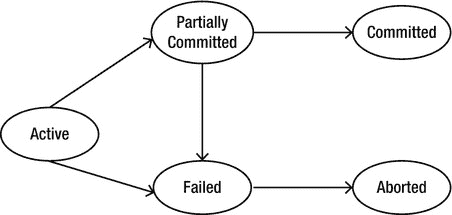
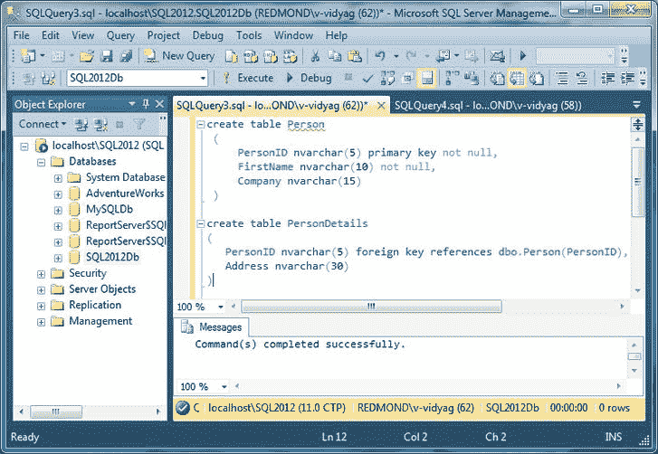
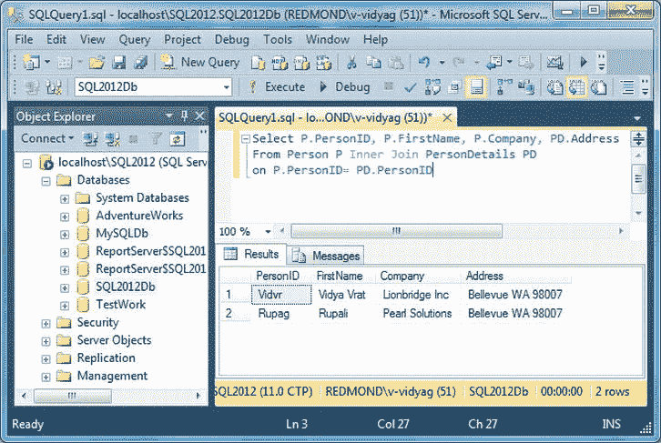
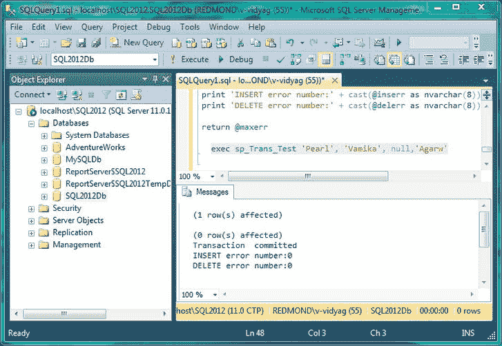
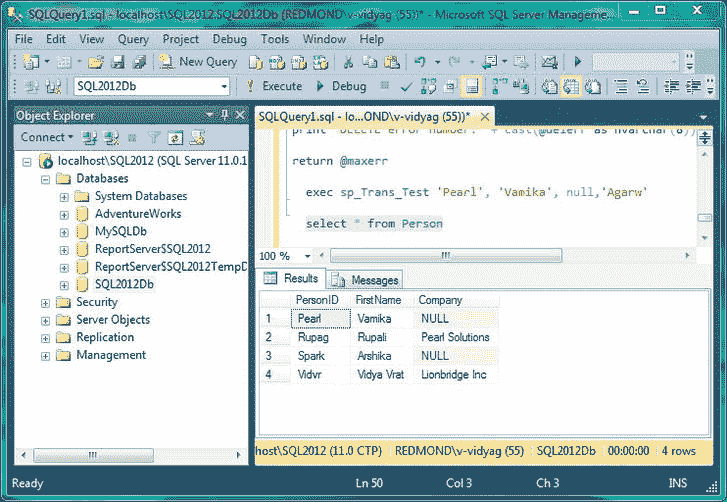
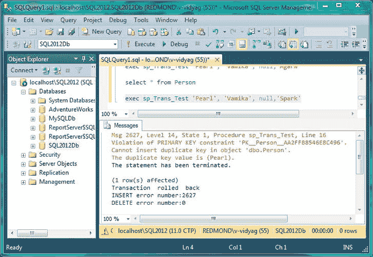
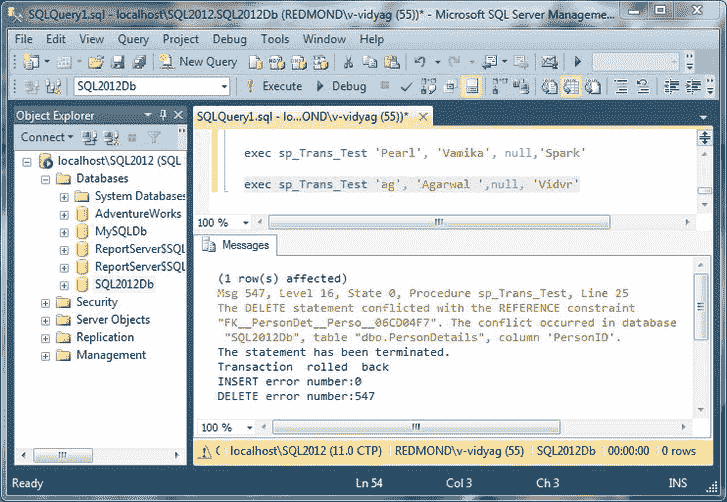
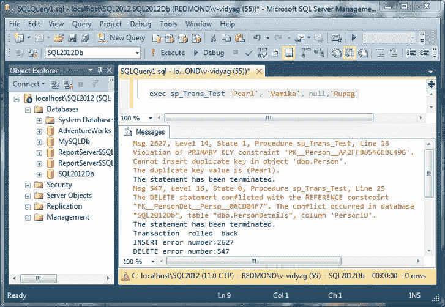

# 八、了解事务

对于任何企业来说，事务都起着关键作用。它们可能包括许多单独的操作甚至其他事务。对于多个相关操作以及多个用户并发更新数据库的情况，事务对于维护数据完整性至关重要。

本章将讨论与事务相关的概念以及如何在 SQL Server 2012 中使用事务。

在本章中，我将介绍以下内容:

> *   What is a deal?
> *   When to use transactions
> *   Understanding ACID attributes
> *   Transaction design
> *   Transaction status
> *   Specify transaction boundary
> *   T-SQL statements allowed in transactions
> *   Local transactions in SQL Server 2012
> *   Distributed transactions in SQL Server 2012
> *   Guidelines for writing efficient transactions
> *   How to write transactions

### 什么是事务？

一个*事务*是一组被执行的操作，因此所有操作作为一个单元被保证成功或失败。

事务的一个常见例子是将钱从支票账户转移到储蓄账户的过程。这涉及到两个操作:从支票账户中扣款，并将其添加到储蓄账户中。两者必须同时成功并被*提交*到账户，或者两者必须同时失败并被*回滚*，以便账户保持一致的状态。在任何情况下，钱都不能从支票账户中扣除，而不能存入储蓄账户(反之亦然)。通过使用事务，可以保证借贷两种操作同时成功或失败。因此，两个帐户始终保持一致的状态。

#### 何时使用事务

当几个操作必须作为一个整体成功或失败时，应该使用事务。以下是一些建议使用事务的常见场景:

> *   In batch processing, when changes to one table require other tables to be consistent, multiple rows must be inserted, updated or deleted as a unit.
> *   When data in two or more databases are modified at the same time
> *   In a distributed transaction
> *   To manipulate data in databases on different servers.

当您使用事务时，您将锁定数据，等待对数据库的永久更改。在释放锁之前，不能对锁定的数据进行其他操作。您可以锁定从单个行到整个数据库的任何内容。这被称为*并发性，*意味着数据库如何一次处理多个更新。

在银行示例中，锁确保两个独立的事务不会同时访问同一个帐户。如果他们这样做，存款或取款都可能丢失。

 **注意**让事务保持最短的等待时间是很重要的。锁阻止其他人访问锁定的数据库资源。太多的锁或者频繁访问的资源上的锁会严重降低性能。

### 了解酸的特性

事务由四个属性来表征，通常称为 *ACID 属性:*原子性、一致性、隔离性和持久性。

 **注**酸一词是安德烈·路透在 1983 年提出的。

> 原子性:如果一个事务被视为一个单独的动作，而不是一组独立的操作，那么它就是原子的。因此，只有当所有单独的操作都成功时，事务才会成功并提交给数据库。另一方面，如果单个操作在事务期间失败，则所有操作都被认为已经失败，如果已经发生，则必须撤消(回滚)。对于 Northwind 数据库的订单输入系统，当您在 Orders 和 Order Details 表中输入订单时，数据将一起保存在这两个表中，或者根本不保存。
> 
> *一致性:*事务应该使数据库保持一致的状态——不管它是否成功完成。事务修改的数据必须符合对列的所有约束，以维护数据完整性。对于 Northwind，如果 Orders 表中没有相应的行，则 Order Details 表中不能有行，因为这将使数据处于不一致的状态。
> 
> *隔离:*每个事务都有一个明确定义的边界——也就是说，它与另一个事务是隔离的。一个事务不应该影响同时运行的其他事务。一个事务所做的数据修改必须与所有其他事务所做的数据修改隔离开来。一个事务看到数据处于另一个并发事务修改它之前的状态，或者在第二个事务完成后看到数据，但看不到中间状态。
> 
> *持久性:*成功事务中发生的数据修改将永久保存在系统中，不管发生了什么。维护事务日志，以便在出现故障时，数据库可以恢复到故障前的原始状态。每个事务完成后，都会在数据库事务日志中记录一行。如果出现了需要从备份中恢复数据库的重大系统故障，那么可以使用这个事务日志来插入(前滚)已经发生的任何成功的事务。

为事务提供支持的每个数据库服务器都会自动实施这四个 ACID 属性。

#### 事务设计

事务表示真实世界的事件，例如银行事务、机票预订、资金汇款等等。

事务设计的目的是定义和记录数据库系统所需的事务的高级特征，包括以下内容:

> *   Data to be used for the transaction
> *   The functional characteristics of the transaction
> *   Output of the transaction
> *   Importance to users
> *   Expected utilization rate

有三种主要的事务类型:

> *   *Retrieval transaction* : Retrieve data from the display screen.
> *   *Update transaction* : Insert new records, delete old records or modify existing records in the database.
> *   *Mixed transaction* : It involves retrieving and updating data.

### 事务状态

在没有失败的情况下，所有事务都成功完成。然而，事务可能不总是成功地完成其执行。这种事务被称为*中止*。

成功完成其执行的事务被称为*提交。* [图 8-1](#fig_8_1) 显示如果一个事务已经被部分提交，它将被提交但仅当它没有失败；如果事务失败，它将被中止。

***图 8-1。**事务状态*

#### 指定事务边界

SQL Server 事务边界通过使用 API 函数和方法帮助您确定 SQL Server 事务的开始和结束时间:

> *   T7 Transact-SQL Statement T8: Use statements T0, T1, T2, T3, T4 and T5 to describe transactions. These are mainly used in DB-Library applications and T-SQL scripts, such as scripts that use the `osql` command to prompt the utility to run.
> *   *API functions and methods [T1】 :ODBC, OLE DB, ADO, the and other database APIs. Namespaces contain functions or methods for describing transactions. These are the main mechanisms for controlling transactions in database engine applications.*

每个事务只能由这些方法中的一种来管理。在同一事务中使用这两种方法会导致不确定的结果。例如，您不应该使用 ODBC API 函数启动事务，然后使用 T-SQL `COMMIT`语句来完成事务。这不会通知 SQL Server ODBC 驱动程序事务已提交。在这种情况下，使用 ODBC `SOLEndTran`函数来结束事务。

#### 事务中允许的 T-SQL 语句

您可以在一个事务中使用所有 T-SQL 语句，但以下语句除外:`ALTER DATABASE`、`RECONFIGURE`、`BACKUP`、`RESTORE`、`CREATE DATABASE`、`UPDATE STATISTICS`和`DROP DATABASE`。

此外，您不能使用`spdboption`来设置数据库选项，也不能使用任何在显式或隐式事务中修改主数据库的系统过程。

#### SQL Server 2012 中的本地事务

所有数据库引擎都应该为事务提供内置支持。仅限于单个资源或数据库的事务被称为*本地事务。*本地事务可以是以下四种事务模式之一:

> *   *Auto-commit transaction* : Auto-commit mode is the default transaction management mode of SQL Server. Every T-SQL statement will be submitted or rolled back after completion. If the statement completes successfully, submit the statement; If it encounters any errors, it will definitely roll back. As long as the default mode is not covered by any type of transaction, the SQL Server connection will run in auto-commit mode.
> *   *显式事务*:显式事务是那些你显式控制事务何时开始，何时结束的事务。在 SQL Server 2000 之前，显式事务也被称为*用户定义的*或*用户指定的*事务。
>     
>     这种模式的数据库备份与还原脚本使用了`BEGIN TRANSACTION`、`COMMIT TRANSACTION`和`ROLLBACK TRANSACTION`语句。显式事务模式仅在事务持续期间有效。当事务结束时,连接返回到显式事务开始之前的事务模式.
>     
>     
> *   *隐式事务*:当您使用 SQL Server Management Studio 连接到数据库并执行 DML 查询时，更改会自动保存。这是因为，默认情况下，连接处于自动提交事务模式。如果您不希望提交任何更改，除非您明确指出，则需要将连接设置为隐式事务模式。
>     
>     您可以使用`SET IMPLICIT TRANSACTIONS ON|OFF`将数据库连接设置为隐式事务模式.
>     
>     
>     
>     将连接的隐式事务模式设置为`ON`后，SQL Server 会在首次执行以下语句时自动启动一个事务:`ALTER TABLE``CREATE``DELETE``DROP``FETCH``GRANT``INSERT``OPEN``REVOKE``SELECT``TRUNCATE TABLE`和`UPDATE`.
>     
>     T44】事务保持有效,直到明确发布了`COMMIT`或`ROLLBACK`语句。这意味着,当对数据库中的特定记录发出`UPDATE`语句时，SQL Server 将保持对数据修改范围内的数据的锁定,直到发出`COMMIT`或`ROLLBACK`为止。如果这两个命令都没有发出,当用户断开连接时,事务将自动回滚。这就是为什么在高度并发的数据库上使用隐式事务模式不是最佳实践的原因
> *   *Batch-scope transaction* : If multiple active result sets (MARS) are enabled for the transaction running in it, the connection can be in batch-scope transaction mode. Basically, MARS has an associated batch execution environment, because it allows ADO.NET to take advantage of the ability of SQL Server 2012 to have multiple active commands on a single connection object.

当启用 MARS 时，您可以同时执行多个交错的批处理，因此对执行环境所做的所有更改都局限于特定的批处理，直到该批处理的执行完成。一旦批处理的执行完成，执行设置将被复制到默认环境中。因此，如果一个连接正在运行一个事务，在其上启用了 MARS，并且同时运行多个批处理，则称该连接正在使用批处理范围的事务模式。

MARS 允许执行多批交错的命令。但是，MARS 不允许在同一个连接上有多个事务；它只允许有多个活动的结果集。

#### SQL Server 2012 中的分布式事务

与局限于单个资源或数据库的本地事务相反，*分布式事务*跨越两个或多个服务器，它们被称为*资源管理器。*事务管理需要通过称为*事务管理器*或*事务协调器的服务器组件在资源管理器之间进行协调。* SQL Server 可以作为由事务管理器(如 Microsoft 分布式事务协调器(MS DTC ))协调的分布式事务的资源管理器。

跨两个或更多数据库的单个 SQL Server 事务实际上是分布式事务。但是，SQL Server 在内部管理分布式事务。

在应用级别，分布式事务的管理方式与本地事务非常相似。在事务结束时，应用请求提交或回滚事务。事务管理器必须以不同的方式管理分布式提交，以最大限度地降低网络故障的风险，网络故障可能会导致由于各种原因导致的故障，导致其中一个资源管理器提交而不是回滚事务。这种危急情况可以通过分两个阶段管理提交过程来处理，也称为*两阶段提交:*

> *   *Preparation stage* : When the transaction manager receives the submission request, it sends a preparation command to all resource managers involved in the transaction. Then, each resource manager performs all operations required to persist the transaction and flushes all buffers holding any log images of other transactions to disk. When each resource manager completes the preparation phase, it returns the success or failure of the preparation phase to the transaction manager.
> *   *Submission stage* : If the transaction manager receives successful preparations from all resource managers, it sends a `COMMIT` command to each resource manager. If all resource managers report successful submission, the transaction manager will send a successful notification to the application. If any resource manager reports that the preparation fails, the transaction manager will send a `ROLLBACK` statement to each resource manager and indicate the submission failure to the application.

#### 编码高效事务的指南

我建议您在编写事务代码时使用以下准则，以尽可能提高效率:

> *   *Do not require input from users during a transaction.*
>     
>     Get all necessary inputs from users before the transaction starts. If additional user input is needed during the transaction, roll back the current transaction and restart the transaction after providing user input. Even if users respond immediately, the reaction time of human beings is much slower than that of computers. All resources held by a transaction are held for a very long time, which may lead to blocking problems. If the user does not respond, the transaction will remain active and key resources will be locked until the user responds, which may take several minutes or even hours.
>     
>     
> *   *Do not open a transaction while browsing through data, if at all possible.*
>     
>     Trading should not be started until all preliminary data analysis is completed.
>     
>     
> *   *Keep the transaction as short as possible.*
>     
>     After you know the necessary modification, start a transaction, execute the modification statement, and then immediately commit or roll back. Don't open the transaction until you need it.
>     
>     
> *   *Make intelligent use of lower cursor concurrency options, Such as optimal concurrency options.*
>     
>     In a system with low probability of concurrent update, the cost of dealing with the occasional "after you read the data, others changed your data" error is much lower than that of always locking the data rows when reading the data.
>     
>     
> *   *Access the least amount of data possible while in a transaction.*
>     
>     The smaller the amount of data you access in a transaction, the smaller the number of rows locked, thus reducing the contention between transactions.

#### 如何为事务编码

以下三个 T-SQL 语句控制 SQL Server 中的事务:

> *   `BEGIN TRANSACTION`: It marks the beginning of a transaction.
> *   `COMMIT TRANSACTION`: marks the successful completion of the transaction. It will notify the database to save the job.
> *   `ROLLBACK TRANSACTION`: This indicates that the transaction failed, and informs the database to roll back to the state before the transaction.

注意没有`END TRANSACTION`语句。事务在(显式或隐式)提交和回滚时结束。

#### T-SQL 中的编码事务

您将使用存储过程来练习用 SQL 编写事务代码。这是一个有意人为的例子，但是代表了事务处理的基本原理。它让事情变得简单，这样你就可以专注于事务中可能发生的重要问题。这才是你真正需要理解的，尤其是在本书后面的 C# 应用中编写与事务相关的活动时。

 **警告**在存储过程中使用`ROLLBACK`和`COMMIT`通常需要仔细考虑哪些事务可能已经在进行中并导致了存储过程调用。这个例子是自动运行的，所以在这里您不需要关心这个问题，但是您应该总是考虑它是否是一个潜在的问题。

##### 试试看:创造亲子关系

在编写事务代码之前，让我们创建两个表。

1.  Open SQL Server Management Studio, select the previously created database SQL2012Db in Object Explorer, right-click, and click New Query.
2.  输入[清单 8-1](#list_8_1) 中的 SQL 语句，创建带有主键和外键(换句话说，父子关系)的表。Person 表将有一个主键列，PersonDetails 表将通过外键列引用该主键列。

    ***清单 8-1。**创建父子关系创建表人*

    ` (
       PersonID nvarchar(5) primary key not null,
       FirstName nvarchar(10) not null,
       Company nvarchar(15)
    )  

          create table PersonDetails
          (
               PersonID nvarchar(5) foreign key references dbo.Person(PersonID),
               Address nvarchar(30)
          )`
3.  现在点击执行。您将看到状态为“命令成功完成”，如图[图 8-2](#fig_8_2) 所示。

    *T22】图 8-2。执行创建表格语句（父子关系)*

4.  接下来让我们将一些数据插入到 Person 和 PersonDetails 表中；执行[清单 8-2](#list_8_2) 中的语句，并点击执行。

    T31**清单 8-2。**创建父子关系 T35`         Insert into Person
             values('Vidvr','Vidya Vrat','Lionbridge Inc'),
                   ('Rupag','Rupali', 'Pearl Solutions')`T36】T37】

该语句应显示状态“(2 行受影响)”

子级只能有那些映射到父级的记录；因此，我们可以在 PersonDetails 中只插入 Person 表中已经可用的 PersonIDs 的子记录。

`         Insert into PersonDetails
         values('Vidvr','Bellevue WA 98007'),
               ('Rupag', 'Bellevue WA 98007')`

如您所见，子表的 PersonID 与父表匹配。

因此，现在我们有了一个完美的父子关系，在 Person 和 PersonDetails 表中有两个父记录和两个匹配的子记录，如图 8-3 所示。

***图 8-3。**显示 Person 和 PersonDetails 表之间的父子关系*

##### 试试看:用 T-SQL 编写事务代码

按照以下步骤对事务进行编码:

1.  在这里，您将基于 Person 和 PersonDetails 表编写一个事务，我们将利用 SQL Server 的主键和外键规则来理解事务是如何工作的。Person 表有三列。PersonID 和 FirstName 两列不允许空值，PersonID 也是主键列；也就是说，只允许唯一的值。另外，最后一列 Company 允许空值。

    同样，人员详细信息表是一个外键或子表；它有一个拟人列,这是一个外键列,引用人。PersonID .子表或外键表只能包含那些在父表或主键表中具有匹配主键列值的记录,如图 8-3 所示。如果插入的子记录没有匹配的父记录或主键值,那么它将导致错误,并且不会被插入到子表中在对象资源管理器中选择 SQL2012Db 数据库，点击新建查询按钮。使用[清单 8-3](#list_8_3) 中的代码创建一个名为`sp_Trans_Test`的存储过程。

    ***清单 8-3。**spTransTest*

    `create procedure sp_Trans_Test
          @newpersonid nvarchar(5),
         @newfirstname nvarchar(10),
          @newcompanyname nvarchar(15),
          @oldpersonid nvarchar(5)
    as
          declare @inserr int
          declare @delerr int
          declare @maxerr int

          set @maxerr = 0

          begin transaction

          -- Add a person
          insert into person (personid, firstname, company)
          values(@newpersonid, @newfirstname, @newcompanyname)

          -- Save error number returned from Insert statement
          set @inserr = @@error
          if @inserr > @maxerr
            set  @maxerr  = @inserr

          -- Delete a person
          delete from person
          where personid = @oldpersonid

          -- Save error number returned from Delete statement
          set @delerr = @@error
          if @delerr > @maxerr
            set  @maxerr  = @delerr
    -- If an error occurred, roll back
    if @maxerr <> 0
          begin
            rollback
            print  'Transaction  rolled  back'
          end
    else
          begin
            commit
            print  'Transaction  committed'
          end
    print 'INSERT error number:' + cast(@inserr as nvarchar(8))
    print 'DELETE error number:' + cast(@delerr as nvarchar(8))` `return @maxerr`
2.  Enter the following query in the query pane with the same code as [Listing 8-3](#list_8_3) . Select the statement, as shown in figure T3, figure 8-2 and T4, and then click Execute to run the query. `  exec sp_Trans_Test 'Pearl', 'Vamika ', null,'Agraw'`
3.  The result pane should display the return value of 0, and you should see the same message as [in Figure 8-4\.  T36 *T38 】 Figure 8-4\. Execute the stored procedure* 

    In the same query pane, enter the following `SELECT` statements:

    `                      Select * from Person`](#fig_8_4)

    [Select the statements as shown in figure](#fig_8_4) [, figure 8-3](#fig_8_3) , and then click the execute button. You will see that the person named Wamika has been added to the table, as shown in the result tab of T11 in Figure 8-3

    

    ***Figure 8-5\.** Line inserted in the transaction*

4.  Add another person with the parameter value. Enter the following statement and execute it as you did for other similar statements. `exec sp_Trans_Test 'Spark', 'Arshika ', null,'Agarw'`
5.  In the message tab, you should get the same result as shown in the previous [figure 8-4](#fig_8_4) .
6.  Try the `SELECT` statement shown in [Figure 8-4](#fig_8_4) again. You should see that Arshika has been added to the Person table. Vamika and Arshika have no child records in the PersonDetails table.

##### 它是如何工作的

在存储过程中，您定义了四个输入参数:

`create procedure sp_Trans_Test

      @newpersonid nvarchar(5),
      @newfirstname nvarchar(10),
      @newcompanyname nvarchar(15),
      @oldpersonid nvarchar(5)
as`

您还声明了三个局部变量:

`declare @inserr int
declare @delerr int
declare @maxerr int`

这些局部变量将与存储过程一起使用，因此您可以捕获并显示从`INSERT`和`DELETE`语句返回的错误号(如果有的话)。

您用一个`BEGIN TRANSACTION`语句标记事务的开始，然后用作为事务一部分的`INSERT`和`DELETE`语句跟随它。在每条语句之后，保存它的返回号。

`begin    transaction

--  Add  a  person
insert into person (personid, firstname, company)
values(@newpersonid, @newfirstname, @newcompanyname)

--      Save error number returned from Insert statement
set     @inserr = @@error
if @inserr > @maxerr
      set  @maxerr  =   @inserr

-- Delete a person
delete from person
where personid = @oldpersonid

--      Save error number returned from Delete statement
set     @delerr = @@error
if @delerr > @maxerr
      set  @maxerr  =   @delerr`

在 SQL Server 中，错误处理始终非常重要，尤其是在事务性代码中。当您执行任何 T-SQL 语句时，总有可能会失败。T-SQL `@@ERROR`函数返回最后执行的 T-SQL 语句的错误号。如果没有发生错误，`@@ERROR`返回零。

在每一个 T-SQL 语句(甚至是`SET`和`IF`)被执行后，`@@ERROR`被重置，所以如果你想保存一个特定语句的错误号，你必须在下一个语句执行前存储它。这就是为什么你要声明局部变量`@inserr`、`@delerr`和`@maxerr`。

如果`@@ERROR`返回除 0 之外的任何值，则发生了错误，并且您想要回滚事务。还包括`PRINT`语句来报告是否发生了回滚或提交。

`-- If an error occurred, roll back
if  @maxerr <> 0
      begin
        rollback
        print  'Transaction  rolled  back'
      end
else
      begin
        commit
        print  'Transaction  committed'
      end`

 **提示** T-SQL(和标准 SQL)支持关键字和短语的各种替代形式。这里你只使用了`ROLLBACK`和`COMMIT`。

然后添加更多的工具，这样就可以看到在事务处理过程中遇到了哪些错误号。

`print 'INSERT error number:' + cast(@inserr as nvarchar(8))
print 'DELETE error number:' + cast(@delerr as nvarchar(8))
return @maxerr`

现在让我们看看当您执行存储过程时会发生什么。您运行了两次，第一次添加了 Pearl，第二次添加了 Spark，但是每次都输入了同一个不存在的人 Agarw 来删除。如果一个事务中的所有语句作为一个单元应该成功或失败，为什么当`DELETE`没有删除任何东西时`INSERT`成功了？

[图 8-4](#fig_8_4) 应该把一切都说清楚了。`INSERT`和`DELETE`都返回错误号 0。即使没有删除任何行，`DELETE`也返回错误号 0 的原因是，当`DELETE`没有找到任何要删除的行时，T-SQL 不会将其视为错误。事实上，这就是为什么你用一个不存在的人。除去这些最近添加的人 Pearl 和 Spark，其他记录在 PersonDetails 表中都有子记录，如图[图 8-3](#fig_8_3) 所示；因此，您不能删除现有人员，除非您首先从 PersonDetails 表中删除他们的详细信息。

##### 试试看:第一次操作失败时会发生什么

在本例中，您将尝试插入一个重复的人员并删除一个现有的人员。通过输入以下语句添加 Pearl 并删除 Spark，然后单击 Execute 按钮:

`exec sp_Trans_Test 'Pearl', 'Vamika', null,'Spark'`

结果应如图 8-6 中的[所示。](#fig_8_6)

***图 8-6。**第一次操作失败，第二次操作回滚*

在[图 8-6](#fig_8_6) 所示的消息窗格中，注意整个事务被回滚，因为`INSERT`失败并终止，错误号为 2627(其错误消息出现在窗口顶部)。`DELETE`错误号为 0，意味着它成功执行但被回滚。(如果你查一下表，你会发现 Spark 仍然存在于 Person 表中。)

##### 它是如何工作的

因为 Pearl 已经存在，并且 Person 表的 PersonID 列是主键，并且只能包含唯一值，所以 SQL Server 禁止插入重复值，所以第一个操作失败。执行事务中的第二个`DELETE`语句，Spark 被删除，因为它在 PersonDetails 表中没有任何子记录；但是因为`gmaxerr`不是 0(它是 2627，正如您在结果窗格中看到的)，所以您通过撤销 Spark 的删除来回滚事务。因此，您可以看到表中的所有记录。

##### 试试看:当第二次操作失败时会发生什么

在本例中，您将插入一个有效的新人员，并尝试删除在 PersonDetails 表中有子记录的人员。

通过输入以下语句添加 ag 并删除 Vidvr，然后单击 Execute 按钮:

`exec sp_Trans_Test 'ag', 'Agarwal ',null, 'Vidvr'`

结果应如图 8-7 中的[所示。](#fig_8_7)

***图 8-7。**第二次操作失败，第一次操作回滚*

在[图 8-7](#fig_8_7) 所示的消息窗格中，注意事务被回滚，因为`DELETE`失败并终止，错误号为 547(其消息出现在窗口顶部)。`INSERT`错误号为 0，因此它显然执行成功，但被回滚。(如果你查一下表格，你会发现 ag 不是一个人。)

##### 它是如何工作的

由于 ag 不存在，SQL Server 会插入该行，因此第一个操作会成功。当执行事务中的第二条语句时，SQL Server 阻止删除客户 Vidvr，因为它在 PersonDetails 表中有子记录，但是由于`gmaxerr`不是 0(它是 547，正如您在结果窗格中看到的)，整个事务被回滚。

##### 试试看:当两个操作都失败时会发生什么

在本例中，您将尝试插入一个无效的新人员，换句话说，一个具有重复名称的人员，并尝试删除一个不可删除的人员，换句话说，一个在 PersonDetails 表中具有子记录的人员。

通过输入以下语句添加 Pearl 并删除 customer Rupag，然后单击 Execute 按钮:

`exec sp_Trans_Test 'Pearl', 'Vamika', null,'Rupag'`

结果应如[图 8-8](#fig_8_8) 所示。

***图 8-8。**两个操作都回滚*

在图 8-8 的[所示的消息窗格中，注意事务被回滚(尽管两个语句都没有成功，所以没有什么可以回滚)，因为`gmaxerr`为`INSERT`返回 2627，为`DELETE`返回 547。两个失败语句的错误消息都显示在窗口的顶部。](#fig_8_8)

##### 它是如何工作的

现在，您应该明白为什么这两条语句都失败了。这是因为第一条语句不能插入重复记录，第二条语句不能删除有关联子记录的记录。这就是为什么图 8-8 中的消息窗格显示了明确提到重复键的错误和与子记录冲突的引用。

### 总结

本章讲述了事务的基础知识，包括理解什么是事务、ACID 属性、本地和分布式事务、编写高效事务的指南以及用 T-SQL 编写事务代码等概念。尽管本章仅提供了事务的基础知识，但您现在已经对编码事务有了足够的了解，可以处理基本的事务处理，并在后面的章节中使用 C# 和 about 实现它。

在下一章，你将学习 Windows 窗体的基础知识。