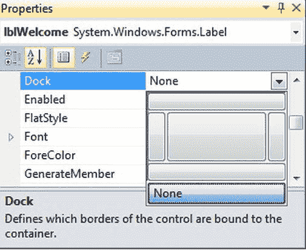
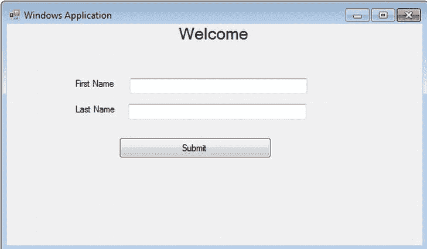
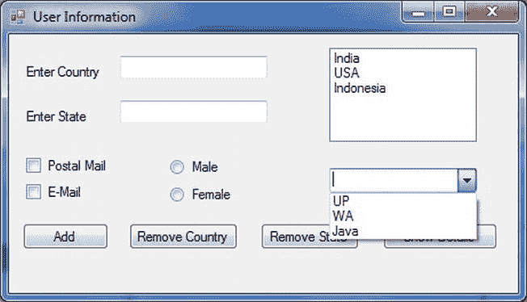

# 九、构建 Windows 窗体应用

本章介绍 Windows 窗体以及如何使用 C# 2012 开发 Windows 窗体应用。

在本章中，我们将介绍以下内容:

> *   Understanding Windows forms
> *   User interface design principles
> *   User interface design best practices
> *   Use Windows forms
> *   Understanding design and code views
> *   Sort properties in the properties window.
> *   Set the properties of solutions, projects and Windows forms
> *   Using controls
> *   Set docking and anchor properties
> *   Add a new form to the project
> *   Implement MDD

### 了解 Windows 窗体

Windows 窗体，也称为 WinForms，是图形用户界面(GUI)应用编程接口(API)的名称，是微软的一部分。NET Framework，通过在托管代码中包装现有的 Windows API 来提供对本机 Microsoft Windows 界面元素的访问。

WinForms 是用户界面的基本构件。它们作为容器来承载允许您呈现应用的控件。WinForms 是应用开发中最常用的界面，尽管其他类型的应用也是可用的，如控制台应用和服务。但是 WinForms 提供了与用户交互的最佳方式，并接受按键或鼠标点击形式的用户输入。

#### 用户界面设计原则

与任何应用交互的最佳机制通常是用户界面。因此，拥有易于使用的高效设计变得非常重要。在设计用户界面时，你首先要考虑的应该是使用这个应用的人。他们是你的目标受众，了解你的目标受众可以让你更容易地设计用户界面，帮助用户学习和使用你的应用。另一方面，一个设计糟糕的用户界面，如果导致目标受众回避甚至放弃你的应用，会导致沮丧和低效。

窗体是 Microsoft Windows 应用的主要元素。因此，它们为每个级别的用户交互提供了基础。可以将各种控件、菜单等添加到窗体中，以提供特定的功能。除了功能性之外，你的用户界面应该对用户有吸引力。

#### 用户界面设计的最佳实践

用户界面为用户提供了与应用交互的机制。因此，易于使用的高效设计至关重要。下面是一些设计用户友好、优雅和简单的用户界面的指导原则。

##### 简单

简单是用户界面的一个重要方面。视觉上“繁忙”或过于复杂的用户界面使得学习应用更加困难和耗时。用户界面应该允许用户快速完成程序所需的所有交互，但是它应该只暴露应用每个阶段所需的功能。在设计用户界面时，你应该记住程序的流程和执行，这样你的应用的用户会发现它很容易使用。显示相关数据的控件应该在表单上组合在一起。ListBox、ComboBox 和 CheckBox 控件可用于显示数据，并允许用户在预设选项之间进行选择。

使用 tab 键顺序(用户通过按 Tab 键在表单上的控件间循环的顺序)允许用户快速导航字段。

在设计用户界面时，试图重现真实世界的物体是一个常见的错误。例如，如果您想创建一个代替纸质表单的表单，那么很自然地会尝试在应用中复制纸质表单。这种方法可能适用于某些应用，但对于其他应用，它可能会限制应用，并且不会给用户带来真正的好处，因为复制纸质表单会限制应用的功能。设计应用时，考虑您的独特情况，并尝试使用计算机的功能来增强目标受众的用户体验。

默认值是简化用户界面的另一种方式。例如，如果您希望应用的 90%的用户在州字段中选择华盛顿，请将华盛顿作为该字段的默认选项。

设计用户界面时，来自目标受众的信息是最重要的。设计用户界面时最好的信息是来自目标受众的输入。定制您的界面，使频繁的任务易于执行。

#### 控制位置

用户界面上控件的位置应该反映它们的相对重要性和使用频率。例如，如果你有一个既用于输入必需信息又用于输入可选信息的表单，那么必需信息的控件就更重要，应该得到更大的重视。在西方文化中，用户界面通常被设计成从左到右和从上到下阅读。最重要或最常用的控件最容易在窗体顶部访问。用户完成表单上的操作后将使用的控件，如提交按钮，应该遵循信息的逻辑流程，并放在表单的底部。

还需要考虑信息的相关性。相关信息应该显示在组合在一起的控件中。例如，如果您有一个显示有关客户、采购订单或雇员信息的窗体，您可以将每组控件分组到一个选项卡控件上，使用户可以轻松地在显示之间来回移动。

美观也是放置控件的一个重要考虑因素。您应该尽量避免显示比一目了然更多信息的表单。只要有可能，控件之间应该留有足够的空间，以创造视觉吸引力和易用性。

##### 一致性

您的用户界面应该在应用中的每个表单上展示一致的设计。不一致的设计会让你的应用看起来杂乱无章，阻碍你的目标用户的采用。当用户在表单间导航时，不要要求他们适应新的视觉元素。

一致性是通过在整个应用中使用颜色、字体、大小和控件类型来实现的。在进行任何实际的应用开发之前，您应该决定一个在整个应用中保持一致的可视化方案。

##### 美学

只要有可能，用户界面应该是吸引人的和令人愉快的。虽然清晰和简单不应该为了吸引人而牺牲，但是你应该努力创建一个不会阻止用户使用它的应用。

##### 颜色

明智地使用颜色有助于让你的用户界面吸引目标受众，并吸引他们使用。然而，过度使用颜色是很容易的。鲜艳的颜色可能会吸引一些用户，但其他人可能会有负面反应。为应用设计背景配色方案时，最安全的做法是使用具有广泛吸引力的柔和颜色。

总是研究任何与颜色相关的特殊含义，这些含义可能会影响用户对你的应用的反应。如果你正在为一家公司设计应用，你可以考虑在你的应用中使用该公司的公司配色方案。为国际观众设计时，要意识到某些颜色可能具有文化意义。保持一致性，不要过度使用颜色。

总是考虑颜色如何影响可用性。例如，白色背景上的灰色文本可能难以阅读，从而削弱可用性。此外，请注意与色盲相关的可用性问题。例如，有些人不能区分红色和绿色。因此，这类用户看不到绿色背景上的红色文本。不要仅仅依靠颜色来传达信息。对比也能吸引人们对应用中重要元素的注意。

#### 来源

可用性应该决定你为应用选择的字体。为了方便使用，避免使用难以阅读或修饰过的字体。坚持使用简单易读的字体，如 Palatino 或 Times New Roman。此外，与其他设计元素一样，字体应该在整个应用中保持一致。使用草书或装饰性字体只是为了视觉效果，比如在合适的时候用在扉页上，不要传达重要信息。

#### 图像和图标

图片和图标增加了应用的视觉趣味，但是精心的设计对它们的使用是必不可少的。看起来“忙碌”或分散用户注意力的图像会阻碍你的应用的使用。图标可以传达信息，但同样，在决定使用它们之前，需要仔细考虑最终用户的反应。例如，您可以考虑使用类似于美国停止标志的红色八角形来表示用户可能不想在应用中超过该点。只要有可能，图标应该保持简单的形状，容易在 16x 16 像素的正方形中呈现。

#### 使用 Windows 窗体

要使用 Windows 窗体，您需要使用 Visual Studio 2012 创建一个 Windows 窗体应用项目。为此，请单击开始所有程序 Visual Studio 2012，并从显示的列表中选择 Microsoft Visual Studio 2012。这将打开 Visual Studio 起始页。点击文件新建项目。现在你会看到新建项目对话框，你可以从中选择 Windows 窗体应用模板，如图[图 9-1](#fig_9_1) 所示。

***图 9-1。**选择 Windows 窗体应用项目模板*

默认情况下，该项目被命名为 WindowsFormsApplication1(下一个是 WindowsFormsApplication2，依此类推)。选择项目模板时，您可以在“名称”文本框中为项目输入另一个名称，也可以在以后重命名项目。

一旦选择了 Windows 窗体应用模板以及所需的名称和位置，请单击“确定”。这将打开 Visual Studio 集成开发环境(IDE ),之所以这样称呼是因为它将所有与开发相关的工具、窗口、对话框、选项等嵌入(或集成)在一个公共窗口中，这使得开发过程更加容易。

在 IDE 中，当您打开项目时，您会看到一个名为`Form1.cs`的 Windows 窗体已被添加，并且在右侧您还可以看到 Solution Explorer 窗口。您还需要了解另一个名为属性窗口的窗口。如果“解决方案资源管理器”窗口下的“属性”窗口不可用，可以通过单击“查看属性窗口”或按 F4 打开它。现在开发环境将看起来像[图 9-2](#fig_9_2) 。

***图 9-2。**带有解决方案资源管理器和属性窗口的 IDE*

因为这是一个 Windows 窗体应用项目，所以您将使用允许您以 GUI 形式实现功能的控件或工具。您可以从工具箱中选取控件，工具箱显示在开发环境中 Windows 窗体的左侧。如果将鼠标指针悬停在工具箱选项卡上，将会打开工具箱窗口。展开所有 Windows 窗体工具集，如图[图 9-3](#fig_9_3) 所示。您可以从那里选取控件并将其放在 Windows 窗体的表面上。

***图 9-3。**带工具箱的 IDE*

#### 理解设计和代码视图

在 Visual Studio IDE 中，您主要处理两个视图:设计视图和代码视图。当你打开 Visual Studio IDE 时，默认情况下它会显示设计视图，如图[图 9-3](#fig_9_3) 所示。“设计”视图允许您将控件拖放到窗体上。您可以使用“属性”窗口设置对象和窗体或解决方案资源管理器中显示的其他文件的属性。解决方案资源管理器还允许您重命名项目、窗体甚至项目中包含的其他文件。通过选择这些对象，单击鼠标右键，然后从上下文菜单中选择“重命名”,可以重命名这些对象。

基本上,“设计”视图为您提供了一种处理控件、对象、项目文件等的可视化方式。当您使用代码来实现位于 Windows 窗体表面的可视化控件背后的功能时，您会希望使用 Visual Studio IDE 中的另一个可用视图“代码”视图。

若要从“设计”视图切换到“代码”视图，请单击“查看代码”,或者在“设计”视图中右击 Windows 窗体并选择“查看代码”。这两种方法都会为你打开代码视图，如图[图 9-4](#fig_9_4) 所示。

***图 9-4。**代码视图*

代码视图显示所有代码功能。在[图 9-4](#fig_9_4) 中，注意`Form1.cs`页签(你看到的是代码视图)在 Form1.cs【设计】页签旁边，它实际上是 Windows 窗体 Form1 的设计视图；这些选项卡允许您在“设计”视图的所有 GUI 元素和“代码”视图中帮助您实现功能的相关代码之间切换。有趣的是，如果您尝试在代码视图中访问工具箱，您会看到工具箱中没有任何控件。但是当您切换回设计视图时，您会发现工具箱已经完全加载了控件。

若要切换回“设计”视图，请在“代码”视图中右击窗体，然后选择“视图设计器”。您将会看到，现在您回到了设计视图，并且可以继续使用可视元素或*控件*。

您还可以使用解决方案资源管理器在“设计”和“代码”视图之间切换，方法是选择所需的 Windows 窗体(如果您打开了多个 Windows 窗体)，右击并选择“查看代码”或“视图设计器”。这将打开所选 Windows 窗体的代码视图或设计视图。

#### 在属性窗口中排序属性

每个对象(如表单控件)都有许多属性，您可能需要在使用任何应用时设置这些属性。为了帮助您浏览“属性”窗口中列出的许多属性，您可以按类别或字母顺序对它们进行排序。让我们来看看这些排序选项中的每一个。

#### 分类视图

分类视图以属性集的形式组织属性，每个属性集都有一个名称来描述属性集合；例如，有名称为“外观”、“行为”、“数据”、“设计”、“焦点”等类别。通过单击显示在“属性”窗口顶部的工具栏最左边的图标，可以切换到分类视图。

在显示分类视图的[图-9-5](#fig_9_5) 中，在外观类别下，您将看到所有定义对象(在本例中是一个表单)外观和感觉的属性。注意其他类别也显示在[图 9-5](#fig_9_5) 中。

 **注**在[图 9-5](#fig_9_5) 中，我们有意将其他类别保持在折叠模式，只是为了向您展示所有类别。当您切换到 Categorized 视图时，您会看到默认情况下所有的类别都是展开的。

***图 9-5。**房产分类视图*

##### 按字母顺序查看

字母视图按名称从 *a* 到*z*升序组织属性。您可以通过单击属性窗口顶部工具栏上左起第二个图标切换到字母视图。

在显示该视图的图 9-6 中，所有列出的属性按字母顺序排列。使用按字母顺序排列的视图，而不是按类别排列的视图，会使工作变得更加容易。例如，假设您正在寻找字体属性。在分类视图中，您必须知道该属性位于哪个类别下才能找到它。但是，如果您有按字母顺序组织的属性，您可以很容易地找到这个属性，因为它是以字母 *F* 开始的，所以您知道是否需要后退或前进来找到您的控件的这个属性。

***图 9-6。**按字母顺序排列的房产视图*

### 设置解决方案、项目和 Windows 窗体的属性

在你开始在 Windows 窗体上放置控件之前，你需要学习如何修改你之前创建的解决方案、项目和窗体的一些属性值(如前面的[图 9-2](#fig_9_2) 所示)。

选择 WindowsFormsApplication1 解决方案，转到属性窗口，将其 Name 属性值设置为 [Chapter9](09.html) 。

 **注意**在某些情况下，您可能无法在 Visual Studio 中看到解决方案(`.sln`)文件。要列出一个解决方案文件，比如解决方案[第 9 章](09.html)(1 项目)，如图[图 9-7](#fig_9_7) 所示，你必须点击工具选项，转到项目和解决方案选项卡，选择常规，勾选“总是显示解决方案”选项，然后点击确定。

在解决方案资源管理器中选择 WindowsFormsApplication1 项目，转到“属性”窗口，并修改定义项目文件名的项目文件属性值，使其显示为`WinApp.csproj`。

现在更改 Windows 窗体的名称:在解决方案资源管理器中选择`Form1.cs`，在属性窗口中将文件名属性从`Form1.cs`修改为`WinApp.cs`，并在出现的对话框中单击“是”。

现在单击位于解决方案资源管理器窗口中的 Form1。一旦选择了 Form1，您将在“属性”窗口中看到属性列表已经更改。选择 Text 属性，并将其值从 Form1 修改为 Windows 应用。Text 属性定义显示在窗体标题栏上的名称。

在设置了解决方案、项目和 Windows 窗体的属性后，IDE 将看起来像图 9-7 。

***图 9-7。**在设置了解决方案、项目和 Windows 窗体的属性后，使用 IDE*

#### 使用控件

现在已经有了 Windows 窗体应用，可以开始使用控件了。

任何 Windows 应用的基本元素都是控件，它通过提供嵌入在应用中的代码功能的视觉含义来发挥重要作用。

最常用的控件是标签、按钮、文本框、单选按钮、复选框、列表框、组合框、MenuStrip 和 ContextMenuStrip。没有这些控件，应用就无法存在，所以您将看到如何将其中一些控件合并到您的应用中。

##### 试试看:使用标签、文本框和按钮控件

在本练习中，您将创建一个带有三个标签、两个文本框和一个按钮的 Windows 窗体应用。应用将接受你的名字作为输入，然后以对话框的形式闪现一条“欢迎”消息。

1.  转到您之前创建的名为 [Chapter9](09.html) 的解决方案下名为 WinApp 的项目(参见[图 9-7](#fig_9_7) )。确保您处于设计视图中。
2.  Drag a Label control onto the form, and position it at the top middle of the form. Select this label, navigate to the Properties window, and set the following properties:
    1.  将 Name 属性设置为 lblWelcome。
    2.  将 Text 属性设置为 Welcome。
    3.  选择“字体”属性，单击省略号按钮，并在“大小”下拉列表中将 Label 控件的大小指定为 16 磅。
    4.  将 TextAlign 属性设置为 TopCenter。

     **提示**你也可以双击工具箱中的任意控件将其添加到表单中。拖动控件和双击控件的区别在于，在拖动时，可以根据需要在窗体上定位控件。但如果你只是双击一个控件，它会被添加到左上角；所以，如果你更喜欢它在不同的位置，你还是要把它拖到那里。

3.  将另外两个 Label 控件拖动到表单上，并将其放在“Welcome”文本的下方，稍微靠近表单的左侧。选择第一个标签，导航到“属性”窗口，将 Name 属性设置为 lblFirstName，将 Text 属性设置为 FirstName。
4.  现在选择第二个标签，导航到“属性”窗口，将其 Name 属性设置为 lblLastName，将其 Text 属性设置为 LastName。
5.  将两个 textBox 控件拖到窗体上，并将名为 textBox1 的 TextBox 放在名字标签的前面，将名为 textBox2 的 TextBox 放在姓氏标签的前面。
6.  选择 textBox1，转到“属性”窗口，将其 Name 属性设置为 txtFname。选择 textBox2，并在“属性”窗口中将其 Name 属性设置为 txtLname。
7.  Drag a Button control onto the form, and place it below the Label and TextBox controls. Select the Button control, go to the Properties window, change the Name property to btnSubmit, and then set its Text property to Submit.

    现在，您已经准备好了应用的 GUI 设计；它应该类似于图 9-8 中所示的形式。

    

    ***图 9-8。**Windows 应用表单的 GUI 设计*

    是时候添加功能并切换到代码视图了。您将读入用户提供的名字和姓氏值，并在单击 Submit 按钮时显示一条消息，这意味着您需要将所有功能放在 Submit 按钮的 click 事件之后，该事件最终将从 TextBox 控件中读取值。为此，请继续执行以下步骤:

8.  Double-click the Submit button. This will take you to the Code view, and you will see that the `btnSubmitClick` event template has been added to the Code view window. Now you will add the code to show a dialog box, with a greeting and welcome message for the entered first name and last name. To do so, you will use `MessageBox` class; this class provides a `Show()` function to display a dialog box with the provided information. Now let’s add the following code inside this `btnSubmitClick` event to achieve the desired functionality of a dialog, with a message, a caption in dialog box’s title bar, an OK button, a Cancel button, and an information icon displayed: `MessageBox.Show("Hello" + ' ' + txtFname.Text + ' ' + txtLname.Text + ' ' +
    "Welcome to the Windows Application","Welcome", MessageBoxButtons.OKCancel,
                 MessageBoxIcon.Information);  `

    现在你的代码视图将显示按钮的点击事件代码，如图[图 9-9](#fig_9_9) 所示。

    

    ***图 9-9。**用`MessageBox.Show`* 代码查看您的`Button`点击事件

9.  现在，单击 Build Build Solution，并确保在输出窗口中看到以下消息:

    * * *

    `========== Build: 1 succeeded or up-to-date, 0 failed, 0 skipped ==========`

    * * *

10.  现在是运行和测试应用的时候了。为此，请按 Ctrl+F5。Visual Studio 2012 将加载该应用。
11.  在名字和姓氏文本框中输入值，然后单击提交按钮。您将看到类似于图 9-10 中[所示的信息。](#fig_9_10)

***图 9-10。**运行 Windows 应用表单*

##### 它是如何工作的

Visual Studio 附带了许多功能来帮助开发人员编写代码。其中一个特性是，您只需双击要添加代码的 GUI 元素，就会在代码视图中找到与该 GUI 元素相关的代码。例如，当您双击设计视图中的提交按钮时，您将被带到代码视图，并且自动生成`btnSubmitClick`事件模板。

若要实现此控件的功能，请添加以下代码:

`           MessageBox.Show("Hello" + ' ' + txtFname.Text + ' ' + txtLname.Text + ' ' +
            "Welcome to the Windows Application","Welcome", MessageBoxButtons.OKCancel,
            MessageBoxIcon.Information);`

`MessageBox.Show()`是一个基于提供的参数弹出消息框的. NET Windows 窗体方法。要在消息框中显示带有用户指定的名字和姓氏的“欢迎”消息，您可以在编写代码时应用字符串串联方法。

在代码段中，您对消息“Hello Welcome to the Windows Application”进行了硬编码，但是用户的名字和姓氏出现在单词 *Hello* 之后，并与消息的其余部分“Welcome to the Windows Application”连接在一起

为了提高可读性，您还在从`txtFnam`和`txtLname`的`Text`属性中读取的单词和值之间添加了由`+`操作符的实例连接的单个空格字符(`''`)。如果在字符串连接过程中不包括单个空格字符(`''`)，单词将会相互交错，消息框中显示的消息将难以阅读。

您得到的第二个参数是`Caption`，它是对话框的标题。我们将其硬编码为“欢迎”，然后通过`MessageBoxButtons.OKCancel`选择按钮集。我们传递的最后一个参数是`MessageBoxIcon`，并使用了一个信息类型图标。

 **注意** `MessageBox.Show()`是非常强大和方便的功能；您可能希望更多地使用智能感知为`MessageBoxButtons`和`MessageBoxIcon`类型参数显示的各种选择。

### 设置停靠和锚属性

在 Visual Studio 2005 之前，调整 Windows 窗体的大小需要您重新定位和/或调整这些窗体上的控件。例如，如果在窗体的左侧有一些控件，并且您试图通过向右侧拉伸或向左侧拉回来调整窗体的大小，这些控件不会根据调整后的窗体的宽度自动调整。开发人员必须编写相应的代码来改变控件，以适应用户调整表单的大小。这种技术代码量很大，不容易实现。

从 Visual Studio 2005 开始，出现了两个新的属性，Anchor 和 Dock，它们在设计时很容易设置。Visual Studio 2012 提供了相同的 Dock 和 Anchor 属性，它们解决了用户在调整窗体大小时面临的控件行为问题。

#### 码头属性

Dock 属性允许您将控件附加到其父控件的一个边缘。术语 *parent* 适用于 Windows 窗体，因为 Windows 窗体包含您拖放到其上的控件。默认情况下，任何控件的 Dock 属性都设置为 None。

例如，停靠在窗体上边缘的控件将始终连接到窗体的上边缘，并且当调整其父控件的大小时，它将自动左右调整大小。

可以使用属性窗口中提供的图形界面来设置控件的 Dock 属性，如图[图 9-11](#fig_9_11) 所示。

***图 9-11。**设置 Dock 属性*

#### 锚属性

当用户调整窗体大小时，控件在 Anchor 属性的帮助下保持与其父窗体边缘的恒定距离。任何控件的 Anchor 属性的默认值都设置为 Top，Left，这意味着该控件将与窗体的上边缘和左边缘保持恒定的距离。可以使用属性窗口中提供的图形界面来设置 Anchor 属性，如图[图 9-12](#fig_9_12) 所示。

由于 Anchor 属性的默认设置为 Top，Left，如果您试图通过向右侧拉伸窗体来调整其大小，您将看到其控件仍然位于左侧，而不是在调整大小后移动到窗体的中心来调整窗体的大小。

如果在 Anchor 属性中同时设置了相对的边缘(例如左边缘和右边缘),则当调整窗体大小时，控件将拉伸。但是，如果在 Anchor 属性中没有设置相对的边缘，控件将在调整父级大小时浮动。

***图 9-12。**设置锚点属性*

##### 试试看:使用停靠和锚定属性

在本练习中，您将使用在本章前面创建的名为 WinApp 的现有 Windows 窗体应用。您将看到如何以这样的方式修改这个应用，即当您调整表单大小时，它的控件会相应地运行，并保持应用对用户的可呈现性。

转到解决方案资源管理器并打开 WinApp 项目。在设计视图中打开 WinApp 窗体。

1.  通过单击窗体的标题栏来选择窗体；您将看到窗体边框周围的手柄，这些手柄允许您调整窗体的高度和宽度。
2.  将光标放在右边框的手柄上，当鼠标指针变成双头时，单击并向右侧拉伸表单。您会看到窗体的宽度增加了，但是控件仍然连接在窗体的左上角。
3.  Similarly, grab the handle located on the bottom of the form and try to increase the height of the form. You will notice that the controls are still attached to the top side of the form.

    看一下[图 9-13](#fig_9_13) ，它显示了调整后的(高度和宽度)表单和控件的位置。这些控件出现在左上角，因为它们的 Dock 属性值为 None，而它们的 Anchor 属性值为 top，left。

    

    ***图 9-13。**调整控件的形状和位置*

    现在，您将尝试设置控件的 Dock 和 Anchor 属性，然后重新测试应用。

4.  选择名为 lbl Welcome 的标签控件，并将文本值设置为 Welcome。转到属性窗口。选择 AutoSize 属性，并将其值设置为 False(默认值为 True)。
5.  将 Label 控件的宽度调整为窗体的宽度，并将 Label 控件调整为窗体的上边框。将该控件的 TextAlign 属性设置为顶部居中。
6.  将 Label 控件的 Dock 属性从 None 设置为 Top，这意味着您希望标签始终贴在窗体的上边框上。
7.  现在选择所有剩余的控件(两个标签、两个文本框和一个按钮),方法是在按住鼠标左键的同时滚动所有控件，或者在按住 Shift 或 Ctrl 键的同时单击选择每个控件。
8.  选择所有控件后，转到“属性”窗口。您将看到列出了您在窗体上选择的控件共有的所有属性。
9.  Select the Anchor property; modify its value from the default Top, Left to Top, Left, and Right. This will allow you to adjust the controls accordingly as soon as you resize the form. The controls will also grow in size accordingly to adjust to the width of the form, as you can see in [Figure 9-14](#fig_9_14). 

    ***图 9-14。**Anchor 属性设置 Top，Left，Right 对调整大小后的表单的影响*

     **注意**主播属性有非常有趣的行为；您可以尝试以各种组合设置该属性，并在调整窗体大小时查看效果。

10.  将窗体恢复到原来的大小，这样就可以看到设置另一个 Anchor 属性的效果。
11.  Select all the controls again as you did in step 8\. Set the Anchor property to Top only and try resizing the form now. You will notice that the controls are floating in the middle of the form when you resize it, as you can see in [Figure 9-15](#fig_9_15). 

    ***图 9-15。**在调整大小后的窗体上设置 Top 的 Anchor 属性的效果*

12.  点击文件全部保存，保存项目中的更改。

##### 它是如何工作的

当您调整窗体大小时，它将根据 Dock 和 Anchor 属性的设置进行操作。

在第一个实例中，将 Label 控件的 Dock 属性设置为 Top，这允许将该 Label 控件附加到窗体的上边框，并跨越窗体的整个宽度。将其余控件的 Anchor 属性设置为 Top、Left 和 Right 可以移动控件，使它们与窗体的左右边框保持恒定的距离。

#### 向项目添加新表单

任何现实世界或企业应用显然都需要多个 Windows 窗体来执行业务功能。默认情况下，每个项目只打开一个 Windows 窗体，但您可以自由添加更多窗体。

##### 试试看:向 Windows 项目添加一个新窗体

在本练习中，您将向项目中添加另一个 Windows 窗体。您还将使用 ListBox、ComboBox、RadioButton 和 CheckBox 控件。在这个新表单中，您将分别向 ListBox 和 ComboBox 添加两个不同文本框中的数据。

1.  导航到解决方案资源管理器并选择 WinApp 项目，右键单击，然后单击 Ad  Windows 窗体。这将在项目中添加一个新的 Windows 窗体。
2.  在显示的添加新项目对话框中，将表单名称从`Form1.cs`更改为`UserInfo.cs`。单击添加。名为 UserInfo 的新表单将被添加到您的项目中。
3.  确保新添加的表单 UserInfo 已在“设计”视图中打开。通过单击表单的标题栏选择 UserInfo 表单，导航到属性窗口，并将 Size 属性的宽度设置为 455，高度设置为 251。
4.  将 Label 控件拖到窗体上；选择该控件，导航到“属性”窗口，并设置以下属性:
    1.  将 Name 属性设置为 lblCountry。
    2.  将 AutoSize 属性设置为 false。
    3.  将位置属性的 X 设置为 12，Y 设置为 26。
    4.  将 Size 属性的宽度设置为 71，高度设置为 13。
    5.  设置 Text 属性以输入 Country。
5.  将 TextBox 控件拖到 lblCountry 标签的前面。选择该控件，导航到“属性”窗口，并设置以下属性:
    1.  将 Name 属性设置为 txtCountry。
    2.  将位置属性的 X 设置为 97，Y 设置为 19。
    3.  将 Size 属性的宽度设置为 129，高度设置为 20。
    4.  拖动 lblCountry 下的另一个标签，选择该控件，导航到“属性”窗口，并设置以下属性:
    5.  将 Name 属性设置为 lblState。
    6.  将 AutoSize 属性设置为 false。
    7.  将位置属性的 X 设置为 12，Y 设置为 65。
    8.  将 Size 属性的宽度设置为 60，高度设置为 13。
    9.  将 Text 属性设置为输入状态。
6.  将 TextBox 控件拖动到 lblState 标签的前面。选择该控件，导航到“属性”窗口，并设置以下属性:
    1.  将 Name 属性设置为 txtState。
    2.  将位置属性的 X 设置为 97，Y 设置为 58。
    3.  将 Size 属性的宽度设置为 129，高度设置为 20。
7.  将一个 ListBox 控件拖动到已添加的 TextBox 控件右侧的 UserInfoInfo 窗体上。选择该控件，导航到“属性”窗口，并设置以下属性:
    1.  将 Name 属性设置为 lstCountry。
    2.  将位置属性的 X 设置为 280，Y 设置为 12。
    3.  将 Size 属性的宽度设置为 129，高度设置为 82。
8.  在刚刚添加的 ListBox 下面拖动一个 ComboBox。选择该控件，导航到“属性”窗口，并设置以下属性:
    1.  将 Name 属性设置为 cboState。
    2.  将位置属性的 X 设置为 280，Y 设置为 117。
    3.  将 Size 属性的宽度设置为 129，高度设置为 21。
9.  拖动标签控件下面的两个复选框，并将其命名为 chkPostalMail 和 chkEMail 将它们的 Text 属性分别设置为 Postal Mail 和 E-Mail。
10.  将两个 RadioButtons 拖动到 TextBox 控件的下方，并命名为 rdbMale 和 rdbFemale。将它们的文本属性分别设置为男性和女性。
11.  拖动一个按钮控件到 UserInfo 表单左侧的 CheckBox 控件下方；选择该控件，导航到“属性”窗口，并设置以下属性:
    1.  将 Name 属性设置为 btnAdd。
    2.  将位置属性的 X 设置为 12，Y 设置为 165。
    3.  将 Size 属性的宽度设置为 75，高度设置为 23。
    4.  设置要添加的文本属性。
12.  拖动“添加”按钮旁边的按钮控件；选择该控件，导航到“属性”窗口，并设置以下属性:
    1.  将 Name 属性设置为 btnRemoveCountry。
    2.  将位置属性的 X 设置为 105，Y 设置为 165。
    3.  将 Size 属性的宽度设置为 95，高度设置为 23。
    4.  设置 Text 属性以删除 Country。
13.  拖动“删除国家/地区”按钮旁边的按钮控件；选择该控件，导航到“属性”窗口，并设置以下属性:
    1.  将 Name 属性设置为 btnRemoveState。
    2.  将位置属性的 X 设置为 220，Y 设置为 165。
    3.  将 Size 属性的宽度设置为 86，高度设置为 23。
    4.  将 Text 属性设置为移除状态。
14.  Drag a Button control next to the Remove State button; select this control, navigate to the Properties window, and set the following properties:
    1.  将 Name 属性设置为 btnShowDetails。
    2.  将位置属性的 X 设置为 327，Y 设置为 165。
    3.  将 Size 属性的宽度设置为 100，高度设置为 23。
    4.  设置 Text 属性以显示详细信息。

    现在你已经完成了 UserInfo 表单的设计部分；当拖放控件时，你应该放置控件来创建一个视觉上吸引人的布局，如图[图 9-16](#fig_9_16) 所示。

    

    ***图 9-16。**UserInfo 表单的 GUI 设计*

    您希望用户在文本框中添加一个名称并单击 add 按钮，然后将 country 添加到 ListBox，将 state 添加到 ComboBox。相应地，Remove 按钮将删除国家或州，Show Details 将显示使用复选框和单选按钮做出的选择。为此，您需要逐一编写所有这些按钮的`click`事件背后的代码功能。

15.  双击 Add 按钮并在`btnAdd_Click`事件中编写以下代码，它将读取文本框中输入的国家和州名，并将它们添加到 ListBox 和 ComboBox 中。`               lstCountry.Items.Add(txtCountry.Text);
                   txtCountry.Clear();
                     cboState.Items.Add(txtState.Text);
                   txtState.Clear();`
16.  双击 Remove Country 按钮，并在`btnRemoveCountry_Click`事件中编写以下代码，这将从名为 lstCountry 的列表框中删除选定的国家:`        lstCountry.Items.Remove(lstCountry.SelectedItem);`
17.  双击 Remove State 按钮，并在`btnRemoveState_Click`事件中编写以下代码，这将从名为 cboState 的 ComboBox 中删除选中的状态。`        cboState.Items.Remove(cboState.SelectedItem);`
18.  双击 Show Details 按钮，并在`btnShowDetails_Click`事件中编写以下代码，这将显示通过复选框和单选按钮选择的选项。`     if (chkEmail.Checked == true || chkPostalMail.Checked == true &&
         rdbMale.Checked == true)
         {`
19.  MessageBox。显示(“你好先生，你将通过美国邮政或电子邮件联系”，“信息”，MessageBoxButtons。确定取消，MessageBoxIcon。信息)；`  }
      else
          if (chkEmail.Checked == true || chkPostalMail.Checked == true
             && rdbFemale.Checked == true)
          {
             MessageBox.Show("Hello Mam, you will be contacted by either USPS or email",
      "Information", MessageBoxButtons.OKCancel,
             MessageBoxIcon.Information);
      }`
20.  转到“生成”菜单，选择“生成解决方案”。您应该会看到一条消息，表明构建成功。
21.  保持当前项目打开，因为下一个练习会立即用到它。(不要担心，我们将在之后解释这个和下一个练习是如何工作的。)

##### 试试看:设置启动表单

在一个 Visual C# 项目中设置启动窗体有点棘手，所以我想把它分解成自己的练习。要设置启动表单，您需要遵循以下步骤:

> 1.在您在前一个练习中修改的项目中，导航到解决方案资源管理器，打开`Program.cs`文件，并查找以下代码行:
> 
> `              Application.Run(new WinApp());`

该代码行确保 WinApp 窗体将始终是第一个运行的窗体，因为这是第一个名为 Form1 的窗体，它已经被添加，并且在开始该项目时被重命名；为了将 UserInfo 表单设置为启动表单，您需要稍微修改一下这个语句，如下所示:

`Application.Run(new UserInfo());`

> 2.生成解决方案，并通过按 Ctrl+F5 运行和测试应用。将加载 UserInfo 应用表单。
> 
> 3.在相应的文本框中输入国家和州名，然后单击“添加”按钮；你会看到你输入的名字已经被添加到列表框和组合框中，如图[图 9-17](#fig_9_17) 所示。

***图 9-17。**使用 ListBox 和 ComboBox withUserInfo Windows 窗体应用*

> 4.选中两个复选框和一个单选按钮，然后单击 ShowDetails 按钮。你会看到一个消息框显示出来，如图[图 9-18](#fig_9_18) 所示。

***图 9-18。**在 UserInfo Windows 窗体应用中使用复选框和单选按钮*

##### 它是如何工作的

让我们先来看看“在 Windows 项目中添加一个新窗体”任务，一个按钮一个按钮一行行地理解代码。

首先有一个 Add 按钮，它将国家和州添加到 ListBox 和 ComboBox 中。ListBox 和 ComboBox 控件有一个名为`Items`的集合，这个集合可以包含一个项目列表，这就是为什么在这里使用它。接下来调用`Items`集合的`Add`方法，最后将文本框中输入的值传递给列表框或组合框的`Items`集合的`Add`方法，如下所示:

`lstCountry.Items.Add(txtCountry.Text);`

此外，一旦添加了项目，为了更好的用户体验，建议清除文本框，以便用户可以轻松地键入新值。

`txtCountry.Clear();`

对组合框重复同样的操作:

`cboState.Items.Add(txtState.Text);
txtState.Clear();`

对于移除国家和移除州按钮，您遵循与`Items`集合类似的方法，但是这次您调用的不是`Add()`而是`Remove()`方法，如您所知，移除项的先决条件是必须首先在列表框或组合框中选择 and 项。因此，代码寻求将一个`SelectedItem`传递给`Remove()`方法。

`lstCountry.Items.Remove(lstCountry.SelectedItem);

cboState.Items.Remove(cboState.SelectedItem);`

现在，对于 Show Details 按钮，您已经使用了一些条件逻辑来根据您的选择生成不同的消息，特别是对于男性和女性单选按钮。

CheckBox 和 RadioButton 控件提供了一个名为 Checked 的属性，该属性可以是 true 或 false，即选中或不选中。你围绕这些建立一个条件，然后显示一个消息框。

`    if (chkEmail.Checked == true || chkPostalMail.Checked == true &&
         rdbMale.Checked == true)
    {
         MessageBox.Show("Hello Mr, you will be contacted by either USPS or
                    email", "Information",MessageBoxButtons.OKCancel,
                    MessageBoxIcon.Information);
    }
    else
        if (chkEmail.Checked == true || chkPostalMail.Checked == true &&
           rdbFemale.Checked == true)
        {
           MessageBox.Show("Hello Mam, you will be contacted by either USPS or
                      email", "Information", MessageBoxButtons.OKCancel,
                      MessageBoxIcon.Information);
       }`

在“设置启动表单”任务中，您在`Program.cs`文件中创建 AddName 表单的一个实例，如以下代码所示:

`Application.Run(new UserInfo());`

#### 实施计量吸入器表单

术语*多文档界面* (MDI)是指拥有一个 GUI 界面，允许在一个父表单或窗口下有多个文档或表单。

想象一下 Microsoft Word 的工作方式:你可以在一个父窗口中打开多个文档，所有的文档都将列在窗口菜单中，你可以从中选择你想阅读的任何一个，而不是在各自的窗口中打开各个文档，这样很难处理所有的文档，并且会在屏幕上覆盖许多打开的窗口。

同一应用的每个实例都有一个单独的窗口被称为*单文档界面*(SDI)；记事本、MS Paint、计算器等应用都是 SDI 应用。SDI 应用只能在它们自己的窗口中打开，可能会变得难以管理，这与在一个 MDI 界面中打开多个文档或表单不同。

因此，MDI 应用遵循父窗体和子窗体的关系模型。MDI 应用允许您通过在 MDI 父窗体的上下文中打开文档来同时打开、组织和处理多个文档。所以，一旦打开，它们就不能像个体形态一样被拖出来。

父窗体(MDI)组织和排列当前打开的所有子窗体或文档。您可能已经在许多 Windows 应用的 Windows 菜单下看到过这样的选项，例如层叠、垂直平铺等等。

##### 试试看:创建一个带有菜单栏的 MDI 父表单

在本练习中，您将在 WinApp 项目中创建一个 MDI 窗体。您还将看到如何为父窗体创建一个菜单栏，这将允许您导航到所有子窗体。为此，请按照下列步骤操作:

1.  导航到解决方案资源管理器，选择 WinApp 项目，右键单击，并选择 Ad  Windows 窗体。将名称值从`Form1.es`更改为`ParentForm.es`，并点击添加。
2.  在设计视图中选择新添加的 ParentForm。通过单击表单的标题栏选择 ParentForm 表单，导航到“属性”窗口，并设置以下属性:
    1.  将 IsMdiContainer 属性设置为 True(默认值为 False)。请注意，窗体的背景色已经变成了深灰色。
    2.  将 Size 属性的宽度设置为 546，高度设置为 411。
3.  将 MenuStrip 控件拖动到 ParentForm。在左上角，您应该会看到一个显示文本类型的下拉列表。在下拉框中输入文本**打开表单**。这将是您的主要顶层菜单。
4.  现在在打开的表单菜单下，通过输入文本 **Win App** 添加一个子菜单。
5.  在 Win App 子菜单下，进入**用户信息**。
6.  现在点击顶部菜单，打开表单，在它的右边，输入 **Help** 。在帮助菜单下，输入**退出**。
7.  现在，点击顶部菜单，在帮助的右侧，键入 **Windows** 。
8.  在 Windows 菜单下，添加以下选项作为单独的子菜单:**层叠**、**水平平铺**、**垂直平铺**和**排列图标**。这些将有助于安排子窗体。
9.  现在是时候将代码附加到您在主菜单打开表单下添加的子菜单中了。首先，您将为子菜单 WinApp 添加代码，这基本上将打开 Win App 表单。在设计视图中，双击 Win 应用子菜单，这将带您到代码视图。在`click`事件下，添加以下代码:`WinApp objWA = new WinApp();
           objWA.Show();`
10.  Now to associate functionality with the User Info submenu: double-click this submenu, and under the `click` event add the following code: `UserInfo objUI = new UserInfo();
          objUI.Show();`

    要将功能与位于帮助主菜单下的退出子菜单相关联，请双击退出，并在`click`事件下添加以下代码:

    `     Application.Exit();`
11.  现在您已经有了表单打开代码功能，并且几乎可以运行应用了。但是首先需要将 ParentForm 设置为启动对象。为此，打开`Program.cs`，将`Application.Run(new UserInfo());`语句修改为:`     Application.Run(new ParentForm());`
12.  Now build the solution, and run the application by pressing F5; the MDI application will open and should look like [Figure 9-19](#fig_9_19). 

    ***图 9-19。**运行 MDI 表单应用*

13.  现在，如果您单击 Win App，然后单击 User Info，这两个表单将依次打开。这些窗体可以被打开并拖动到 MDI 窗体之外。这不是 MDI 应用的预期行为，如[图 9-20](#fig_9_20) 所示。这个问题将在本章后面讨论。

***图 9-20。**运行 MDI 表单应用*

##### 它是如何工作的

每个 windows 窗体都是一个类，并通过为其创建的实例公开一个`Show()`函数。您使用下面的代码，它创建一个对象，然后调用`Show()`方法。这将打开 MDI 父窗体中的另一个窗体。

这将创建一个 WinApp 窗体实例，并为您打开它:

`                   WinApp objWA = new WinApp();
                   objWA.Show();`

以下代码创建了 UserInfo 表单的一个实例，并为您打开它:

`                   UserInfo objUI = new UserInfo();
                   objUI.Show();`

您使用以下代码关闭应用:

`Application.Exit();`

##### 试试看:在 MDI 应用中打开 MDI 子窗体

如[图 9-20](#fig_9_20) 所述，问题是即使 MDI 表单显示了一个父菜单，这些表单仍然能够在外部打开，并且上下文从一个表单移动到另一个表单。您可以尝试单击每个打开的表单的标题栏，您将看到如何在这些打开的表单中来回移动。

在本练习中，您将克服这个问题，并将之前作为 MDI 子窗体创建的所有窗体与您在前一任务中创建的主 MDI 父窗体相关联。

1.  In the project you modified in the previous exercise, you’ll first make the WinApp form an MDI child form. To do so, you need to set the `MdiParent` property of the child form’s object to the MDI parent form itself, but in the Code view. You have already added functionality in the previous task (opening the WinApp form); just before the line where you are calling the `Show()` method, add the following code (this code can be found under Win App menu click event): `                      objWA.MdiParent=this;
    After adding this line, the code will appear as follows:
                 WinApp objWA = new WinApp();
                 objWA.MdiParent = this;
                 objWA.Show();`

     **注意** `this`是一个 C# 语言关键字，表示类的当前实例。在这种情况下，它指的是 ParentForm。因为您是在 ParentForm 内部编写这段代码，所以您可以使用`this`关键字来完成同样的工作。

2.  Now you will make the UserInfo form an MDI child form. To do so, you need to set the `MdiParent` property to the name of the MDI parent form but in the Code view. Add the following code as you did in the previous step (this code can be found under the User Info menu click event): `        objUI.MdiParent=this;`

    添加这一行后，代码将如下所示:

    `        UserInfo objUI = new UserInfo();
            objUI.MdiParent=this;
             objUI.Show();`
3.  现在构建解决方案，并通过按 F5 运行应用；MDI 应用将会打开，并应如[图 9-21](#fig_9_21) 所示。
4.  Click Open Form  Win App; the WinApp form should open. Again, open the main menu and click User Info. Both the forms should now be open inside your main MDI parent form application, and unlike before, you will not be able to drag these out of your MDI parent form (as shown in [Figure 9-20](#fig_9_20)). [Figure 9-21](#fig_9_21) shows the expected behavior of an MDI application with opened form(s). 

    ***图 9-21。**在 MDI 表单应用中打开子表单*

5.  因为这两个窗体都是在一个 MDI 父窗体中打开的，所以使用它们变得更容易，并且它们不能被拖动到 MDI 父窗体之外。通过单击标题栏在这些表单之间来回切换。
6.  完成表单后，选择 Help Exit 关闭应用。

##### 它是如何工作的

正如您在前面的练习中注意到的，讨论的唯一问题是子窗体打开并能够被拖到外面。换句话说，它们并不真正属于父窗体。MDI 应用要求一个带有菜单栏的窗体作为 MDI 父窗体，这样所有的子窗体都可以在其中打开。

为此，首先需要创建子表单的一个对象:

`              WinApp objWA = new WinApp();`

但是在我们真正调用`objWA`上的`Show()`方法之前，您需要告诉对象谁是它的父对象，这样它就可以在 MDI 父表单中操作。为此，您将使用代表当前表单类的`this`关键字。

`                objWA.MdiParent = this;`

您已经创建了对象，并将其上下文设置为 MDI 父表单，所以现在是调用`Show()`方法的最佳时机，该方法将启动表单，以便您可以使用它。

`                    objWA.Show();`

`wa.MdiParent=this;`行告诉子窗体哪个窗体是它的父窗体。因为您希望所有子窗体都出现在 ParentForm 中，并且您在 MDI 父窗体中编写代码，所以您可以使用`this`关键字来表示当前对象。

也为 UserInfo 设置前面建议的更改。

`        UserInfo objUI = new UserInfo();
                objUI.MdiParent=this;
                objUI.Show();`

##### 试试看:在 MDI 应用中排列 MDI 子窗体

多个窗体将在一个 MDI 窗口中打开，所以一旦你打开了几个窗体，你的 MDI 应用就会变得混乱。很难移动表格来将你的注意力从一个转移到另一个。因此，最重要的是要有一种机制，允许您以一种有组织的方式来安排表单。

例如，在大多数应用中，您可以排列表单，然后层叠它们，这样您就可以看到一堆打开的表单。或者您可以垂直或水平平铺它们，这样您就可以并排看到多个表单。你甚至可以最小化所有打开的表单，并将它们排列成一个图标。

为此，在本练习中，您将添加如图 9-22 所示的窗口菜单。

***图 9-22。**MDI 窗体应用的窗口菜单排列子窗体*

。NET 的 Windows 窗体提供了 LayoutMdi 方法，该方法采用 MdiLayout 枚举来重新排列 Mdi 父窗体中的子窗体。您可以将表单排列成四种模式:层叠、水平平铺、垂直平铺和排列图标。

1.  在设计视图中打开 ParentForm，点击窗口菜单，如图[图 9-22](#fig_9_22) 所示。
2.  双击 Windows 下的第一个选项 Cascade，它会带你到它的`click`事件。添加以下代码:`          LayoutMdi(MdiLayout.Cascade);`
3.  双击水平平铺，在`click`事件下的代码视图中，添加以下代码:`         LayoutMdi(MdiLayout.TileHorizontal);`
4.  双击垂直平铺，在`click`事件下的代码视图中，添加以下代码:`         LayoutMdi(MdiLayout.TileVertical);`
5.  双击垂直平铺，在`click`事件下的代码视图中，添加以下代码:`         LayoutMdi(MdiLayout.ArrangeIcons);`
6.  现在构建解决方案，并通过按 F5 运行应用；MDI 应用将会打开。打开后，进入打开表单菜单，依次点击 Win App 和用户信息。在 MDI 父窗体中至少打开两个窗体是很重要的。

现在进入窗口菜单，点击层叠，垂直排列，水平排列，最后排列图标。当你尝试这些选项时，垂直平铺将显示如图[图 9-23](#fig_9_23) 排列的子表单。

***图 9-23。**在 MDI 表单应用中排列(垂直平铺)子表单*

### 总结

在本章中，您了解了 Windows 窗体以及与图形用户界面设计相关的设计原则。您还了解了通常被忽略的特性的重要性，比如字体样式和颜色，以及它们对应用的影响和对大量用户的影响。您还使用了解决 Windows 窗体大小调整问题的最常用的 Windows 控件和属性。您了解了 MDI 应用的重要性，然后创建了一个带有菜单控件的 MDI 应用，在 MDI 应用中排列子窗体。

在下一章，你将学习 about 应用设计。