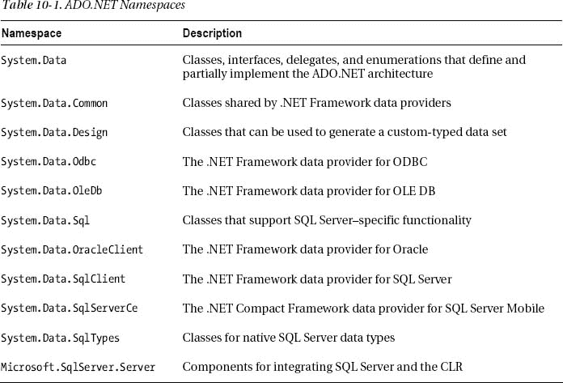
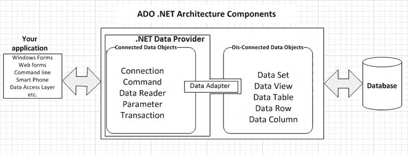
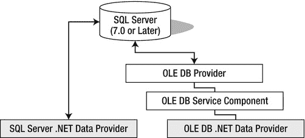
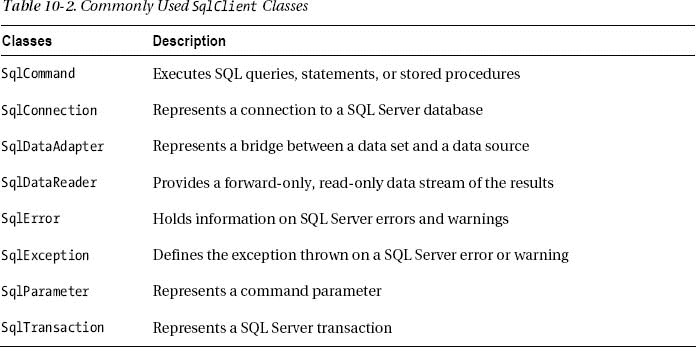
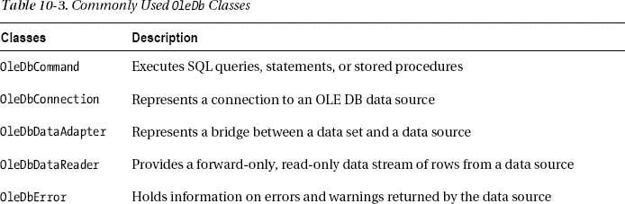
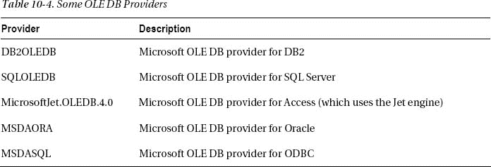
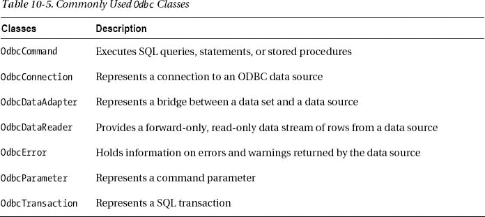

# 十、ADO.NET 简介

在工业界，如果没有与数据库的交互，大多数应用都无法构建。数据库服务于数据存储的目的，因此以后可以通过 SQL 查询或数据库应用检索数据。几乎每个运行的软件应用都与一个或多个数据库交互。因此，前端需要一种机制来连接数据库，而 ADO.NET 服务于这一目的。大多数的。需要数据库功能的. NET 应用依赖于 ADO.NET。在本章中，我们将介绍以下内容:

> *   了解 ADO.NET
> *   ADO.NET
> *   The motivation behind it shifted from ADO to ADO.NET.
> *   Understanding ADO.NET architecture
> *   Understanding SQL Server data providers
> *   Understanding OLE DB data providers
> *   Understanding ODBC data providers
> *   Data provider as API

### 了解 ADO.NET

之前。NET 中，开发人员使用了 ODBC、OLE DB 和 ActiveX 数据对象(ADO)等数据访问技术。随着……的引入。微软创造了一种处理数据的新方法，叫做 ADO.NET。

ADO.NET 是一组向其公开数据访问服务的类。NET 程序员，为创建分布式数据共享应用提供了丰富的组件集。ADO.NET 是美国不可分割的一部分。NET Framework，并提供对关系数据、XML 数据和应用数据的访问。ADO.NET 类在`System.Data.dll`中被发现。

这项技术支持各种开发需求，包括创建前端数据库客户端和应用、工具、语言和 Internet 浏览器使用的中间层业务对象。因此，ADO.NET 有助于将应用的 UI 或表示层与数据源或数据库连接起来。

#### ADO.NET 背后的动机

随着应用开发的发展，应用已经变得*松散耦合，*一种架构，其中组件更容易维护和重用，而不依赖于其他组件的实现细节。今天越来越多的应用使用 XML 来编码要通过网络连接传递的数据，这就是运行在不同平台上的不同应用如何进行互操作。

ADO.NET 旨在支持断开连接的数据架构、与 XML 的紧密集成、能够组合来自多个不同数据源的数据的通用数据表示，以及用于与数据库交互的优化工具，所有这些都是。NET 框架。

在 ADO.NET 的开发过程中，微软希望包括以下功能:

> *   *借力当前 ADO 知识* : ADO。NET 的设计解决了当今应用开发模型的许多需求。同时，编程模型尽可能与 ADO 相似，因此当前的 ADO 开发人员不必从头开始。ADO.NET 是美国固有的一部分。NET 框架，但 ADO 程序员对此并不陌生。
>     
>     阿多。网也与麻烦共存。虽然是最新的。基于。网的应用将使用阿多。网编写，ADO 仍然可用 100 .净程序员通过. NET COM 互操作性服务.对 n 层编程模型的支持
>     
>     
> *   *: The concept of using disconnected recordset has become a focus in the programming model. ADO.NET provides first-class support for the unconnected N-tier programming environment. Addo. NET to build N-tier database application is `DataSet`.*
> *   *Integrated XML support* : XML and data access are closely linked. XML is about data coding, and data access is increasingly related to XML. that The. NET Framework not only supports web standards, but also is completely built on these standards.

XML 支持是 ADO.NET 的基础。中的 XML 类。NET 框架和 ADO.NET 是同一个架构的一部分；它们在许多不同的层面上整合。因此，您不再需要在服务的数据访问集和它们的 XML 对应物之间进行选择；从一个跨越到另一个的能力是两者的设计中所固有的。

#### 从阿多搬到 ADO.NET

ADO 是 ActiveX 对象的集合，这些对象被设计成在持续连接的环境中工作。它构建在 OLE DB 之上(我们将在“了解 OLE DB 数据提供程序”一节中讨论)。OLE DB 提供了对非 SQL 数据以及 SQL 数据库的访问，ADO 提供了一个接口，旨在简化 OLE DB 提供程序的使用。

然而，使用 ADO(和 OLE DB)访问数据意味着在到达数据源之前，您必须经过几层连接。正如 OLE DB 可以连接到大量的数据源一样，一种更老的数据访问技术——开放式数据库连接(ODBC)仍然可以连接到更老的数据源，如 dBase 和 Paradox。要使用 ADO 访问 ODBC 数据源，您可以使用 ODBC 的 OLE DB 提供程序(因为 ADO 只直接使用 OLE DB)，从而向已经多层的模型中添加更多的层。

利用 ADO 的多层数据访问模型和连接特性，您可能很容易耗尽服务器资源并造成性能瓶颈。ADO 在它的时代服务得很好，但是 ADO.NET 有一些很棒的特性，使它成为一种优越得多的数据访问技术。

#### ADO.NET 不是 ADO 的新版本

ADO.NET 是一种全新的数据访问技术，具有完全从零开始构建的新设计。让我们先澄清一下:ADO.NET*不代表 ActiveX 数据对象. NET。为什么？原因很多，但以下是两个最重要的原因:*

> *   ADO.NET is an inseparable part. NET instead of an external entity.
> *   ADO.NET is not a collection of ActiveX components.

ADO.NET 这个名字类似于 ADO，因为微软希望开发人员在使用 ADO.NET 时有宾至如归的感觉，并且不希望他们认为他们需要“从头再学一遍”，如前所述，所以微软特意命名并设计了 ADO.NET，以提供以不同方式实现的类似功能。

在的设计过程中。微软意识到 ADO 不适合。ADO 是基于组件对象模型(COM)对象的外部包，需要。NET 应用显式包含对它的引用。相比之下，。NET 应用被设计为共享一个模型，其中所有的库被集成到一个框架中，被组织到逻辑命名空间中，并对任何想要使用它们的应用公开。明智的决定是。NET 数据访问技术应该遵守。NET 架构模型。于是，ADO.NET 诞生了。

ADO.NET 旨在适应连接和断开连接的访问。此外，ADO.NET 比 ADO 更多地采用了非常重要的 XML 标准，因为 XML 的使用是在 ADO 开发出来之后才出现的。使用 ADO.NET，您不仅可以使用 XML 在应用之间传输数据，还可以将应用中的数据导出到 XML 文件中，将其存储在本地系统中，并在以后需要时进行检索。

性能通常是有代价的，但在 ADO.NET 的情况下，价格肯定是合理的。与 ADO 不同，ADO.NET 不透明地包装 OLE DB 提供程序；相反，它使用专门为每种类型的数据源设计的托管数据提供者，从而充分利用它们的真正能力，提高应用的整体速度和性能。

ADO.NET 还可以在连接和断开的环境中工作。您可以连接到数据库，在简单地读取数据时保持连接，然后关闭连接，这是一个类似于 ADO 的过程。ADO.NET 真正开始发光的地方是在这个断开的世界。如果您需要编辑数据库数据，那么在服务器上维护连续连接的成本会很高。ADO.NET 通过提供一个复杂的分离模型来解决这个问题。数据从服务器发送，并在客户端本地缓存。当您准备好更新数据库时，您可以将更改后的数据发送回服务器，在服务器上为您管理更新和冲突。

在 ADO.NET，当你检索数据时，你使用一个叫做*数据读取器的对象。*当您处理断开连接的数据时，数据被缓存在本地的一个关系数据结构中，或者是一个*数据表*或者是一个*数据集。*

#### ADO.NET 和。NET 基础类库

一个数据集(`DataSet`对象)可以在内存缓存中以表格(`DataTable`对象)、它们的关系(`DataRelation`对象)和约束(`Constraint`对象)的形式保存大量数据，然后可以将这些数据导出到外部文件或另一个数据集。由于 XML 支持被集成到了 ADO.NET 中，所以您可以使用 XML 文档生成 XML 模式并传输和共享数据。表 10-1 描述了 ADO.NET 组件分组的名称空间。

因为 XML 支持已经紧密地集成到 ADO.NET 中，所以在`System.Data`名称空间中的一些 ADO.NET 组件依赖于在`System.Xml`名称空间中的组件。因此，有时需要在解决方案资源管理器中将这两个命名空间作为引用包含在内。

这些名称空间在物理上被实现为程序集，如果您在 VCSE 创建一个新的应用项目，对程序集的引用应该会自动创建，同时还会创建对`System`程序集的引用。但是，如果它们不存在，只需执行以下步骤将名称空间添加到项目中:

1.  在解决方案资源管理器中右击“引用”项；然后单击添加引用。
2.  将显示一个包含可用参照列表的对话框。逐个选择`System.Data`、`System.Xml`、`System`(如果没有的话)(按住 Ctrl 键可多选)；然后单击选择按钮。
3.  单击 OK，引用将被添加到项目中。

 **提示**虽然我们在本书中不使用，但是如果使用命令行 C# 编译器，可以使用以下编译器选项来包含所需程序集的引用:`/r:System.dll /r:System.Data.dll /r:System.Xml.dll`。

从名称空间中可以看出，ADO.NET 可以使用 OLE DB 和 ODBC 等旧技术。但是，SQL Server 数据提供程序直接与 SQL Server 通信，无需添加 OLE DB 或开放式数据库连接(ODBC)层，因此这是最有效的连接形式。同样，Oracle 数据提供者直接访问 Oracle。

 **注**各大 DBMS 厂商都支持自己的 ADO.NET 数据提供商。在本书中，我们将坚持使用 SQL Server，但是不管提供者是谁，都要编写相同类型的 C# 代码。

#### 了解 ADO.NET 建筑

ADO.NET 提供了两种类型的架构组件来构建以数据为中心的应用:连接的和断开的。在微软内部。NET Framework 中，ADO.NET 位于名称空间`System.Data`(程序集名称为`System.Data.dll`)中，因此连接和断开连接的组件的所有类和函数都位于同一个名称空间中。因此，不管您已经选择或者以后将选择的是连接的还是断开的架构风格，在您的应用中添加一个`System.Data`的引用是很重要的。

图 10-1 展示了 ADO.NET 最重要的建筑特色。我们将在后面的章节中更详细地讨论它们。

***图 10-1。【ADO.NET T2】建筑***

##### 连接的数据对象

阿多。NET 的连接架构依赖于一致的数据库连接来访问数据并对检索到的数据执行任何操作。ADO.NET 提供了以下对象来帮助您使用连接架构构建应用:

> *   `Connection`: This is the main or core object of any database-oriented application. As you can imagine, if you don't know the statistical information of the data source, such as where it is located, what database you want to connect to, what user name and password it needs, etc., it is impossible to establish a connection and perform any data-related activities. Each. NET provider provides its own `Connection` object, which provides features for specific data sources.
> *   `Command`: This object represents the processing of statements used by applications to perform data-oriented tasks, such as reading data, inserting or modifying data. Therefore, any SQL statement is actually executed through a `Command` object.
> *   `DataReader`: DataReader involves creating an instance of Command object, and then creating DataReader by calling Command. ExecuteReader retrieves data from the data source, and the returned data can be obtained in a read-only manner through a `DataReader` object. The data retrieval behavior of `DataReader` is also called *Quick read-only fire hose cursor* .
> *   `Parameter`: `Parameter` has always been an important part of any programming model. Similarly, in ADO.NET programming, it is important to pass the value to `Command`. `Parameter` can be a value passed to or returned from the stored procedure, or a parameter passed to the SQL query.
> *   `DataAdapter`: `DataAdapter` is an object disclosed by ADO.NET, which is used to build a bridge between the connected and disconnected architectures, so that applications can establish connections and synchronize data with data sources.

##### 断开的数据对象

阿多。NET 的连接架构依赖于一致的数据库连接来访问数据并对检索到的数据执行任何操作。然而，在当今复杂的分布式应用环境中，不可能依靠专用的数据库连接来检索和修改数据。

为了帮助您满足业务需求并在分布式环境中轻松工作，您可以利用 ADO。NET 的非连接体系结构；它提供灵活的应用设计，并帮助组织节省数据库连接。因此，可以检索数据，然后以`DataSet`对象的形式存储在本地设备上。检索到的`DataSet`可以由用户在他们的本地设备上修改，比如笔记本电脑、手持设备、平板电脑等等，一旦完成，他们就可以将更改同步到中央数据源。非连接架构以一种非常优化的方式利用了像`Connection`这样的昂贵资源(也就是晚开早闭)。

ADO.NET 提供了以下对象来帮助您使用非连接架构构建应用:

> *   `DataSet`: `DataSet` is the core architecture component of ADO.NET, which is used to make disconnected applications. A data set can be regarded as a subset of data. Datasets support disconnected and independent caching of data in a relational way, and update data sources as needed. A dataset contains one or more data tables.
> *   `DataTable`: `DataTable` is a row and column representation, which provides a logical view very similar to the physical table in the database. For example, you can store the data in the database table in ADO.NET `DataTable` and manipulate the data as needed.
> *   `DataRow`: As you know, tables are always made up of rows. In a similar way, ADO. The `DataTable` of. NET consists of rows of type `DataRowCollection`. This `DataRowCollection` is an enumerable collection of `DataRow` objects. When new data is added to `DataTable`, new `DataRow` is added.
> *   `DataColumn`: Like any other column in a database table, ADO. The `DataTable` of. NET is composed of `DataColumn` of type `DataColumnCollection`.
> *   `DataView`: `DataView` The role of ADO.NET is similar to the view in database. Typically, a view in a database provides a set of predefined, organized or filtered records. Similarly, a T2 provides filtered or sorted records from a T3\. Just as a database table can have multiple views, `DataTable` can also have multiple data views.

#### 理解。NET 数据提供者

ADO.NET 由各种数据提供程序组成，这些数据提供程序允许一个简单的预定义对象模型与各种行业数据库(如 SQL Server、Oracle、Microsoft Access 等)进行通信。

有各种各样的数据库提供程序，所以每个数据提供程序都有自己的名称空间。事实上，每个数据提供者本质上都是在`System.Data`名称空间中的接口的实现，专门用于特定类型的数据源。

例如，如果您使用 SQL Server，您应该使用 SQL Server 数据提供程序(`System.Data.SqlClient`)，因为这是访问 SQL Server 最有效的方式。

OLE DB 数据访问接口支持访问 SQL Server 的旧版本以及其他数据库，如 access、DB2、MySQL 和 Oracle。然而，本地数据提供程序(如`System.Data.OracleClient`)在性能上更好，因为 OLE DB 数据提供程序在到达数据源之前通过另外两层工作，即 OLE DB 服务组件和 OLE DB 提供程序。

图 10-2 说明了使用 SQL Server 和 OLE DB 数据提供程序访问 SQL Server 数据库的区别。

***图 10-2。** SQL Server 和 OLE DB 数据提供程序的差异*

如果您的应用同时连接到较旧版本的 SQL Server (6.5 或更早版本)或多种数据库服务器(例如，Access 和 Oracle 数据库同时连接)，则只有在这种情况下，您才应该选择使用 OLE DB 数据访问接口。

不存在严格的规则；如果您愿意，可以同时使用 OLE DB data provider for SQL Server 和 Oracle data provider ( `System.Data.OracleClient`)，但选择最适合您的用途的提供程序很重要。考虑到特定于服务器的数据提供程序的性能优势，如果您使用 SQL Server，99%的时间应该使用`System.Data.SqlClient`类。

在我们了解每种数据提供程序的功能和使用方法之前，您需要清楚它们的核心功能。每个。NET 数据提供程序旨在很好地完成以下两件事:

> *   Provide access to data through active connection with data source.
> *   Provide data transmission between disconnected data sets and data tables.

数据库连接是通过使用数据提供者的`Connection`类建立的(例如，`System.Data.SqlClient.SqlConnection`)。数据读取器、命令和数据适配器等其他组件分别支持检索数据、执行 SQL 语句以及读取或写入数据集或数据表。

正如您所看到的，每个数据提供程序都以它所连接的数据源类型为前缀(例如，SQL Server 数据提供程序以`Sql`为前缀)，因此它的连接类被命名为`SqlConnection`。OLE DB 数据提供程序的连接类被命名为`OleDbConnection`。

让我们了解一下可以与 SQL Server 一起使用的三种数据提供程序。

#### 了解 SQL Server 数据提供程序

那个。SQL Server 的. NET 数据提供程序位于`System.Data.SqlClient`命名空间中。虽然您可以使用`System.Data.OleDb`来连接 SQL Server，但是微软已经专门设计了用于 SQL Server 的`System.Data.SqlClient`名称空间，并且它的工作方式比`System.Data.OleDb`更加高效和优化。这种效率和优化方法的原因是，该数据提供者使用其本地网络协议直接与服务器通信，而不是通过多层。

[表 10-2](#tab_10_2) 描述了`SqlClient`名称空间中的一些重要类。

另一个名称空间`System.Data.SqlTypes`将 SQL Server 数据类型映射到。NET 类型，既提高了性能，又使开发人员的工作变得更加容易。

#### 了解 OLE DB 数据提供程序

外面。NET，OLE DB 仍然是微软的高性能数据访问技术。OLE DB 数据提供程序已经存在了许多年。如果您过去曾为 Microsoft Access 编写过程序，您可能还记得使用 Microsoft Jet OleDb 3.5 或 4.0 来连接 Microsoft Access 数据库。您可以使用该数据提供程序来访问以任何格式存储的数据，因此即使在 ADO.NET，它在访问没有自己的 ADO.NET 数据提供程序的数据源时也发挥着重要作用。

的。OLE DB 的. NET Framework 数据提供程序位于命名空间`System.Data.OleDb`中。[表 10-3](#tab_10_3) 描述了`OleDb`名称空间中的一些重要类。

注意两个数据提供者`SqlClient`和`OleDb`之间的相似性。它们实现中的差异是显而易见的，用户界面基本上是相同的。

ADO.NET OLE DB 数据访问接口要求在连接字符串中指定 OLE DB 访问接口。表 10-4 描述了一些 OLE DB 提供者。

#### 了解 ODBC 数据提供者

ODBC 是微软最初的通用数据访问技术。它仍然广泛用于没有 OLE DB 提供程序或。NET Framework 数据提供程序。ADO.NET 在名称空间`System.Data.Odbc`中包含了一个 ODBC 数据提供者。

ODBC 体系结构本质上是一个三层过程。应用使用 ODBC 函数提交数据库请求。ODBC 将函数调用转换为特定于给定数据源的*驱动*的协议(*调用级接口*)。驱动程序与数据源通信，将任何结果或错误传递回 ODBC。显然，这比特定于数据库的数据提供者与数据库的直接通信效率要低，所以为了性能，最好避免使用 ODBC 数据提供者，因为它只是提供了一个更简单的 ODBC 接口，但仍然涉及所有的 ODBC 开销。[表 10-5](#tab_10_5) 描述了`Odbc`名称空间中的一些重要类。

### 数据提供者是 API

那个。NET Framework 数据提供程序虽然复杂(您将在后面学到很多利用其复杂性的知识)，但它们只是用于访问数据源的 API，最常见的是关系数据库。(ADO.NET 本质上是一个大 API，数据提供商是其中的主要部分。)

可以理解，ADO.NET 的新来者经常会对微软的文档感到困惑。他们读到了`Connection`、`Command`、`DataReader`和其他 about 对象，但是他们没有在任何 about 名称空间中看到名为`Connection`、`Command`或`DataReader`的类。原因是数据提供者类在`System.Data`名称空间中实现了*接口*。这些接口定义了 ADO.NET API 的数据提供者方法。

概念很简单。数据提供者，比如`System.Data.SqlClient`，由一些类组成，这些类的方法提供了访问特定类型数据源的统一方式。这适用于 ADO.NET 的所有设施，无论您需要访问哪种数据源。

SQL Server 数据提供程序针对访问 SQL Server 进行了优化，不能用于任何其他 DBMS。OLE DB 数据提供程序可以访问任何 OLE DB 数据源。ODBC 数据提供程序允许您使用一种更古老的数据访问技术，同样，您对此一无所知。在这样一个抽象的层次上工作能让你做得更多、更快。

ADO.NET 不仅是一种高效的数据访问技术，也是一种优雅的技术。数据提供者只是其中的一个方面。ADO.NET 编程的艺术更多的是建立在概念化而不是编码上。首先弄清楚 ADO.NET 能提供什么；然后在正确的类中寻找正确的方法，让想法变成现实。

由于概念清晰非常重要，您可以将连接、命令、数据读取器和其他 ADO.NET 组件主要视为抽象，而不仅仅是数据库程序中使用的对象。如果你专注于概念，学习何时以及如何使用相关的对象和方法将会很容易。

### 总结

在本章中，您看到了开发 ADO.NET 的原因以及它如何取代. NET 中的其他数据访问技术。我们概述了它的体系结构，然后重点介绍了它的核心组件之一，数据提供程序。您构建了三个简单的示例来练习基本的数据提供者用法，并体验了编写数据访问代码的统一方式，而不考虑数据提供者。最后，我们认为概念清晰是理解和使用数据提供者和 ADO.NET API 的关键。接下来，我们将研究 ADO.NET 的细节，从连接开始。