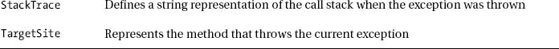

# 十一、处理异常

对于您编写的程序，您肯定会关心修复语言编译器引起您注意的任何错误或问题。然而，有一种特殊类型的错误在编译时不会发生；相反，它发生在运行时。随着您进行更复杂的应用开发，您有更多的机会出现这样的运行时错误，称为*异常*。发生这种情况的原因可能是应用试图打开一个与不存在的数据库的连接，打开一个不存在的文件，或者写入一个已经以只读模式打开的文件。本章将帮助你学习更多关于异常的知识，以及当异常发生时如何处理它们。

### 系统。异常类

英寸 NET 中，所有的异常都是从`Exception`类派生的。`Exception`类是在`System`名称空间中定义的。其他派生的异常类分布在许多其他名称空间中，比如`SQLException`、`FileNotFoundException`、`IndexOutOfRangeException`等等。

因此当你调用一些。NET 功能，并且在运行时出错，函数可能会抛出特定类型的异常。例如，如果您连接到一个不存在的数据库，您将收到一个运行时错误，换句话说，一个类型为`SqlException`的异常。类似地，如果您试图打开一个不存在的文件进行读取，您将得到一个`FileNotFound`异常。

重要的是要理解所有的异常都是从`System.Exception`类派生的。例如，如果您捕捉到了`System.Exception`，那么这将涵盖从`System.Exception`派生的所有异常。我将在本章的后面演示这一点。[表 11-1](#tab_11_1) 显示了`System.Exception`类暴露的属性。

### 什么原因导致异常发生

在我们深入了解如何处理异常的更多细节之前，让我们看看异常发生时是什么样子，以及应用在这种情况下如何表现。

如今，许多组织依靠日志文件来跟踪系统上发生的活动；你甚至可能已经看过或读过一些`setup.log`文件。因此，文件处理是一个重要的概念，可以应用于许多情况。例如，您在文本框中输入的任何内容都可以记录到日志文件中，以后可以从磁盘上的存储文件中读取这些信息。

假设您有一个从用户那里读取文件路径和文件名并打开文件的应用。通常，应用工作正常，但是在这种情况下，提供了不正确的文件名或路径，因此会发生异常。

#### 试试看:创建一个文件处理应用

在本练习中，您将创建一个带有四个标签、四个文本框和两个按钮的 Windows 窗体应用。应用将接受一些文本，然后将其保存/写入磁盘上的文件；它还将文件路径作为输入，并为您读取文件内容。

1.  创建一个名为 [Chapter11](11.html) 的新 Windows 窗体应用项目。当解决方案资源管理器打开时，保存解决方案。
2.  将 [Chapter11](11.html) 项目重命名为 FileHandling，然后将 Form1 重命名为 FileExceptionHandling。
3.  将 FileExceptionHandling 窗体的 Text 属性更改为 File-Read/Write。
4.  将 Label 控件拖到窗体上，并将其放在左上角。选择此标签控件，导航到“属性”窗口，并设置以下属性:
    1.  将 Name 属性设置为 lblPathWrite。
    2.  设置 Text 属性以输入文件写入路径。
5.  将一个 TextBox 控件拖动到刚刚拖动到窗体上的名为 lblPathWrite 的 Label 控件旁边。选择此 TextBox 控件，导航到“属性”窗口，并设置以下属性:
    1.  将 Name 属性设置为 txtFileWritePath。
    2.  将 Size 属性设置为 301，20。
6.  将一个 Button 控件拖动到刚刚拖动到窗体上的 TextBox 控件旁边。选择此按钮控件，导航到“属性”窗口，并设置以下属性:
    1.  将 Name 属性设置为 btnWriteToFile。
    2.  设置 Text 属性以写入文件。
7.  将一个 Label 控件拖到窗体上，并将其放在名为“输入文件写入路径”的 Label 控件下面。选择此标签控件，导航到“属性”窗口，并设置以下属性:
    1.  将 Name 属性设置为 lblText。
    2.  设置 Text 属性以输入文本。
8.  将一个 TextBox 控件拖动到刚刚拖动到窗体上的名为 lblText 的 Label 控件旁边。选择此 TextBox 控件，导航到“属性”窗口，并设置以下属性:
    1.  将 Name 属性设置为 txtFileText。
    2.  将 Multiline 属性设置为 True。
    3.  将 Size 属性设置为 301，60。
9.  Drag a Label control onto the form, and position it below the Label control named lblText. Select this Label control, navigate to the Properties window, and set the following properties:
    1.  将 Name 属性设置为 lblPathRead。
    2.  设置 Text 属性以输入文件读取路径。

    将一个 TextBox 控件拖动到刚刚拖动到窗体上的名为 lblPathWrite 的 Label 控件旁边。选择此 TextBox 控件，导航到“属性”窗口，并设置以下属性:

    1.  将 Name 属性设置为 txtFileReadPath。
    2.  将 Size 属性设置为 301，20。
10.  将一个 Button 控件拖动到刚刚拖动到窗体上的 TextBox 控件旁边。选择此按钮控件，导航到“属性”窗口，并设置以下属性:
    1.  将 Name 属性设置为 btnReadFile。
    2.  将 Text 属性设置为 Read File。
11.  将一个 Label 控件拖到窗体上，并将其放在名为“输入文件读取路径”的 Label 控件下面。选择此标签控件，导航到“属性”窗口，并设置以下属性:
    1.  将 Name 属性设置为 lblFileContent。
    2.  将 Text 属性设置为 File Content。
12.  将一个 TextBox 控件拖动到刚刚拖动到窗体上的名为 lblText 的 Label 控件旁边。选择此 TextBox 控件，导航到“属性”窗口，并设置以下属性:
    1.  将 Name 属性设置为 txtFileContent。
    2.  将 Multiline 属性设为 True。
    3.  将 Size 属性设置为 301，90。
13.  Your FileExceptionHandling form will look like [Figure 11-1](#fig_11_1). 

    ***图 11-1。**设计视图中的文件处理表单*

14.  现在是写代码的时候了。
15.  双击“写入文件”按钮，开始添加代码。
16.  首先为与文件相关的操作添加一个`using`语句，在顶部的代码编辑器中导航到`using`语句，并在末尾添加以下语句:`  using System.IO;`
17.  Now add the following code for writing text to the file from [Listing11-1](#list_11_1):

    ***列表 11-1。** btnWriteToFile_Click*

    `StreamWriter sw = new StreamWriter(txtFileWritePath.Text, true);
    sw.WriteLine(txtFileText.Text);
    sw.Close();`
18.  双击 Read File 按钮，并添加下面的代码来从清单 11-2 的[文件中读取内容:`Listing11-2: btnReadFile_ClickStreamReader sr = new StreamReader(txtFileReadPath.Text);
    txtFileContent.Text = sr.ReadToEnd();
    sr.Close();`](#list_11_2)
19.  Save the changes and build the application. You should see the message “Build Succeeded.” Now it’s time to run the application and do a file read-write operation. Press Ctrl+F5 to run the program.

     **注意**重要的是要明白`System.IO`只能读写那些扩展名为`.txt`或`.log file`的文件。此外，这种文件处理程序是基于文件路径和文件名的。出于演示的目的，我使用我的笔记本电脑特定的路径和文件名。这些文件路径和文件名与您系统上的不匹配，因此请相应地修改目录名和文件名。

20.  When the application launches, enter the file path in the first text box and then type the text you want to save in this file, as shown in [Figure 11-2](#fig_11_2).

     **注意**根据你的电脑使用文件读写路径很重要；此外，请确保您对指定的驱动器/文件夹具有写权限。

    

    ***图 11-2。**文件写入操作正在进行*

21.  Once you’re done, click the Write To File button. You should be able to see your file created, as shown in [Figure 11-3](#fig_11_3). 

    ***图 11-3。**应用创建的日志文件*

22.  Now switch back to the running application, type the path where your file just got created in the Enter File Read Path text box, and click the Read File button. You should see the output shown in [Figure 11-4](#fig_11_4). 

    ***图 11-4。**文件读写动作*

#### 试试看:引起异常发生，观察行为

在本练习中，您将继续使用已创建的应用，然后创建一个会导致异常发生的场景，以便您可以观察该行为。

1.  在 Visual Studio 2012 中打开 FileHandling 项目。
2.  要引起异常，您只需对预先创建的文件执行文件读取操作。
3.  This time, you will run the application from the file `Chapter11.exe`, which is located in the project’s `bin\debug` folder, as shown in [Figure 11-5](#fig_11_5). 

    *图 11-5**。**从其指定的`.exe`运行程序从`bin\debug`运行到*

4.  When the application loads, enter the following path in the Enter File Read Path text box: **c:\vidyavrat\MyLogFile.log**. As you probably recall, you saved the file as `MyFile.log` (refer to the earlier Figure11-2), but here you are intentionally passing the wrong file name, as shown in [Figure 11-6](#fig_11_6). 

    ***图 11-6。**提供错误的文件名导致异常*

5.  Now click the Read File button. Because this file name is incorrect, you will receive a strange-looking dialog with an unhandled exception, as shown in [Figure 11-7](#fig_11_7). 

    ***图 11-7。**通过`.exe`* 执行代码时出现异常对话框

    正如您所看到的，这将中止您的应用，并留给您一个不愉快的对话框，这当然不是用户友好的。

6.  单击“退出”退出异常对话框。(如果您单击继续，您将切换回应用 UI。)
7.  为了深入了解，让我们通过按 Ctrl+F5 从 Visual Studio 运行该项目。
8.  When the application loads, repeat the previous steps to enter an incorrect file name, and click Read File. You will get an exception. The difference now by running the program through Visual Studio is that it points to the code and exact details of the exception so you can add exception-handling code, as shown in [Figure 11-8](#fig_11_8). 

    ***图 11-8。**通过 Visual Studio 执行代码时出现异常对话框*

如您所见，这对开发人员来说是非常有用的。它明确指出您提供的文件名不存在或没有找到，并抛出一个`FileNotFoundException`异常。

现在，一旦发生这种情况，就没有解决办法了。您必须通过按 Shift+F5 来中断应用，这将使您返回到代码视图，应用将停止运行。但是您现在知道发生了什么类型的异常，所以您可以添加代码来处理它。

 **注意**本章的主要目的是异常处理；本章后面的练习将提供详细的操作步骤。现在，理解异常的一些更概念性的方面是很重要的。

### 探索异常的类型、消息和堆栈跟踪属性

任何。NET 异常中发生的或通过运行 EXE 文件而发生的异常包含大量信息，开发人员可以对其进行处理或进一步调查。Type、Message 和 StackTrace 属性服务于这个伟大的目的。

类型定义了类别，或者发生了哪种异常。每当发生. NET 异常时，它都会在对话框的标题栏中显示异常的类型。可以看到，[图-11-8](#fig_11_8) 中对话框的标题栏上提到了`FileNotFoundException`。

通过点击对话框底部(在操作下)的查看详细信息，可以找到关于任何异常的更多信息，如图[图 11-7](#fig_11_7) 所示。这适用于您在. NET 中遇到的任何异常。

单击查看详细信息后，您将看到另一个窗口打开；它提供了异常快照。展开这个，你会发现很多信息。查找 Message 属性，它保存了发生异常时的确切消息，如图[图 11-9](#fig_11_9) 所示。

在大多数情况下，开发人员希望在这个系统生成的消息中添加一些额外的文本。我们将在本章后面介绍如何做到这一点。

***图 11-9。**异常消息属性*

其他重要信息由 StackTrace 属性公开，该属性主要对希望调试代码并找出是哪一行代码导致了问题的人有用。此外，许多组织出于监控目的，将此类信息记录到事件查看器或日志文件中。

就在 Message 属性下面，您会发现 StackTrace 选项；选中它，然后点击其描述文本右侧向下的箭头，如图[图 11-10](#fig_11_10) 所示。

***图 11-10。**异常的堆栈跟踪属性*

您会注意到，这个 StackTrace 属性是预先选定的，因此您可以轻松地复制和粘贴它。大多数 bug 分类会议都有很多关于 StackTrace 的讨论，每当一个手工测试人员谈到一些运行时错误时，大多数开发人员都会说，“请给我提供 StackTrace！”因为它可以准确地指出问题所在。

现在让我们将这个 StackTrace 复制并粘贴到一个记事本文件中并对其进行研究，如图[图 11-11](#fig_11_11) 所示。此图仅显示了堆栈跟踪的前半部分。当您复制和粘贴时，您将看到完整的详细信息。

***图 11-11。**正在调查异常的堆栈跟踪细节*

如果您查找图中所示的选中行，您将会发现是哪个文件导致了这个异常的发生，以及问题出在哪个路径和行号上。

### 处理异常

现在您可能已经意识到，异常处理是一种用于避免任何运行时错误并优雅地处理它们的技术，而不是发出一些笨拙的消息或让应用在用户面前挂起。

异常处理主要基于三个关键字:`try`、`catch`、`finally`。任何程序都可以有一个`try`，后跟一个或多个`catch`块，然后以一个`finally`块结束。

`try`块保存任何抛出或可能抛出异常的代码。`catch`块作为一种防御机制，处理抛出的异常。`finally`区块有独特的行为；它将在两种情况下执行:异常没有发生时和异常发生时。因此，`finally`的最佳代码语句是关闭文件流、关闭数据库连接，或者甚至向客户告别，等等，但是现实世界的应用包括关闭流和连接。我将在下面的练习中演示这一点。

#### 试试看:添加异常处理语句

在本练习中，您将继续使用创建的应用，然后添加异常处理代码块来处理此类异常，避免以不友好的方式向用户显示。

1.  在 Visual Studio 2012 中打开 FileHandling 项目。
2.  Now double-click the Read File button and replace the code with the one in [Listing 11-3](#list_11_3).

    ***清单 11-3。** btnReadFile_Click*

    `StreamReader sr=null;
           try
           {                sr = new StreamReader(txtFileReadPath.Text);
                    txtFileContent.Text = sr.ReadToEnd();
           }

           catch (FileNotFoundException ex)
           {
                    MessageBox.Show(ex.Message + " " + "Please provide valid path and filename");
           }

           catch (DirectoryNotFoundException ex)
           {
                    MessageBox.Show(ex.Message + " " + "Please provide valid Directory
                     name", "File Read Error");
           }

           finally
           {
                    if (sr != null)
                    {
                        sr.Close();` `                }
           }`

构建应用，并按 Ctrl+F5 运行它。如果你这次传递了错误的文件名，它实际上会抛出一个异常，但是我们正在处理，所以会显示一个用户友好的消息，如图 11-12 所示。

***图 11-12。**使用`catch`程序块*进行异常处理

如您所见，该对话框显示您输入了错误的路径或文件名。单击 OK，它将带您回到应用，让您正确地修改路径或文件名。

在这样的文件处理应用中，另一个场景是当用户传递错误的目录名时。为了处理这个问题，你需要一个单独的`catch`块来处理`DirectoryNotFoundException`。你已经添加了，如[清单 11-3](#list_11_3) 所示。现在要测试它，请将路径更改为一个不存在的文件夹名，您将看到一个单独的对话框，提示“提供有效的目录名”

#### 它是如何工作的

这个文件读取代码是基于`Stream`对象的，所以您需要创建一个`StreamReader`对象。

`StreamReader sr=null;`

现在您在`try`块中使用这个对象来传递文件路径和文件名，以便读取内容。

`       try
       {
           sr = new StreamReader(txtFileReadPath.Text);
           txtFileContent.Text = sr.ReadToEnd();
       }`

如果提供了错误的文件路径或文件名，那么它将抛出一个`FileNotFoundException`，因此您需要提供一个`catch`块来处理这个异常。

`       catch (FileNotFoundException ex)
       {
                MessageBox.Show(ex.Message + " " + "Please provide valid path and filename");
       }`

如果提供了一个错误的目录名，那么它将抛出一个`DirectoryNotFoundException`，所以您需要提供一个`catch`块来处理这个异常。

`       catch (DirectoryNotFoundException ex)
       {
            MessageBox.Show(ex.Message + " " + "Please provide valid Directory
             name", "File Read Error");
       }`

在任何情况下，无论文件是否被读取，都需要关闭一个`Stream`对象。执行这样的强制操作可能是一个`finally`块的最佳候选。同样，你会注意到在异常情况下，`Stream`对象不会被初始化，因为文件名或路径找不到，所以不能被关闭。

因此，您必须在关闭之前检查您创建的`Stream`对象是否为空。

`       finally
       {
                if (sr != null)
                {
                    sr.Close();
                }  
            }`

### 总结

在本章中，你学习了异常处理以及如何处理 C# 文件 I/O 程序抛出的异常。在专门讨论 ADO.NET 的下一章中，您将在整个 ADO 中应用异常处理原则。NET 代码。

具体来说，在下一章中，您将了解如何创建一个到 SQL Server 2012 数据库的 ADO.NET 连接。