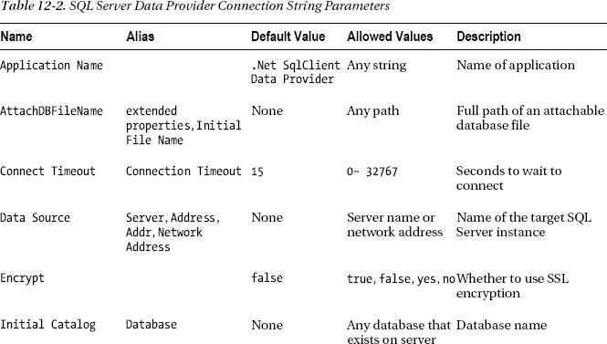

# 十二、建立连接

在对数据库做任何有用的事情之前，您需要与数据库服务器建立一个*会话*。您可以通过一个名为*连接、*的对象来实现这一点，该对象是一个类的实例，该类为特定的数据提供者实现了`System.Data.IDbConnection`接口。在本章中，您将使用各种数据提供者来建立连接，并了解可能出现的问题以及如何解决这些问题。在本章中，我们将介绍以下内容:

> *   Introduce the data provider connection class
> *   Use `SqlConnection`
> *   Connecting to SQL Server to Improve the Use of Connection Objects
> *   Use `OleDbConnection`
> 
> 连接到 SQL Server】

### 介绍数据提供者连接类

正如您在第 10 章中看到的，每个数据提供者都有自己的名称空间。每个都有一个实现`System.Data.IDbConnection`接口的连接类。[表 12-1](#tab_12_1) 总结了微软提供的数据提供商。

如您所见，这些名称遵循一个约定，使用前缀为数据提供者标识符的`Connection`。由于所有的连接类都实现了`System.Data.IDbConnection`，所以每一个的用法都是相似的。每个都有额外的成员，提供特定于特定数据库的方法。

### 使用 SqlConnection 连接到 SQL Server 2012

在此示例中，您将连接到 SQL Server 连接到 SQL Server 2012 AdventureWorks 数据库。

#### 尝试一下:使用 SqlConnection

您将编写一个非常简单的程序来打开和检查连接。

1.  在 Visual Studio 2011 中，创建一个名为 [Chapter12](12.html) 的新 Windows 控制台应用项目。当解决方案资源管理器打开时，保存解决方案。
2.  Rename the [Chapter12](12.html) project to ConnectionSQL. Rename the `Program.cs` file to `ConnectionSql.cs`, and replace the generated code with the code in [Listing 12-1](#list_12_1).

    ***清单 12-1。**T4`ConnectionSql.cs`*

    `using System;
    using System.Data;
    using System.Data.SqlClient;

    namespace Chapter12
    {
          class ConnectionSql
          {
            static  void  Main(string[]  args)
            {
                    // Connection string (connection string key=value
                    //might be different for you based on your environment
                    string connString = @"server = .\sql2012; integrated security = true;";

                   // Create connection
                   SqlConnection  conn  =  new  SqlConnection(connString);

                   try
                   {
                          // Open connection
                          conn.Open();
                          Console.WriteLine("Connection opened.");
                   }

                   catch  (SqlException  ex)
                  {
                          //  Display  error
                          Console.WriteLine("Error:  "  +  ex.Message  +  ex.StackTrace);
                  }

                  finally
                  {
                          // Close connection` `                      conn.Close();
                          Console.WriteLine("Connection closed.");
                   }

                   Console.ReadLine();
            }
          }
    }`
3.  Run the application by pressing Ctrl+F5\. If the connection is successful, you’ll see the output in [Figure 12-1](#fig_12_1). 

    ***图 12-1。**打开和关闭数据库连接*

如果连接失败，你会看到如图[图 12-2](#fig_12_2) 所示的错误信息。(您可以通过首先关闭 SQL Server 服务，在命令提示符下输入`net stop mssql$<SQL Server instance name>`来实现这一点。如果你尝试这样做，记得用`net start mssql$<SQL Server instance name>`重启它。)或者，简单的方法是尝试将错误的 SQL 实例名传递给连接字符串。

***图 12-2。**连接到 SQL Server 时连接失败的错误*

现在不要担心这个消息的细节。连接失败的原因通常与您的代码无关。这可能是因为服务器没有启动，就像在这种情况下，或者因为密码是错误的，或者因为其他一些配置问题存在。您将很快看到建立数据库连接中的常见问题。

#### 它是如何工作的

让我们检查一下[清单 12-1](#list_12_1) 中的代码，以理解连接过程中的步骤。首先，指定 ADO.NET 和 SQL Server 数据提供程序命名空间，以便可以使用其成员的简单名称。

`using System;
using System.Data;
using System.Data.SqlClient;`

然后，创建一个连接字符串。一个*连接字符串*由参数组成——换句话说，由分号分隔的`key=value`对——指定连接信息。尽管有些参数对所有数据提供程序都有效，但每个数据提供程序都有它将接受的特定参数，因此了解您所使用的数据提供程序的连接字符串中哪些参数是有效的非常重要；这将在本章后面详细解释。

`// Connection string
string connString = @"server = .\sql2012; integrated security = true;";`

让我们简要地检查一下这个例子中的每个连接字符串参数。server 参数指定要连接的 SQL Server 实例。

`server =  .\sql2012;`

在该语句中，`.`(点)表示本地服务器，后面跟有`\`(斜线)的名称表示数据库服务器上运行的 SQL Server 实例名称。因此，这里有一个名为 sql2012 的 SQL Server 2012 实例运行在本地服务器上。

 **提示** `(local)`是`.`(点号)的替代，用来指定本地机器，所以`.\sqlexpress`可以用`(local)\sql2012`代替，甚至可以写成`localhost\sql2012`。

下一个子句指示您应该使用 Windows 身份验证(即任何有效登录的 Windows 用户都可以登录到 SQL Server)。

`integrated security = true;`

你也可以用`sspi`代替`true`，因为它们有相同的效果。其他参数也是可用的。稍后您将使用它来指定您想要连接的数据库。

接下来创建一个连接(一个`SqlConnection`对象)，向它传递连接字符串。这不会创建数据库会话。它只是创建一个对象，稍后您将使用它来打开一个会话。

`// Create connection
SqlConnection conn = new SqlConnection(connString);`

现在您有了一个连接，但是您仍然需要通过调用连接上的`Open`方法来建立与数据库的会话。如果试图打开一个会话失败，将会抛出一个异常，所以您使用一个`try`语句来启用异常处理。您在调用`Open`后会显示一条消息，但是这条线只有在连接成功打开时才会被执行。

`try
{
        // Open connection
        conn.Open();
        Console.WriteLine("Connection opened.");
}`

在代码的这个阶段，您通常会通过打开的连接发出一个查询或执行一些其他数据库操作。然而，我们将把它留到后面的章节，在这里只关注连接。

接下来是一个异常处理程序，以防`Open()`失败，如本章前面的[图 12-2](#fig_12_2) 所示。

`catch (SqlException ex)
{
      // Display error
      Console.WriteLine("Error: " + ex.Message + ex.StackTrace);
}`

每个数据提供程序都有一个特定的异常类用于其错误处理；`SqlException`是 SQL Server 数据提供程序的类。异常中提供了关于数据库错误的特定信息，但是这里只显示了它的原始内容。

当您完成数据库时，您调用`Close()`来终止会话，然后打印一条消息来显示调用了`Close()`。

`finally
{
     // Close connection
     conn.Close();
     Console.WriteLine("Connection closed.");
}`

你在`finally`块中调用`Close()`，以确保*总是被*调用。

控制台应用倾向于在短时间内加载带有输出的命令窗口，然后自动关闭。要在屏幕上保持窗口以便阅读和理解输出，调用`Console`类的`ReadLine()`方法。这将让窗口停留，直到你按下回车键。

`Console.ReadLine();`

 **注意**建立连接(数据库会话)的成本相对较高。它们使用客户端和服务器上的资源。尽管连接最终可能会通过垃圾收集或超时而关闭，但在不再需要时让一个连接保持打开是一种不好的做法。太多打开的连接会降低服务器速度或阻止建立新的连接。

注意，可以在关闭的连接上调用`Close()`，不会抛出异常。因此，如果连接早一点关闭，或者即使它从未打开过，您的消息也会显示出来。参见[图 12-2](#fig_12_2) ，连接失败但仍显示关闭信息。

在一个典型的例子中，多次调用`Open()`和`Close()`是有意义的。ADO.NET 支持断开的数据处理，即使与数据提供程序的连接已经关闭。模式如下所示:

`try
{
     // open connection
      conn.Open();
    // online processing (e.g., queries) here
    //
    conn.Close(); // close connection

    //
   // offline processing here
   //
      conn.Open(); // reopen connection
   //
  // online processing(e.g., INSERT/UPDATE/DELETE) here
 //
conn.Close(); // reclose connection
}

catch(SqlException ex)
{
    // error handling code here
}
finally
{
    // close connection
    conn.Close();
}`

`finally`块仍然调用`Close()`，如果没有遇到异常就不必要地调用它，但这不是问题，也不昂贵，而且它确保连接将被关闭。尽管许多程序员在程序终止前一直保持连接，但这通常会浪费服务器资源。有了*连接池，*根据需要打开和关闭连接实际上比一劳永逸地打开更有效。

就这样！您已经完成了第一个连接示例。但是，既然您看到了一个可能的错误，那么让我们来看看连接错误的典型原因。

#### 调试与 SQL Server 的连接

编写使用连接的 C# 代码通常是让连接工作的简单部分。问题通常不在于代码，而在于客户机(您的 C# 程序)和数据库服务器之间的连接参数不匹配。必须使用所有适当的连接参数，并且必须具有正确的值。即使是经验丰富的数据库专业人员，在第一次连接时也经常会遇到问题。

除了这里显示的参数之外，还有更多可用的参数，但你已经明白了。墨菲定律的一个推论适用于关系:如果几件事都可能出错，那么其中肯定会有一件出错。您的目标是检查连接的两端，以确保您所有的假设都是正确的，并且客户端程序指定的所有内容都在服务器上正确匹配。

解决方案通常在服务器端。如果 SQL Server 实例没有运行，客户端将尝试连接到不存在的服务器。如果未使用 Windows 身份验证，并且客户端上的用户名和密码与有权访问 SQL Server 实例的用户的用户名和密码不匹配，则连接将被拒绝。如果连接中请求的数据库不存在，将会出现错误。如果客户端的网络信息与服务器的网络信息不匹配，服务器可能不会收到客户端的连接请求，或者服务器的响应可能不会到达客户端。

对于连接问题，使用调试器来定位发生错误的代码行通常没有帮助——问题几乎总是发生在对`Open`方法的调用上。问题是，为什么？您需要查看错误消息。

典型的错误如下:

* * *

`Unhandled Exception: System.ArgumentException: Keyword not supported...`

* * *

这是因为使用了无效的参数或值，或者连接字符串中的参数或值拼写错误。确保您输入了您真正想要输入的内容。

[图 12-2](#fig_12_2) 早先显示了可能是连接到 SQL Server 时最常见的消息。在这种情况下，很可能 SQL Server 根本没有运行。使用`net start mssql$<your sql instance name>`重新启动 SQL Server Express 服务。

此消息的其他可能原因如下:

> *   The SQL Server instance name is incorrect. For example, you used `.\sqlexpress`, but SQL Server was installed with a different name. It is also possible that SQL Server is installed as the default instance (without instance name) or installed on another computer (see the next section); If this is the case, please correct the instance name.
> *   SQL Server has not been installed—Go back to chapter 1 of [and install SQL Server 2012 Express according to the instructions therein.](01.html)
> *   There is a security problem-your Windows login and password are invalid on the server. This is unlikely to be a problem when connecting to a local instance of SQL Server Express, but it may happen when trying to connect to an instance of SQL Server on another server. There is a hardware problem-this is also unlikely if you try to connect to a server on the same machine.

#### SqlConnection 中的安全性和密码

SQL Server 2012 中有两种用户身份验证。首选方法是使用 Windows 身份验证(集成安全性)，正如您在遵循本书中的示例时所做的那样。SQL Server 使用您的 Windows 登录名来访问该实例。您的 Windows 登录名必须存在于运行 SQL Server 的计算机上，并且您的登录名必须有权访问 SQL Server 实例，或者是具有访问权限的用户组的成员。

如果在连接字符串中不包含`Integrated Security = true`(或`Integrated Security = sspi`)参数，则连接默认为 SQL Server 安全，在 SQL Server 中使用单独的登录名和密码。

#### 如何使用 SQL Server 安全性

如果您确实打算使用 SQL Server 安全性，因为您的公司或部门就是这样设置对您的 SQL Server 的访问权限的(可能因为某些客户端是非 Microsoft 的)，您需要在连接字符串中指定用户名和密码，如下所示:

`thisConnection.ConnectionString = @"server = sqlexpress; user id = sa; password = xly2z3";`

用户名`sa`是 SQL Server 的默认系统管理员帐户。如果已经设置了特定用户，如`george`或`payroll`，请指定该名称。`sa`的密码在安装 SQL Server 时设置。如果您使用的用户名没有密码，您可以完全省略 password 子句或指定一个空密码，如下所示:

`password =;`

然而，空白密码是不好的做法，即使在测试环境中也应该避免。

#### 【SqlConnection 的连接字符串参数

[表 12-2](#tab_12_2) 总结了 SQL Server 数据提供程序连接字符串的基本参数。

表 12-2 中的别名栏给出了替代参数名称。例如，您可以使用以下任一选项来指定服务器:

`data source = .\<sql instance name>
server = .\ <sql instance name>
address = .\ <sql instance name>
addr = .\ <sql instance name>
network address = .\ <sql instance name>`

#### 连接池

一个值得注意的底层细节是*连接池，尽管您不应该改变它。*回想一下，就内存和时间而言，创建连接是非常昂贵的。使用连接池，关闭的连接不会立即被销毁，而是保存在内存中未使用的连接池中。如果新的连接请求与池中某个未使用的连接的属性相匹配，则该未使用的连接将用于新的数据库会话。

在网络上创建一个全新的连接可能需要几秒钟，而重用一个池化的连接可能需要几毫秒；使用池连接要快得多。连接字符串具有可以改变连接池大小甚至关闭连接池的参数。默认值(例如，缺省情况下连接池是打开的)适用于大多数应用。

### 提高对连接对象的使用

第一个示例程序中的代码很简单，所以您可以专注于连接如何工作。让我们增强一下。

#### 在连接构造函数中使用连接字符串

在 ConnectionSql 项目中，您在单独的步骤中创建了连接并指定了连接字符串。因为您总是必须指定连接字符串，所以您可以使用将连接字符串作为参数的构造函数的重载版本。

`// create connection
SqlConnection conn = new SqlConnection(@"server = (local)\sqlexpress; integrated security =
true; ");`

这个构造函数在创建`SqlConnection`对象时设置`ConnectionString`属性。您将在下一个示例中尝试它，并在后面的章节中使用它。

#### 显示连接信息

连接有几个提供连接信息的属性。这些属性大多数是只读的，因为它们的目的是显示而不是设置信息。(您可以在连接字符串中设置连接值。)这些属性在调试时通常很有用，可以验证连接属性是否是您所期望的。

这里，我们将描述大多数数据提供者共有的连接属性。

#### 试试看:显示连接信息

在这个例子中，您将看到如何编写一个程序来显示连接信息。

1.  将名为 ConnectionDisplay 的 C# 控制台应用项目添加到 [Chapter12](12.html) 解决方案中。
2.  Rename `Program.cs` to `ConnectionDisplay.es`. When prompted to rename all references to `Program`, you can click either Yes or No. Replace the code with that in [Listing 12-2](#list_12_2).

    ***清单 12-2。**T4`ConnectionDisplay.es`*

    `using System;
    using System.Data;
    using System.Data.SqlClient;
    namespace Chapterl2
    {
           class ConnectionDisplay
           {
                 static void Main()
                {` `                  // Create connection
                      SqlConnection conn = new SqlConnection(@” server = .\sql2012;
                        integrated  security = true; ");

                      try
                      {
                               // Open connection
                               conn.Open();
                               Console.WriteLine("Connection opened.");

                              // Display connection properties
                              Console.WriteLine("Connection Properties:");
                              Console.WriteLine("\tConnection String: {0}",
    conn.ConnectionString);
                              Console.WriteLine( "\tDatabase: {0}", conn.Database);
                              Console.WriteLine( "\tDataSource: {0}", conn.DataSource);
                              Console.WriteLine("\tServerVersion: {0}", conn.ServerVersion);
                              Console.WriteLine( "\tState: {0}", conn.State);
                              Console.Writel_ine("\tWorkstationld: {0}", conn.Workstationld);

                      }

                      catch (SqlException ex)
                      {
                              // Display error
                             Console.WriteLine("Error: " + ex.Message + ex.StackTrace);
                      }

                     finally
                    {
                              // Close connection
                              conn.Close();
                              Console.WriteLine("Connection closed.");
                    }

                    Console.ReadLine();
             }
         }
     }`
3.  To set ConnectionDisplay as the startup project, select the project in Solution Explorer, right-click and select Set as StartUp Project, and run it by pressing Ctrl+F5\. If the connection is successful, you’ll see output like that shown in [Figure 12-3](#fig_12_3). 

    ***图 12-3。**显示连接信息*

#### 它是如何工作的

`ConnectionString`属性可以读写。在这里你只是展示它。

`Console.WriteLine("\tConnection String: {0}", conn.ConnectionString);`

您可以在逐字字符串中看到您赋予它的值，包括空格。

有什么意义？嗯，在调试连接时，验证连接字符串是否真的包含您认为已经赋值的值是很方便的。例如，如果您尝试不同的连接选项，程序中可能会有不同的连接字符串参数。你可能注释掉了一个，打算以后用，但是忘了。显示`ConnectionString`属性有助于查看参数是否丢失。

下一条语句显示了`Database`属性。由于每个 SQL Server 实例都有几个数据库，因此该属性显示您在连接时最初使用的数据库。

`Console.WriteLine("\tDatabase: {0}",conn.Database);`

在这个程序中，它显示

* * *

`Database: master`

* * *

由于您没有在连接字符串中指定数据库，所以您连接到了 SQL Server 的默认数据库主服务器。如果您想连接到 AdventureWorks 或您选择的数据库，您需要指定`Database`参数，例如:

`// connection string
string connString = new SqlConnection(@"server = .\sqlexpress; database = northwind ";
                             integrated security = true;)`

还可以通过执行以下语句将默认数据库从 master 数据库更改为其他数据库，例如 AdventureWorks:

`exec sp_defaultdb 'sa'/adventureworks'`

同样，这是一个方便显示的属性，用于调试目的。如果您得到一个错误，说某个特定的表不存在，通常问题不是这个表不存在，而是它不在您所连接的数据库中。显示`Database`属性有助于您快速找到这种错误。

 **提示**如果您在连接字符串中指定了一个服务器上不存在的数据库，您可能会看到以下错误消息:“System .Data.SqlClient.SqlException:无法打开登录名请求的数据库“database”。登录失败。

您可以使用`ChangeDatabase`方法更改连接上当前使用的数据库，如下所示:

`Conn.ChangeDatabase("AdventureWorks");`

下一条语句显示了`DataSource`属性，该属性给出了 SQL Server 数据库连接的服务器实例名称。

`Console.WriteLine( "\tDataSource: {0}", conn.DataSource);`

这将显示与您的 SQL 实例名称相同的 SQL Server 实例名称；例如，在我的例子中，它将显示以下内容:

* * *

`DataSource: .\sql2012`

* * *

同样，这主要是为了调试的目的。

`ServerVersion`属性显示服务器版本信息。

`Console.WriteLine("\tServerVersion: {0}",conn.ServerVersion);`

它显示了您在第 1 章中安装的 SQL Server Express 版本。(您的版本可能有所不同。)

* * *

`ServerVersion: 11.00.1750`

* * *

版本号对调试很有用。该信息实际上来自服务器，因此它表明连接正在工作。

 **注意** SQL Server 2008 是版本 10，**SQL Server 2005(和 SSE)是版本 9。SQL Server 2000 是版本 8。**

 **`State`属性表示连接是打开的还是关闭的。

`Console.WriteLine( "\tState: {0}", conn.State);`

因为您在调用`Open()`之后显示这个属性，所以它表明连接是打开的。

`State: Open`

您已经显示了您自己的消息，表明连接是打开的，但是该属性包含当前状态。如果连接关闭，`State`属性将是`Closed`。

然后显示工作站 ID，它是标识客户端计算机的字符串。`Workstationld`属性是特定于 SQL Server 的，可以方便地进行调试。

`Console.WriteLine("\tWorkstationId: {0}",conn.WorkstationId);`

它默认为计算机名。我的电脑命名为 VIDYAVRAT，但你的，当然，会有所不同。

`Workstationld: <YourComputerName>`

这对于调试非常有用，因为服务器上的 SQL Server 工具可以显示哪个工作站 ID 发出了特定的命令。如果您不知道是哪台机器导致了问题，您可以修改您的程序来显示`Workstationld`属性，并将它们与服务器上显示的工作站 id 进行比较。

您还可以使用 workstation ID 连接字符串参数设置该属性，如下所示，因此，如果您希望建筑物 B 中的所有工作站都显示服务器上的该信息，您可以在程序中指明:

`// Connection string
string connString = @" server = \sql2012; workstation id = Building B; integrated security =
true; ";`

关于使用`SqlClient`连接到 SQL Server 的基础讨论到此结束。现在让我们看看如何连接另一个数据提供者。

### 使用 OleDbConnection 连接到 SQL Server

正如您在第 10 章中看到的，您可以使用 OLE DB 数据提供程序来处理任何 OLE DB 兼容的数据存储。Microsoft 为 Microsoft SQL Server、Microsoft Access (Jet)、Oracle 以及各种其他数据库和数据文件格式提供 OLE DB 数据提供程序。

如果本机数据提供程序可用于特定的数据库或文件格式(如用于 SQL Server 的`SqlClient`数据提供程序)，通常使用它比使用通用 OLE DB 数据提供程序更好。这是因为 OLE DB 在 C# 程序和数据源之间引入了一个额外的间接层。没有本地数据提供程序的一种常见数据库格式是 Microsoft Access 数据库(`.mdb`文件)格式，也称为 Jet 数据库引擎格式，因此在这种情况下，您需要使用 OLE DB(或 ODBC)数据提供程序。

我们不假设您有要连接的 Access 数据库，所以您将在 SQL Server 中使用 OLE DB。

#### 试试看:使用 OLE DB 数据提供程序连接到 SQL Server

若要使用 OLE DB 数据提供程序连接到 SSE，请按照下列步骤操作:

1.  添加一个名为 ConnectionOleDb 的 C# 控制台应用项目，并将`Program.cs`重命名为`Connection01eDb.cs`。
2.  Replace the code in `Connection01eDb.cs` with that in [Listing 12-3](#list_12_3). This is basically the same code as `Connection.cs`, with the changed code in bold.

    ***清单 12-3。**T4`Connection01eDb.cs`*

    `using System;
    using System.Data;
    using System.Data.OleDb;

    namespace Chapter12
    {
        class ConnectionOleDb
        {
            static void Main()
            {
                // Create connection
                OleDbConnection conn = new OleDbConnection(@"provider = sqloledb;
                           data source = .\sql2012; integrated security = sspi;");

                try
                {
                    // Open connection
                    conn.Open();
                    Console.WriteLine("Connection opened.");

                    // Display connection properties
                    Console.WriteLine("Connection Properties:");
                    Console.WriteLine("\tConnection String: {0}",conn.ConnectionString);
                    Console.WriteLine("\tDatabase: {0}",conn.Database);
                    Console.WriteLine("\tDataSource: {0}",conn.DataSource);
                    Console.WriteLine("\tServerVersion: {0}",conn.ServerVersion);
                    Console.WriteLine("\tState: {0}",conn.State);
                }
                catch (OleDbException ex)
                {
                    // Display error
                    Console.WriteLine("Error: " + ex.Message + ex.StackTrace);
                }
                finally
                {
                    // Close connection
                    conn.Close();
                    Console.WriteLine("Connection closed.");
                }

                Console.ReadLine();
            }
        }
    }`
3.  Make ConnectionOleDb the startup project, and run it by pressing Ctrl+F5\. If the connection is successful, you’ll see output like that shown in [Figure 12-4](#fig_12_4). 

    ***图 12-4。**显示 OLE DB 连接信息*

#### 它是如何工作的

我们将只讨论这个例子和前一个例子的不同之处。第一步是引用 OLE DB 数据提供程序命名空间。

`System.Data.OleDb.
using System.Data.OleDb;`

接下来，创建一个`OleDbConnection`对象，而不是一个`SqlConnection`对象。请注意连接字符串的更改。您可以使用`Provider`和`Data Source`来代替`server`参数。注意`Integrated Security`参数的值必须是`sspi`，而不是`true`。

`// create connection
OleDbConnection conn = new 01eDbConnection(@"provider = sqloledb;data source = .\sql2012;
                                     integrated security = sspi;" );`

最后，请注意，您在显示中省略了`Workstationld`属性。OLE DB 数据提供程序不支持它。

这是使用任何访问任何数据源的模式。NET 数据提供程序。使用特定于数据提供程序的参数指定连接字符串。使用数据提供程序命名空间中的适当对象。仅使用该数据提供程序提供的属性和方法。

### 总结

在本章中，您使用两个数据提供程序及其相应的连接字符串、参数和值创建、打开和关闭了连接。使用连接属性创建连接后，您显示了有关连接的信息。您还看到了如何处理与连接相关的各种异常。

在下一章，你将看到 ADO.NET 命令，并了解如何使用它们来访问数据。**