# 十三、执行 ADO.NET 命令来检索数据

一旦建立了与数据库的连接，您就想开始与它交互，让它为您做一些有用的事情。您可能需要检索、添加、更新或删除一些数据，或者以其他方式修改数据库，通常是通过运行查询。无论什么任务，都不可避免地会涉及到一个*命令。*

在这一章中，我们将解释命令，这些命令是封装您想要执行的操作的 T-SQL 的对象，并提供将它提交给数据库的方法。每个数据提供者都有一个实现`System.Data.IDbCommand`接口的命令类。

在本章中，我们将介绍以下内容:

> *   Create command
> *   executive order
> *   Execute commands with multiple results.
> *   execute statement
> *   Use stored procedures

在我们的示例中，我们将使用 SQL Server 数据提供程序(`System.Data.SqlClient`)。它的命令命名为`SqlCommand`。其他数据提供程序的命令工作方式相同。

### 创建命令

对于要对数据库执行的命令，每个命令都必须与到数据库的连接相关联。通过设置命令的`Connection`属性可以做到这一点，为了节省资源，多个命令可以使用同一个连接。您可以使用`SqlCommand`构造函数创建一个命令。一旦创建了一个命令，就可以执行与已建立的连接相关联的 SQL 语句了。您将在下一节的语句中看到命令的执行。

#### 给命令分配文本

每个命令都有一个属性`CommandText`，它保存您创建的命令对象将执行的 SQL 语句。您可以直接分配给此属性，也可以在构造命令时指定它。让我们看看这些替代方案。

##### 试试看:设置 CommandText 属性

下面的 Windows 应用展示了如何使用`SqlCommand`遍历结果集并检索行。

1.  创建一个名为 [Chapter13](13.html) 的新 Windows 窗体应用项目。当解决方案资源管理器打开时，保存解决方案。
2.  将[第 13 章](13.html)项目重命名为 **ADO。NET_Command** 。将`Form1.cs`文件重命名为`CommandText.cs`。
3.  通过单击窗体的标题栏选择 CommandText 窗体，并将 Size 属性的宽度设置为 287，高度设置为 176。
4.  将 TextBox 控件拖到窗体上，并将其放在窗体的中央。选择此 TextBox 控件，导航到“属性”窗口，并设置以下属性:
    *   将 Name 属性设置为 txtCommandText。
    *   将位置属性的 X 设置为 12，Y 设置为 12。
    *   将 Multiline 属性设置为 True。
    *   将 Size 属性的宽度设置为 244，高度设置为 106。
    *   将文本属性留空。
5.  Now your CommandText form in the Design view should like [Figure 13-1](#fig_13_1). 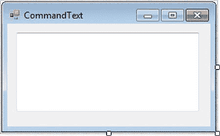

    ***图 13-1。**CommandText 表单的设计视图*

6.  Double-click the empty surface of the `CommandText.cs` form, and it will open the code editor window, showing the `CommandText_Load` event. Modify the `CommandText_Load` event to look like [Listing 13-1](#list_13_1).

    ***清单 13-1。**`CommandText.cs`T5】*

    `     Using System.Data.SqlClient;

            private void CommandText_Load(object sender, EventArgs e)
            {
                // Create connection
                SqlConnection conn = new SqlConnection(@"server = .\sql2012;
                  integrated security = true; database = AdventureWorks");

                // Create command
                SqlCommand cmd = new SqlCommand();

                try
                {
                    // Open connection
                    conn.Open();

                    txtSQL.AppendText("Connection opened \n" );

                    txtSQL.AppendText("Command created.\n");

                    // Setting CommandText
                    cmd.CommandText = @"select Name,ProductNumber
                                    from  Production.Product";

                    txtSQL.AppendText("Ready to execute SQL Statement: \n\t\t\t" +
                                   cmd.CommandText);

                }
                catch (SqlException ex)
                {
                    MessageBox.Show(ex.Message + ex.StackTrace,"Exception Details");
                }
                finally
                {
                    conn.Close();
                    txtSQL.AppendText("\nConnection Closed.");
                }
            }`
7.  Build the project, and run it by pressing Ctrl+F5\. You should see the results in [Figure 13-2](#fig_13_2). 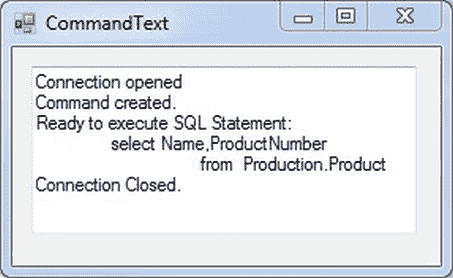

    ***图 13-2。**使用`CommandText`* 显示 SQL 语句

##### 它是如何工作的

属性返回一个字符串，所以您可以像显示任何其他字符串一样显示它。当您最终执行分配给`CommandText`属性的 SQL 语句时，它将返回`AdventureWorks`产品表中产品的名称和产品编号值。

 **注意**在命令可以执行之前，你必须设置命令的`Connection`和`CommandText`属性。

`            // Create command
            SqlCommand cmd = new SqlCommand();

             // Setting CommandText  
            cmd.CommandText = @"select Name,ProductNumber
                             from  Production.Product";`

当您使用其构造函数的另一种变体创建命令时，可以设置这两个属性，如下所示:

`// create command (with both text and connection)
String sql = @"select Name,ProductNumber from  Production.Product";

SqlCommand cmd = new SqlCommand(sql, thisConnection);`

这相当于前面显式分配每个属性的代码。这是最常用的`SqlCommand`构造函数的变体，您将在本章的剩余部分使用它。

### 执行命令

除非您可以执行命令，否则命令没有多大用处，所以现在让我们来看看。命令有几种不同的方法来执行 SQL。这些方法之间的差异取决于您对 SQL 的预期结果。查询返回数据行*(结果集*)，但是`INSERT`、`UPDATE`和`DELETE`语句不返回。你通过考虑你期望返回的内容来决定使用哪种方法(见[表 13-1](#tab_13_1) )。

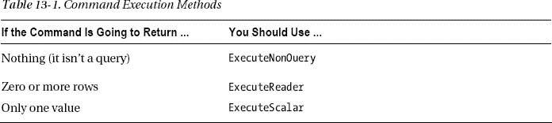

您刚刚在示例中使用的 SQL 应该返回一个值，即雇员人数。查看[表 13-1](#tab_13_1) ，可以看到应该使用`SqlCommand`的`ExecuteScalar()`方法返回这一个结果。让我们试试。

#### 用标量查询执行命令

`ExecuteScalar`是用于执行由标量函数组成的 SQL 语句的方法。标量函数是从表中的整组行中只返回一个值的函数。例如，`Min( )`、`Max( )`、`Sum( )`、`Count( )`等等，都是标量函数的几个例子。如果从 Employee 执行一个查询，比如`Select Min(Salary)`，那么不管表中有多少行，都只会返回一行。现在让我们看看`ExecuteScalar( )`方法如何处理这样的 SQL 查询。

### 尝试一下:使用 ExecuteScalar 方法

要使用`ExecuteScalar`方法，请遵循以下步骤:

1.  选择 ADO。NET_Command 项目，右击并选择“添加 Windows 窗体”。从打开的对话框中，确保选择了 Windows 窗体，并将`Form1.cs`重命名为`CommandScalar.cs`。单击“确定”将该表单添加到 ADO。NET_Command 项目。
2.  通过单击窗体的标题栏选择 CommandScalar 窗体，并将 Size 属性的宽度设置为 385，高度设置为 126。
3.  将 Label 控件拖到窗体上，并将其放在窗体的左侧。选择此标签控件，导航到“属性”窗口，并设置以下属性:
    *   将 Name 属性设置为 lblRowCount。
    *   将位置属性的 X 设置为 4，Y 设置为 35。
    *   将 Size 属性的宽度设置为 87，高度设置为 13。
    *   将 Text 属性设置为 Total Row Count。
4.  将 TextBox 控件拖到窗体上，并将其放置在 Label 控件旁边。选择此 TextBox 控件，导航到“属性”窗口，并设置以下属性:
    *   将 Name 属性设置为 txtScalar。
    *   将位置属性的 X 设置为 97，Y 设置为 12。
    *   将 Multiline 属性设置为 True。
    *   将 ScrollBars 属性设置为 Both。
    *   将 Size 属性的宽度设置为 164，高度设置为 65。
    *   将文本属性留空。
5.  将 Button 控件拖到窗体上，并将其放在 TextBox 旁边。选择此按钮控件，导航到“属性”窗口，并设置以下属性:
    *   将 Name 属性设置为 btnRowCount。
    *   将位置属性的 X 设置为 269，Y 设置为 30。
    *   将 Size 属性的宽度设置为 88，高度设置为 23。
    *   设置 Text 属性来计算行数。
6.  Now your CommandScalar form in the Design view should like [Figure 13-3](#fig_13_3). 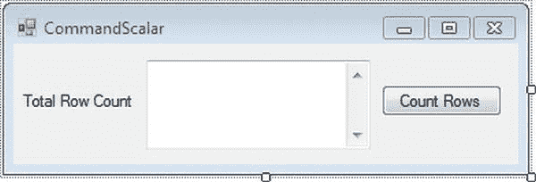

    ***图 13-3。**命令缩放表单的设计视图*

7.  Double-click the Button control; it will open the code editor window, showing the `btnRowCount_Click` event. Place the code into the `click` event code template so it looks like [Listing 13-2](#list_13_2).

    ***清单 13-2。**`CommandScalar.cs`T5】*

    `using System.Data.SqlClient;
           private void btnRowCount_Click(object sender, EventArgs e)
            {
                // Create connection
                SqlConnection conn = new SqlConnection(@"server = .\sql2012;
                                integrated security = true; database = AdventureWorks");

                // Create Scalar query
                string sql = @"select count(*)
                          from Production.Product";

                // Create command
                SqlCommand cmd = new SqlCommand(sql, conn);
                txtScalar.AppendText("Command created and connected.\n");

                try
                {
                    // Open connection
                    conn.Open();

                    txtScalar.AppendText("Number of Product is :");

                    // Execute Scalar query with ExecuteScalar method
                    txtScalar.AppendText(cmd.ExecuteScalar().ToString());
                    txtScalar.AppendText("\n");
                }

                catch (SqlException ex)
                {
                    MessageBox.Show(ex.ToString());
                }

                finally
                {
                    conn.Close();
                    txtScalar.AppendText("Connection Closed.");
                }
            }`
8.  To set the CommandScalar form as the start-up form, modify the `Program.cs` statement: `Application.Run(new CommandText ());`

    表现为:

    `Application.Run(new CommandScalar());`

    构建项目，并通过按 Ctrl+F5 运行它。

9.  When the form loads, click the button Count Rows. The result should look like [Figure 13-4](#fig_13_4). 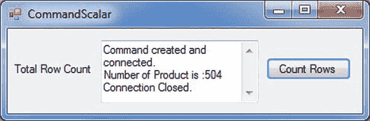

    ***图 13-4。**执行标量命令*

##### 它是如何工作的

您所做的就是在对 TextBox 的`AppendText`方法的调用中添加对`ExecuteScalar()`的调用:

`                 txtScalar.AppendText("Number of Product is :");

                // Execute Scalar query with ExecuteScalar method
                txtScalar.AppendText(cmd.ExecuteScalar().ToString());`

`ExecuteScalar()`获取`CommandText`属性，并使用命令的`Connection`属性将其发送到数据库。它将结果作为单个对象返回，您可以用 TextBox 的`AppendText`方法显示该对象。

`ExecuteScalar()`方法的返回类型是`object`，它是。NET Framework，当您记住数据库可以保存任何类型的数据时，这是非常有意义的。所以，如果你想把返回的对象赋给一个特定类型的变量(例如 T2)，你必须把对象转换成特定的类型。如果类型不兼容，系统将生成一个运行时错误，指示无效的强制转换。

下面是一个演示这一思想的例子。在其中，您将来自`ExecuteScalar()`的结果存储在变量`count`中，并将其转换为特定的类型`int`。

`int count = (int) cmd.ExecuteScalar();
txtScalar.AppendText ("Number of Products is: "+ count);`

如果你确定结果的类型总是一个`int`(与`COUNT(*)`的安全赌注)，那么前面的代码是安全的。但是，如果您将`int`保留在原位，并将命令的`CommandText`更改为以下内容:

`select Name
from Production.Product
where ProductNumber='BA-8327'`

然后`ExecuteScalar()`将返回字符串“`Bearing Ball`”而不是一个整数，您将得到这个异常:

`Unhandled Exception: System.InvalidCastException:
Specified cast is not valid.`

因为你不能把一个`string`投射到一个`int`。

如果一个查询实际上返回了多行，而您认为它只会返回一行，那么可能会出现另一个问题。在这种情况下，`ExecuteScalar( )`只返回结果的第一行，忽略其余的行。如果你使用`ExecuteScalar( )`，确保你不仅期望而且实际上得到一个返回值。

#### 执行有多个结果的命令

对于希望返回多行和多列的查询，使用命令的`ExecuteReader()`方法。

`ExecuteReader()`返回一个数据读取器，这是一个`SqlDataReader`类的实例，我们将在下一章学习。数据读取器具有允许您读取结果集中的连续行并检索单个列值的方法。

我们将把数据读取器的细节留到下一章，但是为了便于比较，我们将在这里给出一个简单的例子，使用`ExecuteReader()`方法从一个命令创建一个`SqlDataReader`来显示查询结果。

##### 试试看:使用 ExecuteReader 方法

要使用`ExecuteReader`方法，请遵循以下步骤:

1.  选择 ADO。NET_Command 项目，右击，选择【添加 T2】窗口窗体。从打开的对话框中，确保选择了 Windows 窗体，并将`Form1.cs`重命名为`CommandReader.cs`。单击“确定”将该表单添加到 ADO。NET_Command 项目。
2.  通过单击窗体的标题栏选择 CommandReader 窗体，并将 Size 属性的宽度设置为 455，高度设置为 283。
3.  将 TextBox 控件拖动到窗体上。选择此 TextBox 控件，导航到“属性”窗口，并设置以下属性:
    *   将 Name 属性设置为 txtReader。
    *   将位置属性的 X 设置为 12，Y 设置为 12。
    *   将 Multiline 属性设置为 True。
    *   将 ScrollBars 属性设置为垂直。
    *   将 Size 属性的宽度设置为 415，高度设置为 223。
    *   将文本属性留空。
4.  Now your CommandReader form in the Design view should like [Figure 13-5](#fig_13_5). 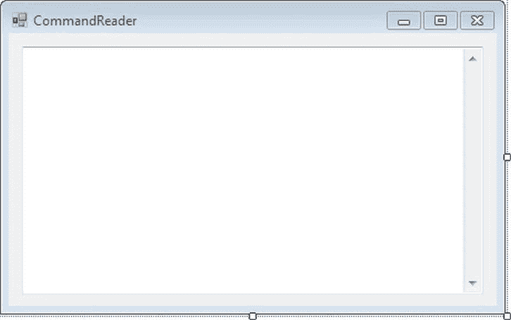

    ***图 13-5。**命令阅读器表单的设计视图*

5.  Now double-click the empty surface of the `CommandReader.cs` form, and it will open the code editor window, showing the `CommandReader_Load` event. Modify the `CommandReader_Load` event to look like [Listing 13-3](#list_13_3).

    ***清单 13-3。**T4`CommandReader.cs`*

    `Using System.Data.SqlClient;

             private void CommandReader_Load(object sender, EventArgs e)
            {
                // Create connection
                SqlConnection conn = new SqlConnection(@"
                                     server = .\sql2012;
                                     integrated security = true;
                                     database = AdventureWorks");

                // Create command
                string sql = @"select Name,ProductNumber
                              from Production.Product";

                SqlCommand cmd = new SqlCommand(sql, conn);
                txtReader.AppendText("Command created and connected.\n\n");

                try
                {
                    // Open connection
                    conn.Open();` `                // Execute query via ExecuteReader
                    SqlDataReader rdr = cmd.ExecuteReader();

                    while (rdr.Read())
                    {
                        txtReader.AppendText("\nProduct: ");
                        txtReader.AppendText(rdr.GetValue(1) + "\t\t" + rdr.GetValue(0));
                        txtReader.AppendText("\n");
                    }
                }

                catch (SqlException ex)
                {
                    MessageBox.Show(ex.Message + ex.StackTrace, "Exception Details");
                }

                finally
                {
                    conn.Close();
                    txtReader.AppendText("Connection Closed.");
                }
            }`
6.  To set the CommandReader form as the start-up form, modify the `Program.cs` statement: `Application.Run(new CommandScalar ());`

    表现为:

    `Application.Run(new CommandReader());`

    构建项目，并通过按 Ctrl+F5 运行它。

7.  When the form loads, the result should look like [Figure 13-6](#fig_13_6). 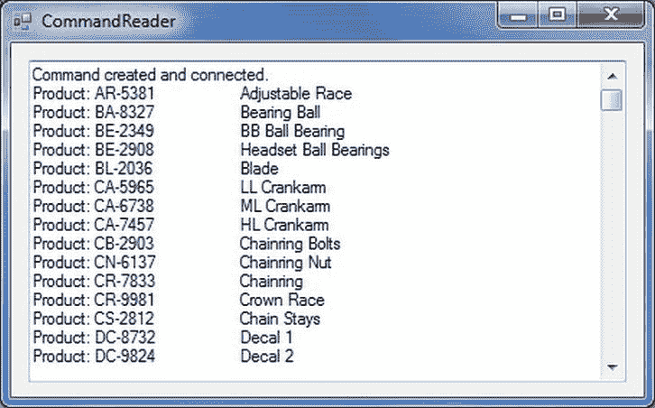

    ***图 13-6。**使用数据阅读器*

##### 它是如何工作的

在本例中，您使用`ExecuteReader()`方法检索并输出生产中所有产品的名称和产品编号值。产品表。与`ExecuteScalar()`一样，`ExecuteReader()`获取`CommandText`属性，并使用来自`Connection`属性的连接将其发送到数据库。

当您使用`ExecuteScalar`方法时，您只产生一个标量值。相反，使用`ExecuteReader()`会返回一个`SqlDataReader`对象。

`// execute query
SqlDataReader rdr = cmd.ExecuteReader();
while (rdr.Read())
 {
       txtReader.AppendText(rdr.GetValue(1) + "\t\t" + rdr.GetValue(0));
}`

`SqlDataReader`对象有一个依次获取每一行的`Read()`方法和一个获取行中某一列的值的`GetValue`方法。它检索其值的特定列由指示该列索引的整数参数给出。注意`GetValue`使用的是从零开始的索引，所以第一列是第 0 列，第二列是第 1 列，依此类推。由于查询要求两列，Name 和 ProductNumber，所以在这个查询结果中这两列编号为 0 和 1。

#### 执行非查询语句

`ExecuteNonQuery`是用于执行由 DML 语句组成的 SQL 语句的方法。这些语句由 SQL Server 的`INSERT`、`UPDATE`和`DELETE`功能组成。因此，`ExecuteNonQuery()`用于向命令提供 DML 语句并执行它。正如您在前面的章节中可能已经注意到的那样，`INSERT`、`UPDATE`和`DELETE`语句不会返回任何记录。现在让我们看看`ExecuteNonQuery( )`方法如何处理这样的 SQL 查询。

##### 尝试一下:使用 ExecuteNonQuery 方法

要使用`ExecuteNonOuery`方法，请遵循以下步骤:

1.  选择 ADO。NET_Command 项目，右击，选择【添加 T2】窗口窗体。从打开的对话框中，确保选择了 Windows 窗体，并将`Form1.cs`重命名为`CommandNonQuery.cs`。单击“确定”将该表单添加到 ADO。NET_Command 项目。
2.  通过单击窗体的标题栏选择 CommandNonQuery 窗体，并将 Size 属性的宽度设置为 297，高度设置为 277。
3.  将 GroupBox 控件拖到窗体上，并将其放在窗体的左侧。选择 GroupBox 控件，导航到“属性”窗口，并设置以下属性:
    *   将 Name 属性设置为 gbInsertCurrency。
    *   将位置属性的 X 设置为 21，Y 设置为 22。
    *   将 Size 属性的宽度设置为 240，高度设置为 201。
    *   将 Text 属性设置为插入货币。
4.  将 Label 控件拖到名为 gbInsertCurrency 的 GroupBox 中，并将其放在 GroupBox 的左侧。选择此标签控件，导航到“属性”窗口，并设置以下属性:
    *   将 Name 属性设置为 lblCurrencyCode。
    *   将位置属性的 X 设置为 16，Y 设置为 30。
    *   将 Size 属性的宽度设置为 77，高度设置为 13。
    *   将 Text 属性设置为货币代码。
5.  将一个 TextBox 控件拖到窗体上，并将其放置在名为 Currency Code 的 Label 控件旁边。选择此 TextBox 控件，导航到“属性”窗口，并设置以下属性:
    *   将 Name 属性设置为 txtCurrencyCode。
    *   将位置属性的 X 设置为 99，Y 设置为 30。
    *   将 Size 属性的宽度设置为 128，高度设置为 20。
    *   将文本属性留空。
6.  将另一个 Label 控件拖动到名为 gbInsertCurrency 的 GroupBox 中，并将其放置在货币代码标签的下方，靠近 GroupBox 的左侧。选择此标签控件，导航到“属性”窗口，并设置以下属性:
    *   将 Name 属性设置为 lblName。
    *   将位置属性的 X 设置为 19，Y 设置为 64。
    *   将 Size 属性的宽度设置为 35，高度设置为 13。
    *   将 Text 属性设置为 Name。
7.  将 TextBox 控件拖到窗体上，并将其放置在名为 Name 的 Label 控件旁边。选择此 TextBox 控件，导航到“属性”窗口，并设置以下属性:
    *   将 Name 属性设置为 txtName。
    *   将位置属性的 X 设置为 99，Y 设置为 64。
    *   将 Size 属性的宽度设置为 128，高度设置为 20。
    *   将文本属性留空。
8.  Right now your CommandNonQuery form in the Design view should look like [Figure 13-7](#fig_13_7). 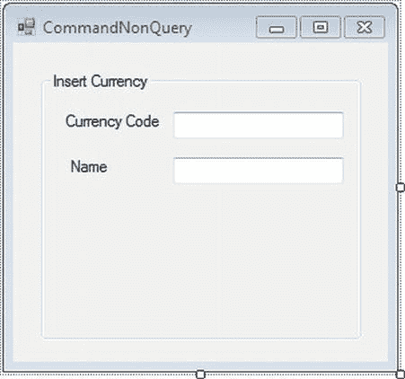

    ***图 13-7。**command non query 表单的设计视图*

9.  继续设计表单，将另一个名为 gbInsertCurrency 的 Label 控件拖动到 GroupBox 上，并将其放置在 GroupBox 左侧的 Name 标签下方。选择此标签控件，导航到“属性”窗口，并设置以下属性:
    *   将 Name 属性设置为 lblModifiedDate。
    *   将位置属性的 X 设置为 19，Y 设置为 97。
    *   将 Size 属性的宽度设置为 73，高度设置为 13。
    *   将 Text 属性设置为 Modified Date。
10.  将一个 DateTimePicker 控件拖到窗体上，并将其放在修改后的日期标签控件旁边。选择此 DateTimePicker 控件，导航到“属性”窗口，并设置以下属性:
    *   将 Name 属性设置为 dtpModifiedDate。
    *   将 Format 属性设置为 Short。
    *   将位置属性的 X 设置为 99，Y 设置为 97。
    *   将 Size 属性的宽度设置为 128，高度设置为 20。
11.  将 Button 控件拖到名为 gbInsertCurrency 的 GroupBox 中，并将其放置在 Label 和 TextBox 控件的下方。选择此按钮控件，导航到“属性”窗口，并设置以下属性:
    *   将 Name 属性设置为 btnInsertCurrency。
    *   将位置属性的 X 设置为 56，Y 设置为 133。
    *   将 Size 属性的宽度设置为 128，高度设置为 23。
    *   将 Text 属性设置为插入货币。
12.  将另一个 Label 控件拖动到名为 gbInsertCurrency 的 GroupBox 中，并将其放置在“插入货币”按钮的下方。选择此标签控件，导航到“属性”窗口，并设置以下属性:
    *   将 Name 属性设置为 lblInsertStatus。
    *   将 AutoSize 属性设置为 False。
    *   将位置属性的 X 设置为 22，Y 设置为 168。
    *   将 Size 属性的宽度设置为 205，高度设置为 21。
13.  现在你在设计视图中的 CommandNonQuery 表单应该类似于[图 13-8](#fig_13_8) 。
14.  Double-click the Insert Currency button, and it will open the code editor window, showing the `btnInsertCurrency_Click` event. Modify the `btnInsertCurrency_Click` event to look like [Listing 13-4](#list_13_4). 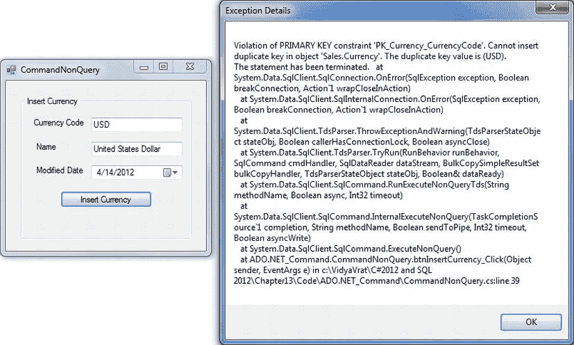

    ***图 13-8。**命令非查询表单的设计视图*

    ***清单 13-4。**T4`CommandNonOuery.cs`*

    `Using System.Data.SqlClient;

            private void btnInsertCurrency_Click(object sender, EventArgs e)
            {
                // Create connection
                SqlConnection conn = new SqlConnection(@"server = .\sql2012;
                                               integrated security = true;
                                               database = AdventureWorks");

                // Insert Query
                string sqlIns = "Insert Into Sales.Currency(CurrencyCode,Name,ModifiedDate)" +
                            "Values(" + "'" + txtCurrencyCode.Text + "','" +
                             txtName.Text + "','" + dtpModifiedDate.Value.ToString() + "')";

                // Create command
                SqlCommand cmd = new SqlCommand(sqlIns, conn);

                try
                {
                    // Open connection
                    conn.Open();` `                cmd.ExecuteNonQuery();

                    lblInsertStatus.Text = "New Currency Added Successfully!!";

                }

                catch (SqlException ex)
                {
                    MessageBox.Show(ex.Message + ex.StackTrace, "Exception Details");
                }

                finally
                {
                    conn.Close();
                }
            }`
15.  To set the CommandReader form as the start-up form, modify the `Program.cs` statement: `Application.Run(new CommandReader ());`

    表现为:

    `Application.Run(new CommandNonQuery());`

    构建项目，并通过按 Ctrl+F5 运行它。

16.  When the form loads and you are ready to enter currency details, you need to be careful because the table Sales.Currency used in the exercise has the column CurrencyCode defined as a primary key. Hence, if you try entering a currency that might already exist in the table (which will be the case when you try entering most of the well-known currencies), then you will get a primary key violation. For example, when you try to enter **USD** as the currency code, the moment you click the button Insert Currency, an exception occurs, as shown in [Figure 13-9](#fig_13_9). 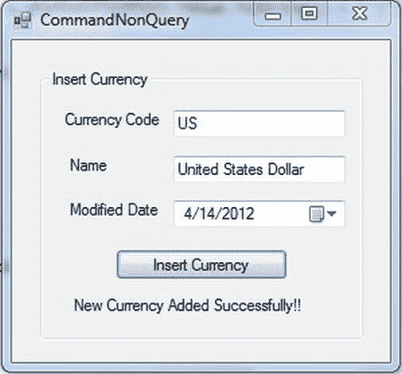

    ***图 13-9。**插入显示主键冲突的语句*

17.  Trying a successful entry in the table will become a possibility only when you enter a unique key, in other words, a CurrencyCode that doesn’t exist. To access the form again, click OK in the Exception dialog. Modify the Currency Code USD to US (I know this is not a real currency code, but for the sake of our example, it’s worth trying), and click Insert Currency button. You will see a successful insertion, as shown in [Figure 13-10](#fig_13_10). 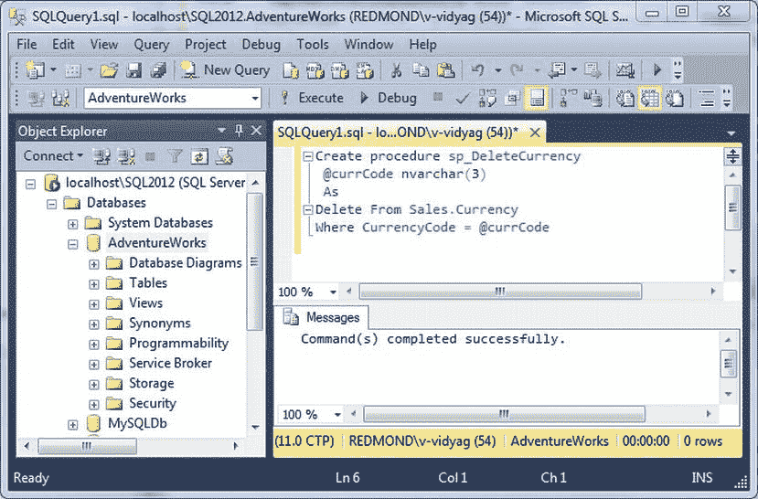

    ***图 13-10。**成功插入货币*

##### 它是如何工作的

在这个程序中，您使用一个非查询将货币插入到销售额中。货币表。正如您在 CommandNonQuery 表单的设计视图中看到的，我们有两个 TextBox 控件和一个 DateTimePicker 控件，因此在这些控件中输入的值将通过 SqlCommand 对象提供给 SQL 表。因此，`INSERT`查询将如下所示:

`// Insert Query
            string sqlIns = "Insert Into Sales.Currency(CurrencyCode,Name,ModifiedDate)" +
                          "Values(" + "'" + txtCurrencyCode.Text + "','" +
                          txtName.Text + "','" + dtpModifiedDate.Value.ToString() + "')";`

然后创建一个封装了`INSERT`查询的命令。

`            // Create command
            SqlCommand cmd = new SqlCommand(sqlIns, conn);
  // Execute the SQL statements with a call to the following:
      cmd.ExecuteNonQuery();
ExecuteNonOuery() executes the INSERT statement, and if executed successfully, it will show
the success message in the lblResultStatus control.
           lblInsertStatus.Text = "New Currency Added Successfully!!";`

 **注意**使用`ExecuteNonOuery()`，您几乎可以提交任何 SQL 语句，包括数据定义语言(DDL)语句，来创建和删除数据库对象，如表和索引。但是在工业界，开发人员最常用的是插入、更新和删除行。

正如您到目前为止所看到的，所有执行任务的 SQL 语句，如`SELECT`、`INSERT`、`UPDATE`或`DELETE`，都被硬编码到 C# 代码中。但大多数时候，开发人员编写存储过程来执行 SQL 操作；存储过程就像函数一样工作，可以接受参数来执行任务。存储过程的优势之一是在 SQL Server 级别创建了一个统一的 SQL 语句，因为您的 ADO.NET 代码只是调用它。

### 使用存储过程

正如您在第 6 章中所学的，存储过程是允许您重复执行某项任务的 SQL 语句的集合。建议使用存储过程，而不是在 C# 代码中硬编码 SQL 语句，因为它利用了 SQL Server 的编译并提供了基于性能的重用。存储过程只是替换执行插入、更新和删除等操作的硬编码代码。

#### 创建存储过程来执行删除操作

在前面的 CommandNonQuery 练习中，您看到了 Sales 上的插入操作。`AdventureWorks2008`数据库的货币表。现在让我们在同一个表上做一个删除操作，但是通过一个存储过程。

##### 试试看:创建一个与 C# 一起使用的存储过程

让我们使用 SQL Server Management Studio 创建一个存储过程，该存储过程将 CurrencyCode 值作为参数，从销售中删除一种货币。`AdventureWorks`数据库中的货币表。它只需要一个输入参数。

1.  打开 SQL Server Management Studio。在“连接到服务器”对话框中，选择 localhost\ <your sql="" server="" name="">作为服务器名称，然后单击“连接”。</your>
2.  在对象资源管理器中，展开“数据库”节点，选择 AdventureWorks 数据库，然后单击“新建查询”窗口。输入以下查询，然后单击执行。您应该会看到如图 13-11 所示的结果。`         Create procedure sp_DeleteCurrency
              @currCode nvarchar(3)
             As
               Delete From Sales.Currency
               Where CurrencyCode = @currCode`

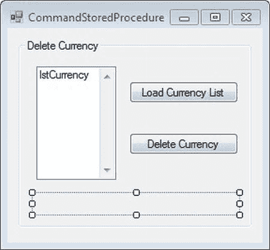

***图 13-11。**创建存储过程删除货币*

##### 它是如何工作的

`CREATE PROCEDURE`语句创建了一个有一个输入参数的存储过程。参数在过程名和`AS`关键字之间指定。这里您只指定了参数名和数据类型，所以默认情况下它是一个输入参数。参数名以`@`开头。

`                 Create procedure sp_DeleteCurrency
                  @currCode nvarchar(3)
                 As
                   Delete From Sales.Currency`

该参数用在查询的`WHERE`子句中。

`                   Where CurrencyCode = @currCode`

##### 试试看:使用带有 ExecuteNonQuery 方法的存储过程

要使用`ExecuteNonQuery`方法，请遵循以下步骤:

1.  选择 ADO。NET_Command 项目，右击，选择【添加 T2】窗口窗体。从打开的对话框中，确保选择了 Windows 窗体，并将`Form1.cs`重命名为`CommandStoredProcedure.cs`。单击“确定”将该表单添加到 ADO。NET_Command 项目。
2.  通过单击窗体的标题栏选择 CommandStoredProcedure 窗体，并将 Size 属性的宽度设置为 288，高度设置为 267。
3.  将一个 GroupBox 控件拖到窗体上，并将其放在窗体的左侧。选择 GroupBox 控件，导航到“属性”窗口，并设置以下属性:
    *   将 Name 属性设置为 gbDeleteCurrency。
    *   将位置属性的 X 设置为 12，Y 设置为 12。
    *   将 Size 属性的宽度设置为 248，高度设置为 201。
    *   将 Text 属性设置为删除货币。
4.  将一个 ListBox 控件拖到名为 gbDeleteCurrency 的 GroupBox 中，并将其放在 GroupBox 的左侧。选择此列表框控件，导航到“属性”窗口，并设置以下属性:
    *   将 Name 属性设置为 lblCurrencyCode。
    *   将位置属性的 X 设置为 19，Y 设置为 29。
    *   将 Size 属性的宽度设置为 85，高度设置为 121。
5.  将 Button 控件拖动到名为 gbLoadCurrency 的 GroupBox 上，并将其放置在 ListBox 控件的右侧。选择此按钮控件，导航到“属性”窗口，并设置以下属性:
    *   将 Name 属性设置为 btnLoadCurrency。
    *   将位置属性的 X 设置为 118，Y 设置为 45。
    *   将 Size 属性的宽度设置为 116，高度设置为 23。
    *   设置 Text 属性以加载货币列表。
6.  拖动 btnLoadCurrency 正下方的另一个 Button 控件。选择此按钮控件，导航到“属性”窗口，并设置以下属性:
    *   将 Name 属性设置为 btnDeleteCurrency。
    *   将位置属性的 X 设置为 118，Y 设置为 100。
    *   将 Size 属性的宽度设置为 116，高度设置为 23。
    *   将 Text 属性设置为删除货币。
7.  将 Label 控件拖到名为 gbDeleteCurrency 的 GroupBox 中，并将其放置在 lstCurrency ListBox 的下方。选择此标签控件，导航到“属性”窗口，并设置以下属性:
    *   将 Name 属性设置为 lblDeleteStatus。
    *   将 AutoSize 属性设置为 False。
    *   将位置属性的 X 设置为 16，Y 设置为 165。
    *   将 Size 属性的宽度设置为 218，高度设置为 21。
    *   将“文本”属性留空。
8.  Now your CommandStoredProcedure form in the Design view should like [Figure 13-12](#fig_13_12). 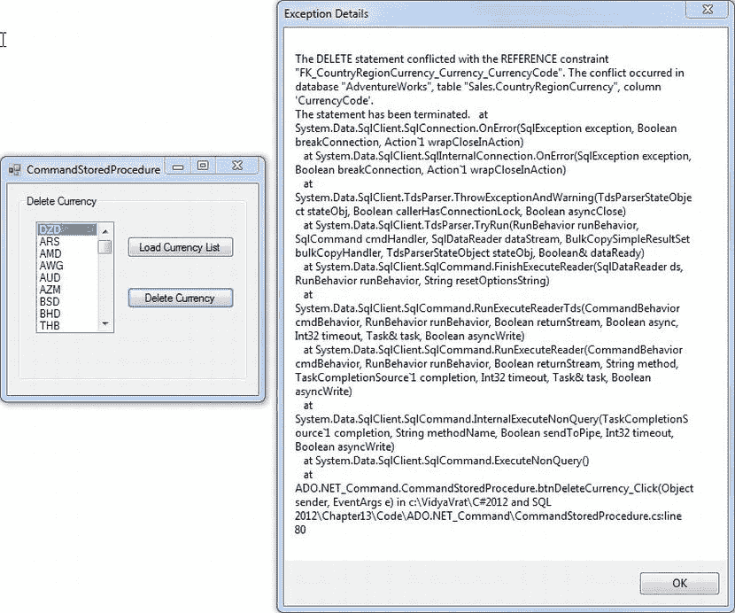

    ***图 13-12。**命令存储过程表单的设计视图*

9.  Double-click the Load Currency List button, and it will open the code editior window, showing the `btnLoadCurrency_Click` event. Modify the `btnLoadCurrency_Click` event to look like [Listing 13-5](#list_13_5).

    ***清单 13-5。**T4`CommandStoredProcedure.cs`*

    `Using System.Data.SqlClient;
            private void btnLoadCurrency_Click(object sender, EventArgs e)
            {
                // Create connection
                SqlConnection conn = new SqlConnection(@"server = .\sql2012;
                                               integrated security = true;` `                                           database = AdventureWorks");

                // Select query
                string sqlSelect = @"select CurrencyCode
                                from Sales.Currency";

                SqlCommand cmd = new SqlCommand(sqlSelect, conn);

                try
                {
                    // Open connection
                    conn.Open();
                    // Execute query via ExecuteReader
                    SqlDataReader rdr = cmd.ExecuteReader();

                    while (rdr.Read())
                    {
                        lstCurrency.Items.Add(rdr[0]);
                    }
                }

                catch (SqlException ex)
                {
                    MessageBox.Show(ex.Message + ex.StackTrace, "Exception Details");
                }
                finally
                {
                    conn.Close();
                }
            }`
10.  Now it’s time to add functionality for the Delete Currency button. Double-click the Delete Currency button, and it will open the code editior window, showing the `btndeleteCurrency_Click` event. Modify the `btnDeleteCurrency_Click` event to look like [Listing 13-6](#list_13_6).

    ***清单 13-6。**T4`CommandStoredProcedure.cs`*

    `private void btnDeleteCurrency_Click(object sender, EventArgs e)
            {
                // Create connection
                SqlConnection conn = new SqlConnection(@"server = .\sql2012;
                                                integrated security = true;
                                                database = AdventureWorks");

                // Create command object with Stored Procedure name
                SqlCommand cmd = new SqlCommand("sp_DeleteCurrency", conn);

                //Set command object for Stored Procedure execution
                cmd.CommandType = CommandType.StoredProcedure;` `            cmd.Parameters.Add(new SqlParameter("currCode", SqlDbType.NVarChar, 3));
                cmd.Parameters["currCode"].Value = lstCurrency.SelectedItem.ToString();
                try
                {
                    // Open connection
                    conn.Open();
                    // Delete Query            
                    if (lstCurrency.SelectedIndex == -1)
                    {
                        MessageBox.Show("Please Select a Currency before performing Delete
    action",
                                       "Information");
                    }
                    else
                    {
                        cmd.ExecuteNonQuery();
                        lblDeleteStatus.Text = "Currency is Deleted Successfully!!";
                    }

                }
                catch (SqlException ex)
                {
                    MessageBox.Show(ex.Message + ex.StackTrace, "Exception Details");
                }

                catch (NullReferenceException ex)
                {
                  MessageBox.Show("Load the Currency List first" + ex.StackTrace, "Exception
                                 Details");
                }

                finally
                {
                    conn.Close();
                }
            }`
11.  To set the CommandStoredProcedure form as the start-up form, modify the `Program.cs` statement. `Application.Run(new CommandNonQuery ());`

    表现为:

    `Application.Run(new CommandStoredProcedure());`

    构建项目，并通过按 Ctrl+F5 运行它。

12.  当窗体加载时，首先单击名为“加载货币列表”的按钮控件；这将从销售中加载货币。货币表。
13.  Now, select a currency (the one that you have *not* added), and click the Delete Currency button. As you may remember, the Sales.Currency table uses CurrencyCode as a primary key, so this key column is referenced by the Sales.CountryRegionCurrency table, and so a reference constraint–related exception will occur, as shown in [Figure 13-13](#fig_13_13). 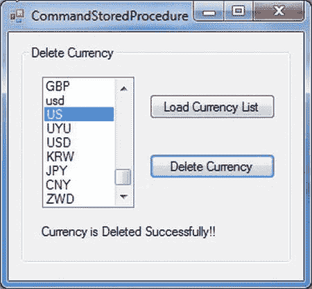

    ***图 13-13。**删除显示引用约束冲突的语句*

14.  Click OK. As you have seen, you can’t delete the currencies that have referenced entries in the Sales.CountryCurrencyRegion table. Hence, you can only delete the entry that is not related to this referencing table. In the CommandNonQuery exercise, you inserted a CurrencyCode called US, as shown in [Figure 13-9](#fig_13_9). Scroll the currency list until you see US, and then click the Delete Currency button. You will see the successful deletion of the currency, as shown in [Figure 13-14](#fig_13_14). 

    ***图 13-14。**成功删除货币*

15.  如果您再次点击加载货币列表，您会看到货币代码 US 并未列出，因为它已被删除。

##### 它是如何工作的

在这个程序中，您使用一个存储过程从销售中删除货币。货币表。正如您在 CommandStoredProcedure 窗体的设计视图中所看到的，您有一个 ListBox 和两个 Button 控件。在列表框中选择的值将被传递给一个存储过程，该存储过程有一个删除查询。因此，通过以下语句为将值传递给存储过程做准备:

`                 // Create command object with Stored Procedure name
                 SqlCommand cmd = new SqlCommand("sp_DeleteCurrency", conn);

                //Set command object for Stored Procedure execution
                cmd.CommandType = CommandType.StoredProcedure;`

一旦指定了命令对象将使用存储过程，就该准备存储过程执行所需的参数了。

`                cmd.Parameters.Add(new SqlParameter("currCode", SqlDbType.NVarChar, 3));`

如您所见，我们希望 ListBox 的选择被删除，所以我们将数据作为`ListBox.SelectedItem`传递给存储过程参数。

`                cmd.Parameters["currCode"].Value = lstCurrency.SelectedItem.ToString();`

一旦参数准备好了，我们就打开连接并使用`ExecuteNonQuery`执行存储过程。

`                // Open connection
                conn.Open();

                // Execute command associated with StoredProcedure
          cmd.ExecuteNonQuery();`

### 总结

在本章中，我介绍了什么是 ADO.NET 命令以及如何创建一个`Command`对象。我还讨论了将命令与连接相关联、设置命令文本以及使用`ExecuteScalar()`、`ExecuteReader()`和`ExecuteNonOuery()`语句。您还了解了如何在 C# 代码中使用存储过程来执行 DML 操作。在下一章，你将会看到数据阅读器。