# 十四、使用数据读取器

在第 13 章中，您使用数据读取器从多行结果集中检索数据。在本章中，我们将更详细地了解数据读取器。您将看到它们是如何使用的，以及它们在 ADO.NET 编程中的重要性。

在本章中，我们将介绍以下内容:

> *   Understand the general situation of data readers.
> *   Get data about data
> *   Get data about the table
> *   Using a data reader using multiple result sets

### 从总体上了解数据阅读器

在连接和命令之后，数据提供者的第三个组件是*数据读取器。*一旦连接到数据库并进行查询，就需要某种方法来访问结果集。这就是数据读取器的用武之地。

数据读取器是实现`System.Data.IDataReader`接口的对象。数据读取器是一个快速、无缓冲、只进、只读的*连接的*流，它以每行为基础检索数据。它在结果集中循环时一次读取一行。

不能直接实例化数据读取器；相反，您可以使用命令的`ExecuteReader`方法创建一个。例如，假设`cmd`是一个查询的`SqlClient`命令对象，下面介绍如何创建一个`SqlClient`数据读取器:

`SqlDataReader rdr = cmd.ExecuteReader();`

现在，您可以使用这个数据读取器来访问查询的结果集。

 **提示**我们将在下一章进一步讨论的一点是选择数据读取器还是数据集。一般规则是总是使用数据读取器来简单地检索数据。如果你需要做的只是显示数据，那么在大多数情况下你需要使用的就是数据阅读器。

我们将通过几个例子演示基本的数据读取器用法。第一个例子是最基本的；它只是使用一个数据读取器来遍历结果集。

假设您已经成功地与数据库建立了连接，执行了一个查询，一切似乎都很顺利——现在该怎么办？下一个明智的做法是检索行并处理它们。

##### 试试看:遍历一个结果集

下面的 Windows 应用展示了如何使用`SqlDataReader`遍历结果集并检索行:

1.  创建一个名为 [Chapter14](14.html) 的新 Windows 窗体应用项目。当解决方案资源管理器打开时，保存解决方案。
2.  将 [Chapter14](14.html) 项目重命名为 DataReader。将 Form1.cs 文件重命名为 DataLooper.cs。
3.  通过单击窗体的标题栏选择 DataLooper 窗体，并将 Size 属性的宽度设置为 346，高度设置为 476。
4.  将 ListBox 控件拖到窗体上，并将其放在窗体的中央。选择此列表框，导航到“属性”窗口，并设置以下属性:
    *   将 Name 属性设置为 lbxProduct。
    *   将位置属性的 X 设置为 21，Y 设置为 22。
    *   将 Size 属性的宽度设置为 281，高度设置为 394。
5.  Now your DataLooper form in the Design view should like [Figure 14-1](#fig_14_1). 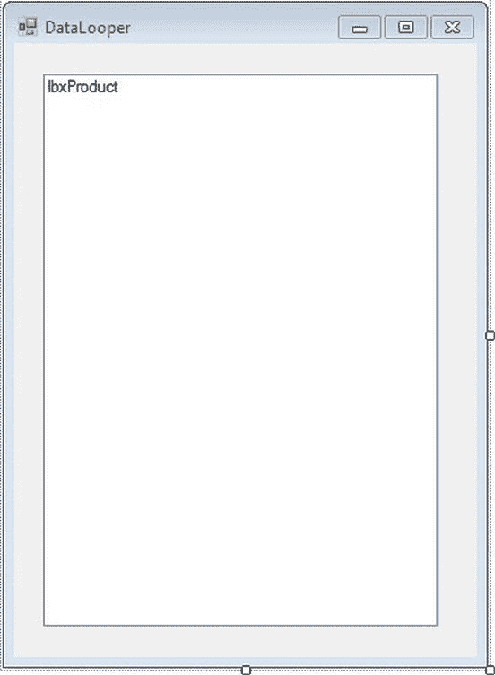

    ***图 14-1。**数据活套表单的设计视图*

6.  Double-click the empty surface of the DataLooper.cs form, and it will open the code editor window, showing the DataLooper_Load event. Modify the DataLooper_Load event to look like [Listing 14-1](#list_14_1).

    ***清单 14-1。**T4`DataLooper.cs`*

    `Using System.Data.SqlClient;

            private void DataLooper_Load(object sender, EventArgs e)
            {
                // Connection string
                string connString = @"server=.\sql2012;database=AdventureWorks;
                                       Integrated Security=SSPI";

                // Query
                string sql = @"select Name from Production.Product";` `            // Create connection
                SqlConnection conn = new SqlConnection(connString);

                try
                {
                    // Open connection
                    conn.Open();

                    // Create command
                    SqlCommand cmd = new SqlCommand(sql, conn);

                    // Create data reader
                    SqlDataReader rdr = cmd.ExecuteReader();

                    // Loop through result set
                    while (rdr.Read())
                    {
                        // Add to listbox - one row at a time
                        lbxProduct.Items.Add(rdr[0]);
                    }

                    // Close data reader
                    rdr.Close();
                }

                catch (SqlException ex)
                {
                    MessageBox.Show(ex.Message + ex.StackTrace);
                }

                finally
                {
                    conn.Close();
                }
         }`
7.  Build the project, and run the DataLooper form by pressing Ctrl+F5\. Your results should look like [Figure 14-2](#fig_14_2). 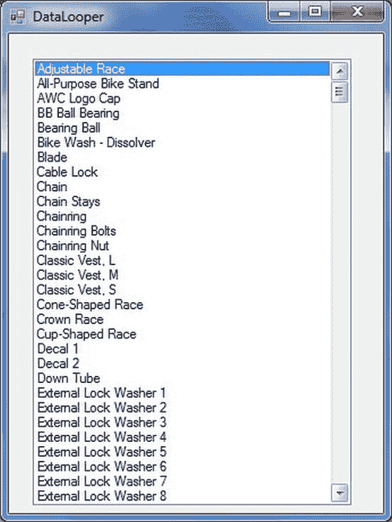

    ***图 14-2。**使用`DataReader`* 循环结果集

##### 它是如何工作的

`SqlDataReader`是抽象类，不能显式实例化。出于这个原因，您通过执行`SqlCommand`的`ExecuteReader`方法来获得一个`SqlDataReader`的实例。

`// Create data reader
SqlDataReader rdr = cmd.ExecuteReader();`

`ExecuteReader()`不仅仅是创建一个数据阅读器；它将 SQL 发送到连接以供执行，因此当它返回时，您可以遍历结果集的每一行并逐列检索值。为此，您调用`SqlDataReader`的`Read`方法，如果有一行可用，该方法将返回`true`，并使*光标前进*(指向结果集中下一行的内部指针)，如果另一行不可用，该方法将返回`false`。由于`Read()`将光标移动到下一个可用行，您必须为结果集中的所有行调用它，所以您在`while`循环中调用它作为条件。

`// Loop through result set
while (rdr.Read())
{
       // Add to listbox - one row at a time
       lbxProduct.Items.Add(rdr[0]);
}`

一旦调用了`Read`方法，下一行将作为集合返回并存储在`SqlDataReader`对象中。要访问特定列中的数据，可以使用许多方法(我们将在下一节中介绍这些方法)，但是对于这个应用，您使用序号索引器查找方法，将列号提供给读取器以检索值(就像您为数组指定索引一样)。因为在这种情况下，您在查询数据库时从 Customers 表中选择了一个单独的列，所以只有“zeroth”索引器是可访问的，所以您将该索引硬编码为`rdr[0]`。

为了将*连接*用于其他目的或者在数据库上运行另一个查询，调用`SqlDataReader`的`Close`方法来显式关闭阅读器是很重要的。一旦读取器被连接到活动连接，该连接就保持忙于为读取器获取数据，并且保持不可用于其他用途，直到读取器被从其分离。这就是为什么您在`try`块中关闭阅读器，而不是在`finally`块中(即使这个简单的程序不需要将连接用于其他目的)。

`// Close data reader
rdr.Close();`

#### 使用序数索引器

使用序号索引器从结果集中检索列数据。让我们了解更多关于序数索引。以下代码:

`rdr[0]`

是对数据读取器的`Item`属性的引用，并返回为当前行指定的列中的值。该值作为对象返回。

##### 试试看:使用序数索引器

在此示例中，您将向 DataReader 项目添加一个 Windows 窗体，然后您将使用一个序号索引器。

1.  选择 DataReader 项目，右键单击，然后选择“添加 Windows 窗体”。在打开的对话框中，确保选择了 Windows 窗体，并将 Form1.cs 重命名为 OrdinalIndexer.cs 然后单击“确定”将该窗体添加到 DataReader 项目中。
2.  通过单击窗体的标题栏选择 OrdinalIndexer 窗体，并将 Size 属性的宽度设置为 289，高度设置为 351。
3.  将 TextBox 控件拖到窗体上，并将其放在窗体的中央。选择此 TextBox 控件，导航到“属性”窗口，并设置以下属性:
    *   将 Name 属性设置为 txtValues。
    *   将位置属性的 X 设置为 12，Y 设置为 12。
    *   将 Multiline 属性设为 True。
    *   将 ScrollBars 属性设置为垂直。
    *   将 Size 属性的宽度设置为 249，高度设置为 287。
    *   将文本属性留空。
4.  Now your OrdinalIndexer form in the Design view should like [Figure 14-3](#fig_14_3). 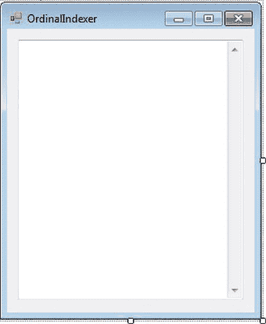

    ***图 14-3。**普通型*设计视图

5.  Double-click the empty surface of the DataLooper.cs form, and it will open the code editor window, showing the DataLooper_Load event. Modify the DataLooper_Load event to look like [Listing 14-2](#list_14_2).

    ***清单 14-2。**T4`0rdinallndexer.cs`*

    `Using System.Data.SqlClient;

             private void OrdinalIndexer_Load(object sender, EventArgs e)
            {
                // Connection string
                string connString = @"server=.\sql2012;database=AdventureWorks;                               Integrated Security=SSPI";` `// Query
                string sql = @" select FirstName,LastName
                                from  Person.Contact
                                where FirstName like 'M%'";

                // Create connection
                SqlConnection conn = new SqlConnection(connString);

                try
                {
                    // Open connection
                    conn.Open();

                    // Create command
                    SqlCommand cmd = new SqlCommand(sql, conn);

                    // Create data reader
                    SqlDataReader rdr = cmd.ExecuteReader();

                    // Print headings
                    StringBuilder sb=new StringBuilder();
                    txtValues.AppendText("First Name".PadRight(25));
                    txtValues.AppendText("Last Name".PadLeft(20));
                    txtValues.AppendText(Environment.NewLine);
                    txtValues.AppendText("-----------------------------------------
                                    --------------------------");
                    txtValues.AppendText(Environment.NewLine);

                    // Loop through result set
                    while (rdr.Read())
                    {
                        txtValues.AppendText(rdr[0].ToString());
                        txtValues.AppendText("\t\t\t");
                        txtValues.AppendText(rdr[1].ToString());
                        txtValues.AppendText(Environment.NewLine);
                    }

                    // Close reader
                    rdr.Close();
                }

                catch (SqlException ex)
                {
                    MessageBox.Show(ex.Message + ex.StackTrace,"Exception Details");
                }

                finally
                {
                    // Close connection
                    conn.Close();
                }` `        }`
6.  To set the OrdinalIndexer form as the start-up form, modify the Program.cs statement: `Application.Run(new DataLooper());`

    表现为:

    `Application.Run(new OrdinalIndexer());`
7.  Build the project, and run it by pressing Ctrl+F5\. You should see the results in [Figure 14-4](#fig_14_4). 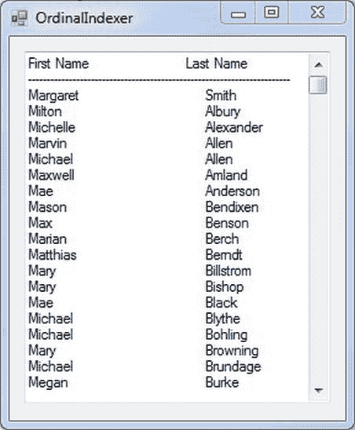

    ***图 14-4。**使用 OrdinalIndexer 显示多列*

##### 它是如何工作的

你询问这个人。FirstName 和 LastName 列的联系人表，其中联系人姓名以字母 *M* 开头。

`            // Query
            string sql = @" select FirstName,LastName
                         from  Person.Contact
                         where FirstName like 'M%'";`

由于查询选择了两列，返回的数据也只包含这两列中的行集合，因此只允许访问两个可能的顺序索引器，即 0 和 1。

出于格式化的目的，我们希望将列标题 FirstName 和 LastName 显示为第一个标题行，然后我们希望将所有其他值行添加到它的下面。因此，您可以使用`PadeRight`和`PadLeft`方法来格式化输出，通过在指定的总长度的左侧/右侧填充空格，使所有字符左右对齐。

`                // Print headings
                StringBuilder sb=new StringBuilder();
                txtValues.AppendText("First Name".PadRight(25));
                txtValues.AppendText("Last Name".PadLeft(20));
                txtValues.AppendText(Environment.NewLine);
                txtValues.AppendText("---------------------------------------------
                                 --------------------");
            txtValues.AppendText(Environment.NewLine);`

现在你在一个`while`循环中读取每一行，用索引器获取两列的值并将这两列追加到文本框中，这样所有的名字都显示为一个列表，如图 14-2 所示。

`                // Loop through result set
                while (rdr.Read())
                {
                    txtValues.AppendText(rdr[0].ToString());
                    txtValues.AppendText("\t\t\t");
                    txtValues.AppendText(rdr[1].ToString());
                    txtValues.AppendText(Environment.NewLine);
                }`

处理完结果集中的所有行后，显式关闭读取器以释放连接。

`                // Close reader
                rdr.Close();`

#### 使用列名索引器

大多数时候，我们并不真正跟踪列号，而更喜欢通过各自的列名来检索值，只是因为通过它们的名称来记住它们要容易得多，这也使得代码更加自文档化。

通过指定列名而不是序号索引号来使用列名索引。这有它的好处。例如，添加或删除一个或多个列可能会更改表，打乱列的顺序，并在使用序号索引器的旧代码中引发异常。使用列名索引器可以避免这个问题，但是顺序索引器更快，因为它们直接引用列，而不是通过名称来查找。

下面的代码片段使用列名索引器检索与上一示例相同的列(FirstName 和 LastName)。

`                // Loop through result set
                while (rdr.Read())
                {
                    txtValues.AppendText(rdr["FirstName"].ToString());                  
                    txtValues.AppendText(rdr["LastName"].ToString());
                }`

用列名索引器替换`OrdinalIndexer.cs`中的序数索引器，重新运行项目；你会得到与[图 14-2](#fig_14_2) 中相同的结果。下一节讨论大多数情况下的更好的方法。

#### 使用类型化访问器方法

当数据读取器从数据源返回值时，将检索结果值并以. NET 类型而不是原始数据源类型存储在本地。这种就地类型转换功能是一致性和速度之间的一种折衷，因此为了对正在检索的数据进行一些控制，数据读取器公开了类型化访问器方法，如果您知道所返回值的特定类型，就可以使用这些方法。

类型化访问器方法都以`Get`开头，采用序号索引进行数据检索，并且是类型安全的；C# 不允许你逃脱不安全的强制转换。这些方法比序号和列名索引器方法都要快。比列名索引更快似乎是合乎逻辑的，因为类型化的访问器方法采用序数进行引用；然而，我们需要解释它为什么比顺序索引快。这是因为即使这两种技术都接受列号，传统的顺序索引方法也需要查找结果的数据源数据类型，然后进行类型转换。使用类型化访问器可以避免查找模式的开销。

。NET 类型和类型化访问器方法可用于 SQL Server 和 OLE DB 数据库支持的几乎所有数据类型。

表 14-1 应该给你一个什么时候使用类型化访问器和使用什么数据类型的简单概念。它列出了 SQL Server 数据类型及其对应的。网络类型，。NET 类型访问器，以及专门为返回类型为`System.Data.SqlTypes`的对象而设计的特定于 SQL Server 的特殊类型访问器。

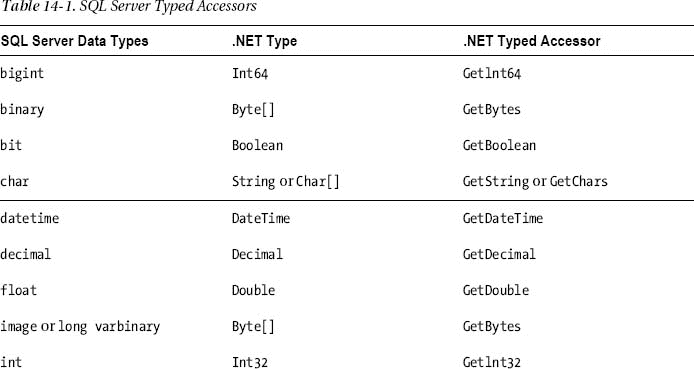

[表 14-2](#tab_14_2) 列出了一些可用的 OLE DB 数据类型，它们对应的。NET 类型以及它们的。NET 类型的访问器。

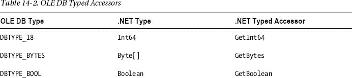

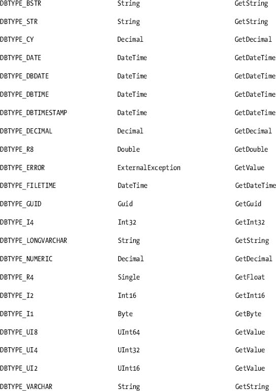

要查看运行中的类型化访问器，您将构建一个使用它们的控制台应用。对于这个例子，您将使用来自`Northwind`数据库的 Products 表。

[表 14-3](#tab_14_3) 显示了表格的数据设计。请注意，表中给定的数据类型将在[表 14-1](#tab_14_1) 中查找其对应的类型化访问器方法，以便您可以在您的应用中正确使用它们。

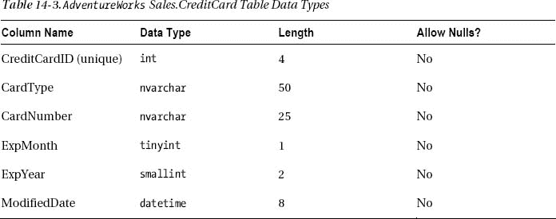

##### 试试看:使用类型化访问器方法

在此示例中，您将向 DataReader 项目添加一个 Windows 窗体，然后使用类型化访问器方法。

1.  选择 DataReader 项目，右键单击，然后选择“添加 Windows 窗体”。在打开的对话框中，确保选择了 Windows 窗体，并将 Form1.cs 重命名为 TypedAccessor.cs 单击“确定”将该窗体添加到 DataReader 项目中。
2.  选择 TypedAccessor 窗体，并将 Size 属性的宽度设置为 476，高度设置为 353。
3.  将 TextBox 控件拖到窗体上，并将其放在窗体的中央。选择此 TextBox 控件，导航到“属性”窗口，并设置以下属性:
    *   将 Name 属性设置为 txtTypeAccess。
    *   设置位置属性的 X 为 12，Y 为 12。
    *   将 ScrollBars 属性设置为垂直。
    *   将 Size 属性的宽度设置为 437，高度设置为 290。
    *   将 Multiline 属性设置为 True。
4.  Now your TypedAccessor form in the Design view should look like [Figure 14-5](#fig_14_5). 

    ***图 14-5。**typed accessor 表单的设计视图*

5.  Now double-click the empty surface of the TypedAccessor.cs form, and it will open the code editor window, showing the TypedAccessor_Load event. Modify the TypedAccessor _Load event to look like [Listing 14-3](#list_14_3).

    ***清单 14-3。**T4`TypedAccessors.cs`*

    `Using System.Data.SqlClient;
             private void TypedAccessors_Load(object sender, EventArgs e)
            {
                // Connection string
                string connString = @"server=.\sql2012;database=AdventureWorks;
                                  Integrated Security=SSPI";

                // Query
                string sql = @"select CardType, CardNumber,ExpMonth,ExpYear from
    Sales.CreditCard";` `            // Create connection
                SqlConnection conn = new SqlConnection(connString);

                try
                {
                    // Open connection
                    conn.Open();

                    // Create command
                    SqlCommand cmd = new SqlCommand(sql, conn);

                    // Create data reader

                    SqlDataReader rdr = cmd.ExecuteReader();

                    // Fetch data
                    while (rdr.Read())
                    {

                        // CardType
                        txtTypeAccess.AppendText(rdr.GetString(0).PadRight(30));
                        txtTypeAccess.AppendText("\t");
                        // CardNumber
                        txtTypeAccess.AppendText(rdr.GetString(1));
                        txtTypeAccess.AppendText("\t\t");
                        // ExpMonth
                        txtTypeAccess.AppendText(rdr.GetByte(2).ToString());
                        txtTypeAccess.AppendText("\t\t");
                        // ExpYear
                        txtTypeAccess.AppendText(rdr.GetInt16(3).ToString());
                        txtTypeAccess.AppendText("\n");
                    }
                    // Close data reader
                    rdr.Close();
                }
                catch (SqlException ex)
                {
                    MessageBox.Show(ex.Message + ex.StackTrace,"Exception Details");
                }

                finally
                {

                    // Close connection
                    conn.Close();
                }
            }`
6.  To set the TypedAccessor form as the start-up form, modify the Program.cs statement. `Application.Run(new OrdinalIndexer ());`

    出现为:

    `Application.Run(new TypedAccessor());`
7.  Build the project, and run it by pressing Ctrl+F5\. You should see the results in [Figure 14-6](#fig_14_6). 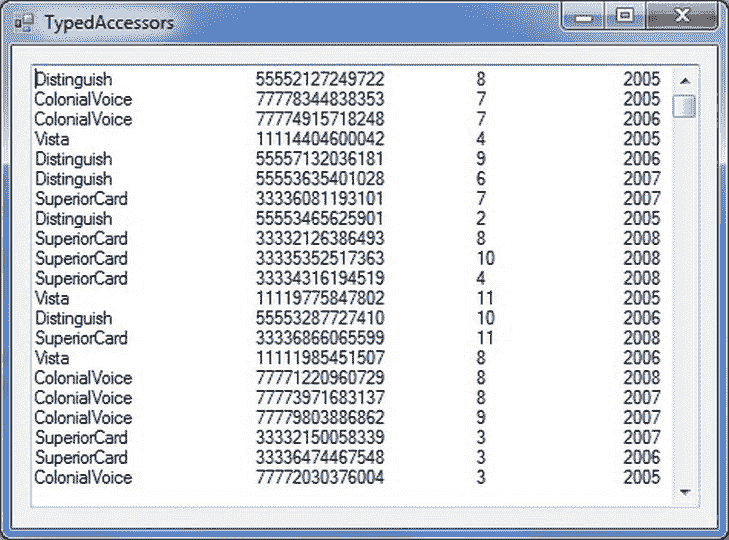

    ***图 14-6。**使用类型化访问器*

##### 它是如何工作的

你查询销售情况。CardType、CardNumber、ExpMonth 和 ExpYear 的信用卡表。

`            // Query
            string sql = @"select CardType, CardNumber,ExpMonth,ExpYear from
Sales.CreditCard";`

我们让您选择这些列的原因是为了处理不同种类的数据类型，并展示如何使用相关的类型化访问器来获得正确的结果。

`// Fetch data
                while (rdr.Read())
                {

                    // CardType
                    txtTypeAccess.AppendText(rdr.GetString(0).PadRight(30));
                    txtTypeAccess.AppendText("\t");
                    // CardNumber
                    txtTypeAccess.AppendText(rdr.GetString(1));
                    txtTypeAccess.AppendText("\t\t");` `                    // ExpMonth
                    txtTypeAccess.AppendText(rdr.GetByte(2).ToString());
                    txtTypeAccess.AppendText("\t\t");
                    // ExpYear
                    txtTypeAccess.AppendText(rdr.GetInt16(3).ToString());
                    txtTypeAccess.AppendText("\n");
                }`

查看[表 14-1](#tab_14_1) ，您可以看到您可以分别使用`GetString`、`GetByte`和`Getlntl6`访问器方法访问 SQL Server 中的 nvarchar、tinyint 和 smallint 数据类型。

这项技术速度很快，而且完全是类型安全的。我们的意思是，如果从本机数据类型到。NET 类型失败，则会因无效的强制转换而引发异常。例如，如果您尝试对一个`bit`数据类型使用`GetString`方法，而不是使用`GetBoolean`方法，将会抛出一个“指定的强制转换无效”异常。

#### 获取关于数据的数据

到目前为止，您所做的只是从数据源中检索数据。一旦你有了一个填充的数据阅读器，你可以做更多的事情。有许多有用的方法可以检索模式信息或与结果集直接相关的信息。表 14-4 描述了数据读取器的一些元数据方法和属性。

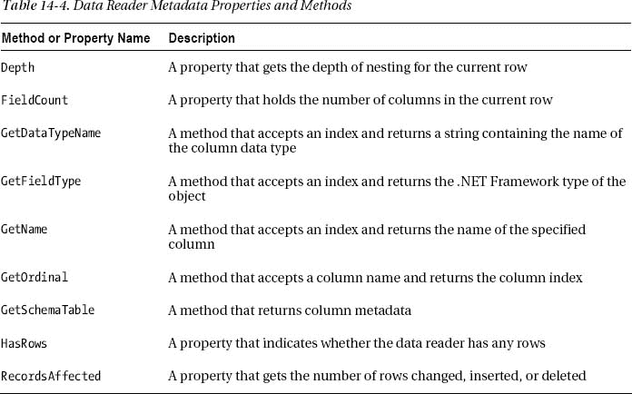

##### 试试看:用数据阅读器获取结果集的信息

在本练习中，您将使用其中的一些方法和属性。

1.  选择 DataReader 项目，右键单击，然后选择“添加 Windows 窗体”。在打开的对话框中，确保选择了 Windows Form，并将 Form1.cs 重命名为 ResultSetInfo.cs 然后单击“确定”将该窗体添加到 DataReader 项目中。
2.  选择 ResultSetInfo 表单，并将 Size 属性的宽度设置为 462，高度设置为 460。
    *   将一个 Label 控件拖到窗体上，选择该控件，导航到“属性”窗口，并设置以下属性:
    *   将 Name 属性设置为 lblDataType。
    *   将 AutoSize 属性设置为 false。
    *   将位置属性的 X 设置为 3，Y 设置为 31。
    *   将 Size 属性的 X 设置为 57，Y 设置为 13。
    *   将 Text 属性设置为数据类型。
3.  将 Label 控件拖到窗体上。选择该控件，导航到“属性”窗口，并设置以下属性:
    *   将 Name 属性设置为 lblType1。
    *   将 AutoSize 属性设置为 false。
    *   将位置属性的 X 设置为 80，Y 设置为 21。
    *   将 Size 属性的 X 设置为 101，Y 设置为 34。
    *   将文本属性留空。
    *   将 Label 控件拖到窗体上。选择该控件，导航到“属性”窗口，并设置以下属性:
    *   将 Name 属性设置为 lblType2。
    *   将 AutoSize 属性设置为 false。
    *   将位置属性的 X 设置为 222，Y 设置为 21。
    *   将 Size 属性的 X 设置为 101，Y 设置为 34。
    *   将文本属性留空。
    *   将 TextBox 控件拖动到 Label 控件下方，并导航到“属性”窗口以配置以下属性:
    *   将 Name 属性设置为 txtResultSet。
    *   将 Multiline 属性设置为 True。
    *   将位置属性的 X 设置为 32，Y 设置为 58。
    *   将 ScrollBars 属性设置为垂直。
    *   将 Size 属性的宽度设置为 341，高度设置为 234。
    *   将 Label 控件拖动到 TextBox 下方，导航到“属性”窗口，并设置以下属性:
    *   将 Name 属性设置为 lblType3。
    *   将 AutoSize 属性设置为 false。
    *   将位置属性的 X 设置为 38，Y 设置为 317。
    *   将 Size 属性的宽度设置为 335，高度设置为 13。
    *   将文本属性留空。
    *   将另一个标签控件拖到刚刚添加的标签下方。选择该控件，导航到“属性”窗口，并设置以下属性:
    *   将 Name 属性设置为 lblType4。
    *   将 AutoSize 属性设置为 false。
    *   将位置属性的 X 设置为 38，Y 设置为 352。
    *   将 Size 属性的宽度设置为 335，高度设置为 13。
    *   将文本属性留空。
    *   将另一个标签控件拖到刚刚添加的标签下方。选择该控件，导航到“属性”窗口，并设置以下属性:
    *   将 Name 属性设置为 lblType5。
    *   将 AutoSize 属性设置为 false。
    *   将位置属性的 X 设置为 38，Y 设置为 381。
    *   将 Size 属性的宽度设置为 335，高度设置为 13。
    *   将文本属性留空。
4.  Now your ResultSetInfo form in the Design view should like [Figure 14-7](#fig_14_7). 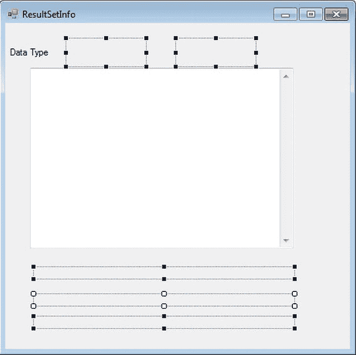

    ***图 14-7。**ResultSetInfo 表单的设计视图*

5.  Double-click the empty surface of the `TypedAccessor.cs` form, and it will open the code editor window, showing the `TypedAccessor_Load` event. Modify the `TypedAccessor_Load` event to look like [Listing 14-4](#list_14_4).

    ***清单 14-4。**T4`ResultSetInfo.cs`*

    `Using System.Data.SqlClient;

            private void ResultSetInfo_Load(object sender, EventArgs e)
            {
                // Connection string
                string connString = @"server=.\sql2012;database=AdventureWorks;
                                Integrated Security=SSPI";

                // Query
                string sql = @" select FirstName,LastName from Person.Contact
                                 order by LastName";` `// Create connection
                SqlConnection conn = new SqlConnection(connString);

                try
                {
                    conn.Open();

                    SqlCommand cmd = new SqlCommand(sql, conn);

                    SqlDataReader rdr = cmd.ExecuteReader();

                    // Get column names
                    lbltype1.Text = rdr.GetName(0);
                    lblType2.Text = rdr.GetName(1);

                    //Get column data types
                    lbltype1.Text += "\n"+  rdr.GetDataTypeName(0).ToString();
                    lblType2.Text += "\n"+ rdr.GetDataTypeName(1).ToString();

                    // Get number of columns
                    lblType3.Text = "Number of columns in a row::" + rdr.FieldCount.ToString();

                    // Get info about each column
                    lblType4.Text = rdr.GetName(0).ToString() + " is at index::" +
                                    rdr.GetOrdinal("FirstName").ToString()  +
                                    " and its type is::" + rdr.GetFieldType(0).ToString();

                    lblType5.Text = rdr.GetName(1).ToString() + " is at index:: "+
                                   rdr.GetOrdinal("LastName").ToString()  +
                                   " and its type is::" + rdr.GetFieldType(1).ToString();

                    while (rdr.Read())
                    {
                      // Get column values for all rows
                        txtResultSet.AppendText("\t");
                        txtResultSet.AppendText(rdr[0].ToString());
                        txtResultSet.AppendText("\t\t\t");  
                        txtResultSet.AppendText(rdr[1].ToString() );
                        txtResultSet.AppendText("\n");  
                    }

                    //Close reader
                    rdr.Close();

                }
                catch (SqlException ex)
                {
                    MessageBox.Show(ex.Message + ex.StackTrace,"Exception Details");
                }

                finally
                {` `                //Clsoe connection
                    conn.Close();
                }
            }`
6.  To set the ResultSetInfo form as the start-up form, modify the Program.cs statement. `Application.Run(new TypedAccessor ());`

    表现为:

    `Application.Run(new ResultSetInfo());`
7.  Build the project, and run it by pressing Ctrl+F5\. Your results should look like [Figure 14-8](#fig_14_8). 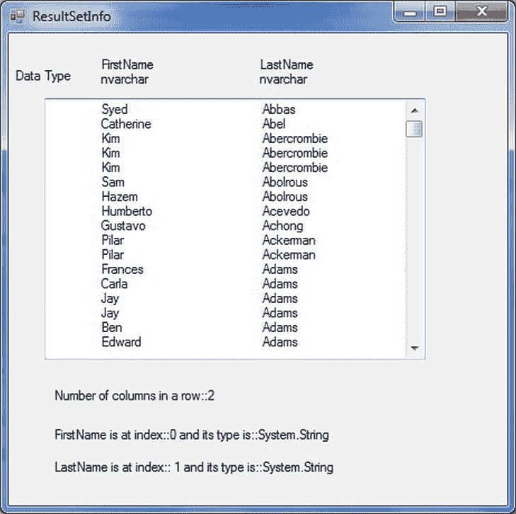

    ***图 14-8。**显示结果集元数据*

##### 它是如何工作的

`GetName`方法通过索引获取列名。这个方法返回关于结果集的信息*，所以它可以在第一次调用`Read()`之前被调用。*

`                // Get column names
                lbltype1.Text = rdr.GetName(0);
                lblType2.Text = rdr.GetName(1);`

`GetDataTypeName`方法返回列的数据库数据类型。它也可以在第一次调用`Read()`之前被调用。

`                //Get column data types
                lbltype1.Text += "\n"+  rdr.GetDataTypeName(0).ToString();
                lblType2.Text += "\n"+ rdr.GetDataTypeName(1).ToString();`

数据读取器的`FieldCount`属性包含结果集中的列数。这对于在不知道列名或其他属性的情况下遍历列很有用。

`               // Get number of columns
                lblType3.Text = "Number of columns in a row::" + rdr.FieldCount.ToString();`

最后，您将看到如何使用`GetOrdinal`和`GetFieldType`方法。前者返回基于其名称的列索引；后者返回 C# 类型。这些分别是`GetName()`和`GetDataTypeName()`的计数器类型。

`                // Get info about each column
                lblType4.Text = rdr.GetName(0).ToString() + " is at index::" +
                                rdr.GetOrdinal("FirstName").ToString()  +
                                " and its type is::" + rdr.GetFieldType(0).ToString();

                lblType5.Text = rdr.GetName(1).ToString() + " is at index:: "+
                               rdr.GetOrdinal("LastName").ToString()  +
                               " and its type is::" + rdr.GetFieldType(1).ToString();`

关于获取结果集的信息就说到这里。现在您将学习如何获取关于模式的信息。

#### 获取关于表格的数据

术语*模式*对于关系数据库有多种含义。这里，我们用它来表示数据结构的设计，尤其是数据库表。表格由行和列组成，每一列都可以有不同的数据类型。列及其属性(数据类型、长度等)构成了表的模式。

为了方便地检索模式信息，可以在数据读取器上调用`GetSchemaTable`方法。顾名思义，这个方法返回一个`System.Data.DataTable`对象，它是被查询的表的一个表示(模式),并且以`DataRow`和`DataColumn`对象的形式包含行和列的集合。这些行和列由`DataTable`类的属性`Rows`和`Columns`作为集合对象返回。

然而，这里通常会出现轻微的混淆。数据列对象不是列值；相反，它们是表示和控制单个列的行为的列定义。它们可以通过使用列名索引器来循环，并且可以告诉您许多关于数据集的信息。

##### 尝试一下:获取模式信息

这里你会看到一个`GetSchemaTable`方法的实际演示。

1.  选择 DataReader 项目，右键单击，然后选择“添加 Windows 窗体”。在打开的对话框中，确保选择了 Windows 窗体，并将 Form1.cs 重命名为 SchemaTable.cs，然后单击 OK 将该窗体添加到 DataReader 项目中。
2.  选择 SchemaTable 表单，并将 Size 属性的宽度设置为 378，高度设置为 459。
3.  将 TextBox 控件拖到窗体上，并将其放在窗体的中间。选择此 TextBox 控件，导航到“属性”窗口，并设置以下属性:
    *   将 Name 属性设置为 txtSchema。
    *   将位置属性的 X 设置为 12，Y 设置为 12。
    *   将 Multiline 属性设置为 True。
    *   将 ScrollBars 属性设置为垂直。
    *   将 Size 属性的宽度设置为 392，高度设置为 333。
4.  Now your SchemaTable form in the Design view should look like [Figure 14-9](#fig_14_9). 

    ***图 14-9。**可图式的设计视图*

5.  Double-click the empty surface of the SchemaTable.cs form, and it will open the code editor window, showing the SchemaTable_Load event. Modify the SchemaTable _Load event to look like [Listing 14-5](#list_14_5).

    ***清单 14-5。**T4`SchemaTable.cs`*

    `Using System.Data.SqlClient
            private void SchemaTable_Load(object sender, EventArgs e)
            {
                // Connection string
                string connString = @"server=.\sql2012;
                database=AdventureWorks;Integrated Security=SSPI";

                // Query
                string sql = @"select * from  Person.Address";

                // Create connection
                SqlConnection conn = new SqlConnection(connString);

                try
                {
                    conn.Open();

                    SqlCommand cmd = new SqlCommand(sql, conn);
                    SqlDataReader rdr = cmd.ExecuteReader();

                    // Store Employees schema in a data table
                    DataTable schema = rdr.GetSchemaTable();

                    // Display info from each row in the data table.
                    // Each row describes a column in the database table.

                    foreach (DataRow row in schema.Rows)
                    {
                        foreach (DataColumn col in schema.Columns)
                        {
                            txtSchema.AppendText(col.ColumnName + " = " + row[col]);
                            txtSchema.AppendText("\n");
                        }
                        txtSchema.AppendText("-----------------");
                    }

                    //Close reader
                    rdr.Close();

                }
                catch (Exception err)
                {
                    MessageBox.Show(err.ToString() );
                }
                finally
                {` `                //connection close
                    conn.Close();
                }
     }`
6.  To set the SchemaTable form as the start-up form, modify the Program.cs statement. `Application.Run(new ResultSetInfo ());`

    表现为

    `Application.Run(new SchemaTable());`
7.  Build the project, and run it by pressing Ctrl+F5\. You should see the results in [Figure 14-10](#fig_14_10). 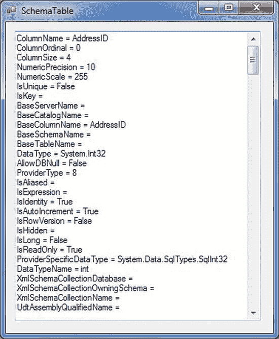

    ***图 14-10。**显示模式元数据*

##### 它是如何工作的

这段代码与您之前编写的代码有些不同。当调用`GetSchemaTable`方法时，返回一个数据表的填充实例。

`// Store Person’s schema in a data table
DataTable schema = rdr.GetSchemaTable();`

您可以使用数据表来表示数据库中的完整表，可以是表示其架构的表的形式，也可以是保存所有原始数据以供脱机使用的表的形式。

在这个例子中，一旦获得了一个模式表，就可以通过`DataTable`的`Rows`属性检索一个行集合，通过`DataTable`的`Columns`属性检索一个列集合。(您可以使用`Rows`属性向表中添加一个新行或删除一行，并且您可以使用`Columns`属性添加或删除一个现有列——我们将在第 15 章中对此进行介绍。)表返回的每一行都描述了原始表中的一列，因此对于这些行中的每一行，都要使用嵌套的`foreach`循环逐个遍历列的模式信息。

`// Display info from each row in the data table.
// Each row describes a column in the database table.
foreach (DataRow row in schema.Rows)
{
     foreach (DataColumn col in schema.Columns)
    {
         txtSchema.AppendText(col.ColumnName + " = " + row[col]);
         txtSchema.AppendText("\n");
    }
         txtSchema.AppendText("-----------------");
}`

注意如何在循环中使用`DataColumn`对象的`ColumnName`属性来检索当前的模式列名，然后通过使用熟悉的索引器风格的方法来检索与该列的定义相关的值，该方法使用了一个`DataRow`对象。有许多重载的索引器，这只是其中的一种方法。

#### 通过数据读取器使用多个结果集

有时，您可能真的希望快速完成一项工作，并且还希望同时使用两个或更多查询来查询数据库。此外，您不希望通过实例化多个命令或数据读取器，或者通过一次又一次地使用相同的对象，并在运行过程中添加代码，以任何方式影响应用的整体性能。

那么，有没有办法让一个数据读取器遍历多个结果集呢？是的，数据读取器有一个方法`NextResult()`，它将读取器推进到下一个结果集。

##### 尝试一下:处理多个结果集

在这个例子中，您将使用`NextResult()`来处理多个结果集。

1.  选择 DataReader 项目，右键单击，然后选择“添加 Windows 窗体”。在打开的对话框中，确保选择了 Windows 窗体，并将 Form1.cs 重命名为 MultipleResults.cs，单击“确定”将该窗体添加到 DataReader 项目中。
2.  选择 MultipleResults 表单，并将 Size 属性的宽度设置为 358，高度设置为 516。
3.  将 TextBox 控件拖到窗体上，并将其放在窗体的中间。选择此文本框，导航到“属性”窗口，并设置以下属性:
    *   将 Name 属性设置为 txtResult。
    *   将位置属性的 X 设置为 12，Y 设置为 12。
    *   将 Multiline 属性设置为 True。
    *   将 ScrollBars 属性设置为垂直。
    *   将 Size 属性的宽度设置为 318，高度设置为 454。
4.  Now your MultipleResults form in the Design view should like [Figure 14-11](#fig_14_11). 

    ***图 14-11。**多结果表单的设计视图*

5.  Now double-click the empty surface of the MultipleResults.cs form, and it will open the code editor window, showing the SchemaTable_Load event. Modify the MultipleResults_Load event to look like [Listing 14-6](#list_14_6).

    ***清单 14-6。**T4`MultipleResults.cs`*

    `using System.Data.SqlClient;

             private void MultipleResults_Load(object sender, EventArgs e)
            {
                // Connection string
                string connString = @"server=.\sql2012;database=AdventureWorks;
                                      Integrated Security=SSPI";

                // Query1
                string sql1 = @"select CountryRegionCode,Name
                                from Person.CountryRegion
                                where Name like 'A%' ";

                //Query2
                string sql2 = @"select FirstName, LastName
                                from Person.Contact";

                //Combining queries to produce multiple result set
                string sql = sql1 + sql2;

                // Create connection
                SqlConnection conn = new SqlConnection(connString);
                try
                {
                    // Open connection
                    conn.Open();

                    // Create command
                    SqlCommand cmd = new SqlCommand(sql, conn);

                    // Create data reader
                    SqlDataReader rdr = cmd.ExecuteReader();

                    // Loop through result sets
                    do
                    {
                        txtResult.AppendText(rdr.GetName(0));
                        txtResult.AppendText("\t\t");
                        txtResult.AppendText(rdr.GetName(1));
                        txtResult.AppendText("\n");
                        txtResult.AppendText("".PadLeft(30, '='));
                        txtResult.AppendText("\n");

                        while (rdr.Read())
                        {
                            // Print one row at a time` `                        txtResult.AppendText(rdr[0].ToString());
                            txtResult.AppendText("\t\t\t");
                            txtResult.AppendText(rdr[1].ToString());
                            txtResult.AppendText("\n");
                        }
                    }
                    while (rdr.NextResult());

                    // Close data reader
                    rdr.Close();
                }
                catch (SqlException ex)
                {
                    MessageBox.Show(ex.Message + ex.StackTrace,"Exception Details");
                }
                finally
                {
                    // Close connection
                    conn.Close();
                }`
6.  To set the MultipleResults form as the start-up form, modify the Program.cs statement. `Application.Run(new SchemaTable ());`

    表现为:

    `Application.Run(new MultipleResults());`
7.  Build the project, and run it by pressing Ctrl+F5\. You should see the results in [Figure 14-12](#fig_14_12). 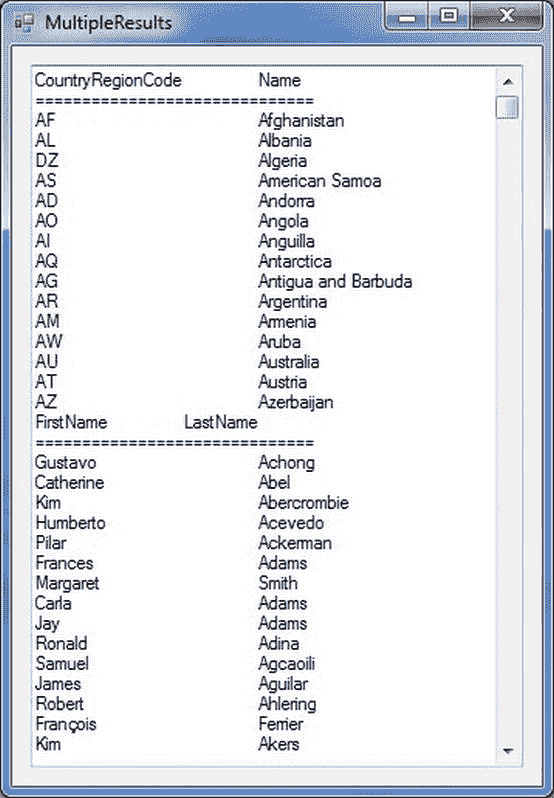

    ***图 14-12。**处理多个结果集*

##### 它是如何工作的

这个程序本质上与第一个相同，`DataLooper.cs` ( [清单 14-1](#list_14_1) )。这里，您定义了两个独立的查询，然后将它们组合起来。

`// Query1
            string sql1 = @"select CountryRegionCode,Name
                            from Person.CountryRegion
                            where Name like 'A%' ";

            //Query2
            string sql2 = @"select FirstName, LastName
                            from Person.Contact";` `            //Combining queries to produce multiple result set
            string sql = sql1 + sql2;`

唯一的另一个变化是循环遍历结果集。将检索行的循环嵌套在遍历结果集的循环中。

`                // Loop through result sets
                do
                {
                    txtResult.AppendText(rdr.GetName(0));
                    txtResult.AppendText("\t\t");
                    txtResult.AppendText(rdr.GetName(1));
                    txtResult.AppendText("\n");
                    txtResult.AppendText("".PadLeft(30, '='));
                    txtResult.AppendText("\n");

                    while (rdr.Read())
                    {
                        // Print one row at a time
                        txtResult.AppendText(rdr[0].ToString());
                        txtResult.AppendText("\t\t\t");
                        txtResult.AppendText(rdr[1].ToString());
                        txtResult.AppendText("\n");
                    }
                }
                while (rdr.NextResult());`

为了简化，我们让您在每个查询中只选择两个字符串列。扩展它来处理具有不同列数和列数据类型的结果表非常简单。

### 总结

在本章中，您使用了数据读取器来执行各种常见任务，从简单地遍历单个结果集到处理多个结果集。您了解了如何通过列名和索引来检索列的值，还了解了可用于处理不同数据类型的值的方法。您还了解了如何获取关于结果集的信息和模式信息。

在下一章，我们将讨论 ADO 真正有趣的方面。NET:使用数据集和数据适配器在与数据库断开连接时处理数据库数据。