# 十五、使用数据集和数据适配器

在第 14 章中，您看到了如何使用数据读取器以连接的、只进、只读的方式访问数据库数据。通常，这就是您想要做的，而数据阅读器完全符合您的目的。

在这一章中，你将看到一个新的数据访问对象，即*数据集。*与数据读取器不同，数据读取器是实现`System.Data.IDataReader`接口的特定于数据提供者的类的对象，数据集是类`System.Data.DataSet`的对象，这是一个由所有数据提供者使用的独特的 ADO.NET 组件。数据集完全独立于数据源，既可以连接到数据源，也可以从数据源断开。它们的基本目的是提供存储在内存缓存中的数据的关系视图。

 **注意**在另一个有点令人困惑的术语中，这个类被命名为`DataSet`，但是通用术语被拼写为*数据集*

那么，如果数据集不必连接到数据库，如何用数据填充它并将它的数据保存到数据库呢？这就是数据适配器的用武之地。将数据适配器视为数据集和数据源之间的桥梁。没有数据适配器，数据集就不能访问任何类型的数据源。数据适配器负责数据集的所有连接细节，用数据填充数据集，并更新数据源。

在本章中，我们将介绍以下内容:

> *   Understand the object model
> *   Working with datasets and data adapters
> *   Propagate changes to data sources
> *   be complicated by
> *   Working with datasets and XML
> *   Understanding typed and untyped datasets

### 了解对象模型

本章开始时，我们将快速介绍使用数据集和数据适配器需要了解的所有新对象。您将从查看数据集和数据读取器之间的差异开始，然后更详细地查看数据在数据集中的结构以及数据集如何与数据适配器协作。

#### 数据集与数据读取器

如果你只是想读取和显示数据，那么你只需要使用一个数据读取器，就像你在上一章看到的那样，特别是当你处理大量数据的时候。在需要遍历数千或数百万行的情况下，您需要一个快速的顺序读取器(一次从结果集中读取一行)，数据读取器以一种高效的方式完成这项工作。

如果您需要以任何方式操作数据，然后更新数据库，您需要使用数据集。数据适配器使用数据读取器填充数据集；需要额外的资源来保存数据以供离线使用。你需要思考你是否真的需要一个数据集；否则，你只是在浪费资源。除非您需要更新数据源或使用其他数据集功能，如读写 XML 文件、导出数据库架构和创建数据库的 XML 视图，否则应该使用数据读取器。

#### 数据集简介

ADO.NET 的数据集概念是多层数据库应用开发世界中的一大步。当检索或修改大量数据时，在等待用户发出请求的同时保持与数据源的开放连接是对宝贵资源的巨大浪费。

数据集在这里非常有用，因为它们使您能够在本地缓存中存储和修改大量数据，以表格的形式查看数据，并以*离线*模式(换句话说，与数据库断开连接)处理数据。

我们来看一个例子。假设您试图通过互联网连接到远程数据库服务器，以获取一些商业事务的详细信息。您在特定日期搜索所有可用的事务，并显示结果。在后台，您的应用创建一个与数据源的连接，连接两个表，并检索结果。假设您现在想要编辑这些信息，并添加或删除细节。不管是什么原因，您的应用都会一遍又一遍地经历相同的循环:创建新的连接、连接表和检索数据。不仅每次创建一个新的连接会有开销，而且您可能会做许多其他多余的工作，尤其是当您处理相同的数据时。如果您可以连接到数据源一次，将数据本地存储在类似于关系数据库的结构中，关闭连接，修改本地数据，然后在适当的时候将更改传播到数据源，这样不是更好吗？

这正是数据集的设计目的。数据集将关系数据存储为*数据表的集合。*在上一章中，当一个`System.Data.DataTable`对象用来保存模式信息时，你简要地见过数据表。然而，在这种情况下，数据表只包含模式信息，但是在数据集中，数据表包含描述数据结构和数据本身的元数据。

[图 15-1](#fig_15_1) 显示了数据集架构。

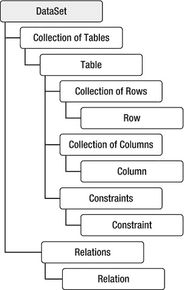

***图 15-1。**数据集架构*

该体系结构反映了关系数据库的逻辑设计。在本章中，您将看到如何使用数据表、数据行和数据列。

#### 数据适配器简介

当您第一次实例化数据集时，它不包含任何数据。您可以通过将填充的数据集传递给数据适配器来获得它，数据适配器负责连接细节，并且是数据提供程序的一个组件。数据集不是数据提供程序的一部分。就像一个水桶，准备装水，但是需要一个外接管道让水进来。换句话说，数据集需要一个数据适配器来填充数据并支持对数据源的访问。

每个数据提供程序都有自己的数据适配器，就像它有自己的连接、命令和数据读取器一样。图 15-2 描述了数据集、数据适配器和数据源之间的交互。

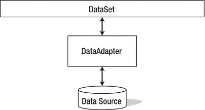

***图 15-2。**数据集、数据适配器和数据源交互*

数据适配器构造函数被重载。您可以使用以下任何一种方法来获取新的数据适配器。我们使用 SQL Server 数据提供程序，但是其他数据提供程序的构造函数是类似的。

`SqlDataAdapter  da  =   new   SqlDataAdapter();
SqlDataAdapter  da  =   new   SqlDataAdapter(cmd);
SqlDataAdapter  da   =  new   SqlDataAdapter(sql, conn);
SqlDataAdapter  da   =  new   SqlDataAdapter(sql, connString);`

因此，您可以用四种方式创建数据适配器:

> *   You can use its parameterless constructor (assign SQL and join later).
> *   You can pass a command to its constructor (here, `cmd` is a `SqlCommand` object).
> *   You can pass an SQL string and a connection.
> *   You can pass an SQL string and a connection string.

您将很快看到所有这些都在起作用。现在，我们将继续介绍如何使用数据表、数据列和数据行。您将在接下来的章节中使用这些内容。

#### 数据表、数据列和数据行的简要介绍

数据表是类`System.Data.DataTable`的一个实例。它在概念上类似于关系表。如图[图 15-1](#fig_15_1) 所示，一个数据表有数据行和数据列的集合。您可以通过数据表的`Rows`和`Columns`属性来访问这些嵌套集合。

一个数据表可以代表一个独立的表，或者在一个数据集内，正如你将在本章中看到的，或者作为一个由另一个方法创建的对象，正如你在上一章中看到的，当一个数据表通过调用数据读取器上的`GetSchemaTable`方法被返回时。

数据列表示数据表中列的模式，然后可用于设置或获取列属性。例如，您可以使用它通过为数据列的`DefaultValue`属性赋值来设置列的默认值。

您可以使用数据表的`Columns`属性获取数据列的集合，该属性的索引器接受列名或从零开始的索引，例如(其中`dt`是数据表):

`DataColumn col = dt.Columns["ContactName"];` `DataColumn col = dt.Columns[2];`

数据行代表一行中的数据。您可以以编程方式添加、更新或删除数据表中的行。要访问数据表中的行，可以使用它的`Rows`属性，该属性的索引器接受从零开始的索引，例如(其中`dt`是数据表):

`DataRow row = dt.Rows[2];`

这是足够的理论了。是时候做一些编码了，看看这些对象在实践中是如何协同工作的！

### 使用数据集和数据适配器

数据集构造函数被重载。

`DataSet ds = new DataSet();
DataSet ds = new DataSet("MyDataSet");`

如果使用无参数构造函数，数据集名称默认为`NewDataSet`。如果需要多个数据集，最好使用另一个构造函数并显式命名它。但是，您总是可以通过设置其`DataSetName`属性来更改数据集名称。

您可以通过多种方式填充数据集，包括以下方式:

> *   Use data adapter
> *   Read from XML document

在本章中，我们将使用数据适配器。但是，在“使用数据集和 XML”一节中，您将快速浏览一下第二种方法的相反情况，您将从数据集编写 XML 文档。

##### 试试看:用数据适配器填充数据集

在本例中，您将创建一个数据集，用数据适配器填充它，然后显示它的内容。

1.  创建一个名为 [Chapter15](15.html) 的新 Windows 窗体应用项目。当解决方案资源管理器打开时，保存解决方案。
2.  将 [Chapter15](15.html) 项目重命名为 DataSetandDataAdapter。
3.  重命名`Form1.cs`文件以弹出`DataSet.cs`。
4.  通过单击窗体的标题栏选择 PopDataSet 窗体，并将 Size 属性的宽度设置为 301，高度设置为 342。
5.  将 GridView 控件拖到窗体上，并将其放在窗体的左上角。选择此 GridView，导航到“属性”窗口，并设置以下属性:
    *   将 Name 属性设置为 gvProduct。
    *   对于 Location 属性，将 X 设置为 12，将 Y 设置为 12。
    *   将 ScrollBars 属性设置为 Both。
    *   对于 Size 属性，将 Width 设置为 263，Height 设置为 282。
6.  Now your PopDataSet form in the Design view should look like [Figure 15-3](#fig_15_3). 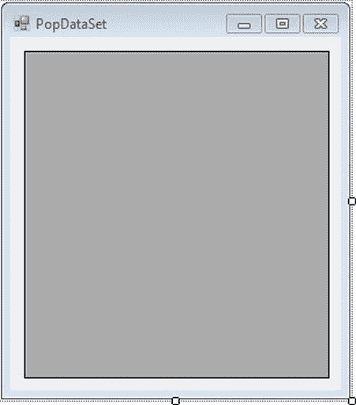

    ***图 15-3。**pop dataset 表单的设计视图*

7.  Double-click the empty surface of the `PopDataSet.cs` form, and it will open the code editor window, showing the `PopDataSet_Load` event. Modify the `PopDataSet_Load` event to look like [Listing 15-1](#list_15_1).

    ***清单 15-1。*** `PopDataSet.cs`

    `Using System.Data.SqlClient;

            private void PopDataSet_Load(object sender, EventArgs e)
            {
                // Connection string
                string connString = @" server=.\sql2012;database=AdventureWorks;
                                Integrated Security=true";

                // Query
                string sql = @"select Name,ProductNumber
                               from Production.Product
                               where SafetyStockLevel > 600";

                // Create connection
                SqlConnection conn = new SqlConnection(connString);` `            try
                {
                    // Open connection
                    conn.Open();

                    // Create Data Adapter
                    SqlDataAdapter da = new SqlDataAdapter(sql, conn);

                    // Create Dataset
                    DataSet ds = new DataSet();

                    // Fill Dataset
                    da.Fill(ds, "Production.Product");

                    // Display data
                    gvProduct.DataSource = ds.Tables["Production.Product"];
                }
                catch (Exception ex)
                {
                    MessageBox.Show(ex.Message + ex.StackTrace);
                }
                finally
                {
                    //Connection close
                    conn.Close();
                }
            }`
8.  Build the project, and run the DataLooper form by pressing Ctrl+F5\. Your results should look like 15-4. 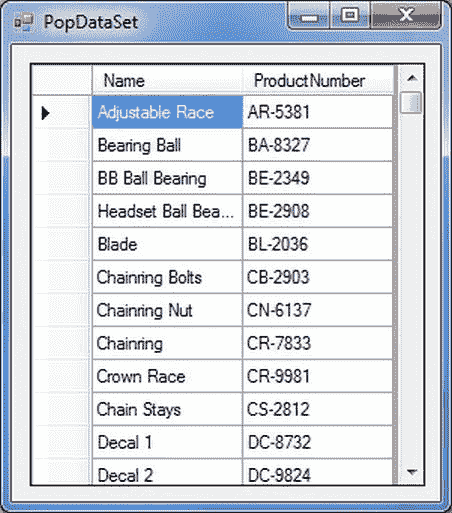

    ***图 15-4。**填充数据集*

##### 它是如何工作的

定义查询并打开连接后，创建并初始化数据适配器。

`// Create Data Adapter
SqlDataAdapter da = new SqlDataAdapter(sql, conn);`

然后你创建一个数据集。

`// Create Dataset
DataSet ds = new DataSet();`

在这个阶段，你所拥有的只是一个空的数据集。关键是在数据适配器上使用`Fill`方法来执行查询、检索数据和填充数据集。

`// Fill Dataset
da.Fill(ds, "Production.Product");`

`Fill`方法在内部使用数据读取器来访问表模式和数据，然后使用它们来填充数据集。

注意，这个方法不仅仅用于填充数据集。它有许多重载，如果需要，还可以用于填充没有数据集的单个数据表。

如果您没有向`Fill`方法提供表的名称，它将被自动命名为`TableN`，其中`N`以空字符串开始(第一个表名就是`Table`)，并在每次向数据集中插入新表时递增。更好的做法是显式命名数据表，但这并不重要。

如果对已经包含数据的数据集多次运行相同的查询，`Fill()`会更新数据，跳过根据模式重新定义表的过程。

这里值得一提的是，下面的代码会产生相同的结果。除了将 SQL 和连接传递给数据适配器的构造函数之外，您还可以使用使用适当的 SQL 和连接创建的命令来设置它的`SelectCommand`属性。

`// Create data adapter
SqlDataAdapter da = new SqlDataAdapter();
da.SelectCommand = new SqlCommand(sql, conn);`

有了填充的数据集，您现在可以访问各个数据表中的数据。(这个数据集只包含一个数据表。)

`// get data table
DataTable dt = ds.Tables["Production.Product"];`

最后，使用嵌套的`foreach`循环来访问每行中的列，并将它们的数据值输出到屏幕上。

`// display data
gvProduct.DataSource = ds.Tables["Production.Product"];`

#### 数据集中的过滤和排序

在前面的例子中，您看到了如何从数据集中提取数据。然而，如果您正在处理数据集，很可能您想要对数据做更多的事情，而不仅仅是显示它。通常，您会希望对数据进行动态过滤或排序。在下面的示例中，您将看到如何使用数据行来实现这一点。

##### 试试看:对数据集中的数据进行动态过滤和排序

我们将从 Customers 表中获取所有的行和列，只过滤德国客户的结果，并按公司排序。我们将使用一个单独的查询来查找产品，并在同一个数据集中填充两个数据表。

1.  选择 DataSetandDataAdapter 项目，右键单击，然后选择添加 Windows 窗体。从打开的对话框中，确保选择了 Windows 窗体，并将`Form1.cs`重命名为`FilterSort.cs`。单击“确定”将该表单添加到 DataSetandDataAdapter 项目中。
2.  通过单击窗体的标题栏选择 FilterSort 窗体，并将 Size 属性的宽度设置为 350，高度设置为 489。
3.  将文本框控件拖到窗体上，并将其放在窗体的中央。选择此 TextBox 控件，导航到“属性”窗口，并设置以下属性:
    *   将 Name 属性设置为 txtSort。
    *   对于 Location 属性，将 X 设置为 12，将 Y 设置为 8。
    *   将 Multiline 属性设置为 True。
    *   将 ScrollBars 属性设置为垂直。
    *   对于“大小”属性，将“宽度”设置为 312，将“高度”设置为 435。
    *   将文本属性留空。
4.  Now your FilterSort form in the Design view should look like [Figure 15-5](#fig_15_5). 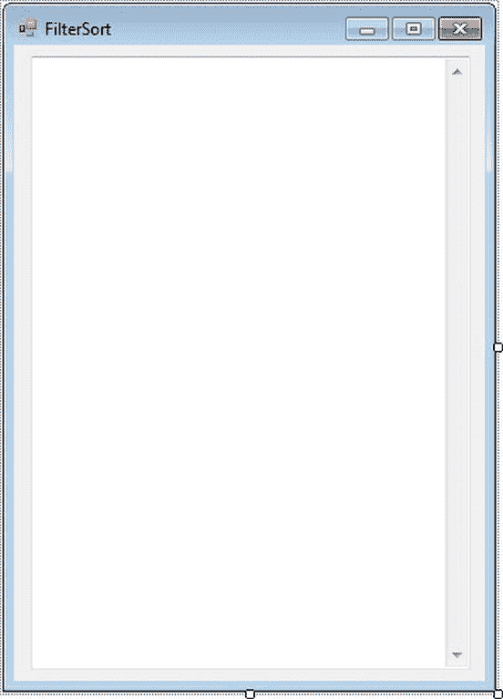

    ***图 15-5。FilterSort 表单的**设计视图*

5.  Double-click the empty surface of the `FilterSort.cs` form, and it will open the code editor window, showing the `FilterSort_Load` event. Modify the `FilterSort_Load` event to look like [Listing 15-2](#list_15_2).

    ***清单 15-2。**T4`FilterSort.cs`*

    `Using System.Data.SqlClient;
            private void FilterSort_Load(object sender, EventArgs e)
            {
                // Connection string
                string connString = @"server=.\sql2012; database=AdventureWorks;
                               Integrated Security=true";

                // Query
                string sql1 = @" select *
                               from Production.Product
                               where Name Like 'Mountain%'";

                string sql2 = @" select *
                               from Production.Location` `where CostRate > 10.0 ";

                // Combine queries
                string sql = sql1 + sql2;

                // Create connection
                SqlConnection conn = new SqlConnection(connString);

                try
                {
                    // Create Data Adapter
                    SqlDataAdapter da = new SqlDataAdapter();
                    da.SelectCommand = new SqlCommand(sql, conn);

                    // Create and Fill Data Set
                    DataSet ds = new DataSet();
                    da.Fill(ds, "Production.Product");

                    // Get the data tables collection
                    DataTableCollection dtc = ds.Tables;

                    // Display data from first data table
                    //
                    // Display output header
                    txtSort.AppendText("Results from Product table:\n");
                    txtSort.AppendText("*******************************\n");
                    txtSort.AppendText("Name\t\t\t\tProductNumber\n");

                    txtSort.AppendText("_________________________________________\n");

                    // set display filter
                    string fl = "Color = 'Black'";

                    // Set sort
                    string srt = "ProductNumber asc";

                    // display filtered and sorted data
                    foreach (DataRow row in dtc["Production.Product"].Select(fl, srt))
                    {
                        txtSort.AppendText(row["Name"].ToString().PadRight(25));
                        txtSort.AppendText("\t\t");
                        txtSort.AppendText(row["ProductNumber"].ToString());
                        txtSort.AppendText(Environment.NewLine);
                    }

                    txtSort.AppendText("============================================\n");
                    // Display data from second data table

                    // Display output header

                    txtSort.AppendText("Results from Location table:\n");
                    txtSort.AppendText("***********************************\n");` `                txtSort.AppendText("Name\t\t\tCostRate\n");
                    txtSort.AppendText("__________________________________________\n");

                   // Display data
                    foreach (DataRow row in dtc[1].Rows)
                    {
                        txtSort.AppendText(row["Name"].ToString().PadRight(25));
                        txtSort.AppendText("\t");
                        txtSort.AppendText(row["CostRate"].ToString() );
                        txtSort.AppendText(Environment.NewLine);
                    }
                }

                catch (Exception ex)
                {
                    MessageBox.Show(ex.Message + ex.StackTrace);
                }

                finally
                {
                    // Connection close
                    conn.Close();
                }
            }`
6.  To set the FilterSort form as the start-up form, modify the `Program.cs` statement. `Application.Run(new PopDataSet());`

    表现为:

    `Application.Run(new FilterSort());`

    构建项目，并通过按 Ctrl+F5 运行它。你的结果应该看起来像[图 15-6](#fig_15_6) 。

    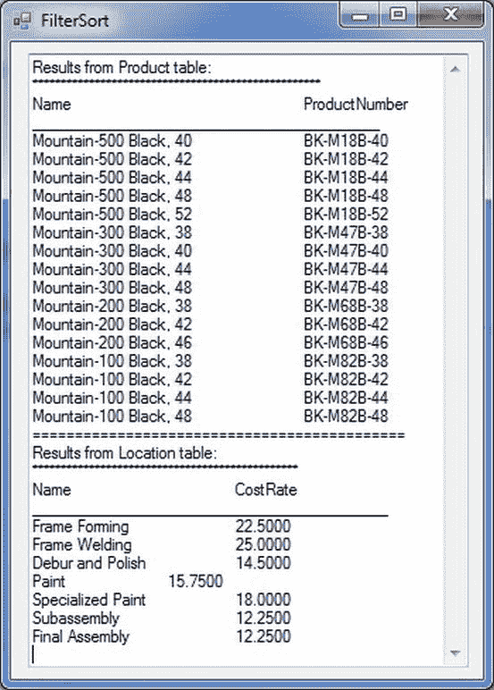

    ***图 15-6。**过滤整理数据表*

##### 它是如何工作的

您编码并组合两个查询，以便在同一个连接上执行。

`// Query1
            string sql1 = @" select *
                           from Production.Product
                           where Name Like 'Mountain%'";

            // Query2
            string sql2 = @" select *
                           from Production.Location
                           where CostRate > 10.0 ";

// Combine queries
string sql = sql1 + sql2;` `// Create connection
SqlConnection conn = new SqlConnection(connString);`

您创建一个数据适配器，为其属性`SelectCommand`分配一个封装查询和连接的命令(供数据适配器的`Fill`方法内部使用)。

`// Create Data Adapter
SqlDataAdapter da = new SqlDataAdapter();
da.SelectCommand = new SqlCommand(sql, conn);`

然后创建并填充一个数据集。

`// Create and Fill Data Set
DataSet ds = new DataSet();
da.Fill(ds, "Production.Product");`

每个查询返回一个单独的结果集，每个结果集存储在一个单独的数据表中(按照指定查询的顺序)。第一个表被明确命名为 Product 第二个被赋予默认名称 Location。

您从数据集的`Tables`属性中获取数据表集合，以便于以后引用。

`// get the data tables collection
DataTableCollection dtc = ds.Tables;`

作为显示第一个数据表的一部分，您声明了两个字符串。

`// Set display filter
string fl = "Color = 'Black'";
// Set sort
string srt = "ProductNumber asc";`

第一个字符串是一个指定行选择标准的*过滤器表达式*。它在语法上与 SQL `WHERE`子句谓词相同。您只需要颜色列等于黑色的那些行。第二个字符串指定您的排序标准，在语法上与 SQL `ORDER BY`子句相同，给出数据列名和排序顺序。

您使用一个`foreach`循环来显示从数据表中选择的行，将过滤器和排序字符串传递给数据表的`Select`方法。这个特定的数据表是数据表集合中一个名为 Product 的数据表。

`               // display filtered and sorted data
                foreach (DataRow row in dtc["Production.Product"].Select(fl, srt))
                {
                    txtSort.AppendText(row["Name"].ToString().PadRight(25));
                    txtSort.AppendText("\t\t");
                    txtSort.AppendText(row["ProductNumber"].ToString());
                    txtSort.AppendText(Environment.NewLine);
                }`

使用创建数据集时指定的表名，从数据表集合(`dtc`对象)中获取对单个数据表的引用。重载的`Select`方法在数据表上进行内部搜索，过滤掉不满足选择标准的行，按照规定对结果进行排序，最后返回一个数据行数组。您可以使用索引器中的列名来访问行中的每一列。

值得注意的是，如果您只是对客户数据使用不同的查询，您可以获得相同的结果，而且效率会高得多。

`Select *
From Production.Productionwhere Color= ‘Black’
order by ProductNumber asc`

从性能的角度来看，这是理想的，但是只有当您需要的数据仅限于这个特定序列中的这些特定行时，这才是可行的。然而，如果您正在构建一个更复杂的系统，那么最好是从数据库中一次提取所有数据(就像您在这里所做的那样)，然后以不同的方式对其进行过滤和排序。阿多。NET 丰富的操作数据集及其组件的方法套件为您提供了以最佳方式满足特定需求的广泛技术。

 **提示**一般来说，尽量利用 SQL，而不是编写 C# 程序，从数据库中获取你需要的数据。数据库服务器被优化来执行选择和排序，以及其他事情。查询可以比你在这本书里玩的那些更复杂更强大。通过仔细地(创造性地)对查询进行编码，以准确地返回*您需要的内容，您不仅最小化了资源需求(内存、网络带宽等)，而且减少了您必须编写的用于操作和格式化结果集数据的代码。*

 *第二个数据表中的循环有趣之处主要在于它的第一行，其中使用了序号索引:

`foreach (DataRow row in dtc[l].Rows)`

不要重命名第二个数据表(可以用它的`TableName`属性来重命名)，最好使用索引而不是名称位置，因为在`Fill()`调用中更改名称需要您在这里进行更改，如果出现这种情况，这是不太可能的。

#### 比较 FilterSort 和 PopDataSet

在第一个例子中，`PopDataSet` ( [清单 15-1](#list_15_1) )，您看到了将数据放入数据集是多么简单。第二个例子，`FilterSort` ( [清单 15-2](#list_15_2) )，只是一个变体，演示了如何处理多个结果集以及如何过滤和排序数据表。然而，这两个程序有一个主要的区别。你注意到了吗？

`FilterSort`不显式打开连接！事实上，这是您编写的第一个(但不会是最后一个)不支持这一点的程序。为什么不呢？

答案很简单，但是*非常*重要。当调用`Fill()`时，如果连接没有打开，则`Fill`方法*自动*打开连接。然后，它在填充数据集后关闭连接。然而，如果一个连接在`Fill()`被调用时是打开的，它会使用那个连接，而*不会在之后*关闭它。

因此，尽管数据集完全独立于数据库(和连接)，但仅仅因为您正在使用数据集并不意味着您正在脱离数据库运行。如果要在断开连接的情况下运行，请使用数据集，但在填充数据集之前不要打开连接(或者，如果连接是打开的，请先将其关闭)。换句话说，数据集本质上是与数据库断开的。但是，这并不意味着使用数据集的应用已断开连接。

您将标准`conn.Close();`留在`finally`块中。因为`Close()`可以在关闭的连接上被正确调用，如果被不必要的调用，它不会出现问题，但是它肯定保证连接将被关闭，不管在`try`块中可能发生什么。

 **注意**如果你想自己证明这一点，只需在调用`Fill()`之前打开`FilterSort`中的连接，然后显示连接的`State`属性的值。会是`Open`。注释掉这个`Open()`调用，并再次运行它。`State`即将关闭。

#### 使用数据视图

在前面的例子中，您看到了如何使用`Select`方法对数据表中的数据进行动态过滤和排序。然而，ADO.NET 有另一种方法来做同样的事情，而且做得更多:*数据视图。一个*数据视图(类`System.Data.DataView`的一个实例)使您能够创建存储在底层数据表中的数据的动态视图，反映对其内容和顺序所做的所有更改。这与`Select`方法不同，后者返回一个数据行数组，其内容反映数据值的变化，但不反映数据顺序。

 **注意**数据视图是数据表内容的动态表示。像 SQL 视图一样，它实际上并不保存数据。

##### 试试看:用数据视图提炼数据

我们不会在这里涵盖数据视图的所有方面，因为它们超出了本书的范围。然而，为了展示如何使用它们，我们将给出一个简短的例子，使用数据视图来动态排序和过滤底层数据表。

1.  选择 DataSetandDataAdapter 项目，右键单击，然后选择添加 Windows 窗体。从打开的对话框中，确保选择了 Windows 窗体，并将`Form1.cs`重命名为`DataViews.cs`。单击“确定”将该表单添加到 DataSetandDataAdapter 项目中。
2.  通过单击窗体的标题栏选择 DataViews 窗体，并将 Size 属性的宽度设置为 304，高度设置为 359。
3.  将 GridView 控件拖到窗体上，并将其放在窗体的中央。选择此 GridView 控件，导航到“属性”窗口，并设置以下属性:
    *   将 Name 属性设置为 gvContact。
    *   对于 Location 属性，将 X 设置为 12，将 Y 设置为 12。
    *   将 ScrollBars 属性设置为垂直。
    *   对于“大小”属性，将“宽度”设置为 262，将“高度”设置为 298。
4.  Now your FilterSort form in the Design view should look like [Figure 15-7](#fig_15_7). 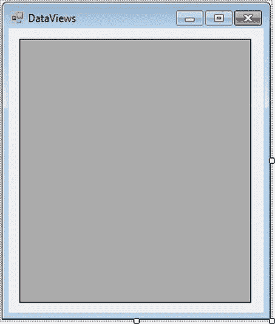

    ***图 15-7。数据视图表单的**设计视图*

5.  Double-click the empty surface of the `DataViews.cs` form, and it will open the code editor window, showing the `DataViews_Load` event. Modify the `DataViews_Load` event to look like [Listing 15-3](#list_15_3).

    ***清单 15-3。**T4`DataViews.cs`*

    `Using System.Data.SqlClient;
            private void DataViews_Load(object sender, EventArgs e)
            {
                // Connection string
                string connString = @"server=.\sql2012;database=AdventureWorks;Integrated
    Security=true";

                // Query
                string sql = @"select FirstName, MiddleName
                            from Person.Contact";

                // Create connection
                SqlConnection conn = new SqlConnection(connString);

                try
                {
                    // Create Data Adapter
                    SqlDataAdapter da = new SqlDataAdapter();` `                da.SelectCommand = new SqlCommand(sql, conn);

                    // Create and Fill Dataset
                    DataSet ds = new DataSet();

                    da.Fill(ds, "Person.Contact");

                    // Get Data Table reference
                    DataTable dt = ds.Tables["Person.Contact"];

                    // Create Data View
                    DataView dv = new DataView(dt,
                       "MiddleName = 'J.'",
                       "MiddleName",
                       DataViewRowState.CurrentRows);

                    // Display data from data view
                    gvContact.DataSource = dv;
                }

                catch (Exception ex)
                {
                    MessageBox.Show(ex.Message + ex.StackTrace);
                }

                finally
                {
                    //Connection close
                    conn.Close();
                }
            }`
6.  To set the FilterSort form as the start-up form, modify the `Program.cs` statement. `Application.Run(new FilterSort());`

    表现为:

    `Application.Run(new DataView());`

    构建项目，并通过按 Ctrl+F5 运行它。您应该在图 15-8 中看到结果。

    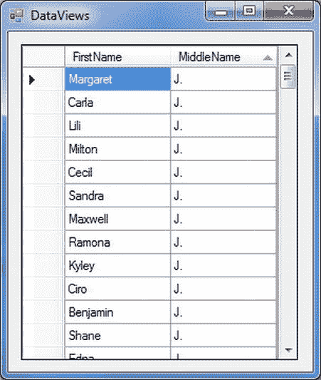

    ***图 15-8。**使用数据视图*

##### 它是如何工作的

这个程序与其他示例基本相同，所以我们将重点关注它对数据视图的使用。创建一个新的数据视图，并通过向其构造函数传递四个参数来初始化它。

`// Create Data View
DataView dv = new DataView(dt,
                   "MiddleName = 'J.'",
                   "MiddleName",
                   DataViewRowState.CurrentRows);`

第一个参数是数据表，第二个参数是数据表内容的筛选器，第三个参数是排序列，第四个参数指定要包含在数据视图中的行的类型。

`System.Data.DataViewRowState`是数据视图的底层数据表中行可以具有的状态的枚举。表 15-1 总结了这些状态。

T2】

每次添加、修改或删除一行时，它的行状态都会改变到[表 15-1](#tab_15_1) 中相应的行状态。如果您对基于特定行的状态(例如，数据表中的所有新行或所有已修改的行)检索、排序或筛选特定行感兴趣，这将非常有用。

然后，将数据视图作为数据源绑定到网格视图。

`// display data from data view
gvContact.DataSource = dv;`

就像数据行代表数据表中的一行一样，*数据行视图*(也许称之为*数据视图行*会更好)代表数据视图中的一行。您为每个数据行视图检索经过筛选和排序的列数据，并将其输出到控制台。

正如这个简单的例子所表明的，数据视图提供了一种强大而灵活的方法来动态地改变数据表中的数据。

#### 修改数据集中的数据

在接下来的几节中，您将通过一个实际的例子来演示以编程方式更新数据表中的数据的多种方法。请注意，这里您将只修改数据集中的数据，而不更新数据库中的数据。在“将更改传播到数据源”一节中，您将看到如何持久化对数据集所做的原始数据源更改。

 **注意**你对数据集的更改不会自动传播到数据库。要保存数据库中的更改，您需要再次连接到数据库并显式执行必要的更新。

##### 试试看:修改数据集中的数据表

让我们在数据表中更新一行并添加一行。

1.  选择 DataSetandDataAdapter 项目，右键单击，然后选择添加 Windows 窗体。从打开的对话框中，确保选择了 Windows 窗体，并将`Form1.cs`重命名为`ModifyDataTable.cs`。单击“确定”将该表单添加到 DataSetandDataAdapter 项目中。
2.  通过单击表单的标题栏选择 ModifyDataTable 表单，并将 Size 属性的宽度设置为 371，高度设置为 348。
3.  将 GridView 控件拖到窗体上，并将其放在窗体的中央。选择此 GridView 控件，导航到“属性”窗口，并设置以下属性:
    *   将 Name 属性设置为 gvAddress。
    *   对于 Location 属性，将 X 设置为 12，将 Y 设置为 12。
    *   将 ScrollBars 属性设置为垂直。
    *   对于“大小”属性，将“宽度”设置为 331，将“高度”设置为 287。
4.  Now your ModifyDataTable form in the Design view should look like [Figure 15-9](#fig_15_9). 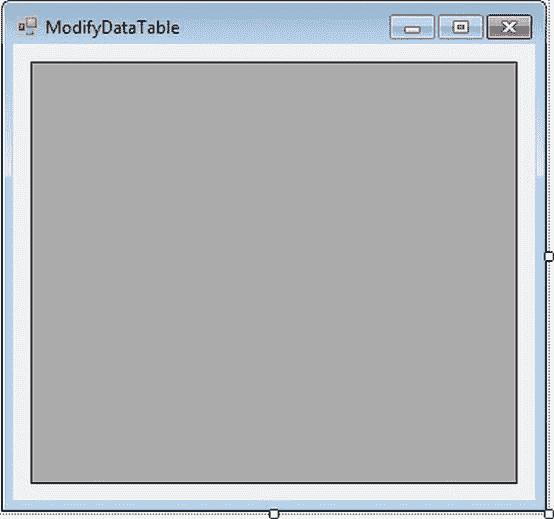

    ***图 15-9。修改后的数据表***的设计视图

5.  Double-click the empty surface of the `ModifyDataTable.cs` form, and it will open the code editor window, showing the `ModifyDataTable _Load` event. Modify the `ModifyDataTable _Load` event to look like [Listing 15-4](#list_15_4).

    ***清单 15-4。**T4`ModifyDataTable.cs`*

    `Using System.Data.SqlClient;
            private void ModifyDataTable_Load(object sender, EventArgs e)
            {
                // Connection string
                string connString = @"server=.\sql2012;database=AdventureWorks;Integrated
    Security=true";

                // Query
                string sql = @"select  AddressLine2,City,StateProvinceID,PostalCode
                            from Person.Address
                            where City = 'Bothell'";

                // Create connection
                SqlConnection conn = new SqlConnection(connString);

                try
                {
                    // Create Data Adapter
                    SqlDataAdapter da = new SqlDataAdapter();
                    da.SelectCommand = new SqlCommand(sql, conn);

                    // Create and Fill Dataset
                    DataSet ds = new DataSet();
                    da.Fill(ds, "Person.Address");

                    // Get data table reference
                    DataTable dt = ds.Tables["Person.Address"];

                    // FirstName column should be nullable
                    dt.Columns["AddressLine2"].AllowDBNull = true;

                    // Modify City in first row
                    dt.Rows[0]["City"] = "Wilmington";

                    // add a row
                    DataRow newRow = dt.NewRow();

                    newRow["PostalCode"] = "111111";
                    newRow["StateProvinceID"] = "80";
                    newRow["City"] = "Birmingham";
                    dt.Rows.Add(newRow);

                    // Display Rows
                    gvAddress.DataSource = dt;
                    gvAddress.Columns[0].Visible = false;
                    gvAddress.Rows[0].DefaultCellStyle.BackColor  =  Color.Red;` `            }
                catch (Exception ex)
                {
                    MessageBox.Show(ex.Message + ex.StackTrace);
                }

                finally
                {
                    // Connection close
                    conn.Close();
                }
            }`
6.  To set the ModifyDataTable form as the start-up form, modify the `Program.cs` statement. `Application.Run(new DataView());`

    表现为:

    `Application.Run(new ModifyDataTable());`

    构建项目，并通过按 Ctrl+F5 运行它。你的结果应该看起来像[图 15-10](#fig_15_10) 。

    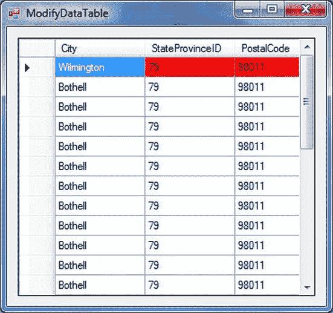

    ***图 15-10。**修改数据表*

##### 它是如何工作的

和以前一样，您在数据集中使用单个数据表。

`// Get data table reference
DataTable dt = ds.Tables["Person.Address"];`

接下来，您可以看到一个如何更改模式信息的示例。您选择 FirstName 列，它的`AllowNull`属性在数据库中被设置为`false`，并且您将它更改为`true`。

`// AddressLine2 column should be nullable
dt.Columns["AddressLine2"].AllowDBNull = true;`

请注意，如果您知道列的索引是什么，您可以使用序号索引(例如，`dt.Columns[ l ]`)，但是使用`*`选择所有列会降低可靠性，因为如果数据库表模式改变，列的位置可能会改变。

您可以使用相同的方法修改行。您只需选择适当的行，并将其列设置为您想要的任何值，当然，与列数据类型一致。下面一行显示数据集第一行的 City 列被更改为 Wilmington:

`// Modify City in first row
dt.Rows[o]["city"] = "Wilmington";`

接下来，向数据表中添加一个新行。

`// Add a row
DataRow newRow = dt.NewRow();

newRow["PostalCode"] = "111111";
newRow["StateProvinceID"] = "80";
newRow["City"] = "Birmingham";
dt.Rows.Add(newRow);`

`NewRow`方法创建一个数据行(一个`System.Data.DataRow`实例)。使用数据行的索引器为其列赋值。最后，将新行添加到数据表中，调用数据表的`Rows`属性上的`Add`方法，该属性引用 rows 集合。

更新数据源需要了解有关数据适配器方法和属性的更多信息。现在让我们来看看这些。

#### 将更改传播到数据源

您已经看到了数据适配器如何填充数据集的数据表。您还没有看到的是数据适配器如何更新和同步数据源与数据集中的数据。它有三个属性支持这一点(类似于它的`SelectCommand`属性，它支持查询)。

> *   `InsertCommand`
> *   `UpdateCommandDeleteCommand`

我们将简单描述一下`InsertCommand`，然后将其付诸实践。

#### 插入命令属性

数据适配器使用`InsertCommand`属性将行插入到表中。在调用`Update`方法时，将搜索添加到数据表中的所有行，并将其传播到数据库。

##### 尝试一下:向数据源传播新的数据集行

让我们向数据库传播一个新行，这是清单 15-5 中[的另一个变体。](#list_15_5)

1.  选择 DataSetandDataAdapter 项目，右键单击，然后选择“添加 Windows 窗体”。从打开的对话框中，确保选择了 Windows 窗体，并将`Form1.cs`重命名为`PersistAdds.cs`。单击“确定”将该表单添加到 DataSetandDataAdapter 项目中。
2.  通过单击窗体的标题栏选择 PersistAdds 窗体，并将 Size 属性的宽度设置为 452，高度设置为 163。
3.  将 TextBox 控件拖到窗体上，并将其放在窗体的中央。选择此 TextBox 控件，导航到“属性”窗口，并设置以下属性:
    *   将“名称”属性设置为 txtDepartment。
    *   对于 Location 属性，将 X 设置为 12，将 Y 设置为 12。
    *   对于“大小”属性，将“宽度”设置为 412，将“高度”设置为 95。
    *   将文本属性留空。
4.  Now your PersistAdds form in the Design view should look like [Figure 15-11](#fig_15_11). 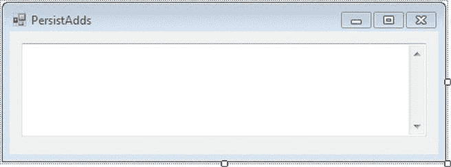

    ***图 15-11。**持久添加表单的设计视图*

5.  Double-click the empty surface of the `PersistAdds.cs` form, and it will open the code editor window, showing the `PersistAdds _Load` event. Modify the `PersistAdds _Load` event to look like [Listing 15-5](#list_15_5).

    ***清单 15-5。**`PersistAdds.cs`T5】*

    `Using System.Data.SqlClient;
           private void PersistAdds_Load(object sender, EventArgs e)
            {
                // Connection string
                string connString = @" server=.\sql2012;database=AdventureWorks;Integrated
    Security=true";

                // Query
                string qry = @" select *
                               from HumanResources.Department
                                where GroupName = 'Sales'";

                // SQL to insert employees
                string ins = @"insert into HumanResources.Department
                               (Name,GroupName, ModifiedDate)        
                                values(@Name, @GroupName, @ModifiedDate)";

                // Create connection
                SqlConnection conn = new SqlConnection(connString);

                try
                {
                    // Create data adapter
                    SqlDataAdapter da = new SqlDataAdapter();
                    da.SelectCommand = new SqlCommand(qry, conn);

                    // Create and fill data set
                    DataSet ds = new DataSet();
                    da.Fill(ds, "HumanResources.Department");

                    // Get data table reference
                    DataTable dt = ds.Tables["HumanResources.Department"];

                    // Add a row
                    DataRow newRow = dt.NewRow();
                    newRow["Name"] = "Microsoft Development";
                    newRow["GroupName"] = "Global Development";
                    newRow["ModifiedDate"] = "2012-04-28";
                    dt.Rows.Add(newRow);

                    // Display rows
                    foreach (DataRow row in dt.Rows)
                    {

                         txtDepartment.AppendText(row["Name"].ToString());
                         txtDepartment.AppendText("\t");
                         txtDepartment.AppendText(row["GroupName"].ToString());
                         txtDepartment.AppendText("\t");
                         txtDepartment.AppendText(row["ModifiedDate"].ToString());` `                     txtDepartment.AppendText("\n");
                    }

                    // Create command
                    SqlCommand cmd = new SqlCommand(ins, conn);
                    //
                    // Map parameters
                    cmd.Parameters.Add("@Name", SqlDbType.NVarChar, 50,"Name");
                    cmd.Parameters.Add("@GroupName",SqlDbType.NVarChar,50,"GroupName");
                    cmd.Parameters.Add("@ModifiedDate",SqlDbType.DateTime,25,"ModifiedDate");

                    // Insert department
                    da.InsertCommand = cmd;
                    da.Update(ds, "HumanResources.Department");
                }
                catch (Exception ex)
                {
                    MessageBox.Show(ex.Message + ex.StackTrace);
                }

                finally
                {
                    //Connection close
                    conn.Close();
                }
            }`
6.  To set the PersistAdds form as the start-up form, modify the `Program.cs` statement. `Application.Run(new ModifyDataTable());`

    表现为:

    `Application.Run(new PersistAdds());`

    构建项目，并通过按 Ctrl+F5 运行它。您应该在图 15-12 中看到结果。

    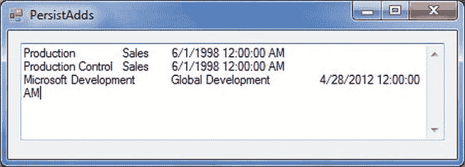

    ***图 15-12。**增加一行*

##### 它是如何工作的

你添加一个`INSERT`语句。

`string ins = @"insert into HumanResources.Department
            (Name,GroupName, ModifiedDate)        
            values(@Name, @GroupName, @ModifiedDate)";`

为`INSERT`查询创建一个命令。

`// create command
SqlCommand cmd = new SqlCommand(ins, conn);`

然后配置命令参数。您将为其提供值的三列分别映射到一个命名的命令参数。您不需要提供主键值，因为它是由 SQL Server 生成的。

`// Map parameters
 cmd.Parameters.Add("@Name", SqlDbType.NVarChar, 50,"Name");
 cmd.Parameters.Add("@GroupName",SqlDbType.NVarChar,50,"GroupName");
 cmd.Parameters.Add("@ModifiedDate",SqlDbType.DateTime,25,"ModifiedDate");`

最后，用插入到 Department 表中的命令设置数据适配器的`InsertCommand`属性，这样当您调用它的`Update`方法时，它将是数据适配器执行的 SQL。然后调用数据适配器上的`Update`,将更改传播到数据库。这里只添加了一行，但是由于 SQL 是参数化的，数据适配器将在 HumanResources 中查找所有新行。部门数据表，并向数据库提交所有这些数据表的插入内容。

`// Insert department
da.InsertCommand = cmd;
da.Update(ds, "HumanResources.Department");`

[图 15-12](#fig_15_12) 显示了新行，如果您使用数据库浏览器或 SQL Server 2012 的 SSMS 进行检查，您会看到该行已被传播到数据库。微软开发现在在部门表中。

#### 指挥建设者

虽然很简单，但是为`UpdateCommand`、`InsertCommand`和`DeleteCommand`属性编写 SQL 语句有点麻烦，所以每个数据提供者都有自己的*命令构建器。*如果一个数据表对应一个数据库表，您可以使用命令生成器自动为数据适配器生成适当的`UpdateCommand`、`InsertCommand`和`DeleteCommand`属性。当调用数据适配器的`Update`方法时，这一切都是透明的。

为了能够动态生成`INSERT`、`DELETE`和`UPDATE`语句，命令生成器使用数据适配器的`SelectCommand`属性来提取数据库表的元数据。如果在调用`Update`方法后对`SelectCommand`属性进行了任何更改，您应该调用命令构建器上的`RefreshSchema`方法来相应地刷新元数据。

要创建命令生成器，需要创建数据提供程序的命令生成器类的实例，将数据适配器传递给其构造函数。例如，以下代码创建了一个 SQL Server 命令生成器:

`SqlDataAdapter da = new SqlDataAdapter();
SqlCommandBuilder cb = new SqlCommandBuilder(da);`

 **注意**为了使命令生成器工作，`SelectCommand`数据适配器属性必须包含一个查询，该查询返回数据库表的主键或唯一键。如果不存在，就会生成一个`InvalidOperation`异常，并且不会生成命令。

##### 尝试一下:使用 SqlCommandBuilder

在这里，您将使用 SqlCommand Builder 向数据库中插入一行。

1.  选择 DataSetandDataAdapter 项目，右键单击，然后选择添加 Windows 窗体。从打开的对话框中，确保选择了 Windows 窗体，并将`Form1.cs`重命名为`PersistAddsBuilder.cs`。单击“确定”将该表单添加到 DataSetandDataAdapter 项目中。
2.  通过单击窗体的标题栏选择 PersistAddsBuilder 窗体，并将 Size 属性的宽度设置为 483，高度设置为 151。
3.  将 TextBox 控件拖到窗体上，并将其放在窗体的中央。选择此 TextBox 控件，导航到“属性”窗口，并设置以下属性:
    *   将 Name 属性设置为 txtDepartment。
    *   对于 Location 属性，将 X 设置为 12，将 Y 设置为 12。
    *   对于 Size 属性，将 Width 设置为 441，Height 设置为 89。
    *   将文本属性留空。
4.  Now your PersistAddsBuilder form in the Design view should look like [Figure 15-13](#fig_15_13). 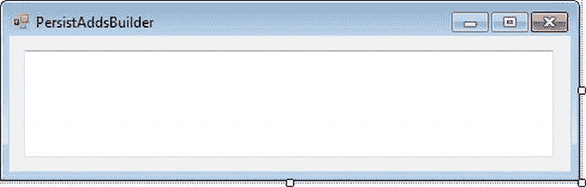

    ***图 15-13。**PersistAddsBuilder 表单的设计视图*

5.  Double-click the empty surface of the `PersistAddsBuilder.cs` form, and it will open the code editor window, showing the `PersistAddsBuilder _Load` event. Modify the `PersistAddsBuilder _Load` event to look like [Listing 15-6](#list_15_6).

    ***清单 15-6。**`PersistAddsBuilder.cs`T5】*

    `Using System.Data.SqlClient;
            private void PersistAddsBuilder_Load(object sender, EventArgs e)
            {
                // Connection string
                string connString = @"server=.\sql2012;database=AdventureWorks;Integrated
    Security=true";

                // Query
                string qry = @" select *
                              from HumanResources.Department
                               where GroupName = 'Research and Development' ";

                // Create connection
                SqlConnection conn = new SqlConnection(connString);

                try
                {
                    // Create Data Adapter
                    SqlDataAdapter da = new SqlDataAdapter();
                    da.SelectCommand = new SqlCommand(qry, conn);

                    // Create command builder
                    SqlCommandBuilder cb = new SqlCommandBuilder(da);

                    // Create and Fill Dataset
                    DataSet ds = new DataSet();
                    da.Fill(ds, "HumanResources.Department");

                    // Get Data Table reference
                    DataTable dt = ds.Tables["HumanResources.Department"];

                    // Add a row
                    DataRow newRow = dt.NewRow();
                    newRow["Name"] = "Language Design";
                    newRow["GroupName"] = "Research and Development";
                    newRow["ModifiedDate"] = "2012-04-29";

                    dt.Rows.Add(newRow);

                    // Display rows
                    foreach (DataRow row in dt.Rows)
                    {
                        txtDepartment.AppendText(row["Name"].ToString());
                        txtDepartment.AppendText("\t\t");
                        txtDepartment.AppendText(row["GroupName"].ToString());
                        txtDepartment.AppendText("\t");
                        txtDepartment.AppendText(row["ModifiedDate"].ToString());
                        txtDepartment.AppendText("\n");                  
                    }` `                // Insert department
                    da.Update(ds, "HumanResources.Department");
                  }

                catch (Exception ex)
                {
                    MessageBox.Show(ex.Message + ex.StackTrace);
                }

                finally
                {
                    //Connection close
                    conn.Close();
                }
            }`
6.  To set the PersistAddsBuilder form as the start-up form, modify the `Program.cs` statement. `Application.Run(new PersistAdds());`

    表现为:

    `Application.Run(new PersistAddsBuilder());`

    构建项目，并通过按 Ctrl+F5 运行它。您应该在图 15-14 中看到结果。

    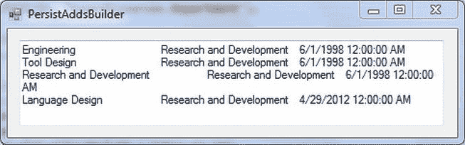

    ***图 15-14。**使用命令生成器添加一行*

##### 它是如何工作的

最值得注意的不是你添加的行(是的，只是一个加一个注释)和你替换的行一样多。

`// create command builder
SqlCommandBuilder cb = new SqlCommandBuilder(da);

 // Add a row
 DataRow newRow = dt.NewRow();
 newRow["Name"] = "Language Design";
 newRow["GroupName"] = "Research and Development";` ` newRow["ModifiedDate"] = "2012-04-29";

 dt.Rows.Add(newRow);`

显然，使用命令生成器比手工编码 SQL 更可取；但是，请记住，它们只对单个表有效，并且底层数据库表必须有一个主键或唯一键。此外，数据适配器`SelectCommand`属性必须有一个包含键列的查询。

 **注意**虽然所有五个数据提供者都在。NET Framework 类库有命令生成器类，但在定义它们的`System.Data`命名空间中不存在任何类或接口。因此，如果您想了解更多关于命令构建器的知识，最好从您感兴趣的构建器的描述开始。`System.Data.DataSet`类和`System.Data.IDataAdapter`接口定义了命令构建器与之交互的底层组件，它们的文档提供了对命令构建器的约束的非正式规范。

#### 并发

您已经看到，用数据集和数据适配器更新数据库相对简单。然而，我们把事情过于简单化了；您一直假设在处理断开连接的数据集时，没有对数据库进行其他更改。

假设两个不同的用户试图对数据集中的同一行进行冲突性的更改，然后试图将这些更改传播到数据库。会发生什么？数据库如何解决冲突？哪一行首先更新，第二个更新，还是根本不更新？答案不清楚。正如许多现实世界中的数据库问题一样，这完全取决于各种因素。然而，ADO.NET 提供了基本级别的并发控制，旨在防止更新异常。细节已经超出了本书的范围，但是下面是一个很好的概念性的开始。

基本上，数据集标记所有添加、修改和删除的行。如果某一行被传播到数据库，但在填充数据集后被其他人修改了，则该行的数据操作操作将被忽略。这种技术被称为*开放式并发*，本质上是数据适配器的工作。当调用`Update`方法时，数据适配器试图协调所有的更改。这在用户很少争用相同数据的环境中工作得很好。

这种类型的并发不同于所谓的*悲观并发，*悲观并发在修改时*锁定*行(有时甚至在检索时)以避免冲突。大多数数据库管理器使用某种形式的锁定来保证数据完整性。

开放式并发的非连接处理对于成功的多层系统是必不可少的。鉴于数据库管理系统的悲观并发性，如何最有效地利用它是一个棘手的问题。现在不要担心这个问题，但是请记住，存在许多问题，您的应用越复杂，您就越有可能成为并发方面的专家。

### 使用数据集和 XML

XML 是. NET 中数据传输的基本媒介。事实上，XML 是 ADO.NET 的主要基础。数据集以 XML 格式在内部组织数据，并有多种方法来读写 XML。例如:

> *   You can use `ReadXmlSchema` and `WriteXmlSchema` methods of `System.Data.DataSet` to import and export the data set structure as XML schema.
> *   You can read the data (and optional mode) of the dataset from `ReadXml()` and use `WriteXml().` to write it into an xml file, which is useful when exchanging data with another application or making a local copy of the dataset.
> *   You can bind the dataset to an XML document (an instance of `System.Xml.XmlDataDocument`). Data set and data document are *synchronized,* so it can be modified by ADO.NET or XML operation.

让我们看看其中的一个例子:将数据集复制到 XML 文件中。

 **注意**如果您不熟悉 XML，不要担心。ADO.NET 不需要任何详细的知识。当然，你知道的越多，你就越能清楚地理解正在发生的事情。

##### 试试看:将数据集提取到 XML 文件中

您可以使用数据集的`WriteXml`方法将数据集的内容和模式保存在一个 XML 文件中，或者使用`WriteXml()`和`WriteXmlSchema()`将它们保存在不同的文件中。`WriteXml()`被重载，在这个例子中，我们将展示一个提取数据和模式的版本。

1.  选择 DataSetandDataAdapter 项目，右键单击，然后选择添加 Windows 窗体。从打开的对话框中，确保选择了 Windows 窗体，并将`Form1.cs`重命名为`WriteXML.cs`。单击“确定”将该表单添加到 DataSetandDataAdapter 项目中。
2.  通过单击窗体的标题栏选择 WriteXML 窗体，并将 Size 属性的宽度设置为 289，高度设置为 124。
3.  将 Button 控件拖到窗体上，并将其放在窗体的中央。选择此按钮控件，导航到“属性”窗口，并设置以下属性:
    *   将 Name 属性设置为 btnXML。
    *   对于“位置”属性，将 X 设置为 74，Y 设置为 30。
    *   对于“大小”属性，将“宽度”设置为 128，将“高度”设置为 23。
    *   设置 Text 属性以生成 XML。
4.  Now your WriteXML form in the Design view should look like [Figure 15-15](#fig_15_15). 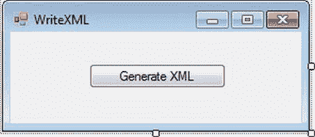

    ***图 15-15。WriteXML 表单的**设计视图*

5.  Double-click the empty surface of the `WriteXML.cs` form, and it will open the code editor window, showing the `WriteXML _Load` event. Modify the `WriteXML _Load` event to look like [Listing 15-7](#list_15_7).

    ***清单 15-7。**T4`WriteXML.cs`*

    `Using System.Data.SqlClient;
            private void btnXML_Click(object sender, EventArgs e)
            {
                // Connection string
                string connString = @" server=.\sql2012; database=AdventureWorks;
                                 Integrated Security=true";

                // Query
                string qry = @"select Name ,ProductNumber
                               from Production.Product";

                // Create connection
                SqlConnection conn = new SqlConnection(connString);

                try
                {
                    // Create Data Adapter
                    SqlDataAdapter da = new SqlDataAdapter();
                    da.SelectCommand = new SqlCommand(qry, conn);

                    // Open connection
                    conn.Open();

                    // Create and Fill Dataset
                    DataSet ds = new DataSet();
                    da.Fill(ds, "Production.Product");

                    // Extract data set to XML file
                    ds.WriteXml(@"c:\productstable.xml");
                    MessageBox.Show("The XML file is Created");
                }

                catch (Exception ex)
                {` `MessageBox.Show(ex.Message + ex.StackTrace);
                }

                finally
                {
                    // Connection close
                    conn.Close();
                }
            }` 
6.  To set the WriteXML form as the start-up form, modify the `Program.cs` statement. `Application.Run(new PersistAddsBuilder());`

    表现为

    `Application.Run(new WriteXML());`

    构建项目，并通过按 Ctrl+F5 运行它。你的结果应该看起来像[图 15-16](#fig_15_16) 。

    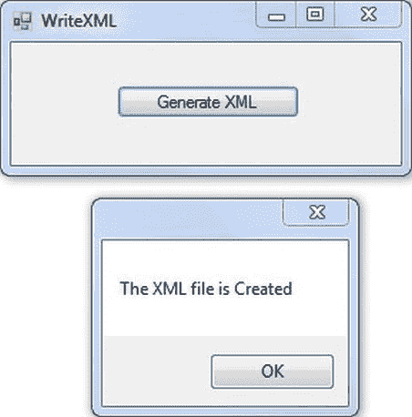

    ***图 15-16。**将数据表提取为 XML*

7.  Not much seems to have happened, but that’s because you wrote to a file rather than to the screen. Open `productstable.xml` (the path we saved this table to was c:\; if you have changed the path, please refer to that) to see the XML. (One way in Visual Studio is to use File  Open File.) [Figure 15-17](#fig_15_17) shows the XML extracted for the first five product rows. 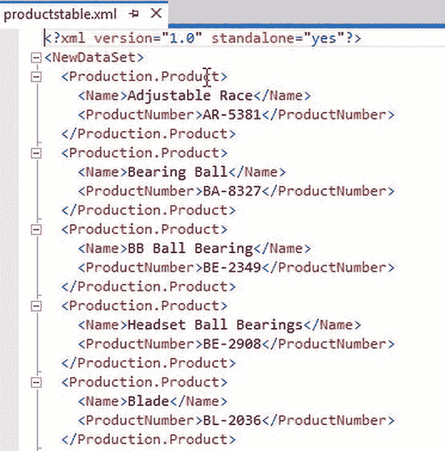

    ***图 15-17。**提取为 XML 的数据表*

 **提示**默认情况下，提取的 XML 文档是纯文本文件。您可以在任何编辑器中打开`productstable.xml`文件，甚至可以使用`type`或`more`命令从命令行查看它。

##### 它是如何工作的

首先，我们需要创建一个 Select 查询来从数据库中提取数据。

`// Query
 string qry = @"select Name ,ProductNumber
            from Production.Product";`

接下来，我们需要创建数据集和数据适配器

`  // Create Data Adapter
  SqlDataAdapter da = new SqlDataAdapter();
  da.SelectCommand = new SqlCommand(qry, conn);`

创建数据集和数据适配器后，将数据集存储到 xml 文件中。

`// Create and Fill Dataset
 DataSet ds = new DataSet();
 da.Fill(ds, "Production.Product");

// Extract dataset to XML file
ds.WriteXml(@"c:\productstable.xml");`

注意，XML 只是将数据集映射为一个层次结构。第一个 XML 元素`<NewDataSet>`是数据集名称(默认为`NewDataSet`，因为您没有指定名称)。下一个元素`<Production.Product>`使用数据表名称(因为只使用一个查询来填充数据集，所以只有一个数据表)，它嵌套在数据集元素中。数据列元素`<Name>`和`<ProductNumber>`嵌套在该元素中。

每列的数据(以纯文本形式)出现在每个列元素的*开始标记*(例如，`<Name>`)和*结束标记*(例如，`</Name>`)之间。注意，`<Production.Product>`元素代表单个行，而不是整个表格。因此，列元素包含在每行的开始标记`<Production.Product>`和结束标记`</Production.Product>`中。

如果您滚动到 XML 文件的底部，您会发现数据集的结束标记`</NewDataSet>`。

#### 了解类型化和非类型化数据集

数据集可以是*有类型的*或*无类型的。到目前为止，您使用的数据集都是无类型的。他们是`System.Data.DataSet`的实例。非类型化数据集没有内置架构。该模式只是隐式的。当您向数据集中添加表和列时，它会增长，但是这些对象是作为集合而不是 XML 模式元素公开的。但是，正如我们在上一节中提到的，您可以使用`WriteXmlSchema`(或`WriteXml`)显式导出非类型化数据集的模式。*

类型化数据集是从`System.Data.DataSet`派生的数据集，在声明数据集类时使用 XML 模式(通常在`.xsd`文件中)。模式中的信息(表、列等)被提取出来，生成 C# 代码，并进行编译，因此新的数据集类是一个实际的。NET 类型与适当的对象和属性。

类型化或非类型化数据集都同样有效，但是类型化数据集更有效，并且可以使代码更简单。例如，使用非类型化数据集，您需要这样写:

`ds.Tables[o].Rows[o]["CompanyName"];`

获取 Customers 表的 CompanyName 列的值，假设该数据表是数据集中的第一个。使用类型化数据集，您可以将它的数据表和数据列作为类成员来访问。您可以用下面的代码替换前面的代码:

` ds.Customers[o].CompanyName;`

使代码更加直观。此外，Visual Studio 代码编辑器具有对类型化数据集的智能感知支持。

类型化数据集比非类型化数据集更有效，因为类型化数据集有一个已定义的模式，当它们被数据填充时，运行时类型识别和转换是不必要的，因为这已经在编译时处理了。每次加载结果集时，非类型化数据集都有更多的工作要做。

然而，类型化数据集并不总是最佳选择。如果您正在处理定义不明确、定义动态变化或者只是暂时感兴趣的数据，非类型化数据集的灵活性可能会超过类型化数据集的优势。

这一章已经够长了。因为我们不关心小样本程序的效率，所以我们不会使用类型化数据集，我们也不需要在这里介绍如何创建它们。

本书的重点是通过向你展示如何编写基本操作来解释 C# 如何与 ADO.NET 一起工作。如果你能自己编写代码，你就能理解 C# 在为你生成东西时做了什么，就像下一章关于使用 Windows 窗体一样。这对理解如何配置生成的组件和调试使用它们的应用是非常宝贵的。

虽然您可以自己编写一个`.xsd`文件(或者用`System.Data.DataSet.WriteXmlSchema()`为非类型化数据集导出一个 XSL 模式并修改它)，然后使用`xsd.exe`实用程序为类型化数据集创建一个类，但是这需要做大量的工作，容易出错，而且您很少(如果有的话)想要或需要这样做。

### 总结

在本章中，我们介绍了数据集和数据适配器的基础知识。数据集是具有数据表集合的数据的关系表示，每个数据表都具有数据行和数据列的集合。数据适配器是一个对象，它控制如何将数据加载到数据集(或数据表)中，以及如何将数据集数据的更改传播回数据源。

我们介绍了填充和访问数据集的基本技术，演示了如何过滤和排序数据表，并指出尽管数据集是独立于数据库的对象，但断开连接的操作并不是默认模式。

我们讨论了如何使用参数化 SQL 和数据适配器的`UpdateCommand`、`InsertCommand`和`DeleteCommand`属性将数据修改传播回数据库，以及命令构建器如何简化单表更新。

我们简要地提到了并发的重要问题，然后介绍了 XML，ADO.NET 背后的基础技术。

最后，我们讨论了类型化和非类型化数据集。

既然你已经看到、理解并实践了 Windows 应用的 ADO.NET，在下一章中，我们将探索在 ASP.NET 应用中使用数据控制。*