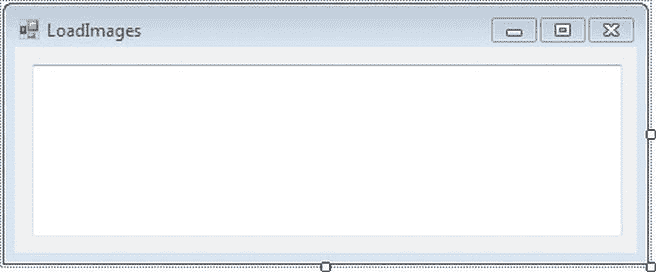
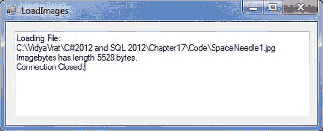
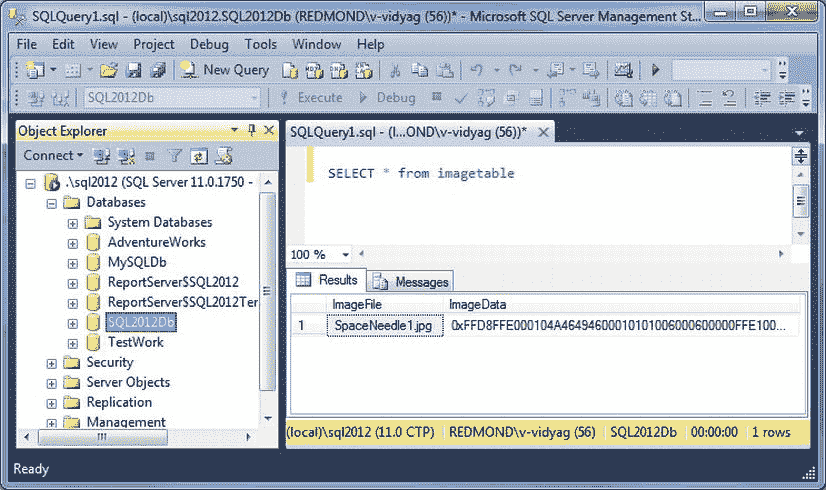
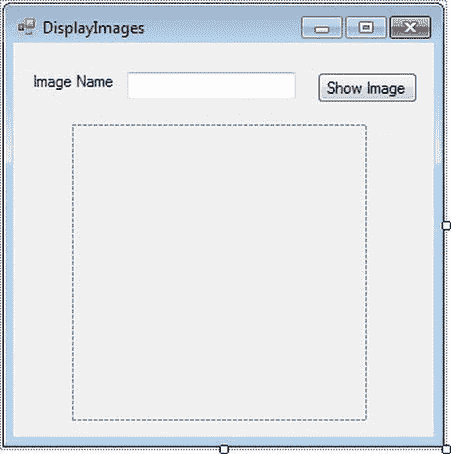
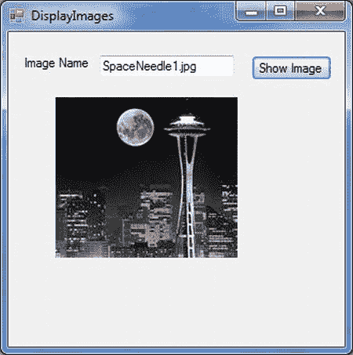
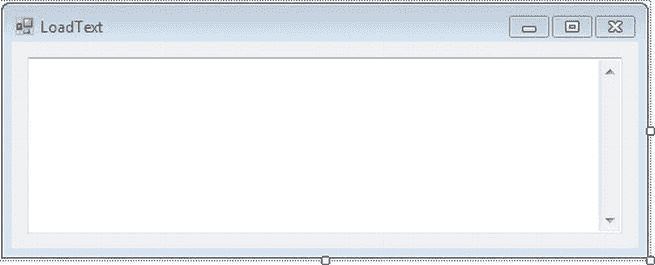
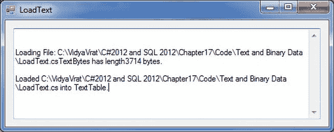
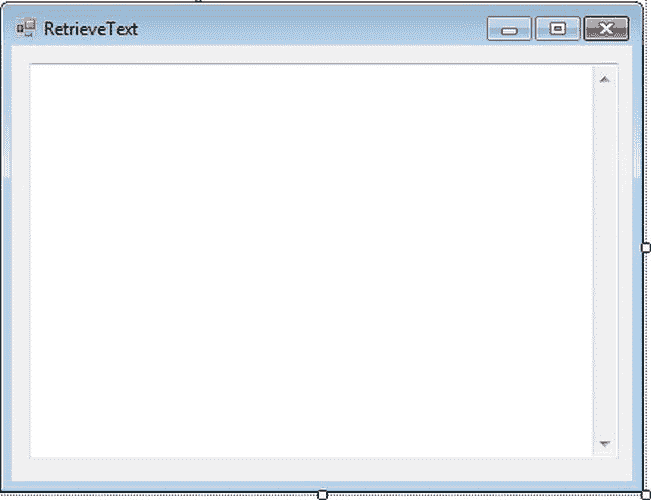
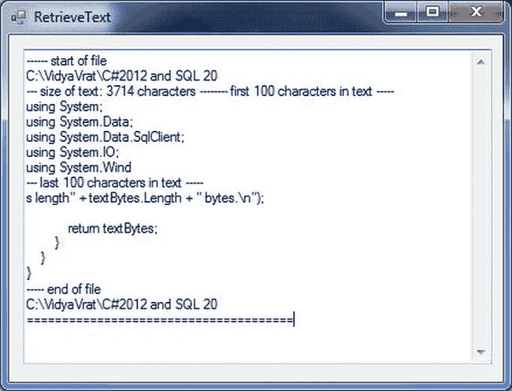

# 十七、使用文本和二进制数据

有些类型的数据有特殊的格式，非常大，或者大小变化很大。在这里，我将向您展示处理文本和二进制数据的技术。在本章中，我将介绍以下内容:

> *   Understanding SQL Server Text and Binary Data Types
> *   Storing images in a database
> *   Retrieve images from the database
> *   Handling text data

我还将展示用于在`tempdb`数据库中创建表的 T-SQL，它旨在保存任何临时表。我将首先介绍哪些数据类型支持这些类型的数据。

### 了解 SQL Server 文本和二进制数据类型

SQL Server 提供了类型`CHAR`、`NCHAR`、`VARCHAR`、`NVARCHAR`、`BINARY`和`VARBINARY`，用于处理相当小的文本和二进制数据。您可以将这些用于最大 8，000 字节的文本(字符)数据(Unicode 数据为 4，000 字节，`NCHAR`和`NVARCHAR`，每个字符使用 2 个字节)。

对于较大的数据，SQL Server 2012 称之为*大值数据类型*，您应该使用`VARCHAR(MAX)`、`NVARCHAR(MAX)`和`VARBINARY(MAX)`数据类型。`VARCHAR(MAX)`用于非 Unicode 文本，`NVARCHAR(MAX)`用于 Unicode 文本，`VARBINARY(MAX)`用于图像和其他二进制数据。

 **警告**在 SQL Server 2000 中，使用`NTEXT`、`TEXT`和`IMAGE`数据类型存储大量数据。这些数据类型已被弃用，并且在 SQL Server 的较新版本中已被删除。如果您使用遗留应用，您应该考虑将`NTEXT`、`TEXT`和`IMAGE`分别转换为`NVARCHAR(MAX)`、`VARCHAR(MAX)`和`VARBINARY(MAX)`。然而，`System.Data.SqlDbType`枚举还不包括这些数据类型的成员，所以我们对列数据类型使用`VARCHAR(MAX)`和`VARBINARY(MAX)`，但是在为命令参数指定数据类型时使用`Text`和`Image`。

使用这些数据类型的替代方法是不将数据本身存储在数据库中，而是定义一个包含指向数据实际存储位置的路径的列。这对于访问大量数据更有效，并且通过将需求转移到文件服务器可以节省数据库服务器上的资源。它确实需要更复杂的协调，并且有可能导致数据库和数据文件不同步。我不会在这一章使用这种技术。

 **提示**如果您正在使用一个不能超过 4GB 的 SQL Server Express 数据库，或者如果您不希望您的数据库存储大量信息并超过一定的大小限制，那么对于非常大的文本和图像数据，使用 SQL Server 提供的文本和二进制数据类型可能是您唯一的选择。

在 C# 程序中，二进制数据类型映射到字节数组(`byte[]`)，字符数据类型映射到字符串或字符数组(`char[]`)。

 **注意** DB2、MySQL、Oracle、SQL 标准调用此类数据类型*大型对象*(LOBs)；具体来说，它们是二进制大对象(BLOBs)和字符大对象(CLOBs)。但是，与许多数据库术语一样，BLOB 最初是否是任何事物的首字母缩略词仍有争议。不用说，它一直隐含着一种可以处理大量(无定形)数据的数据类型，SQL Server 文档使用 BLOB 作为大数据和数据类型的通称。

### 将图像存储在数据库中

让我们首先创建一个用于存储图像的数据库表，然后将一些图像加载到其中。我们将使用小图像，但使用`VARBINARY(MAX)`来存储它们。在示例中，我将演示如何使用代码目录路径`C:\VidyaVrat\C#2012 and SQL 2012\Chapter17\Code`中的图像；您可以使用计算机上一些图像所在位置的路径。

##### 试试看:从文件加载图像二进制数据

在本例中，您将编写一个程序来创建一个数据库表，然后在其中加载和存储图像。

1.  创建一个名为 [Chapter17](17.html) 的新 Windows 窗体应用项目。当解决方案资源管理器打开时，保存解决方案。
2.  将[第 17 章](17.html)项目重命名为文本和二进制数据。将`Form1.cs`文件重命名为`LoadImages.cs`。通过单击窗体的标题栏选择 LoadImages 窗体，并将 Size 属性的宽度设置为 439，高度设置为 178。
3.  将 TextBox 控件拖到窗体上，并将其放在窗体的中央。选择此 TextBox 控件，导航到“属性”窗口，并设置以下属性:
    *   将 Name 属性设置为 txtLoadImages。
    *   对于 Location 属性，将 X 设置为 12，将 Y 设置为 12。
    *   将 Multiline 属性设置为 True。
    *   对于“大小”属性，将“宽度”设置为 401，将“高度”设置为 117。
    *   将文本属性留空。
4.  Now your LoadImages form in the Design view should look like [Figure 17-1](#fig_17_1). 

    ***图 17-1。**LoadImages 表单的设计视图*

5.  Navigate to Solution Explorer, select the `LoadImages.cs` form, right-click, and select View Code; this will take you to the code editor window. Add the code to `LoadImages.cs` shown in [Listing 17-1](#list_17_1).

    ***清单 17-1。**T4`LoadImages.cs`*

    `using System.Data;
           using System.Data.SqlClient;
           using System.IO;
            // change this path to the location of image in your computer
            string imageFileLocation = @"C:\VidyaVrat\C#2012 and SQL 2012\Chapter17\Code\";

            string imageFilePrefix = "SpaceNeedle";
            string imageFileType = ".jpg";

            int numberImageFiles = 1;
            int maxImageSize = 10000;

            SqlConnection conn = null;
            SqlCommand cmd = null;

            private void LoadImages_Load(object sender, EventArgs e)
            {
               try
                {
                   // Create connection
                   conn = new SqlConnection(@"server = .\sql2012;integrated security = true;
                                          database = SQL2012Db");` `// Open connection
                   conn.Open();

                   //Create command
                   cmd = new SqlCommand();
                   cmd.Connection = conn;

                    // Create table
                    CreateImageTable();

                    // Prepare insert
                    PrepareInsertImages();

                    // Loop for Inserting images
                    for (int i = 1; i <= numberImageFiles; i++)
                    {
                        ExecuteInsertImages(i);
                    }
                }

                catch (SqlException ex)
                {
                    MessageBox.Show(ex.Message + ex.StackTrace);
                }

                finally
                {
                    // Close connection
                    conn.Close();
                    txtLoadImages.AppendText(Environment.NewLine);
                    txtLoadImages.AppendText("Connection Closed.");
                }
            }

            private void ExecuteCommand(string cmdText)
            {
                int cmdResult;
                cmd.CommandText = cmdText;
                //txtLoad.AppendText("Executing command:\n");
               // txtLoad.AppendText(cmd.CommandText);
                //txtLoad.AppendText(Environment.NewLine);
                cmdResult = cmd.ExecuteNonQuery();
            }

            private void CreateImageTable()
            {
                ExecuteCommand(@"if exists
                                  (select * from
                                    INFORMATION_SCHEMA.TABLES
                                     where TABLE_NAME = 'ImageTable')` `                               drop table ImageTable

                                   create table ImageTable
                                   (
                                       ImageFile nvarchar(20),
                                       ImageData varbinary(max)
                                   )");
            }

            private void PrepareInsertImages()
            {
                cmd.CommandText = @"insert into ImageTable
                                   values (@ImageFile, @ImageData)";

                cmd.Parameters.Add("@imagefile", SqlDbType.NVarChar, 20);
                cmd.Parameters.Add("@imagedata", SqlDbType.Image, 1000000);

                cmd.Prepare();
            }

            private void ExecuteInsertImages(int imageFileNumber)
            {
                string imageFileName = null;
                byte[] imageImageData = null;

                imageFileName = imageFilePrefix + imageFileNumber.ToString() + imageFileType;
                imageImageData = LoadImageFile(imageFileName, imageFileLocation, maxImageSize);

                cmd.Parameters["@ImageFile"].Value = imageFileName;
                cmd.Parameters["@ImageData"].Value = imageImageData;

                ExecuteCommand(cmd.CommandText);
            }

            private byte[] LoadImageFile(string fileName,string fileLocation,int maxImageSize)
            {
                byte[] imagebytes = null;
                string fullpath = fileLocation + fileName;
                txtLoadImages.AppendText("Loading File:");
                txtLoadImages.AppendText(Environment.NewLine);
                txtLoadImages.AppendText(fullpath);
                FileStream fs = new FileStream(fullpath, FileMode.Open, FileAccess.Read);
                BinaryReader br = new BinaryReader(fs);
                imagebytes = br.ReadBytes(maxImageSize);
                txtLoadImages.AppendText(Environment.NewLine);

                txtLoadImages.AppendText("Imagebytes has length " +
                        imagebytes.GetLength(0).ToString() + "bytes.");

                return imagebytes;
             }`
6.  Build the project, and run the program by pressing Ctrl+F5\. You should see output similar to that in [Figure 17-2](#fig_17_2). It shows the information for loading an image into the database that you have on your computer at the specified location, and it shows the size of each image. 

    ***图 17-2。**加载图像数据*

7.  To see the image you have inserted into the database, open SQL Server Management Studio and run a `SELECT` query on the image table you have created in the `SQL2012Db` database, which was created in [Chapter 3](03.html) (see [Figure 17-3](#fig_17_3)). 

    ***图 17-3。**查看图像数据*

##### 它是如何工作的

在`LoadImages.cs`中，除了创建和打开一个连接之外，你要做三件主要的事情。

你连接到`SQL2012Db`，你在[第 3 章](03.html)中创建的数据库。

`     // Create connection
     conn = new SqlConnection(@"server = .\sql2012;integrated security = true;
                            database = SQL2012Db");

     // Open connection
     conn.Open();`

您调用一个私有的类级方法来创建一个保存图像的表。

`// Create table
CreatelmageTable();`

您调用一个私有的类级方法来准备一个命令(是的，您最终准备了一个命令，因为您期望多次运行它)来插入图像。

`// Prepare insert
Preparelnsertlmages();`

然后循环遍历图像文件，并将它们插入到表格中。

`// Loop for Inserting images
for (int i = 1; i <= loader.numberlmageFiles; i++)
{
       ExecutelnsertImages(i);
}`

因为可能已经有一个表了，所以您必须先删除这个表(如果它存在的话),然后再创建它。该步骤在应用每次运行时重复。

当您创建一个包含图像文件名称和图像的简单表格时，您为`imagedata`列使用了`VARBINARY(MAX)`数据类型。

`        private void CreateImageTable()
        {
            ExecuteCommand(@"if exists
                              (select * from
                                INFORMATION_SCHEMA.TABLES
                                 where TABLE_NAME = 'ImageTable')

                               drop table ImageTable

                               create table ImageTable
                               (
                                   ImageFile nvarchar(20),
                                   ImageData varbinary(max)
                               )");
               }`

但是当您配置`INSERT`命令时，您使用了`SqlDbType`枚举的`Image`成员，因为没有`VARBINARY(MAX)`数据类型的成员。您为两种可变长度数据类型都指定了长度，因为如果不这样做就无法准备命令。

`private void PrepareInsertImages()
        {
            cmd.CommandText = @"insert into ImageTable
                               values (@ImageFile, @ImageData)";` `            cmd.Parameters.Add("@imagefile", SqlDbType.NVarChar, 20);
            cmd.Parameters.Add("@imagedata", SqlDbType.Image, 1000000);

            cmd.Prepare();
        }`

`Executelnsertlmages`方法接受一个整数作为图像文件名的后缀，调用`LoadlmageFile`获得包含图像的字节数组，将文件名和图像分配给它们对应的命令参数，然后执行命令插入图像。

`         private void ExecuteInsertImages(int imageFileNumber)
        {
            string imageFileName = null;
            byte[] imageImageData = null;

            imageFileName = imageFilePrefix + imageFileNumber.ToString() + imageFileType;
            imageImageData = LoadImageFile(imageFileName, imageFileLocation, maxImageSize);

            cmd.Parameters["@ImageFile"].Value = imageFileName;
            cmd.Parameters["@ImageData"].Value = imageImageData;

            ExecuteCommand(cmd.CommandText);
        }`

`LoadlmageFile`方法读取图像文件，显示文件名和文件中的字节数，并以字节数组的形式返回图像。

`        
        private byte[] LoadImageFile(string fileName,string fileLocation,int maxImageSize)
        {
            byte[] imagebytes = null;
            string fullpath = fileLocation + fileName;
            txtLoadImages.AppendText("Loading File:");
            txtLoadImages.AppendText(Environment.NewLine);
            txtLoadImages.AppendText(fullpath);
            FileStream fs = new FileStream(fullpath, FileMode.Open, FileAccess.Read);
            BinaryReader br = new BinaryReader(fs);
            imagebytes = br.ReadBytes(maxImageSize);
            txtLoadImages.AppendText(Environment.NewLine);

            txtLoadImages.AppendText("Imagebytes has length " +
                  imagebytes.GetLength(0).ToString() + " bytes.");

            return imagebytes;
        }`

#### 从数据库中检索图像

现在您已经存储了一些图像，您将看到如何使用 Windows 窗体应用检索和显示它们。

##### 试试看:显示储存的图像

要显示您存储的图像，请按照以下步骤操作:

1.  选择文本和二进制数据项目，右键单击，并选择添加窗口窗体。在打开的对话框中，确保选中 Windows Form，并将`Form1.cs`重命名为`DisplayImages.cs`；单击“确定”将该表单添加到文本和二进制数据项目中。
2.  选择 DisplayImages 窗体，并将 Size 属性的宽度设置为 330，高度设置为 332。
3.  将 Label 控件拖到窗体上，并将其放在窗体的左上角。选择此标签控件，导航到“属性”窗口，并设置以下属性:
    *   将 Name 属性设置为 lblImageName。
    *   对于 Location 属性，将 X 设置为 12，将 Y 设置为 22。
    *   对于文本属性，设置为图像名称。
4.  将 TextBox 控件拖到窗体上，并将其放置在 Label 控件旁边。选择此 TextBox 控件，导航到“属性”窗口，并设置以下属性:
    *   将 Name 属性设置为 txtImageName。
    *   对于“位置”属性，将 X 设置为 85，Y 设置为 22。
    *   将文本属性留空。
5.  将 Button 控件拖到窗体上，并将其放置在 TextBox 控件的旁边。选择此按钮控件，导航到“属性”窗口，并设置以下属性:
    *   将 Name 属性设置为 btnShowImage。
    *   对于 Location 属性，将 X 设置为 277，将 Y 设置为 22。
    *   设置 Text 属性以显示图像。
6.  将 PictureBox 控件拖到窗体上，并将其放在窗体的中央。选择此 PictureBox 控件，导航到“属性”窗口，并设置以下属性:
    *   将 Name 属性设置为 ptbImage。
    *   对于位置属性，将 X 设置为 44，将 Y 设置为 61。
    *   对于 Size 属性，将 Height 设置为 220，Width 设置为 221。
7.  Now your DisplayImages form in the Design view should look like [Figure 17-4](#fig_17_4). 

    ***图 17-4。**显示图像表单的设计视图*

8.  Add a new class named `Images` to this Windows Form project. To add this, select the Text and Binary Data project, right-click, select Class… in the Add New Item dialog, name the class `Images.cs`, and click Add to have it listed under your project. Once it’s added, replace the code in `Images.cs` with the code in [Listing 17-2](#list_17_2).

    ***清单 17-2。**我`mages.cs`T4】*

    `using System.Data.SqlClient;
    using System.IO;
    using System.Drawing;

    namespace Text_and_Binary_Data
    {
        public class Images
        {
            string imageFilename = null;
            byte[] imageBytes = null;

            SqlConnection imageConnection = null;
            SqlCommand imageCommand = null;
            SqlDataReader imageReader = null;

            // Constructor
            public Images()
            {` `            imageConnection = new SqlConnection(@"data source = .\sql2012;
                         integrated security = true; initial catalog = SQL2012db;");

                imageCommand = new SqlCommand(@" select imagefile,imagedata
                                               from ImageTable", imageConnection);

                // Open connection and create data reader
                imageConnection.Open();
                imageReader = imageCommand.ExecuteReader();
            }

            public Bitmap GetImage()
            {
                MemoryStream ms = new MemoryStream(imageBytes);
                Bitmap bmap = new Bitmap(ms);

                return bmap;
            }

            public string GetFilename()
            {
                return imageFilename;
            }

            public bool GetRow()
            {
                if (imageReader.Read())
                {
                    imageFilename = (string)imageReader.GetValue(0);
                    imageBytes = (byte[])imageReader.GetValue(1);

                    return true;
                }
                else
                {
                    return false;
                }
            }

            public void EndImages()
            {
                // Close the reader and the connection.
                imageReader.Close();
                imageConnection.Close();
            }
        }
    }`
9.  Next, insert the code in [Listing 18-3](18.html#list_18_3) into `Displaylmages.cs` in the constructor. You can access `Displaylmages.cs` by right-clicking `Displaylmages.cs` and selecting View Code, which will take you to the Code view.

    ***清单 17-3。**初始化`DisplayImages`构造器*中的图像显示

    `        public DisplayImages()
            {
                InitializeComponent();

                if (images.GetRow())
                {
                    this.txtImageName.Text = images.GetFilename();
                    this.ptbImage.Image = (Image)images.GetImage();
                }
                else
                {
                    this.txtImageName.Text = "DONE";
                    this.ptbImage.Image = null;
                }
            }`
10.  Insert the code in [Listing 18-3](18.html#list_18_3) into the btnShowImage button’s `Click` event handler. You can access the `btnShowImage_Click` event handler by navigating to the Design view of the DisplayImages form and double-clicking the btnShowImage Button control.

    ***列表 17-4。** `btnShowImage_Click`事件中的`DisplayImages.cs`*

    ` private void btnShowImage_Click(object sender, EventArgs e)
       {
                if (images.GetRow())
                {
                    this.txtImageName.Text = images.GetFilename();
                    this.ptbImage.Image = (Image)images.GetImage();
                }
                else
                {
                    this.txtImageName.Text = "DONE";
                    this.ptbImage.Image = null;
                }
     }`
11.  To set the TypedAccessor form as the start-up form, modify the `Program.cs` statement. `Application.Run(new LoadImages());`

    表现为

    `Application.Run(new DisplayImages());`

    构建项目，按 Ctrl+F5 运行它。你应该在图 17-5 中看到结果。

***图 17-5。**显示图像*

##### 它是如何工作的

您声明一个类型`Images`来访问数据库，并为表单组件提供方法来轻松获取和显示图像。在它的构造函数中，您连接到数据库并创建一个数据读取器来处理检索您之前存储的所有图像的查询结果集。

`       // Constructor
        public Images()
        {
            imageConnection = new SqlConnection(@"data source = .\sql2012;
                        integrated security = true; initial catalog = SQL2012db;");

            imageCommand = new SqlCommand(@" select imagefile,imagedata
                                          from ImageTable", imageConnection);

            // Open connection and create data reader
            imageConnection.Open();
            imageReader = imageCommand.ExecuteReader();
        }`

当表单初始化时，新代码创建一个`Images`实例，用`GetRow()`查找图像，如果找到一个，分别用`GetFilename`和`Getlmage`方法将文件名和图像分配给文本框和图片框。

`  images = new Images();
  if (images.GetRow())
  {
       this.textBoxl.Text = images.GetFilename();
       this.pictureBoxl.Image = (Image)images.GetImage();
  }
  else
  {
       this.textBoxl.Text = "DONE";
       this.pictureBoxl.Image = null;
  }`

您在 Next 按钮的`click`事件处理程序中使用相同的`if`语句来查找下一个图像。如果没有找到，您在文本框中显示单词 *DONE* 。

图像以字节数组的形式从数据库返回。PictureBox 控件的 Image 属性可以是`Bitmap`、`Icon`或`Metafile`(所有`Image`的派生类)。`Bitmap`支持多种格式，包括 BMP、GIF、JPEG。这里显示的`getImage`方法返回一个`Bitmap`对象:

`public Bitmap GetImage()
{
    MemoryStream ms = new MemoryStream(imageBytes);
    Bitmap bmap = new Bitmap(ms);

    return bmap;
}`

`Bitmap`的构造函数不接受字节数组，但它会接受一个`MemoryStream`(它实际上是一个文件的内存表示)，而`MemoryStream`有一个接受字节数组的构造函数。因此，从字节数组创建一个内存流，然后从内存流创建一个位图。

#### 处理文本数据

除了用于数据库列的数据类型之外，处理文本类似于处理图像。

##### 试试看:从文件中加载文本数据

要从文件加载文本数据，请按照下列步骤操作:

1.  选择文本和二进制数据项目，右键单击，并选择添加窗口窗体。在打开的对话框中，确保选中 Windows Form，并将`Form1.cs`重命名为`LoadText.cs`；单击“确定”将该表单添加到文本和二进制数据项目中。
2.  选择 LoadText 表单，并将 Size 属性的宽度设置为 496，高度设置为 196。
3.  将 TextBox 控件拖到窗体上，并将其放在窗体的中央。选择此 TextBox 控件，导航到“属性”窗口，并设置以下属性:
    *   将 Name 属性设置为 txtLoadText。
    *   对于 Location 属性，将 X 设置为 12，将 Y 设置为 12。
    *   对于“大小”属性，将“宽度”设置为 456，将“高度”设置为 135。
    *   将文本属性留空。
4.  Now your LoadText form in the Design view should look like [Figure 17-6](#fig_17_6). 

    ***图 17-6。**LoadText 表单的设计视图*

5.  Next, insert the code in [Listing 17-5](#list_17_5) into `LoadText.cs`. You can access `LoadText.cs` by right-clicking `LoadText.cs` and selecting View Code, which will take you to the Code view.

    ***清单 17-5。**T4`LoadText.cs`*

    `using System.Data;
    using System.Data.SqlClient;
    using System.IO

    static string fileName =
              @"C:\VidyaVrat\C#2012 and SQL 2012\Chapter17\Code\Text and Binary Data\LoadText.cs";

            SqlConnection conn = null;
            SqlCommand cmd = null;

            public LoadText()
            {
                InitializeComponent();
            }

            private void LoadText_Load(object sender, EventArgs e)
            {
                try
                {
                    // Create connection
                    conn = new SqlConnection(@"data source = .\sql2012;
                          integrated security = true;initial catalog = SQL2012Db;");

                    //Create command` `cmd = new SqlCommand();
                    cmd.Connection = conn;

                    // Open connection
                    conn.Open();

                    // Create table
                    CreateTextTable();

                    // Prepare insert command
                    PrepareInsertTextFile();

                    // Load text file
                    ExecuteInsertTextFile(fileName);

                    txtLoadText.AppendText("Loaded "+fileName+" into TextTable.\n");

                }
                catch (SqlException ex)
                {
                    MessageBox.Show(ex.ToString());
                }
                finally
                {
                    // Close connection
                    conn.Close();
                }
            }

            private void CreateTextTable()
            {
                ExecuteCommand(@"if exists(select *
                                      from INFORMATION_SCHEMA.TABLES
                                      where TABLE_NAME = 'TextTable')

                                drop table TextTable ");

                ExecuteCommand(@"create table TextTable
                               (
                                     TextFile varchar(255),
                                     TextData varchar(max)
                               )");
            }

            private void ExecuteCommand(string commandText)
            {
                cmd.CommandText = commandText;
                cmd.ExecuteNonQuery();
                txtLoadText.AppendText("\n");
            }

            private void PrepareInsertTextFile()` `        {
                cmd.CommandText = @"insert into TextTable
                                    values (@textfile, @textdata)";

                cmd.Parameters.Add("@textfile", SqlDbType.NVarChar, 30);
                cmd.Parameters.Add("@textdata", SqlDbType.Text, 1000000);
            }

            private void ExecuteInsertTextFile(string textFile)
            {
                string textData = GetTextFile(textFile);
                cmd.Parameters["@textfile"].Value = textFile;
                cmd.Parameters["@textdata"].Value = textData;
                ExecuteCommand(cmd.CommandText);
            }

            private string GetTextFile(string textFile)
            {
                string textBytes = null;
                txtLoadText.AppendText("Loading File: " + textFile);

                FileStream fs = new FileStream(textFile, FileMode.Open, FileAccess.Read);
                StreamReader sr = new StreamReader(fs);
                textBytes = sr.ReadToEnd();

                txtLoadText.AppendText("TextBytes has length" + textBytes.Length + " bytes.\n");

                return textBytes;
            }`
6.  To set the LoadText form as the start-up form, modify the `Program.cs` statement. `Application.Run(new DisplayImages());`

    表现为

    `Application.Run(new LoadText());`

    构建项目，并通过按 Ctrl+F5 运行它。您应该在图 17-7 中看到结果。

    

    ***图 17-7。**将文本文件加载到表格中*

##### 它是如何工作的

您只需加载 LoadText 程序的源代码。

`// change this path to the location of text in your computer
        static string fileName =
          @"C:\VidyaVrat\C#2012 and SQL 2012\Chapter17\Code\Text and Binary Data\LoadText.cs";`

使用 insert starement 和 add 参数设置 CommandText:

`  cmd.CommandText = @"insert into TextTable
                    values (@textfile, @textdata)";

  cmd.Parameters.Add("@textfile", SqlDbType.NVarChar, 30);
  cmd.Parameters.Add("@textdata", SqlDbType.Text, 1000000);`

执行命令删除现有表并创建一个新表:

`ExecuteCommand(@"if exists(select *
                      from INFORMATION_SCHEMA.TABLES
                      where TABLE_NAME = 'TextTable')
                      drop table TextTable ");

            ExecuteCommand(@"create table TextTable
                           (
                                 TextFile varchar(255),
                                 TextData varchar(max))"
                          );`

请注意，您首先检查该表是否存在。如果是这样，您可以删除它，以便重新创建它。

 **注意**`information_schema.tables`*视图*(一个命名查询)与同名的 SQL 标准`INFORMATION_SCHEMA`视图兼容。它将您可以看到的表限制为您可以访问的表。微软建议您使用新的*目录视图*来获取 SQL Server 2012 中的数据库元数据，SQL Server 本身在内部使用它们。这个查询的目录视图应该是`sys.tables`，列名应该是 name。我们在这里使用了`INFORMATION SCHEMA`视图，因为您可能仍然会经常看到它。

`GetTextFile`使用的是`StreamReader`(从`System.IO`派生而来)，而不是您用于图像的`BinaryReader`。`TextReader`)将文件的内容读入一个`string`。

`private string GetTextFile(string textFile)
        {
            string textBytes = null;
            txtLoadText.AppendText("Loading File: " + textFile);

            FileStream fs = new FileStream(textFile, FileMode.Open, FileAccess.Read);
            StreamReader sr = new StreamReader(fs);
            textBytes = sr.ReadToEnd();` `            txtLoadText.AppendText("TextBytes has length" + textBytes.Length + " bytes.\n");

            return textBytes;
        }`

否则，处理逻辑基本上与您在整本书中多次看到的一样:打开一个连接，访问一个数据库，然后关闭连接。

现在让我们检索您刚刚存储的文本。

#### 从文本列中检索数据

从文本列中检索数据就像从较小的字符数据类型中检索数据一样。现在，您将编写一个简单的控制台程序来看看这是如何工作的。

##### 试试看:检索文本数据

要从文本列中检索数据，请按照下列步骤操作:

1.  选择文本和二进制数据项目，右键单击，并选择添加窗口窗体。在打开的对话框中，确保选择了 Windows 窗体，并将`Form1.cs`重命名为`RetrieveText.cs`；单击“确定”将该表单添加到文本和二进制数据项目中。
2.  选择 RetrieveText 表单，并将 Size 属性的宽度设置为 438，高度设置为 334。
3.  将 TextBox 控件拖到窗体上，并将其放在窗体的中央。选择此 TextBox 控件，导航到“属性”窗口，并设置以下属性:
    *   将 Name 属性设置为 txtRetrieveText。
    *   对于 Location 属性，将 X 设置为 12，将 Y 设置为 12。
    *   对于“大小”属性，将“宽度”设置为 401，将“高度”设置为 269。
    *   将文本属性留空。
4.  Now your LoadText form in the Design view should look like [Figure 17-8](#fig_17_8). 

    ***图 17-8。**检索文本表单的设计视图*

5.  Next, insert the code in [Listing 17-6](#list_17_6) into `RetrieveText.cs`. You can access `RetrieveText.cs` by right-clicking `RetrieveText.cs` and selecting View Code, which will take you to the Code view.

    ***清单 17-6。** RetrieveText.cs*

    `using System.Data;
        using System.Data.SqlClient;

            string textFile = null;
            char[] textChars = null;
            SqlConnection conn = null;
            SqlCommand cmd = null;
            SqlDataReader dr = null;

            public RetrieveText()
            {
                InitializeComponent();

                // Create connection
                conn = new SqlConnection(@"data source = .\sql2012;integrated security = true;
                                                 initial catalog = SQL2012Db;");

                // Create command
                cmd = new SqlCommand(@"select textfile, textdata
                                      from TextTable", conn);` `// Open connection
                conn.Open();

                // Create data reader
                dr = cmd.ExecuteReader();
            }

            public void RetrieveText_Load(object sender, EventArgs e)
            {
                try
                {
                   while (GetRow() == true)
                    {` `                    txtRetrieveText.AppendText ("----- end of file\n");
                        txtRetrieveText.AppendText(textFile);
                        txtRetrieveText.AppendText("\n============================\n");
                    }
                }
                catch (SqlException ex)
                {
                    Console.WriteLine(ex.ToString());
                }

                finally
                {
                    // Close the reader and the connection.
                    dr.Close();
                    conn.Close();
                }
            }

            public bool GetRow()
            {
                long textSize;
                int bufferSize = 100;
                long charsRead;
                textChars = new Char[bufferSize];

                if (dr.Read())
                {
                    // Get file name
                    textFile = dr.GetString(0);
                    txtRetrieveText.AppendText("------ start of file\n");
                    txtRetrieveText.AppendText(textFile);
                    txtRetrieveText.AppendText("\n");
                    textSize = dr.GetChars(1, 0, null, 0, 0);
                    txtRetrieveText.AppendText("--- size of text: " + textSize + " characters ---
    ");

                    txtRetrieveText.AppendText("\n--- first 100 characters in text -----\n");
                    charsRead = dr.GetChars(1, 0, textChars, 0, 100);
                    txtRetrieveText.AppendText(new String(textChars));
                    txtRetrieveText.AppendText("\n");
                    txtRetrieveText.AppendText("\n--- last 100 characters in text -----\n");
                    charsRead = dr.GetChars(1, textSize - 100, textChars, 0, 100);
                    txtRetrieveText.AppendText(new String(textChars));

                    return true;
                }
                else
                {
                    return false;
                }
            }`
6.  To set the LoadText form as the start-up form, modify the `Program.cs` statement. `Application.Run(new LoadText());`

    表现为

    `Application.Run(new RetrieveText());`

    构建项目，并通过按 Ctrl+F5 运行它。您应该在图 17-9 中看到结果。

    

    ***图 17-9。**从表格中检索文本*

##### 它是如何工作的

查询数据库后，像这样:

`// Create connection
            conn = new SqlConnection(@"data source = .\sql2012;integrated security = true;
                                      initial catalog = SQL2012Db;");

            // Create command
            cmd = new SqlCommand(@"select textfile, textdata
                                   from TextTable", conn);

            // Open connection
            conn.Open();

            // Create data reader
            dr = cmd.ExecuteReader();` 

您遍历结果集(但是这里只有一行)，从带有`GetString()`的表中获取文件名，并打印它以显示显示的是哪个文件。然后用一个空字符数组调用`GetCharsQ`来获得`VARCHAR(MAX)`列的大小。

`            if (dr.Read())
            {
                // Get file name
                textFile = dr.GetString(0);
                txtRetrieveText.AppendText("------ start of file\n");
                txtRetrieveText.AppendText(textFile);
                txtRetrieveText.AppendText("\n");
                textSize = dr.GetChars(1, 0, null, 0, 0);
                txtRetrieveText.AppendText("--- size of text: " + textSize + " characters ---
");

                txtRetrieveText.AppendText("\n--- first 100 characters in text -----\n");
                charsRead = dr.GetChars(1, 0, textChars, 0, 100);
                txtRetrieveText.AppendText(new String(textChars));
                txtRetrieveText.AppendText("\n");
                txtRetrieveText.AppendText("\n--- last 100 characters in text -----\n");
                charsRead = dr.GetChars(1, textSize - 100, textChars, 0, 100);
                txtRetrieveText.AppendText(new String(textChars));

                return true;
            }
            else
            {
                  return false;
            }`

不是打印整个文件，而是显示前 100 个字节，使用`GetChars()`提取一个子串。对最后 100 个字符做同样的事情。

除此之外，这个程序就像其他检索和显示数据库字符数据的程序一样。

### 总结

在本章中，您了解了 SQL Server 的文本和二进制数据类型。您还练习了使用 SQL Server 大型对象和 ADO.NET 的数据类型来存储和检索二进制和文本数据。

在下一章，你将学习另一种数据库查询技术，称为语言集成查询(LINQ)。