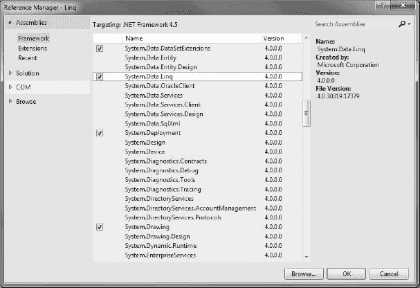

# 十八、使用 LINQ

编写软件意味着你需要有一个位于后端的数据库，并且你的大部分时间都花在编写查询来检索和操作数据上。每当有人谈到数据时，我们往往会想到包含在关系数据库或 XML 文档中的信息。

在发布之前的数据访问类型。NET 3.5 只适用于驻留在传统数据源中的数据，就像刚才提到的两个数据源。但是随着。NET 3.5 和更新的版本，如。NET 4.0 和。NET 4.5 中集成了语言集成查询(LINQ)，现在可以处理驻留在传统信息存储之外的数据。例如，您可以查询一个包含几百个整数值的泛型`List`类型，并编写一个 LINQ 表达式来检索满足您的标准的子集，比如偶数或奇数。

你可能已经知道，LINQ 是。NET 3.0 和。净 3.5。它是 Visual Studio 2012 中的一组功能，将强大的查询功能扩展到 C# 和 VB .NET 的语言语法中。

LINQ 引入了一种标准的、统一的、易于学习的方法来查询和修改数据，并且可以扩展以支持潜在的任何类型的数据存储。Visual Studio 2012 包括 LINQ 提供程序程序集，这些程序集支持对各种类型的数据源(包括关系数据、XML 和内存中数据结构)使用 LINQ 查询。

在本章中，我们将介绍以下内容:

> *   Introduction to LINQ
> *   LINQ architecture
> *   LINQ project structure
> *   Working with LINQ objects
> *   Use LINQ to SQL
> *   Use LINQ to XML

### LINQ 简介

LINQ 是微软在发布 Visual Studio 2008 和。NET Framework 版承诺彻底改变开发人员处理数据的方式。微软通过最近发布的继续改进 LINQ。NET 4.0/4.5 和 Visual Studio 2012。如上所述，LINQ 允许您查询各种类型的数据源，包括关系数据库、XML 文档，甚至内存中的数据结构。借助 C# 2012 中一级语言构造的 LINQ 查询表达式，LINQ 支持所有这些类型的数据存储。LINQ 具有以下优势:

> *   linq provides a general syntax for querying any type of data source; For example, you can query XML documents like SQL database, ADO.NET dataset, memory collection, or any other remote or local data source that you choose to use LINQ to connect and access.
> *   LINQ has built a bridge between relational data and object-oriented world, and strengthened the connection. LINQ speeds up development by catching many errors at compile time and including intellisense and debugging support.
> *   LINQ query expression (different from traditional SQL statement) is strongly typed.

 **注意**强类型表达式确保在编译时以正确的类型访问值，从而防止在编译代码时而不是在运行时捕获类型不匹配错误。

LINQ 程序集在一个保护伞下提供了访问各种类型的数据存储的所有功能。表 18-1 列出了核心 LINQ 组件。

 **注**虽然叫语言集成*查询*，但是 LINQ 可以用来更新数据库数据。这里我们将只讨论简单的查询，让您对 LINQ 有个初步的了解，但是 LINQ 是一个访问数据的通用工具。

### LINQ 的建筑

LINQ 由三个主要部分组成:

> *   [LINQ] to the object
> *   To ADO.NET [linq], including
>     *   linq！linq 你好 SQL(唉哟哟哟哟哟哟哟哟哟哟哟哟哟哟哟哟哟哟哟哟哟哟哟哟哟哟哟哟哟哟哟哟哟哟哟哟哟哟哟哟哟哟哟哟哟哟哟哟哟哟哟哟哟哟哟德列奈)
>     *   LINQ to data set (formerly known as LINQ over data set)
>     *   LINQ to entity
> *   查询表达式到 XML(原名 XLinq)

图 18-1 描述了 LINQ 架构，它清楚地显示了 LINQ 的各种组件及其相关的数据存储。

***图 18-1。** LINQ 建筑*

对象的 LINQ 处理内存中的数据。任何实现了`IEnumerable<T>`接口(在`System.Collections.Generic`名称空间中)的类都可以用标准查询操作符(sqo)来查询。

 **注**sqo 是形成 LINQ 模式的方法集合。SQO 方法对序列进行操作，其中一个*序列*表示一个对象，其类型实现接口`IEnumerable<T>`或接口`IOueryable<T>`。SQO 提供的查询功能包括过滤、投影、聚合、排序等。

ADO.NET LINQ(也称为 LINQ 支持的 ADO。NET)处理来自外部来源的数据，基本上是 ADO.NET 可以连接到的任何东西。任何实现了`IEnumerable<T>`或`IOueryable<T>`(在`System.Linq`命名空间中)的类都可以用 SQOs 查询。通过使用`System.Data.Linq`名称空间可以实现从 LINQ 到 ADO.NET 的功能。

LINQ 到 XML 是一个全面的内存 XML 编程 API。像 LINQ 的其他部分一样，它包括 SQOs，也可以与 ADO.NET 的 LINQ 协同使用，但它的主要目的是统一和简化不同的 XML 工具(如 XQuery、XPath 和 XSLT)通常用来做的事情。LINQ 到 XML 的功能可以通过使用`System.Xml.Linq`名称空间来实现。

 **注** LINQ。NET Compact Framework 包括桌面 LINQ 功能的一个子集。LINQ 和。NET 框架和 LINQ。NET Compact Framework 是在。NET Compact Framework，只支持 sqo。支持 LINQ 到数据集和 LINQ 到数据表，也支持 LINQ 到 XML，但 XPath 扩展除外。

在本章中，我们将使用 LINQ 到对象、LINQ 到 SQL 和 LINQ 到数据集的技术，因为它们与我们在本书中讨论的 C# 2012 数据库编程最密切相关。

### LINQ 项目结构

Visual Studio 2012 允许您使用 LINQ 查询。要创建 LINQ 项目，请按照下列步骤操作:

1.  打开 Visual Studio 2012，选择文件新建项目。
2.  默认情况下，在出现的“新建项目”对话框中。在可用列表中选择了. NET Framework 4.5。Visual Studio 2012 支持的. NET Framework 版本。选择希望 LINQ 功能包含在其中的项目类型。对于这个例子，我们将使用一个 Windows 窗体应用项目。
3.  为选择的项目指定名称 [Chapter18](18.html) ，并单击 OK。一个名为 [Chapter18](18.html) 的新的 Windows 窗体应用将被创建。选择解决方案下名为 [Chapter18](18.html) 的项目，并将其重命名为 Linq。保存所有更改。
4.  Open the `References` folder in Solution Explorer. You should see Linq-related assembly references added by default, as shown in [Figure 18-2](#fig_18_2). 

    ***图 18-2。** LINQ 推荐人*

现在，您已经准备好使用 LINQ 项目，您需要做的就是将代码功能和所需的名称空间添加到项目中，并测试应用。让我们开始使用 LINQ。

#### 用 LINQ 来物件

术语对象 LINQ 指的是使用 LINQ 查询来访问内存中的数据结构。可以查询任何支持`IEnumerable<T>`的类型。这意味着 LINQ 查询不仅可以用于用户定义的列表、数组、字典等，还可以与。返回集合的 NET Framework APIs。例如，您可以使用`System.Reflection`类返回存储在指定程序集中的类型信息，然后使用 LINQ 过滤这些结果。或者，您可以将文本文件导入到可枚举的数据结构中，并将内容与其他文件进行比较，提取行或部分行，将几个文件中的匹配行组合到一个新集合中，等等。与传统的`foreach`循环相比，LINQ 查询有三个主要优势:

> *   They are more concise and readable, especially when filtering multiple conditions.
> *   They provide powerful filtering, sorting and grouping functions with minimal application code.
> *   They can be transplanted to other data sources with little modification.

一般来说，您想要对数据执行的操作越复杂，与传统的迭代技术相比，使用 LINQ 的好处就越大。

##### 试试看:编写一个简单的 LINQ 对象查询

在本练习中，您将创建一个包含一个文本框的 Windows 窗体应用。应用将使用 Linq to Objects 从 TextBox 控件中的字符串数组中检索并显示一些名称。

1.  右键单击 [Chapter18](18.html) 解决方案中的`Form1.cs`，选择重命名选项，将表单重命名为 LinqToObjects。
2.  通过单击窗体的标题栏选择 LinqToObjects 窗体，并将 Size 属性的宽度设置为 308，高度设置为 311。
3.  将 TextBox 控件拖到窗体上，并将其放在窗体的中央。选择此文本框，导航到“属性”窗口，并设置以下属性:
    *   将 Name 属性设置为 txtDisplay。
    *   对于 Size 属性，将 Width 设置为 244，Height 设置为 216。
    *   将 Multiline 属性设置为 True。
4.  Now your LinqToObjects form in the Design view should look like [Figure 18-3](#fig_18_3). 

    ***图 18-3。**LinqToObjects 表单的设计视图*

5.  Double-click the empty surface of the `LinqToObjects.cs` form, and it will open the code editior window, showing the `LinqToObject_Load` event. Place the code in [Listing 18-1](#list_18_1) in the `LinqToObjects_Load` event.

    ***清单 18-1。**`LinqToObjects.cs`T5】*

    `//Define string array
    string[] names = { "Life is Beautiful",
                     "Arshika Agarwal",
                     "Seven Pounds",
                     "Rupali Agarwal",
                     "Pearl Solutions",
                     "Vamika Agarwal",
                     "Vidya Vrat Agarwal",
                     "Lionbridge Technologies"
                  };

    //Linq query
    IEnumerable<string> namesOfPeople = from name in names
                                 where name.Length <= 16
                                 select name;

    foreach (var name in namesOfPeople)
    {
        txtDisplay.AppendText(name+"\n");
    }`
6.  Run the program by pressing Ctrl+F5, and you should see the results shown in [Figure 18-4](#fig_18_4). 

    ***图 18-4。**使用对象的 LINQ 从字符串数组中检索名字*

##### 它是如何工作的

您声明了一个名为`names`的字符串数组。

`string[] names = {"Life is Beautiful",
               "Arshika Agarwal",
               "Seven Pounds",
               "Rupali Agarwal",                    
               "Pearl Solutions",
                "Vamika Agarwal",
                "Vidya Vrat Agarwal",
                "Lionbridge Technologies" };`

要从字符串数组中检索名称，可以使用`IEnumerable<string>`查询字符串数组，并在`foreach`的帮助下使用 LINQ 到对象查询语法遍历`names`数组。

`IEnumerable<string> namesOfPeople = from name in names
                             where name.Length <= 16
                             select name; foreach (var name in namesOfPeople)`

#### 使用 LINQ 到 SQL

LINQ 到 SQL 是一种将关系数据作为对象进行管理和访问的工具。在某些方面，它在逻辑上类似于 ADO.NET，但它从更抽象的角度来看待数据，简化了许多操作。它连接到数据库，将 LINQ 结构转换为 SQL，提交 SQL，将结果转换为对象，甚至跟踪更改并自动请求数据库更新。

一个简单的 LINQ 查询需要三样东西:

> *   Entity class
> *   A data context
> *   A LINQ query

##### 试试看:编写一个简单的 LINQ 到 SQL 查询

在本练习中，您将使用 LINQ 到 SQL 检索来自`AdventureWorks`个人的所有联系信息。联系表。

1.  导航到解决方案资源管理器，右击 Linq 项目，并选择添加 Windows 窗体。在打开的添加新项对话框中，确保选中 Windows Form，然后将`Form1.cs`重命名为 LinqToSql。单击添加。
2.  通过单击窗体的标题栏选择 LinqToSql 窗体，并将 Size 属性的宽度设置为 355，高度设置为 386。
3.  将 TextBox 控件拖到窗体上，并将其放在窗体的中央。选择此文本框，导航到“属性”窗口，并设置以下属性:
    *   将 Name 属性设置为 txtLinqToSql。
    *   将 Multiline 属性设置为 True。
    *   将 ScrollBars 属性设置为垂直。
4.  For the Size property, set Width to 315 and Height to 320\. Now your LinqToSql form in the Design view should look like [Figure 18-5](#fig_18_5). 

    ***图 18-5。**LinqToSql 表单的设计视图*

5.  Before you begin coding the functionality, you must add the required assembly references. LinqToSql will require an assembly reference of `System.Data.Linq` to be added to the Linq project. To do so, select References, right-click, and choose Add Reference. From the opened Reference Manager dialog, scroll down to the assembly list, and select System.Data.Linq, as shown in [Figure 18-6](#fig_18_6). Click OK. 

    ***图 18-6。**添加对 Linq 程序集的引用。*

6.  Open the newly added form `LinqToSql.cs` in the Code view. Add the code shown in [Listing 18-2](#list_18_2) in `LinqToSql.cs`.

    ***清单 18-2。**T4`LinqToSql.cs`*

    `// Must add these two namespaces for LinqToSql
    using System.Data.Linq;
    using System.Data.Linq.Mapping;

    [Table(Name = "Person.Person")]
            public class Contact
            {
                [Column]
                public string Title;
                [Column]
                public string FirstName;
                [Column]
                public string LastName;
            }

             private void LinqToSql_Load(object sender, EventArgs e)
            {
                // connection string` `            string connString = @"server = .\sql2012;integrated security = true;
                                database = AdventureWorks";

                try
                {
                    // Create data context
                    DataContext db = new DataContext(connString);

                    // Create typed table
                    Table<Contact> contacts = db.GetTable<Contact>();

                    // Query database
                    var contactDetails =
                       from c in contacts
                       where c.Title == "Mr."
                       orderby c.FirstName
                       select c;

                    // Display contact details
                    foreach (var c in contactDetails)
                    {
                        txtLinqtoSql.AppendText(c.Title);
                        txtLinqtoSql.AppendText("\t");
                        txtLinqtoSql.AppendText(c.FirstName);
                        txtLinqtoSql.AppendText("\t");
                        txtLinqtoSql.AppendText(c.LastName);
                        txtLinqtoSql.AppendText("\n");
                    }
                }

                catch (Exception ex)
                {
                    MessageBox.Show(ex.Message);
                }
            }`
7.  现在，要将 LinqToSql 表单设置为启动表单，请在代码编辑器中打开`Program.cs`，并将`Application.Run(new LinqToObjects());`修改为`Application.Run(new LinqToSql());`。
8.  Build the solution, and then run the program by pressing Ctrl+F5; you should see the results shown in [Figure 18-7](#fig_18_7). 

    ***图 18-7。**将 LINQ 的详细联系信息检索到 SQL*

##### 它是如何工作的

你定义了一个*实体类*，`Contact`。

`[Table(Name = "Person.Person")]
        public class Contact
        {
            [Column]
            public string Title;
            [Column]
            public string FirstName;
            [Column]
            public string LastName;
        }`

实体类提供了 LINQ 存储来自数据源的数据的对象。它们就像任何其他 C# 类一样，但是 LINQ 定义了告诉它如何使用这个类的属性。

属性将该类标记为一个实体类，并有一个可选的属性`Name`,该属性可用于给出表名，默认为类名。这就是为什么你把这个类命名为`Contact`而不是 Person.Contact

`[Table(Name = "Person.Contact")]
public class Contact`

接下来，您必须将类型化表定义改为

`Table<Contact> contacts = db.GetTable<Contact>();`

为了保持一致，`[Column]`属性将一个字段标记为保存表中数据的字段。可以在实体类中声明不映射到表列的字段，LINQ 会忽略它们，但是用`[Column]`属性修饰的字段的类型必须与它们映射到的表列兼容。(请注意，由于 SQL Server 表名和列名不区分大小写，默认名称不必与数据库中使用的名称大小写相同。)

您创建了一个*数据上下文*。

`//  Create data context
DataContext db = new DataContext(connString);`

数据上下文做 ADO.NET 连接做的事情，但它也做数据提供者处理的事情。它不仅管理到数据源的连接，还将 LINQ 请求(用 SQO 表示)转换成 SQL，将 SQL 传递给数据库服务器，并从结果集中创建对象。

您创建了一个*类型的表*。

`//  Create typed table
Table<Contact> contacts = db.GetTable<Contact>();`

类型化表是一个集合(类型为`System.Data.Linq.Table<T>`)，它的元素具有特定的类型。`DataContext`类的`GetTable`方法告诉数据上下文访问结果，并指示将它们放在哪里。在这里，您从 Person 获得所有行(但只有三列)。Contact 表，数据上下文为 contacts 类型表中的每一行创建一个对象。

你声明了一个 C# 2012 *隐式类型化的局部变量，* `contactDetails`，类型为`var`。

`// Query database
var contactDetails =`

隐式类型的局部变量顾名思义。当 C# 看到`var`类型时，它会根据`=`符号右边的`initializer`中的表达式类型来推断局部变量的类型。

您用一个查询表达式初始化本地变量*。*

`   from c in contacts
   where c.Title == "Mr."
   orderby c.FirstName
   select c;`

查询表达式由一个`from`子句和一个*查询体组成。*您在这里使用查询体中的`WHERE`条件。`from`子句声明了一个迭代变量`c`，用于迭代表达式`contacts`的结果(即之前创建和加载的类型化表)。在每次迭代中，它将选择满足`WHERE`子句的行(这里，标题必须是“Mr .”)。

最后，遍历`custs`集合并显示每个客户。

`// Display contact details
foreach (var c in contactDetails)
{
   txtLinqtoSql.AppendText(c.Title);
   txtLinqtoSql.AppendText("\t");
   txtLinqtoSql.AppendText(c.FirstName);
   txtLinqtoSql.AppendText("\t");
   txtLinqtoSql.AppendText(c.LastName);
   txtLinqtoSql.AppendText("\n");` `}`

尽管有了新的 C# 2008 特性和术语，但这种感觉还是很熟悉。一旦掌握了窍门，这是一种很有吸引力的查询编码替代方法。您基本上是编写一个查询表达式而不是 SQL 来填充一个集合，您可以用一个`foreach`语句遍历这个集合。但是，您提供了一个连接字符串，但没有显式地打开或关闭连接。此外，不需要命令、数据读取器或索引器。您甚至不需要使用`System.Data`或`System.Data.SqlClient`名称空间来访问 SQL Server。

很酷，不是吗？

#### 使用 LINQ 到 XML

LINQ 到 XML 提供了一个内存中的 XML 编程 API，该 API 将 XML 查询功能集成到 C# 2012 中，以利用 LINQ 框架并添加特定于 XML 的查询扩展。LINQ 到 XML 提供了集成到. NET 中的 XQuery 和 XPath 的查询和转换能力

从另一个角度来看，您也可以将 LINQ 到 XML 看作是一个全功能的 XML API，相当于现代化的、重新设计的 SystemXml API 加上 XPath 和 XSLT 的一些关键特性。LINQ 到 XML 提供了在内存中编辑 XML 文档和元素树的工具，以及流工具。图 18-8 显示了一个样本 XML 文档。

***图 18-8。** XML 文档*

##### 试试看:编写一个简单的 LINQ 到 XML 的查询

在本练习中，您将使用 LINQ 到 XML 从 XML 文档中检索元素值。

1.  导航到解决方案资源管理器，右击 Linq 项目，然后选择“Windows 窗体”。在打开的添加新项对话框中，确保选中 Windows Form，然后将`Form1.cs`重命名为 LinqToXml。单击添加。
2.  通过单击窗体的标题栏选择 LinqToXml 窗体，并将 Size 属性的宽度设置为 377，高度设置为 356。
3.  将 TextBox 控件拖到窗体上，并将其放在窗体的中央。选择此文本框，导航到“属性”窗口，并设置以下属性:
    *   将 Name 属性设置为 txtLinqToXml。
    *   将 Multiline 属性设置为 True。
    *   将 ScrollBars 属性设置为垂直。
    *   对于“大小”属性，将“宽度”设置为 340，将“高度”设置为 298。
4.  Now your LinqToXml form in the Design view should look like [Figure 18-9](#fig_18_9). 

    ***图 18-9。**LinqToXml 表单的设计视图*

5.  Open the newly added form `LinqToXml.cs` in code view. Add the code shown in [Listing 18-3](#list_18_3) in `LinqToXml.cs`.

    ***清单 18-3。**T4`LinqToXml.cs`*

    `            using System.Xml.Linq;
                //Load the productstable.xml in memory
                XElement doc = XElement.Load(@"C:\VidyaVrat\C#2012 and SQL
                2012\Chapter18\Code\Linq\productstable.xml");

                //Query xml doc
                var products = from prodname in doc.Descendants("products")
                               select prodname.Value;

                //Display details
                foreach (var prodname in products)
                {
                    txtLinqToXml.AppendText("Product's Detail= ");
                    txtLinqToXml.AppendText(prodname);
                    txtLinqToXml.AppendText("\n");
                }`

     **注意**我们已经指定了`productstable.xml`文件，它位于我们机器上的特定位置；根据您的计算机和 XML 文件的可用性，您可以使用另一个 XML 文件路径。本章的源代码中也提供了`productstable.xml`文件。

6.  Now, to set the LinqToSql form as the start-up form, open `Program.cs` in the code editor, and modify the `Application.Run(new LinqToSql());`

    表现为:

    `Application.Run(new LinqToXml());`.

    生成解决方案，然后按 Ctrl+F5 运行程序。您应该会看到如图 18-10 所示的结果。

    

    ***图 18-10。**使用 LINQ 到 XML 检索产品详细信息*

##### 它是如何工作的

使用`System.Linq.Xml`中的`XElement`指定下面的语句，将 XML 文档加载到内存中。

`XElement doc = XElement.Load(@"C:\VidyaVrat\C#2012 and SQL
2012\Chapter18\Code\Linq\productstable.xml ");`

您还可以编写以下语句来查询 XML 文档，其中`Descendents`方法将返回 XML 文档中指定元素的后代元素的值。

`var products = from prodname in doc.Descendants("products") select prodname.Value;`

### 总结

在本章中，我们讲述了使用 LINQ 进行简单查询的要点。我向您介绍了 LINQ 的三种风格，主要是对象的 LINQ、SQL 的 LINQ 和 XML 的 LINQ。在下一章，我将介绍 ADO.NET 实体框架。