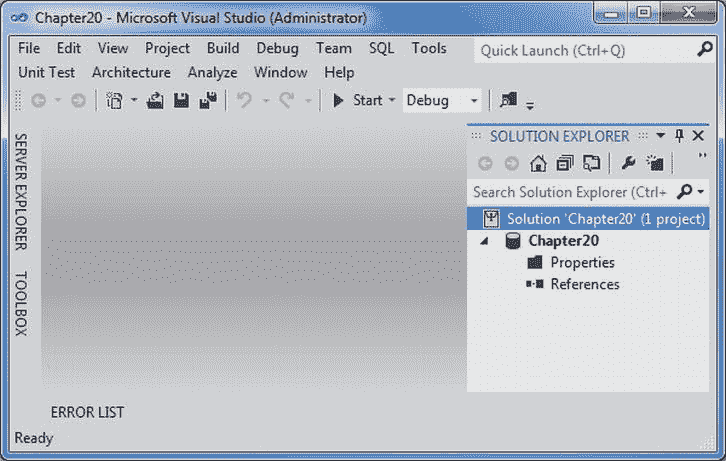

# 二十、在 SQL Server 中使用 CLR

多年来，编写业务逻辑一直是特定于技术和软件的，尤其是在数据库方面。例如，如果您想创建一个需要复杂 SQL 代码的存储过程或其他数据库对象，唯一的方法就是在数据库中编写 T-SQL 逻辑，并用 C# 之类的编程语言编写调用代码，如前几章所示，我们在 SQL Server 中使用 T-SQL 创建了一个存储过程，然后用 C# 编写了调用代码。

这种方法仍然非常流行，但是有一种更简单的方法，它允许 C# 程序员控制和编码所有面向数据库的对象，例如。NET 语言，比如 C#，而不像以前那样使用 T-SQL。

在本章中，我将介绍以下内容:

> *   引入 sql clr
> *   oot-SQL SQL clr
> *   Select enable SQL CLR integration between
> *   Create SQL CLR stored procedure
> *   Deploy SQL CLR stored procedures to SQL Server
> *   Execute SQL CLR stored procedures

### SQL CLR 简介

SQL 公共语言运行库(CLR)是。集成到 SQL Server 2005 和更高版本中的. NET CLR。SQL CLR 为开发人员在处理与数据库相关的复杂业务逻辑时提供了一种选择，尤其是当 T-SQL 使这种处理变得不那么愉快时。

SQL CLR 是。NET CLR，它主要通过为已部署的内存管理和代码执行提供支持来实现运行时执行引擎的目的。NET SQL CLR 程序集。一个*程序集*是一个. NET 术语，指的是由*元数据*(关于数据的数据)和*清单*(关于程序集的数据)组成的 DLL 或 EXE 文件。

可以使用 SQL CLR 集成创建以下类型的对象:

> *   stored procedure
> *   Custom aggregation
> *   trigger
> *   Custom type

### 在 T-SQL 和 SQL CLR 之间选择

当您有两种选择来实现相同的功能时，根据您的场景和需求，一种可能比另一种更有优势。这里有几个要点可以帮助您决定在什么情况下选择 T-SQL 还是 SQL CLR:

> *   T-SQL is best used to perform declarative, set-based operations (select, insert, update and delete).
> *   T-SQL works within a database connection, and SQL CLR must get the connection.
> *   T-SQL also has a procedural ability. In other words, it can perform procedural operations such as `WHILE`, but T-SQL is not the best choice when it comes to rich or more complex logic. In this case, the SQL CLR with C# allows the programmer to better control the functions.
> *   T-SQL is interpreted while SQL CLR is compiled. Therefore, interpreted code is slower than compiled procedure code.
> *   Before executing the SQL CLR code, it needs the CLR to be loaded by SQL Server, and T-SQL will not generate any such overhead.
> *   When any T-SQL code executes, it shares the same stack frame in memory, and each SQLCLR code needs its own stack frame, which will lead to larger memory allocation but better concurrency. T-SQL consists of a library full of data-centric functions, so it is more suitable for collection-based operations. SQL CLR is more suitable for operations of recursive, mathematical and string operation types.

### 启用 SQL CLR 集成

使用 C# 创建数据库对象后，必须在 SQL Server 2012 中启用 SQL CLR，以便使用或部署它。默认情况下，该功能是关闭的(`config_value`设为 0)；要启用它(`config_value`设置为 1)，请遵循以下步骤:

1.  打开 SQL Server 2012 Management Studio 根据您的安装类型，使用 Windows 或 SQL 身份验证进行连接。
2.  Once connected, click the New Query button, which will open a query window. Enter the following text in the query window, and notice the value of the config_value column, as shown in [Figure 20-1](#fig_20_1). 

    ***图 20-1。**显示 SQL CLR 的默认行为(禁用)*

3.  Next, you need to enable SQL CLR, to do so; modify the code to look like [Figure 20-2](#fig_20_2), and it will enable the SQL CLR integration. 

    ***图 20-2。**显示 SQL CLR 已启用*

现在，您的 SQL Server 已经准备好执行使用 C# 编程语言构建的数据库对象，这与 T-SQL 不同。您将在本章的稍后部分执行此操作。

### 创建 SQL CLR 存储过程

Microsoft Visual Studio 2012 为各种 SQL Server 对象(如存储过程、触发器、函数等)提供了项目模板和类文件，您可以用 C# 将这些对象编码为动态链接库(DLL)等程序集。

#### 试试看:使用 C# 创建 SQL CLR 存储过程

在本练习中，您将通过向 SQL Server 数据库项目中添加一个 SQL CLR C# 存储过程项模板来创建一个 SQL 存储过程。您将创建的 SQL CLR C# 存储过程将帮助您将货币数据插入 AdventureWorks。Sales.Currency 表，就像你在[第 13 章](13.html)和[清单 13-4](13.html#list_13_4) 中所做的那样。但是这里您使用了不同的技术来完成相同的任务(货币插入)。

1.  Create a new Windows Forms Application project named [Chapter13](13.html). When Solution Explorer opens, save the solution, as shown in [Figure 20-3](#fig_20_3). 

    ***图 20-3。**展示 SQL Server 数据库项目模板*

2.  This will load an empty project, that is, one without any .cs class file in it, as shown in [Figure 20-4](#fig_20_4). 

    ***图 20-4。**解决方案资源管理器中列出的空项目*

3.  Right-click the [Chapter20](20.html) project, choose Add  New Item, and in the Add New Item dialog select SQL CLR Stored Procedure on the SQL CLR C# tab. Name it SQLCLRStoredProcedure.cs, as shown in [Figure 20-5](#fig_20_5). Click Add. 

    ***图 20-5。**将一个 SQL CLR C# 存储过程作为一个新项添加到项目中*

4.  Your Visual Studio environment will now look like [Figure 20-6](#fig_20_6). 

    ***图 20-6。**显示添加 SQL CLR C# 存储过程后的 Visual Studio*

5.  Replace the code in the StoredProcedure class with the code in [Listing 20-1](#list_20_1).

    ***清单 20-1。**T4`SQLCLRStoredProcedure.cs`*

    `[Microsoft.SqlServer.Server.SqlProcedure()]
        public static void InsertCurrency_CS(SqlString currencyCode, SqlString currencyName)
        {
            SqlConnection conn = null;

            try
            {
                conn = new SqlConnection(@"server = .\sql2012;integrated security = true;
                       database = AdventureWorks");

                SqlCommand cmdInsertCurrency = new SqlCommand();
                cmdInsertCurrency.Connection = conn;

                SqlParameter parmCurrencyCode = new SqlParameter
                                  ("@CCode", SqlDbType.NVarChar, 3);
                SqlParameter parmCurrencyName = new SqlParameter
                                  ("@Name", SqlDbType.NVarChar, 50);` `            parmCurrencyCode.Value = currencyCode;
                parmCurrencyName.Value = currencyName;

                cmdInsertCurrency.Parameters.Add(parmCurrencyCode);
                cmdInsertCurrency.Parameters.Add(parmCurrencyName);

                cmdInsertCurrency.CommandText =
                    "INSERT Sales.Currency (CurrencyCode, CurrencyName, ModifiedCurrencyDate)" +
                    " VALUES(@CCode, @Name, GetDate())";

                conn.Open();

                cmdInsertCurrency.ExecuteNonQuery();
           }

            catch (SqlException ex)
            {
                SqlContext.Pipe.Send("An error occured" + ex.Message + ex.StackTrace);
            }

            finally
            {
                conn.Close();
            }
        }`
6.  保存项目，并生成解决方案。成功构建后，它将在项目的\bin\debug 文件夹下生成一个 Chapter20.dll 文件。

#### 它是如何工作的

因为这是用 C# 编写的存储过程，所以它将把货币数据插入到 AdventureWorks 中。Sales.Currency 表，它有三列。其中，您将传递两个值作为输入参数。

`      [Microsoft.SqlServer.Server.SqlProcedure()]
        public static void InsertCurrency_CS(SqlString currencyCode, SqlString currencyName)`

任何数据库应用最重要的部分是创建连接和命令。

`            SqlConnection conn = null;
            conn = new SqlConnection(@"server = .\sql2012;integrated security = true;
                                 database = AdventureWorks");
            SqlCommand cmdInsertCurrency = new SqlCommand();
            cmdInsertCurrency.Connection = conn;`

一旦有了连接和命令对象，就需要设置这个存储过程将接受的参数。

`SqlParameter parmCurrencyCode = new SqlParameter("@CCode", SqlDbType.NVarChar, 3);
            SqlParameter parmCurrencyName = new SqlParameter
                       ("@Name", SqlDbType.NVarChar, 50);

            parmCurrencyCode.Value = currencyCode;
            parmCurrencyName.Value = currencyName;

            cmdInsertCurrency.Parameters.Add(parmCurrencyCode);
            cmdInsertCurrency.Parameters.Add(parmCurrencyName);`

设置完参数后，您将设置`INSERT`语句，该语句将执行实际的任务，但是因为您只为这个销售选择了两个参数。货币表，对于第三列，即日期列，您将传递`GetDate()`函数。

`      cmdInsertCurrency.CommandText ="INSERT Sales.Currency
                                (CurrencyCode, CurrencyName, ModifiedCurrencyDate)" +
                                " VALUES(@CCode, @Name, GetDate())";`

接下来，打开连接并执行命令。

`            conn.Open();
            cmdInsertCurrency.ExecuteNonQuery();`

需要记住的最重要的一点是，这段代码实际上是从 SQL Server Management Studio 内部调用的，因此异常处理`catch`块需要特别注意。

`       catch (SqlException ex)
       {
         SqlContext.Pipe.Send("An error occured" + ex.Message + ex.StackTrace);
      }`

`SqlContext`类允许您调用函数在 SQL Server 的错误窗口中显示错误。

### 将 SQL CLR 存储过程部署到 SQL Server 中

一旦为特定类型的数据库对象创建了 SQL CLR C# 类型的程序集，就需要将其部署到 SQL Server 中。部署后，SQL Server 可以像使用任何其他 T-SQL 数据库对象一样使用它。

#### 尝试一下:在 SQL Server 中部署 SQL CLR C# 存储过程

在本练习中，您将把创建的程序集部署到`SQL2012Db`数据库中，在执行时，这将把货币插入 AdventureWorks 中。销售。货币表。

1.  打开 SQL Server 2012 Management Studio，并连接到 SQL Server。
2.  选择 SQL2012 数据库(如果您没有这个数据库，您可以使用您选择的任何数据库)，然后单击 New Query，这将打开一个新的空白查询窗口。
3.  In the opened query window, insert the code in [Listing 20-2](#list_20_2).

    ***清单 20-2。**将程序集部署到 SQL Server 中*

    `Create Assembly SQLCLR_StoredProcedure
    From
    --change this path to reflect your database assebmly location
    'C:\VidyaVrat\C#2012 and SQL 2012\Chapter20\Code\Chapter20\bin\Debug\Chapter20.dll'
    WITH PERMISSION_SET = UNSAFE
    GO

    CREATE PROCEDURE dbo.InsertCurrency_CS
    (
      @currCode nvarchar(3),
      @currName nvarchar(50)
    )
    AS EXTERNAL NAME SQLCLR_StoredProcedure.StoredProcedures.InsertCurrency_CS;`
4.  Once code is added, click Execute or press F5\. This should execute the command successfully. Then go to the Object Browser, select SQL2012DB, right-click, and choose Refresh. This will show the objects under Programmability and Assemblies in the Object Browser, as shown in [Figure 20-7](#fig_20_7). 

    ***图 20-7。**在 SQL Server 中部署程序集并在对象浏览器中显示对象*

#### 工作原理

此部署过程分为两步。首先，您必须在 SQL Server 中用自己的名字注册一个程序集(您用 C# 创建的)。

`Create Assembly SQLCLR_StoredProcedure
from
'C:\VidyaVrat\C#2012 and SQL 2012\Chapter20\Code\Chapter20\bin\Debug\Chapter20.dll'
WITH PERMISSION_SET = UNSAFE
GO`

这个`PERMISSION_SET`属性允许用户执行具有特定代码访问权限的程序集。`UNSAFE`允许此程序集在 SQL Server 中拥有不受限制的访问权限。

其次，您必须创建存储过程，这将基本上调用您从 C# 程序集创建的存储过程。

`CREATE PROCEDURE dbo.InsertCurrency_CS
(
  @currCode nvarchar(3),
  @currName nvarchar(50)
)
AS EXTERNAL NAME SQLCLR_StoredProcedure.StoredProcedures.InsertCurrency_CS;
GO`

`CREATE PROCEDURE`中使用的名字是你在 C# 类中赋予函数的名字(`InsertCurrency_CS`)(参考[清单 20-1](#list_20_1) )。接下来你要设置传递给 C# 函数的输入参数(参见[清单 20-1](#list_20_1) )。

外部名称实际上在`<SQL registered assembly>.<CS class name>.<CS function name>`的语法中，所以结果如下:

`      SQLCLR_StoredProcedure.StoredProcedures.InsertCurrency_CS`

参考[清单 20-1](#list_20_1) 和[清单 20-2](#list_20_2) 中的类名、程序集名等等，这些都在这里使用。

### 执行 SQL CLR 存储过程

部署程序集并创建存储过程后，您就可以从 SQL 2012 执行此过程，并将货币插入 AdventureWorks。销售。货币表。

#### 试试看:执行 SQL CLR 存储过程

在本练习中，您将执行`InsertCurrency_CS`存储过程。

1.  打开 SQL Server Management Studio(如果尚未打开)，选择 SQL2012db 并单击“新建查询”按钮。
2.  在查询窗口中，添加清单 20-3 中所示的代码来执行该过程并添加一种货币。

***清单 20-3。**执行存储过程插入货币*

`Exec dbo.InsertCurrency_CS 'ABC','United States of America'`

 **注意**你必须为货币代码指定一个唯一的值。例如，我使用 ABC，因为我知道美国没有这样的货币。但是如果您尝试输入 USD 或重复值，您将会收到系统错误。如果你给销售额增加了一个重复的值。对于 CurrencyCode 列，你会得到一个异常，如图[图 20-8](#fig_20_8) 所示。

***图 20-8。**出现重复条目时显示参数异常*

#### 工作原理

如[清单 20-1](#list_20_1) 中的 C# 代码所示，insert 语句接受两个输入参数，每次执行时会自动传递用于`ModifiedCurrencyDate`列的`GetDate()`方法。

`              cmdInsertCurrency.CommandText ="INSERT Sales.Currency
              (CurrencyCode, CurrencyName, ModifiedCurrencyDate)" +
                " VALUES(@CCode, @Name, GetDate())";`

因此，存储过程执行语句将看起来像[清单 20-3](#list_20_3) ，它为输入参数`CurrencyCode`和`CurrencyName`传递值。

`Exec dbo.InsertCurrency_CS 'ABC','United States of America'`

### 总结

在本章中，我介绍了 SQL CLR 集成的要点、它的优点以及开发人员可以创建的对象类型。您还了解了如何选择 SQL CLR 而不是 T-SQL，反之亦然。最后，您使用硬编码的 C# 逻辑和关键字(如 try catc `h`)作为 C# 程序集创建了一个 SQL CLR C# 存储过程。然后部署并执行它来插入一种货币。相当酷！