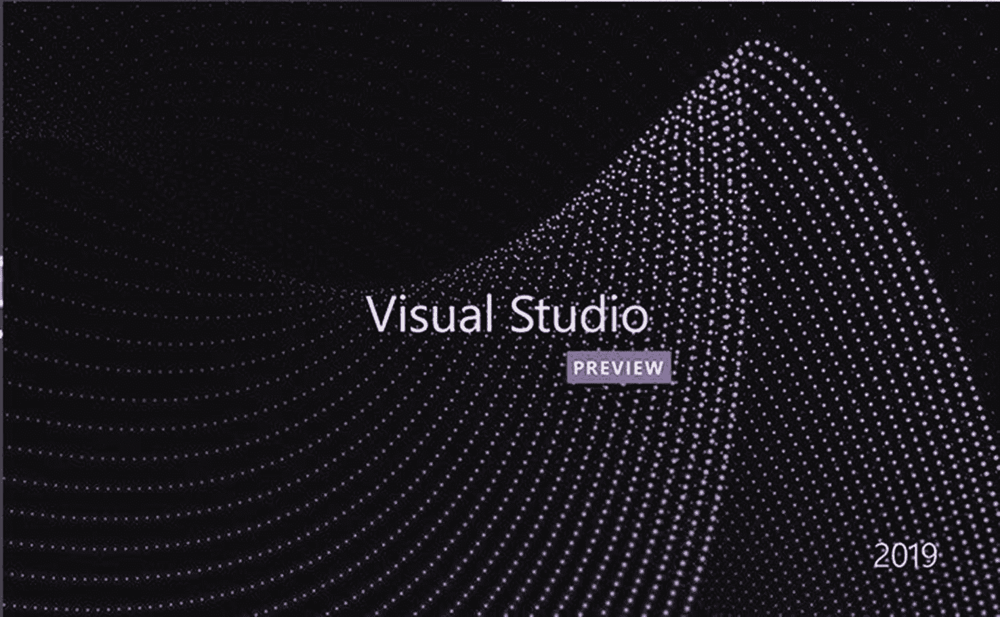
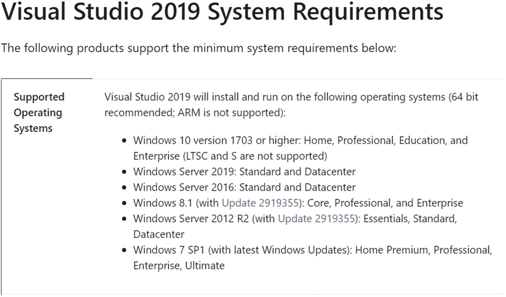
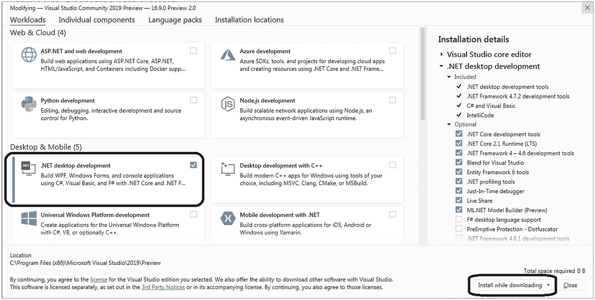
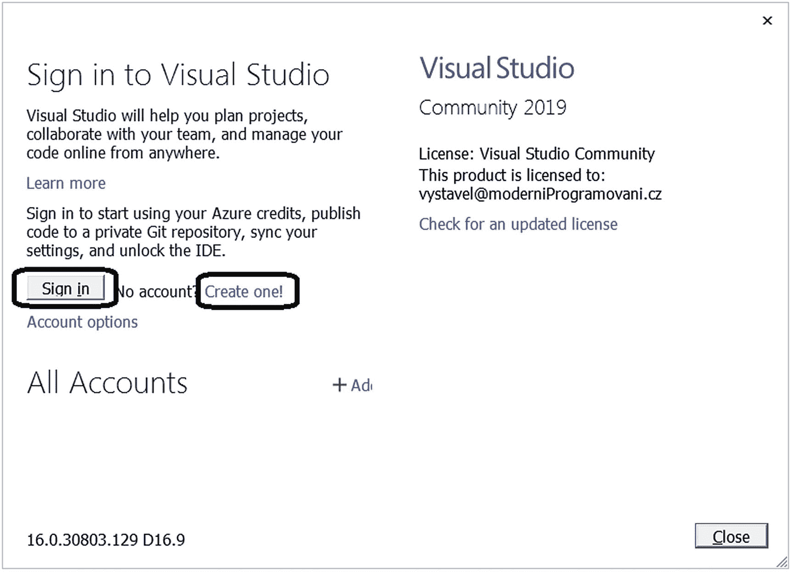

# 一、做好准备

亲爱的读者，欢迎您开始学习编程之旅！电脑、平板电脑、手机和许多其他电子设备都是可编程的，会完全按照人类程序员告诉他们的去做。

编程是一个完全基于逻辑的世界。在这方面，它在人类活动中是独一无二的。如果你喜欢逻辑——例如，你喜欢解谜或者你习惯于寻找你周围有意义的秩序——那么你会喜欢编程。

## C# 语言

在本书中，您将创建一些真正的程序，为此，您需要学习一种编程语言，这种语言为计算机提供指令。编程语言提供了计算机和人类之间的交互。它们足够严格，以至于绝对愚蠢的计算机可以理解它们，但它们也足够人性化，以至于程序员可以使用它们编写代码。

随着时间的推移，许多编程语言被创造出来，并且有许多在今天被使用。每种语言都有其优点和缺点。

对于这本书，我选择了 C# 编程语言，这是我职业发展和教学的首选语言。它大约有 20 年的历史，这意味着它的创造者在开发它时可以避免旧语言的已知缺陷。此外，它现在是一种经过时间考验的语言，不会轻易被一些新的时尚所取代。

C# 实际上是微软的旗舰语言。它是相当通用的——你可以用它来编写各种程序，从传统的控制台和桌面应用，通过网站和服务到移动开发，无论是商业还是娱乐。它最初诞生于 Windows，近年来迅速传播到其他平台，如 Linux、Mac、Android 和 iOS。

我希望你会有一个美好的时光，你会发现它在你未来的职业/业余生活中有很多用途！

## 这本书是给谁的

这本书主要是为那些没有或仅有有限编程知识的人准备的。为了从本书中获得最大收益，你应该熟练使用计算机——你应该能够安装程序，知道什么是文件或文件夹，等等。

但是，由于本书对所包含的主题进行了深入的覆盖，如果您是一名中级程序员或已经掌握了另一种编程语言并希望从 C# 开始，您也可能会从本书中受益。你将比完全的初学者更快地阅读这本书。

## 这本书与其他书有何不同

我写这本书是基于我 15 年来教授各种学生、教师、业余爱好者和其他人编程的经验。对他们中的许多人来说，这是他们第一次接触这个主题。我在工作时密切观察他们，多年来，我积累了大量关于人们如何学习、什么对他们来说容易、什么需要更多关注的信息。

在本书中，你将受益于这些知识。本书与同类书籍的不同之处主要体现在以下几个方面:

*   解释的速度——也就是进入新话题的速度——要适当慢一些，这样你才不会在开始后不久就迷失了方向。专家作者的一个常见谬误是认为初学者的东西微不足道。事实上，这对他们来说是微不足道的。但不是给读者看的。我已经做了相当大的努力来避免这种情况，并花足够的时间在印心者认为容易的事情上。

*   我相信，为了成功地掌握所有的新思想，你需要看到它们在略有不同的情况下反复使用，这就是你在这里找到的。写这些例子是为了让你循序渐进，强化你已经知道的东西，并且总是增加一点新的信息或观点。

*   大量的例子让我即使停留在初级水平也能深入这个主题。许多入门书籍通过一两个教科书上的例子展示了一个新的概念，然后继续前进。这里不是这样的。所选的例子来自真实的编程。它们通常代表了我在开发真实软件时发现自己所处的各种情况的核心。我涵盖了提炼到初级水平的核心主题。

*   我已经用捷克语写了几本编程书籍，并且发现许多读者更喜欢编码示例而不是解释性文本。这大概反映了我们这个信息超载的现代。这就是为什么我用简明的、面向任务的方法写了这本书。你会发现这里说的最少，做的最多。好好享受吧！

## 如何使用这本书

在我开始告诉你如何准备你的电脑之前，这里有一些关于你如何使用这本书以获得最大效用的提示:

*   这本书包含许多练习。这些不是练习你已经学过的东西的任务。这些任务构成了这本书的主要内容。这意味着你不应该在阅读完任务后试图去解决问题。你应该做的是阅读这个任务是关于什么的，看看它的说明性截图，然后立即去研究它的解决方案。

*   你不应该只是*阅读*解决方案。强烈建议你在电脑上输入它们并让它们工作。如果你亲自尝试每一件事，这些练习会对你的理解产生更大的影响。

*   如果你不能进行一些练习，你可以在 [`https://github.com/apress/csharp-programming-for-absolute-begs`](https://github.com/apress/csharp-programming-for-absolute-begs) 查看附带的源代码。此外，你可能想在 [`http://modernizrogramovani.cz/en/`](http://modernizrogramovani.cz/en/) 访问我的网站。

*   在每个任务中，试着理解其解决方案的逻辑。此外，尝试自己修改任务也很有帮助。不要害怕使用代码。这不是一个化学实验室；你不能炸掉你的房子！

*   我在解决方案中加入了很多评论。实际上，代码的每个逻辑部分都有一个空行和解释其用途的注释。请密切注意这些评论；它们是主要的暗示，正好位于它们所解释的地方。只有更长的解释，我把它放在了代码之外，放在了书的正文中。

*   在每一章的结尾，你可以放松下来，阅读它的摘要。然后，在进入下一章之前，你可以将它与你所学的主题进行比较。

## 在你的电脑上安装什么

介绍够了。让我们继续讨论如何准备，或者更确切地说，你应该如何准备你的电脑。

### 发展环境

要阅读这本书，你需要在电脑上安装一个程序，即所谓的集成开发环境(IDE)。

什么是 IDE？嗯，要在电脑上进行任何活动，你需要合适的软件。要写文字，你要用文字处理器；要浏览网页，你使用浏览器；等等。同样的，为了创建程序，你需要使用专门的软件来简化编程，这个软件就是开发环境。换句话说，它是一个“为编程而编程的程序”。

它通常被称为“集成”开发环境，因为它将程序员的所有活动——使用智能编辑器编写代码、将程序构建成计算机可用的形式、启动和测试程序、查看计算机内存等——都集中到一个地方，并提供工具帮助。

### 可视化工作室

对于 C# 来说，最好的开发环境是 Visual Studio。在撰写本文时，最新的生产版本是 2019 年，并在一个名为 Community 的免费版本中提供(见图 [1-1](#Fig1) )。一分钟后，您将学习如何安装它。在本书中，我将使用 2021 年 1 月发布的 Visual Studio 版本，其中包括计划在下一个生产版本中发布的功能预览。NET 5 平台和 C# 9.0 语言等等。

图 1-1

Visual Studio 社区

### Windows 版本

Visual Studio 需要 Windows 操作系统。如果你在网上搜索 *Visual Studio* *系统需求*，你会发现支持的 Windows 版本(见图 [1-2](#Fig2) )。

图 1-2

支持的 Windows 版本

如您所见，您不需要安装最新最好的 Windows 版本。截至 2021 年 1 月，您甚至可以安装带有 Service Pack 1 的 Windows 7。

此外，要使用这本书，你甚至不需要最新的 Visual Studio 版本。书中几乎所有的例子都可以在旧版本上很好地运行。

### 非 Windows 操作系统

如果您的计算机上没有 Windows 操作系统，您会很高兴听到 Visual Studio 代码开发环境。这是一个免费的多平台 IDE，也可以在 Linux 或 Mac 上运行，允许你在这些系统上用 C# 编程。

在本书的例子中，我将使用安装在 Windows 上的 Visual Studio 社区。我建议你也这样做。如果这对您来说不可行，请使用 Visual Studio 代码，同时考虑到有些内容可能与您在书中看到的略有不同。

## 装置

现在你知道要安装什么了——Visual Studio 社区——所以，请继续吧！将你的网页浏览器指向 [`http://visualstudio.com`](http://visualstudio.com) ，寻找类似“下载 Visual Studio”的东西，一定要选择“社区”版。单击按钮或链接，安装程序开始下载。

在安装过程中，会出现一个屏幕，显示您可以选择的不同组件(参见图 [1-3](#Fig3) )。

图 1-3

安装 Visual Studio

一定要选择”。NET 桌面开发”并单击“安装”按钮。之后，安装应该会顺利运行。

### 免费注册

安装 Visual Studio 后，您应该在第一次启动它时注册您的副本(免费)。在相应的屏幕上，单击“登录”按钮并输入您的 Microsoft 帐户凭据。如果您还没有微软帐户，只需点击“注册”链接即可获得一个(见图 [1-4](#Fig4) )。

图 1-4

注册您的 visual studio 副本

如果您在首次启动 Visual Studio 时跳过此步骤，您可以稍后通过选择“帮助➤在 Visual Studio 中注册产品”来注册。

## 更新和反馈

信息技术日新月异。在你读这本书的时候，有些事情可能会不同。如果 Visual Studio 出现了重要的变化，您可以通过 [`http://moderniProgramovani.cz/en/`](http://moderniprogramovani.cz/en/) 查看我的网站以获得最新信息。

此外，我欢迎任何关于这本书的反馈——你对它的改进建议，你学习它的感受，你用它教学的经验，等等。我的邮箱是`vystavel@moderniProgramovani.cz`。谢谢大家！

## 摘要

在这本书里，你将学习编程，特别是 C# 编程语言。您将通过许多实践练习学习用 C# 编写代码，这些练习将引导您走向越来越复杂的主题。为了能够按照练习进行，您应该按照以下方式准备您的计算机:

*   您需要一台装有 Windows 操作系统的计算机(至少装有 Service Pack 1 的 Windows 7)。

*   您需要安装一个合适的开发环境。在本书中，我将与免费的 Visual Studio 社区一起工作。