# 二、你的第一个程序

现在你已经准备好了你的电脑，让我们开始编程吧！在这一章中，你将用 C# 语言创建你的第一个程序，并学习你需要执行的所有步骤。

## 看到它的实际应用

在这一章中，你将创建一个显示信息“我开始用 C# 编程”的程序给用户(见图 [2-1](#Fig1) )。

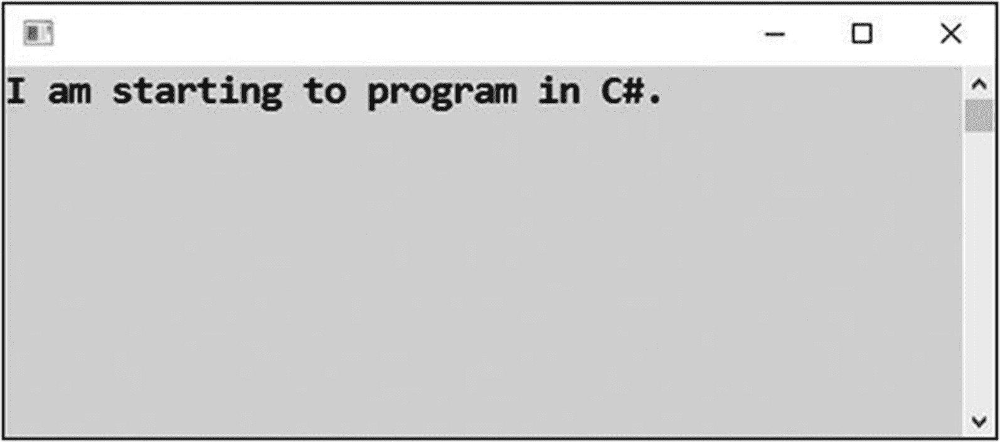

图 2-1

你的第一个程序

## 创建项目

你通过创建一个新的项目来开始每一个新的程序，所以让我们现在就开始吧。

### 启动 Visual Studio

启动 Visual Studio。应出现类似图 [2-2](#Fig2) 的开始屏幕。

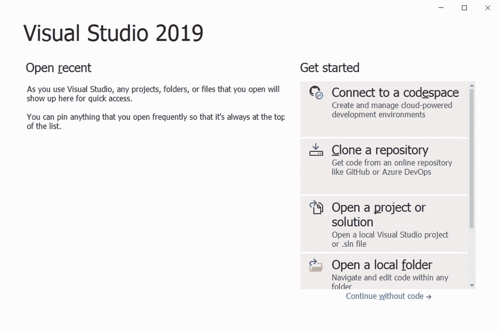

图 2-2

Visual Studio 开始屏幕

向下拖动滚动条，选择“创建新项目”动作(见图 [2-3](#Fig3) )。

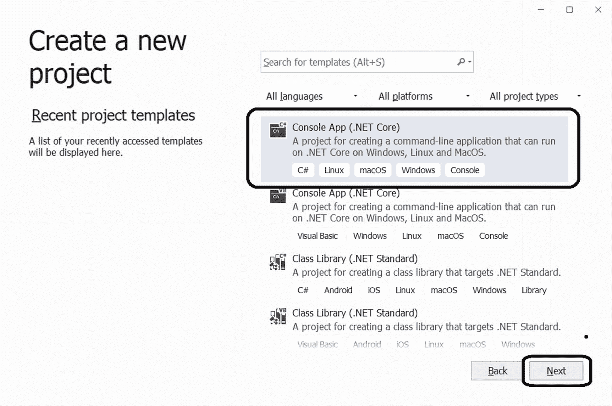

图 2-4

选择项目模板

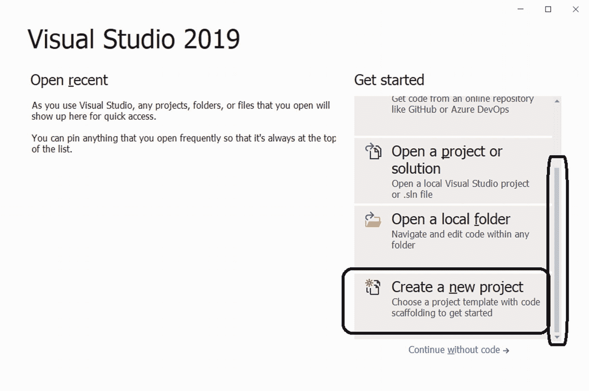

图 2-3

为新项目选择

### 创建新项目

出现的对话框(见图 [2-4](#Fig4) )要求您选择一个新的项目模板。选择控制台应用 C# 模板，然后按下一步按钮。

在下一个对话框中(见图 [2-5](#Fig5) )，键入“我的第一个程序”作为新的项目名称，并按下创建按钮。

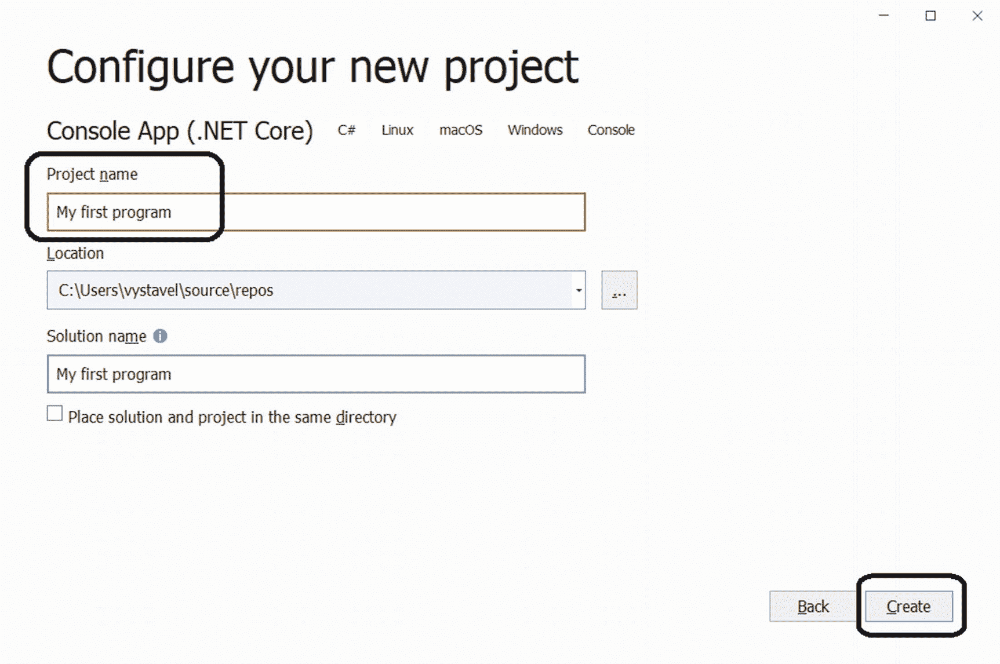

图 2-5

输入新项目的名称

## 编写程序代码

最重要的步骤是编写程序代码，所以请继续阅读。

### 开发环境的外观

项目创建后，Visual Studio 看起来如图 [2-6](#Fig6) 。

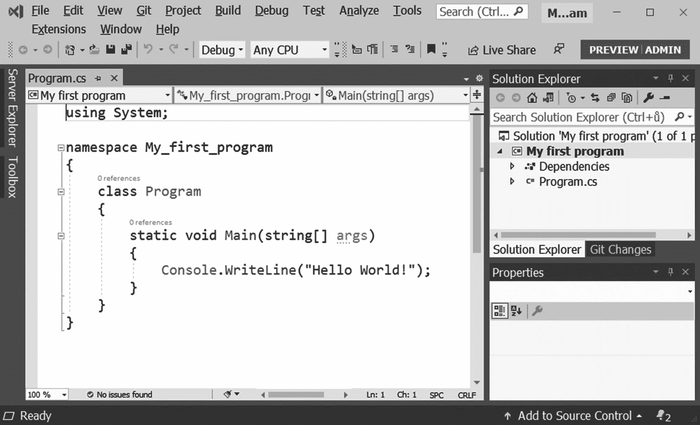

图 2-6

Visual Studio 的外观

开发环境窗口的主要部分被*源代码编辑器*占据。在其中，`Program.cs`文件被打开，正如标签的标题所暗示的。`Program.cs`是新控制台项目的主文件。如您所见，它已经包含了一些源代码。

您可能想知道这些代码是从哪里来的。你还没有写任何一行代码！答案是，当您选择控制台应用模板时，Visual Studio 生成了代码。正如您在创建项目时看到的，Visual Studio 包含许多不同的模板；这些模板是不同类型程序的现成项目框架。

你可以看到代码中包含了一些奇怪的单词，比如`using`、`namespace`、`class`等等。我现在不打算解释这些，因为此时你不需要详细理解它们。但是 Visual Studio 需要这些行，所以不要管它们。你需要知道的是在哪里写你自己的陈述，这是我接下来要解释的。

### 知道在哪里写陈述

你在包含单词`Main`的行后的花括号中写程序语句(见图 [2-7](#Fig7) )。

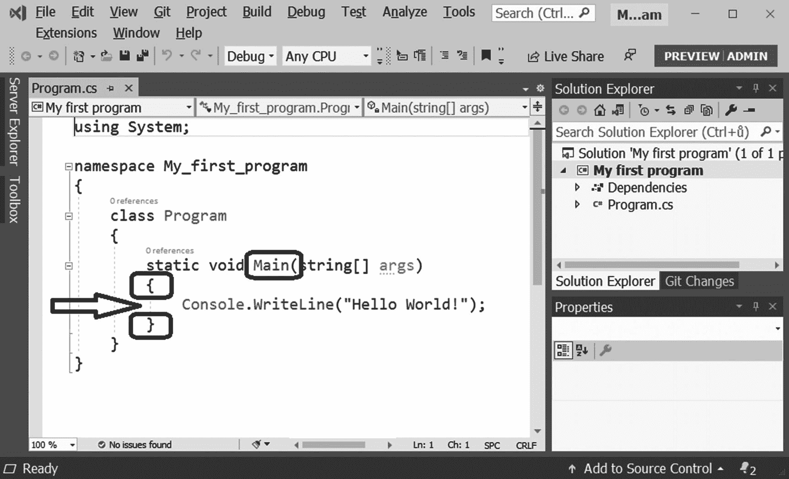

图 2-7

你写陈述的地方

在所有以前的 Visual Studio 版本中，大括号之间的空间是空白的。现在，IDE 创建者决定包含一行代码，您可以在以后删除或修改它。

### 编写代码

在这种情况下，在主行后的花括号中键入以下语句**。确保准确地键入您在这里看到的**。小写和大写之间的区别很重要，分号也很重要！****

```cs
// Output of text to the user
Console.WriteLine("I am starting to program in C#.");

// Waiting for Enter
Console.ReadLine();

```

Visual Studio 现在看起来如图 [2-8](#Fig8) 所示。

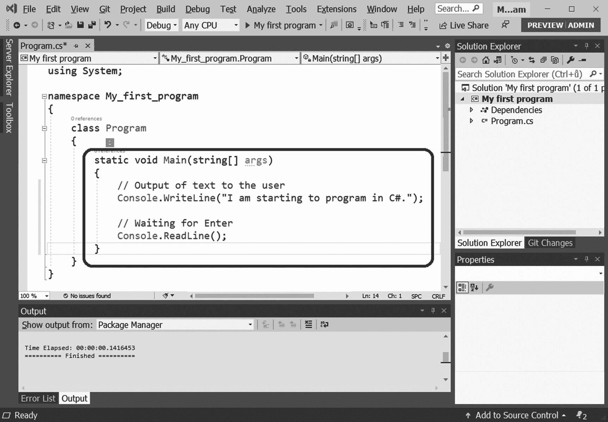

图 2-8

输入您的第一个代码语句

请仔细检查你是否和我在同一个地方输入了语句。同样，它们必须在括号之间。另外，要小心括号。不要意外删除其中任何一个。

`Program.cs`的源代码现在看起来像这样:

```cs
using System;

namespace My_first_program
{
    class Program
    {
        static void Main(string[] args)
        {
            // Output of text to the user
            Console.WriteLine("I am starting to program in C#.");

            // Waiting for Enter
            Console.ReadLine();
        }
    }
}

```

### 理解你的第一句话

这些语句有什么作用？

*   向用户输出(写)一行。

*   `Console.ReadLine`一般来说，读取用户用键盘输入的一行文本。然而，在这种情况下，该语句的目的是让您的程序在一切完成后等待用户按 Enter 键。换句话说，您不希望程序窗口立即消失。

*   两个斜线(`//`)后面的所有内容都将被忽略，直到对应行的末尾。此文本包含您的备注/评论。Visual Studio 将它们涂成绿色。

### 使用智能感知

您可能已经注意到，当您键入时，Visual Studio 会为您提供可用的可能性(参见图 [2-9](#Fig9) )。您可以使用鼠标或使用箭头键然后按 Tab 键来选择一个选项。

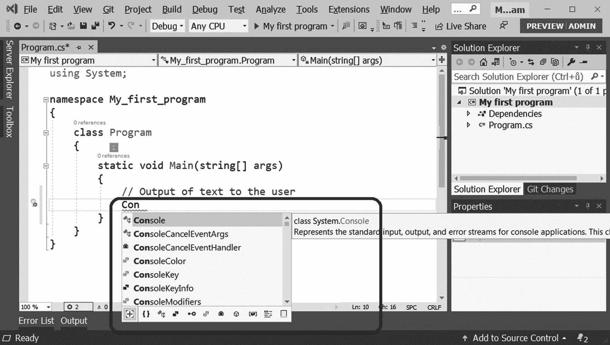

图 2-9

使用智能感知

Visual Studio 中为您提供这些提示的部分称为智能感知。尽量习惯依赖它。这是避免不必要的错别字的最好方法。

## 保存项目

你已经写了几行代码，所以你可能想保存它们。根据 Visual Studio 的默认设置，项目会在每次程序启动前自动保存。但是，有时您希望手动保存更改。在这种情况下，从 Visual Studio 菜单中选择“文件”“➤”“全部保存”,或者单击 Ctrl+S

## 启动您的程序

写完程序后，你通常希望*启动*它，看看它是否“运行”,并检查它是否如你所愿。

做好准备。您的第一个计划发布的伟大时刻即将到来！从 Visual Studio 菜单中选择调试➤开始调试，或者直接按 F5 键。

Visual Studio 构建并启动您的程序(参见图 [2-10](#Fig10) )。该程序输出指定的文本，并等待按下回车键，这正是你的编程方式。

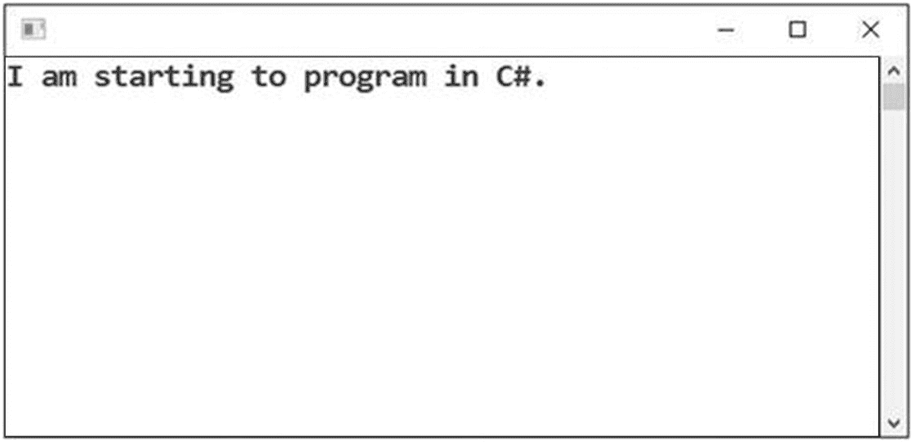

图 2-10

启动您的程序

现在在用户的角色中，按回车键。程序终止，“黑窗口”消失。实际上，这是 Visual Studio 到目前为止的行为。在目前的版本中，增加了一个新的措施来防止控制台窗口消失，正如你在点击 Enter 键后所看到的那样(图 [2-11](#Fig11) )。

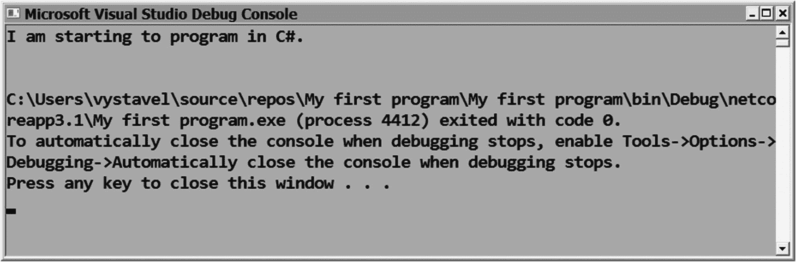

图 2-11

防止窗户消失的附加措施

因为`Console.ReadLine()`防止窗口在 Visual Studio 之外运行时消失，我将在我们所有的程序中包含这个声明。如果您愿意，您可以根据图 [2-11](#Fig11) 的消息中给出的说明禁用新的 Visual Studio measure。

在 Visual Studio 中，选择“工具”“➤选项”菜单。在对话框中，点击调试组，然后勾选“调试停止时自动关闭控制台”选项，按 OK 确认(见图 [2-12](#Fig12) )。

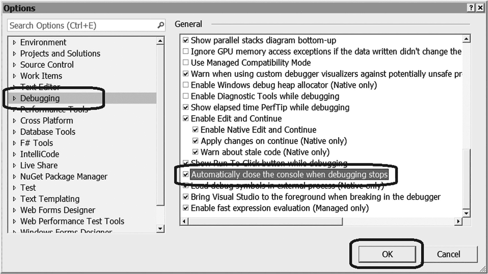

图 2-12

禁用新度量

### 注意

根据您计算机的默认设置，您的程序将以黑底白字显示，如图 [2-10](#Fig10) 所示。然而，为了更好的可读性，我将在浅色背景上以黑色字体显示所有后来的截图(见图 [2-11](#Fig11) )。

## 更改文本大小

你认为输出的文本太小了吗？你需要放大你的程序将要使用的字体吗？

如果是，点击已启动程序“黑屏”左上角的标题栏图标，选择默认(见图 [2-13](#Fig13) )。

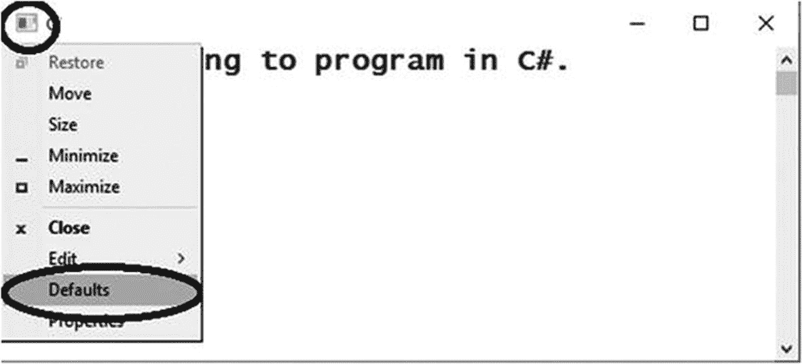

图 2-13

选择默认设置

然后点击字体选项卡，根据自己的喜好更改字体，点击确定按钮确认更改(见图 [2-14](#Fig14) )。

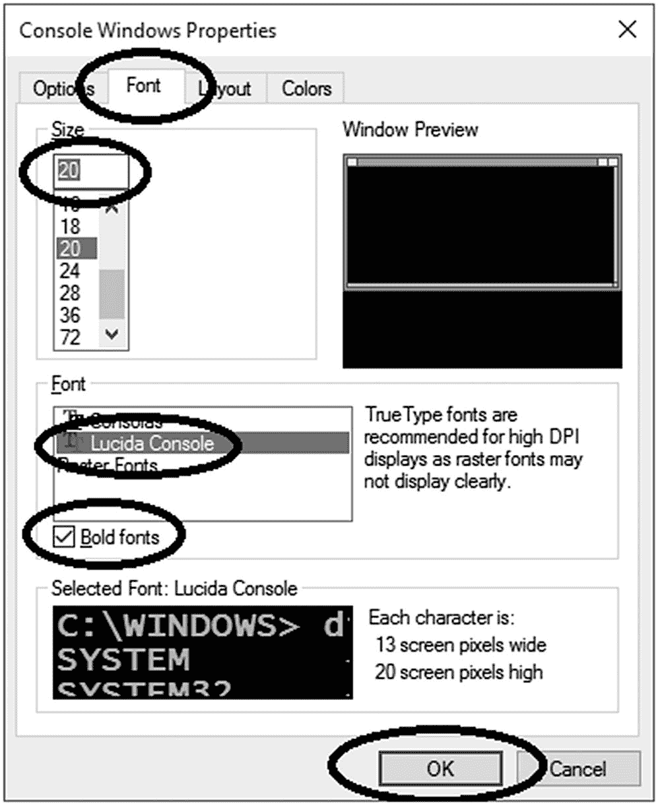

图 2-14

更改字体

下一个程序启动时，将使用新字体。

## 处理错误

如果您没有按照我向您展示的方式编写语句，或者您将它们写在了错误的位置，程序构建将会因错误而不成功地终止。

让我们试试这个！用`Console.WriteLine`语句删除行尾的分号。

当您尝试启动您的程序(通过按 F5 键)时，试验终止，出现错误对话框(参见图 [2-15](#Fig15) )。

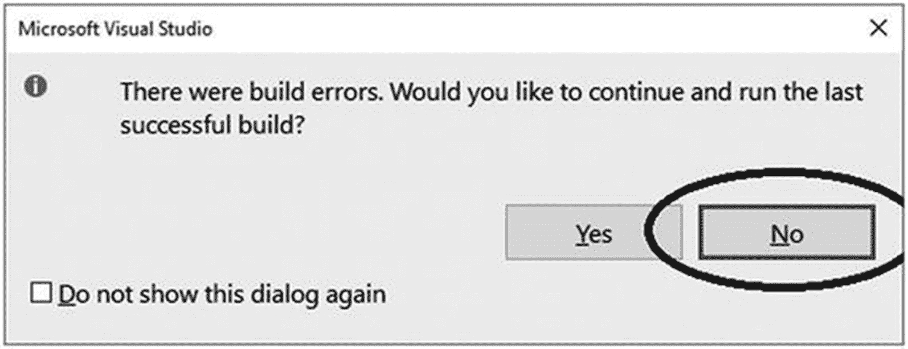

图 2-15

出现错误

在这个对话框中，**总是点击 No**；你不想运行某个旧版本的程序(如果它存在的话)。

点击否后，错误列表窗格出现在底部(见图 [2-16](#Fig16) )。

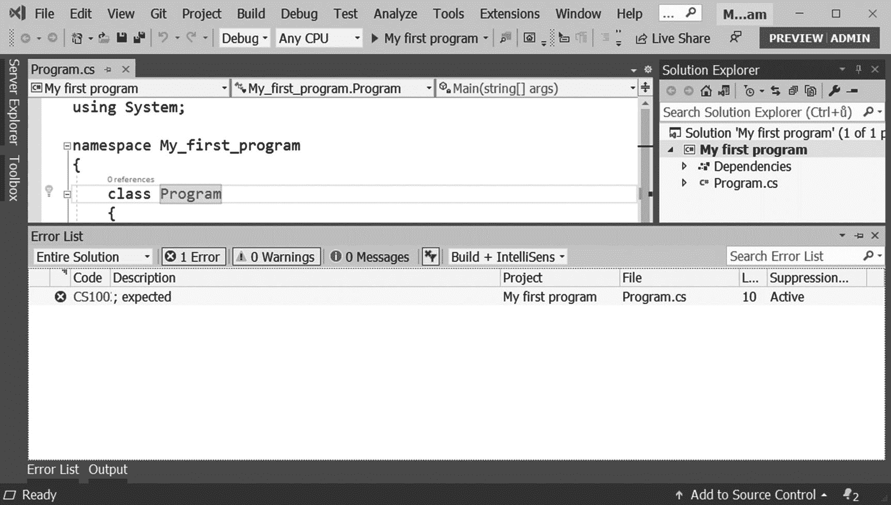

图 2-16

错误表

把删除的分号退回去，一切又好了。以后可能更难发现自己做错了什么，尤其是在编程生涯的初期。没关系——我的观点是，除非你犯了所有可能的错误，否则你不可能成为某个领域的专家。

## 完成你的工作

您已经完成了程序开发的所有基本步骤。在你未来的每一个项目中，你都将沿着同样的路线前进。

你现在需要学习如何终止你的工作，以及如何在以后继续工作。前者简单；您可以通过从菜单中选择“文件”“➤”“关闭解决方案”或关闭整个 Visual Studio 程序来完成此项目的工作。

## 恢复您的工作

当您稍后想要回到您的项目时，可以使用下列方法之一在 Visual Studio 中重新打开它:

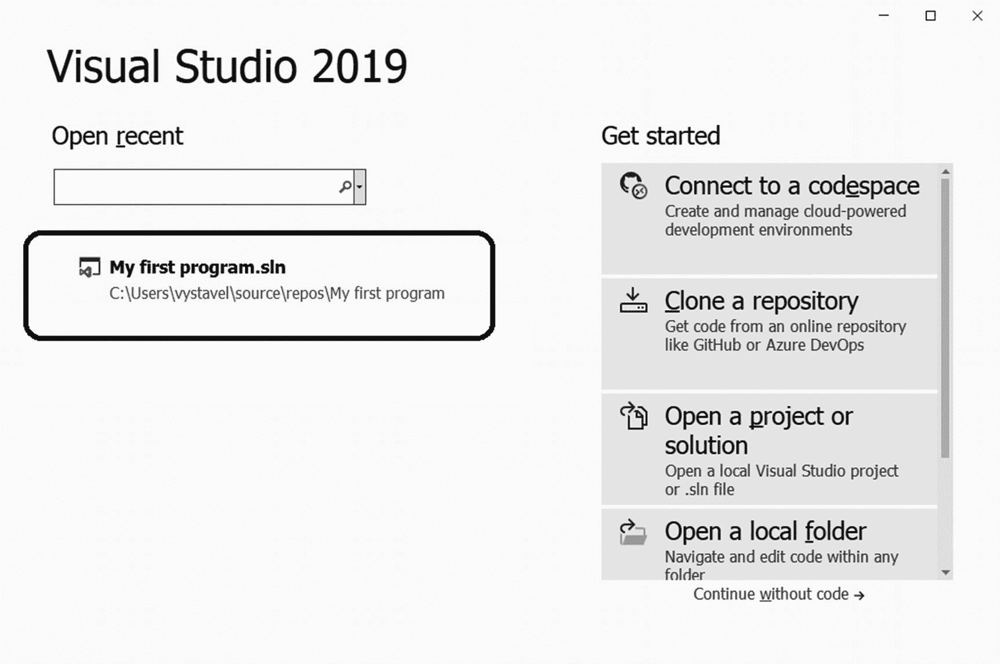

图 2-17

使用起始页

*   *从起始页*:这是 Visual Studio 启动后立即出现的页面，包含指向您最近项目的链接(参见图 [2-17](#Fig17) )。只需点击正确的选项。

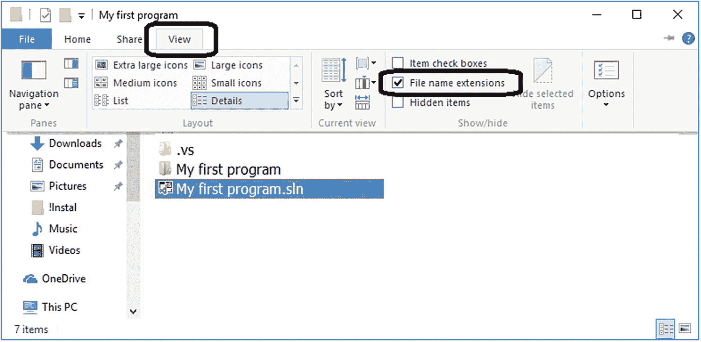

图 2-19

显示扩展

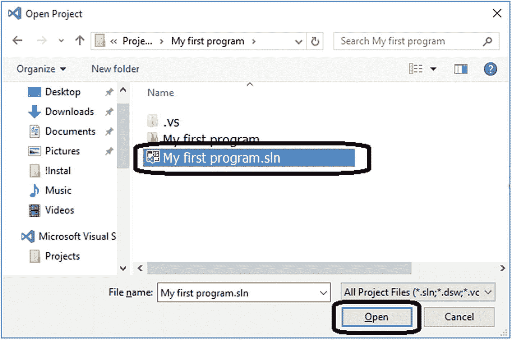

图 2-18

用“打开项目”对话框打开程序

*   *从打开项目对话框*:从 Visual Studio 菜单中选择文件➤打开➤项目/解决方案。打开项目对话框出现，您应该在其中找到您的项目(参见图 [2-18](#Fig18) )。具体来说，就是查找扩展名为`.sln`的文件。如果看不到文件扩展名，请在 Windows 文件资源管理器中打开它们的显示(在“查看”选项卡上，选中“文件扩展名”复选框)，如图 [2-19](#Fig19) 所示。

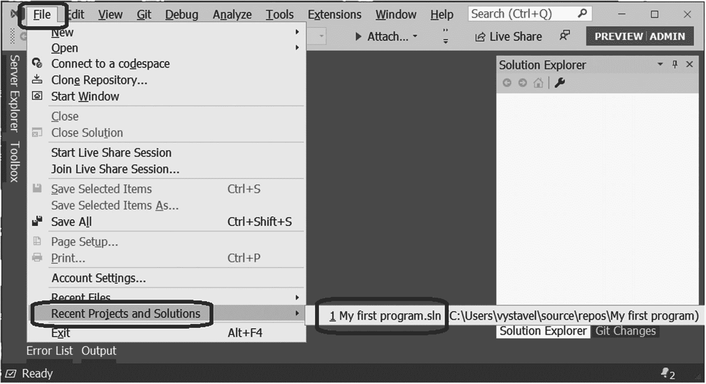

图 2-20

从文件菜单打开您的项目

*   *从最近的项目菜单*:选择文件➤最近的项目和解决方案。Visual Studio 会记住您最近从事的项目。选择合适的项目即可(见图 [2-20](#Fig20) )。

## 转移您的工作

您可能还对如何将项目从您的电脑传输到其他地方感兴趣，以便您以后可以在不同的电脑上处理它。答案很简单。如果您使用的是闪存驱动器、OneDrive 或类似设备，只需转移项目的整个文件夹。

## 使用解决方案浏览器

将项目转移到您应该熟悉的另一台计算机上有一个重要问题。有时，项目是在没有源代码编辑器的情况下打开的(见图 [2-21](#Fig21) )。

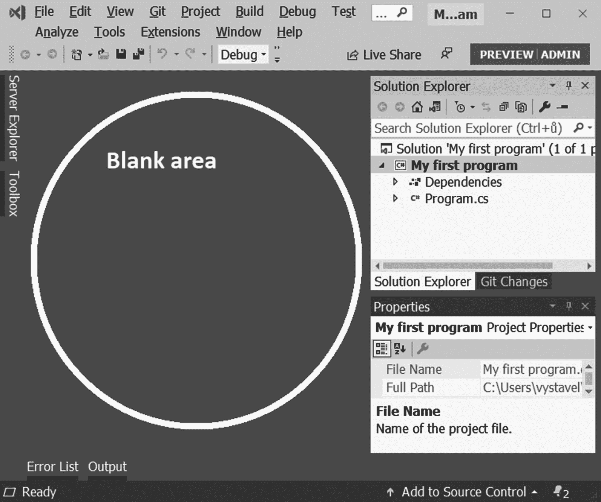

图 2-21

在没有源代码编辑器的情况下打开项目

在这种情况下你会怎么做？有一个名为“解决方案资源管理器”的窗格(子窗口)，通常位于 Visual Studio 窗口的右侧。只需双击你的源代码文件`Program.cs`(见图 [2-22](#Fig22) )。

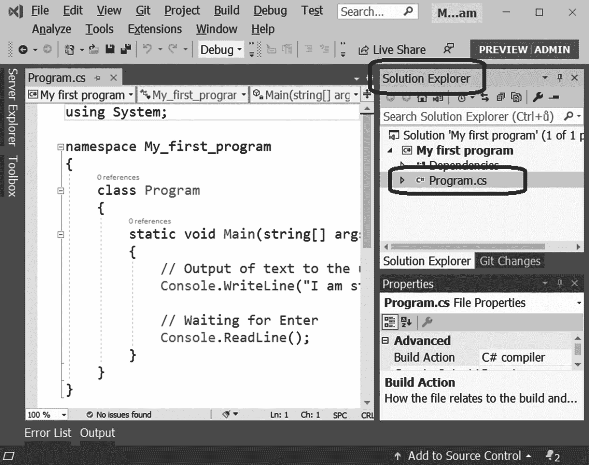

图 2-22

通过解决方案资源管理器打开源代码

连解决方案资源管理器都消失了吗？没问题！在任何时候，您都可以使用菜单选择视图➤解决方案资源管理器来显示它(参见图 [2-23](#Fig23) )。

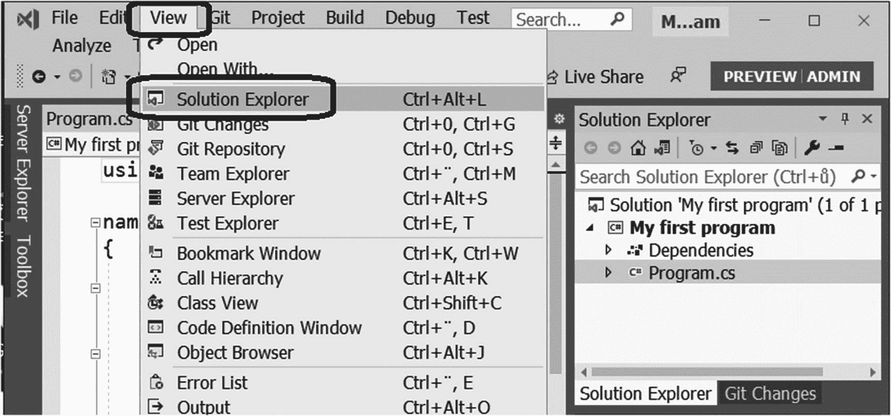

图 2-23

打开解决方案资源管理器

## 摘要

在本章中，您编写了自己的第一个程序，并开始学习如何使用 Visual Studio 开发环境。你经历了程序开发的所有步骤，基本上是这样的:

*   创建项目

*   编辑源代码

*   保存源代码

*   启动程序

*   检测和排除可能的错误

*   将您的项目转移到您的另一台电脑上，以便在其他地方使用**