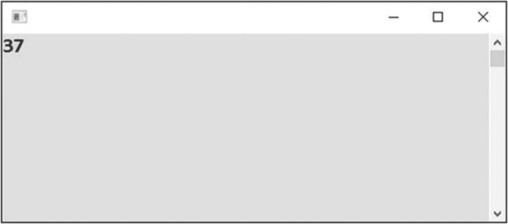
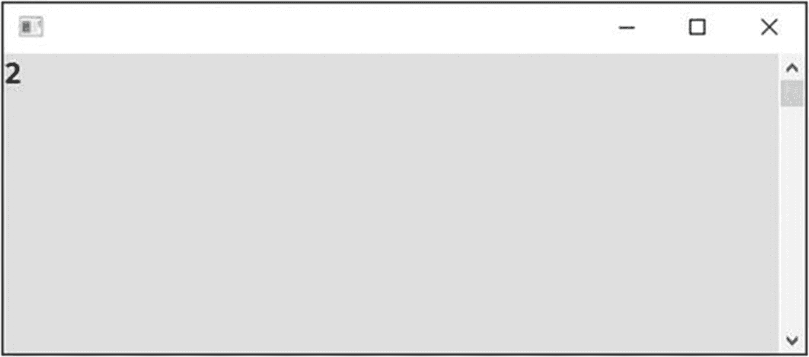
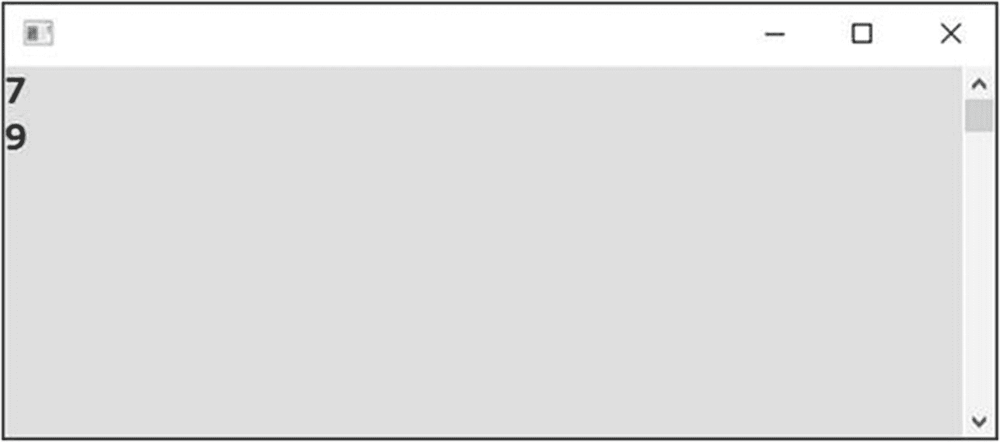
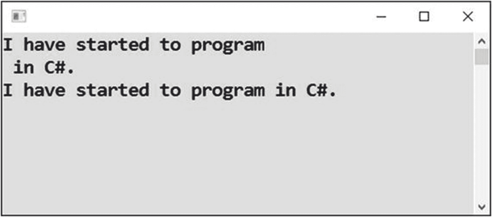
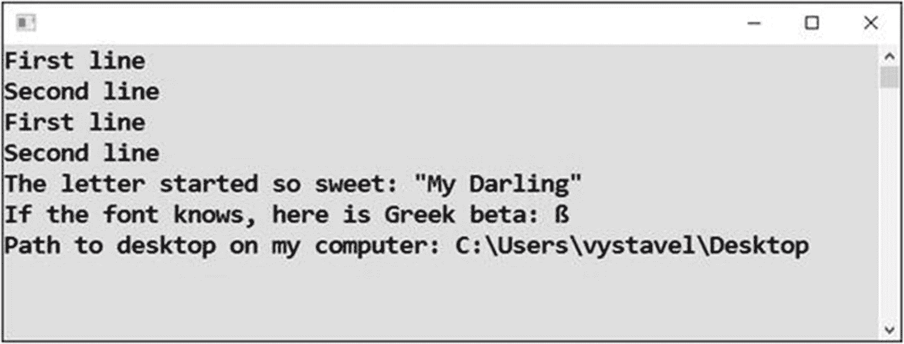
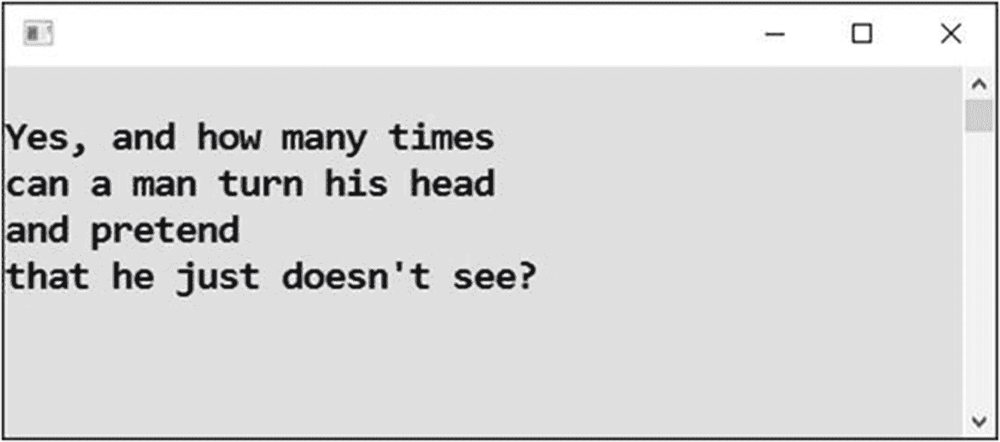
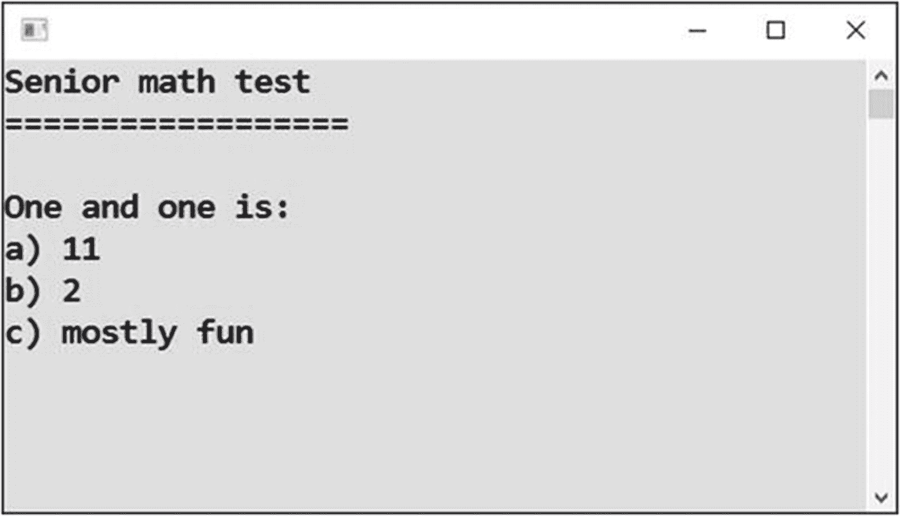

# 三、处理输出

你已经知道了用 C# 语言开发程序时应该采取的所有主要步骤。此外，您已经看到了重要的语句`Console.WriteLine`，它在您的用户屏幕上显示数据。在本章中，您将扩展对这一陈述的了解。我还将向您展示输出的其他可能性。

## 产生数字输出

您已经知道如何显示一些文本。在本节中，您将学习如何显示数字。

### 工作

您将编写一个显示数字 37 的程序(参见图 [3-1](#Fig1) )。



图 3-1

行动中的计划

### 解决办法

在 Visual Studio 中，创建名为 Numeric Output 的新项目。代码类似于您在第 [2](02.html) 章中编写的前一个程序，如下所示:

```cs
static void Main(string[] args)
{
    // Output of a number to the user
    Console.WriteLine(37);

    // Waiting for Enter
    Console.ReadLine();
}

```

Note

在本例中，以及本书中的所有后续示例中，我只向您展示了带有`Main`单词的行之后的代码块。这是您控制的代码块；换句话说，它是你改变的代码块。其余的`Program.cs`源代码应该保持原样，就像你在上一章的第一个程序中那样。

为了确保您理解我的意思，整个源代码看起来像这样:

```cs
using System;

namespace Numeric_output
{
    class Program
    {
        static void Main(string[] args)
        {
            // Output of a number to the user
            Console.WriteLine(37);

            // Waiting for Enter
            Console.ReadLine();
        }
    }
}

```

但是，同样，这是你最后一次看到完整的源代码。没有必要在我每次展示一个例子时都重复 Visual Studio 生成的代码，因为您永远不会更改它。如果您有疑问，可以参考本书附带的完整示例项目。

输入代码后，使用 F5 键启动程序。要终止程序，请按回车键。

### 讨论

与文本不同，数字不用引号括起来。

当然，你可以用引号将“37”括起来，但是数字 37 和文本“37”之间有很大的区别——你可以用数字来计算。这就是为什么你现在正在学习如何正确处理数字。

## 进行计算

接下来的任务是做一个简单的计算。

### 工作

你要向用户显示 1 加 1 是多少(见图 [3-2](#Fig2) )。



图 3-2

1 加 1

### 解决办法

代码如下:

```cs
static void Main(string[] args)
{
    // Output of a calculation
    Console.WriteLine(1 + 1);

    // Waiting for Enter
    Console.ReadLine();
}

```

输入并启动程序！

#### 注意

在编程中，这种计算(一般是值的组合)称为一个*表达式*。

## 进行更复杂的计算

当然，你不需要一台电脑来做 1 对 1 的加法。但是 1 加 2 乘以 3 呢？你觉得这又是可笑的鸡毛蒜皮吗？请稍等片刻，因为即使在这种简单的情况下也很容易出错！

### 工作

您将创建一个程序来将 1 加 2 乘以 3。

### 解决办法

代码如下:

```cs
static void Main(string[] args)
{
    // Multiplication has greater priority
    Console.WriteLine(1 + 2*3);

    // Forcing priority using parentheses
    Console.WriteLine((1 + 2)*3);

    // Waiting for Enter
    Console.ReadLine();
}

```

启动后的程序如图 [3-3](#Fig3) 所示。



图 3-3

做更复杂的计算

### 讨论

请注意该程序的以下内容:

*   此任务的目的是向您展示，您始终必须知道到底需要计算什么。在这个例子中，你必须决定是先做加法还是先做乘法。

*   在基本的数学规则中，乘法和除法的优先级高于加法或减法。编程和数学是一样的。如果你首先想把 1 加到 2 上，然后乘以 3，你需要用括号把 1 和 2 括起来。

*   我没有在乘法符号(星号)周围使用空格，但这与计算顺序无关。我觉得这样更好。在 C# 中，空格和换行符无关紧要。(当然中间不要断一个字。)

*   最后，该示例显示计算机按照编写的顺序执行程序语句。这意味着自上而下。

## 连接文本

现在，您将发现加号运算符(+)也可以用于文本，而不仅仅是数字。换句话说，它将文本添加在一起。

### 工作

任务是探索如何将文本加在一起(见图 [3-4](#Fig4) )。



图 3-4

连接文本

### 解决办法

代码如下:

```cs
static void Main(string[] args)
{
    // Normal text
    Console.WriteLine("I have started to program");

    // Also normal text
    Console.WriteLine(" in C#.");

    // Joining two texts using plus sign
    Console.WriteLine("I have started to program" + " in C#.");

    // Waiting for Enter
    Console.ReadLine();
}

```

注意介词中*前的空格！*

## 输出特殊字符

有时候，你需要输出一个特殊的字符到屏幕上。以下是一些例子:

*   输出回车结束一行。

*   输出引号。(C# 中的引号用作文本分隔符，因此必须特殊对待。)

*   输出一个 Unicode 字符(当然，如果你的字体知道怎么画的话)。

### 工作

现在你要写一个程序来演示如何处理特殊字符。

### 解决办法

要处理特殊字符，可以使用*转义序列*。在 C# 中，转义序列以反斜杠开头。

```cs
static void Main(string[] args)
{

    // Multiline output
    Console.WriteLine("First line\r\nSecond line");

    // I prefer specifying "Enter" in more human form
    Console.WriteLine("First line" + Environment.NewLine + "Second line");

    // Text containing a quote
    Console.WriteLine("The letter started so sweet: \"My Darling\"");

    // Unicode characters, in this case Greek beta
    Console.WriteLine("If the font knows, here is Greek beta: \u03B2");

    // Backslashes themselves need to be doubled
    Console.WriteLine("Path to desktop on my computer: " + "C:\\Users\\vystavel\\Desktop");

    // Waiting for Enter
    Console.ReadLine();
}

```

结果应该如图 [3-5](#Fig5) 所示。



图 3-5

使用特殊字符

### 讨论

请注意该程序的以下内容:

*   在 C# 中，文本中的反斜杠引入了所谓的转义序列。但是如果你想输出一个反斜杠呢？那你需要加倍。在 Windows 操作系统中处理文件路径时，经常会出现这种情况。

*   控制台应用甚至会将简单的`\n`识别为行结束符(表示回车)。然而，在许多其他 C# 程序中，您需要“整个回车”，这用`\r\n`表示。这就是你在这个程序中使用它的原因。你还使用了`Environment.NewLine`，这绝对是最好的选择，因为它可读性很好。

## 使用预格式化文本

有时，你可能想一次显示多行文本(见图 [3-6](#Fig6) )。



图 3-6

多行文本

### 工作

您将创建一个程序来显示多行文本。

### 解决办法

在文本的左引号前加上 at ( `@`)符号，如下所示:

```cs
static void Main(string[] args)
{
    // Bob Dylan...
    Console.WriteLine(@" Yes, and how many times can a man turn his head and pretend that he just doesn’t see?");

    // Waiting for Enter
    Console.ReadLine();
}

```

#### 注意

at ( `@`)符号也关闭转义序列。这就是为什么在 Windows 中处理文件路径时你会发现它很有用(前面提到过)；在这种情况下，您不必将每个反斜杠都加倍。

## 将 1 和 1 相加

在下一个任务中，你将回到 1 加 1 的问题。你想知道为什么我要回到如此琐碎的任务上吗？嗯，即使做一些简单的 1 加 1 的事情也会出错。让我想想。

### 工作

任务是探索将两个数字放在一起的不同方法(见图 [3-7](#Fig7) )。



图 3-7

把数字放在一起

### 解决办法

代码如下:

```cs
        static void Main(string[] args)
        {
            // Pay special attention when mixing texts with numbers!
            Console.WriteLine(
@"Senior math test
==================

One and one is:");
            Console.WriteLine("a) " + 1 + 1);
            Console.WriteLine("b) " + (1 + 1));
            Console.WriteLine("c) " + "mostly fun");

            // Waiting for Enter
            Console.ReadLine();
        }

```

### 讨论

当您将数字与文本混合使用时，结果可能会与您预期的不同！

让我们考虑第一个答案(a)。计算机从左到右计算整个表达式。首先，它接受文本`a)`和一个数字(第一个 1)。它将它们连接在一起成为`a) 1`。然后，它获取这个新文本和最后一个数字(第二个 1)，并再次将它们连接在一起以获得文本`a) 11`。

第二个答案(b)不一样。圆括号使计算机首先执行数字的加法，然后才加入左边的文字。

有时，预先计算中间结果并将它们存储在变量中可能更透明。这是你下一章要研究的内容。当然，正如你将要看到的，变量有更多的用途。

## 摘要

在这一章中，您探索了`Console.WriteLine`语句为不同类型的输出提供的几种可能性。具体来说，您已经了解了以下内容:

*   除了文本，您还可以在程序中使用数字。与文本不同，数字不用引号括起来。

*   您可以将几个值组合成表达式。为此，您可以使用诸如`+`、`-`和`*`这样的操作符。对于数字，他们做普通的算术。加号运算符也适用于文本，在这种情况下，它将两段文本连接成一段。

*   在计算中，你必须时刻注意计算结果的顺序。乘法和除法优先于加法和减法。若要强制不同的评估顺序，请使用括号。

*   引号或换行符等特殊字符使用以反斜杠开头的转义序列输出。

*   通过在多行文本前添加 at ( `@`)符号，可以方便地输出预格式化的多行文本。