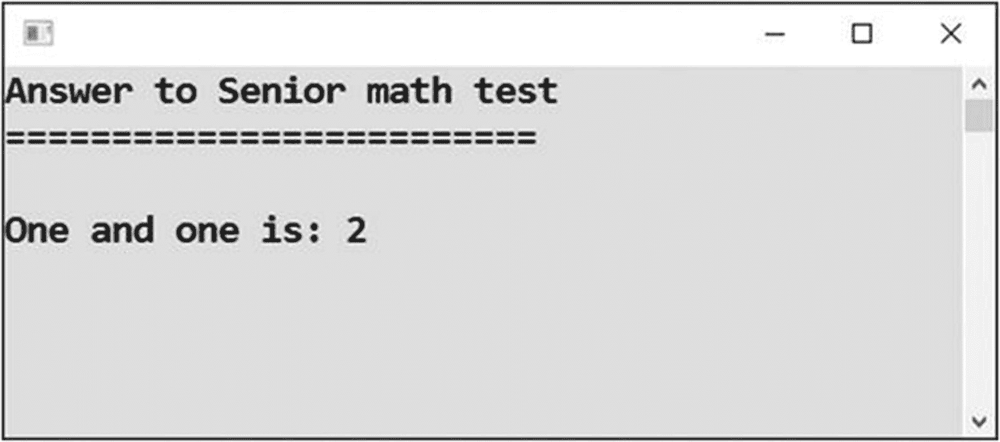
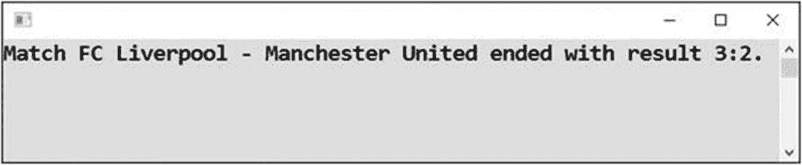
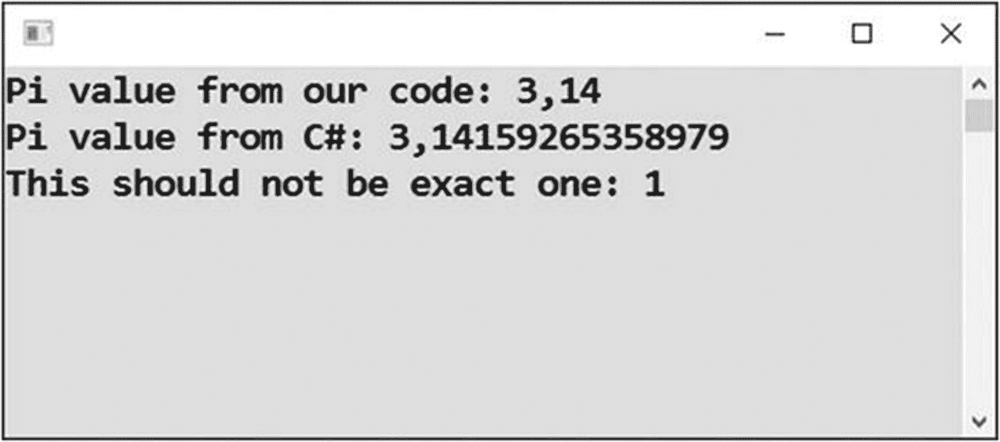

# 四、使用变量

在这一章中，你将学习所有关于变量的知识。一个*变量*是计算机内存中一个程序可以存储东西的指定位置。可以是你想要的任何东西。事实上，你可以根据需要在你的程序中设置任意多的变量。

本章将从一些简单的例子开始，但最终你会发现变量对编程来说是绝对重要的。

## 存储文本

第一项任务将向您介绍变量。您将学习如何使用它们执行一些基本操作。

### 工作

您将创建一个名为`message`的变量。之后，您将在其中存储一些文本。最后，您将向用户显示变量的值。

### 解决办法

代码如下:

```cs
static void Main(string[] args)
{
    // Declaration of a variable to store text
    string message;

    // Storing a value in prepared variable (assignment statement)
    message = "I can't live with you.";

    // Another variable (initialized with some value)
    string anotherMessage = "I can't live without you.";

    // Output of variables
    Console.WriteLine(message);
    Console.WriteLine(anotherMessage);

    // Waiting for Enter
    Console.ReadLine();
}

```

### 讨论

现在我们来讨论解决方案。

#### 变量声明

如果要使用一个变量，需要先*声明*(创建)它。

变量声明语句的一般语法如下:

*类型名称【空间】变量名称【半结肠】*。

在这种情况下，它的内容如下:

```cs
string message;

```

类型表示您想要存储在变量中的值的*类别*。在这种情况下，您希望存储文本，这就是您使用名为`string`的类型的原因。

#### 供选择的

还有一种方法可以编写变量声明语句。在分号前面，可以用等号和变量的初始值。

以下是该语法的一个示例:

```cs
string anotherMessage = "I can't live without you.";

```

#### 赋值语句

代码中还有一点需要解释。第二个声明如下:

```cs
message = "I can't live with you.";

```

这存储了一个值(文本“我不能和你一起生活。”)在预备变量(`message`)中，它被称为*赋值语句*。当你想存放东西的时候，你可以用它。

赋值语句的一般语法如下:

*   *WHERE(TO STORE)= WHAT(TO STORE)；*

## 存储数字

在下一个任务中，您将学习存储数字而不是文本的变量。

### 工作

您将创建(*声明*)一个名为`number`的变量。之后，你会在里面储存一些数字。最后，您将向用户显示变量的值。

### 解决办法

数值的数据类型称为`int`。严格地说，这是用于*整数*数(整数)的数据类型。不久你就会明白区分整数和小数在编程中的重要性。

```cs
static void Main(string[] args)
{
    // Variable for storing number (with initial value)
    int number = -12;

    // Output of value of the variable
    Console.WriteLine("Value of the variable: " + number);

    // Waiting for Enter
    Console.ReadLine();
}

```

不要忘记，输入的数字*不带引号*。

## 将 1 和 1 相加

什么事？又把 1 和 1 相加？你可能认为我要疯了！

### 工作

在前一章中，我告诉过你，当把数字和文本结合起来时，变量可以给你提供更大的确定性。现在我回到这个建议。

### 解决办法

代码如下:

```cs
      static void Main(string[] args)
        {
            // Precalculation of result (into a variable)
            int sum = 1 + 1;
            // Output to the user
            Console.WriteLine(
@"Answer to Senior math test
=========================

One and one is: " + sum);

            // Waiting for Enter
            Console.ReadLine();
        }
    }

```

程序运行结果见图 [4-1](#Fig1) 。



图 4-1

1 加 1 计划的结果

### 讨论

请将 1 加 1 的计算与上一章的计算进行比较。这里，您将结果显式存储在一个变量中。这可以让你避免可能出现的评估顺序问题和得到 11 的错误答案。

## 使用变量进行计算

在下一个任务中，您将学习如何同时使用几个变量。

### 工作

你将在两个变量中存储一些数字。之后你会把他们的和算进第三个。

### 解决办法

代码如下:

```cs
static void Main(string[] args)
{
    // 1\. SOLUTION
    // Values to be summed
    int firstNumber = 42;
    int secondNumber = 11;

    // Calculating
    int sum = firstNumber + secondNumber;

    // Output
    Console.WriteLine("Sum is: " + sum);

    // 2\. SOLUTION
    // Declaring all variables at once
    int thirdNumber, fourthNumber, newSum;

    // Values to be summed
    thirdNumber = 42;
    fourthNumber = 11;

    // Calculating
    newSum = thirdNumber + fourthNumber;

    // Output
    Console.WriteLine("Calculated another way: " + newSum);

    // Waiting for Enter
    Console.ReadLine();
}

```

### 讨论

两个(备选)解决方案显示了您经常会遇到的两种情况:

*   你声明一个变量，然后*立即*在其中存储一个值。

*   你首先声明一个变量，然后在这个变量中存储一个值。

## 组装一个大组合

通常，您需要将几个值组合成输出。在本任务中，您将学习如何操作。

### 工作

我将通过一个足球比赛结果的例子向您展示如何组装复杂的文本(图 [4-2](#Fig2) )。



图 4-2

大组合计划

在本例中，您有一些固定文本、一些(潜在的)可变文本和一些(潜在的)可变数字。这是典型的现实情况。

### 解决办法

要存储(潜在的)变量值，可以使用变量。当然，这些值在这个简单的程序中实际上是固定的，但是通常您会从其他地方获得它们(比如用户、文件、数据库或 web 服务)。你将在本书的后面学习如何从用户那里获得输入。

```cs
static void Main(string[] args)
{
    // Data in variables
    string club1 = "FC Liverpool";
    string club2 = "Manchester United";
    int goals1 = 3;
    int goals2 = 2;

    // Output of match result
    Console.WriteLine(
        "Match " + club1 + " - " + club2 +
        " ended with result " +
        goals1 + ":" + goals2 + ".");

    // Waiting for Enter
    Console.ReadLine();
}

```

### 讨论

在解决方案中，您应该特别注意以下几点:

*   您使用不同数据类型的变量来存储不同种类的值。

*   您正在从由八个加号连接在一起的九个部分构建显示的消息。信息的某些部分是固定的，而其他部分是可变的。

## 使用十进制数字

在编程中，你需要彻底区分整数和小数。你已经知道如何处理整数，所以现在你将看到小数。

### 工作

在这项任务中，我将向您展示一些如何处理小数的示例。

### 解决办法

在 C# 中，对于十进制数有一种叫做`double`的类型。代码如下:

```cs
static void Main(string[] args)
{
    // IN CODE, decimal separator is always DOT regardless of computer language settings
    double piApproximately = 3.14;

    // Pi is already available in C#
    double piMorePrecisely = Math.PI;

    // Decimal numbers have always limited precision
    double notCompletelyOne = 0.999999999999999999;

    // Outputs
    Console.WriteLine("Pi value from our code: " + piApproximately);
    Console.WriteLine("Pi value from C#: " + piMorePrecisely);
    Console.WriteLine("This should not be exact one: " + notCompletelyOne);

    // Waiting for Enter
    Console.ReadLine();
}

```

### 讨论

请注意以下几点:



图 4-3

十进制数字程序的结果

*   在代码中，您总是需要使用小数点*作为数字的整数和小数部分之间的分隔符。*

*   但是，输出取决于您的 Windows 设置。正如你在图 [4-3](#Fig3) 中看到的，我电脑上的输出使用逗号作为小数点分隔符，因为我的电脑设置为捷克语。

*   你也可以看到十进制数没有无限的精度。它们在大约 15 个有效数字后四舍五入。

## 使用逻辑值

在编程中，你经常会用到*逻辑值*，也就是“是”和“否”的值。

### 工作

在这项任务中，我将向您展示如何使用逻辑值。

### 解决办法

在 C# 中，逻辑值的类型称为`bool`。值“是”写成`true`，值“否”写成`false`。下面是代码:

```cs
static void Main(string[] args)
{
    // Two logical (Boolean) variables
    bool thePrettiestGirlLovesMe = true;
    bool iAmHungry = false;

    // Use exclamation mark to negate logical value
    bool iAmNotHungry = !iAmHungry;

    // Output
    Console.WriteLine("She loves me: " + thePrettiestGirlLovesMe);
    Console.WriteLine("I am hungry: " + iAmHungry);
    Console.WriteLine("I am not hungry: " + iAmNotHungry);

    // Waiting for Enter
    Console.ReadLine();
}

```

### 讨论

请注意，每当您需要否定一个逻辑值时(将它从“是”翻转到“否”，然后再翻转回来)，您都会使用感叹号。

## 摘要

在这一章中，你已经了解了变量的重要概念。在每一个真实的程序中，你都需要临时存储值(计算结果、用户输入等。)在计算机的内存中，这正是你使用变量的目的。变量是内存中的一个位置，它有一个引用它的名称和它的数据类型，以明确你将在其中存储什么类型的数据。

具体来说，您学到了以下内容:

*   在使用变量之前，必须先声明它。合适的说法是`string message;`。

*   要在变量中存储一个值，可以使用赋值语句格式*where = what*；。比如`message = "Some text";`。

*   在 C# 中，文本的数据类型是`string`。

*   整数的数据类型是`int`。

*   在编程中，与通常的用法相反，必须注意区分整数和小数。

*   十进制数的数据类型是`double`。

*   有一种称为`bool`的特殊数据类型，用于存储所谓的逻辑值`true`和`false`，它们在计算机上相当于“是”和“否”