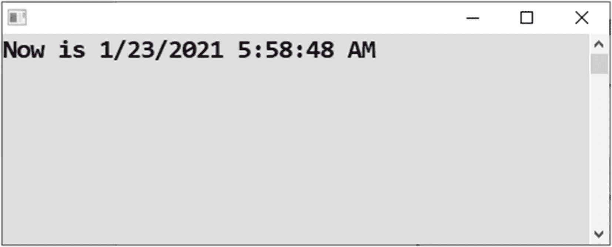
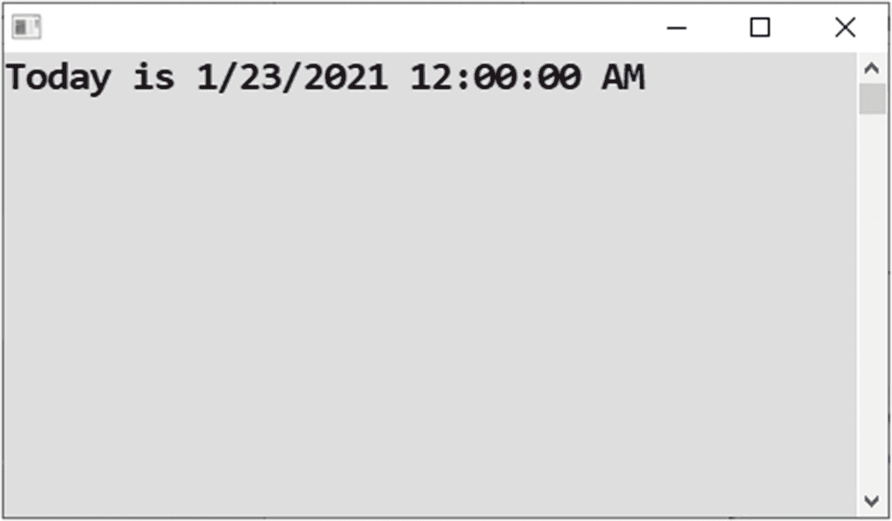

# 五、使用对象

类型为`string`、`int`、`double`和`bool`的变量总是包含一个值——文本、一个数字或一个是/否值。然而，这样的“原子”值可以被分组到称为*对象*的集合中。单个对象可以包含多个值，这些值被称为其*组件*或*成员*。例如，分组可以发展到一个对象内部可以包含几个其他对象。在这一章中，你将学习关于物体的知识。

## 现在几点了？

您将遇到的第一个对象是一个`DateTime`对象，它包含单个时间实例的各种组件，比如日、月、年、小时、分钟、秒等等。

### 工作

您将编写一个向用户显示当前日期和时间的程序(参见图 [5-1](#Fig1) )。



图 5-1

显示当前日期和时间

在这个任务中，你将了解`DateTime`类型的物体。

### 解决办法

代码如下:

```cs
static void Main(string[] args)
{
    // Variable of DateTime type, at first empty
    DateTime now;

    // Storing of current date and time into our variable
    now = DateTime.Now;

    // Output
    Console.WriteLine("Now is " + now);

    // Waiting for Enter
    Console.ReadLine();
}

```

## 今天是几号？

让我们进一步研究一下`DateTime`对象。

### 工作

假设您只对今天的日期感兴趣，不包括时间部分(见图 [5-2](#Fig2) )。



图 5-2

仅显示日期

在许多程序中，今天的日期和当前的时间相差很大！

### 解决办法

代码如下:

```cs
static void Main(string[] args)
{
    // Variable of DateTime type, at first empty
    DateTime today;

    // Storing of today's date (without time component)
    today = DateTime.Today;

    // Output
    Console.WriteLine("Today is " + today);

    // Waiting for Enter
    Console.ReadLine();
}

```

## 使用日期组件

你可能想知道提到的对象的*组件*在哪里。让我们看看`DateTime`对象的组件。如果将一个`DateTime`类型的变量附加一个点，Visual Studio IntelliSense 会显示所有可能的可用组件。

### 工作

您将了解到`DateTime`对象的各种组件。

### 解决办法

代码如下:

```cs
static void Main(string[] args)
{
    // Current date and time (using single statement)
    DateTime now = DateTime.Now;

    // Picking up individual components
    int day = now.Day;
    int month = now.Month;
    int year = now.Year;
    int hours = now.Hour;
    int minutes = now.Minute;
    int seconds = now.Second;
    DateTime justDateWithoutTime = now.Date;

    // Output
    Console.WriteLine("Day: " + day);
    Console.WriteLine("Month: " + month);
    Console.WriteLine("Year: " + year);
    Console.WriteLine("Hours: " + hours);
    Console.WriteLine("Minutes: " + minutes);
    Console.WriteLine("Seconds: " + seconds);
    Console.WriteLine("Date component: " + justDateWithoutTime);

    // Formatting output our way
    Console.WriteLine("Our output: " +
        year + ", " + month + "/" + day +
        " " +
        hours + " hours " + minutes + " minutes");

    // Waiting for Enter
    Console.ReadLine();
}

```

图 [5-3](#Fig3) 显示了`DateTime`物体的组成部分。


图 5-3

日期时间对象的组件

## 使用名称空间

好了，现在你已经见到了你的第一个对象，我应该告诉你一些关于名称空间的事情。

### 重要用途

在最后一个项目仍然打开的情况下，使用两个斜杠注释掉`Program.cs`源代码中的第一行(`using System;`)(参见图 [5-4](#Fig4) )。您也可以删除该行。然而，要回到最初的版本，更方便的是只注释掉这一行。


图 5-4

注释掉第一行

一瞬间，源代码中出现了大量的红色波浪。当您尝试使用 F5 键启动您的程序时，它将无法启动(参见图 [5-5](#Fig5) )。


图 5-5

获取错误

提醒您一下，在出现的错误对话框中，总是单击“否”。

出现的错误列表窗格显示了大量错误——突然，Visual Studio“不知道”任何一个`DateTime`或`Console`(参见图 [5-6](#Fig6) )。


图 5-6

错误列表窗格

`using`线挺重要的吧？接下来我会解释原因。

### 名称空间

C# 中的几乎所有东西都属于某个更高层次的单元。在这种情况下，`DateTime`和`Console`都属于`System` *名称空间*。如果您想使用它们，您必须在源代码的顶部用一行`using`声明相应的名称空间。否则，Visual Studio 不理解它们。

为什么会有名称空间这样的东西？你要它们做什么？嗯，对象的名字并不是无限的，所以你需要指定你使用的是哪一个。例如，你不需要使用微软的`DateTime`类；你可以编写你自己的`DateTime`，或者你可以从另一个程序员那里购买一些美妙的`DateTime`。这就是为什么你需要一种方法来区分它们。这种方式是通过*命名空间*。

每个对象类型都属于某个名称空间。例如，`System`名称空间是由微软“管理”的。如果我准备了自己的`DateTime`，我可能会把它放在`RadekVystaveˇl.Books`名称空间中。

好吧，也许没人需要自己做`DateTime`，但是还有更好的例子。例如，为具有图形用户界面的程序中的文本框控件准备的`TextBox`类存在于微软的至少四个版本中:

*   对于 Windows 窗体技术中的桌面应用

*   对于 WPF 科技的桌面应用

*   对于 web 应用

*   对于所谓的通用(面向触摸)应用

提到的每个文本框都属于一个单独的名称空间。

### 不使用

如果你现在删除你用来注释掉`using System` `;`行的两个斜线，一切都会恢复到正常状态。然而，看看没有`using`的程序会是什么样子可能会很有趣，这也是你接下来要做的。

在您的源代码中，您需要用适当的名称空间，即`System`，用*限定`DateTime`和`Console`的所有出现的*。从技术上讲，限定是通过在被限定的名称前面加上名称空间来执行的。

```cs
//using System;

namespace Date_components__without_using_
{
    class Program
    {
        static void Main(string[] args)
        {
            // Current date and time (using single statement)
            System.DateTime now = System.DateTime.Now;

            // Picking up individual components
            int day = now.Day;
            int month = now.Month;
            int year = now.Year;
            int hours = now.Hour;
            int minutes = now.Minute;
            int seconds = now.Second;
            System.DateTime justDateWithoutTime = now.Date;

            // Output
            System.Console.WriteLine("Day: " + day);
            System.Console.WriteLine("Month: " + month);
            System.Console.WriteLine("Year: " + year);
            System.Console.WriteLine("Hours: " + hours);
            System.Console.WriteLine("Minutes: " + minutes);
            System.Console.WriteLine("Seconds: " + seconds);
            System.Console.WriteLine("Date component: " + justDateWithoutTime);

            // Formatting output our way
            System.Console.WriteLine("Our output: " +
                year + ", " + month + "/" + day +
                " " +
                hours + " hours " + minutes + " minutes");

            // Waiting for Enter
            System.Console.ReadLine();
        }
    }
}

```

用`using` s 更好，不是吗？

## C# 9.0 极简程序

因为我们正在试验`Main`方法之外的东西，所以现在是了解 C# 9.0 创新的适当时机，它允许您省略“样板代码”，即`namespace`、`class`和`Main`行(当然，加上相应的括号)。

尽快回到本章中的“使用日期组件”，并再次在 Visual Studio 中打开适当的项目。

除了`using`行之外，删除所有不属于我们代码的内容。具体来说，您应该删除以`namespace`、`class`和`Main`开头的三行，加上三个左括号和三个右括号。您在 Visual Studio 中的代码编辑器将如图 [5-7](#Fig7) 所示。


图 5-7

省略“样板代码”

按 F5 键运行程序。起初，删除所有这些行似乎不是一个好主意(见图 [5-8](#Fig8) )。


图 5-8

Visual Studio 抱怨 C# 版本

IDE 抱怨 C# 版本，至少在我用 Visual Studio 预览版的电脑上是这样。错误信息说我们需要 C# 9.0。因此，如果我们设法切换到 C# 9.0，我们的案例最终可能不会失败。

从 Visual Studio 菜单中，选择项目➤属性(参见图 [5-9](#Fig9) )。


图 5-9

选择项目属性菜单

在出现的屏幕中，转到目标框架组合框并选择“”。NET 5.0”(见图 [5-10](#Fig10) )。这将打开 C# 9.0。


图 5-10

改变目标

再次按 F5 键，程序现在应该可以顺利启动了。

## 使用环境对象

作为本章的总结，你将再看一眼你已经知道的`Environment`物体。从不同的角度看待事物是富有成效的。

### 工作

`Environment`对象包含关于程序“环境”的信息(例如，关于计算机和操作系统)。您已经看到了`Environment.NewLine`组件。现在，您将了解更多组件。

### 解决办法

代码如下:

```cs
static void Main(string[] args)
{
    // Displaying components of Environment object
    Console.WriteLine("Device name: " + Environment.MachineName);
    Console.WriteLine("64-bit system: " + Environment.Is64BitOperatingSystem);
    Console.WriteLine("User name: " + Environment.UserName);

    // Waiting for Enter
    Console.ReadLine();
}

```

与前面的程序相反，这里我没有将对象组件提取到变量中。我直接使用它们只是为了让你能看到使用它们的另一种可能的方式。

## 摘要

在这一章中，你已经熟悉了对象，它本质上是几个组件的聚合。与“原子”(单值)类型如`int`或`string`相反，对象通常包含许多值。

具体来说，您遇到了以下情况:

*   `DateTime`对象，可用于检索当前日期或时间

*   `Environment`对象，可用于检索程序的“环境”信息，如计算机名或用户名

您还学到了以下内容:

*   对象可以存储在适当类型的变量中。

*   一个对象的组件可以通过所谓的*点符号*来访问。您写下对象变量的名称并添加点，由于 Visual Studio IntelliSense，可用组件的列表会弹出。

*   每个对象类型都属于某个名称空间。简单地说，名称空间可以被看作是相似对象类型的容器。

*   一个重要的名称空间是`System`名称空间，它包含基本的对象类型，如`DateTime`或`Console`。

*   您指出您想要使用一个特定的名称空间，在源代码的开头有一个`using`行。

*   如果没有包含适当的`using`行，就必须完全限定类型名。这意味着您要在类型的名称前面加上名称空间的名称和一个点。

*   C# 9.0 允许您省略所谓的“样板”代码，即从项目模板中生成的代码，而不是由您编写的代码。