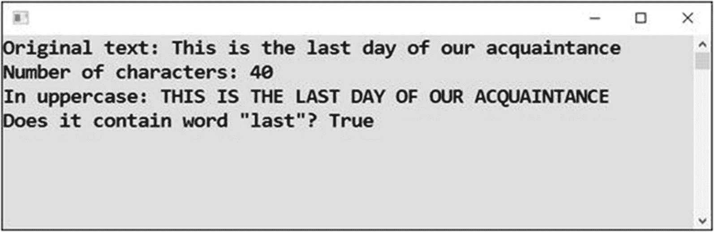
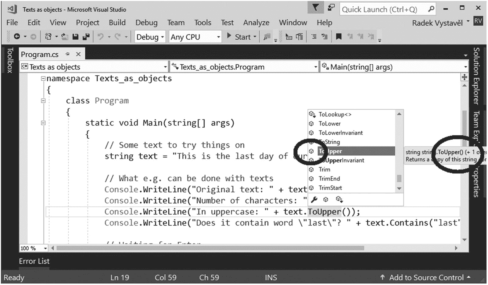
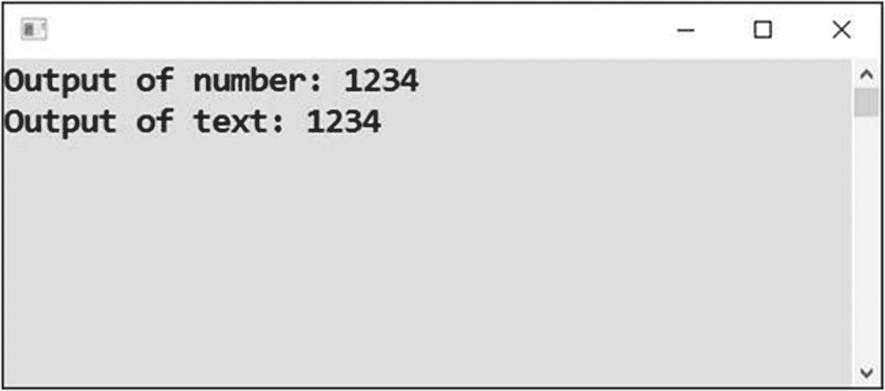
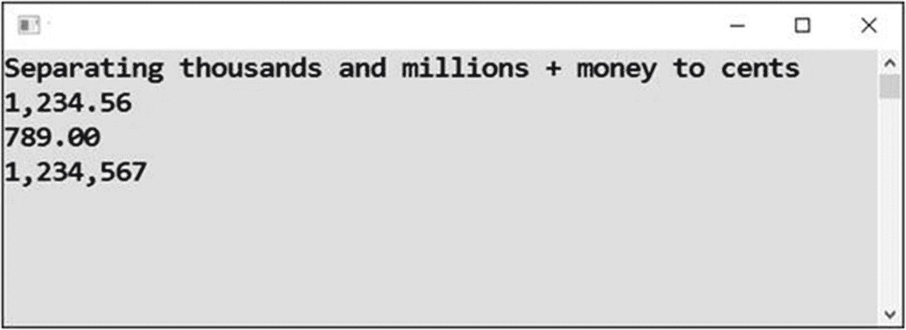
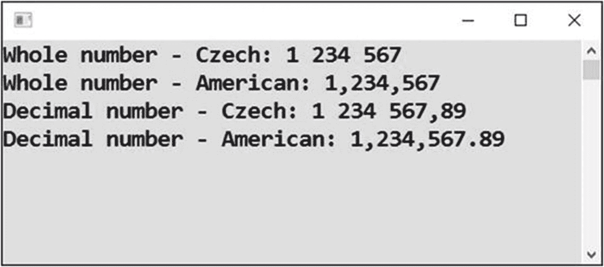
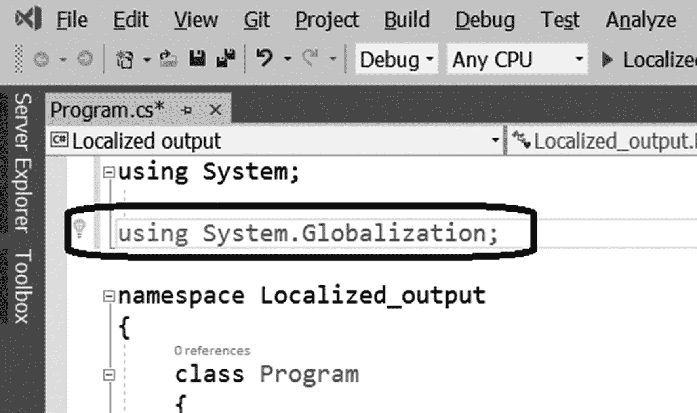

# 七、关于对象的更多信息

您已经看到一个对象充当数据聚集或容器。您已经看到了它所包含的数据作为它的属性，在对象名后面加上一个点就可以访问这些属性。*访问*一个属性意味着要么质疑它的价值，要么赋予它一个新的价值。

您还发现了(可能很多)动作可以与一个对象相关联。动作被称为*方法*，和属性一样，它们可以在对象名称后添加一个点来访问。此外，访问一个对象的特定方法需要在方法名中添加一对括号，括号内可能有参数值。*访问*一个方法(通常你会说*调用*它)意味着启动它实现的操作并执行它包含在里面的语句(在你不知道的情况下)。

这些是用对象编程的原则，它们是你在前两章中学习的基础。这一章将通过让你更深入地了解事物来充实你的知识。

现在让我们更深入地研究一下对象。

## 作为对象的文本

在 C# 中，即使是普通的文本也表现得像一个对象；你可以在文本上加一个点，这样就有很多可能性。让我们来看看。

### 工作

您将创建一个程序，显示文本的多个字符，将文本转换为大写，并检查文本是否包含特定的单词(图 [7-1](#Fig1) )。



图 7-1

最终方案

### 解决办法

代码如下:

```cs
static void Main(string[] args)
{
    // Some text to try things on
    string text = "This is the last day of our acquaintance";

    // What e.g. can be done with texts
    Console.WriteLine("Original text: " + text);
    Console.WriteLine("Number of characters: " + text.Length);
    Console.WriteLine("In uppercase: " + text.ToUpper());
    Console.WriteLine("Does it contain word \"last\"? " + text.Contains("last"));

    // Waiting for Enter
    Console.ReadLine();
}

```

### 讨论

数据成员(如`Length`)没有括号，与方法(如`ToUpper`、`Contains`)相反，即使它们之间没有任何东西，也总是需要括号。

如何快速发现某个东西是否是方法(因此需要括号)？您可以通过查看智能感知中的紫色立方体或在工具提示中查找括号来完成此操作(参见图 [7-2](#Fig2) )。



图 7-2

检查某个东西是否是一个方法

## 作为对象的数字

在前面的练习中，您看到了普通文本——一个类型为`string`的值——可以表现得像一个对象，并显示内部组件，如属性和方法。现在你会看到偶数可以表现得像物体一样，尽管它们的行为要稀疏得多。其实唯一值得一提的是转换成文本的动作。

### 工作

您将探索在一个数字变量上附加一个点后会弹出什么，并且您将学习如何将数字转换成文本。

### 解决办法

要将一个数字转换成它的文本表示，使用`ToString`方法。实际上，要将**的任何东西**转换成文本，C# 中总有可用的`ToString`方法(action)。

```cs
static void Main(string[] args)
{
    // Some number
    int number = 1234;

    // Conversion to text
    //string numberAsText = number; // DOES NOT WORK!
    string numberAsText = number.ToString();

    // Output
    Console.WriteLine("Output of number: " + number);
    Console.WriteLine("Output of text: " + numberAsText);

    // Waiting for Enter
    Console.ReadLine();
}

```

### 讨论

您可以看到类型为`int`的值不能直接赋给类型为`string`的变量。你得先把它转换成文本形式。

当然，在输出中，你看不到任何区别(见图 [7-3](#Fig3) )。



图 7-3

输出

然而，很多时候你需要将一个数字转换成文本，而不是立即显示出来。然后，您将把值的文本形式存储在一个`string`类型的变量中，这就是您刚才看到的。

作为讨论的总结，我将告诉你为什么你看不到图 [7-3](#Fig3) 的两条线有任何不同:

*   `Console.WriteLine`方法将获得的所有内容转换成文本。它在幕后使用`ToString`转换来实现这一点。

*   如果您使用加号将一些文本与一个数字连接起来，该数字会自动转换为 C# 中的文本。如果你想要更大的控制力，总是写下与数字相关的`.ToString()`。

## 格式化数字

在上一个练习中，您忙于将数字转换成文本表示。然而，单个数字可以通过多种方式以文本形式表示。您现在将学习小数位数、舍入、千位分隔等等。

### 工作

在本练习中，你将看到几个使用`ToString`方法获得格式良好的数字输出的例子(见图 [7-4](#Fig4) )。



图 7-4

格式良好的输出

### 解决办法

代码如下:

```cs
static void Main(string[] args)
{
    // Some money amounts and a number
    double amount = 1234.56;
    double anotherAmount = 789;
    int wholeNumber = 1234567;

    // Formatted outputs
    Console.WriteLine("Separating thousands and millions + money to cents");
    Console.WriteLine(amount.ToString("N2"));
    Console.WriteLine(anotherAmount.ToString("N2"));
    Console.WriteLine(wholeNumber.ToString("N0"));

    // Waiting for Enter
    Console.ReadLine();
}

```

与前面的练习相反，`ToString`方法调用现在在圆括号之间有一个参数。格式字符串指定了输出的样子。

在这里使用的格式字符串中，`N`表示需要千位分隔，二和零表示输出中的小数位数。

## 本地化输出

普通的数字格式(如前一个任务)根据 Windows 语言设置工作。但是，有时您不希望输出依赖于用户设置。您可能想要一个固定的语言设置，如美国、捷克或其他语言。

### 工作

在本练习中，您将学习两种不同语言风格的数字显示，捷克语和美语(见图 [7-5](#Fig5) )。



图 7-5

两种不同的数字样式

如您所见，在捷克语中，您使用空格作为千位分隔符，使用逗号作为小数点分隔符。同样的逗号在美国格式中被用作千位分隔符，所以你可以想象让计算机决定使用什么语言(根据 Windows 设置)有时会导致混乱和不正确的程序行为。

### 解决办法

首先，在源代码顶部添加适当的`using`行(引用`System.Globalization`名称空间)，如图 [7-6](#Fig6) 所示。



图 7-6

添加使用行

之后，像往常一样将代码输入到`Main`方法中:

```cs
static void Main(string[] args)
{
    // Whole and decimal number
    int wholeNumber = 1234567;
    double decimalNumber = 1234567.89;

    // Localization objects
    CultureInfo czech    = new CultureInfo("cs-CZ");
    CultureInfo american = new CultureInfo("en-US");

    // Localized output
    Console.WriteLine("Whole number - Czech: "    + wholeNumber.ToString("N0", czech));
    Console.WriteLine("Whole number - American: " + wholeNumber.ToString("N0", american));

    Console.WriteLine("Decimal number - Czech: "    + decimalNumber.ToString("N2", czech));
    Console.WriteLine("Decimal number - American: " + decimalNumber.ToString("N2", american));

    // Waiting for Enter
    Console.ReadLine();
}

```

## 结束语

为了在本书的范围内完成您对对象的了解，我将向您介绍更多的对象概念。如果你现在还不能完全理解它们，请不要担心。在你学习的这个阶段，仅仅了解他们是可以的。

### 静态对象

首先，我想让你们注意两种物体的存在。有`DateTime`、`Random`、`CultureInfo`等“经典”对象，也有`Console`、`Environment`、`Math`等“静态”对象。

你可以在你的程序中拥有任意多的经典对象。例如，变量`today`和`tomorrow`中有两个`DateTime`。变量`randomNumbers`、`randomNumbers1`和`randomNumbers2`中也有三个`Random`。

与经典对象相反，静态对象总是单一的——你只有一个`Console`，一个`Environment`，还有一个`Math`。

此外，您总是按需创建经典对象，而静态对象在程序启动时就已经存在，无需您付出任何努力。

严格使用官方术语，我应该谈论“具有静态组件的类”而不是“静态对象”然而，我更喜欢后者，初学者友好的术语。近似美丽比完全丑陋要好。

### 班级

每一份关于物体的文件或教科书都大量使用了*类*这个词。那么，这意味着什么呢？简单地说，*类*是对象数据类型的同义词。你可以说“一个`Random`类的对象”，而不是“一个`Random`类型的对象”这意味着一个类也可以被看作是某一类对象的名字。

### 类和对象之间的关系

从另一个角度来看，类也是一个 C# 源代码，它定义了一个特定类型的对象包含什么以及它的行为方式。你也可以说类是对象的模板。比如`Random`类源代码(微软有，你没有)定义了*所有* `Random`会有什么属性和什么方法。

因此，所有的`Random`对象都以同样的方式运行，因为它们都是从同一个模板或同一个类中创建的。所有的`DateTime`和所有的`CultureInfo`也是如此，以此类推。

换句话说，作为一个众所周知的面向对象编程准则，*对象*是一个类实例。单词 *instance* 表示一次实现或一次事件。

### 特殊班级

在本章中，您看到了文本、数字等也像对象一样。以下是它们对应的类:

<colgroup><col class="tcol1 align-left"> <col class="tcol2 align-left"></colgroup> 
| 

数据类型

 | 

相应的类别

 |
| --- | --- |
| `string` | `String` |
| `int` | `Int32` |
| `double` | `Double` |
| `bool` | `Boolean` |
| `...` | `...` |

在 C# 中，可以交替使用`string`和`String`、`int`和`Int32`等等。当然，您需要在源代码的顶部有一个`using System;`行，因为所有相应的类都属于那个特定的名称空间。

### 结构

在 C# 中，你也可能会遇到术语*结构*或*结构*。什么是结构？

你可以把它们看作轻量级的类。在初学者的水平上，它们几乎与正常的类没有什么区别，所以你可能会在你长时间看到*结构*或*结构*的地方简单地替换掉*类*这个词。

例如，`DateTime`是一个结构的主要例子。然而，为了简单起见，在本书的每一处，我都将`DateTime`与普通的类如`Random`或`CultureInfo`同等对待。当你在本书的层次上工作时，你可能察觉到的唯一微妙的区别是`DateTime`对象不一定要被显式地创建，例如，通过一个构造函数调用。声明该类型的变量就足够了，尽管可能不实用。

## 摘要

在本章中，您学习了即使是普通的文本和数字也可以像对象一样工作。具体来说，您学习了以下内容:

*   `Length`属性，加上文本/字符串的`ToUpper`和`Contains`方法

*   `ToString`数字法

在后一种情况下，您还看到了由`ToString`方法生成的输出可以由格式字符串控制(如`N2`等)。)和语言规范(`CultureInfo`宾语)。将来，你会发现在 C# 中使用`ToString`方法绝对方便，不仅仅是数字。

您已经初步了解了对象编程术语。具体来说，请注意以下几点:

*   与普通对象相反，静态对象总是存在于单个副本中。尽管你可以拥有尽可能多的`DateTime`，但你永远只有一个`Console`。

*   单词 *class* 是“对象数据类型”的同义词你会经常读到特定类的对象，这意味着“特定类型的对象”