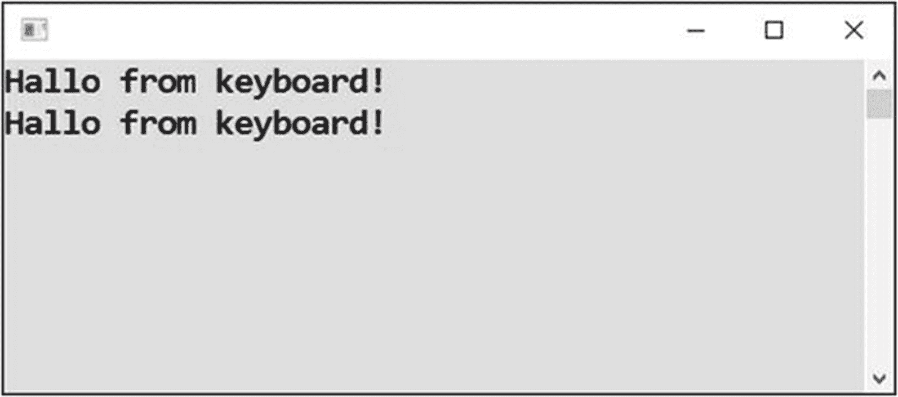
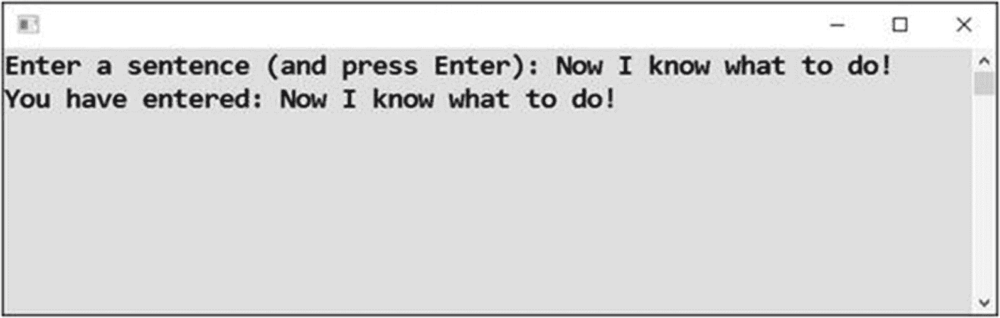
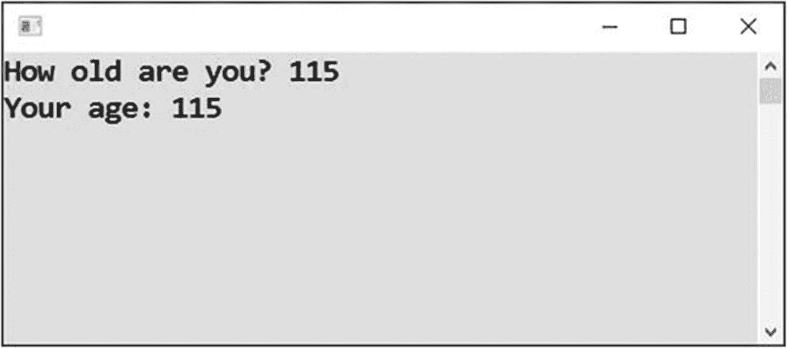
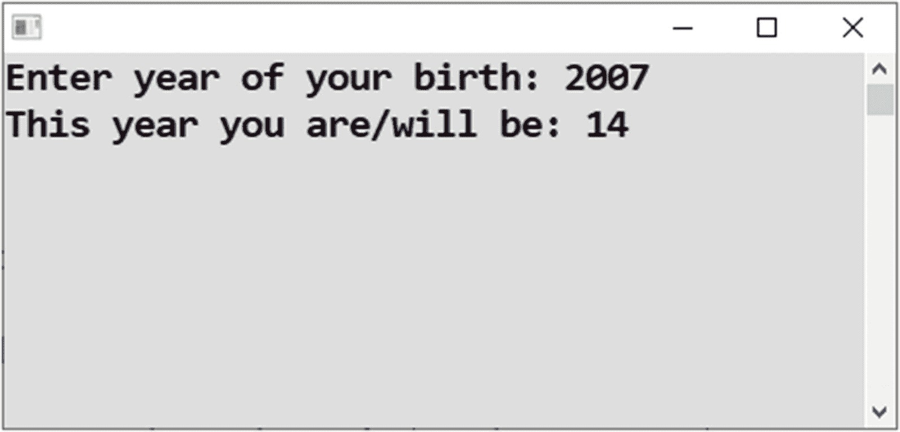
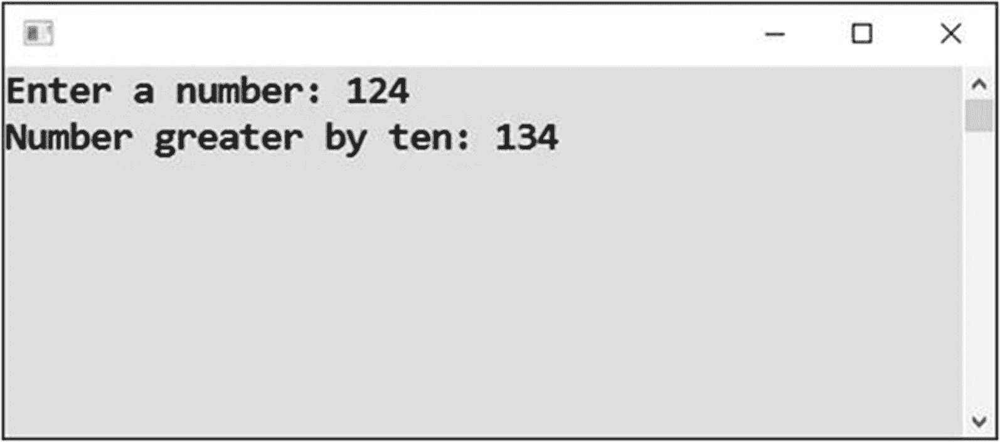
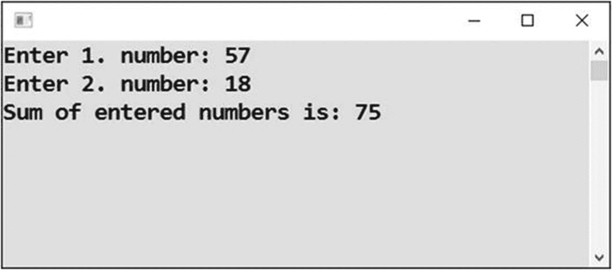
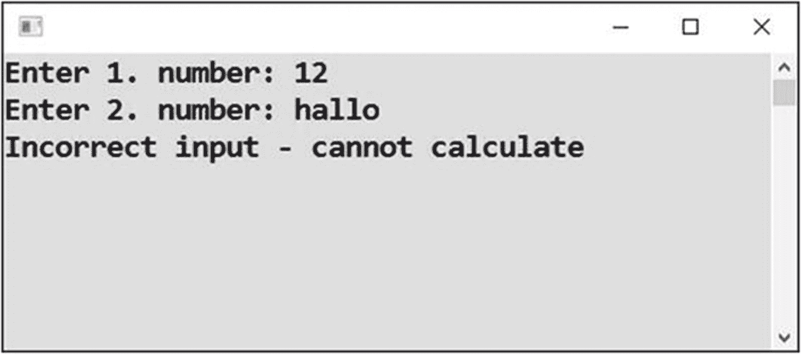
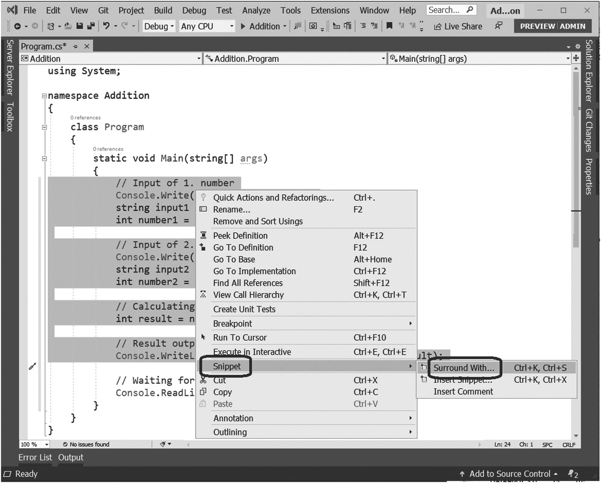
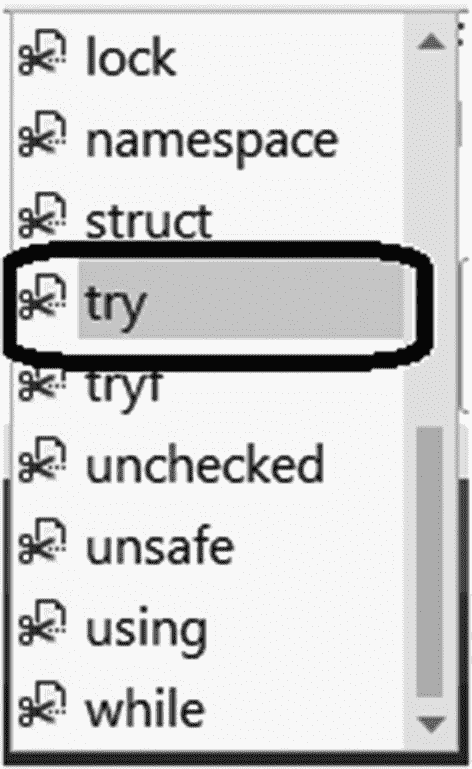

# 八、输入

到目前为止，您的所有程序都在操作数据(数字、文本等)，这些数据要么直接固定在源代码中，要么来自操作系统(日期、随机数等)。通常，程序从用户那里获取数据，这是你将在本章学到的。

## 文本输入

你将从最简单的例子开始学习输入。

### 工作

您将编写一个程序，接受用户的单行文本，并立即将输入的文本重复输出(见图 [8-1](#Fig1) )。



图 8-1

完整的程序

### 解决办法

代码如下:

```cs
static void Main(string[] args)
{
    // Reading single line of text (until user presses Enter key)
    string input = Console.ReadLine();

    // Outputting the input
    Console.WriteLine(input);

    // Waiting for Enter
    Console.ReadLine();
}

```

当您使用 F5 键启动程序时，您会看到一个空屏幕。输入一个句子，并使用回车键将其发送到程序。

## 优质投入

在前面的程序中，用户可能不知道该做什么。你还没有告诉用户该做什么。在本练习中，您将改进输入过程。

### 工作

你将修改前面的程序，给用户一个提示，告诉他们应该做什么(见图 [8-2](#Fig2) )。



图 8-2

改进的程序

### 解决办法

代码如下:

```cs
static void Main(string[] args)
{
    // Hinting user what we want from her
    Console.Write("Enter a sentence (and press Enter): ");

    // Reading line of text
    string input = Console.ReadLine();

    // Repeating to the output
    Console.WriteLine("You have entered: " + input);

    // Waiting for Enter
    Console.ReadLine();
}

```

### 讨论

`Console.Write`不会将光标移动到下一行，这与`Console.WriteLine`相反，到目前为止您一直在使用`Console.WriteLine`。

## 数字输入

在前面的练习中，您参与了来自用户的文本信息的输入。现在你将转到数字上，它们同样重要。

### 工作

您将编写一个程序，从用户那里获取一个数字，将其存储在一个数值变量中，最后向用户重复该数字(见图 [8-3](#Fig3) )。



图 8-3

从屏幕上读取一个数字

### 解决办法

总是读取文本，即使它的含义是一个数字。如果你想保存一个实数(例如，`int`类型的值)，你必须使用`Convert.ToInt32`调用来制造它。

```cs
static void Main(string[] args)
{
    // Prompting the user
    Console.Write("How old are you? ");

    // Reading line of text
    string input = Console.ReadLine();

    // CONVERTING TO NUMBER (of entered text)
    int enteredNumber = Convert.ToInt32(input);

    // Output of entered number
    Console.WriteLine("Your age: " + enteredNumber);

    // Waiting for Enter
    Console.ReadLine();
}

```

### 讨论

严格地说，你实际上还不需要一个实数，因为你没有对这些数进行任何计算。但是，这将在下一个练习中改变。在这里，您探索了最简单形式的数字输入。

## 用输入的数字计算

现在，您将使用用户输入的值进行第一次计算。

### 工作

您将编写一个程序，接受用户的出生年份，然后计算他们的年龄(见图 [8-4](#Fig4) )。



图 8-4

计算年龄

### 解决办法

以下是解决方案:

```cs
static void Main(string[] args)
{
    // Prompting the user
    Console.Write("Enter year of your birth: ");

    // Reading line of text
    string input = Console.ReadLine();

    // CONVERING TO NUMBER (of entered text)
    int yearOfBirth = Convert.ToInt32(input);

    // Finding this year
    DateTime today = DateTime.Today;
    int thisYear = today.Year;

    // Calculating age
    int age = thisYear - yearOfBirth;

    // Outputting the result
    Console.WriteLine("This year you are/will be: " + age);

    // Waiting for Enter
    Console.ReadLine();
}

```

## 还有十个

让我们继续计算。

### 工作

您将编写一个程序，从用户那里接受一个数字。之后，它显示一个比输入的数字大十的数字(见图 [8-5](#Fig5) )。



图 8-5

给一个数加 10

### 解决办法

代码如下:

```cs
static void Main(string[] args)
{
    // Number input
    Console.Write("Enter a number: ");
    string input = Console.ReadLine();
    int number = Convert.ToInt32(input);

    // Calculating
    int result = number + 10;

    // Displaying the result
    Console.WriteLine("Number greater by ten: " + result);

    // Waiting for Enter
    Console.ReadLine();
}

```

## 添加

现在，您将进一步执行这一步骤，并使用来自用户的两个数字进行计算。

### 工作

您将编写一个程序，将用户输入的两个数字相加(见图 [8-6](#Fig6) )。



图 8-6

将两个数相加

### 解决办法

代码如下:

```cs
static void Main(string[] args)
{
    // Input of 1\. number
    Console.Write("Enter 1\. number: ");
    string input1 = Console.ReadLine();
    int number1 = Convert.ToInt32(input1);

    // Input of 2\. number
    Console.Write("Enter 2\. number: ");
    string input2 = Console.ReadLine();
    int number2 = Convert.ToInt32(input2);

    // Calculating
    int result = number1 + number2;

    // Result output
    Console.WriteLine("Sum of entered numbers is: " + result);

    // Waiting for Enter
    Console.ReadLine();
}

```

## 输入不正确

在以前有数字的程序中，如果用户输入了数字以外的东西，程序会以一个*运行时错误*终止。然而，生产程序不应该这样。现在，您将学习如何处理运行时错误。

### 工作

在本练习中，您将修改之前的程序，使其正确处理来自用户的非数字输入(参见图 [8-7](#Fig7) )。



图 8-7

为错误提供反馈

### 解决办法

让您的上一个项目保持打开状态，或者如果您已经关闭了它，请再次打开它。在接下来的内容中，您将编辑项目的`Program.cs`源代码；具体来说，您将在适当的位置插入一个`try-catch`构造。

用鼠标选中`Main`的整个内部，不包括最后一条语句(等待回车)，如图 [8-8](#Fig8) 所示。然后，右键单击所选块中的任意位置，并从上下文菜单中选择“代码段”,然后选择“包围”。



图 8-8

选择环绕方式

在弹出的小窗格中，选择 Try(见图 [8-9](#Fig9) )。



图 8-9

选择尝试

### 发生了什么

发生了什么事？Visual Studio 将选中的行包装到`try`块中，该块由单词`try`和一对花括号组成。它还在`try`块之后插入了一个`catch`块，其中包括单词`catch`和一对花括号。

### 捕捉部分的内部

删除`catch`块中的语句`throw`，并输入以下语句:

```cs
Console.WriteLine("Incorrect input - cannot calculate");

```

### 完全解

以下是完整的解决方案:

```cs
static void Main(string[] args)
{
    try
    {
        // Input of 1\. number
        Console.Write("Enter 1\. number: ");
        string input1 = Console.ReadLine();
        int number1 = Convert.ToInt32(input1);

        // Input of 2\. number
        Console.Write("Enter 2\. number: ");
        string input2 = Console.ReadLine();
        int number2 = Convert.ToInt32(input2);

        // Calculating
        int result = number1 + number2;

        // Result output
        Console.WriteLine("Sum of entered numbers is: " + result);
    }
    catch (Exception)
    {
        Console.WriteLine("Incorrect input - cannot calculate");
    }

    // Waiting for Enter
    Console.ReadLine();
}

```

### 测试

现在你可以测试你的程序的数字输入和无意义输入。

### 说明

`try`块中的语句以一种“试验模式”执行:

*   当它们全部成功时，`try`块中的执行正常进行，之后跳过`catch`块。

*   当一条语句失败时，跳过剩余的`try`块，而执行`catch`块中的语句。

## 摘要

在这一章中，你进入了一个新的编程技能水平。到目前为止，您只考虑了程序的输出。这里，您开始处理来自用户的输入，首先是文本输入，然后是数字输入。

具体来说，您学到了以下内容:

*   使用`Console.ReadLine`方法调用从用户那里获得文本输入。

*   在请求输入前向用户显示提示。为此，您使用了`Console.Write`方法，它与它的姐妹`Console.WriteLine`不同，它不终止一行。

*   使用`Convert.ToInt32`方法将数字的文本输入转换成实际的数字表示，然后用它进行各种计算。

在最后一个练习中，您考虑了运行时错误的重要情况，比如非数字输入。您学会了使用`try-catch`构造来处理它们。该结构由两部分组成:

*   `try`块包围着“试验中”执行的语句如果一切顺利，`try`块不会改变任何东西，在它完成之后，程序的执行会在整个`try-catch`构造之后立即继续。

*   在`try`程序块处理过程中出现错误时，`catch`程序块包围专门执行的语句。在有`catch`块的情况下，`try`块中失败的语句不会导致运行时错误和程序终止。相反，错误被“捕获”，并启动指定的替代操作。