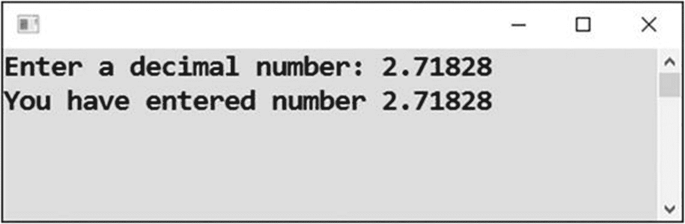
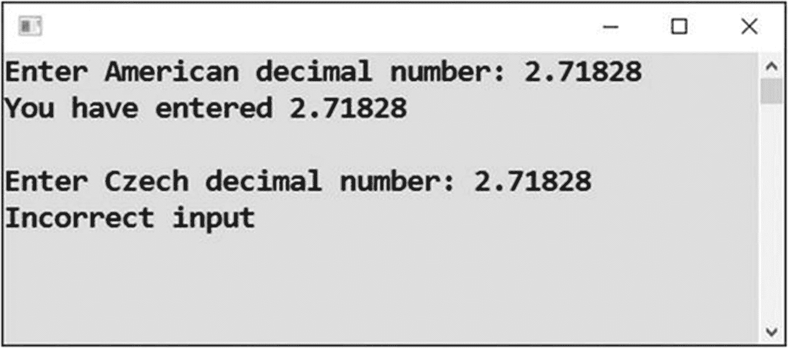
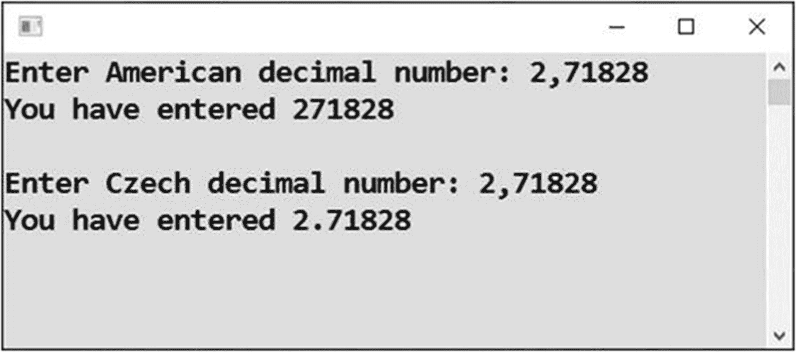
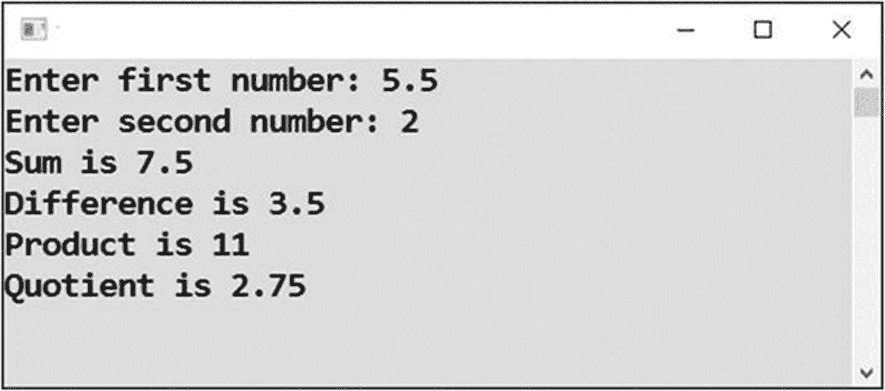
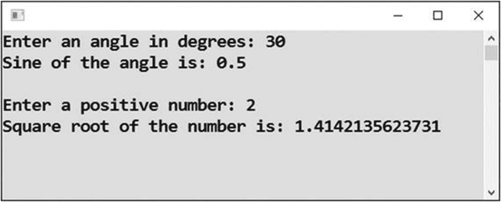
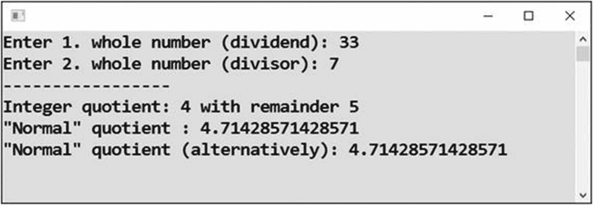

# 九、数字

在前一章中，您学习了一般的输入，特别是数字输入。您还对用户输入的数字进行了一些简单的计算。在这一章中，你将更详细地了解数字。毕竟电脑之所以叫电脑，是因为计算频繁！

## 十进制输入

您将从从用户处读取一个十进制数的任务开始。

### 工作

您将编写一个程序，从用户那里接受一个十进制数，并立即在屏幕上重复它(见图 [9-1](#Fig1) )。



图 9-1

最终方案

### 解决办法

整数和小数的输入有两个区别:

*   您可以通过调用`Convert.ToDouble`方法将文本输入转换成相应的数字。

*   要存储转换后的数字，可以使用类型为`double`的变量。

代码如下:

```cs
static void Main(string[] args)
{
    // Decimal input
    Console.Write("Enter a decimal number: ");
    string input = Console.ReadLine();
    double decimalNumber = Convert.ToDouble(input);

    // Repeating entered number to the output
    Console.WriteLine("You have entered number " + decimalNumber);

    // Waiting for Enter
    Console.ReadLine();
}

```

## 本地化数字输入

在上一个练习中，用户根据 Windows 语言设置输入小数点分隔符。这意味着英语中的小数点。然而，它在其他语言中可能有其他的意思。例如，在捷克语中，逗号用作小数点分隔符。

在当前的练习中，我将向您展示如何在特定的本地化环境中强制输入数字，而不管 Windows 设置如何。您在本书的前面做了一个关于本地化输出的类似任务；现在你要专注于输入。

### 工作

任务是写一个程序，读取一个十进制数，有两种固定的语言设置，美国和捷克。

### 解决办法

要处理特定的本地化，请使用`CultureInfo`对象。另外，请不要忘记在源代码的顶部插入`using System.Globalization;`行。

代码如下:

```cs
static void Main(string[] args)
{
    // AMERICAN
    CultureInfo american = new CultureInfo("en-US");
    try
    {
        // Input
        Console.Write("Enter American decimal number: ");
        string input = Console.ReadLine();
        double number = Convert.ToDouble(input, american);

        // Output
        Console.WriteLine("You have entered " + number);
    }
    catch (Exception)
    {
        // Error message
        Console.WriteLine("Incorrect input");
    }

    // CZECH
    CultureInfo czech = new CultureInfo("cs-CZ");
    try
    {
        // Input
        Console.WriteLine();
        Console.Write("Enter Czech decimal number: ");
        string input = Console.ReadLine();
        double number = Convert.ToDouble(input, czech);

        // Output
        Console.WriteLine("You have entered " + number);
    }
    catch (Exception)
    {
        // Error message
        Console.WriteLine("Incorrect input");
    }

    // Waiting for Enter
    Console.ReadLine();
}

```

### 测试和结论

以下部分介绍了这是如何工作的。

#### 用小数点测试

运行您的程序，输入一个带小数点的数字两次(见图 [9-2](#Fig2) )。



图 9-2

输入两个带小数点的数字

当使用美国本地化时，程序接受点作为小数点分隔符。同时，当使用捷克语本地化时，它拒绝小数点，因为点在捷克语中不是有效的小数点分隔符。

#### 用十进制逗号测试

再次运行你的程序，这次输入一个带小数点的数字两次(见图 [9-3](#Fig3) )。



图 9-3

用逗号输入一个数字两次

现在程序接受十进制逗号作为捷克语中的有效分隔符。

当使用美国本地化时，程序看不到任何十进制数。它只是忽略逗号，将用户输入转换成一个整数！

#### 进一步的结论

在本书中，我用数字中的小数点显示输出。这是因为我没有在输出语句中指定任何本地化，并且我的 Windows 设置当前被设置为美国英语。两个测试都表明，如果你不够小心，十进制输入可能会出卖你。只是提醒你，如果你直接在你的 C# 源代码中输入一个十进制数，无论你的设置如何，你都应该使用小数点。

## 基本算术

在这一章中，您将与数字打交道，因此这是执行所有四种基本算术运算的好时机。

### 工作

您将编写一个程序，从用户那里接受两个十进制数，并显示它们的加、减、乘、除的结果(见图 [9-4](#Fig4) )。



图 9-4

做基本算术

### 解决办法

代码如下:

```cs
static void Main(string[] args)
{
    // Inputs
    Console.Write("Enter first number: ");
    string input1 = Console.ReadLine();
    double number1 = Convert.ToDouble(input1);

    Console.Write("Enter second number: ");
    string input2 = Console.ReadLine();
    double number2 = Convert.ToDouble(input2);

    // Calculations
    double sum = number1 + number2;
    double difference = number1 - number2;
    double product = number1 * number2;
    double quotient = number1 / number2;

    // Output
    Console.WriteLine("Sum is " + sum);
    Console.WriteLine("Difference is " + difference);
    Console.WriteLine("Product is " + product);
    Console.WriteLine("Quotient is " + quotient);

    // Waiting for Enter
    Console.ReadLine();
}

```

## 数学函数

当您进行工程或财务计算时，您通常需要比上一个练习中显示的四个基本操作更复杂的操作。现在您将看到如何使用内置的(预定义的)数学函数来执行复杂的运算。

### 工作

为了让您体验一下可用的数学函数，您将在该任务中计算输入数字的正弦和平方根(参见图 [9-5](#Fig5) )。



图 9-5

计算正弦和平方根

### 解决办法

代码如下:

```cs
static void Main(string[] args)
{
    // Input of angle
    Console.Write("Enter an angle in degrees: ");
    string input = Console.ReadLine();
    double angleInDegrees = Convert.ToDouble(input);

    // Calculation and output of sine value
    double angleInRadians = angleInDegrees * Math.PI / 180;
    double result = Math.Sin(angleInRadians);
    Console.WriteLine("Sine of the angle is: " + result);

    // Input of a positive number
    Console.WriteLine();
    Console.Write("Enter a positive number: ");
    input = Console.ReadLine();
    double number = Convert.ToDouble(input);

    // Calculation and output of square root
    Console.WriteLine("Square root of the number is: " + Math.Sqrt(number));

    // Waiting for Enter
    Console.ReadLine();
}

```

### 讨论

请注意以下几点:

*   要计算数学函数的值，可以使用`Math`对象；它包含许多有用的函数，不仅仅是上面显示的那些。

*   `Sin`功能要求以**弧度**指定角度。如果您的输入是以度为单位的，这是通常的情况，那么您需要进行转换。

*   有了第二个输入(一个数字)，你就“回收”了之前已经使用过的变量`input`；由于不再需要存储值，您第二次使用了它。但是，这意味着您不必再次声明该变量。

*   你不必“回收”变量；如今，变量不是宝贵的资源。但是如果你想的话你可以，这就是我展示给你的。

*   与第一个计算相反，您没有将计算出的平方根存储到任何变量中。你直接把计算写进了输出语句(`WriteLine`)。

*   如果用户输入一个负数，它的平方根无法计算，结果变成`NaN`(意思是“不是一个数”)。

## 整数除法

令人惊讶的是，在编程时，你经常需要使用整数除法，也就是带余数的除法。例如，33 除以 7 通常是 4.71428…或者是 4 加余数 5。

在各种计算平台上，你会做不同于“正常”除法的整数除法。不幸的是，在 C# 中，两种类型使用相同的运算符，斜杠(/)。它是这样工作的:

*   如果在两个`int`类型的值之间加一个斜杠，这个斜杠执行整数除法。

*   如果两个值中至少有一个是`double`类型，斜杠执行“正常”除法。

这种行为可能是难看的、难以发现的错误的来源。这个行为已经有 45 年的历史了，起源于 C 语言被创造出来的时候；不幸的是，一些较新的语言，如 C#，继承了这种行为。注意这一点，在使用斜线时要小心。

### 工作

在本练习中，您将探索用户输入的两个数字的“正常”除法和整数除法(参见图 [9-6](#Fig6) )。



图 9-6

探索“正常”和整数除法

### 解决办法

下面是代码:

```cs
static void Main(string[] args)
{
    // Inputs
    Console.Write("Enter 1\. whole number (dividend): ");
    string input1 = Console.ReadLine();
    int number1 = Convert.ToInt32(input1);

    Console.Write("Enter 2\. whole number (divisor): ");
    string input2 = Console.ReadLine();
    int number2 = Convert.ToInt32(input2);

    // Integer calculations
    int integerQuotient = number1 / number2;
    int remainder = number1 % number2;

    // "Normal" calculations
    double number1double = number1;
    double number2double = number2;
    double normalQuotient = number1double / number2double;

    // Alternatively
    double normalQuotientAlternatively = (double)number1 / (double)number2;

    // Outputs
    Console.WriteLine("-----------------");
    Console.WriteLine("Integer quotient: " + integerQuotient +
        " with remainder " + remainder);
    Console.WriteLine("\"Normal\" quotient : " + normalQuotient);
    Console.WriteLine("\"Normal\" quotient (alternatively): " + normalQuotientAlternatively);

    // Waiting for Enter
    Console.ReadLine();
}

```

### 讨论

请注意以下几点:

*   要计算余数，可以使用%运算符(百分号)。

*   我已经向您展示了两种将输入的值强制为`double` s 以实现“正常”除法的方法。
    *   类型为`double`的变量赋值。

    *   *型投*到`double`；您可以在括号中加上目标类型的值。

## 摘要

在这一章中，你更详细地研究了数字。你已经知道在计算中整数和小数的区别，你知道如何阅读整数；在这一章中，你学习了如何阅读小数。您还发现，阅读十进制数字对语言很敏感，如果不小心，可能会导致令人惊讶的结果。如果不指定要使用的语言，将使用 Windows 语言设置读取数字。具体来说，您学习了以下内容:

*   使用`Convert.ToDouble`方法将文本用户输入转换成实际的十进制数

*   将转换后的值存储在`double`类型的变量中

*   使用作为第二个参数传递给转换方法的`CultureInfo`对象实施语言设置

此外，您还学习了如何使用运算符+、-、*和/进行基本运算，以及如何使用(static) `Math`对象的内置数学函数进行更复杂的运算。

最后，您探索了整数除法及其与“普通”除法的比较，并了解了斜线运算符的一些复杂行为，它执行以下操作:

*   与两个整数一起使用时的整数除法

*   至少有一个数字是小数时的“正常”除法

您了解了如何对整数进行“正常”除法运算:

*   要么在计算前将它们赋给`double`类型的变量

*   在计算中对它们进行类型转换