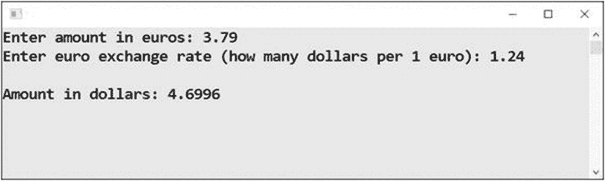
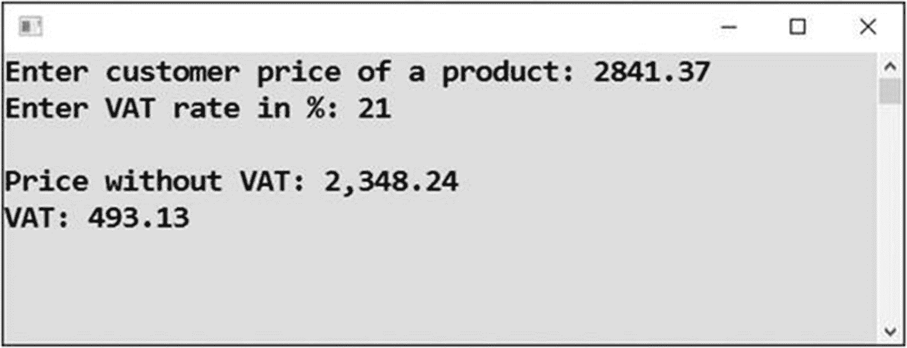

# 十、经济计算

在这一章中，你将学习如何数钱。这很简单，但是你需要运用一些常识。

## 货币兑换

执行简单的经济计算通常意味着进行货币转换，这将在本节中尝试。

### 工作

接受欧元金额和欧元汇率后，您将把金额转换成美元(见图 [10-1](#Fig1) )。



图 10-1

转换成美元

### 解决办法

代码如下:

```cs
static void Main(string[] args)
{
    // Inputs
    Console.Write("Enter amount in euros: ");
    string inputEuros = Console.ReadLine();
    double amountEuros = Convert.ToDouble(inputEuros);

    Console.Write("Enter euro exchange rate (how many dollars per 1 euro): ");
    string inputExchangeRate = Console.ReadLine();
    double euroEchangeRate = Convert.ToDouble(inputExchangeRate);

    // Calculation
    double amountDollars = amountEuros * euroEchangeRate;

    // Output
    Console.WriteLine();
    Console.WriteLine("Amount in dollars: " + amountDollars);

    // Waiting for Enter
    Console.ReadLine();
}

```

## 总价

在本练习中，您将计算订单的总价。

### 工作

假设你的一个顾客买了几样东西，其中一些可能买了很多次。你需要计算包括运费在内的总价。在这个程序中，为了简单起见，两个产品的价格和数量以及运输价格将直接固定在源代码中(见图 [10-2](#Fig2) )。


图 10-2

计算总成本

### 解决办法

下面是代码:

```cs
static void Main(string[] args)
{
    // Fixed values
    const double bookPrice = 29.8;
    const double dvdPrice = 9.9;
    const double shipmentPrice = 25;

    // Inputs
    Console.WriteLine("Order");
    Console.WriteLine("-----");

    Console.Write("Product \"C# Programming for Absolute Beginners (book)\" - enter number of pieces: ");
    string inputBookPieces = Console.ReadLine();
    int bookPieces = Convert.ToInt32(inputBookPieces);

    Console.Write("Product \"All Quiet on Western Front (DVD)\" - enter number of pieces: ");
    string inputDvdPieces = Console.ReadLine();
    int dvdPieces = Convert.ToInt32(inputDvdPieces);

    // Calculations
    double totalForBook = bookPrice * bookPieces;
    double totalForDvd = dvdPrice * dvdPieces;
    double totalForOrder = totalForBook + totalForDvd + shipmentPrice;

    // Outputs
    Console.WriteLine();
    Console.WriteLine("Order calculation");
    Console.WriteLine("-----------------");
    Console.WriteLine("Book: " + totalForBook);
    Console.WriteLine("Dvd: " + totalForDvd);
    Console.WriteLine("Shipment: " + shipmentPrice);
    Console.WriteLine("TOTAL: " + totalForOrder);

    // Waiting for Enter
    Console.ReadLine();
}

```

### 讨论

在固定“变量”前加上`const`表示它们是*常量*，是在程序运行过程中不会改变的值。Visual Studio 不允许您为这些“变量”赋新值

就我个人而言，我不经常使用`const`。我只是想给你看一下，以防你在工作过程中看到它。

## 佣金

在资本主义中，最重要的不是创造、生产或种植什么东西。最重要的是卖！销售人员通常会得到佣金，所以你必须学会如何计算。

### 工作

您将编写一个程序，接受产品的价格，然后计算商家、分销商和生产商的佣金百分比。从数据中还计算出三方的收益分成(见图 [10-3](#Fig3) )。


图 10-3

计算佣金

### 解决办法

代码如下:

```cs
static void Main(string[] args)
{
    // Inputs
    Console.Write("Enter customer price of product: ");
    string inputPrice = Console.ReadLine();
    double customerPrice = Convert.ToDouble(inputPrice);

    Console.Write("Enter merchant commission (percents): ");
    string inputMerchantPercents = Console.ReadLine();
    int merchantPercents = Convert.ToInt32(inputMerchantPercents);

    Console.Write("Enter distributor commission (percents): ");
    string inputDistributorPercents = Console.ReadLine();
    int distributorPercents = Convert.ToInt32(inputDistributorPercents);

    // Calculations
    double coefficient1 = 1 - merchantPercents / 100.0;
    double coefficient2 = 1 - distributorPercents / 100.0;
    double wholesalePrice = customerPrice * coefficient1;
    double priceAfterCommissionSubtraction = wholesalePrice * coefficient2;
    double merchantIncome = customerPrice - wholesalePrice;
    double distributorIncome = wholesalePrice - priceAfterCommissionSubtraction;
    double producerIncome = priceAfterCommissionSubtraction;

    // Outputs
    Console.WriteLine();
    Console.WriteLine("Income division");
    Console.WriteLine("----------------");
    Console.WriteLine("Merchant: " + merchantIncome);
    Console.WriteLine("Distributor: " + distributorIncome);
    Console.WriteLine("Producer: " + producerIncome);

    // Waiting for Enter
    Console.ReadLine();
}

```

### 讨论

有时，佣金百分比可能是小数。我在这个例子中选择了整数，因为我想用一个实际的例子向你展示如何正确地划分整数。如您所知，要执行“普通”除法，您至少需要一个数字(在斜杠前面或后面)作为`double`。这就是你使用`100.0`的原因。

如果你用`100`来代替，结果会令人惊讶(见图 [10-4](#Fig4) )。


图 10-4

佣金百分比，不正确

你知道为什么会这样吗？都是因为四舍五入。

## 舍入

金额通常四舍五入到美分。我将向您展示如何做到这一点，以及仅仅为了输出而舍入和为了进一步计算而舍入之间的区别。差别很小，但有时很重要。你可能会漏掉一分钱，给别人带来麻烦。

### 工作

在用户输入两个货币金额(可能以超过两位小数的方式计算)后，程序将以百分比精度显示它们，将它们四舍五入到美分，最后将原始值与四舍五入值进行比较(图 [10-5](#Fig5) )。


图 10-5

舍入程序

### 解决办法

代码如下:

```cs
static void Main(string[] args)
{
    // For simplicity, inputs are fixed in program
    // Some amounts, e.g. after commission calculations, cent fractions are possible
    double amount1 = 1234.567;
    double amount2 = 9.876;

    // Displaying inputs (original values)
    Console.WriteLine("First amount (original value): " + amount1);
    Console.WriteLine("Second amount (original value): " + amount2);
    Console.WriteLine();

    // Rounding just for output
    Console.WriteLine("First amount displayed with cent precision: " + amount1.ToString("N2"));
    Console.WriteLine("Second amount displayed with cent precision: " + amount2.ToString("N2"));
    Console.WriteLine();

    // Rounding for further calculations + informative output
    double roundedAmount1 = Math.Round(amount1, 2); // 2 = two decimal places
    double roundedAmount2 = Math.Round(amount2, 2);

    Console.WriteLine("First amount rounded to cents: " + roundedAmount1);
    Console.WriteLine("Second amount rounded to cents: " + roundedAmount2);
    Console.WriteLine();

    // Calculations
    double sumOfOriginalAmounts = amount1 + amount2;
    double sumOfRoundedAmounts = roundedAmount1 + roundedAmount2;

    // Calculation outputs
    Console.WriteLine("Sum of original amounts: " + sumOfOriginalAmounts.ToString("N2"));
    Console.WriteLine("Sum of rounded amounts: " + sumOfRoundedAmounts.ToString("N2"));
    Console.WriteLine("On invoice, we need sum of rounded amounts");

    // Waiting for Enter
    Console.ReadLine();
}

```

## 进一步舍入

有时，舍入会更复杂。

### 工作

在这项任务中，我将向您展示如何四舍五入到美元，四舍五入到数百美元，始终向下舍入，始终向上舍入(见图 [10-6](#Fig6) 和 [10-7](#Fig7) )。


图 10-7

另一个数字四舍五入到美元，美分，数百美元


图 10-6

更复杂的舍入

### 解决办法

代码如下:

```cs
static void Main(string[] args)
{
    // Input
    Console.Write("Enter (decimal) amount in dollars: ");
    string input = Console.ReadLine();
    double amount = Convert.ToDouble(input);

    // To dollars
    double nearest    = Math.Round(amount);
    double alwaysDown = Math.Floor(amount);
    double alwaysUp   = Math.Ceiling(amount);

    Console.WriteLine();
    Console.WriteLine("To dollars");
    Console.WriteLine("----------");
    Console.WriteLine("Nearest    : " + nearest);
    Console.WriteLine("Always down: " + alwaysDown);
    Console.WriteLine("Always up  : " + alwaysUp);

    // To cents
    nearest    = Math.Round(amount, 2);
    alwaysDown = Math.Floor(100 * amount) / 100;
    alwaysUp   = Math.Ceiling(100 * amount) / 100;

    Console.WriteLine();
    Console.WriteLine("To cents");
    Console.WriteLine("--------");
    Console.WriteLine("Nearest    : " + nearest);
    Console.WriteLine("Always down: " + alwaysDown);
    Console.WriteLine("Always up  : " + alwaysUp);

    // To hundreds of dollars
    nearest    = 100 * Math.Round(amount / 100);
    alwaysDown = 100 * Math.Floor(amount / 100);
    alwaysUp   = 100 * Math.Ceiling(amount / 100);

    Console.WriteLine();
    Console.WriteLine("To hundreds of dollars");
    Console.WriteLine("----------------------");
    Console.WriteLine("Nearest    : " + nearest);
    Console.WriteLine("Always down: " + alwaysDown);
    Console.WriteLine("Always up  : " + alwaysUp);

    // Waiting for Enter
    Console.ReadLine();
}

```

#### 讨论

当然，如果您愿意，也可以使用`value.ToString("N2")`显示带分的舍入值。

## 增值税

在欧洲，我们有一个很好的东西叫增值税。每个人都乐于为商品支付更多的钱，如果这能让政客们有更多的预算……实际上，是为了什么？

### 工作

在该任务中，您将创建一个简单的增值税计算器(参见图 [10-8](#Fig8) )。该程序从客户购买产品的价格开始，计算不含增值税(商家从购买中获得)的价格以及增值税本身(商家转移给税务管理员的金额)。



图 10-8

计算增值税

### 分析

如果你想编写一个程序，你必须首先理解这个程序的本质。那么，欧洲增值税是如何运作的呢？

计算的基础是不含增值税的价格。为了得到这个价格，加上适当的百分比部分(例如，21%)，你得到客户支付的价格。重要的是，百分比是根据不含增值税的价格计算的，而不是根据客户价格计算的(见图 [10-9](#Fig9) )！


图 10-9

了解增值税的工作原理

例如，如果增值税率为 21%，您需要将客户价格除以 1.21，以获得不含增值税的价格。对于税率的一般值，您可以通过将适当的分数加到 1 来计算除数。

### 解决办法

代码如下:

```cs
static void Main(string[] args)
{
    // Inputs
    Console.Write("Enter customer price of a product: ");
    string inputPrice = Console.ReadLine();
    double customerPrice = Convert.ToDouble(inputPrice);

    Console.Write("Enter VAT rate in %: ");
    string inputVatRate = Console.ReadLine();
    double vatRate = Convert.ToDouble(inputVatRate);

    // Calculations
    double divisor = 1 + vatRate / 100.0;
    double calculatedPriceWithoutVat = customerPrice / divisor;
    double priceWithoutVat = Math.Round(calculatedPriceWithoutVat, 2);
    double vat = customerPrice - priceWithoutVat;

    // Outputs
    Console.WriteLine();
    Console.WriteLine("Price without VAT: " + priceWithoutVat.ToString("N2"));
    Console.WriteLine("VAT: " + vat.ToString("N2"));

    // Waiting for Enter
    Console.ReadLine();
}

```

## 摘要

在这一章中，你练习了经济世界中各种真实例子的计算。在这样的计算中，最重要的是首先理解现实世界的问题。为了理解在没有程序的情况下如何得到结果，从一支铅笔、一张纸和一个计算器开始。适当地组织你的程序，将整个计算分成小块，并为你的变量使用描述性的名字，通常也是有帮助的。

除此之外，你还学习了如何舍入。具体来说，您学习了几个内置的数学函数:

*   您知道如何使用`Math.Round`进行最常见的舍入，换句话说，舍入到最接近的整数。您可以在方法调用的第二个参数中指定所需的小数位数。

*   您知道如何使用`Math.Floor`始终向下舍入，换句话说，舍入到小于或等于被舍入数字的最大整数。

*   您知道如何使用`Math.Ceiling`始终向上舍入，换句话说，舍入到大于或等于被舍入数字的最小整数。

您还学习了如何舍入到百位数的技巧，包括在舍入前除以 100，然后乘以相同的数。