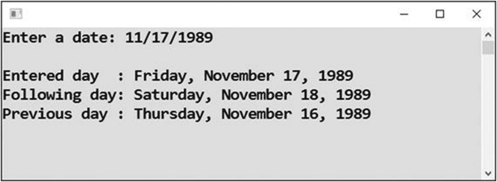
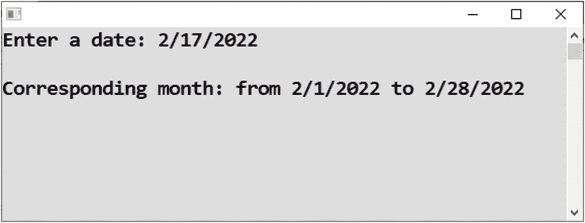
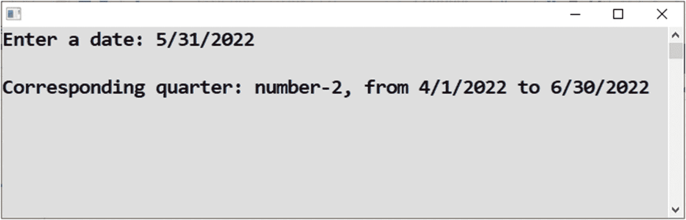
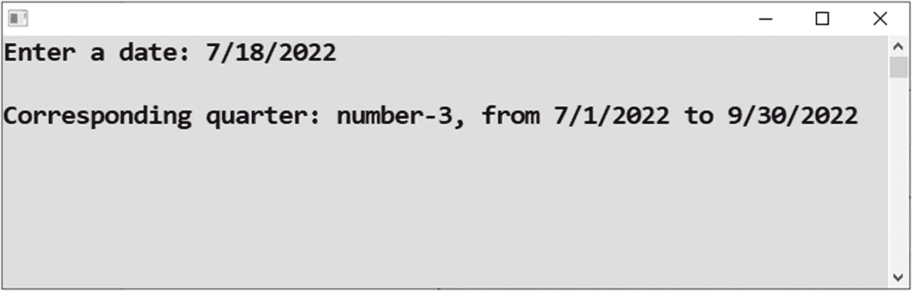
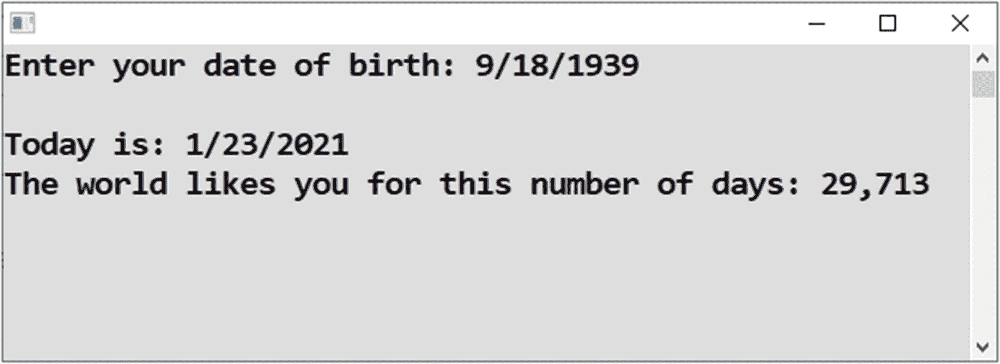
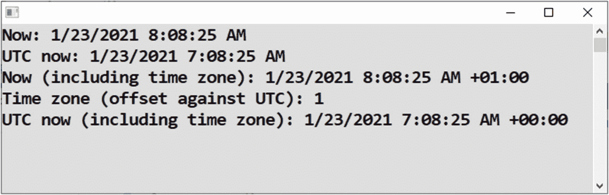

# 十一、使用日期的计算

在上一章中，您练习了经济领域的计算。你也经常需要计算日期。假设您需要设置发票的到期日期。或者假设您想要计算发票过期多少天。或者，您可能需要知道某个特定时期(如一个月或一个季度)的第一天和最后一天。在这一章中，你将学习如何计算日期。

## 日期输入

首先，您将学习如何从用户那里读取日期。我也将向您展示一些简单的日期算法。

### 工作

在这个任务中，您将获得一个基于用户输入的`DateTime`对象。之后，您将计算下一天和前一天(见图 [11-1](#Fig1) )。



图 11-1

计算下一天和前一天

### 解决办法

重点是使用`Convert.ToDateTime`方法。如果用户输入一个不存在的日子(例如，非闰年的 2 月 29 日)，该方法会导致一个运行时错误，您可以使用`try-catch`构造来处理这个错误。

```cs
static void Main(string[] args)
{
    try
    {
        // Text input of date
        Console.Write("Enter date: ");
        string input = Console.ReadLine();

        // Conversion to DateTime object
        DateTime enteredDate = Convert.ToDateTime(input);

        // Some calculations
        DateTime followingDay = enteredDate.AddDays(1);
        DateTime previousDay  = enteredDate.AddDays(-1);

        // Outputs
        Console.WriteLine();
        Console.WriteLine("Entered day  : " + enteredDate.ToLongDateString());
        Console.WriteLine("Following day: " + followingDay.ToLongDateString());
        Console.WriteLine("Previous day : " + previousDay.ToLongDateString());
    }
    catch (Exception)
    {
        // Treating incorrect input
        Console.WriteLine("Incorrect input");
    }

    // Waiting for Enter
    Console.ReadLine();
}

```

### 讨论

也可以用两个参数而不是一个来调用`Convert.ToDateTime`方法。第二个参数是语言设置，也就是你已经知道的`CultureInfo`对象。这与其他转换方法类似。

## 单月

现在，您将练习使用`DateTime`组件，并使用构造函数调用创建该对象。

### 工作

用户输入日期。该程序显示输入日期所在月份的第一天和最后一天(见图 [11-2](#Fig2) )。



图 11-2

计算每月的第一天和最后一天

### 解决办法

代码如下:

```cs
static void Main(string[] args)
{
    // Date input
    Console.Write("Enter a date: ");
    string input = Console.ReadLine();
    DateTime enteredDate = Convert.ToDateTime(input);

    // Calculations
    int enteredYear = enteredDate.Year;
    int enteredMonth = enteredDate.Month;

    DateTime firstDayOfMonth = new DateTime(enteredYear, enteredMonth, 1);
    DateTime lastDayOfMonth = firstDayOfMonth.AddMonths(1).AddDays(-1);

    // Outputs
    Console.WriteLine();
    Console.WriteLine("Corresponding month: " +
        "from " + firstDayOfMonth.ToShortDateString() +
        " to " + lastDayOfMonth.ToShortDateString());

    // Waiting for Enter
    Console.ReadLine();
}

```

### 讨论

请注意以下几点:

*   根据前面的练习，您使用`Convert.ToDateTime`方法调用从用户那里获得一个`DateTime`对象。

*   您开始从输入的日期中选择月份和年份。为此，您可以使用`Month`和`Year`属性。

*   使用这些数字，您可以很容易地组合出一个月的第一天，因为它的天数始终是一。

*   一个月的最后一天并不容易，因为月份的长度不同。诀窍就是加一个月，减一天！

*   注意，我没有在任何地方存储`AddMonth`的结果。我直接调用`AddDays`代替它。这被称为*方法链接*。

*   为了简单起见，我在这里不处理不正确输入的可能性。

## 四分之一

继续讨论日期，我将向您展示一些有趣的技巧，您有时必须使用这些技巧来获得正确的结果。

### 工作

对于输入的日期，该程序将显示该日期所属季度的开始、结束和编号(从一到四)(见图 [11-3](#Fig3) 和 [11-4](#Fig4) )。



图 11-4

显示相应的季度，另一个例子



图 11-3

显示相应的季度

### 分析

这项任务的关键是确定季度的数字。接下来是该季度的第一个月。

#### 季度编号

您需要将月份数转换为季度数，如下所示:

*   第 1、2 或 3 个月= 1

*   第 4、5 或 6 个月= 2

*   第 7、8 或 9 个月= 3

*   第 10、11 或 12 个月= 4

这是使用整数除法的一个很好的例子。您可以看到，首先需要在月份数字上加 2，然后执行整数除以 3:

```cs
int numberOfQuarter = (enteredMonth + 2) / 3;

```

#### 季度的第一个月数字

如果您已经有了该季度的编号，您将得到该季度的第一个月，如下所示:

*   第一季度为 1 月

*   第二季度为 4 月

*   第三季度 7 月

*   第四季度 10 月

你可能意识到季度的数字必须乘以三。为了得到正确的结果，你需要连续减去两个:

```cs
int monthOfQuarterStart = 3 * numberOfQuarter - 2;

```

#### 第一天和最后一天

有了第一个月的时间，你可以按照与上一个练习相似的步骤进行。要获得第一天，您可以使用将天数设置为 1 的`DateTime`构造函数。要得到最后一天，你要加上三个月，减去一天。

### 解决办法

代码如下:

```cs
static void Main(string[] args)
{
    // Date input
    Console.Write("Enter a date: ");
    string input = Console.ReadLine();
    DateTime enteredDate = Convert.ToDateTime(input);

    // Calculations
    int enteredYear = enteredDate.Year;
    int enteredMonth = enteredDate.Month;

    int numberOfQuarter = (enteredMonth + 2) / 3;
    int monthOfQuarterStart = 3 * numberOfQuarter - 2;
    DateTime firstDayOfQuarter = new DateTime(enteredYear, monthOfQuarterStart, 1);
    DateTime lastDayOfQuarter = firstDayOfQuarter.AddMonths(3).AddDays(-1);

    // Outputs
    Console.WriteLine();
    Console.WriteLine("Corresponding quarter: " +
        "number-" + numberOfQuarter +
        ", from " + firstDayOfQuarter.ToShortDateString() +
        " to " + lastDayOfQuarter.ToShortDateString());

    // Waiting for Enter
    Console.ReadLine();
}

```

## 日期差异

您经常需要计算两个特定日期之间的时间跨度，换句话说，在输入的日期之间经过了多少天或多少年。这就是你现在要学习的内容。

### 工作

用户输入他们的出生日期。该程序显示世界有多少天乐于拥有它们(见图 [11-5](#Fig5) )。



图 11-5

计算还能活多少天

### 解决办法

如您所见，您需要从今天的日期中减去出生日期。当您减去日期时，结果是一个`TimeSpan`对象。有了这个对象，您可以使用它的许多属性中的一个。在本练习中，您将使用`Days`属性。

代码如下:

```cs
static void Main(string[] args)
{
    // Input
    Console.Write("Enter your date of birth: ");
    string input = Console.ReadLine();
    DateTime dateOfBirth = Convert.ToDateTime(input);

    // Today
    DateTime today = DateTime.Today;

    // Date difference
    TimeSpan difference = today - dateOfBirth;
    int numberOfDays = difference.Days;

    // Output
    Console.WriteLine();
    Console.WriteLine("Today is: " + today.ToShortDateString());
    Console.WriteLine("The world likes you for this number of days: " + numberOfDays.ToString("N0"));

    // Waiting for Enter
    Console.ReadLine();
}

```

## 时区和 UTC

如果您想要存储某件事情发生的时刻(例如，记录订单、问题等)，您可能会对夏令时感到意外。或者，也许更重要的是，假设您正在创建一个将在全球范围内运行的程序。你必须适应不同的时区。

为了处理这些情况，了解如何使用协调世界时(UTC)是很好的，协调世界时是指不含食品添加剂的零子午线时间。对不起，我的意思是不受夏令时限制。UTC 是独立于时区的。

熟悉除了日期和时间之外还包含时区信息的`DateTimeOffset`对象也很有好处。

### 工作

在本练习中，我将向您展示如何使用 UTC 和包含在`DateTimeOffset`对象中的时区。您将创建一个处理当前时间的程序(参见图 [11-6](#Fig6) )。



图 11-6

日期时间关闭对象

### 解决办法

代码如下:

```cs
static void Main(string[] args)
{
    // Current time serves as input
    DateTime now = DateTime.Now;
    DateTime utcNow = DateTime.UtcNow;
    DateTimeOffset completeInstant = DateTimeOffset.Now;
    DateTimeOffset utcCompleteInstant = DateTimeOffset.UtcNow;

    // Outputs
    Console.WriteLine("Now: " + now);
    Console.WriteLine("UTC now: " + utcNow);
    Console.WriteLine("Now (including time zone): " + completeInstant);
    Console.WriteLine("Time zone (offset against UTC): " + completeInstant.Offset.TotalHours);
    Console.WriteLine("UTC now (including time zone): " + utcCompleteInstant);

    // Waiting for Enter
    Console.ReadLine();
}

```

请注意，一些变量属于`DateTime`类型，而其他变量属于`DateTimeOffset`类型。

## 摘要

在这一章里，你相当彻底地学会了如何用日期做计算。

首先使用`Convert.ToDateTime`方法从用户处获取日期，然后使用`DateTime`的构造函数调用(`new DateTime` …)从指定的年、月、日获取日期。

在您的计算中，您适当地使用了`DateTime`对象的各种属性，如`Day`、`Month`或`Year`，以及它的方法，如`AddDays`。此外，为了计算一个季度的数字，你使用了整数除法。

此外，您还熟悉了如何计算任意两个给定日期之间的差异，以及如何处理结果。具体来说，您使用了`TimeSpan`对象。

最后，我们讨论了 UTC 和时区，以便于程序跨多个时区运行，并正确处理夏令时带来的时间跳跃。具体来说，您了解了`DateTimeOffset`对象。