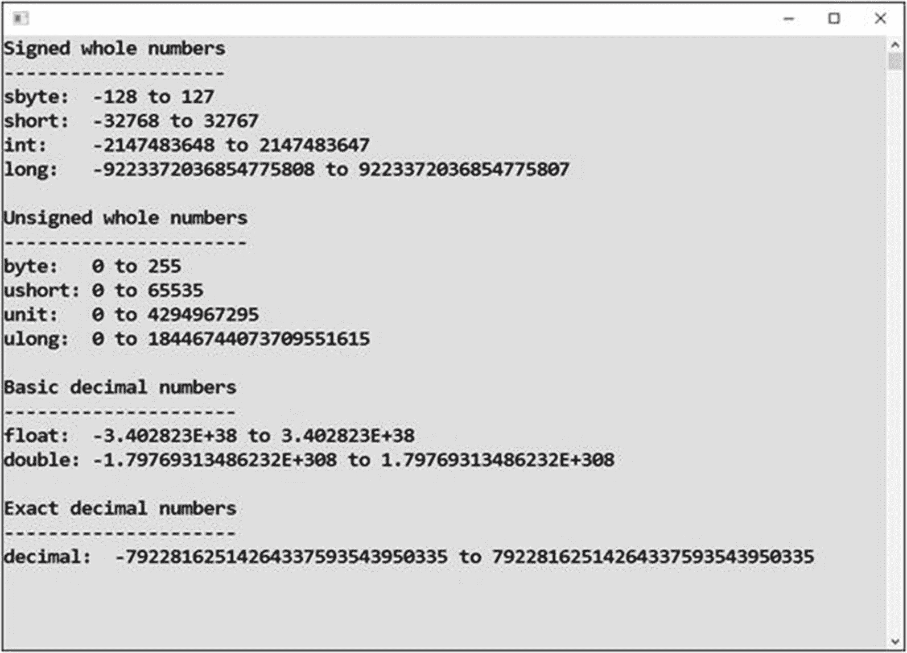
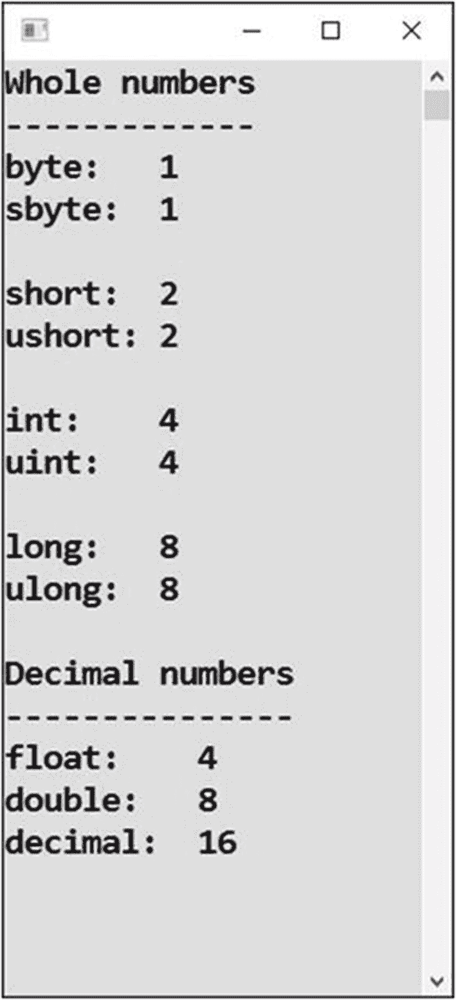
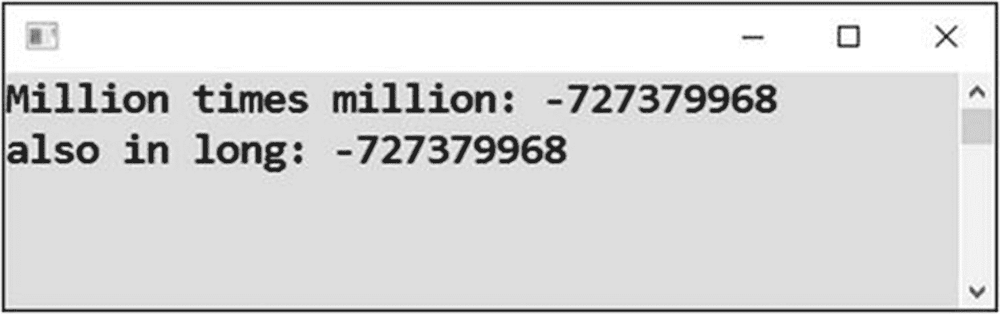
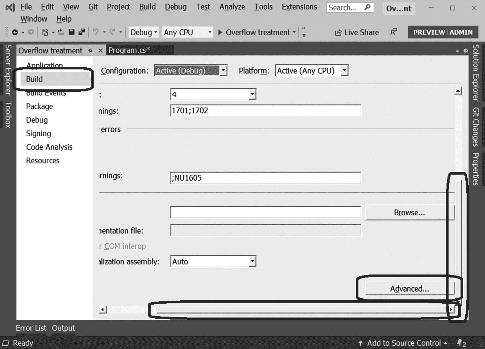
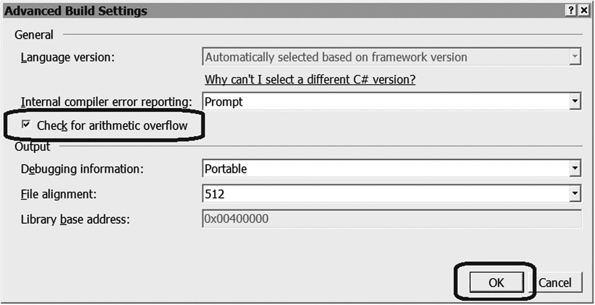
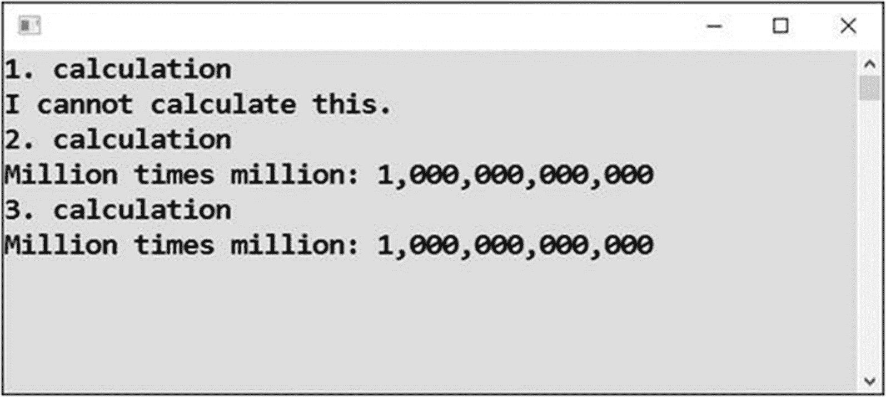

# 十二、理解不同种类的数字

在这一章中，你将学习一些关于数字和计算的更高级的主题，比如更多的数字类型、内存消耗和溢出。如果此时你不需要这么多的细节，你可以安全地跳过这一章或者只是浏览一下。

## 更多数字类型

你已经知道在计算中整数和小数是有区别的。使用`int`类型表示整数，使用`double`类型表示小数。

但是 C# 中还有其他数字数据类型。虽然它们中的许多主要是因为历史原因而存在，并且你可能永远不会使用它们，但至少了解它们是有好处的。

### 工作

您将编写一个程序，显示所有 C# 数值数据类型的概述。对于每种类型，其可能值的范围将被打印出来(见图 [12-1](#Fig1) )。



图 12-1

打印所有数字数据类型

### 解决办法

代码如下:

```cs
static void Main(string[] args)
{
    // Immediately outputs
    Console.WriteLine("Signed whole numbers");
    Console.WriteLine("--------------------");
    Console.WriteLine("sbyte:  " + sbyte.MinValue + " to " + sbyte.MaxValue);
    Console.WriteLine("short:  " + short.MinValue + " to " + short.MaxValue);

    Console.WriteLine("int:    " + int.MinValue + " to " + int.MaxValue);
    Console.WriteLine("long:   " + long.MinValue + " to " + long.MaxValue);
    Console.WriteLine();

    Console.WriteLine("Unsigned whole numbers");
    Console.WriteLine("----------------------");
    Console.WriteLine("byte:   " + byte.MinValue + " to " + byte.MaxValue);
    Console.WriteLine("ushort: " + ushort.MinValue + " to " + ushort.MaxValue);
    Console.WriteLine("unit: " + uint.MinValue + " to " + uint.MaxValue);
    Console.WriteLine("ulong: " + ulong.MinValue + " to " + ulong.MaxValue);
    Console.WriteLine();

    Console.WriteLine("Basic decimal numbers");
    Console.WriteLine("---------------------");
    Console.WriteLine("float:  " + float.MinValue + " to " + float.MaxValue);
    Console.WriteLine("double: " + double.MinValue + " to " + double.MaxValue);
    Console.WriteLine();

    Console.WriteLine("Exact decimal numbers");
    Console.WriteLine("---------------------");
    Console.WriteLine("decimal:  " + decimal.MinValue + " to " + decimal.MaxValue);

    // Waiting for Enter
    Console.ReadLine();
}

```

#### 注意

为了显示范围，我使用了所有数字数据类型的`MinValue`和`MaxValue`属性。

### 讨论

下面几节讨论这个程序。

#### 无符号数字

程序打印出来的结果显示，有些数据类型不允许存储负数！然而，除了从文件、数据库或 web 服务中读取二进制数据时使用的`byte`类型，这些*无符号数字*很少被使用。

与有符号的数字相反，无符号的数字通常以一个 *u* 开头，意思是“无符号的”类似地，有符号类型`sbyte`以 *s* 开始，意味着更重要的`byte`的“有符号”变体。

#### 十进制数字

十进制类型范围以科学记数法显示(也称为*指数记数法*)。比如最大的`float`数显示为 3.4E+38，表示 3.4 乘以 10 的 38 次方。这是一个很大的数字，不是吗？

十进制类型的精度也不同。`float`型存储大约 7 位有效数字的十进制值，而`double`型提供大约 15 位有效数字的精度，而`decimal`型提供 28 位有效数字。

#### 特殊类型十进制

`decimal`数据类型有些特殊。由于以下原因，最好在处理货币时使用它:

*   它精确地存储分数值。例如，12.80 的金额将被精确地存储为 12.80，而不是像 12.7999999999 这样的数字，使用其他类型可能会出现这种情况。

*   因为有大量的有效数字，`decimal`数据类型允许您表示大量的钱，并且仍然保持分的精度。

然而，这两个理由并不像看起来那样令人信服。如果您正确地执行了舍入，您可以用`double`类型准确地存储美分。而且坦率的说，除了`double` 15 位数够不够钱的问题，你通常还需要解决其他问题！

此外，许多事情用`double`类型更容易，这就是为什么我在本书中更喜欢用`double`表示小数。

最后一点:使用`decimal`类型的计算比使用`double`类型的计算*慢得多*(事实上，慢了几百倍)。如果您只处理几个数字，这并不重要，但是在大型数据集中，这种差异可能非常显著。

## 内存消耗

如果您对位和字节有所了解，您可能会想到，由于相应类型可用的内存空间不同，类型范围也会有所不同。这是完全正确的，您将在本节中了解更多信息。

### 工作

在本节中，您将编写一个程序，告诉您每种类型使用多少字节的内存(见图 [12-2](#Fig2) )。



图 12-2

显示每种类型使用的字节数

### 解决办法

代码如下:

```cs
static void Main(string[] args)
{
    // Outputs
    Console.WriteLine("Whole numbers");
    Console.WriteLine("-------------");
    Console.WriteLine("byte:   " + sizeof(byte));
    Console.WriteLine("sbyte:  " + sizeof(sbyte));
    Console.WriteLine();
    Console.WriteLine("short:  " + sizeof(short));
    Console.WriteLine("ushort: " + sizeof(ushort));
    Console.WriteLine();
    Console.WriteLine("int:    " + sizeof(int));
    Console.WriteLine("uint:   " + sizeof(uint));
    Console.WriteLine();
    Console.WriteLine("long:   " + sizeof(long));
    Console.WriteLine("ulong:  " + sizeof(ulong));
    Console.WriteLine();
    Console.WriteLine("Decimal numbers");
    Console.WriteLine("---------------");
    Console.WriteLine("float:    " + sizeof(float));
    Console.WriteLine("double:   " + sizeof(double));
    Console.WriteLine("decimal:  " + sizeof(decimal));
    Console.WriteLine();

    // Waiting for Enter
    Console.ReadLine();
}

```

### 连接

可以连接当前和以前程序的结果。比如我们来讨论一下重要的`int`型。它使用 4 字节或 32 位内存。这意味着可能值的 2 的 32 次方，超过 40 亿。`int`是有符号类型，所以正数有二十亿，负数有二十亿。它的无符号对应物`uint`有所有 40 亿个正数的值(当然，还有零)。

### 讨论

您可能会对数字数据类型的多样性感到困惑。为了帮助您理解它们，以下是您应该何时使用每种方法的总结:

*   `int`:对于固有整数值的常规工作(例如，某物的计数)。

*   `double`:用于处理可能是小数的值(如测量值)或数学运算值的常规工作。钱数也大多可以。

*   `byte`:用于处理二进制数据。

*   `long`:用于大整数值，如文件大小、支付标识(如可能需要十位数字)或常规(整)值的乘法结果。

*   金额的常见选择。

其他类型不经常使用。

## 泛滥

当程序计算出一个不“适合”适当类型范围的值时，发生的情况称为*溢出*。你的程序的行为可能非常奇怪，如图 [12-3](#Fig3) 所示。



图 12-3

泛滥

因为乘法通常会产生很大的数字，所以溢出尤其会在乘法时发生。

### 工作

在本节中，您将编写一个程序，尝试计算一百万乘以一百万。

### 解决办法

代码如下:

```cs
static void Main(string[] args)
{
    // Multiplying million by million
    int million = 1000000;
    int result = million * million;
    long resultInLong = million * million;

    // Outputs
    Console.WriteLine("Million times million: " + result);
    Console.WriteLine("also in long: " + resultInLong);

    // Waiting for Enter
    Console.ReadLine();
}

```

### 讨论

程序做的事情完全出乎意料。你需要意识到这种异常。

实际发生了什么？这个程序将一百万乘以一百万。结果太大，不适合 32 位有符号`int`类型的正负 20 亿范围。所以，计算机简单地丢弃了高位，导致完全无意义。

请注意，即使将结果存储在一个`long`类型的变量中，也会得到同样的无意义结果。在计算过程中，会出现丢弃大于 32 位的无意义数据。根据 C# 规则，`int`乘以`int`就是`int`，不管你把结果存储在哪里。

## 处理溢出

前一个程序显示了不正确的结果。现在你将看到对此能做些什么。

### 工作

以下是如何处理溢出问题的两种可能性:

*   如果你不期望一个很大的值，但它还是出现了，程序至少应该崩溃或者让你知道这个问题。显示一个无意义的值是最坏的选择。用户信任他们的计算机，并且会因为相信不正确的结果而做出错误的决定。

*   如果您认为`int`可能不够，您可以使用以下解决方案进行正确计算。

### 解决办法

新项目源代码如下:

```cs
static void Main(string[] args)
{
    // 0\. Preparation
    int million = 1000000;

    // 1\. Crash at least, we do not
    //    definitely want a nonsense
    Console.WriteLine("1\. calculation");
    try
    {
        long result = million * million;
        Console.WriteLine("Million times million:" + result);
    }
    catch (Exception)
    {
        Console.WriteLine("I cannot calculate this.");
    }

    // 2\. Correct calculation of a big value
    Console.WriteLine("2\. calculation");
    long millionInLong = million;
    long correctResult = millionInLong * millionInLong;
    Console.WriteLine("Million times million: " + correctResult.ToString("N0"));

    // 3\. Alternative calculation of a big valule
    Console.WriteLine("3\. calculation");
    long correctResultAlternatively = (long)million * (long)million;
    Console.WriteLine("Million times million: " + correctResultAlternatively.ToString("N0"));

    // Waiting for Enter
    Console.ReadLine();
}

```

#### 注意

然而，这个代码并不能解决所有问题。当你立即启动程序时，第一次计算仍然是错误的。人们有时会把`try-catch`当成一种灵丹妙药，但绝对不是。你需要别的东西，正如接下来要讨论的。

### Visual Studio 中的设置

您需要在 Visual Studio 中设置您的项目，以便它报告程序溢出，而不是掩盖它。

从 Visual Studio 菜单中，选择项目，然后选择<project name="">属性(参见图 [12-4](#Fig4) )。</project>


图 12-4

开启属性

接下来选择 Build 选项卡，垂直(也可能水平)滚动，这样你就可以看到高级按钮(它真的被隐藏了！)，然后点击该按钮(参见图 [12-5](#Fig5) )。



图 12-5

构建选项卡

在出现的对话框中，选择“检查算术溢出/下溢”复选框，并点击确定按钮确认(见图 [12-6](#Fig6) )。



图 12-6

“检查算术溢出/下溢”复选框

您的项目现在终于可以运行了。

### 结果

现在程序按照预期运行，如图 [12-7](#Fig7) 所示。



图 12-7

用一百万乘以一百万

#### 第一种选择

第一个计算正确地报告了一个问题。省略`try-catch`构造会导致运行时错误，但至少它不会显示不正确的结果。

#### 其他选择

在计算开始之前，正确的计算将百万转换成`long`类型*。以下是执行这种转换的两种方法:*

*   将百万分配给类型为`long`的变量

*   使用带有`(long)million`的显式*类型转换*

如果不需要精确的整数运算，也可以使用`double`类型进行计算。除非解决一些很奇特的数学，`double`没有溢出的机会。

## 摘要

在本章中，您学习了高级数字计算。您必须了解 C# 中所有可用的数字数据类型。类型的不同之处在于它们允许整数还是小数，并且它们允许的值的范围也不同。小数的类型在存储数字的精度上也互不相同。

初级水平，有`int`和`double`的知识就够了；你可以一直只使用它们。当你变得更有经验时，你也可以使用下面的方法:

*   用于大整数的`long`类型，如文件大小、十位数的支付数字或中等大小数字的乘法结果

*   用于处理货币的`decimal`类型

*   用于处理二进制数据的`byte`类型

你也研究了溢出的问题。当计算出的值太大而不适合特定数据类型的范围时，就会产生无意义的结果。Visual Studio 的默认行为是照常继续。然而，现在您知道如何更改设置以至少导致运行时错误，因为继续得到不正确的结果是最坏的选择。

最好的替代方法是通过选择具有适当范围的数据类型来完全避免溢出。但是，请记住，改变用于存储结果的变量类型可能还不够。例如，`int`乘以`int`始终是`int`，最大值约为 20 亿，不管你把它存储在哪里。在计算之前将数字转换成`long`类型可能是合适的。