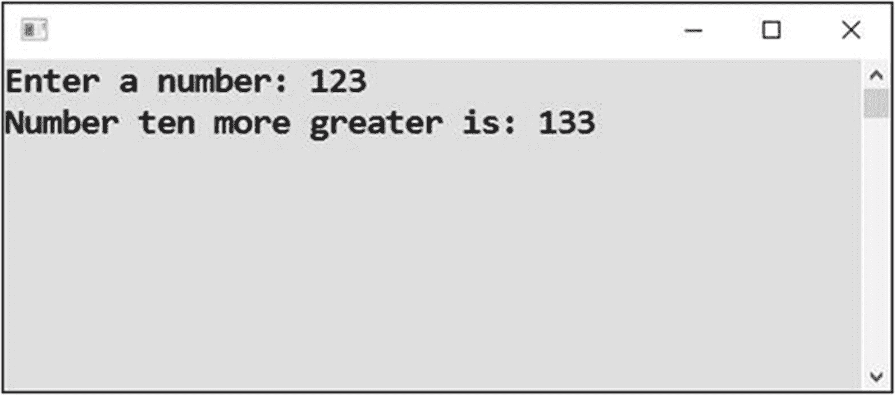
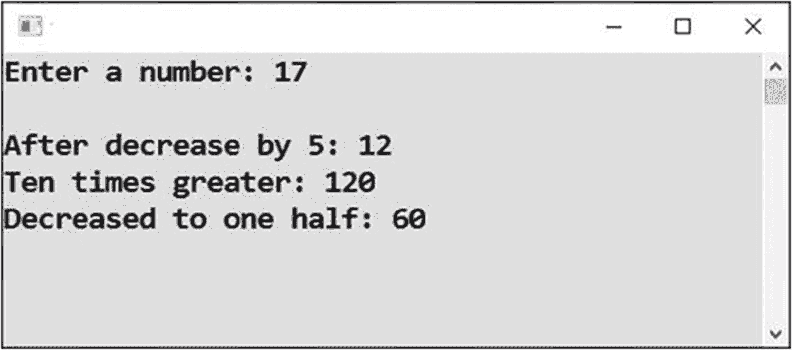
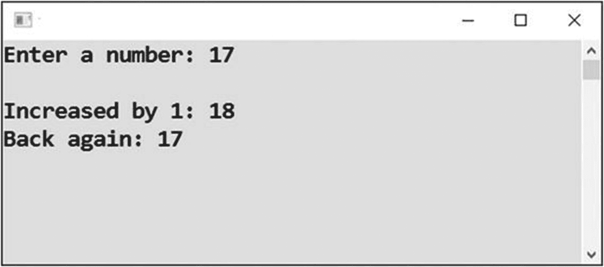
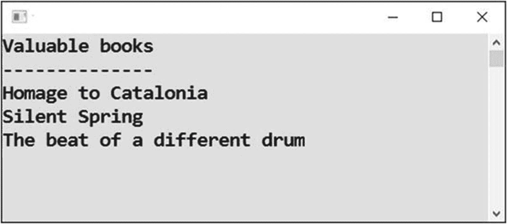
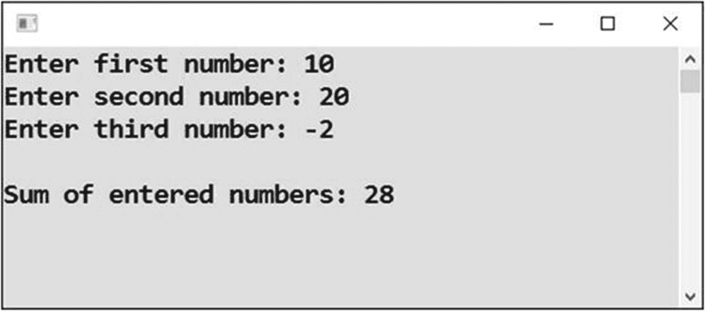
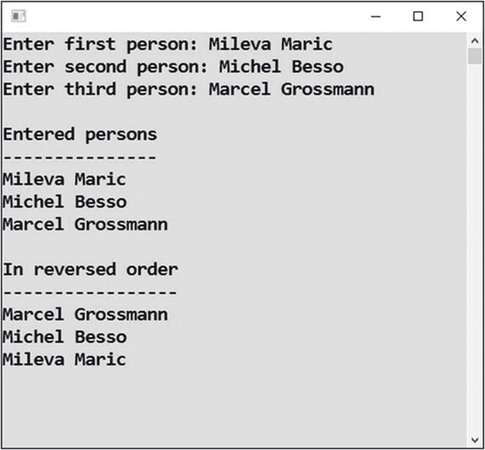

# 十三、累积值

到目前为止，您已经处理了存储了一个以后要使用的值的变量。初始赋值后，变量的值没有改变。现在，您已经准备好进入下一步，即研究在程序运行期间变量值发生变化的情况，换句话说，就是从旧值中确定新值。

## 十更，重访

首先，你将回到在第 [8](08.html) 章中学习的给一个数加 10 的任务。该程序的目标是呈现一个比用户输入的数字大 10 的值(见图 [13-1](#Fig1) )。



图 13-1

显示用户号码加 10

### 工作

你现在将以一种新的方式解决这项任务；具体来说，您将把计算结果存储在最初存储输入数字的同一个变量中。

这不一定是更好的解决方案，但是您将在后面的章节中学习如何进一步构建它。

### 解决办法

代码如下:

```cs
static void Main(string[] args)
{
    // Input
    Console.Write("Enter a number: ");
    string input = Console.ReadLine();
    int number = Convert.ToInt32(input);

    // Calculation
    number = number + 10;

    // Result output
    Console.WriteLine("Number ten more greater is: " + number);

    // Waiting for Enter
    Console.ReadLine();
}

```

### 讨论

解决方案的核心语句如下:`number = number + 10;`。这个声明是不寻常的，因为同一个东西——变量`number`—出现在等号的两边！

计算机执行语句是这样的:“取变量`number`的当前值，加十，将结果存储为变量`number`的新值。”因此，该语句的净结果是将`number`的价值增加了 10。

## 复合赋值

做同样的事情有一个很好的捷径，叫做*复合赋值*。你现在要研究这个。

### 工作

您将使用更简洁的复合赋值来解决上一个练习。

### 解决办法

代码如下:

```cs
static void Main(string[] args)
{
    // Input
    Console.Write("Enter a number: ");
    string input = Console.ReadLine();
    int number = Convert.ToInt32(input);

    // Calculation using compound assignment
    number += 10; // same as number = number + 10;

    // Result output
    Console.WriteLine("Number ten more greater is: " + number);

    // Waiting for Enter
    Console.ReadLine();
}

```

#### 注意

在这段代码中，您使用了复合赋值操作符(`+=`)，这是一个快捷方式，其功能与前面的解决方案相同。你会在所有 C 系列编程语言中看到复合赋值。

## 进一步的复合赋值

你喜欢复合作业吗？在处理其他算术运算时，还可以使用更多类似的赋值。

### 工作

我将向你展示一个结合减法、乘法和除法来说明复合赋值的程序(见图 [13-2](#Fig2) )。



图 13-2

复合赋值

### 解决办法

代码如下:

```cs
static void Main(string[] args)

{
    // Input
    Console.Write("Enter a number: ");
    string input = Console.ReadLine();
    int number = Convert.ToInt32(input);
    Console.WriteLine();

    // With subtraction
    number -= 5; // same as number = number - 5;
    Console.WriteLine("After decrease by 5: " + number);

    // With multiplication
    number *= 10; // same as number = number * 10;
    Console.WriteLine("Ten times greater: " + number);

    // With division
    number /= 2; // same as number = number / 2;
    Console.WriteLine("Decreased to one half: " + number);

    // Waiting for Enter
    Console.ReadLine();
}

```

#### 注意

程序每次都使用相同的变量！

这里的除法是整数除法，因为`number`和 2 都是`int`。

## 递增和递减

到目前为止，变量最频繁的变化是一个一个的变化。这就是为什么有特殊的超级简洁的方法来进行这样的计算。

### 工作

现在你将熟悉递增运算符(`++`)和递减运算符(`--`)，如图 [13-3](#Fig3) 所示。



图 13-3

递增和递减运算符

### 解决办法

代码如下:

```cs
static void Main(string[] args)
{
    // Input
    Console.Write("Enter a number: ");
    string input = Console.ReadLine();
    int number = Convert.ToInt32(input);

    // Increasing by 1 using INCREMENT OPERATOR
    number++; // same as number = number + 1;
    Console.WriteLine("Increased by 1: " + number);

    // Decreasing by 1 using DECREMENT OPERATOR
    number--; // same as number = number - 1;
    Console.WriteLine("Back again: " + number);

    // Waiting for Enter
    Console.ReadLine();
}

```

## 复合赋值和文本

由于`+`操作符可以用于文本，所以您也可以将复合赋值操作符(`+=`)用于文本。你可能会经常用到它。

### 工作

该任务将使你熟悉使用复合赋值的文本连接(见图 [13-4](#Fig4) )。



图 13-4

使用复合赋值的文本连接

### 解决办法

代码如下:

```cs
static void Main(string[] args)
{
    // Initial value (empty text)
    string books = "";

    // Appending
    books += "Homage to Catalonia" + Environment.NewLine;
    books += "Silent Spring" + Environment.NewLine;
    books += "The beat of a different drum" + Environment.NewLine;

    // Output
    Console.WriteLine("Valuable books");
    Console.WriteLine("--------------");
    Console.WriteLine(books);

    // Waiting for Enter
    Console.ReadLine();
}

```

## 渐进求和

渐进求和是对大量值求和的一个重要原则。这意味着不是在一个语句中一次性将它们相加，而是逐个相加，在一个特殊的变量中逐步累积中间结果。

### 工作

你将编写一个程序，逐步将三个输入的数字相加。当然，在一行中一次性将三个数相加会更方便。然而，我想用一个简单的例子来说明渐进求和的重要原理，并让你在讨论更复杂的话题，即循环之前习惯这个想法(见图 [13-5](#Fig5) )。



图 13-5

逐步累加三个输入的数字

### 解决办法

代码如下:

```cs
static void Main(string[] args)
{
    // Preparation - variable to accumulate intemediate result
    int sum = 0;

    // Input - 1\. number
    Console.Write("Enter first number: ");
    string input = Console.ReadLine();
    int number = Convert.ToInt32(input);

    // Adding first number to intermediate result
    sum += number;

    // Input - 2\. number
    Console.Write("Enter second number: ");
    input = Console.ReadLine();
    number = Convert.ToInt32(input);

    // Adding second number to intermediate result
    sum += number;

    // Input - 3\. number
    Console.Write("Enter third number: ");
    input = Console.ReadLine();
    number = Convert.ToInt32(input);

    // Adding third number to intermediate result
    sum += number;

    // Output
    Console.WriteLine();
    Console.WriteLine("Sum of entered numbers: " + sum);

    // Waiting for Enter
    Console.ReadLine();
}

```

## 多文本连接

同样，因为`+`操作符也可以用于文本，所以您可以将渐进求和的原则扩展到文本。在这种情况下，不妨称之为*渐进积累*。

### 工作

你将编写一个程序，逐步积累用户输入的名字。做两次积累会很有意思；第一个是原顺序，第二个是倒顺序。

为简单起见，您将只使用三个值(见图 [13-6](#Fig6) )。



图 13-6

逐渐积累名字

### 解决办法

代码如下:

```cs
static void Main(string[] args)
{
    // Preparation - variables to accumulate intermediate results
    string inOriginalOrder = "";
    string inReversedOrder = "";

    // Input of the first person
    Console.Write("Enter first person: ");
    string person = Console.ReadLine();

    // Appending the first person to intermediate result
    inOriginalOrder += person + Environment.NewLine;
    inReversedOrder = person + Environment.NewLine + inReversedOrder;

    // Input of the second person
    Console.Write("Enter second person: ");
    person = Console.ReadLine();

    // Appending the second person to intermediate result
    inOriginalOrder += person + Environment.NewLine;
    inReversedOrder = person + Environment.NewLine + inReversedOrder;

    // Input of the third person
    Console.Write("Enter third person: ");
    person = Console.ReadLine();

    // Appending the third person to intermediate result
    inOriginalOrder += person + Environment.NewLine;
    inReversedOrder = person + Environment.NewLine + inReversedOrder;

    // Output
    Console.WriteLine();
    Console.WriteLine("Entered persons");
    Console.WriteLine("---------------");
    Console.WriteLine(inOriginalOrder);
    Console.WriteLine("In reversed order");
    Console.WriteLine("-----------------");
    Console.WriteLine(inReversedOrder);

    // Waiting for Enter
    Console.ReadLine();
}

```

#### 注意

有趣的是，当以相反的顺序连接人名时，复合赋值没有帮助。

## 摘要

本章的中心主题是同一变量中值的累积。与迄今为止的程序相反，这里的程序重复地改变变量的值，通常使用它的初始值，并以某种方式修改它。具体来说，您学习了以下内容:

*   像`variable = variable + change;`这样的语句获取`variable`的当前值，加上`change`，并将结果存储为`variable`的新值

*   复合赋值，如`variable += change;`，它是前面语句的简短等效

*   与其他算术运算的复合赋值:`-=`、`*=`、`/=`

*   带文本的复合赋值(仅限`+=`)

*   使用`variable++;`和`variable--;`的超短符号增加(加 1)和减少(减 1)变量

在本章的最后，你已经熟悉了渐进求和(和渐进累加)的原理，这意味着一个接一个地对数字求和，同时将中间结果存储在一个特殊的变量中。这个原则主要用在对大量值求和时，在本书后面研究循环时，你会体会到它的极端重要性。