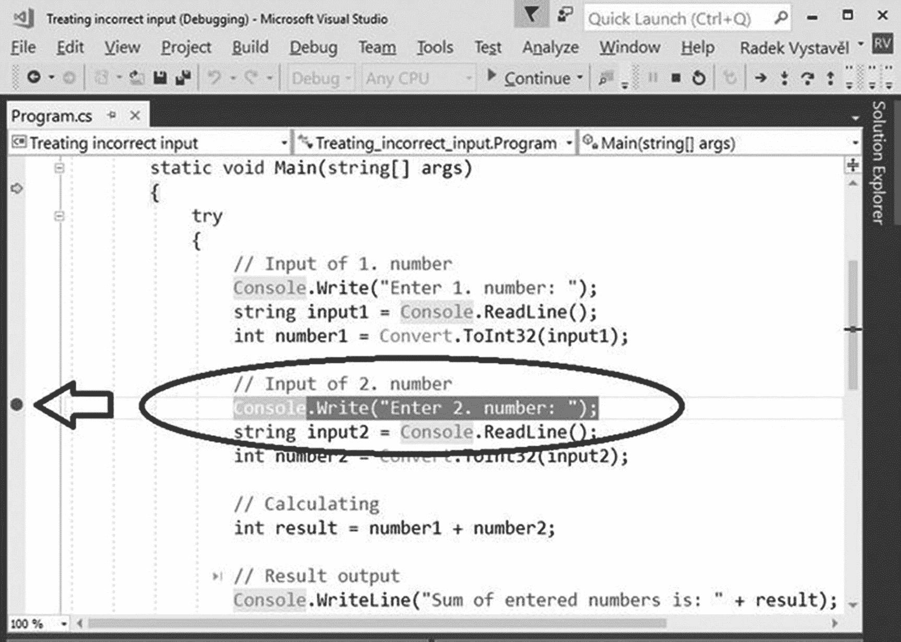
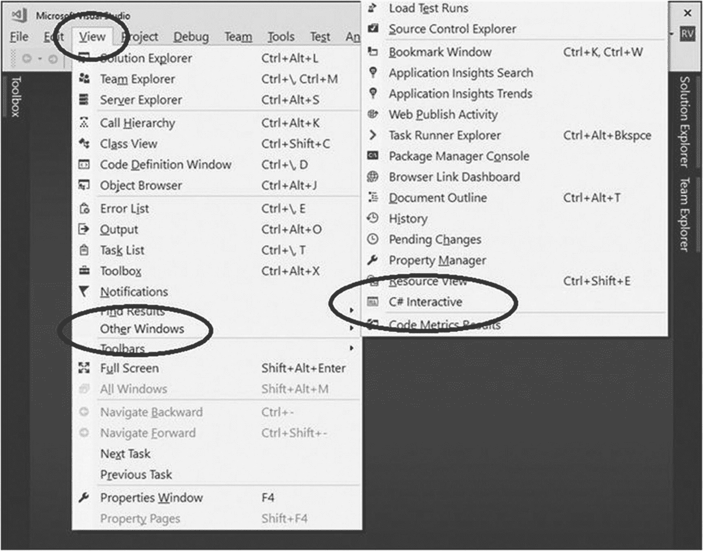

# 十四、基本工具

你已经完成了这本书的两部分。在接下来的两部分中，您将学习更复杂的主题，例如处理条件和循环。为了让你正确理解这些主题，在这一章中，我将介绍一些对你的编程有很大帮助的工具。

## 智能感知

您知道我将介绍的第一个工具:Visual Studio IntelliSense。每当您开始键入任何内容时，Visual Studio 都会立即为您提供完成文本的选项。当您选择其中一个选项时，开发环境会在工具提示中向您显示关于该选项的更多细节——该选项做什么，它需要什么参数，等等。

我在这一章中介绍智能感知，因为它经常被初级程序员使用。我建议您习惯于使用智能感知来完成您键入的几乎每个单词。你将省去大量的错别字。

### 探索可能性

使用智能感知也是探索当代计算平台提供的所有可能性的一种方式。

在过去，你必须研究手册或书籍中的可能性。他们中的一些人有足够的能力回答一个程序员几乎所有的问题。然而，今天有如此多的可能性，甚至一本 1000 页的书也不能把它们全部展示出来。

你还需要书(肯定是这本！)为您提供可靠而系统的指导，使您能够理解其中的原理，但您可能希望探索那里没有提到的进一步的可能性。智能感知是一个工具，可以向你展示其中的许多。

### 例子

你在寻找操纵文本的可能性吗？创建一个`string`类型的变量，并输入其名称后跟一个点(见图 [14-1](#Fig1) )。

图 14-1

输入变量名和点号

当你直接输入`string`后跟一个点时，你可以找到更多的可能性(见图 [14-2](#Fig2) )。

图 14-2

输入数据类型和点号

你在寻找可以和约会对象一起做的事情吗？输入`DateTime`变量，然后输入一个点(见图 [14-3](#Fig3) )。

图 14-3

输入日期时间和一个点

像文本一样，你可以输入`DateTime`和一个点，得到一些有用的提示(见图 [14-4](#Fig4) )。

图 14-4

从智能感知中获得一些提示

### 注意

使用列表底部的图标可以缩小 IntelliSense 为您提供的可能性列表。如果您只想查看属性、方法等等，请单击适当的图标。

### 快捷键

有时，当您执行某项操作时，智能感知会消失。在这种情况下，您可能会发现 Ctrl+J 或其他键盘快捷键很有用。要获得他们的列表，在 Visual Studio 的菜单栏中，选择编辑➤智能感知➤列表成员(见图 [14-5](#Fig5) )。

图 14-5

列表成员的快捷键

## 文件

智能感知可以给你很多提示。它还可以显示您搜索的功能的基本用法。但是，您可以找到所有详细信息的地方是在线文档。

### docs.microsoft.com

位于`http://` `docs.microsoft.com`的网站是寻找任何关于 C# 和其他微软技术的最佳起点(见图 [14-6](#Fig6) )。在页面上，单击“文档”，然后直接转到“C#”。

图 14-6

Microsoft 文档

### 搜索

您可以使用提供的链接使用文档网站。然而，更常见的是，你要搜索特定的东西。例如，在搜索字段中输入**控制台类别**并按回车键(参见图 [14-7](#Fig7) )。

图 14-7

正在搜索“控制台类”

你感兴趣的链接往往是第一个返回的(见图 [14-8](#Fig8) )。

图 14-8

查看“控制台类”的文档

### 特定类页面

点击正确的链接后，你会找到关于某个特定类的所有东西，比如本例中的`Console`。

当我开始熟悉一些我还不知道的类时，我通常会寻找“通用操作”和“备注”部分，它们涵盖了关于类使用的基本信息和进一步细节的入口点(见图 [14-9](#Fig9) 和 [14-10](#Fig10) )。

图 14-10

在备注部分获取更多详细信息

图 14-9

在通用操作部分获取介绍性信息

### 普通搜索

作为本节文档的总结，请注意，您也可以在 Microsoft 文档网站之外执行搜索。只需使用您最喜欢的网络浏览器进行搜索。

然而，与文档网站搜索相反，普通搜索更频繁地显示不相关的结果。为了弥补这一点，您可以使用编程语言名称来细化您的查询，例如在您最喜欢的 web 浏览器的搜索字段中输入**控制台类 C#** 。

## 调试工具

除了 IntelliSense 和文档之外，您还会发现其他一些有用的工具。具体来说，你可以使用调试工具，可以说，这些工具允许你查看计算机内部。您可以使用它们来查看计算机如何执行单个命令，内存中存储了哪些值，等等。

这些就是你现在要研究的工具。最初，开发它们是为了方便程序调试，换句话说，是为了查找和消除错误。然而，作为说明性工具，它们可能更有助于您理解各种编程结构。

### 项目

最好在实践中尝试所有的工具，所以请从第 [8 章](08.html)开始在 Visual Studio 中打开“处理不正确输入”项目。程序将两个数相加，并使用`try-catch`处理可能的输入错误。

### 单步执行代码

计算机工作速度如此之快，以至于不可能以千兆赫的速度跟上它。这就是为什么*逐步执行*代码通常是有帮助的，这迫使计算机根据你的命令一次执行一条语句。

转到您打开的“处理不正确的输入”项目，并使用 F10 键启动它，而不是通常的 F5。当然，选择调试➤单步调试菜单也是一样的(见图 [14-11](#Fig11) )。

图 14-11

使用 F10 键启动程序

现在，每当您按下 F10 时，就会一次执行一个单独的程序语句。一直以来，使用黄色箭头和黄色背景，开发环境表示将在下一步中执行的语句。

现在只要玩踏脚。尝试用户输入正确数据的情况以及错误输入的情况。IDE 将向您展示`try-catch`或其他任何东西是如何工作的。这可以让你亲眼看到程序是如何运行的。

#### 终止步进

当你找到你要找的东西时，你不必一步一步地通过程序到最后一条语句。还有其他选择:

*   使用 F5 键(或调试➤继续)，你可以继续正常的程序执行(没有步进)。

*   使用 Shift+F5 键(或调试➤停止调试)，可以终止程序执行。

### 断点

我已经介绍了在您已经过了您感兴趣的点之后，如果您不想逐句通过您的代码，该怎么办。还有一种情况。说你不想在到达感兴趣的地方之前做任何事情。在这种情况下，您可以使用一个*断点*。

单击计算机要停止的语句并按 F9 键(或者，右键单击并选择断点➤插入断点)。断点已被放置的事实用暗红色背景和在行首的暗红色项目符号表示(见图 [14-12](#Fig12) )。

图 14-12

插入的断点

#### 使用断点

如果您的程序仍在运行，请使用 Shift+F5 组合键终止它。现在以常规方式启动程序，换句话说，使用 F5 键。它会正常运行，到达断点就停止。Visual Studio 在程序的窗口前弹出。

之后，您可以逐句通过代码或只是看一些东西，并使用 F5 键来进一步运行您的程序，直到它的结尾或直到下一个断点。

#### 移除断点

要删除不再需要的断点，请在特定行上再次按 F9，或者右键单击并从上下文菜单中选择断点➤删除断点。

### 内存检查

每当程序挂起时(从断点、单步执行等)，您可以检查程序可用的内存，并浏览各个变量的值。

为了便于内存检查，Visual Studio 在其窗口底部显示了“汽车”、“局部变量”和“监视”窗格。如果没有这些窗格，您可以使用调试➤窗口菜单来显示它们。

“自动”和“局部变量”窗格自动选择要显示的变量，而“监视”窗格则根据您希望看到的内容手动填充。您可以在窗格中输入特定变量的名称，或者您可以在代码中右键单击变量并从上下文菜单中选择添加监视(参见图 [14-13](#Fig13) )。

图 14-13

选择添加观察

所选变量的当前值出现在监视窗口中(参见图 [14-14](#Fig14) )。

图 14-14

使用监视窗口

## C# 交互式

我在这里提到的最后一个工具可以帮助你在交互模式下学习 C# 语句。

### 这是什么？

到目前为止，你总是不得不写一个有几个语句的程序，然后启动它来看它的运行。交互模式允许您输入单个 C# 语句并立即运行它们。通过这种方式，您可以更快地探索一些 C# 特性。

### 如何推出？

您可以通过选择查看➤其他窗口➤ C# 交互来启动交互模式(参见图 [14-15](#Fig15) )。您甚至不需要创建/打开项目。

图 14-15

切换到交互模式

图 [14-16](#Fig16) 显示了一个交互会话的例子——我声明了一个数字变量，增加了 10，并显示了它的值。

图 14-16

示例交互式会话

### 笔记

请注意以下几点:

*   如果需要输入多行语句，可以用 Shift+enter 来终止行，而不是简单的 Enter。

*   使用`#help`显示关于如何使用交互模式的简明信息。

## 摘要

本章向您介绍了可以在编程中使用的工具，包括 IntelliSense、文档、调试工具和交互模式。

当您在 Visual Studio 编辑器中键入时，IntelliSense 会显示可用可能性和相应工具提示的列表。你已经知道如何使用它了。在这里，我介绍了 IntelliSense 作为探索巨大的 C# 世界的一种方式。例如，如果您想要操作文本，并且您不知道相应的方法是如何调用的，那么您可以在一个`string`变量后面加上一个点，然后浏览各种可能性。您还可以在类型名称后面加上一个点，以获得更多的可能性。

您了解了 Microsoft 文档网站，该网站包含所有 Microsoft 编程技术的宝贵信息，包括 C# 语言和。NET 平台。您通常在此网站上执行全文搜索。

在这一章中，我揭示了一些调试工具，它们可以让你看到“计算机内部”您可以观察各个语句是如何执行的，检查变量值，等等。具体来说，您学习了如何单步执行代码、设置断点和检查内存。

交互模式是一种快速输入 C# 语句并查看它们的功能的方式。这是一个探索新特性的好工具。