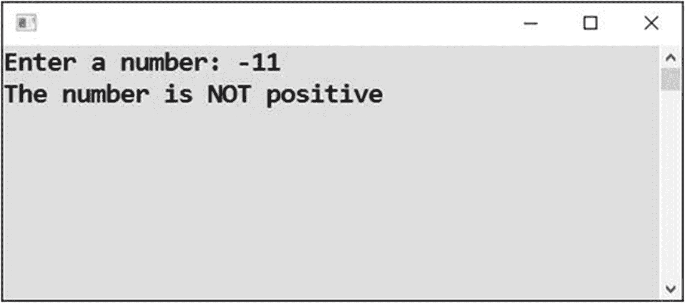

# 十五、条件入门

到目前为止，一个程序的语句总是从开始执行到结束，而不管其他任何事情，只是在轮到它们的时候执行。在这一章中，整个新世界将开始展现自己，因为你将学习程序语句的*条件执行*。这意味着您将根据是否满足某个*条件*来处理可能执行也可能不执行的语句。

## 密码输入

您的第一个带条件的程序将评估一个密码。用户可能被允许也可能不被允许进入系统，这取决于他们是否输入了正确的密码。

### 工作

您将编写一个程序，提示用户输入密码，然后评估输入的密码是否正确。为了简单起见，正确的密码将直接在代码中指定(见图 [15-1](#Fig1) 和 [15-2](#Fig2) )。


图 15-2

正确的密码


图 15-1

密码不正确

### 分析

让我们更详细地看看这个程序。

#### 程序

在这个程序中，当两个密码(输入的和存储的)一致时，执行一些活动，当它们不一致时，执行不同的活动。在这种情况下，你可以通过适当的信息允许或拒绝用户(见图 [15-3](#Fig3) )。


图 15-3

程序流程

#### 程序分支

一般来说，*程序分支*意味着根据条件的满足采取不同的路径(见图 [15-4](#Fig4) )。


图 15-4

分支

#### 句法

对于分支，C# 使用如下所示的`if-else`结构:

```cs
if (condition)
{
  Statements to perform when the condition holds
}
else
{
  Statements to perform otherwise
}

```

### 解决办法

代码如下:

```cs
static void Main(string[] args)
{
    // Input
    Console.Write("Enter password: ");
    string enteredPassword = Console.ReadLine();

    // Password check
    if (enteredPassword == "friend")
    {
        Console.WriteLine("Password is OK, please enter");
    }
    else
    {
        Console.WriteLine("Incorrect password");
    }

    // Waiting for Enter
    Console.ReadLine();
}

```

### 讨论

为了阐明这个条件，我使用了一个等式测试，使用两个等号输入。如果比较值相同，测试评估为`true`，条件被认为满足，并且执行`if`分支中的语句。如果比较值不同，测试评估为`false`，条件被认为不满足，并且执行`else`分支中的语句。

#### 试验

现在你可以检查程序是如何执行的！除了执行一个普通的程序运行，你还可以单步执行代码，就像你在上一章学到的那样。

## 反向条件

为了让你更熟悉情况，从不同的角度看它们是很有用的。继续讨论密码问题，让我们从另一个角度来看。

### 工作

现在的任务是交替地解决前面的练习，也就是把条件反过来。换句话说，你将测试不平等而不是平等。

### 解决办法

下面是代码:

```cs
static void Main(string[] args)
{
    // Correct password
    string correctPassword = "friend";

    // Input
    Console.Write("Enter password: ");
    string enteredPassword = Console.ReadLine();

    // Password check
    if (enteredPassword != correctPassword)
    {
        Console.WriteLine("Incorrect password");
    }
    else
    {
        Console.WriteLine("Password is OK, please enter");
    }

    // Waiting for Enter
    Console.ReadLine();
}

```

### 讨论

在这个练习中，我使用了一个不等式测试，它是用一个感叹号后跟一个等号键入的。当比较值**不一致**时，测试返回真。

## 长度检查

虽然两个文本只能通过比较来确定它们是相同还是不同，但是两个数字也可以通过比较来确定哪一个更长(或更短)。让我们来看看。

### 工作

在本节中，您将学习一个程序中的数字比较，该程序评估输入的文本是否最多四个字符长(参见图 [15-5](#Fig5) 和 [15-6](#Fig6) )。


图 15-6

长文本


图 15-5

短文本

### 解决办法

据推测，您应该确定输入文本的字符数，并将其与数字 4 进行比较。在第 [7 章](07.html)中，你学习了如何确定文本的字符数——使用它的`Length`属性(程序是“文本作为对象”)。无论如何，如果您不记得属性的名称，您可以在文本变量的末尾添加一个点，并浏览 IntelliSense 可能性以查看什么可能是合适的，如前一章所述。

代码如下:

```cs
static void Main(string[] args)
{
    // Input
    Console.Write("Enter a word: ");
    string word = Console.ReadLine();

    // Determining length
    int wordLength = word.Length;

    // Checking length
    if (wordLength <= 4)
    {
        Console.WriteLine("Word is short (at most 4 characters)");
    }
    else
    {
        Console.WriteLine("Word is long (more than 4 characters)");
    }

    // Waiting for Enter
    Console.ReadLine();
}

```

#### 注意

我在这个解决方案中使用了一个小于或等于运算符，看起来像这样:`<=`。

## 正数

在本节中，您将获得更多关于数字比较的练习。

### 工作

您将编写一个程序来评估用户输入的数字是否为正数(参见图 [15-7](#Fig7) 和 [15-8](#Fig8) )。



图 15-8

这不是积极的


图 15-7

它是积极的

### 解决办法

代码如下:

```cs
static void Main(string[] args)
{
    // Input
    Console.Write("Enter a number: ");
    string input = Console.ReadLine();
    int number = Convert.ToInt32(input);

    // Evaluation
    if (number > 0)
    {
        Console.WriteLine("The number is positive");
    }
    else
    {
        Console.WriteLine("The number is NOT positive");
    }

    // Waiting for Enter
    Console.ReadLine();
}

```

#### 讨论

我使用了一个大于运算符来比较输入的数字和零。

当用户输入 0 时，你认为程序会做什么？它检查条件`0 > 0`并发现它不满足。因此，它显示该数字不是正数。这就是相当不寻常的信息措辞(“…非正面”)的原因，如图 [15-9](#Fig9) 所示。我没有用过“……是否定的”。


图 15-9

零的结果

## 奇数和偶数

让我们进行另一个数字比较。

### 工作

你现在的任务是编写一个程序，评估用户输入的数字是奇数还是偶数(见图 [15-10](#Fig10) 和 [15-11](#Fig11) )。


图 15-11

确定奇数


图 15-10

确定偶数

### 解决办法

解决方案的核心是确定输入的数除以 2 的余数。如果余数为零，则数字为偶数。如果有余数，这个数就是奇数。

代码如下:

```cs
static void Main(string[] args)
{
    // Input
    Console.Write("Enter a number: ");
    string input = Console.ReadLine();
    int number = Convert.ToInt32(input);

    // Remainder calculation
    int remainderAfterDivisionByTwo = number % 2;

    // Evaluation
    if (remainderAfterDivisionByTwo == 0)
    {
        Console.WriteLine("The number is even");
    }
    else
    {
        Console.WriteLine("The number is odd");
    }

    // Waiting for Enter
    Console.ReadLine();
}

```

## 大小写无关

你已经知道两个文本可以比较，看看他们是否相等或不相等。这种比较区分大小写。换句话说，*霍比特人*和*霍比特人*被认为是不同的单词。然而，您经常需要不区分大小写的比较，我现在将向您展示这一点。

### 工作

在这个程序中，用户将输入两个名字，你将评估它们是相同还是不同，不考虑小写和大写的区别(见图 [15-12](#Fig12) 和 [15-13](#Fig13) )。


图 15-13

不同的名字


图 15-12

相同的名字

### 解决办法

该解决方案的核心是在进行比较之前将两段文本都转换成小写。为此，您可以使用`ToLower`方法调用。

代码如下:

```cs
static void Main(string[] args)
{
    // Inputs
    Console.Write("Enter a name: ");
    string name1 = Console.ReadLine();

    Console.Write("Enter another name: ");
    string name2 = Console.ReadLine();

    // Converting to small letters
    string name1inSmall = name1.ToLower();
    string name2inSmall = name2.ToLower();

    // Evaluating
    if (name1inSmall == name2inSmall)
    {
        Console.WriteLine("You have entered the same names");
    }
    else
    {
        Console.WriteLine("You have entered different names");
    }

    // Waiting for Enter
    Console.ReadLine();
}

```

## 不带牙套

如果分支只包含一条语句，C# 允许您省略`if`和`else`分支周围的括号。一般来说，我不推荐这种做法，因为它可能会产生误导。我现在给你看这个，只是为了让你意识到它。

### 工作

您将再次解决之前的练习，这一次没有括号。

### 解决办法

代码如下:

```cs
static void Main(string[] args)
{
    // Inputs
    Console.Write("Enter a name: ");
    string name1 = Console.ReadLine();

    Console.Write("Enter another name: ");
    string name2 = Console.ReadLine();

    // Converting to small letters
    string name1inSmall = name1.ToLower();
    string name2inSmall = name2.ToLower();

    // Evaluating
    // BRANCHES NOT DELIMITED BY BRACES (CURLY BRACKETS)
    if (name1inSmall == name2inSmall)
        Console.WriteLine("You have entered the same names");
    else
        Console.WriteLine("You have entered different names");

    // Waiting for Enter
    Console.ReadLine();
}

```

## 两个数中较大的一个

程序员的一项常见任务是找出两个数字中哪个更大(或者更小，类似地)。

### 工作

你现在的任务是编写一个程序，要求用户输入两个数字，然后说出两个数字中哪个更大(见图 [15-14](#Fig14) )。


图 15-14

确定哪个数字更大

### 解决办法

代码如下:

```cs
static void Main(string[] args)
{
    // Inputs
    Console.Write("Enter first number: ");
    string input1 = Console.ReadLine();
    int number1 = Convert.ToInt32(input1);

    Console.Write("Enter second number: ");
    string input2 = Console.ReadLine();
    int number2 = Convert.ToInt32(input2);

    // Evaluating
    int greater;
    if (number1 > number2)
    {
        greater = number1;
    }
    else
    {
        greater = number2;
    }

    // Output
    Console.WriteLine("Greater of entered numbers is: " + greater);

    // Waiting for Enter
    Console.ReadLine();
}

```

## 没有 else 分支

在之前的练习中，您总是有两个分支——`if`分支和`else`分支。换句话说，你总是处于非此即彼的境地。然而，需要注意的是，如果你愿意，可以省略`else`分支。这意味着如果一个条件满足了，你就做一些事情，如果没有满足，你就什么都不做。看一看！

### 工作

在上一个练习中，您将`greater`变量设置为第一个值或第二个值。

现在你将以不同的方式解决同样的任务。首先，您将直接将`greater`变量设置为第一个值，然后如果第二个值更大，您将更改最终结果。

### 解决办法

下面是代码:

```cs
static void Main(string[] args)
{
    // Inputs
    Console.Write("Enter first number: ");
    string input1 = Console.ReadLine();
    int number1 = Convert.ToInt32(input1);

    Console.Write("Enter second number: ");
    string input2 = Console.ReadLine();
    int number2 = Convert.ToInt32(input2);

    // Evaluating
    int greater = number1;
    if (number2 > greater)
    {
        greater = number2;
    }

    // Output
    Console.WriteLine("Greater of entered numbers is: " + greater);

    // Waiting for Enter
    Console.ReadLine();
}

```

## 使用内置函数

在这本书里，我经常从不同的角度向你展示事物。我坚信这能增进你的理解。对于当前寻找两个值中较大值的问题，我将向您展示第三种解决方法。任务如此频繁，事实上，有一个方便的内置功能。

### 工作

您将使用内置函数`Math.Max`解决前面的练习。

### 解决办法

代码如下:

```cs
static void Main(string[] args)
{
    // Inputs
    Console.Write("Enter first number: ");
    string input1 = Console.ReadLine();
    int number1 = Convert.ToInt32(input1);

    Console.Write("Enter second number: ");
    string input2 = Console.ReadLine();
    int number2 = Convert.ToInt32(input2);

    // Evaluating
    int greater = Math.Max(number1, number2);

    // Output
    Console.WriteLine("Greater of entered numbers is: " + greater);

    // Waiting for Enter
    Console.ReadLine();
}

```

## 摘要

在这一章中，你开始学习程序语句的条件执行，这意味着一个或多个语句的执行或不执行可以通过一些测试来决定。您看到了以下测试示例:

*   用`==`操作符测试两个文本或两个数字的相等性

*   用`!=`运算符测试两个文本或两个数字的不等式

*   用`>`(或`<`)运算符测试一个数是否大于(或小于)另一个数

最后一个测试可以用`>=`(或`<=`)运算符扩展为“大于或等于”(或“小于或等于”)。

为了在代码中使用条件执行，您学习了`if-else`构造。这由一个条件和两个分支组成。如果条件被评估为真(满足)，则执行`if`分支中的语句。如果条件被评估为假(未满足)，则执行`else`分支中的语句。

您了解到，如果一个分支由一条语句组成，C# 语法允许您省略分支周围的大括号，尽管我不鼓励您这样做，因为当人们后来将一个分支扩展到几条语句时，经常会忘记包括大括号。

更重要的是，您了解到如果您愿意，可以省略`else`分支。这意味着没有替代行动——当条件不满足时，什么也不做。

作为奖励，您学习了有用的内置函数`Math.Max`。(你大概能猜到有个类似的函数叫`Math.Min`。)