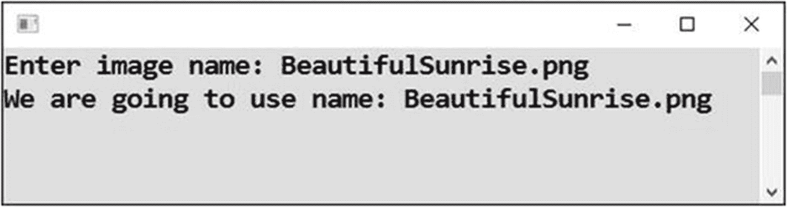
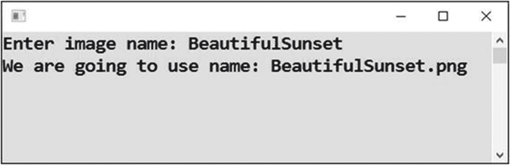
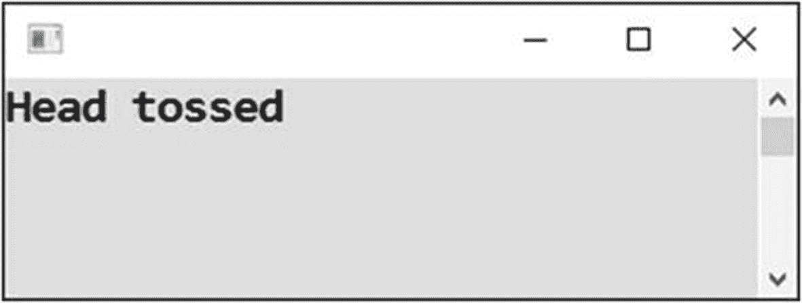
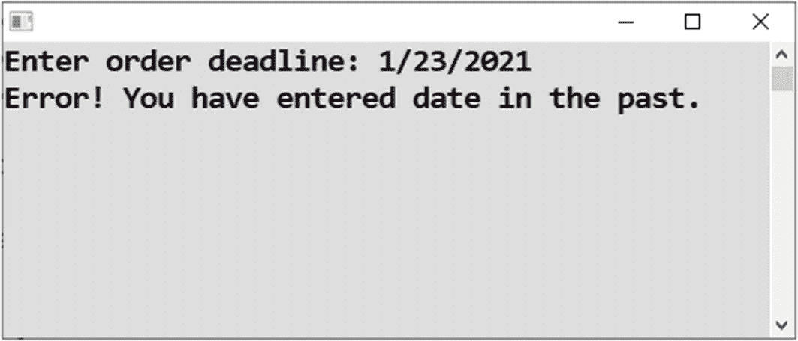
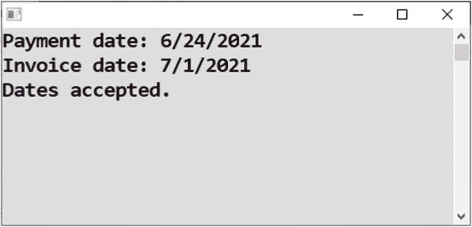
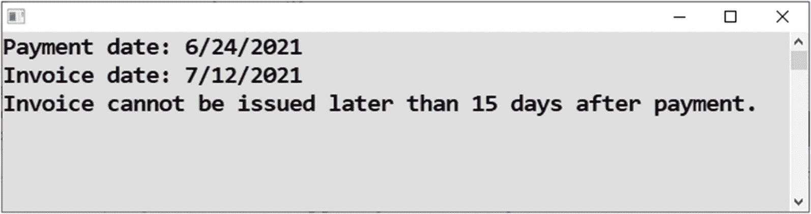
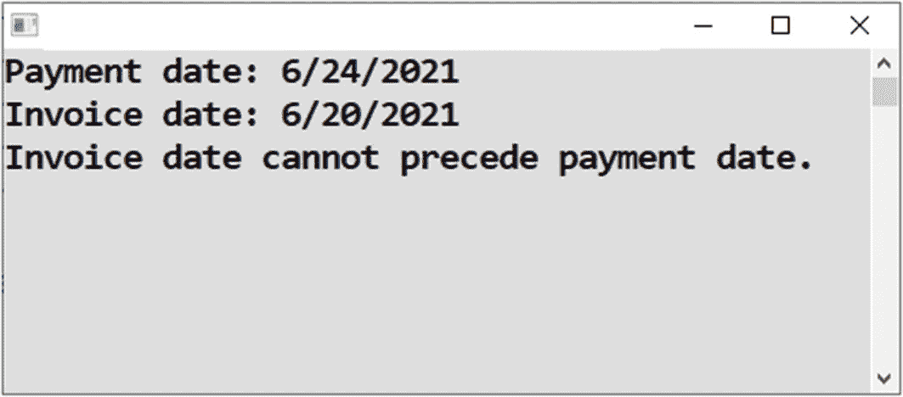
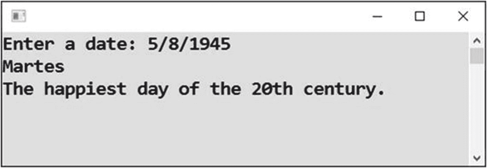
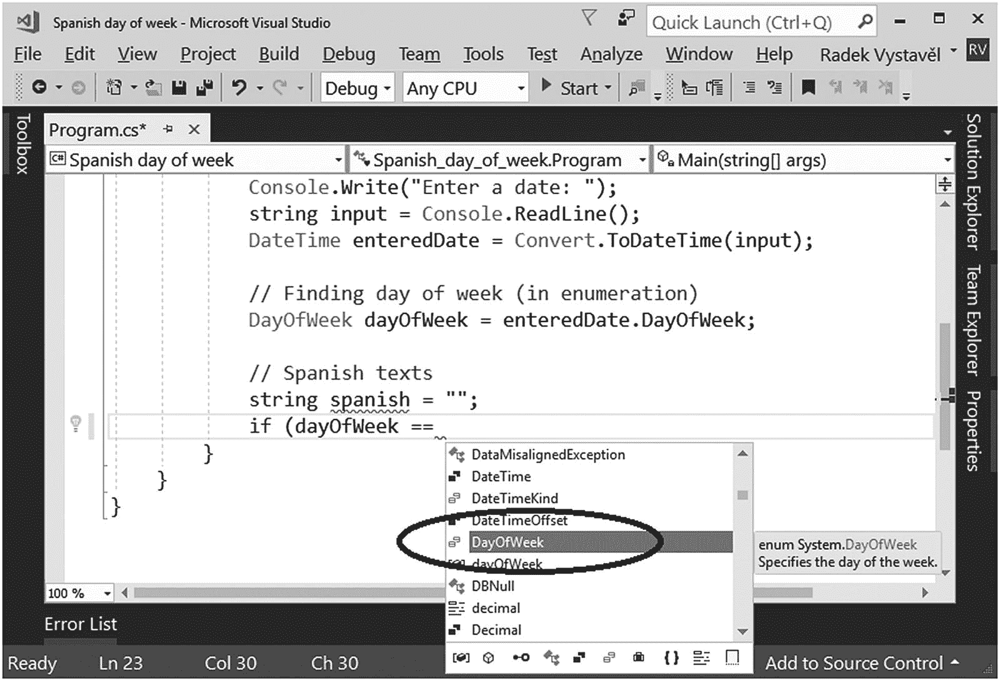

# 十六、实际情况

在前一章中，你学习了程序语句的条件执行。在这一章中，你将加深对这一主题的了解。我将向您展示如何在您的编程生涯中迟早会遇到的几个简单任务中使用条件和分支。

## 附加扩展名

有时，您想向用户询问文件名，但您不知道用户输入的文件名是否带有扩展名。

### 工作

您将编写一个程序，将扩展名`.png`附加到输入的文件名上，除非该扩展名已经是输入的一部分(见图 [16-1](#Fig1) 和 [16-2](#Fig2) )。



图 16-2

不追加。png 扩展



图 16-1

追加。png 扩展

### 解决办法

代码如下:

```cs
static void Main(string[] args)
{
    // Input
    Console.Write("Enter image name: ");
    string fileName = Console.ReadLine();

    // Appending extension (ONLY IN CASE OF NEED)
    if (!fileName.ToLower().EndsWith(".png"))
    {
        fileName += ".png";
    }

    // Output
    Console.WriteLine("We are going to use name: " + fileName);

    // Waiting for Enter
    Console.ReadLine();
}

```

### 讨论

让我们稍微讨论一下这个程序。

#### 延伸检测

当前练习中最有趣的一点是找出输入的文件名是否以特定的扩展名结尾:

*   首先，将文件名转换成小写，这样就不必区分`.png`和`.PNG`。

*   您使用方法`EndsWith`来确定文本是否以特定的内容结束。在这种情况下，如果文本以`.png`结尾，方法调用将返回`true`。否则返回`false`。

*   使用`!`操作符对`EndsWith`方法返回的结果求反。感叹号将`true`变为`false`，反之亦然。这意味着你实际上是在问“文本*不是以`.png`结尾的吗？”而不是“是不是以`.png`结尾？”。*

#### 输入条件

请注意，在指定条件时，不一定要输入比较。例如，您不必总是使用“小于”。如果条件评估为布尔值，如`true`或`false`，这就足够了。

如果条件评估为`true`，则认为满足，并且执行`if`分支中的语句。

如果条件评估为`false`，则认为没有满足，并且执行`else`分支中的语句(或者在缺少`else`分支的情况下不执行任何操作)。

#### 缺少 else 分支

示例程序缺少一个`else`分支。如果输入的名字以`.png`结尾，`EndsWith`方法会找到它并返回`true`。如果得到`false`，则认为条件没有满足，所以不会执行附加扩展名的语句，输入的名称保持不变。

#### 链接

注意`ToLower`和`EndsWith`方法的*链接*。小写转换的输出不存储在任何变量中。相反，它作为链中下一个方法的输入，换句话说，`EndsWith`。

## 头和尾

让我们再做一些关于条件的练习。

### 工作

你要写一个扔一次硬币的程序(见图 [16-3](#Fig3) )。



图 16-3

扔硬币

### 解决办法

解决方案的核心是生成一个随机数——零或一——并随后将其转换为正面或反面。

代码如下:

```cs
static void Main(string[] args)
{
    // Random number generator
    Random randomNumbers = new Random();

    // Random number 0/1 and its transformation
    int randomNumber = randomNumbers.Next(0, 1 + 1);
    if (randomNumber == 0)
    {
        Console.WriteLine("Head tossed");
    }
    else
    {
        Console.WriteLine("Tail tossed");
    }

    // Waiting for Enter
    Console.ReadLine();
}

```

#### 讨论

我只想提醒您，`Next`方法要求指定一个随机数范围的上限，并且已经增加了 1。这就是为什么你在前一个程序中写了`1+1`。当然，你也可以直接写`2`，但是`1+1`在我看来更符合逻辑，声明`1`为上限，并添加(奇怪的)必需的`1`。

## 截止日期检查

俗话说，“永远不要相信用户”。这意味着作为一名程序员，你必须经常检查生产软件中用户输入的数据。

你需要检查用户数据通常不是因为恶意使用，因为 99.9%的用户没有任何滥用你的软件的意图。用户只会犯错误。这就是为什么你应该检查他们的输入并提示他们改正。

因此，现在您将学习如何实现一些输入检查。

### 工作

您将编写一个程序，提示用户输入订单截止日期，如果用户输入的是过去的日期，则会给出警告(见图 [16-4](#Fig4) )。



图 16-4

查看日期

### 解决办法

代码如下:

```cs
static void Main(string[] args)
{
    // Input
    Console.Write("Enter order deadline: ");
    string input = Console.ReadLine();
    DateTime enteredDeadline = Convert.ToDateTime(input);

    // Checking entered value
    DateTime today = DateTime.Today;
    if (enteredDeadline < today)
    {
        Console.WriteLine("Error! You have entered date in the past.");
    }
    else
    {
        Console.WriteLine("Deadline accepted.");
    }

    // Waiting for Enter
    Console.ReadLine();
}

```

#### 讨论

请注意以下几点:

*   要将文本形式输入的日期转换成`DateTime`对象，可以使用`Convert.ToDateTime`方法调用。

*   如果输入不存在的日期，转换将失败。您可以使用`try-catch`来处理这个问题。

*   与数字转换类似，`Convert.ToDateTime`可以接受第二个参数，指定转换所用的语言。

## 发票日期检查

让我们再做一个检查用户输入数据的练习。

### 工作

我国的增值税(VAT)法规要求发票开具日期不能早于付款日期，同时也不能晚于付款后 15 天。

当前的任务是执行这两项检查(见图 [16-5](#Fig5) 、 [16-6](#Fig6) 和 [16-7](#Fig7) )。



图 16-7

接受日期



图 16-6

约会太晚



图 16-5

约会太早

### 解决办法

以下是解决方案:

```cs
static void Main(string[] args)
{
    // Inputs
    Console.Write("Payment date: ");
    string inputPayment = Console.ReadLine();
    DateTime paymentDate = Convert.ToDateTime(inputPayment);

    Console.Write("Invoice date: ");
    string inputInvoice = Console.ReadLine();
    DateTime invoiceDate = Convert.ToDateTime(inputInvoice);

    // Checking
    bool ok = true;
    if (invoiceDate < paymentDate)
    {
        Console.WriteLine("Invoice date cannot precede payment date.");
        ok = false;
    }
    if (invoiceDate > paymentDate.AddDays(15))
    {
        Console.WriteLine("Invoice cannot be issued later than 15 days after payment.");
        ok = false;
    }
    if (ok)
    {
        Console.WriteLine("Dates accepted.");
    }

    // Waiting for Enter
    Console.ReadLine();
}

```

#### 讨论

在这个解决方案中，您使用了一个名为`ok`的辅助变量。变量监控一切是否正常。一开始，你把它设置为`true`。如果执行的任何检查失败，您将该值切换到`false`。如果变量在两次检查后都保持`true`，您就知道一切正常，并向用户显示一条确认消息。

## 西班牙语星期几

现在，您将学习如何将代码的执行分成多个分支。

### 工作

您将编写一个程序，显示用户输入的日期的西班牙语版本的星期几(月、月、日等等)(见图 [16-8](#Fig8) )。



图 16-8

用西班牙语显示日期

### 解决办法

您可以使用`DateTime`对象的`DayOfWeek`属性来查找星期几。可以使用一系列条件进行到西班牙语的转换。

代码如下:

```cs
static void Main(string[] args)
{
    // Input
    Console.Write("Enter a date: ");
    string input = Console.ReadLine();
    DateTime enteredDate = Convert.ToDateTime(input);

    // Finding day of week (in enumeration)
    DayOfWeek dayOfWeek = enteredDate.DayOfWeek;

    // Spanish texts
    string spanish = "";
    if (dayOfWeek == DayOfWeek.Monday)
        spanish = "Lunes";
    if (dayOfWeek == DayOfWeek.Tuesday)
        spanish = "Martes";
    if (dayOfWeek == DayOfWeek.Wednesday)
        spanish = "Miercoles";
    if (dayOfWeek == DayOfWeek.Thursday)
        spanish = "Jueves";
    if (dayOfWeek == DayOfWeek.Friday)
        spanish = "Viernes";
    if (dayOfWeek == DayOfWeek.Saturday)
        spanish = "Sábado";
    if (dayOfWeek == DayOfWeek.Sunday)
        spanish = "Domingo";

    // Output
    Console.WriteLine(spanish);
    if (enteredDate == new DateTime(1945, 5, 8))
        Console.WriteLine("The happiest day of the 20th century.");

    // Waiting for Enter
    Console.ReadLine();
}

```

#### 讨论

请注意以下几点:



图 16-9

使用 DayOfWeek 枚举

*   您已经省略了围绕单个`if`分支的大括号。您可以这样做，因为每个分支中只有一个语句。我通常不这样做，但是在这种有许多简单的`if`的情况下，对我来说这似乎会使代码更整洁。

*   一周中的每一天都是`DayOfWeek`枚举的成员。在输入两个等号后，只要按下键盘上的空格键，Visual Studio 就会为您提供枚举(参见图 [16-9](#Fig9) )。使用 Visual Studio 提供的功能！

## 交换语句

对于某些多重分支的情况，C# 中也有一个`switch`语句。现在你将学习如何使用它。

### 工作

您将使用`switch`语句解决最后一个任务。

### 解决办法

下面是代码:

```cs
static void Main(string[] args)
{
    // Input
    Console.Write("Enter a date: ");
    string input = Console.ReadLine();
    DateTime enteredDate = Convert.ToDateTime(input);

    // Finding day of week (in enumeration)
    DayOfWeek dayOfWeek = enteredDate.DayOfWeek;

    // Spanish texts
    string spanish = "";
    switch (dayOfWeek)
    {
        case DayOfWeek.Monday:
            spanish = "Lunes";
            break;
        case DayOfWeek.Tuesday:
            spanish = "Martes";
            break;
        case DayOfWeek.Wednesday:
            spanish = "Miercoles";
            break;
        case DayOfWeek.Thursday:
            spanish = "Jueves";
            break;
        case DayOfWeek.Friday:
            spanish = "Viernes";
            break;
        case DayOfWeek.Saturday:
            spanish = "Sábado";
            break;
        case DayOfWeek.Sunday:
            spanish = "Domingo";
            break;
    }

    // Output
    Console.WriteLine(spanish);
    if (enteredDate == new DateTime(1945, 5, 8))
        Console.WriteLine("The happiest day of the 20th century.");

    // Waiting for Enter
    Console.ReadLine();
}

```

#### 讨论

如果重复的分支总是基于相同的值，您可以使用`switch`语句作为`if`序列的替换。这是本例中的`dayOfWeek`变量的值。

至于语法，`switch`关键字后面(在括号中)是一个变量(或表达式),它的值决定了执行将采用哪个分支。各个分支以关键字`case`开始，后跟控制变量的特定值和一个冒号。你应该用`break`关键字结束每个分支。

## 摘要

在这一章中，你为各种实际任务编写了有条件执行的程序。具体来说，您学到了以下内容:

*   输入不带任何关系运算符的条件，如`<`、`==`等。条件简单地评估为`bool`类型。当评估结果为`true`时，视为完成。

*   使用`!`运算符否定条件。

*   将随机数转换成另一种数据，如正面/反面对。

*   对用户输入执行各种检查，尤其是日期。

*   通过使用一系列`if`语句或使用`switch`语句，将程序分支到几个可选的执行路径。