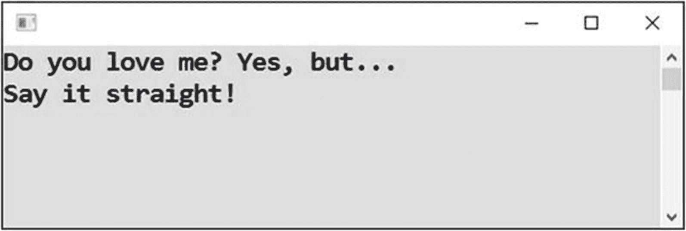
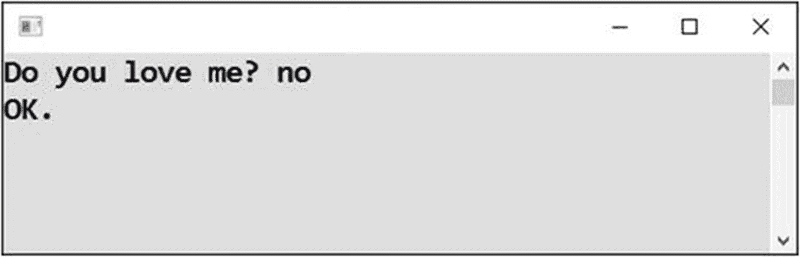
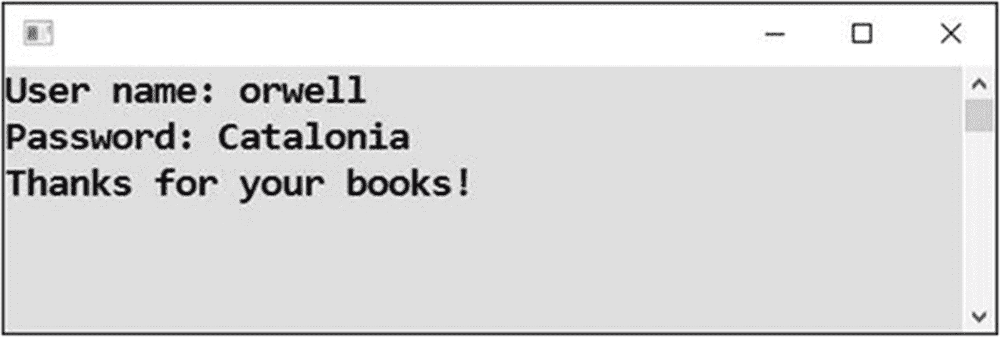
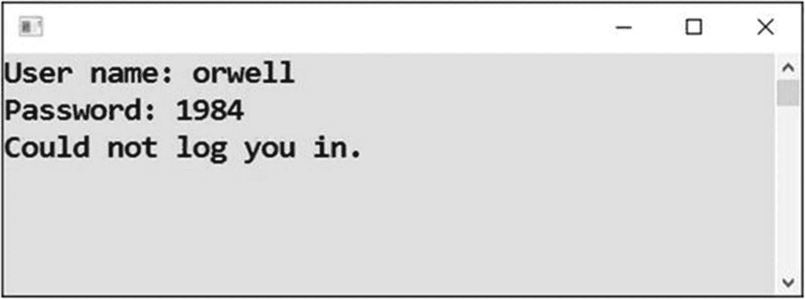
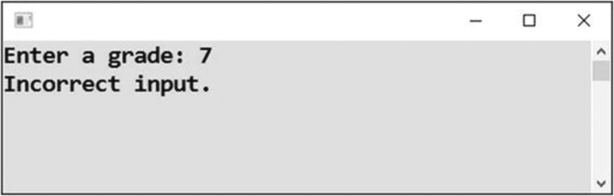
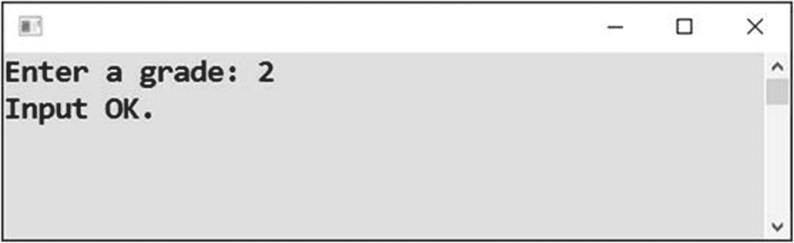

# 十七、复合条件

你现在已经有了一些用公式表达条件，并用它们来解决实际问题的经验。对于更复杂的问题，你经常需要的是把两个或更多的部分条件组合起来。这就是你将在本章学习的内容。

## 是或否

复合条件的第一个用途是检查用户输入是否属于允许的选项之一。

### 工作

您将编写一个程序来检查用户输入的*是*是*还是*否。所有其他输入都将被视为不正确(参见图 [17-1](#Fig1) 和 [17-2](#Fig2) )。



图 17-2

是啊！



图 17-1

可以接受的回答但是很难过

### 解决办法

代码如下:

```cs
static void Main(string[] args)
{
    // Input
    Console.Write("Do you love me? ");
    string input = Console.ReadLine();

    // Evaluating
    string inputInSmall = input.ToLower();
    if (inputInSmall == "yes" || inputInSmall == "no")
    {
        Console.WriteLine("OK.");
    }
    else
    {
        Console.WriteLine("Say it straight!");
    }

    // Waiting for Enter
    Console.ReadLine();
}

```

### 讨论

请注意以下几点:

*   为了忽略大小写的差异，您将输入转换为小写字母。

*   使用的条件是复合条件。它由使用条件 OR 运算符连接的两个部分条件组成，类型为||(两条垂直线)。

*   如果部分条件的至少一个被满足，则条件被满足(并且`if`分支被执行)。这意味着用户输入了*是*是*或*否。在这种情况下，选项是互斥的。但是，您会遇到两个条件同时满足的情况。

*   如果第一或第二部分条件都不满足，则条件不满足(并且执行`else`分支)。换句话说，用户输入了除是或否之外的内容。

## 用户名和密码

现在，您将看到应该同时满足的部分条件。

### 工作

您将编写一个程序，检查用户是否输入了正确的用户名(Orwell) *并同时输入了正确的密码(Catalonia)。用户名不区分大小写，这意味着它可以是小写和大写(参见图 [17-3](#Fig3) 和 [17-4](#Fig4) )。*



图 17-4

正确的用户名和密码



图 17-3

用户名正确，但密码不正确

### 解决办法

代码如下:

```cs
static void Main(string[] args)
{
    // Correct values
    string correctUsername = "Orwell";
    string correctPassword = "Catalonia";

    // Inputs
    Console.Write("User name: ");
    string enteredUserName = Console.ReadLine();

    Console.Write("Password: ");
    string enteredPassword = Console.ReadLine();

    // Evaluating
    if (enteredUserName.ToLower() == correctUsername.ToLower() &&
        enteredPassword == correctPassword)
    {
        Console.WriteLine("Thanks for your books!");
    }
    else
    {
        Console.WriteLine("Could not log you in.");
    }

    // Waiting for Enter
    Console.ReadLine();
}

```

### 讨论

请注意以下几点:

*   使用的条件也是一个复合条件。它的部分条件使用条件 AND 运算符连接，该运算符的类型为&&(两个&符号)。

*   如果*和*两个部分条件同时满足，则条件满足(执行`if`分支)。这意味着用户必须输入正确的用户名和密码。

*   不满足条件(并因此执行`else`分支)，不满足任何一个部分条件就足够了。

## 裤子

您甚至可以组合几个 AND 和 OR 操作符来得到一个真正复杂的复合条件。看一看！

### 工作

您将修改前面的任务，以允许两个可能的用户登录。两者都有自己的密码。

### 解决办法

代码如下:

```cs
static void Main(string[] args)
{
    // Correct values
    string correctUsername1 = "Orwell";
    string correctPassword1 = "Catalonia";

    string correctUsername2 = "Blair";
    string correctPassword2 = "1984";

    // Inputs
    Console.Write("User name: ");
    string enteredUsername = Console.ReadLine();

    Console.Write("Password: ");
    string enteredPassword = Console.ReadLine();

    // Evalulating
    if (enteredUsername.ToLower() == correctUsername1.ToLower() &&
        enteredPassword == correctPassword1 ||
        enteredUsername.ToLower() == correctUsername2.ToLower() &&
        enteredPassword == correctPassword2)
    {
        Console.WriteLine("Thanks for your books!");
    }
    else
    {
        Console.WriteLine("Could not log you in.");
    }

    // Waiting for Enter
    Console.ReadLine();
}

```

### 讨论

请注意以下几点:

*   您可以将两个条件运算符:AND 与 OR 结合使用。

*   满足完整条件要求用户输入正确的第一用户名和正确的第一密码，或者输入正确的第二用户名和正确的第二密码。

*   与 or 运算符相比，条件有意为 AND 运算符使用更高优先级的*(优先级)。具体来说，首先评估两个潜在用户，然后对部分结果进行“或”运算。*

**   如果需要不同的求值顺序，只需像数学一样使用圆括号(圆括号)即可。* 

 *## 条件的预先计算

前面练习中的复合条件已经相当复杂了。要理解这一点，阅读时必须集中注意力。在类似的情况下，预先计算(提前计算)部分条件可能更好。这就是我现在要给你看的。

### 工作

任务和上一个是一样的，但是解决方案会不一样。

### 解决办法

代码如下:

```cs
static void Main(string[] args)
{
    // Correct values
    string correctUsername1 = "Orwell";
    string correctPassword1 = "Catalonia";

    string correctUsername2 = "Blair";
    string correctPassword2 = "1984";

    // Inputs
    Console.Write("User name: ");
    string enteredUsername = Console.ReadLine();
    Console.Write("Password: ");
    string enteredPassword = Console.ReadLine();

    // Evaluating
    bool user1ok = enteredUsername.ToLower() == correctUsername1.ToLower() &&
                    enteredPassword == correctPassword1;
    bool user2ok = enteredUsername.ToLower() == correctUsername2.ToLower() &&
                    enteredPassword == correctPassword2;
    if (user1ok || user2ok)
    {
        Console.WriteLine("Thanks for your books!");
    }
    else
    {
        Console.WriteLine("Could not log you in.");
    }

    // Waiting for Enter
    Console.ReadLine();
}

```

### 讨论

请注意以下几点:

*   您一个接一个地检查两个用户。这样，主条件就可以用一种清晰简洁的方式写出来。

*   部分条件被预先计算成`bool`类型的变量。当条件满足时，相应变量的值被设置为`true`。

## 是或否反转

你已经在第 [15](15.html) 章中学习了反转条件。在那一章中，条件很简单。现在，您将逆转一个复合条件，这有点棘手，需要更加小心。

### 工作

你将再次回到本章开头的“是或否”项目。出于练习复合条件的目的，考虑如何颠倒原始条件来交换`if`和`else`分支。

### 解决办法

下面是代码:

```cs
static void Main(string[] args)
{
    // Input
    Console.Write("Do you love me? ");
    string input = Console.ReadLine();

    // Evaluating
    string inputInSmall = input.ToLower();
    if (inputInSmall != "yes" && inputInSmall != "no")
    {
        Console.WriteLine("Say it straight!");
    }
    else
    {
        Console.WriteLine("OK.");
    }

    // Waiting for Enter
    Console.ReadLine();
}

```

### 讨论

请注意以下几点:

*   您现在检查的不是正确的输入，而是不正确的输入。

*   当输入既不等于“是”也不等于“否”时，则输入不正确。

*   颠倒条件导致 OR 运算符变为 AND 运算符。它还导致平等变成不平等。

## 等级检查

现在我想把你的注意力转向一个属于特定集合或特定范围的数字的频繁测试。以下两项任务与此相关。

### 工作

用户输入学生的成绩。然后，程序将检查输入的数字是否在可能值 1、2、3、4 或 5 的集合中(见图 [17-5](#Fig5) 和 [17-6](#Fig6) )。



图 17-6

不在范围内



图 17-5

在范围内

### 解决办法

这个条件可以用列举单个选择的公式来表达。为了简单起见，我不检查可能的非数字输入。您可以像往常一样使用`try-catch`自行处理。

代码如下:

```cs
static void Main(string[] args)
{
    // Input
    Console.Write("Enter a grade: ");
    string input = Console.ReadLine();
    int grade = Convert.ToInt32(input);

    // Evaluating
    if (grade == 1 ||
        grade == 2 ||
        grade == 3 ||
        grade == 4 ||
        grade == 5)
    {
        Console.WriteLine("Input OK.");
    }
    else
    {
        Console.WriteLine("Incorrect input.");
    }

    // Waiting for Enter
    Console.ReadLine();
}

```

## 更好的范围检查

允许的数字(可能的等级)实际上构成了一个一到五的范围(一个连续的没有间隙的范围)。在这种情况下，您可以使用更好的方法来检查一个数字是否属于特定的范围。

### 工作

任务是使用范围检查解决前面的练习。

### 解决办法

当一个数大于或等于下界，同时又小于或等于上界时，它就属于由其下界和上界给定的范围。

代码如下:

```cs
static void Main(string[] args)
{
    // Input
    Console.Write("Enter a grade: ");
    string input = Console.ReadLine();
    int grade = Convert.ToInt32(input);

    // Evaluating
    if (grade >= 1 && grade <= 5)
    {
        Console.WriteLine("Input OK.");
    }
    else
    {
        Console.WriteLine("Incorrect input.");
    }

    // Waiting for Enter
    Console.ReadLine();
}

```

## 摘要

本章向您介绍了复合条件的主题。您已经了解到,`if`语句条件可以通过使用条件 AND 和条件 OR 操作符将几个部分条件连接在一起来复合。

在 C# 中，AND 运算符被写成`&&`，当两个部分条件都满足时，它的计算结果为`true`。另一方面，OR 运算符被写成`||`，当至少一个部分条件满足时，它的计算结果为`true`。

您还看到了大量的部分条件组合成一个条件。在这种情况下，运算符优先级的问题很重要。如果没有括号，则和总是在或之前计算。但是，请注意，这些条件可能会变得相当复杂和难以理解。建议预先分别计算整个条件的各个部分，并将它们临时存储在`bool`类型的变量中。

我还试图让你注意到逆转复合条件的问题，这需要额外的关注和专注才能做好。具体来说，您了解到在反转时，and 被切换为 or(反之亦然)，等式变为不等式(反之亦然)。

最后，我向您展示了如何检查一个数字是属于指定的集合还是指定的范围。在后一种情况下，您对范围的下限和上限执行了同步测试。*