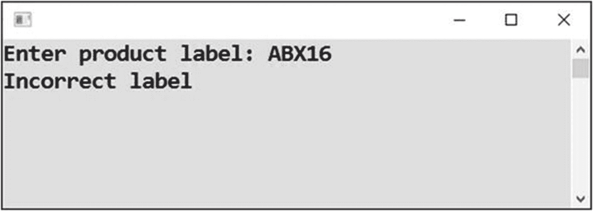

# 十九、高级条件

本书的第三部分以几个关于条件执行的任务结束，这些任务可能被认为是高级的。首先，你将学习条件运算符，然后你将编写一个包含几个复杂条件的程序，最后你将学习一条重要的格言:当你想测试某个东西时，你必须确定它存在。

## 条件运算符

在许多情况下，`if-else`结构可以用条件操作符代替，这将根据条件是否满足而产生两个值中的一个。如果你知道 Excel 的`IF`函数，你会发现条件运算符很熟悉。

### 工作

你将使用条件运算符(见图 [19-1](#Fig1) )解决前面的“头尾”任务(来自第 [16 章](16.html))。


图 19-1

使用条件运算符

### 解决办法

代码如下:

```cs
static void Main(string[] args)
{
    // Random number generator
    Random randomNumbers = new Random();

    // Random number 0/1 and its transformation
    int randomNumber = randomNumbers.Next(0, 1 + 1);
    string message = randomNumber == 0 ? "Head tossed" : "Tail tossed";
    Console.WriteLine(message);

    // Waiting for Enter
    Console.ReadLine();
}

```

### 讨论

条件运算符(`?:`)的语法如下所示:

*   `condition ? yesValue : noValue`

这种表达式的结果如下:

*   *yes 值*如果*条件*成立(满足)

*   *新值*否则

#### 该计划

在这种情况下，条件是`randomNumber`变量相对于零的相等测试。如果为真，`message`变量被赋予“头被甩”的文本。否则，它将被分配“抛尾”文本。

#### 术语

条件运算符也被称为*三元*运算符，因为它是唯一接受三个操作数(它处理的值)的运算符:条件、 *yesValue* 和 *noValue* 。

## 汇总评估

现在，您将在现实情况下练习更复杂的条件。

### 工作

任务是编写一个对学生进行总结评估的程序(见图 [19-2](#Fig2) )。用户输入四个科目的等级(从一到五，其中一个是最好的)。用户还指定所考虑的学生是否无故缺席。然后，程序会给出一个总结性的评估，这是一种总体评分:


图 19-2

对学生的总结评价

*   优秀的

*   好的

*   不成功的

### 细节

我在第 [18](18.html) 章中强调，为了能够编写任何东西，你需要准确理解正在解决的任务。在当前练习中，您需要为汇总评估指定确切的标准。

在以下情况下，学生的评估为优秀

*   所有成绩的算术平均值不高于 1.5。

*   该学生没有任何成绩低于 2 分。

*   这个学生没有任何无故缺席。

当学生的成绩中至少有一项是 5 分时，他们被认为是不及格。

在所有其他情况下，总结评估为*良好*。

你现在大概可以猜到，这个程序不会是无足轻重的。

### 解决办法

代码如下:

```cs
static void Main(string[] args)
{
    // 1\. PREPARATIONS
    string errorMessage = "Incorrect input";
    int mathematics, informationTechnology, science, english;
    bool hasUnexcusedAbsences;

    // 2\. INPUTS
    try
    {
        Console.WriteLine("Enter grades from individual subjects:");

        Console.Write("Mathematics: ");
        string input = Console.ReadLine();
        mathematics = Convert.ToInt32(input);
        if (mathematics < 1 || mathematics > 5)
        {
            Console.WriteLine(errorMessage);
            return;
        }

        Console.Write("Information technology: ");
        input = Console.ReadLine();
        informationTechnology = Convert.ToInt32(input);
        if (informationTechnology < 1 || informationTechnology > 5)
        {
            Console.WriteLine(errorMessage);
            return;
        }

        Console.Write("Science: ");
        input = Console.ReadLine();
        science = Convert.ToInt32(input);
        if (science < 1 || science > 5)
        {
            Console.WriteLine(errorMessage);
            return;
        }

        Console.Write("English: ");
        input = Console.ReadLine();
        english = Convert.ToInt32(input);
        if (english < 1 || english > 5)
        {
            Console.WriteLine(errorMessage);
            return;
        }

        Console.Write("Any unexcused absences? (yes/no): ");
        input = Console.ReadLine();
        input = input.ToLower(); // not distinguishing upper/lower
        if (input != "yes" && input != "no")
        {
            Console.WriteLine(errorMessage);
            return;
        }
        hasUnexcusedAbsences = input == "yes";
    }
    catch (Exception)
    {
        Console.WriteLine(errorMessage);
        return;
    }

    // 3\. EVALUATION
    // You need arithmetic average of all the grades
    double average = (mathematics + informationTechnology + science + english) / 4.0;
    string message;

    // Testing all conditions for excellence
    if (average < 1.5001 &&
        mathematics <= 2 && informationTechnology <= 2 &&
        science <= 2 && english <= 2 &&
        !hasUnexcusedAbsences)
    {
        message = "Excellent";
    }
    else
    {
        // Here you know the result is not excellent, so testing the other two possibilities
        if (mathematics == 5 || informationTechnology == 5 ||
            science == 5 || english == 5)
        {
            message = "Failed";
        }
        else
        {
            message = "Good";
        }
    }

    // 4\. OUTPUT
    Console.WriteLine("Summary evaluation: " + message);

    // Waiting for Enter
    Console.ReadLine();
}

```

### 讨论

以下部分解释了该程序。

#### 等级输入

在本练习中，您非常关心输入数据检查。一个`try-catch`包装了整个输入部分。你还需要检查分数是否属于一到五的范围。

请注意，坡度小于 1 或大于 5 表示有错误。您使用了`||`操作符(“至少一个”)。

#### 程序终止

错误的输入会立即终止程序。这里使用了`return`语句来终止子程序。但是在`Main`内部使用时，直接终止整个程序。

#### 是/否输入

要输入学生是否无故缺席，用户可以输入 yes 或 no。yes 和 no 的输入差异表示有错误。我使用了`&&`操作符(“同时”)。

在检查之前，您将输入转换成小写，这样它就不会介意用户使用大写字母。

有趣的是包含单等号和双等号的行(单等号用于赋值，双等号用于比较):

```cs
hasUnexcusedAbsences = input == "yes";

```

根据等式是否成立，`==`操作符的“工作”产生一个`true`或`false`值。然后将结果值赋给`bool`类型的`hasUnexcusedAbsences`变量。

#### 当心整数除法！

计算平均成绩时，将总和除以 4.0，而不是 4。您不希望计算机将斜杠视为整数除法运算符。这就是为什么你在避免`int`被`int`除。

如果您只输入 4，那么 1，2，2，2 等级的情况将被错误地评估为优秀，因为平均值将被精确计算为 1，而不是正确的 1.75！

#### 小数运算

你为什么按如下方式输入平均值的检查？

```cs
average < 1.5001

```

你为什么不用下面的？

```cs
average <= 1.5

```

这是因为十进制算术不一定要精确。有时，计算机可能会计算出类似于 1.500000000001 的值，而不是正确的 1.5。这就是为什么你在测试中使用稍微大一点的数字。

## 第二个性测试

许多程序崩溃是因为程序员在访问某个程序之前忘记测试它是否存在。这个任务将是你对这个常见问题的第一次了解。

### 工作

我将向您展示如何测试输入文本的第二个字符。假设一个产品标签必须在第二个位置有一个大写字母 *X* (见图 [19-3](#Fig3) 和 [19-4](#Fig4) )。



图 19-4

测试第二个字符，不正确


图 19-3

测试第二个字符，对吗

为什么这样一个测试如此重要，以至于我决定让你熟悉它？您需要首先测试第二个字符是否存在。这是你会经常遇到的；在你发现某样东西存在之前，你将无法测试它！

在这种情况下，程序不得因空输入或输入过短而崩溃(见图 [19-5](#Fig5) )。


图 19-5

标签不正确，不崩溃

### 解决办法

代码如下:

```cs
static void Main(string[] args)
{
    // Input
    Console.Write("Enter product label: ");
    string label = Console.ReadLine();

    // Evaluating
    if (label.Length >= 2 && label.Substring(1, 1) == "X")
    {
        Console.WriteLine("Label is OK");
    }
    else
    {
        Console.WriteLine("Incorrect label");
    }

    // Waiting for Enter
    Console.ReadLine();
}

```

### 讨论

以下部分解释了该程序。

#### 获得角色

使用`Substring`方法访问第二个字符，该方法通常从给定文本中提取特定部分(*子串*)。该方法需要两个参数:

*   *所需子串*的第一个字符的位置:位置编号从零开始，所以第二个字符位置是 1。

*   *所需子串的字符数*:在这种情况下，你需要的只是单个字符，这就是为什么第二个参数也是一个。

#### 存在测试

测试一个给定的字符是否等于某个东西有一个隐藏的陷阱:第二个字符根本不需要存在。当用户输入零个或一个字符时会出现这种情况。

在这种情况下，`Substring(1,1)`调用会导致运行时错误。

这意味着您必须首先测试文本是否至少有两个字符长。只有通过这个测试，你才能进入第二个角色。

代码中有一个复合条件，如下所示:

```cs
if (label.Length >= 2 && label.Substring(1, 1) == "X")

```

其功能依赖于`&&`操作员的*短路评估*。如果 AND 连接的第一个部分条件不成立，则第二个部分条件根本不会计算，因为它是无用的。即使它成立，也不会改变整体结果，因为 AND 运算符要求两部分同时成立。

在这种情况下，当一个标签的长度小于 2 时，那么会失败的`Substring`调用将被跳过，程序不会崩溃！

注意，对于`||`操作符也可以做类似的陈述。

#### 一项实验

尽量省略第一个部分条件(长度检查)。然后输入一个字符作为用户。程序将因运行时错误而终止。这样你会发现第一个条件真的很重要。

## 摘要

在本章中，您学习了几个高级条件的示例。

您从所谓的条件运算符(`?:`)开始，它也被称为三元运算符，因为它与三个值一起工作。根据指定条件(第一个值，在问号之前)的满足情况，操作符的“工作”结果要么是 *yesValue* (第二个值，在问号和冒号之间)，要么是 *noValue* (第三个值，在冒号之后)。对于某些类型的`if-else`情况，条件操作符是一种合适的快捷替代方式。

汇总求值的中间任务是一种对你所学的关于条件执行的所有东西的回顾。在这里，您遇到了各种测试和许多复合条件，以及使用`!`操作符的否定。

测试某些文本的第二个字符的最后一个任务向您展示了在探索第二个字符是什么之前测试它是否存在的重要性。这里你使用了短路条件评估。如果复合条件的结果在第一个部分条件被评估之后已经可以被决定，那么第二个部分条件被完全跳过。