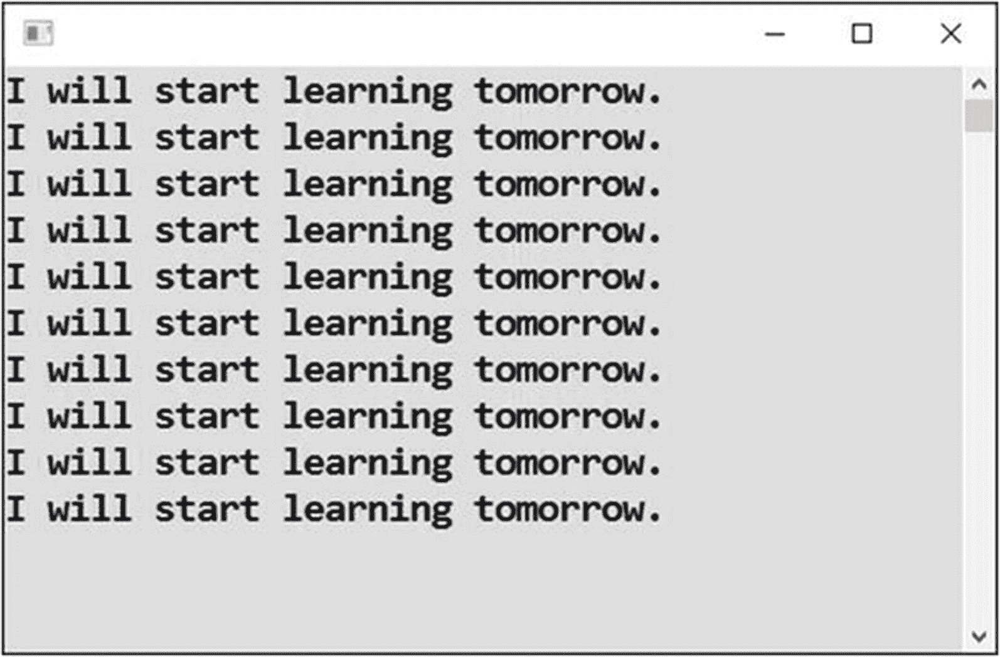
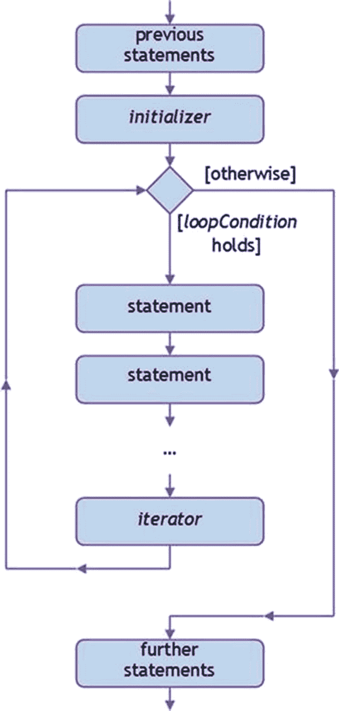
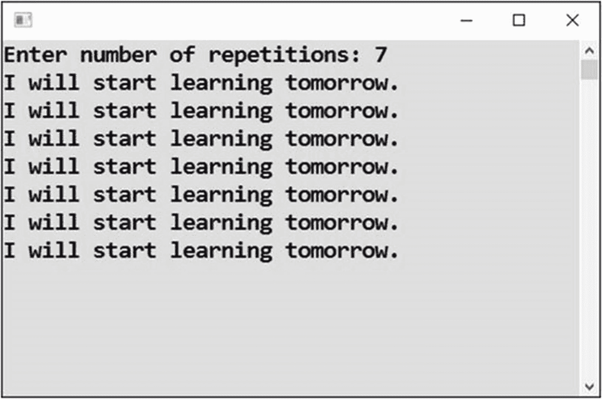
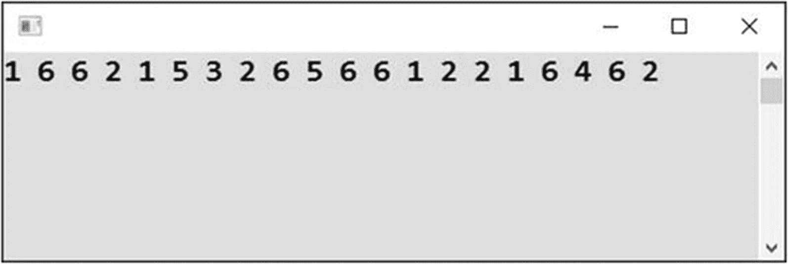
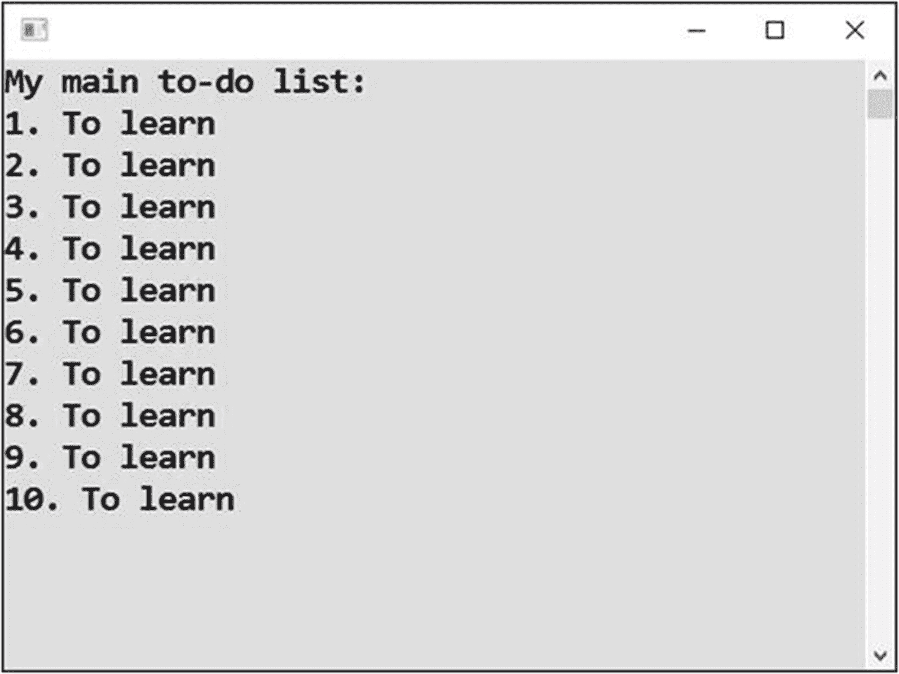

# 二十、第一个循环

你正在进入这本书最难的章节。循环是一个强大的工具，所有程序员都像呼吸空气一样需要它。理解循环是不容易的，这就是为什么你会经历许多循环的练习。

## 重复相同的文本

循环是一种工具，用于高效地重复编写相同或更常见的类似活动。为了正确理解循环，你将两次解决一些任务，第一次不带循环，第二次带循环。您将从重复相同的活动开始，之后您将继续使用循环来重复类似的活动。

### 工作

你将编写一个程序，显示“我明天开始学习。”连续十次(见图 [20-1](#Fig1) )。



图 20-1

十次重复

### 解决办法

代码如下:

```cs
static void Main(string[] args)
{
    // Output
    Console.WriteLine("I will start learning tomorrow.");
    Console.WriteLine("I will start learning tomorrow.");
    Console.WriteLine("I will start learning tomorrow.");
    Console.WriteLine("I will start learning tomorrow.");
    Console.WriteLine("I will start learning tomorrow.");

    Console.WriteLine("I will start learning tomorrow.");
    Console.WriteLine("I will start learning tomorrow.");
    Console.WriteLine("I will start learning tomorrow.");
    Console.WriteLine("I will start learning tomorrow.");
    Console.WriteLine("I will start learning tomorrow.");

    // Waiting for Enter
    Console.ReadLine();
}

```

### 使用循环的解决方案

想一想之前的练习。你能想象有人想要你改变显示的句子吗？你能想象重复一百次而不是十次吗？你能想象用户输入的重复次数吗？

要解决这些问题，你需要一个新的工具:循环。

### 解决办法

代码如下:

```cs
static void Main(string[] args)
{
    // Output
    for (int count = 0; count < 10; count++)
    {
        Console.WriteLine("I will start learning tomorrow.");
    }

    // Waiting for Enter
    Console.ReadLine();
}

```

### for 循环的工作原理

你用`for`结构来表示重复。它的一般语法如下所示:

```cs
for (initializer; loopCondition; iterator)
{
    statement;
    statement;
    statement;
    ...
}

```

`for`循环是这样工作的:

*   `initializer`在进入循环前执行一次。

*   `loopCondition`在循环的每一个回合之前被评估。如果它成立，计算机就进入循环并执行它体内的语句。

*   `iterator`语句在循环的每一次循环完成后执行。之后，`loopCondition`再次求值。

图 [20-2](#Fig2) 显示了程序流程。



图 20-2

程序流程

### 循环

在这种情况下，所需的重复次数是通过计算到目前为止完成的循环圈数来实现的。为此，您可以使用 count 变量。

在开始时(*初始化器*)，变量被设置为零。

完成每一次循环(*迭代器*)后，变量加 1。

只要(`loopCondition`)输出中的行数没有达到十，循环体(显示一行文本)就会重复。一旦`count`变量变为 10，条件(`count` < 10 或 10 < 10)将不再满足，循环将终止，计算机将继续执行循环后的语句。

### 自己去探索吧

您应该花时间探索循环的内部工作方式，以便彻底掌握它们。使用你已经知道的调试工具:步进并检查`count`变量。

### 小费

Visual Studio 可以帮你写一个`for`循环，不会出错。只需输入`for`，按两下 Tab 键，编辑生成的循环头即可。

## 选择重复次数

`for`循环允许您在事先不知道重复次数的情况下解决问题(在编写代码时)。

### 工作

您将修改之前的练习，让用户指定句子重复的次数(参见图 [20-3](#Fig3) )。



图 20-3

让用户指定句子重复的次数

### 解决办法

代码如下:

```cs
static void Main(string[] args)
{
    // Input
    Console.Write("Enter number of repetitions: ");
    string input = Console.ReadLine();
    int howManyTimes = Convert.ToInt32(input);

    // Output
    for (int count = 0; count < howManyTimes; count++)
    {
        Console.WriteLine("I will start learning tomorrow.");
    }

    // Waiting for Enter
    Console.ReadLine();
}

```

### 讨论

请注意以下几点:

*   与前一个任务相比，您用用户输入的变量值替换了固定的重复次数。

*   仔细选择变量的名称，以存储所需的总重复次数；这里是`howManyTimes`。具体来说，您应该将它与存储当前重复次数的`count`变量区分开来。

## 反复投掷骰子

您将看到另一个重复相同活动的例子。

### 工作

你将编写一个投掷骰子 20 次的程序(见图 [20-4](#Fig4) )。



图 20-4

投掷骰子 20 次

### 解决办法

代码如下:

```cs
static void Main(string[] args)
{
    // Random number generator
    Random randomNumbers = new Random();

    // Output
    for (int count = 0; count < 20; count++)
    {
        int thrown = randomNumbers.Next(1, 6 + 1);
        Console.Write(thrown.ToString() + " ");
    }

    // Waiting for Enter
    Console.ReadLine();
}

```

## 重复类似的台词

如果重复的活动不是相同的而是相似的呢？

### 工作

您将输出十个相似的行，不同之处仅在于打印的行号(见图 [20-5](#Fig5) )。



图 20-5

输出十次类似的东西

### 没有循环的解决方案

同样，您可以从没有循环的解决方案开始，以体会循环的重要性。

代码如下:

```cs
static void Main(string[] args)
{
    // Output
    Console.WriteLine("My main to-do list:");

    Console.WriteLine("1\. To learn");
    Console.WriteLine("2\. To learn");
    Console.WriteLine("3\. To learn");
    Console.WriteLine("4\. To learn");
    Console.WriteLine("5\. To learn");
    Console.WriteLine("6\. To learn");
    Console.WriteLine("7\. To learn");
    Console.WriteLine("8\. To learn");
    Console.WriteLine("9\. To learn");
    Console.WriteLine("10\. To learn");

    // Waiting for Enter
    Console.ReadLine();
}

```

### 使用循环的解决方案

循环可以有效地解决这类问题。实际上，你会发现自己加入循环来重复相似的活动比重复完全相同的活动更频繁。

```cs
static void Main(string[] args)
{
    // Output
    Console.WriteLine("My main to-do list:");

    for (int taskNumber = 1; taskNumber <= 10; taskNumber++)
    {
        Console.WriteLine(taskNumber.ToString() + ". To learn");
    }

    // Waiting for Enter
    Console.ReadLine();
}

```

### 讨论

以下部分讨论了该计划。

#### 决策变量

解决方案的核心是使用循环体内部的控制变量的值。在这个程序中，您将变量命名为`taskNumber`，并将它的值用于输出。

这就是如何在循环的第一段显示一个，在第二段显示两个，依此类推。

使用调试工具亲自检查情况。

#### 循环从 1 开始

前面的练习(重复投掷骰子)使用了控制变量从 0 到 19 的循环。与此相反，这次从 1 开始比从 0 开始更方便。这一改变也导致了循环条件的改变。您使用了“小于或等于”测试，而不是“小于”测试。

## 摘要

本章向您介绍了循环的主题，这是一个强大的编程工具，允许您指定相同的重复，或者更常见的是，类似的活动。

对于循环，C# 提供了几种编程结构；在本章中，你学习了最基本的`for`循环。在代码中,`for`循环由一个控制循环的标题和一个主体组成，主体由用大括号括起来的要重复的语句组成。标题本身由分号分隔的三部分组成:

*   *初始化器*是在循环开始“循环”之前要执行一次的语句

*   *循环条件*是每次循环前评估的条件。如果满足(即评估为`true`)，则执行循环体的另一轮语句。如果不满足(即评估为`false`)，循环终止，程序继续执行循环后的语句。

*   *迭代器*是循环每一次循环后要执行的语句。

为了更深入地理解`for`循环是如何工作的，一定要使用调试工具，比如步进和内存检查。

`for`循环通常由一个变量控制，其工作方式或多或少类似于循环圈数的计数器。这个变量叫做*控制变量*。在上一个任务中，您学习了如何在循环体中使用控制变量的值。