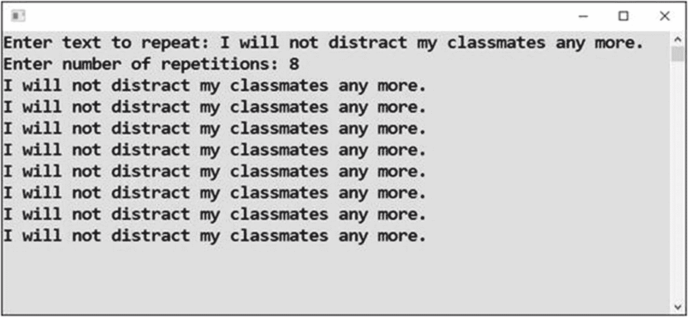
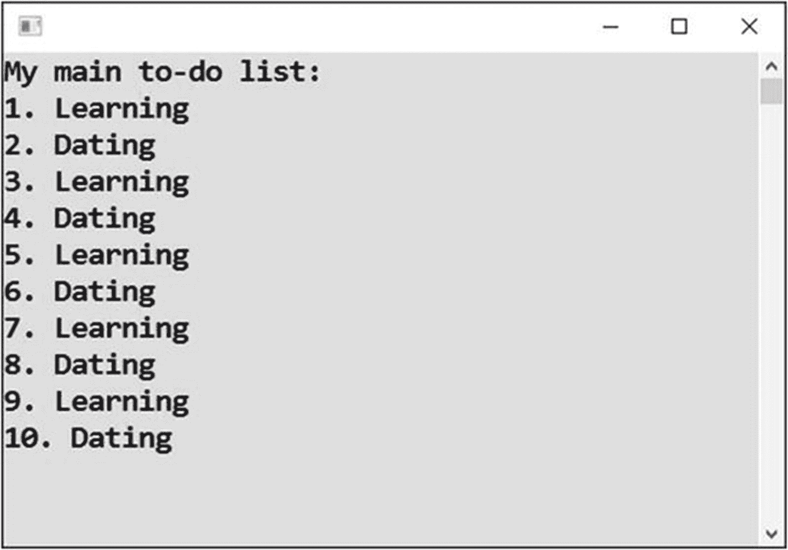
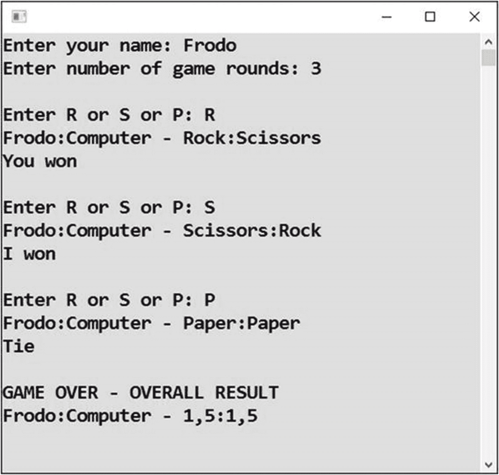

# 二十一、改善循环

正如您所了解的，循环是强大的，并且它们不是微不足道的。这就是为什么本书的其余章节都致力于更好地理解循环。让我们进行一些更难的练习。

## 选择文本

首先，你将回到上一章的课文重复练习，并对其进行改进。

### 工作

在“选择重复次数”部分，用户可以改变给定句子的重复次数。现在你将允许用户改变句子本身(见图 [21-1](#Fig1) )。



图 21-1

改变句子

### 解决办法

代码如下:

```cs
static void Main(string[] args)
{
    // Inputs
    Console.Write("Enter text to repeat: ");
    string textToRepeat = Console.ReadLine();

    Console.Write("Enter number of repetitions: ");
    string input = Console.ReadLine();
    int howManyTimes = Convert.ToInt32(input);

    // Output
    for (int count = 0; count < howManyTimes; count++)
    {
        Console.WriteLine(textToRepeat);
    }

    // Waiting for Enter
    Console.ReadLine();
}

```

## 交替循环

通常，你需要重复一些活动。你做第一件事，然后第二件，再做第一件，以此类推。在代码中查看这样的任务是很有趣的。我将向你展示解决这个问题的三种方法。

### 工作

您将编写一个程序，在待办事项列表中的两个任务之间进行交替(参见图 [21-2](#Fig2) )。



图 21-2

在两个任务之间交替

### 第一种解决方案

第一种解决方案是基于区分循环的控制变量(从 1 到 10)是奇数还是偶数。当它是奇数时，你显示“学习”当它是偶数时，你显示“约会”

奇数/偶数测试将通过检查整数除以 2 后的余数来执行。提醒您一下，余数是用 C# 中的百分号(`%`)运算符计算的。

```cs
static void Main(string[] args)
{
    // Output
    Console.WriteLine("My main to-do list:");

    for (int taskNumber = 1; taskNumber <= 10; taskNumber++)
    {
        string taskText = taskNumber % 2 != 0 ? "Learning" : "Dating";
        Console.WriteLine(taskNumber.ToString() + ". " + taskText);
    }

    // Waiting for Enter
    Console.ReadLine();
}

```

#### 注意

您将奇数/偶数测试合并到一个条件(三元)运算符(`?:`)中。你也可以用普通的`if-else`。

### 第二种解决方案

第二种解决方案是来回切换布尔值。

你有一个`bool`类型的变量，在循环的每一次循环中，你可以从`true`切换到`false`，反之亦然。当变量等于`true`时，显示第一个文本。当它是`false`时，你显示第二个。

```cs
static void Main(string[] args)
{
    // Preparations
    Console.WriteLine("My main to-do list:");
    bool learning = true;

    for (int taskNumber = 1; taskNumber <= 10; taskNumber++)
    {
        // Output
        string taskText = learning ? "Learning" : "Dating";
        Console.WriteLine(taskNumber.ToString() + ". " + taskText);

        // Toggling of the flag
        learning = !learning;
    }

    // Waiting for Enter
    Console.ReadLine();
}

```

#### 笔记

请注意以下几点:

*   条件不必作为`learning == true`输入。`learning`变量已经是`bool`类型的，这意味着你可以直接把它作为一个条件使用。当它是`true`时，条件成立。

*   在进入循环之前，需要设置变量的初始值。初始值在循环的第一次循环中使用。在这种情况下，您将其设置为`true`。

*   使用求反运算符(`!`)从`true`切换到`false`，反之亦然。

### 第三种解决方案

解决方案的第三种方法是重复循环五次而不是十次，并且在循环的单个回合中执行“奇数活动”和“偶数活动”。

代码如下:

```cs
static void Main(string[] args)
{
    // Preparations
    Console.WriteLine("My main to-do list:");
    int taskNumber = 1;

    for (int coupleCount = 0; coupleCount < 5; coupleCount++)
    {
        // Couple output and adjusting task number
        Console.WriteLine(taskNumber.ToString() + ". Learning");
        taskNumber++;
        Console.WriteLine(taskNumber.ToString() + ". Dating");
        taskNumber++;
    }

    // Waiting for Enter
    Console.ReadLine();
}

```

## 石头剪刀布

在下一个练习中，您将看到`for`循环体中有许多语句。循环将代表游戏的单个回合。

### 工作

您将编写一个程序，与用户玩指定回合数的石头剪刀布游戏(见图 [21-3](#Fig3) )。



图 21-3

游戏

得分类似于国际象棋:胜利得一分，平局得半分。

### 解决办法

代码如下:

```cs
static void Main(string[] args)
{
    // Preparations
    Random randomNumbers = new Random();

    double playerPoints = 0;
    double computerPoints = 0;

    int rock = 1, scissors = 2, paper = 3;

    // Inputs
    Console.Write("Enter your name: ");
    string playerName = Console.ReadLine();

    Console.Write("Enter number of game rounds: ");
    string input = Console.ReadLine();
    int totalRounds = Convert.ToInt32(input);

    Console.WriteLine();

    // Individual rounds
    for (int roundNumber = 0; roundNumber < totalRounds; roundNumber++)
    {
        // Computer chooses
        int computerChoice = randomNumbers.Next(1, 3 + 1);

        // Player chooses
        Console.Write("Enter R or S or P: ");
        string playerInput = Console.ReadLine();
        string playerInputUppercase = playerInput.ToUpper();
        int playerChoice = playerInputUppercase == "R" ?
            rock : (playerInputUppercase == "S" ? scissors : paper);

        // Round evaluation
        string message = "";
        if (computerChoice == rock && playerChoice == scissors ||
            computerChoice == scissors && playerChoice == paper ||
            computerChoice == paper && playerChoice == rock)
        {
            // Computer won
            computerPoints += 1;
            message = "I won";
        }
        else
        {
            // Tie or player won
            if (computerChoice == playerChoice)
            {
                // Tie
                computerPoints += 0.5;
                playerPoints += 0.5;
                message = "Tie";
            }
            else
            {
                // Player won
                playerPoints += 1;
                message = "You won";
            }
        }

        // Round output
        string playerChoiceInText = playerChoice == rock ?
            "Rock" : (playerChoice == scissors ? "Scissors" : "Paper");
        string computerChoiceInText = computerChoice == rock ?
            "Rock" : (computerChoice == scissors ? "Scissors" : "Paper");
        Console.WriteLine(playerName + ":Computer - " +
            playerChoiceInText + ":" + computerChoiceInText);
        Console.WriteLine(message);
        Console.WriteLine();
    } // End of loop for game round

    // Game evaluation
    Console.WriteLine("GAME OVER - OVERALL RESULT");
    Console.WriteLine(playerName + ":Computer - " +
        playerPoints.ToString() + ":" + computerPoints.ToString());

    // Waiting for Enter
    Console.ReadLine();
}

```

### 讨论

请注意以下几点:

*   计算机用随机数“选择”:1 代表石头，2 代表剪刀，3 代表布。

*   为了简单起见，当用户输入 R、S 或 P 以外的内容时，您将其视为“纸张”

*   用户输入时不区分大小写。

*   在一些地方，三重分支是使用两个嵌套的条件(三元)运算符解决的，而不是使用两个嵌套的`if-else` s。请仔细注意第一个条件运算符的`noValue`是如何使用另一个条件运算符指定的，该运算符用括号括起来。

*   如果您不喜欢条件(三元)操作符，就不要使用它。它只是一个特殊`if-else`案例的捷径。我个人很喜欢，所以经常用。

## 摘要

在本章中，您继续学习了循环。第一个练习基本上是对你在前一章所学内容的提醒。您修改了以前的一项任务。

接下来，您了解了几种解决交替循环的方法，也就是说，循环重复相似的活动对。具体来说，您研究了以下解决方案:

*   基于控制变量是奇数还是偶数的交替输出

*   切换一个`bool`变量，指示您是否想要第一个输出

*   在单圈中完成两个动作

石头剪子布游戏的最后一个例子实际上不是以循环为中心的。循环只是重复游戏回合的手段。一轮游戏是一个真实的，更复杂的程序的例子，你可以用你在本书中学到的知识来完成。